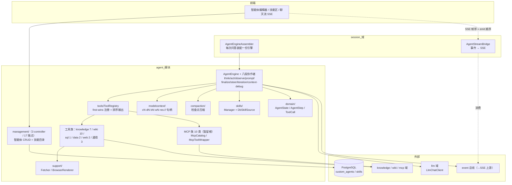
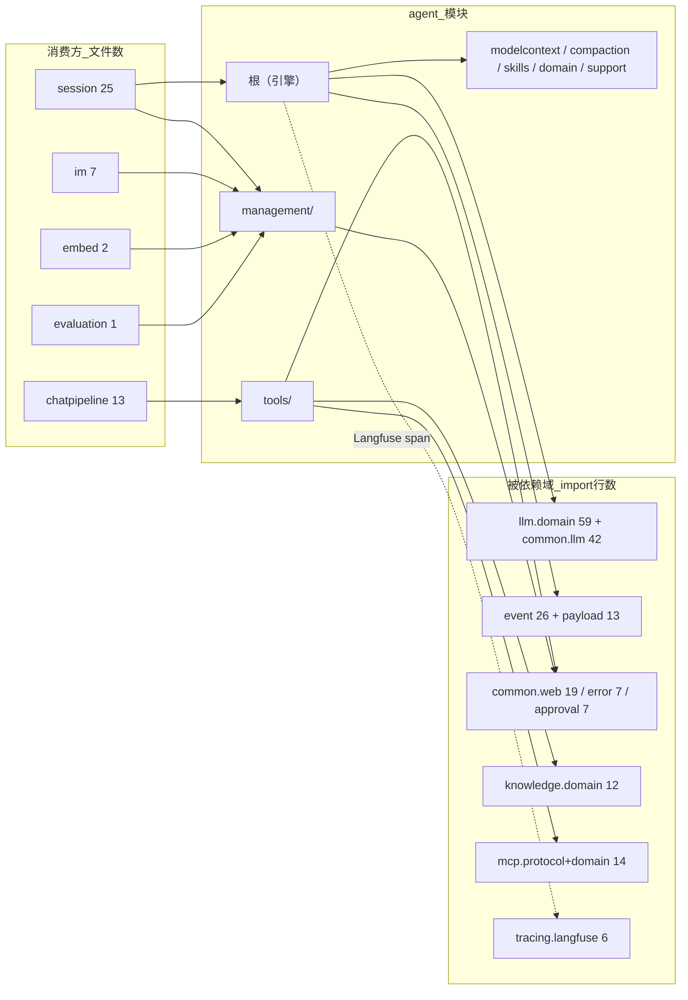
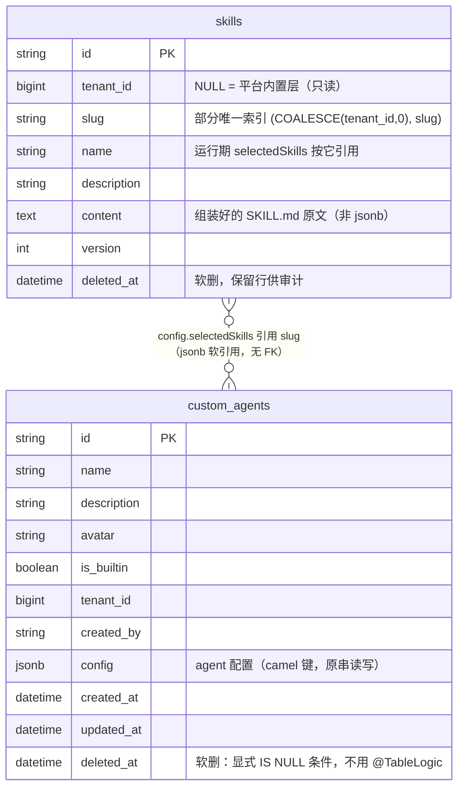
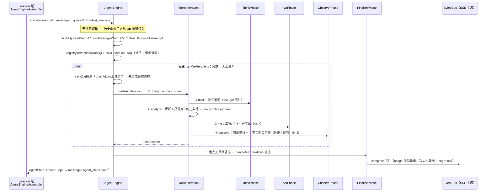
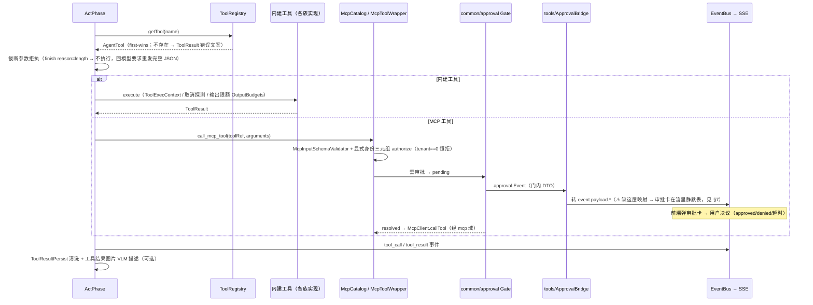
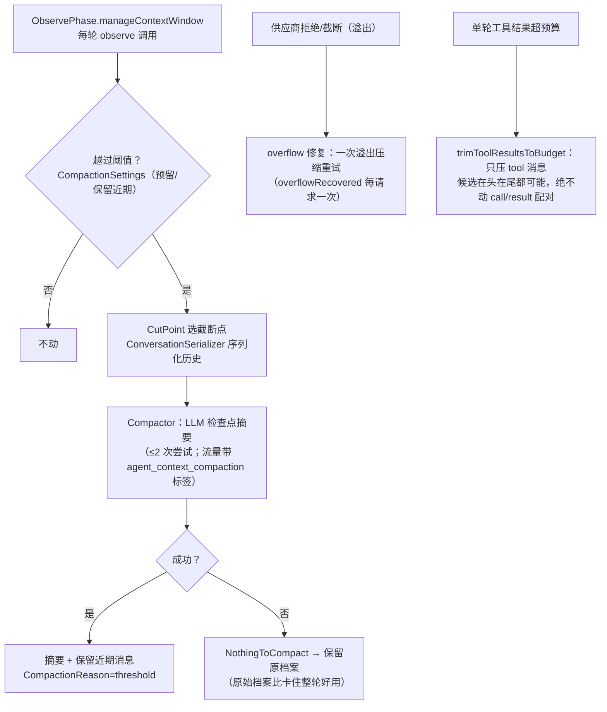
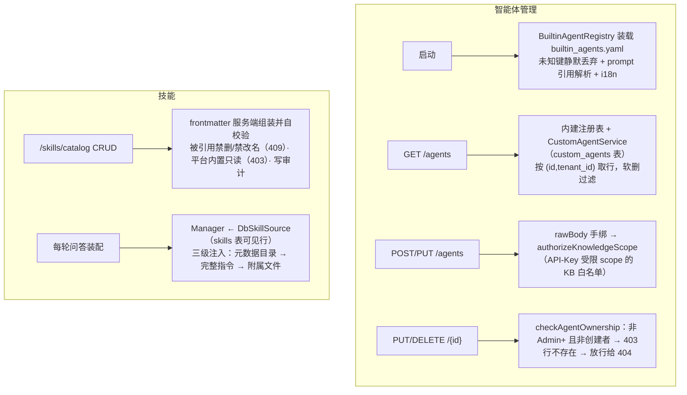

# agent 模块手册

> **面向读者**：第一次接手 `com.ragagent.agent` 的架构师 / 高级开发者。
> **目标**：30 分钟建立全局观 → 能定位改动点 → 能安全迭代（本模块有 350 个后端用例 + 42 个管理面契约金片兜底，改错会立刻红）。
> **数据口径**：2026-10-08 实测（`wc -l` 口径）：**188 个 java 文件 / 约 3.59 万行 / 7 个一级子包（18 个带码子包）**。
> **本文档的地位**：模块级导览；仓库级作业规范见仓库根 `HANDOFF.md`（§12 结构地图、§13 踩坑清单、§14 逐包重构范式）。

---

## 0. 一分钟速览

**它是什么**：ReAct 引擎域的全部后端能力——**把一轮用户提问变成"思考 → 调工具 → 观察 → 再思考"的循环**，外加智能体管理面。

- 引擎本体：`AgentEngine` 门面 + 八段协作者（think / act / observe / prompt / finalize / steer / iteration / context-debug），**跨轮无状态**，每次问答由 session 域装配一份
- 工具族：知识检索 7 件、wiki 页面 10 件、SQL 1 件（带手写安全守卫）、DuckDB 数据分析 2 件、网页 2 件、通用单件（todo_write / thinking / read_file）+ MCP 动态目录
- 模型上下文协议：请求局部句柄（cN/dN/bN/wN/iN/res://NNNN）与引用解码——"这次对话能看到什么、怎么引用"的唯一边界
- 上下文压缩：检查点摘要 + 工具结果裁剪，保证长对话不被窗口掐死
- 技能（指令型）：SKILL.md 提示词注入，三级注入面，`skills` 表存储
- 管理面：智能体 CRUD（`custom_agents` 表 + 内建 YAML 注册表）、技能目录、变量占位符、类型预设、推荐问题——**本域唯一的 HTTP 面在这**

**它不是什么**（别在这里改）：

| 不负责 | 归属 |
|---|---|
| 对话编排、SSE 桥、会话历史落库 | `session`（`AgentEngineAssembler` 在那边装配引擎；`messages.agent_steps` 列也在 session 域） |
| Agent 执行入口 `POST /api/v1/agent-chat/{session_id}` | `session` 的 `KnowledgeQaController`（本模块 17 个端点**全是管理面**） |
| LLM 调用、模型凭据 | `llm` / `model`（引擎只认 `LlmChatClient` 接口） |
| MCP 服务器连接、OAuth 客户端、目录存储 | `mcp`（本包经 `McpClientManager` / `McpService` 消费） |
| 审批闸门机制本体 | `common/approval`（本包 `tools/ApprovalBridge` 只做类型桥） |
| 知识检索与 wiki 页面本体 | `knowledge` / `wiki`（工具族经 `tools/` 根的接缝取数，跨域零实体直连） |
| 系统初始化、模型连通性测试 | `initialization`（2026-09-30 与原 agentm 分离；挂在树上的 W5b 测试归位见 §9） |

### 图 1：模块全景



**三个必须知道的数字**：最大类 760 行（`ActPhase`，javadoc 里"836 行例外"的登记已过时，见 §9）——全包无 ≥800 行类；`tools/` 全家 98 文件 / 19,540 行（约 54% 的代码量，是最大的子域）；HTTP 面只有 **3 个 controller / 17 个端点**——引擎本体零 HTTP，执行入口在 session 域。

---

## 1. 目录结构与职责

### 1.1 子包清单（放什么 / 不放什么）

| 子包 | 文件/行数 | 放什么 | **不放什么** |
|---|---|---|---|
| 根（引擎面） | 25 / 5,420 | `AgentEngine` 门面 + 八段协作者（`ThinkPhase` 572 / `ActPhase` 760 / `ObservePhase` 415 / `PromptAssembly` 434 / `ReActIteration` 282 / `FinalizePhase` 178 / `SteerIntake` 103 / `ContextDebugEmitter` 77）+ 提示词族 + 预算/取消/令牌估算 | Spring 装配（无 `@Component`，由 session 装配）、HTTP |
| `tools/`（根） | 41 / 7,959 | 工具框架（`AgentTool` / `BaseTool` / `ToolRegistry` 628 / 参数校验 / 输出限额 / `ToolResultPersist`）+ 通用单件（todo_write / thinking / read_file）+ 跨族接缝（`DocChunkSupport` / `SearchAuth` / `SearchTarget`）+ **MCP 族 10 类**（`McpCatalog` 718，全包第三大类） | 各能力域的业务逻辑（→ 五个能力子包） |
| `tools/wiki/` | 31 / 3,275 | wiki 页面工具十件 + 内容重写 / 路由解析 / 视图类型 | wiki 域的页面存储与摄取 |
| `tools/knowledge/` | 12 / 4,371 | 知识检索七件（knowledge_search / grep_chunks / list_knowledge_chunks / query_knowledge_graph / get_document_info / search_conversations / search_memory）+ 排序 / 格式化协作者 + FAQ 投影 | 检索引擎与索引（→ `retrieval` / `knowledge`） |
| `tools/sql/` | 6 / 1,916 | `database_query` + 手写 SQL 安全守卫（`SqlGuard` + tokenizer / 深检查 / 注入分析） | 真连接管理（datasource 域） |
| `tools/data/` | 5 / 870 | `data_analysis` / `data_schema` + DuckDB 实现 + chatpipeline 会话桥 | 沙箱（已裁撤；DuckDB 走独立会话） |
| `tools/web/` | 3 / 1,149 | `web_search` / `web_fetch` 两件 | 抓取实现本体（→ `support/`） |
| `management/`（子域） | 21 / 2,874 | controller 4 / 665（3 个 controller）、service 7 / 1,622（CRUD / 内建注册表 / config 校验 / 占位符 / 类型预设 / 推荐问题）、dto 3 / 295、mapper 4 / 205、domain 2 / 79 | 引擎运行时逻辑 |
| `modelcontext/` | 13 / 4,041 | 请求局部句柄注册表（`Registry` 643）、模型输出封装（`ModelOutput` 734）、流解码、工具策略 | 任何持久化（句柄绝不落库） |
| `compaction/` | 12 / 1,428 | `Compactor`、溢出判定、截断点选择、序列化器、原因类型 | 上下文窗口策略（→ 根 `ObservePhase`） |
| `skills/` | 9 / 1,349 | 指令型技能：`Skill` 解析、`Manager` 三级注入、`SkillCatalogService`、`DbSkillSource`、`SkillEntity` + mapper | 安装管线 / 镜像源（已随沙箱裁撤） |
| `support/` | 5 / 936 | 网页抓取与渲染（原顶层包 `webfetch`，2026-09-30 并入）：`Fetcher` 两工厂、`BrowserRenderer` 接缝、AgentMarkdown | 工具语义（`web_fetch` 工具在 `tools/web/`） |
| `domain/` | 5 / 354 | 引擎值类型：`AgentState` / `AgentStep` / `ToolCall` / `ToolCallTarget`——落库 jsonb 与消息响应共用 | 请求/响应形状（管理面的在 `management/dto/`） |

### 1.2 依赖方向（外部消费方 → agent → 被依赖域）



**枢纽一：`AgentEngine` 门面**。它只保留执行入口、配置 seam（`setSteerSink` / `setCancellationSource` / `setSkillsManager`…）与跨段委托；八段协作者持有引擎回引、互相通过引擎解引。历史包袱：A 波前是 3,235 行神类，现 712 行。

**枢纽二：`ToolRegistry`**。所有工具（内建 + MCP 包装）的注册与查找点。两个铁律（javadoc 原文）：**first-wins 注册**（同名重复注册保留先到者，防借名字冲突劫持工具执行，GHSA-67q9-58vj-32qx）；**排序决定字节稳定**（函数定义按工具名排序发给 LLM，否则按字节前缀匹配做提示词缓存的 provider 全部失手）。

**枢纽三：`management/` 子域**。agent 域唯一的 Spring HTTP 面（2026-10-03 B36 由顶层 `agentm` 并入）；内建 + 自定义智能体都在 `/api/v1/agents` 一个面里出。

---

## 2. 数据模型

### 2.1 ER 图（2 张表）



> 另有**落在别人表里的本域契约**：session 域 `messages.agent_steps` jsonb 的元素类型是本包 `domain/AgentStep`（内嵌 `ToolCall`）——它直接出现在消息响应体里，字段序与零值取舍都是线上契约（见 §7 第 5 条）。

### 2.2 jsonb 列与值类型对照

| 列 | 值类型 / 形态 | 说明 |
|---|---|---|
| `custom_agents.config` | Java 侧 **String 原文** + `JsonbRawStringTypeHandler`（`setObject(Types.OTHER)`） | 读成原始文本、写路径直传；**响应层**由 `AgentResponses.agentConfigMap` 按固定声明序重排键——PG 规范化键序直接序列化会字节 DIFF |
| 同上（键面） | 树级校验 `AgentConfigJson.ensureDefaults` + 已知键全集 `BuiltinAgentRegistry.CONFIG_KEYS`（~60 键，全 camel） | 键面 B18（2026-10-02）起 camel；读侧对历史 snake 存量**双读兼容**（`AgentQuestionMapper` / `AgentSuggestedQuestions`） |
| `skills.content` | TEXT（**不是 jsonb**） | frontmatter + 正文组装好的 SKILL.md；`Skill.parseSkillFile` 解析与组装严格可逆 |
| `messages.agent_steps`（session 域表） | `domain/AgentStep` / `domain/ToolCall`（元素同型） | `args` 键序递归恒排序（与既有 jsonb 记录逐字节一致）；`timestamp` 零值输出 `"0001-01-01T00:00:00Z"` |

### 2.3 枚举与分类值

本包**没有**数据库状态枚举列（两张表都靠 `deleted_at` 软删），代码内的枚举如下：

| 枚举 | 取值 | 用在哪 |
|---|---|---|
| `AgentEngine.IterOutcome` | `NEXT` / `CONTINUE` / `BREAK` | ReAct 循环走向（iteration → executeLoop） |
| `modelcontext ToolPolicy.SourceKeySpace` | `CHUNK` / `DOCUMENT` / `DOCUMENT_REF` / `KNOWLEDGE_BASE` / `WEB` | cN/dN/bN/wN 句柄空间（驱动注册与解码闸） |
| `ToolCapabilities.KbCapability` | `vector` / `keyword` / `wiki` / `graph` / `faq` | 工具对 KB 能力的声明；后端把它当检索管线最后防线（绕过前端过滤的客户端塞不进不兼容的 KB） |
| `support FetchException.Code` | `invalid_url` / `dns_failed` / `ssrf_rejected` / `empty_content` / `body_too_large` 等 17 值 | 抓取失败分类（进工具错误文案） |
| `CompactionReason` 常量 | `threshold` / `overflow` | 什么请求了这次压缩（日志与 UI） |
| `compaction CompactionOverflow` | 溢出等级 | 窗口满导致供应商拒绝后的修复判定 |

---

## 3. HTTP 接口面

### 3.1 端点分组（3 个 controller / 17 个端点）

**智能体 CRUD**（`management/controller/AgentController`，前缀 `/api/v1/agents`，9 个）

| 方法 | 路径 | 用途 |
|---|---|---|
| GET | `/api/v1/agents` | 列表：内建注册表 + 自定义行（`{agents, disabledOwnAgentIds}` 信封；`?creator=` 过滤；`Accept-Language` 决定 i18n name/description） |
| GET | `/api/v1/agents/placeholders` | 变量占位符（智能体编辑器 `{{` 唤起列表；键 = 前端字段面 camel，P 名 = 模板令牌 snake） |
| GET | `/api/v1/agents/type-presets` | 字段类型预设（`agent_type_presets.yaml`） |
| POST | `/api/v1/agents` | 创建（201；rawBody 手绑，仅 name 必填；API-Key 受限 scope 校验 `kbSelectionMode`） |
| GET | `/api/v1/agents/{id}` | 详情（内建行也可读） |
| PUT | `/api/v1/agents/{id}` | 更新（归属校验见 §3.2） |
| DELETE | `/api/v1/agents/{id}` | 删除（204；内建行 403） |
| POST | `/api/v1/agents/{id}/copy` | 复制（201；先 404 路径再 scope 校验） |
| GET | `/api/v1/agents/{id}/suggested-questions` | 推荐问题（kbIds/knowledgeIds/tagScopes CSV 参数 + limit；从 chunks 元数据 + FAQ 随机抽样） |

**技能选择器**（`SkillsCatalogController`，1 个）：`GET /api/v1/skills` —— 智能体编辑器技能区的数据源，响应 `{skills:[{name,description}], skillsAvailable:true}`（恒 true，空列表由前端渲染空态）。

**技能目录管理**（`SkillCatalogController`，前缀 `/api/v1/skills/catalog`，7 个）

| 方法 | 路径 | 用途 |
|---|---|---|
| GET / POST | `/api/v1/skills/catalog` | 列表（含 `referencedBy` 引用清单）/ 新建（201；slug 或 name 冲突 409；缺租户上下文 401） |
| GET | `/{id}` | 编辑草稿（`content` = **剥掉 frontmatter 的正文**，保存时服务端重新组装并自校验） |
| PUT | `/{id}` | 更新（slug 不可改；平台内置行 403；被引用时禁改名 409） |
| DELETE | `/{id}` | 删除（204；被引用且无 `force=true` → 409，引用清单进 details；平台内置行 403；软删） |
| GET | `/{id}/files` · `/{id}/files/content` | 技能文件（入库技能只有 SKILL.md；形状沿用宿主目录时代） |

### 3.2 契约约定（改接口前必读）

| 约定 | 说明 |
|---|---|
| 字段名 | **JSON 名 = Java 字段名**（camelCase）。响应键由 `AgentResponses` 显式 `put` 固定顺序；`config` 内层键 B18 起 camel，读侧容忍 snake 存量 |
| 信封 | **无** `{data,success}` 信封：资源直出；仅两个业务键包裹（列表 `{agents, disabledOwnAgentIds}`、技能 `{skills, skillsAvailable}`） |
| 删除 | 返回 **204**（无 body）；创建返回 **201** |
| 可空字段 | 显式输出 `null`（如 `deletedAt`）；时间零值输出 `"0001-01-01T00:00:00Z"`（`ZeroTimeSerializer`） |
| 错误 | `{error: {code, message, details}}`；`AgentController` 的请求体错误拼进 "Invalid request parameters" 的 details（固定文案兜底，`RequestFields.message("Name","required")`） |
| 手绑例外 | `AgentController` 是 rawBody 手绑（`bindAgentRequest`）——§14.5 允许的例外，javadoc 已注明；`SkillCatalogController` 用 `@RequestBody` record |
| 归属守卫 | 写路由在 controller 内做：行存在且**非 Admin+ 且非创建者 → 403**；行不存在**放行给 handler 出 404**；读/列表 Viewer 下限由 `RbacInterceptor` 承担 |
| locale | `Accept-Language` 首个 tag（env `WEKNORA_LANGUAGE` 优先）→ 内建行 i18n name/description 与校验文案 |
| 金片 | 42 个 `ag-*.json` 契约 fixture 钉住整个面（§11 冻结边界：**别手改**，重录走 `scripts/record-ag-golden.sh`） |

---

## 4. 核心链路

### 4.1 一次 Agent 对话（ReAct 主循环）



要点：**事件 emit 顺序就是将来的 SSE 帧序**；`AgentEngineException` 的 message 逐字稳定（它是 error 事件字段原文）；运行中用户插话走 `SteerIntake`（steer 行注入下一轮，循环结束可多跑一轮 `MAX_STEER_OVERRUNS=1`）；LLM 瞬态重试 sleep 1s/2s 保留。

### 4.2 工具执行与 MCP / 审批



MCP 采纳的是**目录模式**而不是把全部工具塞给模型：`discover_mcp_tools`（list/search/describe 分页目录）+ `call_mcp_tool`（按 `tool_ref` 调用）两个面；动态包装名 `mcp_{service}_{tool}`（服务重连后名字稳定，#715），描述前缀 `[MCP Service: X (external)]` 标注不可信来源以削弱间接注入。**MCP 族 10 类因与 `ToolRegistry` 同包紧耦合（protected 互访约 40 处）暂留根**（B34 登记，见 §9）。

### 4.3 上下文压缩（长对话保命）



### 4.4 管理面与技能（CRUD + 装载）



技能键 = frontmatter 的 `name`（与 agent config 的 `selectedSkills` 写法一致）；`DbSkillSource` 每次装配新建一份、每轮重读数据库，所以**改技能对下一轮生效，无需缓存失效机制**；解析失败的行跳过并记 warn。

---

## 5. 改哪里（场景 → 文件）

| 我想… | 主要改这里 | 别忘了 |
|---|---|---|
| 加/改 agent 配置键 | `management/service/AgentConfigJson`（补默认/校验）+ `BuiltinAgentRegistry.CONFIG_KEYS`（已知键全集）+ `management/dto/AgentResponses.agentConfigMap`（响应声明序） | **三处同改**；YAML 未知键会被静默丢弃；前端同批（camel）；补 `ag-*` 金片 |
| 改内建智能体 | `server/src/main/resources/agent/management/builtin_agents.yaml` + `BuiltinAgentRegistry`（展示序 / 模板解析） | prompt 引用按 11 个模板文件固定顺序查找；`builtin_agents.yaml` 里的 snake 键（如 `reflection_enabled`）会被丢弃 |
| 加一个新工具 | `tools/`（或能力子包）实现 `AgentTool` + `tools/ToolDefinitions` 加名常量 + 注册点 + `ToolCapabilities` 声明 KB 能力 | 工具输出是**自有 schema**（§11 边界，别当 REST 契约改）；补实录或单测 |
| 改知识检索工具行为 | `tools/knowledge/`（`KnowledgeSearchTool` + `KnowledgeSearchRanking` / `KnowledgeSearchOutputFormatter`） | 跨族接缝 `DocChunkSupport` / `SearchAuth` / `SearchTarget` 在 `tools/` 根；分页参数 `page_size` 两侧都在用（B73 翻案例） |
| 改 database_query 安全语义 | `tools/sql/SqlGuard` + tokenizer / 深检查 / 注入分析协作者 | 校验 Phase 顺序与错误三元组（type/message/details）固定；`DatabaseQueryRecordingTest` 钉住 |
| 改压缩行为 | `compaction/`（`Compactor` / `CutPoint` / `CompactionSettings`）+ 根 `ObservePhase.manageContextWindow` + `AgentBudgets` | 摘要 prompt 在 `CompactionPrompts`（实录钉住）；溢出修复每请求只有一次 |
| 改 cN/dN/res:// 句柄协议 | `modelcontext/`（`Registry` / `SourceRegistry` / `ResourceRegistry` / `ToolPolicy`） | 协议提示词**字节即契约**；句柄绝不持久化、出 registry 不被接受；source 与 resource 句柄不能乱序编解码 |
| 改 agents HTTP 契约 | `management/controller/AgentController` + `management/dto/AgentResponses` | 重录 `ag-*.json`（`scripts/record-ag-golden.sh`）后**结构化复核差异**；键别回 snake |
| 改技能语义 | `skills/`（`Skill.parseSkillFile` 自校验 + `SkillCatalogService` 引用检查） | `content` 是组装好的 SKILL.md：编辑草稿要剥/装 frontmatter（严格可逆）；引用清单进 409 details 与审计 |
| 改提示词 | 根 `AgentPrompts` / `AgentPromptTemplates` / `PromptTemplateCatalog` + `resources/agent/management/prompt_templates/*.yaml` | classpath 无 jackson-dataformat-yaml（snakeyaml→ObjectNode 手接）；`EngineRecordingTest` 钉输出 |
| 改网页抓取 | `support/Fetcher`（两工厂）+ `BrowserRenderer` 接缝 | agent 用 2MB/60s/markdown，chat 管线用 100KB/15s/纯文本——**别混用**；SSRF 校验在发送前 + 每跳重定向前 |
| 改 ReAct 循环节奏 | 根 `ReActIteration`（停止条件→走向映射）+ `AgentEngine.executeLoop`（steer overrun / 取消） | 事件 emit 顺序 = SSE 帧序；错误 message 逐字稳定 |
| 改 agent 事件载荷 | `event/payload/*` + session 域 `AgentStreamBridge` | SSE 载荷是**外部权威面**（B72：集成页按原始帧解析），camel 化需协议版本化（§9） |

---

## 6. 常见迭代 SOP

> 铁律：**一次只动一个轴**；每步结束**全绿**再走下一步（哪怕只是移动文件）。

```bash
# 每次改动后必跑（约 3 分钟）
cd ~/ragagent && JAVA_HOME=/opt/homebrew/opt/openjdk@21/libexec/openjdk.jdk/Contents/Home \
  ./gradlew :server:test :server:spotlessCheck
# 若动了前端可见契约（字段名/信封/状态码），同批带前端：
cd frontend && npx vue-tsc --build --force && npm test
```

**A. 加端点**：`management/dto` 或 controller record → controller → service 用例 → 补契约金片（`ag-*.json`，或临时 `-Dcontract.refresh=true` 重录后**结构化复核**）→ 三绿 → 提交。

**B. 加配置键**：`AgentConfigJson` → `CONFIG_KEYS` → `agentConfigMap` → 前端类型与编辑器 → 金片 → 三绿。同批核对 §2.2 的读侧兼容（历史 snake 行）。

**C. 加工具**：实现 `AgentTool` → `ToolDefinitions` 常量 → 注册点 → `ToolCapabilities` → 实录/单测 → 三绿。工具输出有固定预算（`OutputBudgets`），超限截断语义要一起想。

**D. 动引擎段**：只动一个协作者（沿 `// ── X 段 ──` 边界）→ 门面委托保持 → `EngineRecordingTest` / 录制测试全绿 → 三绿。实录常量类**禁手改**，行为变更走"重跑录制程序 + diff 复核"。

**E. 重构（拆类/移动）**：沿 HANDOFF §13.1 侦察 → 按调用点定边界 → 薄委托保全契约 → 测试随类同包 `git mv` → 每包补 `package-info` → 三绿 → 提交。B34/B35/B36 三次并入/分包都是这个路数，可直接翻 git log 对样本。

---

## 7. 模块约定与坑（必读）

1. **本仓有两个同名 `ToolCall`，不是同一个类型**（`domain/ToolCall.java` javadoc ⚠️ 原文）：`agent.domain.ToolCall` = agent 领域形状（name/args/result/reflection/duration，落 `messages.agent_steps` jsonb）；`llm.domain.ToolCall` = OpenAI 协议形状（id/type/function，provider 请求体）。JSON 完全不同，别互相顶替。
2. **`AgentConfig` ≠ `AgentConfigJson`**（`AgentConfig.java` javadoc）：前者是运行时消费面（引擎读本轮参数），后者是配置树校验件（custom_agents.config 的补默认/校验）。存储面归后者，别混。
3. **`ToolRegistry` 的两条铁律**（javadoc）：first-wins 注册防同名劫持（GHSA-67q9-58vj-32qx）；函数定义按名排序否则提示词缓存（Qwen 显式缓存这类按字节前缀匹配）全部失手。**新工具注册别破坏这两个性质。**
4. **`ApprovalBridge.toPayloadData` 缺一不可**（javadoc 原文）：common/approval 门内 DTO → event.payload 线格式 DTO 的映射缺失时，审批请求/决议事件因 instanceof 失配**被静默丢弃**，聊天流里永远不出现审批卡。加新的审批事件类型必须同步这层映射。另：用户点停止后审批等待要能取消——`onCancel` 用探测线程（200ms 轮询）桥接轮询式 ToolCancellation，别改回 no-op（曾导致停止后 10 分钟审批等待照跑）。
5. **`AgentStep` 的零值时间哨兵**（javadoc + HANDOFF B4 结论"不改"）：`timestamp` 零值输出 `"0001-01-01T00:00:00Z"` 而非 null（`ZeroTimeSerializer`）；jsonb 读路径用的是没有 `JavaTimeModule` 的裸 mapper，序列化与反序列化都自带、只挂一半会在读回时炸。
6. **`BuiltinAgentRegistry` 对 YAML 未知键静默丢弃**（javadoc：`builtin_agents.yaml` 里的 `reflection_enabled` 即被丢弃）：给内建 agent 加配置，**必须同步 `CONFIG_KEYS`**，否则装载时无声消失。
7. **`custom_agents.config` 响应层按固定声明序重排**（`CustomAgentEntity` javadoc）：PG 规范化 jsonb 键序直接序列化会字节 DIFF。金片对键序敏感，重排逻辑在 `AgentResponses.agentConfigMap`。
8. **agent config 键面已 camel（B18，2026-10-02），`management/package-info.java` 里"内层键保持 snake"的说法已过时**（HANDOFF B18 批次记录 + `AgentConfigJson` 实码）；读侧仍双读容忍历史 snake 存量（`AgentQuestionMapper` / `AgentSuggestedQuestions` 注释）。改键前先 grep 旧键的全部读点。
9. **实录测试禁手改**（`GoRecording.java` 头注释："禁止手改；重生成需重跑录制程序"）：`GoRecording*` 常量类 + `*RecordingTest` 族是旧实现真值实录，逐字节比对照行为——本模块 tools/modelcontext/compaction 的字节级契约都靠它们钉。
10. **MCP 族暂留 `tools/` 根**（`tools/package-info.java`）：与 `ToolRegistry` 同包紧耦合（包内可见 + protected 成员互访约 40 处），待注册表中的 MCP 段外提后再分组（B34 登记）。别顺手把它们挪进子包。
11. **`AgentQuestionMapper` 的 jsonb 数组判断是 CAST + LIKE 近似**（javadoc）：单语句通吃 PG/H2，键名必然出现在 jsonb 原文里，false positive 由 Java 侧解析兜底——别"优化"成真 jsonb 函数把 H2 测试搞挂。
12. **`Fetcher` 两个工厂参数不同**（javadoc）：`newFetcher()`（agent 用：markdown、2MB、60s、Chromium 渲染兜底——渲染无 Java 等价物，默认实现恒失败走 empty_content）vs `newPipelineFetcher()`（chat 管线用：纯文本、100KB、15s、无浏览器）。SSRF 校验（含 DNS 解析 IP 检查）在发送前 + 每跳重定向前，别绕过。
13. **注释判据同全仓**（HANDOFF §14.5）：写"名字看不出来的"（三态语义、字节契约、零值取舍）；不写 git 历史/批次代号。本包有过先例：B76 顺清 6 处陈旧 Go 注释、`ActPhase` javadoc 的行数例外登记已与现况漂移。

---

## 8. 测试与验证

- **规模**：本模块测试树 `server/src/test/java/com/ragagent/agent/` 共 **69 个测试类 / 350 个 `@Test`**（2026-10-08 实测）。分布：`tools/` 全家 36 类（根 23 + 能力子包 knowledge 6 / web 3 / wiki 2 / sql 1 / data 1）、根 12、`compaction/` 7、`management/` 5、`skills/` 4、`modelcontext/` 3、`domain/` 与 `support/` 各 1。全仓基线约 4,836 用例（HANDOFF B85 口径）。
- **两类测试风格**：
  - **契约金片**：`AgentContractTest` 对照 `server/src/test/resources/contracts/` 的 **42 个 `ag-*.json`**（+ 引用 17 个 `init-*.json`），dev server 录制（`scripts/record-ag-golden.sh`），掩码比对、语义比较（键序/转义归一化后比）。`ag-*` 是 §11 冻结边界：改契约必须走重录脚本 + 差异复核，**别手改金片**。
  - **录制实录**：`GoRecording*.java` 常量类（根 / `tools/` 45A/B/C / `modelcontext/` 46A）+ `*RecordingTest` 族——对旧实现跑出的真值直接生成为常量，逐字节比对，禁手改。
- **已知偶发 2 例**（全仓共通，遇到先单独重跑，别误判回归）：
  - `WebToolsRecordingTest.searchWithContentFetchesLeadingPagesViaSharedFetchTool`（就在本模块 `tools/web/`；全量并发下偶发）
  - `EvaluationContractTest.getTerminalRunsExecution`（evaluation 域；全量并发下偶发，单独 `--tests "*EvaluationContractTest"` 通过）
- **注意**：`W5bInitializationContractTest` 挂在本模块测试树，但测的是 **initialization 域**的 `/api/v1/initialization/*` 端点（`w5b-*.json` 金片）——历史同包遗留，归位建议见 §9。
- **改前端可见契约时**：后端与前端**同批**改完再提交（管理面字段已被前端智能体编辑器消费）。

---

## 9. 已知待办与风险（接手后优先看）

| 项 | 性质 | 建议 |
|---|---|---|
| `management/package-info.java`「agent config 内层键保持 snake」说法已过时 | 文档债 | B18（2026-10-02）已换 camel；以 `AgentConfigJson` / `BuiltinAgentRegistry.CONFIG_KEYS` 为准，改到即修，防新人被误导去"兼容 snake" |
| `W5bInitializationContractTest`（含 `W5bStubServers`）挂在 `agent/management/` 测试树 | 归位债 | 它测的是 initialization 域端点（B36 并入时测试树未随域归属走）；建议随 initialization 域 `git mv`，单独一批 + 全绿 |
| MCP 族 10 类暂留 `tools/` 根（与 `ToolRegistry` protected 互访约 40 处） | 结构债（已登记） | 待注册表中的 MCP 段外提后再分组（B34 遗留），别在别的批次里顺手动 |
| `AgentController` rawBody 手绑（`bindAgentRequest`） | 契约债（§14.5 允许的例外） | DTO 化时保留「固定文案兜底 + name 必填判别（B86 已改布尔 `requireName`）」语义，并重录 `ag-*` 金片 |
| 文档漂移三处：`ActPhase` javadoc「836 行例外」vs 实测 760；`AgentContractTest` javadoc「43 条 ag-*」vs 实测 42；`AgentResponses` 类头注释仍写 snake 键序（实码 camel） | 文档债 | 改到即修（属 HANDOFF §14.5「批次代号 0 / 锚点准确」判据的存量） |
| SSE 载荷 camel 化立项（B72 Phase 0） | 契约演进 | agent 事件族（`agent.tool` / `tool_call` / `tool_result`…）是 SSE 上游、集成页按原始帧解析的**外部权威面**；camel 化需协议版本化，立项稿 `docs/handoff/plans/sse-payload-camel-立项设计稿.md` |
| 技能附随文件 | 功能缺口 | 入库技能只有 SKILL.md（`SkillCatalogController` files 端点注释「附随文件留待后续批次」）；`read_file` 的 `skill://` 路径解析要跟着扩 |

---

## 10. 速查：本模块的"地标"

| 想知道 | 看这里 |
|---|---|
| 一次对话怎么跑起来 | `AgentEngine.execute` + `ReActIteration`（§4.1） |
| 引擎在哪被装配、生命周期多长 | session 域 `AgentEngineAssembler`（每次问答一份；本包无 Spring 装配） |
| 全部工具名与注册点 | `tools/ToolDefinitions`（常量）+ `tools/ToolRegistry`（first-wins / 排序） |
| 同名工具怎么防劫持 | `ToolRegistry` javadoc（GHSA-67q9-58vj-32qx） |
| MCP 工具怎么进来、怎么审批 | `tools/McpCatalog` / `McpToolWrapper` + `tools/ApprovalBridge`（§4.2） |
| 引用里的 cN/dN/bN/wN/res:// 是哪来的 | `modelcontext/Registry` + `SourceRegistry`（请求局部，绝不持久化） |
| 长对话为什么没被窗口掐死 | `compaction/Compactor` + 根 `ObservePhase` + `trimToolResultsToBudget`（§4.3） |
| agent config 有哪些合法键 | `BuiltinAgentRegistry.CONFIG_KEYS` + `AgentConfigJson`（§5 第 1 行） |
| 内建智能体从哪来 | `resources/agent/management/builtin_agents.yaml` + `BuiltinAgentRegistry`（启动装载） |
| 技能怎么进提示词 | `skills/Manager` 三级注入 + `DbSkillSource`（每轮重读）+ `tools/SkillReadFileTool`（Level 3） |
| 历史步骤落在哪、长什么样 | `domain/AgentStep` → session 域 `messages.agent_steps` jsonb（零值哨兵 §7.5） |
| 工具输出为什么是这个字节序 | `GoRecording*` 实录 + `common/web/ToolJson`（Go 字节形态工具面，§11 边界别删） |
| 网页抓取的两套参数 | `support/Fetcher` 两工厂（§7.12） |
| 目录为什么长这样 | 本文 §1 + 每个包的 `package-info.java`（共 18 份，都是职责地图；`management/` 那份有一处过时说法见 §9） |
