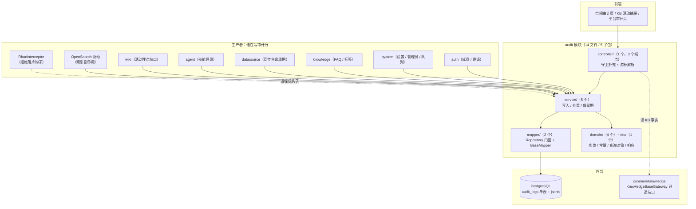
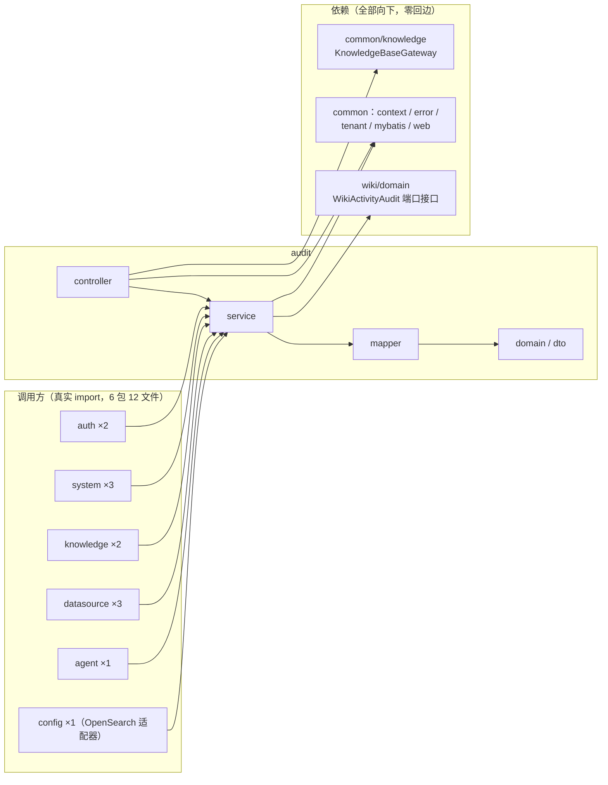
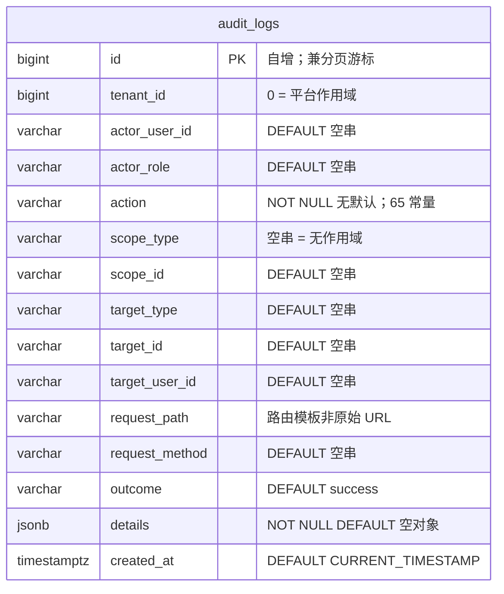
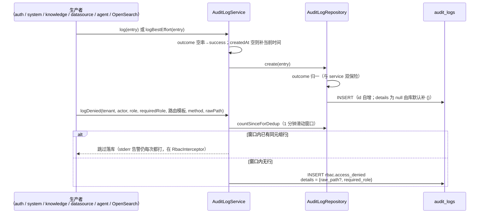
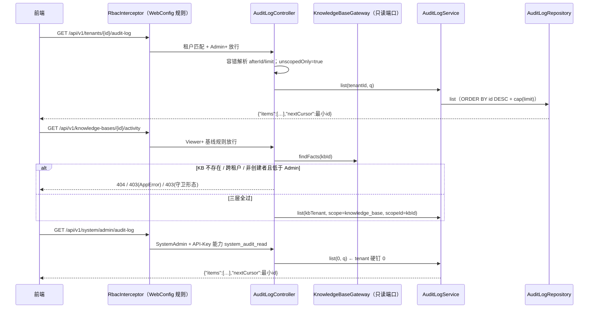
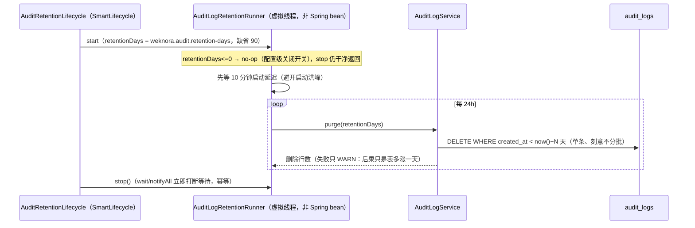

# audit 模块手册

> **面向读者**：第一次接手 `com.ragagent.audit` 的架构师 / 高级开发者。
> **目标**：30 分钟建立全局观 → 能定位改动点 → 能安全迭代（本模块有 66 个后端用例兜底，改错会立刻红）。
> **数据口径**：2026-10-08 实测（`wc -l` 口径）：**14 个 java 文件 / 约 1.5 千行 / 5 个子包**。
> **本文档的地位**：模块级导览；仓库级作业规范见仓库根 `HANDOFF.md`（§12 结构地图、§13 踩坑清单、§14 逐包重构范式）。

---

## 0. 一分钟速览

**它是什么**：审计日志域的全部后端能力——**把全仓的敏感动作记成只追加的 durable 行，再按三条守卫各异的流读出去**。

- 写入面：一个 `AuditLogService` 三个入口——`log`（强语义，失败会抛）、`logBestEffort`（尽力而为）、`logDenied`（RBAC 拒绝落库，带 1 分钟滑动窗口去重）。生产者横跨 auth / system / knowledge / datasource / agent / wiki / OpenSearch 驱动
- 读取面：3 个 GET 端点（空间流 / KB 活动流 / 平台流），共享同一套 id 游标分页与 `{"items":[...],"nextCursor":N}` 响应形状
- 运维面：每日保留期清扫（虚拟线程 + `SmartLifecycle`，`weknora.audit.retention-days` 缺省 90）

**它不是什么**（别在这里改）：

| 不负责 | 归属 |
|---|---|
| RBAC 判定本体（谁能过、谁被拒） | `common/web/RbacInterceptor` + `config/WebConfig` 规则表（本模块只把**拒绝结果**落库） |
| KB 访问事实（归属 / 创建者 / 未删除） | `knowledge`（经 `common/knowledge/KnowledgeBaseGateway` 只读端口取事实，audit 不直查 KB 表） |
| 登录 / 令牌 / 邀请业务 | `auth`（auth 反过来调用本模块落审计） |
| 会话 / 问答 / 检索 | `session` / `retrieval`（本模块完全无涉） |

### 图 1：模块全景



**三个必须知道的数字**：1 张表 15 列、**只追加**（无 Update / 无软删 / 无 `@TableLogic`），自增 id 兼分页游标；3 个端点共享同一响应 DTO 与游标语义，但**守卫矩阵三条路各不相同**（Admin+ / 创建者或 Admin / SystemAdmin + API-Key 能力）；`AuditAction` 的 **65 个动作常量**是跨域契约——前端 `src/i18n/auditActionRegistry.ts` 逐字映射，改字符串 = 断前端展示。

---

## 1. 目录结构与职责

### 1.1 子包清单（放什么 / 不放什么）

| 子包 | 文件/行数 | 放什么 | **不放什么** |
|---|---|---|---|
| `controller/` | 1 / 267 | `AuditLogController`：3 个只读端点、守卫补充判定、容错游标解析、错误形态转换 | 写端点（审计写入走服务层，无 HTTP 写口）、业务逻辑 |
| `service/` | 5 / 694 | `AuditLogService`（写入/去重/保留期）、`AuditLogRetentionRunner`（清扫循环，**刻意非 Spring bean**）、`AuditRetentionLifecycle`（接线）、`RbacDeniedAuditorRegistrar`（钩子注册）、`WikiActivityAuditRecorder`（实现 wiki 端口） | SQL（→ `mapper/`）、HTTP 形状（→ `controller/`） |
| `domain/` | 4 / 332 | `AuditLog` 实体、`AuditAction`（65 常量）、`AuditOutcome`（6 值）、`AuditLogQuery`（内存查询对象，**非 JSON 契约**） | 请求/响应形状（→ `dto/`） |
| `dto/` | 1 / 27 | `AuditLogListResponse`（游标分页响应；2026-09-30 从 controller 包归位此处） | 持久化注解 |
| `mapper/` | 2 / 170 | `AuditLogMapper`（纯 `BaseMapper`，零自定义 SQL）+ `AuditLogRepository`（查询构造与语义注释的**唯一收口**） | 业务判断 |
| 根 | 1 / 5 | `package-info.java`（一句话职责地图） | — |

### 1.2 依赖方向（只允许向下）



**本模块曾经是全仓"便宜环"展柜，现在全部已解**（见 `docs/backend-package-map.md`）：

- `audit ⇄ auth`（背边 `TenantRole ×1`）——已解：`TenantRole` 下沉 `common/tenant`，审计控制器从 common 取
- `audit ⇄ knowledge`（audit 直查 `KnowledgeBaseMapper`）——已解：改为 `KnowledgeBaseGateway` 只读端口（放 `common/knowledge`），controller 拿到的只有 `KnowledgeBaseFacts` 事实三元组（tenantId / creatorId / 存在性）
- `AuditLogListResponse` 曾放错在 controller 包——2026-09-30 批 P3 归位 `audit/dto`；同期 wiki→audit 的端口接缝 `WikiActivityAudit` 归位 `wiki/domain`
- 2026-09-30 批 4 后**全仓零包间环**，本模块依赖箭头全部单向向下

**唯一一条指向业务域的依赖**：`WikiActivityAuditRecorder implements wiki/domain/WikiActivityAudit`——方向是 audit → wiki（实现对方的端口接口），wiki 侧零感知（只在 javadoc 里提到实现类在哪）。

---

## 2. 数据模型

### 2.1 ER 图（1 张表）



> 单表、无外键、无关联表。列定义以 `migrations/versioned/V1__baseline.sql`（源自迁移 000044 + 000073，scope 两列由 000073 补入）为准，H2 测试库镜像在 `server/src/test/java/com/ragagent/TestSchema.java`（`audit_logs` 建表段）——**两处同改**，漏改 H2 报 `Column not found`。5 个索引：`(tenant_id, id DESC)`、`(actor_user_id)`、`(tenant_id, action)`、`(created_at)`、`(tenant_id, scope_type, scope_id, id DESC)`。表**只追加**：没有 `updated_at`、没有 `deleted_at`、没有 Update 语句。

### 2.2 jsonb 列与值类型对照

| 列 | 值类型 | 说明 |
|---|---|---|
| `audit_logs.details` | 透传 `JsonNode`（**不映射成值类型**） | 写侧各生产者用 `ObjectNode` 自由组装（键按字母序输出）；读侧 `PgJsonTypeHandler` 规范化键序，两端一致 |

**硬约定（与 knowledge 域同源，本模块已正确配置，别"顺手优化"掉）**：

1. `@TableName(value = "audit_logs", autoResultMap = true)` + `@TableField(typeHandler = PgJsonTypeHandler.class)` 双配置**必须同时在位**——漏 `autoResultMap` 会"写得进、查出来是 null"（knowledge 手册 §2.2 的静默故障坑）。
2. `details` 列 `NOT NULL DEFAULT '{}'`：字段为 null 时 MyBatis-Plus 默认 insertStrategy（NOT_NULL）把该列从 INSERT 清单省略 → 库默认补 `{}`。**别学 wiki 的 `page_metadata`**（那列可空且显式写 NULL）——两处置不同（`AuditLog` javadoc 与 `TestSchema` 注释双出处）。
3. 落 jsonb 前键按**字母序**组装（`raw_path` 在 `required_role` 前、`actions` 在 `count` 前）；PG jsonb 落库后按（长度,字节序）再规范化，Java 读路径的 `PgJsonTypeHandler` 做同样的事。

### 2.3 状态枚举与动作常量

| 常量类 | 取值 | 用在哪 |
|---|---|---|
| `AuditOutcome`（6 值 + DEFAULT） | `success` / `accepted`（已受理未终态）/ `denied` / `failed` / `partial` / `canceled`；`DEFAULT = success` | `outcome` 列；空串在 service 与 repository **两处幂等归一**为 success |
| `AuditAction`（65 常量，12 命名空间） | `rbac.*`(10)、`system.*`(12)、`knowledge.*`(9)、`datasource.*`(8)、`kb.*`(7)、`skill.*`(3)、`vector_store.*`(3)、`opensearch.*`(3)、`tag.*`(3)、`kb.share_*`(3)、`faq.import_*`(3)、`wiki.content_changed`(1) | `action` 列；前端 `audit-log.ts` / `auditActionRegistry.ts` 按字符串做展示映射 |

> **两者刻意都是 String 常量而非 enum**：列是 varchar 且允许任意值（前向兼容新命名空间，查询过滤器要能接受库里已有的任意字符串，enum 会在未知值上炸）——出处：两个类的 javadoc。

---

## 3. HTTP 接口面

### 3.1 端点分组（1 个 controller / 3 个端点，全部 GET 只读）

| 端点 | 流语义 | 守卫（生效顺序） | 作用域过滤 |
|---|---|---|---|
| `GET /api/v1/tenants/{id}/audit-log` | 空间审计流 | `RbacInterceptor`：租户匹配 + **Admin+**（刻意：拒绝历史不给普通成员看，规则在 `config/WebConfig`） | `unscopedOnly=true`：只看 `scope_type=''` 的行，KB 活动行不混入 |
| `GET /api/v1/knowledge-bases/{id}/activity` | 单 KB 活动 | 基线规则 Viewer+（`WebConfig`），控制器内**三层判定**：KB 不存在 → 404；跨租户 → 403（AppError）；非创建者且低于 Admin → 403（**守卫形态**，见 §3.2） | `scope_type='knowledge_base'` + `scope_id={id}` |
| `GET /api/v1/system/admin/audit-log` | 平台流 | `addSystemAdminRule`（租户角色再高也不放行）+ API-Key 能力 `system_audit_read` | `tenant_id` **硬钉 0**（系统作用域约定，`system.*` / `rbac.access_denied`(平台侧) 等行） |

共同请求参数：`afterId`（游标）、`limit`、`action`、`outcome`、`actor`（后三个精确匹配）。**游标与页大小是容错解析**：非法值一律归 0（= 从最新开始 / 用仓储默认 50），配错的客户端在首页请求上不吃 400——更严的校验属于前端。

### 3.2 契约约定（改接口前必读）

| 约定 | 说明 |
|---|---|
| 响应形状 | 三个端点恒 `{"items":[...],"nextCursor":N}`；空页 `items` 是 `[]` 不是 null |
| 游标语义 | **id 游标不是 created_at**（重复时间戳不打断翻页）；`nextCursor` = 本页最小 id，**空页为 0**，前端见 0 停止翻页 |
| 元素键名 | `AuditLog` 15 键恒输出（null 也照写），键名 = camelCase（`tenantId`、`actorUserId`、`createdAt`…），与前端 `frontend/src/api/tenant/audit-log.ts` 的 TS 类型逐字对应。⚠️ 实体 javadoc 的 15 键清单写的是 snake 列名串，读代码时以前端契约为准（见 §7） |
| 页大小 | 仓储默认 50、**硬帽 100**（`PageRequests.cap` 下推，防误配触发表扫描） |
| 错误 | 统一错误体 `{error:{code,message,details}}`：租户 ID 非法 400、KB 权限 403、查询失败 500 |
| 例外：守卫形态 | KB activity 第三层拒绝走 `GuardForbiddenException`，客户端看到的是 `{"error":"Forbidden: must own the resource or have the required role"}`——**不是** AppError 信封，刻意为之（该判定先于业务处理） |
| 错误消息透传 | `listOrInternalError` 把原始异常消息带进响应体（前端抽屉逐字显示）；不转的话会被 `GlobalExceptionHandler` 换成固定 "Internal server error" |
| 写 / 删接口 | **不适用**——本域 HTTP 面只读；写入全部经服务层由生产方触发 |

---

## 4. 核心链路

### 4.1 写入链路（三个入口，两种失败语义）



| 入口 | 失败语义 | 给谁用 |
|---|---|---|
| `log` | 仓储失败**原样上抛**（但先 error 日志）——审计失败可以拖垮被审计操作时用 | `OpenSearchAuditSinkAdapter`、各业务强一致点 |
| `logBestEffort` | 只 warn 日志，绝不影响业务 | `WikiActivityAuditRecorder`（埋点失败不能让编辑失败） |
| `logDenied` | 去重探测失败**非致命**：降级为"多写一行重复"，好过漏审计 | `RbacDeniedAuditorRegistrar` 注册进 `RbacInterceptor` 的钩子 |

**去重键 = 路由模板而非原始 URL**（否则攻击者遍历 URL 里的 UUID 会击穿窗口把表刷爆）；原始 URL 保留在 `details.raw_path` 供取证——出处：`AuditLogService.logDenied` javadoc。

### 4.2 读取链路（三条流，同一套游标）



注意服务层**不重复校验租户作用域**（"handler 在到达这里之前已做守卫"是 `AuditLogService.list` javadoc 的明文假设）——把该服务暴露给新调用方时，守卫责任跟调用方走。

### 4.3 保留期清扫（无调度器的每日任务）



三个刻意的实现决策（都有 javadoc 背书）：不用调度框架（保留期没有墙上时钟对齐要求）；runner 不带 Spring 注解（保持纯逻辑可单测，测试用 `FakeClock` 驱动边界）；`started` 标志防 `stop()` 在"从未 start"时死锁在没人关闭的 latch 上。

---

## 5. 改哪里（场景 → 文件）

| 我想… | 主要改这里 | 别忘了 |
|---|---|---|
| 加一个审计动作 | `domain/AuditAction` 加常量 + 生产方调用点 | 前端 `src/i18n/auditActionRegistry.ts` / `src/api/tenant/audit-log.ts` **同批**改，否则展示映射断 |
| 给某业务补审计埋点 | 该业务 service 直接注入 `AuditLogService`，按语义选 `log` / `logBestEffort` | outcome 空串会归一 success；actor/tenant 从 `TenantContext` 取 |
| 改查询/过滤条件 | `domain/AuditLogQuery` + `mapper/AuditLogRepository.list`（条件收口在这里） | 过滤全是**精确匹配**；看 §2.1 索引别引入全表扫 |
| 改分页/limit | `mapper/AuditLogRepository`（`DEFAULT_LIMIT=50` / `MAX_LIMIT=100`）+ `dto/AuditLogListResponse` | 游标是 id 不是 created_at；`nextCursor=0` 是前端停止信号 |
| 改 RBAC 拒绝落库 | `service/AuditLogService.logDenied` + `service/RbacDeniedAuditorRegistrar` + `common/web/RbacInterceptor.DeniedAuditor` | 去重键必须是路由模板；`RbacInterceptor` 是手 new 的非 bean |
| 改 wiki 活动埋点 | `service/WikiActivityAuditRecorder`（实现 `wiki/domain/WikiActivityAudit` 端口） | count=0 或无租户**不写**；details 不带 task 上下文三键（javadoc 说明） |
| 改保留期策略 | `service/AuditLogRetentionRunner` + `AuditRetentionLifecycle` | 配置键 `weknora.audit.retention-days` 缺省 90；0=关闭 |
| 加一个查询端点 | `controller/AuditLogController` + 必要时 `AuditLogQuery` 扩展 | 守卫规则在 `config/WebConfig`（`rbac.addRule` / `addSystemAdminRule`）登记；错误用 `AppError` / `BizException` |
| 改 `audit_logs` 表结构 | `migrations/versioned/V1__baseline.sql` + `server/src/test/java/com/ragagent/TestSchema.java` | **两处同改**（否则 H2 `Column not found`）；这是只追加表，别加更新路径 |
| 改 OpenSearch 副作用审计 | `config/OpenSearchAuditSinkAdapter`（实现驱动的 `AuditSink` 接口） | 无租户上下文**自跳过**（防写 `tenant_id=0` 污染平台审计线）；details 只装非敏感字段 |
| 改 KB 活动端点的归属判定 | `controller/AuditLogController.listKnowledgeBaseActivity` 三层判定 | 第三层 403 是守卫形态不是 AppError 信封（§3.2）；跨租户现状是 404（§7） |

---

## 6. 常见迭代 SOP

> 铁律：**一次只动一个轴**；每步结束**全绿**再走下一步（哪怕只是移动文件）。

```bash
# 每次改动后必跑
cd ~/ragagent && JAVA_HOME=/opt/homebrew/opt/openjdk@21/libexec/openjdk.jdk/Contents/Home \
  ./gradlew :server:test :server:spotlessCheck
# 若动了前端可见契约（action 字符串 / 响应键名 / 游标语义），同批带前端：
cd frontend && npx vue-tsc --build --force && npm test
```

**A. 加动作常量**：`AuditAction` 常量 → 生产方埋点（选对 `log` / `logBestEffort`）→ 前端 registry 同批 → `AuditLogServiceTest` / 相关测试补用例 → 三绿 → 提交。

**B. 加查询条件**：`AuditLogQuery` 加字段（javadoc 写清语义）→ `AuditLogRepository.list` 加条件 → `AuditLogControllerTest` 补内联断言（本模块无 fixture，断言即契约）→ 三绿 → 提交。

**C. 改响应形状**：`dto/AuditLogListResponse` 或 `AuditLog` JSON 形状 → **先 grep 前端消费点**（`audit-log.ts` + 审计页组件）→ 后端前端同批改 → 手工同步 `AuditLogControllerTest` 的内联 JSON 断言 → 三绿 → 提交。

**D. 动清扫器**：`AuditLogRetentionRunner`（纯逻辑，`FakeClock` 驱动）→ `AuditRetentionLifecycle` 配置键 → `AuditLogRetentionTest` 补用例（不 sleep）→ 三绿 → 提交。

**E. 重构/移动文件**：沿 `// ── X 段 ──` 边界拆 → 测试随类同包 `git mv` → 包职责变化时更新 `package-info.java` → 三绿 → 提交。

---

## 7. 模块约定与坑（必读）

1. **表是只追加的**：没有 Update、没有软删、没有 `@TableLogic`、没有 MetaObjectHandler——`CreatedAt` 由 service 层显式填（出处：`package-info.java`、`AuditLog` / `AuditLogRepository` javadoc）。别给审计行加"修改/撤销"路径，要纠错就写**补偿行**。
2. **平台流必须硬钉 `tenant_id=0`**：无论 URL、上下文还是请求头里有什么（出处：`AuditLogController.listSystemAuditLog` javadoc）。从 URL/上下文读 tenant 的回归会把各租户的 `rbac.*` 行**泄进平台流**，反向也让 SystemAdmin 看不到 `system.*` 行——安全级回归，改动该 handler 前先读那段注释。
3. **KB activity 的第三层 403 是"守卫形态"**：`{"error":"Forbidden: must own the resource or have the required role"}`，不是 AppError 信封（出处：`listKnowledgeBaseActivity` javadoc 三层判定 + `GuardForbiddenException.mustOwnResourceOrHaveRole`）。统一错误形态前先确认前端消费的是哪一种。
4. **跨租户 KB 的活动查询现状是 404**（共享空间 `kb_shares` 能力未接入，语义上应是 403）——代码注释自认的已知缺口（出处：`AuditLogController` 第 120-121 行注释），接入共享时补，见 §9。
5. **角色回落语义两边有意不同**：本控制器的 `currentRoleOrViewer` 未附加角色时回落 Viewer（放行"创建者本人但未附加角色"）；`RbacInterceptor` 的 `TenantRole.fromString` 不回落（UNKNOWN level 0 对任何角色下限都更严，fail-closed）。**别"顺手统一"它们**（出处：`currentRoleOrViewer` javadoc）。
6. **`logDenied` 去重键必须是路由模板**：用原始 URL 当键，攻击者遍历 UUID 就能让每个请求拿到新键、窗口失效、表被刷爆；原始 URL 进 `details.raw_path`（出处：`AuditLogService.logDenied` javadoc）。
7. **`action` / `outcome` 刻意是 String 常量而非 enum**：列允许任意值，enum 会在未知值上炸；前端按字符串逐字映射（出处：两个常量类 javadoc）。改常量值 = 改前端契约。
8. **实体 javadoc 的"15 键清单"写的是 snake 列名串，线上键名是 camelCase**：Spring MVC 侧无任何 naming strategy（`application.yml` 仅配 fail-on-unknown-properties=false；仓里唯一的 SNAKE_CASE 在 datasource 的 RSS 客户端自建 mapper，与本端点无关），前端 TS 类型即 `tenantId` / `actorUserId` / `nextCursor`。改契约以前端 `audit-log.ts` 为准，别被注释带偏。
9. **jsonb 双配置已在位，别动**：`autoResultMap = true` + `PgJsonTypeHandler`（出处：`AuditLog` 注解）。knowledge 手册 §2.2 的"写得进、查出来是 null"坑在这里靠这两行防住。
10. **`RbacInterceptor` 不是 Spring bean**（`WebConfig` 手 new），审计钩子靠 `RbacDeniedAuditorRegistrar` 进程级注册、关停复位 null——多 Spring 上下文并存的测试环境里，陈旧钩子会指向已关闭的上下文（出处：registrar javadoc）。
11. **审计失败语义两档，选错档出事故**：`log` 抛异常（能拖垮业务）、`logBestEffort` 吞掉（会静默丢审计）——埋点类一律 best-effort，取证类才用强语义（出处：`AuditLogService` 两个方法的 javadoc）。
12. **字符串字面量里别嵌裸 NUL 字节**（写 `"\0"` 转义）：会让 git 把文件当二进制、diff/blame 全废；本仓曾因此留下"裸 NUL 审计盲区"（B12 R5，2026-10-02 修复）。出处：`HANDOFF.md` §13.8.2。

---

## 8. 测试与验证

- **规模**：**6 个测试类 / 66 个 `@Test`**（2026-10-08，grep 口径），全在 `server/src/test/java/com/ragagent/audit/`：
  `AuditLogControllerTest`(18)、`AuditLogRepositoryTest`(12)、`AuditLogServiceTest`(11)、`AuditLogRetentionTest`(11)、`RbacDeniedAuditTest`(8)、`WikiActivityAuditRecorderTest`(6)。
- **形态**：唯一 `@SpringBootTest` 是 `AuditLogRepositoryTest`（H2 + `TestSchema`，真走 MVC 栈）；其余 5 个是纯单测（standalone MockMvc / mock 仓储 / `FakeClock` 驱动去重窗口与保留期边界，不 sleep）。
- **契约 fixture：不适用**——本模块 **0 个** fixture 文件（`server/src/test/resources/contracts/` 下无 `audit-*`；全模块测试不加载任何资源文件）。原因是响应面只有 1 个 DTO 且形状简单，`AuditLogControllerTest` 用**内联 JSON 字符串断言**（如 `{"items":[],"nextCursor":0}`）钉契约。代价：改响应形状必须手工同步这些断言（§6.C）。
- **已知偶发 2 例**（全仓级，遇到先单独重跑，别误判回归）：
  - `WebToolsRecordingTest.searchWithContentFetchesLeadingPagesViaSharedFetchTool`（全量并发下偶发）
  - `EvaluationContractTest.getTerminalRunsExecution`（全量并发下偶发；单独 `--tests "*EvaluationContractTest"` 通过）
- **改前端可见契约时**：action 字符串、响应键名、游标语义都前端可见——后端与前端**同批**改完再提交。
- **环境坑**（跑闸门前）：source 过 `.env` 的 shell 会把 `SYSTEM_AES_KEY` 泄给 Gradle 测试，制造孤零零 1 个假失败——先 `env | grep SYSTEM_AES`，或 `env -u SYSTEM_AES_KEY ./gradlew …`（出处：`HANDOFF.md` §13.9）。

---

## 9. 已知待办与风险（接手后优先看）

| 项 | 性质 | 建议 |
|---|---|---|
| ~~`audit ⇄ auth` / `audit ⇄ knowledge` 环；`AuditLogListResponse` 放错包~~ | **已解决（2026-09-30）** | `TenantRole` 下沉 `common/tenant`；KB 事实改 `KnowledgeBaseGateway` 只读端口；DTO 归位 `audit/dto`（`docs/backend-package-map.md` §P1/§P3 + 批 2/批 4） |
| KB 活动端点跨租户共享语义缺失：非归属租户现在落 404，共享场景语义应是 403 | 功能缺口（代码注释自认） | 接入 `kb_shares` 能力时补 403 分支 + 用例；改前重读三层判定 javadoc，别破坏现有守卫形态约定 |
| 全表 DELETE 不分批（保留期清扫） | 观察项（刻意决策） | 现状是 javadoc 明文的选择（现实体量下远不到一秒）；真到阻塞 vacuum 的体量，在仓储加分块方法、service 保持简单——出处：`AuditLogService.purge` javadoc |
| 无契约 fixture，端点形状靠内联断言 | 测试形态差异 | 端点形状改动时手工同步 `AuditLogControllerTest`；若形状长复杂了，可考虑引入 contract fixture（照 knowledge 域范式） |
| 审计 details 形状由各生产者自由组装、无统一契约测试 | 测试缺口（轻） | `WikiActivityAuditRecorder` 的 details 形状已有用例钉住；新增生产者时照此给 details 形状补断言 |
| 静态分析闸门缺失 | 工程债（全仓） | 死局部变量等问题只有 IDE 能发现；随全仓 Checkstyle / ErrorProne 进 CI 一并解决（同 knowledge 手册 §9） |

---

## 10. 速查：本模块的"地标"

| 想知道 | 看这里 |
|---|---|
| 三个端点的守卫矩阵 | `controller/AuditLogController` 类 javadoc + 本文 §3.1（规则登记在 `config/WebConfig`） |
| 全部动作常量 | `domain/AuditAction`（65 个，12 命名空间；前端映射在 `src/i18n/auditActionRegistry.ts`） |
| 写入失败语义怎么选 | `service/AuditLogService` 的 `log` vs `logBestEffort`（§4.1 表） |
| RBAC 拒绝怎么落库、怎么去重 | `service/AuditLogService.logDenied` + `service/RbacDeniedAuditorRegistrar` + `common/web/RbacInterceptor.DeniedAuditor` |
| 游标分页怎么算 | `dto/AuditLogListResponse`（nextCursor=本页最小 id）+ `mapper/AuditLogRepository.list`（ORDER BY id DESC，limit 50/100） |
| 表结构与索引 | `migrations/versioned/V1__baseline.sql` 的 `audit_logs` 段 + `TestSchema`（两处同改） |
| 保留期怎么转 | `service/AuditLogRetentionRunner` + `AuditRetentionLifecycle`（配置 `weknora.audit.retention-days`，缺省 90） |
| wiki 埋点接缝在哪 | `wiki/domain/WikiActivityAudit`（端口）+ `service/WikiActivityAuditRecorder`（实现） |
| OpenSearch 副作用审计在哪 | `config/OpenSearchAuditSinkAdapter`（实现驱动的 `AuditSink`，单向依赖） |
| 目录为什么这样分 | 本文 §1 + 根 `package-info.java` + 各类 javadoc（本包注释密度高，几乎是第二份手册） |
