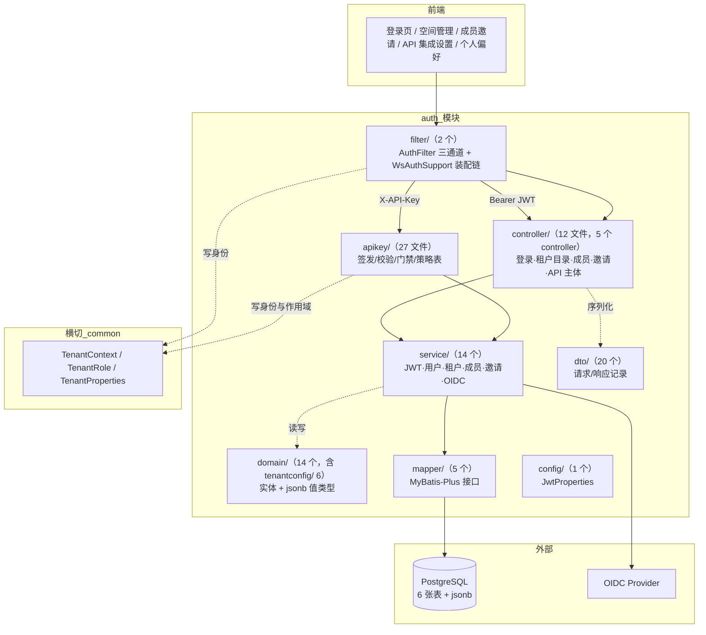
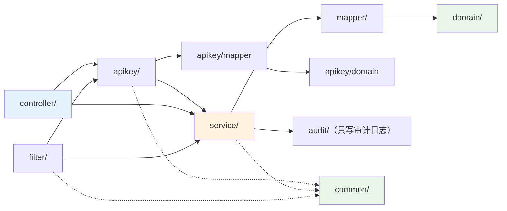
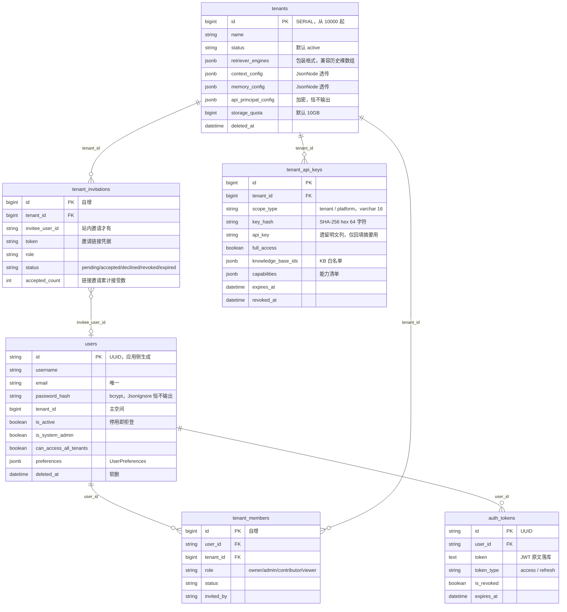
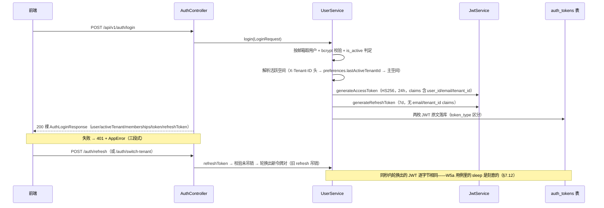
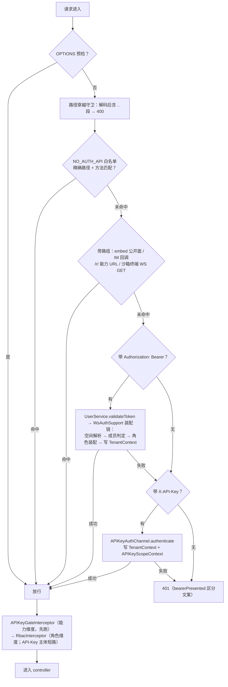
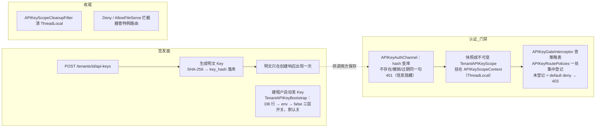

# auth 模块手册

> **面向读者**：第一次接手 `com.ragagent.auth` 的架构师 / 高级开发者。
> **目标**：30 分钟建立全局观 → 能定位改动点 → 能安全迭代（本模块自带 186 个后端用例 + 264 个契约金片兜底，改错会立刻红）。
> **数据口径**：2026-10-08 实测（`wc -l` 口径）：**96 个 java 文件 / 约 1.29 万行 / 8 个一级子包**（`apikey` 子域内另有 5 个次级包，`domain` 下另有 `tenantconfig/`）。
> **本文档的地位**：模块级导览；仓库级作业规范见仓库根 `HANDOFF.md`（§12 结构地图、§13 踩坑清单、§14 逐包重构范式）。

---

## 0. 一分钟速览

**它是什么**：认证与租户域的全部后端能力——**管人（登录/租户/RBAC）+ 管机器调用凭据（API Key）**。

- 登录与令牌：密码登录、OIDC 登录、注册（含邀请注册）、access/refresh 双令牌签发与轮换、登出、改密
- 租户目录：租户 CRUD、成员管理（owner/admin/contributor/viewer 四角色）、邀请（站内 + 链接）、租户级 KV 配置（6 类配置 + prompt 模板）
- 请求身份：全局 `AuthFilter` 三通道认证（白名单 → Bearer JWT → X-API-Key），身份写进 `TenantContext` 下传全应用
- API Key 子域（`apikey/`）：租户级 Key 的签发/校验/撤销、能力（capability）模型、逐路由门禁策略表
- 运维面：API 主体配置（direct_header / signed_token / external-user 三模式 + 测试令牌）

**它不是什么**（别在这里改）：

| 不负责 | 归属 |
|---|---|
| 审计日志的存储与查询 | `audit`（本模块只经 `AuditLogService` 写邀请/成员变更审计） |
| RBAC 拦截器本体、`TenantContext`、`TenantRole` | `common/web` / `common/context` / `common/tenant`（本模块是最大消费方） |
| KB 置备与存在性校验 | `knowledge` 的端口（`common/knowledge` 的 `KnowledgeBaseProvisioner`/`KnowledgeBaseGateway`） |
| 存储后端置备与白名单 | `storage` 的端口（`common/storage` 的 `StorageBackendProvisioner`/`StorageAllowList`） |
| 系统设置（system_settings 表）读写 | `system` 域（本模块经 `common/settings` 的 `SystemSettingGateway` 只读端口） |
| 租户记忆配置值类型 | `common/settings` 的 `MemoryConfig`（已下沉，消 `auth ⇄ memory` 环） |
| embed 公开面鉴权 | `embed` 域的 `EmbedAuthFilter`（`AuthFilter` 通道 1.5 让路） |

### 图 1：模块全景



**三个必须知道的数字**：最大类 745 行（`service/UserService`，已出榜——`AuthController` 1,167→666、`TenantCatalogController` 980→133 两刀切片后 auth controller 清零）；6 个 controller / **47 个端点**，`controller/` 的 12 个文件里 **7 个是切片协作者**（`*Ops`/`*Support`，不是端点）；本模块测试 **15 个类 / 186 个用例**，钉在 **264 个金片**上（七个来源，见 §8）。

---

## 1. 目录结构与职责

### 1.1 子包清单（放什么 / 不放什么）

| 子包 | 文件/行数 | 放什么 | **不放什么** |
|---|---|---|---|
| `controller/` | 12 / 3,422（5 个 controller + 7 个切片协作者） | `@RestController`：参数校验（`@Valid`）、调 service、拼响应；协作者 `AuthOidcOps`/`AuthSessionOps`/`AuthBindingSupport`/`TenantCreateOps`/`TenantCrudOps`/`TenantConfigOps`/`TenantBindSupport` | 业务逻辑、SQL、手搓 `{data,success}` 信封（已清） |
| `service/` | 14 / 3,086 | `UserService`（登录/注册/令牌生命周期）、`TenantService`/`TenantMemberService`/`TenantInvitationService`、`JwtService`、`OidcService`+`OidcStateCodec`/`OidcConfig`、`PasswordPolicy` | HTTP 形状（→ `dto/`）、SQL 细节（→ `mapper/`） |
| `filter/` | 2 / 514 | `AuthFilter`（全局三通道认证）+ `WsAuthSupport`（JWT 装配链复用点） | 拦截器（→ `apikey/filter/` 或 `common/web`） |
| `domain/` | 14 / 1,501（根 8 + `tenantconfig/` 6） | 实体（`@TableName`）+ `APIPrincipalConfig`（加密 jsonb 值类型）+ `tenantconfig/`（5 个租户配置值类型 + 1 个脱敏辅助 `TenantConfigRedaction`，**冻结面**，§7） | 请求/响应形状（→ `dto/`） |
| `dto/` | 20 / 430 | 一类型一文件：登录/注册/会话/租户/成员/邀请/偏好请求与响应 | 持久化注解 |
| `mapper/` | 5 / 71 | MyBatis-Plus 接口（User/Tenant/TenantMember/TenantInvitation/AuthToken） | 业务判断、手写 SQL（手写 SQL 在 `apikey/mapper/`） |
| `apikey/` | 27 / 3,836（controller 1 · domain 10 · filter 9 · mapper 3 · service 3） | **API Key 子域**：`TenantAPIKeyService`（签发/校验/撤销）、`APIKeyAuthChannel`（认证通道）、`APIKeyGateInterceptor`+`APIKeyRouteAuthorizer`+`APIKeyRoutePolicies`（门禁与策略表）、`TenantAPIKeyBootstrap`（建租户自动发 Key） | 人用登录面（归父包）；2026-09-30 由顶层包 `apikey` 并入（原与 auth 互相成环，并入即消环） |
| `config/` | 1 / 15 | `JwtProperties`（`JWT_SECRET` 等绑定） | 其它配置（`TenantProperties` 在 `common/tenant`） |
| 根 `package-info.java` | 1 / 7 | 域职责一句话 + 子域指引 | — |

### 1.2 依赖方向（只允许向下）



**common 是本模块的地基（87 个文件引用）**：`common/context.TenantContext`（ThreadLocal 身份）、`common/tenant.TenantRole`/`TenantProperties`、`common/error.AppError`/`BizException`、`common/web.PgJsonTypeHandler` 等，外加四个跨域端口（settings/storage/knowledge，见 §0 表）——这是包间成环治理的成果：**auth 不再直连 memory/system/knowledge/storage 的内部类型**。

**谁在消费 auth**（实测 14 个包 / 45 个文件）：`storage` 10、`knowledge` 10、`session` 6、`system` 5、`datasource` 3、`retrieval` 2、`agent` 2、wiki/websearch/model/memory/initialization/embed/config 各 1。被引最多的是 `domain.Tenant`（35 处 import）、`service.TenantService`（24）、`domain.User`（19）、`apikey.domain.TenantAPIKeyScope`（18）、`apikey.domain.APIKeyScopeContext`（15）——**改实体和服务签名是大动作**。

---

## 2. 数据模型

### 2.1 ER 图（6 张表）



### 2.2 jsonb 列与值类型对照

| 列 | 值类型 / handler | 说明 |
|---|---|---|
| `users.preferences` | `UserPreferences` + `PgJsonTypeHandler` | **`NON_NULL` 保留**——部分更新协议：省略 = 保持原值，不是省略美化（§7.5）；`last_active_tenant_id=0` 是"清除偏好"哨兵 |
| `tenants.retriever_engines` | `JsonNode` 透传 | 兼容历史裸数组 `[{...}]` 与现行 `{"engines":[...]}` 包装格式，读取后由 `TenantService` 归一化 |
| `tenants.context_config` / `web_search_config` / `parser_engine_config` / `credentials` / `storage_engine_config` / `chat_history_config` / `retrieval_config` / `memory_config` | `JsonNode` 透传 | 读取路径"DB 存什么响应什么"；KV 面的**值类型**在 `domain/tenantconfig/`（5 类 + 脱敏辅助，snake 键冻结） |
| `tenants.api_principal_config` | `APIPrincipalConfig` + `APIPrincipalConfigTypeHandler` | **加密语义 handler**；实体字段 `@JsonIgnore`——任何响应都不输出 |
| `tenant_api_keys.knowledge_base_ids` / `capabilities` | `List<String>` + `APIKeyStringListTypeHandler`（实体读路径）；`APIKeyRawJsonbTypeHandler`（mapper 手写 SQL 写路径，参数是已编码文本） | 手写 SQL 里**列名 `knowledge_base_ids`/`capabilities` 出现在 SQL 与 `@Result` 两处**——批量替换键名必须按文件白名单（§7.3） |

**硬约定（踩过坑）**：

1. 带自定义 typeHandler 的实体必须 `@TableName(autoResultMap = true)`（`User`/`Tenant`/`TenantAPIKey` 都是）——漏了会"写得进、查出来是 null"。
2. `tenant_api_keys` 的写路径走 `TenantAPIKeyMapper` 手写 SQL，不是 wrapper——改它先读 `apikey/mapper/TenantAPIKeyMapper` 头注释。
3. `domain/tenantconfig/` 是**冻结面**：5 个配置值类型共 113 处 `@JsonProperty` snake 键，由 `ct-kv-*` 金片钉住，别"顺手 camel 化"（§7.1）。

### 2.3 状态与枚举

| 枚举/常量 | 取值 | 用在哪 |
|---|---|---|
| `TenantRole`（`common/tenant`） | `owner`(40) / `admin`(30) / `contributor`(20) / `viewer`(10)，未知=0 | `tenant_members.role`、RBAC 角色下限比较（等级间距 10 便于插新角色） |
| `APIKeyScopeType`（字符串常量，**非枚举**） | `tenant` / `platform` | `tenant_api_keys.scope_type`（直连 varchar(16) 列，免去 TypeHandler；归一化未知一律回落 tenant） |
| `APIKeyCapability` | 25 个能力常量：`retrieve` / `chat` / `read_agents` / `ingest` / `manage_kbs` / `manage_agents` / `message_history`（7 个具名）+ `manage_*`（10 项资源管理）+ `run_evaluations` + `system_*`（7 项） | scoped Key 的叠加式授权；full-access Key 拥有全部且发 Key 时禁带细粒度能力 |
| `TenantInvitation.status`（字符串，非枚举） | `pending` / `accepted` / `declined` / `revoked` / `expired` | `tenant_invitations.status` |
| `TenantMember.status`（字符串） | 默认 `active`（写路径恒置 active；移除即删行，非停用） | `tenant_members.status` |
| `AuthToken.tokenType`（字符串） | `access_token` / `refresh_token` | `auth_tokens.token_type` |
| `APIPrincipalDtos` 的 mode | `direct_header` / `signed_token`（+ 首位用户 external-user 路径） | 租户 API 主体配置 |

---

## 3. HTTP 接口面

### 3.1 端点分组（6 个 controller / 47 个端点）

**登录/会话/用户**（`AuthController`，前缀 `/api/v1/auth`，17 个）

| 方法 | 路径 | 用途 |
|---|---|---|
| POST | `/login` | 密码登录（裸 `AuthLoginResponse`；失败 401 + AppError） |
| POST | `/register` | 注册（201 + 裸 User） |
| POST | `/auto-setup` | 初始化建站（首用户 + 默认租户） |
| POST | `/invitations/lookup` | 邀请码查详情（无鉴权白名单内） |
| POST | `/register-by-invite` | 凭邀请注册入租户 |
| GET | `/config` | 登录页配置（OIDC 开关等；带 `edition` 信号，B13 加的） |
| GET | `/validate` | 令牌自检（裸 `UserInfo`） |
| GET | `/me` | 当前用户（裸 `CurrentUserResponse`，tenant 在**顶层**——见 §7.13） |
| PUT | `/me/preferences` | 偏好部分更新（`NON_NULL` 协议） |
| POST | `/change-password` | 改密（204；请求体 camelCase——snake 曾致恒 400，B54 修） |
| GET | `/oidc/config` · `/oidc/url` · `/oidc/start` · `/oidc/callback` | OIDC 四件套（config/url 在无鉴权白名单） |
| POST | `/logout` | 吊销当前令牌（204） |
| POST | `/refresh` | 刷新（裸 `TokenPairResponse`，轮换出新对） |
| POST | `/switch-tenant` | 切空间（重新签发令牌对） |

**租户目录/KV 配置**（`TenantCatalogController` + 协作者 `TenantCreateOps`/`TenantCrudOps`/`TenantConfigOps`，9 个）：`POST|GET /api/v1/tenants`、`GET /api/v1/tenants/search`、`GET /api/v1/tenants/all`、`GET|PUT|DELETE /api/v1/tenants/{id}`（删除 204）、`GET|PUT /api/v1/tenants/kv/{key}`（7 个键：`web-search-config` / `prompt-templates` / `parser-engine-config` / `storage-engine-config` / `chat-history-config` / `retrieval-config` / `memory-config`；裸 config 对象，`web-search` 无配置时**显式 `null`**——直接返回 Java null 会变空体，须 `NullNode`）。

**成员**（`TenantMemberController`，5 个）：`GET|POST /api/v1/tenants/{id}/members`（列表 `{members,page,pageSize,total}`）、`PUT|DELETE .../members/{user_id}`（改角色/移除，动作 204）、`POST /api/v1/tenants/{id}/leave`（离开；最后一个 owner 会被拒）。

**邀请**（`TenantInvitationController`，9 个）：`GET|POST|DELETE /api/v1/tenants/{id}/invitations*`、`POST /api/v1/tenants/{id}/invite-links`（链接邀请）、`GET /api/v1/me/invitations`（`{invitations,total}`）+ `/pending-count`（`{pendingCount}`）+ `POST .../{inv_id}/accept|decline`、`POST /api/v1/me/invitations/accept-by-token`（链接接受）。

**API 主体**（`TenantAPIPrincipalController`，3 个）：`GET|PUT /api/v1/tenants/{id}/api-principal-config`、`POST .../api-principal-test-token`（签短时测试令牌；`has_hmac_secret` 只报是否配置，明文永不回显）。

**API Key**（`apikey/controller/TenantAPIKeyController`，前缀 `/api/v1/tenants/{id}/api-keys`，4 个）：`GET`（裸数组）、`POST`（201，明文 Key **只在创建响应出现一次**）、`PUT|DELETE /{key_id}`（更新/撤销，删除 204）。**这四个端点刻意不进 API-Key 策略表**——Key 连 full-access 都进不来（否则一把 Key 能给自己续命/扩权）。

### 3.2 契约约定（改接口前必读）

| 约定 | 说明 |
|---|---|
| 字段名 | **JSON 名 = Java 字段名**（camelCase）；冻结例外：`domain/tenantconfig/`（snake，§7.1） |
| 信封 | **无** `{data,success}` 信封：登录/刷新/`/me` 等裸对象、列表 `{items,...}` 形态、删除类 **204**（A1/A2/B 三批 2026-10-01 换锚完成） |
| 分页 | 成员 `{members,page,pageSize,total}`、邀请 `{invitations,page,pageSize,total}` |
| 错误（controller 层） | 401 + `{"error":{code,message,details}}`（AppError 三段式） |
| 错误（**filter/拦截器层**） | **纯字符串信封**：401 `{"error":"Unauthorized: ..."}`、API-Key 门禁 403 `{"error":"Forbidden: API key scope does not allow this operation"}`、RBAC 403 `{"error":"Forbidden: insufficient workspace role"}`、无空间 409 `{"code":"TENANT_REQUIRED","error":"Workspace required"}`（键按字母序）——**与 AppError 形态不同，golden 逐字节锁定，别"统一"** |
| 401 文案 | `bearerPresented` 区分"未登录"与"登录态过期"两条文案 |
| 可空字段 | 显式输出 `null`（`lastUsedAt`/`expiresAt` 恒在）；`UserPreferences` 例外见 §2.2 |

---

## 4. 核心链路

### 4.1 登录与令牌生命周期



- 密钥来源：env `JWT_SECRET`（trim 后非空），否则随机 32 字节 base64，**进程内一次生成**（重启后旧令牌全部失效——dev 无感，生产必须配）。
- 令牌是**有状态**的：`logout`/`refresh`/改密都通过 `auth_tokens.is_revoked` 生效，`validateToken` 会查库。
- OIDC：`OidcService` 构造授权 URL（state 由 `OidcStateCodec` 签名、nonce 绑 cookie）→ callback 验 state → 复用同一套令牌签发；端点过 `SsrfGuard` 校验。

### 4.2 请求认证链（AuthFilter 三通道 → 双拦截器）



**三个必须知道的时序事实**：

1. **Bearer 校验失败不立即拒绝**——继续试 API-Key 通道，全部未命中才 401。
2. `AuthFilter` **不是 Spring bean**：`WebConfig` 里 `new AuthFilter(...)` 塞进 `FilterRegistrationBean`；JWT 装配链抽在 `WsAuthSupport`（bean），沙箱终端 WS 复用同一条链——**两条入口的认证装配逻辑只有一份**。
3. `APIKeyGateInterceptor` 必须排在 `RbacInterceptor` **之前**（能力判定先于角色判定），且 RBAC 对 API-Key 主体短路——角色维度由门禁全权代表（`WebConfig` 注册处注释明示）。

无活动空间时的放行由 `AuthFilter.isTenantOptionalAPI` 决定（`/auth/me`、`/auth/logout`、`/auth/switch-tenant`、`POST /tenants`、`/me/invitations*` 等），其余一律 409 `TENANT_REQUIRED`。

### 4.3 API Key 签发与门禁



- **策略表的语义**：`APIKeyRoutePolicies`（715 行）按 gin 风格模板集中登记"哪条路由允许哪种能力"；`APIKeyRouteAuthorizer` 启动期一次性灌入并冻结，请求期只读。**注册与查询必须同一种归一化**，否则带尾斜杠的请求会 miss 并静默 403。
- **能力 vs 角色是两套独立叠加的授权**：scoped Key 只能做能力清单里列的动作，`knowledge_base_ids` 白名单在 KB 相关路由上**额外**生效。
- 遗留明文列回填：库里旧 Key 行只有明文时，启动期重算 SHA-256 回填 `key_hash`（`TenantAPIKeyService` 内 bootstrap 段）。

---

## 5. 改哪里（场景 → 文件）

| 我想… | 主要改这里 | 别忘了 |
|---|---|---|
| 加一个端点 | `controller/` 加方法 + `dto/` 加请求记录（`@Valid`）+ `service/` 加用例 | 若 API Key 应可达：`apikey/filter/APIKeyRoutePolicies.registerAll` **补登记**（不登记 = default deny）；若需角色下限：`config/WebConfig` 的 `RbacInterceptor.addRule` |
| 改登录/令牌语义 | `service/UserService`（`login`/`refreshToken`/`switchTenant`）+ `service/JwtService`（claims/有效期） | 令牌有状态（`auth_tokens`）；`refresh`/`switch-tenant` 的宽容手绑是登记保留（§9） |
| 改 OIDC | `service/OidcService` + `OidcStateCodec` + `OidcConfig` + `controller/AuthOidcOps` | 端点要过 `common/security.SsrfGuard`；nonce 走 cookie 不进 JSON |
| 改成员/邀请语义 | `service/TenantMemberService` / `TenantInvitationService` | 两者都写审计（`audit.AuditLogService`）；"最后一个 owner"防线在 service 侧 |
| 改租户 KV 配置 | `controller/TenantConfigOps`（7 个键的 case 分发）+ `domain/tenantconfig/` 值类型 | **tenantconfig 是冻结面**（§7.1）；`web-search` 空配置要 `NullNode` 显式 null |
| 改 API Key 签发/校验 | `apikey/service/TenantAPIKeyService` + `TenantAPIKeyValidator` | 明文只回一次；`key_hash` 是 SHA-256 hex；撤销/过期与不存在同文案 |
| 改 API Key 门禁规则 | `apikey/filter/APIKeyRoutePolicies`（登记）+ `APIKeyRouteAuthorizer`（归一化） | 注册与查询同一种归一化；api-keys 端点本身永不登记 |
| 给用户/租户加字段 | `domain/` 实体 + `dto/` 响应记录 | **schema 两处同改**：`migrations/versioned/V1__baseline.sql` + `server/src/test/java/com/ragagent/TestSchema.java`（否则 H2 报 Column not found）；`User`/`Tenant` 实体直连大量端点，动形状 = 大面金片重录（§7.2） |
| 改 jsonb 形状 | `domain/` 值类型 + handler | jsonb 必须 `autoResultMap = true`；`tenant_api_keys` 的手写 SQL 列名单独核对（§7.3） |
| 改认证放行面 | `filter/AuthFilter`（`NO_AUTH_API` / `isTenantOptionalAPI` / 旁路组） | 401 响应体逐字节金片锁定；放行面扩一条 = 安全评审级别动作 |
| 改 401/403 文案 | `filter/WsAuthSupport` / `apikey/filter/APIKeyGateResponses` | 纯字符串信封，金片逐字节比对；auth 类型错文案已换字段级（B83，2026-10-07） |
| 改跨域消费（KB/存储/系统设置） | 本模块**不改**：调 `common/knowledge` / `common/storage` / `common/settings` 的端口 | 端口实现在对方域；本包不 import 对方 mapper/service |

---

## 6. 常见迭代 SOP

> 铁律：**一次只动一个轴**；每步结束**全绿**再走下一步（哪怕只是移动文件）。

```bash
# 每次改动后必跑（约 3 分钟）
cd ~/ragagent && JAVA_HOME=/opt/homebrew/opt/openjdk@21/libexec/openjdk.jdk/Contents/Home \
  ./gradlew :server:test :server:spotlessCheck
# 若动了前端可见契约（字段名/信封/状态码），同批带前端：
cd frontend && npx vue-tsc --build --force && npm test
```

**A. 加端点**：`dto/` 请求记录 → `controller/`（`@Valid`，别手搓 `ObjectNode`/Map 信封）→ `service/` 用例 → API-Key 策略表与 RBAC 规则按需补登记 → 补契约金片（`server/src/test/resources/contracts/`）→ 三绿 → 提交。

**B. 加字段**：`domain/`（若落库；jsonb 记得 `autoResultMap`）→ baseline SQL + `TestSchema` → `dto/` 响应 → 金片 → 三绿。若字段**前端可见**，同批改前端类型与页面（auth 面曾两次栽在"后端 camel / 前端 snake"断链，见 §7.13）。

**C. 换契约/去注解**：先双写法 grep `@JsonProperty`（短名 + `@com.fasterxml...` 全限定都要扫）→ 后端与前端**同批**改 → 重录金片（`-Dcontract.refresh=true`，仅契约测试已接入者）+ **结构化复核差异** → 三绿。`UserPreferences` 的 `NON_NULL` 与 `tenantconfig/` 冻结面**不动**。

**D. 加表/加 jsonb 列**：`domain/` 实体（`@TableName(autoResultMap = true)` 若有 jsonb）→ `mapper/` 接口 → baseline SQL + `TestSchema` → 三绿。

**E. 重构（拆类/移动）**：`AuthController`/`TenantCatalogController` 的切片先例是 `*Ops`/`*Support` 协作者（端点方法留 controller，逻辑进协作者）——沿此形态拆；`AuthFilter` 不是 bean，动它要连 `WebConfig` 注册处一起；每步全绿再提交。

---

## 7. 模块约定与坑（必读）

1. **auth 域在 HANDOFF §11/§14.6 边界清单里是冻结面**——具体指 `domain/tenantconfig/` 的 5 个配置值类型（实测 113 处 `@JsonProperty` snake 键）与 `APIPrincipalConfig` 加密落库结构。这是"租户配置 jsonb 契约"，由 `ct-kv-*` 金片钉住；要动先连 system 域与前端 KV 配置页一起评估，**别顺手 camel 化**。
2. **共享实体链条**（§14.9h 的最大教训）：`User`/`Tenant` 直连"所有返回 user/tenant 的端点"+登录响应+租户 CRUD（`w5a-*`/`ct-*` 金片）——一次换锚牵动 4 个测试类、~50 个金片；前端要按"后端 DTO 字段全集"逐项核对（A2 批靠类型收紧才抓出 A1 的前端遗漏）。
3. **`TenantAPIKeyMapper` 手写 SQL 与 `@Result` 里的列名**（`knowledge_base_ids` 等）会被"按字符串替换键名"的批量脚本改坏——必须按文件/上下文白名单；B 批靠 repository 测试的 `Column "KNOWLEDGEBASEIDS" not found` 当场暴露并回退（§14.9j）。
4. **`@JsonProperty` 全限定写法会漏过短名 grep**（`@com.fasterxml...JsonProperty`）——盘点/清扫时两种写法都扫；`Tenant.defaultStorageBackendId` 的 NON_NULL 残留曾多花 3 轮（§14.9h）。
5. **`UserPreferences` 的 `NON_NULL` 是部分更新协议**（省略 = 保持原值），不是 Go omitempty 直译残留——只改键名，别摘注解（§14.9h）。
6. **API-Key 策略表"未登记 = default deny"**：新端点必须在 `APIKeyRoutePolicies` 登记才对 Key 可达；`/tenants/{id}/api-keys` 四端点与 tool-approvals/mcp-oauth-resolutions **刻意不登记**（Key 不能给自己续命/扩权）。
7. **门禁与 RBAC 的时序**：`APIKeyGateInterceptor` 必须在 `RbacInterceptor` 之前（`WebConfig` 注册处注释）；对 API-Key 主体 RBAC 短路——能力维度与角色维度是两套独立授权，别混。
8. **策略表归一化**：注册与查询必须同一种归一化，否则"带尾斜杠的请求"会 miss 并**静默 403**（`APIKeyRouteAuthorizer` 类注释）。
9. **签名实现别"顺手换"**：jjwt 对 HS256 强制密钥 ≥256bit，而 `signed_token` 契约要求接受任意长度密钥——所以是手写 HMAC-SHA256；external-user 头名（`X-External-User-ID`/`X-External-User-Token`）是**常量**，刻意不读配置（`APIKeyAuthChannel` 注释）。
10. **map 序列化键序陷阱**：建租户响应若嵌入明文 `apiKey`，走 map 序列化后**全键按字母序**输出，与普通租户响应（字段声明序）键序不同——`TenantAPIKeyBootstrap` 用递归排序保证前者，别"修"它。
11. **过滤器层错误是纯字符串信封**（`{"error":"..."}`、`TENANT_REQUIRED` 键按字母序），与 controller 层 AppError 三段式**并存且都是金片逐字节锁定**——别"统一形态"。
12. **同秒 JWT 逐字节相同**：W5a 用例的 refresh sleep 是为了让轮换出的 refresh_token 与旧值不同；并发下令牌撤销检查曾变"堆序掷硬币"（`W5aSundryRoutesContractTest` 注释）——改测试时序前先读该注释。
13. **api 面 snake 断链在 auth 高发**：改密曾恒 400（snake body → 校验失败）、邀请 6 键断链、注册时间被兜底写成当前时刻（B54，2026-10-04 修，守卫已加 api 面 `*_at` 全禁 + snake 记号棘轮）；`/auth/me` 是**裸信封**（tenant 在顶层），前端读 `userResp.data.tenant` 恒 undefined（B58，2026-10-04 修）——改 auth 契约先 curl 实测形状。
14. **`tenants.conversation_config` 是死列**：全仓零读写，实体有意不映射并注释备案——别"补"映射（`Tenant` 头注释）。

---

## 8. 测试与验证

- **规模**：本模块 `server/src/test/java/com/ragagent/auth/` 下 **15 个测试类 / 186 个 `@Test`**（契约 6 类：`AuthContractTest` 10、`AuthRegisterContractTest` 9、`OidcContractTest` 4、`TenantCatalogContractTest` 9、`TenantMemberContractTest` 24、`W5aSundryRoutesContractTest` 1（一方法打 56 条金片）；apikey 子域 9 类 129 用例）。全仓安全网 **4,831 用例**（B83 闸门口径，2026-10-07）。
- **fixture**：auth 测试共引用 **264 个金片**（去重后实测），七个来源：`mb-*` 91（成员/邀请/API 主体）、`ct-*` 54（租户 CRUD/KV 配置）、`w5a-*` 56（小散路由：auth 补 3 + 租户 CRUD 4 + KB 标签 4 + IM 回调 2）、`reg-*` 41（注册/改密/偏好）、`oidc-*` 13、`login-*` 6、散件 3（`x-tenant-id-*` 2、`tenant-required-*` 1）。录制脚本：`scripts/record-golden.sh`、`scripts/record-w5a-golden.sh`。
- **比较口径**：动态字段（uuid/时间戳/JWT/序列 id）掩码归一后**逐字节比对**；静态 4xx 金片直接逐字节断言。批量重录用 `-Dcontract.refresh=true`（§13.12），重录后**必须结构化复核差异**（解析新旧 JSON 比键集与取值），否则就成了"测试适应实现"。
- **改契约的外域牵动**：API Key 请求体/解包改动波及 memory/datasource/storage 的 scoped-key 用例与 `SystemContractTest` 平台密钥面（§14.9j 实录）。
- **已知偶发 2 例**（遇到先单独重跑，别误判回归）：
  - `WebToolsRecordingTest.searchWithContentFetchesLeadingPagesViaSharedFetchTool`（全量并发下偶发）
  - `EvaluationContractTest.getTerminalRunsExecution`（全量并发下偶发；单独 `--tests "*EvaluationContractTest"` 通过）
- **环境卫生**：`source .env` 的 shell 会把 `SYSTEM_AES_KEY` 泄给 Gradle 测试——全量里出现"孤零零 1 个环境相关失败"先 `env | grep SYSTEM_AES`（§13.9）。
- **改前端可见契约时**：后端与前端**同批**改完再提交（§2 第 3 条）。

---

## 9. 已知待办与风险（接手后优先看）

| 项 | 性质 | 建议 |
|---|---|---|
| `domain/tenantconfig/` 113 处 `@JsonProperty`（snake） | **冻结面**（§14.6） | 不动；它是租户配置 jsonb 契约，改它 = 动 system/KV 配置契约 + `ct-kv-*` 金片全重录 |
| `refresh`/`switch-tenant` 宽容手绑（`bindRefreshBody`/`bindSwitchTenantRequest`）+ 5 处 `@JsonProperty`（`TenantCreateOps` 2 / `TenantCrudOps` 2 / `AuthSessionOps` 1） | 技术债（§14.9h 边界保留） | 换 `@Valid` DTO 需同批前端 + 金片重录，单独成批 |
| gin 校验文案残留（`Key: '…' Error:Field validation…` 钉 32 金片 / 8 域） | 待拍板（B80 未完成项③ / B84 登记） | auth 类型错文案**已修**（B83，2026-10-07，2 金片同批转换）；剩余需起本地服务重录金片，超出原批准清单待用户拍板 |
| `tenants.conversation_config` 死列 | 遗留 | 维持不映射（实体注释备案）；要删走 schema 迁移批 |
| 过滤器层纯字符串错误信封与 AppError 并存 | 历史面 | 形态由金片逐字节锁定；"统一"属全仓契约变更，需单独立批评估收益 |
| `UserService` 745 行（全包最大） | 观察项 | 已出榜（≥800 线下），切片先例（`UserSessionOps`）在；再涨沿 §14 七步 SOP 处理 |

---

## 10. 速查：本模块的"地标"

| 想知道 | 看这里 |
|---|---|
| 某个接口怎么走 | `controller/` → 同名 `service/` 方法 → `mapper/`（§1.2 依赖图） |
| 请求怎么被认证 | `filter/AuthFilter`（三通道 + 白名单/旁路组）+ `filter/WsAuthSupport`（装配链）——本文 §4.2 |
| 身份最后放在哪 | `common/context.TenantContext`（ThreadLocal：tenantId/principal/role/userId） |
| API Key 怎么签发/校验 | `apikey/service/TenantAPIKeyService` + `apikey/filter/APIKeyAuthChannel`（§4.3） |
| "这把 Key 能走哪条路由" | `apikey/filter/APIKeyRoutePolicies`（登记）+ `APIKeyRouteAuthorizer`（判定）——未登记即拒 |
| 角色/权限怎么判 | `common/tenant.TenantRole` + `common/web.RbacInterceptor`（规则在 `config/WebConfig` 注册） |
| 令牌怎么签、怎么有状态 | `service/JwtService`（HS256/claims）+ `domain/AuthToken`（`auth_tokens.is_revoked`） |
| 租户 KV 配置的 7 个键 | `controller/TenantConfigOps`（case 分发）+ `domain/tenantconfig/` 值类型（**冻结**，§7.1） |
| API 主体三模式 | `dto/APIPrincipalDtos`（javadoc 即契约）+ `controller/TenantAPIPrincipalController` |
| 建租户为什么可能带出一张默认 Key | `apikey/service/TenantAPIKeyBootstrap`（三层开关，默认关；键序坑见 §7.10） |
| 改动前先看什么 | 本文 §7 的 14 条 + 仓库根 `HANDOFF.md` §13（落刀方法论）/§14.6（冻结面） |
