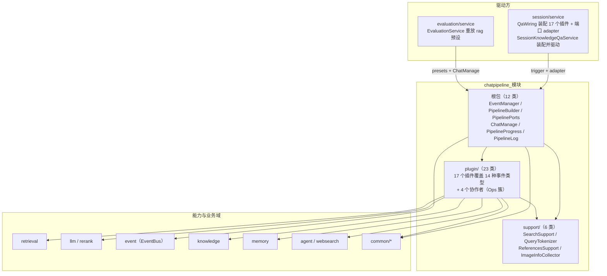
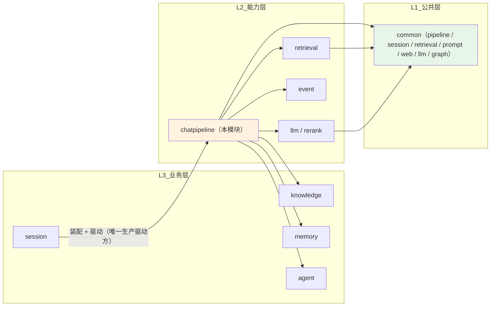
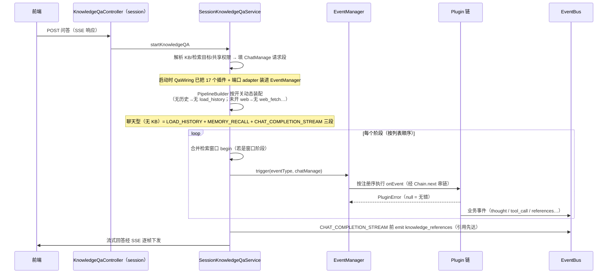
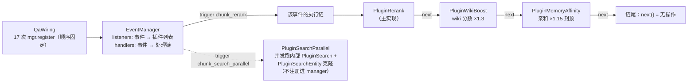
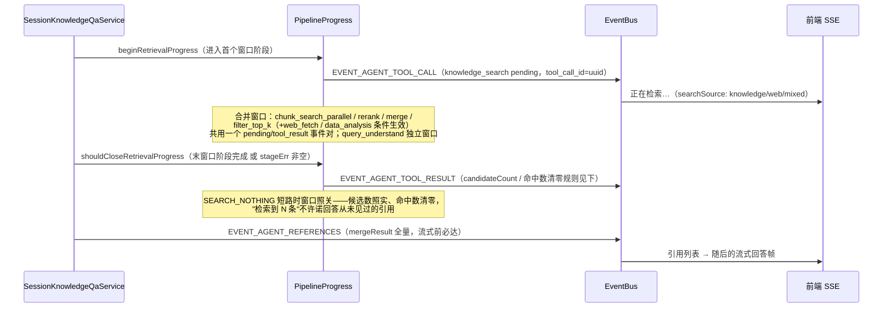

# chatpipeline 模块手册

> **面向读者**：第一次接手 `com.ragagent.chatpipeline` 的架构师 / 高级开发者。
> **目标**：30 分钟建立全局观 → 能定位改动点 → 能安全迭代（本模块有 45 个录制回放用例兜底，全仓 4,600+ 后端用例、改坏行为大概率立刻红）。
> **数据口径**：2026-10-08 实测（`wc -l` 口径）：**44 个 java 文件 / 约 0.77 万行 / 3 个子包（根 + plugin/ + support/）**。
> **本文档的地位**：模块级导览；仓库级作业规范见仓库根 `HANDOFF.md`（§12 结构地图、§13 踩坑清单、§14 逐包重构范式）。

---

## 0. 一分钟速览

**它是什么**：知识库问答的**编排管线**（库式域，无 HTTP 面）——一条可插拔的 `Plugin` 责任链，把"一次提问"变成"一次带引用的流式回答"：

- **骨架**（根包）：`EventManager`（插件注册表 + 事件分发）、`PipelineBuilder`（阶段装配与预设）、`PipelinePorts`（跨域窄 seam）、`ChatManage`（一次执行的配置/状态/句柄载体）、`PipelineProgress`（进度事件窗口）、`PipelineLog`
- **插件**（`plugin/`，23 类）：query_understand → chunk_search_parallel → rerank → merge → filter_top_k → into_chat_message → chat_completion_stream 等 14 种事件类型的全部步骤实现
- **纯逻辑**（`support/`，6 类）：检索去重/去包含、查询分词、图片信息聚合、引用装配、记忆投影

驱动方只有一个：`session` 域的问答服务按开关动态装配阶段列表，逐阶段 `trigger`；插件自身不决定"跑不跑"。

**它不是什么**（别在这里改）：

| 不负责 | 归属 |
|---|---|
| HTTP/SSE 契约、消息落库、问答编排的入口决策 | `session`（本模块只被它驱动；SSE 帧格式在 session/event） |
| 检索引擎实现（向量/关键词融合、引擎适配） | `retrieval`（本模块经 `PipelinePorts.KnowledgeBaseService` 间接调用 `HybridSearchService`） |
| 数据分析工具本体、web 抓取器 | `agent`（`DataAnalysisTool`）/ `websearch`（本模块只持有 seam） |
| 模型调用与凭据 | `llm` / `rerank`（本模块经 `PipelinePorts.ModelService` 拿 `LlmChatClient` / `Reranker`） |
| 记忆的存储与召回排序 | `memory`（本模块只做投影，见 `support/MemoryUsedMemories`） |
| 事件总线与事件类型定义 | `event`（本模块经 `EventBusInterface` emit） |

### 图 1：模块全景



**三个必须知道的数字**：`plugin/` 占 5,511 行（约 71% 的代码量，插件才是本体）；最大类 `PluginRerank` 683 行（全包 23 类已全部 <800，神类清零）；测试是 **263 条录制常量**的回放（`GoRecording46C`，录自 Go 原版探针，**没有** `contracts/*.json` fixture）。

---

## 1. 目录结构与职责

### 1.1 子包清单（放什么 / 不放什么）

| 子包 | 文件/行数 | 放什么 | **不放什么** |
|---|---|---|---|
| 根包 | 13 / 1,671（12 类 + package-info） | 管线骨架：`EventManager`（69）、`PipelinePorts`（178）、`PipelineProgress`（311）、`PipelineCommon`（324）、`ChatManage`（345）、`PipelineLog`（129）、`PipelineBuilder`（62）、`PipelineEventType`（27）、`QueryIntent`（40）、`SummaryConfig`（82）、`History`（46）、`DataAnalysisSessionFactoryAdapter`（52） | 插件步骤逻辑（→ `plugin/`）、HTTP（域无 controller） |
| `plugin/` | 24 / 5,511（23 类 + package-info） | `Plugin` 接口 + `PluginError` + 17 个步骤插件 + 4 个协作者（`QueryTextOps` / `PluginSearchOps` / `PluginExpansionOps` / `MergeParentOps`） | 端口实现（adapter 在 session）、SSE 组帧 |
| `support/` | 7 / 558（6 类 + package-info） | 无状态纯逻辑：`SearchSupport`（180）、`ReferencesSupport`（202）、`ImageInfoCollector`（63）、`QueryTokenizer`（31）、`MemoryUsedMemories`（50）、`MatchTypes`（21） | 注入 Bean、访问仓储 |

> 规模口径注：`backend-package-map.md` 的 2026-09-30 快照是"38 文件（根 13 + plugin 19 + support 6）"；其后刀 P1~P3/C1 抽出 4 个协作者类、`MemoryUsedMemories` 归位 support、补 3 份 package-info，才有今天的 44。以后者为准。

17 个步骤插件一览（`activationEvents` 即它响应的阶段；表中 16 行是因 ChatCompletion 双胞胎合一行）：

| 插件 | 行数 | 阶段 | 一句话 |
|---|---|---|---|
| `PluginLoadHistory` | 68 | load_history | 多轮历史装载；`MaxRounds≤0` = 显式关闭 |
| `PluginMemoryRecall` | 110 | memory_recall | 常驻块 + 情境记忆注入，无模型调用 |
| `PluginQueryUnderstand` | 523 | query_understand | 查询改写 + 意图分类 + 图片描述 |
| `PluginExtractEntity` | 139 | query_understand（附加） | 图谱实体抽取，`NEO4J_ENABLE` 才生效 |
| `PluginSearch` | 251 | chunk_search | 检索执行入口（协作者：Ops 簇 + QueryTextOps） |
| `PluginSearchParallel` | 139 | chunk_search_parallel | 并发跑 chunk + 实体两路检索再合并 |
| `PluginSearchEntity` | 241 | entity_search | 按实体查图、命中 chunk 回灌 |
| `PluginRerank` | 683 | chunk_rerank | 重排主实现 |
| `PluginWikiBoost` | 90 | chunk_rerank（附加） | wiki_page 分数 ×1.3（确认目标是 wiki KB） |
| `PluginMemoryAffinity` | 100 | chunk_rerank（附加） | 文档亲和加权 ×1.15 封顶 |
| `PluginWebFetch` | 117 | web_fetch | web 结果抓全文替换摘要（topN 默认 3） |
| `PluginMerge` | 660 | chunk_merge | 合并去重、父子块与短上下文扩展（`MergeParentOps` 528） |
| `PluginDataAnalysis` | 200 | data_analysis | CSV/Excel 命中走数据分析工具（当前不可达，见 §9） |
| `PluginFilterTopK` | 99 | filter_top_k | Merge/Rerank/Search 三者择一截 TopK |
| `PluginIntoChatMessage` | 312 | into_chat_message | 检索结果 → 用户消息上下文 + 引用序 |
| `PluginChatCompletion` / `Stream` | 98 / 310 | chat_completion(_stream) | 非流式 / 流式生成，流式直接 emit 事件 |

### 1.2 依赖方向（L2 能力层：可向下用 L1/L3，向上只有"被驱动"）



- **向上只有两条边**：`session`（5 个文件）与 `evaluation`（1 个文件）import 本模块；本模块**零** import `session`（`chatpipeline ⇄ session` 环已于 2026-09-30 批 4n 解除，消息载荷走 `common/session` 的 4 个 `Pipeline*View`）。
- **对 `knowledge`/`memory`/`agent` 是纯向下的 L2→L3 使用**（取 domain 值类型、调 support 工具），不构成环——包间环全仓为零（HANDOFF §0/批 4 收官）。
- **Go 兼容序列化工具面**（`common/web` 的 `JsonMappers.lenient()`、`event` 的 `EventJson`）仍被本模块的手搓载荷依赖，见 §7 第 9 条。

---

## 2. 数据模型

**本域没有数据库表、没有实体、没有 mapper**：持久化全部经端口落在别的域（消息落 session、chunk 读 knowledge）。本域的"数据"是四类内存类型。

### 2.1 管线载荷：`ChatManage`（一次执行的全部状态）

按三段组织（类 javadoc 即权威）：

| 段 | 内容 | `cloneChatManage()` 行为 |
|---|---|---|
| 请求段（不可变配置） | query/sessionId/userId/maxRounds、检索参数（阈值/topK/向量库）、重排参数、模型参数、改写开关、FAQ 三参、多模态/附件、web 检索与抓取开关、`SummaryConfig`、`citationEnabled`（null=默认开） | 全量复制（列表换新） |
| 状态段（插件间流转） | rewriteQuery/intent/history、searchResult/rerankResult/mergeResult、entity 三兄弟、graphResult、userContent/renderedContexts、chatResponse、imageDescription/quotedContext/systemPromptOverride/memoryPrompt/usedMemories | **只复制** rewriteQuery/intent/imageDescription/quotedContext/systemPromptOverride/memoryPrompt/usedMemories/renderedContexts/entity 三兄弟；history、三组检索结果、userContent、chatResponse **不复制** |
| 运行时段 | eventBus/messageId/userMessageID | 不复制（逐执行句柄） |

两个内置行为：`needsRetrieval()`（web_search 意图看 `webSearchEnabled`，其余委托 `QueryIntent.needsKbRetrieval`）；`citationsEnabled()`（null 视为 true）。

> ⚠️ `ChatManage` 不落 jsonb、不作响应体，**不进** `JsonContractRoundTripTest`。但它被 `evaluation` 域按字段重建（`buildChatManage`）——改字段语义先 grep evaluation（§9）。

### 2.2 阶段与意图：字符串常量类（不是 enum）

| 类型 | 取值 | 说明 |
|---|---|---|
| `PipelineEventType`（14 个） | load_history、memory_recall、query_understand、chunk_search、chunk_search_parallel、entity_search、chunk_rerank、web_fetch、chunk_merge、data_analysis、into_chat_message、chat_completion、chat_completion_stream、filter_top_k | 小写下划线字符串；加 `Pipeline` 前缀是为避开 `event` 域已占用的 `EventType` |
| `QueryIntent`（9 个） | kb_search、web_search、greeting、chitchat、follow_up、image_only、doc_only、summarize、clarification | `needsKbRetrieval`：kb_search/clarification/summarize/**空串** → true（空串按"需要检索"是安全默认） |
| `MatchTypes`（10 个 int） | 0 embedding / 1 keywords / 2 near_by_chunk / 3 history / 4 parent_chunk / 5 relation_chunk / 6 graph / 7 web_search / 8 direct_load（弃用保留）/ 9 data_analysis | `common.retrieval.SearchResult.matchType` 的取值域 |
| `PluginError`（9 个单例） | search_nothing、search_failed、rerank_failed、get_rerank_model_failed、get_chat_model_failed、template_parse_failed、template_execution_failed、model_call_failed、get_history_failed | **引用比较语义**，见 §7 第 1 条 |

### 2.3 配置值与小载体

| 类型 | 内容 | 说明 |
|---|---|---|
| `SummaryConfig` | maxTokens、采样五参（temperature/topK/topP/repeatPenalty/frequency+presence）、prompt、contextTemplate、noMatchPrefix、seed、maxCompletionTokens、`thinking` | 会话级模型调用配置；`thinking` 是三态 Boolean（null=模型默认）；`copy()` 随 cloneChatManage 走 |
| `History` | query / answer（load_history 已剥 `<think>`）/ createAt / knowledgeReferences | 一轮问答历史，"本类型不直接对外序列化" |
| `PipelineBuilder.presets()` | 5 条预设：chat、chat_stream、chat_history_stream、rag、rag_stream | 生产主链路不用预设，用 session 里的动态装配（§4.1）；`evaluation` 重放用的是 `rag` 预设 |
| `PipelineLog` 格式 | `[PIPELINE] stage=X action=Y k1=v1…` | 字段按 key 字母序、值截 300 码点；**不是字节契约但形状固定**，排障 grep `[PIPELINE]` |

### 2.4 跨域载荷类型的位置规则（解环产物，别搬回去）

| 载荷 | 位置 | 为什么在那就近 |
|---|---|---|
| `SearchResult` | `common/retrieval` | 检索结果的通用形状（SSE 契约载荷） |
| `SearchParams` / `ChunkTypes` | `common/pipeline` | 检索参数与 chunk 类型；`SearchParams` 还会被序列化进 PipelineLog params（snake，见 §7 第 6 条） |
| `PipelineMessageView` / `PipelineMessageImageView` / `PipelineMessageAttachmentView` / `PipelineUsedMemoryView` | `common/session` | 消息/记忆的只读视图（解 `chatpipeline ⇄ session` 环的 4 个载荷） |
| `MessageAttachmentsPrompt` | `common/prompt` | 附件提示词拼装 |
| `EntityExtraction` / `PipelineConfig` | `llm/extract` | 查询理解的 LLM 抽取契约（解 `chatpipeline ⇄ knowledge` 环） |
| `ToolResult` / `ResponseType` | `common/llm` | 工具结果与事件类型协议 |
| `GraphData` / `GraphNode` / `NameSpace` | `common/graph` | 图检索结果形状 |

---

## 3. 消费面：谁在调用我

> 本域是**库式域**：无 `@RestController`（实测 0 个），没有 HTTP 接口面这一节——它的"接口面"就是 §3.2 的三类契约。

### 3.1 消费方清单（main 代码 import `com.ragagent.chatpipeline` 的全部位置，2026-10-08 实测）

| 消费方 | 文件数 | 代表类 | 怎么用 |
|---|---|---|---|
| `session/service` | 5 | `QaWiring`（`@Bean` 装配 `EventManager` + 17 个插件 + 端口 adapter）、`SessionKnowledgeQaService`（动态装配阶段列表、逐阶段 trigger、进度窗口与引用事件）、`QaChatManageOverrides`（custom agent 配置覆盖到 ChatManage）、`SessionQaFallback`（降级作答，复用 `PipelineCommon.appendHistoryMessages`）、`SessionQaResolution`（请求解析门面） | **唯一生产驱动方**：HTTP/SSE 入口、消息落库都在它那 |
| `evaluation/service` | 1 | `EvaluationService`（`buildChatManage` 从评测参数快照重建 ChatManage → `knowledgeQAByEvent(cm, PipelineBuilder.presets().get("rag"))`） | 评测重放：走的是**预设 rag 链**，不是生产动态装配 |
| （包内自引） | 28 | 骨架 ↔ 插件 ↔ support | 正常内部依赖 |

### 3.2 对外契约约定（改接口前必读）

| 契约 | 约定 |
|---|---|
| `PipelinePorts`（窄 seam） | 每个接口**只收管线实际调用的方法子集**；实现在 session 侧以 adapter 纯新增（`QaWiring` 的 `qaPipeline*` 系列），本域不改既有 service。错误通道唯一：`PipelinePorts.PipelinePortException`，成功走返回值。**占位端口**（`SessionService`/`ChunkService`/`WebSearchStateService`/`WebSearchProviderRepository`）存而不读，是 Go 对齐的历史面（§7 第 10 条） |
| `Plugin` SPI | 三方法：`onEvent(eventType, chatManage, chain)`（返回 `PluginError`，**null = 无错**）、`activationEvents()`、`Chain.next()`。插件不自行决定执行与否——阶段在不在列表里由驱动方装配决定 |
| `EventManager` 语义 | 注册序 = 同一事件的执行链顺序；`register` 会**重建**该事件的整条链（§7 第 2 条） |
| 跨域载荷位置规则 | 契约类型一律放 `common/*`（§2.4 清单）；本域自己的值类型（ChatManage/History/SummaryConfig）**不落库、不序列化、无 JSON 契约** |
| 事件回流 | 插件/进度只经 `EventBusInterface` emit（`event` 域类型）；SSE 组帧与落库归 session |

---

## 4. 核心链路

### 4.1 一次问答：从 HTTP 到流式回答（生产主链路）



要点：

- **装配在 session、执行在本域**：`SessionKnowledgeQaService` 的 RAG 链最多 11 段（history 有无、web/data_analysis 开关决定增减）；`PipelineBuilder.presets()` 的 5 条预设只被 evaluation 与测试消费。
- **错误分级由返回的 `PluginError` 类型决定**：硬错（如 `SEARCH`）上抛中止；`SEARCH_NOTHING` 是降级信号（session 走 fallback 作答）。该分级被 `SearchGradingTest` 钉死：检索**抛错 + 0 结果**=硬错中止，**无错 + 0 结果**=降级。
- **单阶段 span**：session 给每阶段包 Langfuse span（`pipeline.<eventType>`），仅 `CHAT_COMPLETION_STREAM` 跳过（其内部已有覆盖全程的 generation，再套会"子观测超出父节点"）。

### 4.2 插件挂载：注册序 = 执行序（同事件多插件的叠加）



- **"附加插件"模式**：`chunk_rerank` 挂了 3 个插件（Rerank → WikiBoost → MemoryAffinity），`query_understand` 挂 2 个（QueryUnderstand → ExtractEntity）——顺序由 `QaWiring` 注册行顺序决定，注释原文："插件注册顺序即执行链顺序"。
- **`PluginSearchParallel` 持有 `mgr` 引用但内部插件不注册**：并发两路各自跑 `chatManage.cloneChatManage()` 副本（检索结果清空），合并序恒 chunk → entity（确定性，实录锁死）；`SEARCH_NOTHING` 被吞成"无结果"，只有硬错进 errs。
- **并发原语在 `PipelineCommon`**：`runParallel` / `parallelMap`（虚拟线程 + 信号量封顶）；任务里读租户必须 `TenantContextSnapshot.capture()/replay()`（§7 第 3 条）。

### 4.3 进度与引用回流（用户看到的"正在检索…"与引用列表）



- 窗口开关的判定函数都在 `PipelineProgress`：`isConsolidatedRetrievalStage` / `lastConsolidatedRetrievalStage` / `shouldCloseRetrievalProgress`（后者用 `PluginError` **引用比较**判短路）。
- 时钟有接缝：`PipelineProgress.clock` 是包私有静态字段，测试注入固定时钟。
- 进度与引用事件**失败恒忽略**（emit 包 try/catch）——观测面永远不能打断回答主链路。

---

## 5. 改哪里（场景 → 文件）

| 我想… | 主要改这里 | 别忘了 |
|---|---|---|
| 加一个管线阶段 | `PipelineEventType` 加常量 → `plugin/` 新建 `Plugin` 实现 → `QaWiring` 注册 → `SessionKnowledgeQaService` 装配条件 → 需要进度就动 `PipelineProgress` | 补 `GoRecording46C` 录制组（§8）；预设链 `PipelineBuilder.presets()` 按需同步 |
| 加一个"附加插件"（叠加在现有阶段上） | `plugin/` 新类 + `QaWiring` 在正确位置 register | **注册位置就是执行顺序**；确认要叠在主插件之前还是之后 |
| 改检索执行（分组 / 扩展 / 关键词） | `plugin/PluginSearchOps`（embedding 分组 + web 检索）、`PluginExpansionOps`（低召回变体，并发窗口 16）、`QueryTextOps`（分词/停用词） | 分词表经 `QueryTokenizer.setSegmenter` 实录注入（§7 第 11 条）；len 是 UTF-8 字节语义（§7 第 4 条） |
| 改合并语义（父子块 / 短上下文扩展） | `plugin/PluginMerge` + `MergeParentOps` | `merge_expand` 的 prevContent 是**替换**语义，写反文本翻倍（§7 第 5 条） |
| 改重排与加权 | `plugin/PluginRerank`；wiki 加成 `PluginWikiBoost`（×1.3）；亲和 `PluginMemoryAffinity`（×1.15、对数饱和、最少命中 2） | 加权数字被录制用例钉住；改动属行为面，需重录或补证 |
| 改意图判定 | `QueryIntent` + `plugin/PluginQueryUnderstand` + `ChatManage.needsRetrieval` | 空串=需要检索（安全默认）；web_search 特殊：还看 `webSearchEnabled` |
| 改引用装配与排序 | `support/ReferencesSupport`（FAQ 优先排序、句柄注册）+ `PluginIntoChatMessage` | 引用事件本体在 session 的 `emitKnowledgeReferencesEvent`（mergeResult）；`citationEnabled=null` 默认开 |
| 改历史装载/裁剪 | `PluginLoadHistory` + `PipelineCommon.loadAndProcessHistory` / `appendHistoryMessages` | `MaxRounds≤0` = 多轮显式关闭（不回落全局默认）；fetchCount = maxRounds*2+10 |
| 改记忆注入 | `PluginMemoryRecall` + `support/MemoryUsedMemories` | 投影产物是 `common/session` 的 `PipelineUsedMemoryView`，会话侧落库自行映射 |
| 改实体检索/图谱 | `PluginSearchEntity` / `PluginExtractEntity` + `retrieval/graph/RetrieveGraphRepository` | `ExtractEntity` 受 `NEO4J_ENABLE` 门控，`QaWiring` 里 `neo4jEnabled=false` 直通 |
| 改进度事件/窗口 | `PipelineProgress` + `SessionKnowledgeQaService` 的窗口 begin/end 调用 | 窗口集合与关闭条件§4.3；改 emit 形状=改前端进度 UI 契约 |
| 给管线接新外部依赖 | `PipelinePorts` 加窄接口 → `QaWiring` 加 adapter → 插件构造器收端口 | 错误一律 `PipelinePortException`；别在插件里直接 @Autowired 业务 service |
| 改 SSE 帧 / 消息落库 | **不在这里** → `session`（帧格式、Message 落库） | 本域只 emit `event` 域事件与写 `renderedContexts` 经端口 |

---

## 6. 常见迭代 SOP

> 铁律：**一次只动一个轴**；每步结束**全绿**再走下一步。本模块的行为锚是"录制常量回放"——改行为前先想清楚哪些录制组会红、红了是不是"该红的"。

```bash
# 每次改动后必跑（约 3 分钟）
cd ~/ragagent && JAVA_HOME=/opt/homebrew/opt/openjdk@21/libexec/openjdk.jdk/Contents/Home \
  ./gradlew :domains:test :domains:spotlessCheck
# 动了 SSE 可见形状（进度/引用事件的 data 字段）→ session 域契约与前端同批：
cd frontend && npx vue-tsc --build --force && npm test
```

**A. 加插件**：`plugin/` 新类（实现 `Plugin`，`activationEvents` 指向已有阶段）→ `QaWiring` 注册（注意顺序）→ 跑对应 `*RecordingTest` 组确认未扰动既有录制 → 新行为补探针用例或新录制组 → 三绿 → 提交。

**B. 加阶段**：`PipelineEventType` 常量 → 插件 → `QaWiring` 注册 → `SessionKnowledgeQaService` 装配条件 →（可选）`PipelineProgress` 窗口成员 → 跑 `PipelineLifecycleRecordingTest`（阶段流转/跳过语义在它那里）→ 三绿 → 提交。

**C. 改插件行为（最常见）**：先定位行为被哪个录制组钉住（search→`SearchRecordingTest`、merge→`MergeRecordingTest`、rerank→`RerankRecordingTest`、query_understand→`QueryUnderstandRecordingTest`）→ 改实现 → **预期变红的组逐条核对差异**是"本次改动的应然结果"还是回归 → 该组的期望常量按 §8 口径同步（`GoRecording46C` 头注释声明禁手改，重生成/重录走既定流程，不许手改数字凑绿）→ 三绿 → 提交。

**D. 加端口**：`PipelinePorts` 加接口（窄子集，javadoc 写明"谁适配它"）→ `QaWiring` 写 adapter → 插件构造器收端口 → 失败路径抛 `PipelinePortException` → 三绿 → 提交。

**E. 重构（拆类/移动）**：沿 HANDOFF §13.1 固定套路（侦察 → 按调用点定边界 → harness → 落刀 → 忠实性逐字比对 → 回填 §11/§14.3 实测数）；本包已有成功先例：`PluginSearch` 899 → 251（P1~P3 三刀拆出 QueryTextOps/ExpansionOps/SearchOps）、`PluginMerge` 1,155 → 660（C1 拆出 MergeParentOps，见 HANDOFF §14.7.13）→ 每步全绿 → 提交。

---

## 7. 模块约定与坑（必读）

1. **`PluginError` 的 9 个预定义错误是单例，管线靠"引用比较"分流**（`stageErr == SEARCH_NOTHING`）：进度窗口关闭、并行检索结果分派都依赖它。别"顺手"重构成值相等或每次 new——`withError` 返回新实例是唯一合法的携带底层异常方式。（`PluginError` javadoc + `docs/known-issues/05-wave-4.md` 波 4.6c）
2. **`EventManager` 注册序 = 执行链顺序；`register` 会重建该事件整条链**：`buildHandler` 从后往前包闭包，先注册的在外层先执行。改 `QaWiring` 注册行的顺序=改执行语义，别按"字母序整理代码"的审美重排。（`EventManager` javadoc + `QaWiring.chatPipelineEventManager` 注释）
3. **虚拟线程 + TenantContext**：`PipelineCommon.runParallel/parallelMap` 的任务里要读租户，必须调用方先 `TenantContextSnapshot.capture()` 再在任务里 replay——管线内部对 service 的调用显式传 tenantId，不依赖 ThreadLocal；新增异步段漏 capture 就会取不到租户（4.6d 批次实测踩过：异步段首跑取不到模型）。（`PipelineCommon` javadoc + known-issues 05）
4. **查询处理的 `len()` 是 UTF-8 字节语义不是字符数**（expansion/extract 三处：`len(seg)>5`、`len(s)<3`、`len>2`）："知识库"3 字符=9 字节。Java 侧按字节翻译过；改成 `String.length()` 会静默改变变体入选范围。（known-issues 05，实录抓回的真缺陷 ②）
5. **`merge_expand` 的 prevContent 是替换语义不是追加**：`JoinChunkContent(prev, prevContent)` 写成 append 会让邻居展开文本翻倍——实录抓回的真缺陷 ①，已有测试锁住。（known-issues 05）
6. **`SearchParams` 序列化进 PipelineLog params 载荷仍是 snake**（`SearchRecordingTest` 金片钉住）：chat span/log 载荷属 §14.9s 登记的"仍是 snake 是对的"清单，**别顺手 camel 化**；死代码判定必须扫"参数对象被泛型序列化"的路径。（HANDOFF §14.6/§14.9s）
7. **image_info 读侧键名由 docreader Go 容器决定**（`original_url/ocr_text/start_pos…`）：管线经端口拿到后按 `.path("original_url")` 读，同属 §14.9s 清单，不得 camel 化。（HANDOFF §14.6）
8. **`plugin/` 里部分静态/实例辅助方法放宽为 `public` 是给测试用的**：测试在 `com.ragagent.chatpipeline` 根包直接探针，跨子包需要可见性。别当公共 API 依赖，也别"收紧可见性"把测试搞红。（`plugin/package-info.java`）
9. **Go 工具面 5 类（`GoDoubleSerializer`/`GoTimeSerializer`/`GoMapSerializer`/`GoJsonEscapes`/`GoJson`）与 `EventJson` 仍被本模块依赖**：chatpipeline 手搓载荷、事件总线、Redis 流事件靠其 Go 字节形态，线上注解已清零但工具面**别再当遗产删**（§3 红线：唯一要求一次性全仓完成的动作）。（HANDOFF §2 第 7 条）
10. **占位端口存而不读是对齐历史面**：`SessionService`/`ChunkService`/`WebSearchStateService`/`WebSearchProviderRepository` 在 Go 侧只判 nil 或存而不读；`TenantService` 只有 `currentWebSearchConfig` 一个 default 方法。清理它们要先确认无 Go 行为对齐诉求。（`PipelinePorts` javadoc + known-issues 05 装配清单）
11. **jieba 分词接缝**：expansion 组按实录注入固定分词表（`QueryTokenizer.setSegmenter`），未命中回落二字滑窗——分词结果差异直接改变变体检索行为。（known-issues 05）
12. **测试分批跑**：agent/chatpipeline 与 apikey/auth 域**同批**跑测试出现过 Mockito attach 假红 110 条，分批即全绿——全量红时先看失败分布是不是这种"整批假红"。（known-issues 05 波 4.6d）

---

## 8. 测试与验证

- **规模**：`domains/src/test/java/com/ragagent/chatpipeline/` 下 **9 个 java 文件 / 7 个测试类 / 45 个 `@Test`**（2026-10-08 实测）：`PipelineCoreRecordingTest` 6、`PipelineLifecycleRecordingTest` 8、`SearchRecordingTest` 8、`SearchGradingTest` 2、`MergeRecordingTest` 7、`RerankRecordingTest` 6、`QueryUnderstandRecordingTest` 8；另两个文件是支撑设施（`GoRecording46C`、`Rec46cSupport`，无 `@Test`）。
- **fixture 形态（与 knowledge 域不同，别找错地方）**：本模块在 `domains/src/test/resources/contracts/` **没有** fixture——期望值全部内嵌在 `GoRecording46C` 的 **263 条录制常量**里（静态 REGISTRY）。录制 provenance：Go 原版同包探针驱动管线纯函数与各插件 `OnEvent` → `rec46c.jsonl` → 生成 `GoRecording46C.java`（**禁止手改**，重生成命令在头注释；探针本体在 Go 仓 `/tmp/toolrec46c`，一次性产物）。
- **比较口径**：不是 JSON 语义比较，是**掩码后逐字节可比**——`Rec46cSupport.mask` 与录制侧同款：完整 uuid → `MASKED-UUID`、事件 id 8-hex 前缀 → `xxxxxxxx-`、`"duration_ms":N` 连键删除、日期 → `DATE`、英文星期 → `WEEKDAY`、`127.0.0.1:N` → `PORT`。期望串是 Go `json.Marshal` 形态（map 排序 + HTML 转义 + Go 浮点），Java 侧用 `EventJson.write` 对齐。
- **这套录制抓回过 3 个真缺陷**（价值证明）：merge_expand 替换语义、UTF-8 字节 len、引号字符类只有直引号+「」『』（hexdump 验证）——见 known-issues 05。
- **分级语义**：`SearchGradingTest` 单独钉"硬错 vs 降级"（§4.1 要点），场景来自 dev PG 真实脏数据（KB 绑定已删除的 vector store → 2200 硬错）。
- **已知偶发 2 例**（全仓级，全量并发下偶发，遇到先单独重跑，别误判本模块回归）：
  - `WebToolsRecordingTest.searchWithContentFetchesLeadingPagesViaSharedFetchTool`（agent 域）
  - `EvaluationContractTest.getTerminalRunsExecution`（evaluation 域；单独 `--tests "*EvaluationContractTest"` 通过）
- **环境卫生**：闸门命令别在 source 过 `.env` 的 shell 里跑——`SYSTEM_AES_KEY` 泄漏会让"孤零零 1 个"环境相关用例假红（HANDOFF §13.9）。

---

## 9. 已知待办与风险（接手后优先看）

| 项 | 性质 | 建议 |
|---|---|---|
| **DATA_ANALYSIS 阶段生产不可达** | 功能缺口 | `DataAnalysisSessionFactoryAdapter` javadoc 自述：检索执行面的生产实现（SqlQueryExecutor/AnalysisDuckDb/KnowledgeFileMaterializer 的 JDBC/DuckDB 接线）未接入，"本会话内不可达"，工厂以空 seam 构造、装载即抛 `PipelinePortException`。要启用需单独一批接生产实现 + 录制/契约补证 |
| **录制重录能力缺口** | 工具债 | `GoRecording46C` 禁手改、重生成命令只在头注释、Go 探针是一次性 `/tmp` 产物；不似 embed 域有 `-Dcontract.refresh` 一键重录（§13.12）。改行为时按 §6-C 的人工核对纪律走；长期应沉淀本模块的重录脚本 |
| 4 个占位端口（SessionService 等） | 语义债 | 存而不读（§7 第 10 条）；删除前需确认无 Go 行为对齐诉求，属低优清理 |
| `PipelineCommon` 提示词缓存指纹元数据未接线 | 技术债 | javadoc 自述"无 ctx 形参、无消费点，非行为面"；接缓存指纹时是跨域改动（`LlmChatClient` 加 ctx） |
| `PluginRerank` 683 / `PluginMerge` 660 / `MergeParentOps` 528 | 规模预警 | 已出 ≥800 榜（HANDOFF §14.3：chatpipeline 域清零），但仍是包内最重三段；再长按 §14.7.13 刀法拆协作者（已有 4 个成功先例） |
| `evaluation` 按字段重建 `ChatManage` | 耦合 | `EvaluationService.buildChatManage` 依赖字段语义（JSON DTO 与运行时类型分离）；改 ChatManage 字段语义时 grep evaluation 同批核对 |
| 消息侧 `updateMessageImages`/`updateMessageRenderedContent` 依赖 adapter | 装配脆弱点 | `PipelinePorts.MessageService` javadoc 提示这两个方法"需在该类补方法或 adapter 内直写 mapper"——session 侧改动签名时两端同查 |

---

## 10. 速查：本模块的"地标"

| 想知道 | 看这里 |
|---|---|
| 一次问答怎么跑 | §4.1 + `session/service/SessionKnowledgeQaService`（装配+驱动） |
| 插件怎么挂载、顺序谁说了算 | `EventManager`（注册序=执行序）+ `session/service/QaWiring.chatPipelineEventManager`（17 个 register） |
| 管线一次执行的"全局变量" | `ChatManage`（三段结构 + cloneChatManage 复制面，§2.1） |
| 有哪些阶段 / 意图 | `PipelineEventType`（14）/ `QueryIntent`（9），§2.2 |
| 错误怎么分级、降级怎么触发 | `PluginError`（9 单例）+ `SearchGradingTest` javadoc（硬错 vs 降级） |
| "正在检索…"进度怎么发 | `PipelineProgress`（合并检索窗口）+ §4.3 |
| 引用列表哪来的 | `support/ReferencesSupport`（装配+FAQ 排序）→ session `emitKnowledgeReferencesEvent`（mergeResult 事件） |
| 并发检索怎么合并 | `PluginSearchParallel`（克隆并发、chunk→entity 恒序）+ `PipelineCommon.runParallel` |
| 检索/合并/重排的算法细节 | `plugin/PluginSearchOps`+`PluginExpansionOps`+`QueryTextOps` / `PluginMerge`+`MergeParentOps` / `PluginRerank` |
| 管线怎么访问外部世界 | `PipelinePorts`（窄端口族 + 4 个占位，§3.2）；adapter 全在 `QaWiring` |
| 排障日志 | grep `[PIPELINE]`（`PipelineLog` 固定形状）+ Langfuse `pipeline.<eventType>` span |
| 行为的"锚"在哪 | `GoRecording46C`（263 条录制常量，§8）+ 各 `*RecordingTest`；目录为什么这样分看三份 `package-info.java` |
