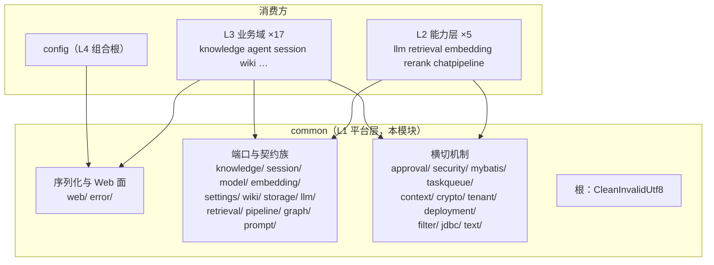
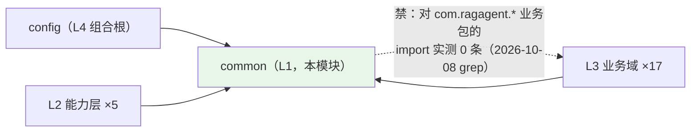
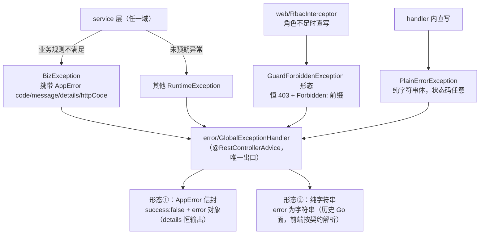
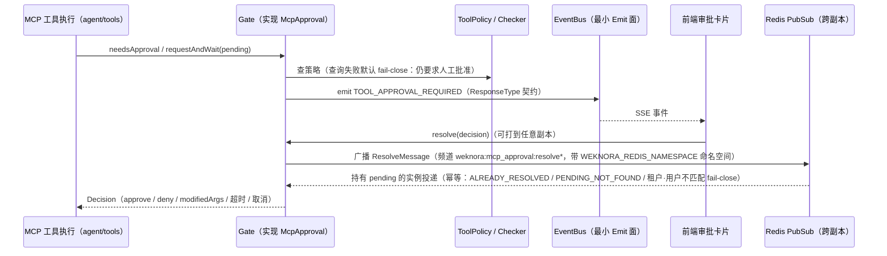
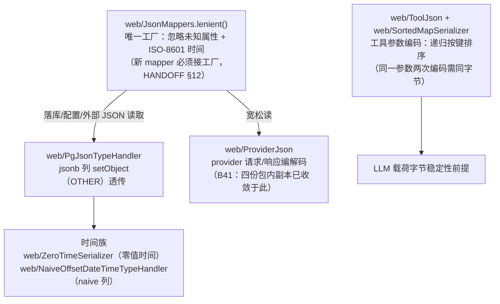

# common 模块手册

> **面向读者**：第一次接手 `com.ragagent.common` 的架构师 / 高级开发者。
> **目标**：30 分钟建立全局观 → 能定位改动点 → 能安全迭代（本包有 110 个专属用例兜底，背后还有全仓 4,800+ 用例与包结构守卫，改错会立刻红）。
> **数据口径**：2026-10-08 实测（`wc -l` 口径）：**125 个 java 文件 / 约 9.0 千行（8,979）/ 25 个子包 + 根**。
> **本文档的地位**：模块级导览；仓库级作业规范见仓库根 `HANDOFF.md`（§12 结构地图、§13 踩坑清单、§14 逐包重构范式）。

---

## 0. 一分钟速览

**它是什么**：全仓唯一的 **L1 平台层 + 中立契约层**——两类东西住在这里：

1. **横切基础设施**：统一错误形态（`error/`）、JSON 与 Web 面（`web/`）、安全（`security/`、RBAC）、租户上下文、加密、MyBatis 守卫、Redis 队列骨架、部署 env 读取；
2. **跨域端口与契约**：各域的只读/命令端口（`knowledge/`、`session/`、`model/`、`embedding/`、`settings/`、`wiki/`、`storage/`）、线上契约载荷（`llm/`、`retrieval/`、`pipeline/`、`graph/`）、共享审批机制（`approval/`）。它们住进 common 不是因为"公共"，而是因为**依赖方向**：消费域 → 端口 ← 实现域，端口放最底层才能让全仓零包间环（2026-09-30 起已达成，守卫 `scripts/check-package-cycles.py` 挂 CI）。

**它不是什么**（别在这里改）：

| 不负责 | 归属 |
|---|---|
| 业务实体与表（`Model` / `Message` / `StorageBackend` …） | 各域 `domain/`（下沉的是 *Facts 载荷 + 端口*，不是实体——实体下沉曾是多组环的成因） |
| Spring 装配与 Bean 定义 | `config`（组合根，只出不进；`AppEnvLookup` 的装配点就留在 config） |
| 业务 HTTP 端点 | 各域 `controller/`（common 仅 1 个无认证探活 `HealthController`，`GET /health`） |
| provider 的 HTTP 实现细节 | `embedding/`、`rerank/`、`llm/` 能力层的 provider 族（common 只给编解码工具 `ProviderJson`） |
| 事件总线本体 | `event/`（`approval/` 里只留最小 Emit 面，见其 javadoc"为什么只留 Emit"） |

### 图 1：模块全景



**三个必须知道的数字**：**28/28**——除自身外全部 28 个顶层包都直接 import 它（580 个文件，全仓最广）；**4,089 行**——`approval/`(1,755) + `settings/`(1,199) + `web/`(1,135) 三个子包就占全包 46%，是改动重心；**655 行**——最大类 `approval/Gate`（MCP 审批门，语义要点全在 javadoc）。

---

## 1. 目录结构与职责

### 1.1 子包清单（放什么 / 不放什么）

| 子包 | 文件/行数 | 放什么 | **不放什么** |
|---|---|---|---|
| `web/` | 16 / 1,135 | JSON 工具面（`JsonMappers.lenient()` 唯一工厂、`PgJsonTypeHandler` jsonb 适配、`ProviderJson`、`ToolJson`、`SortedMapSerializer`、时间序列化器）、请求面（`NonNullBody`/`RejectEmptyBody` + Advice、`PageParams`、`RequestFields` 校验文案）、`RbacInterceptor`、探活 `HealthController`、`HtmlText` | 业务端点（仅 1 个探活）、域内序列化定制品 |
| `error/` | 6 / 487 | `AppError`（错误信封 record）+ `ErrorCode`（28 个错误码分段表）+ `BizException` + `GlobalExceptionHandler`；两种历史"纯字符串"形态（`GuardForbiddenException` 恒 403、`PlainErrorException`） | 逐域错误语义（各域抛 `BizException` 带码即可） |
| `approval/` | 24 / 1,755 | 共享 MCP 审批机制：`Gate`（655 行，跨副本经 Redis PubSub）、`ToolPolicy` 策略查询、事件体/Resolve 报文（键名与 mcp 消费方成对）、`SpringRedisPubSub` | 事件总线本体、工具执行逻辑 |
| `settings/` | 7 / 1,199 | 跨域设置：`SystemSettingRegistry`（system_settings 的 in-code 注册表 17 条，唯一权威）+ 只读端口 `SystemSettingGateway`；`ConversationProperties`；memory 族（`MemoryConfig` jsonb 载荷 / `MemoryKeys` / `MemoryKinds`） | system 域的设置 CRUD 服务（端口由 system 侧实现） |
| `security/` | 5 / 657 | `SsrfGuard`（353 行：URL 校验 + 双来源白名单）、`InputSanitizer`、`LogSanitizer`、`IpClass`、`SsrfWhitelistProperties` | 业务级鉴权（那在 `web/RbacInterceptor` 与各域守卫） |
| `mybatis/` | 3 / 334 | 持久层机器守卫：`FullTableWriteGuard`（全表改删防护，fail-open）、`TenantFilterGuard`（租户过滤缺失探测，默认 alert）、`PageRequests`（分页工厂，替 `.last("LIMIT …")` 拼接） | 仓储实现、SQL |
| `knowledge/` | 10 / 204 | 知识域跨域端口与载荷：`KnowledgeBaseGateway`/`Search`/`Document`/`ChunkSearch` + 各 `*Facts` + 命令端口 `KnowledgeBaseProvisioner` | 知识域实现（在 knowledge 域内实现端口） |
| `session/` | 6 / 121 | 会话域端口与"管线视图"载荷：`SessionMessagePort`、`PipelineMessageView` 族 4 个 + `PipelineUsedMemoryView` | 会话实体 `Message`（成环成因，禁止） |
| `wiki/` | 7 / 777 | wiki 端口与共享纯逻辑：`WikiIngestPort`/`WikiFinalizePort`（最窄接口）、`WikiImageMarkup`（348 行，URL 脱敏/还原）、`WikiLanguageSupport`、`ExtractedItem`（键名被 prompt 正文钉住） | `WikiIngestService`（1,198 行、依赖整套 wiki 服务，进不来的典型） |
| `storage/` | 6 / 244 | 纯规则 + 端口：`UploadLimits`、`StorageAllowList`、命令端口 `StorageBackendProvisioner`、启动期快照 `StorageRuntimeEnv`（只许装配层 `install`） | 对象存储实现（在 storage 域） |
| `text/` | 4 / 278 | 无状态文本工具：`Whitespace`（Unicode White_Space）、`CodePointOrder`（码点序）、`PosixPath`、`TextConv`（繁→简，内嵌 opencc 词典） | 带 IO 的工具 |
| `prompt/` | 3 / 230 | 提示词共享面：`AgentPromptPlaceholders`、`MessageAttachmentsPrompt`、`PromptInstructions` | 各域 prompt 正文（键名由各域 prompt 文本钉住） |
| `retrieval/` | 2 / 266 | `SearchResult`（SSE `references` 契约，**字段序不可动**）+ `RetrievalDriverProperties` | 检索引擎（在 retrieval 域） |
| `taskqueue/` | 1 / 229 | `RedisTaskQueueCore`：knowledge/memory/datasource 队列共享的 Redis 队列骨架 | wiki 队列（有 TaskID 合并与死信语义，自成一派） |
| `context/` | 2 / 182 | `TenantContext`（请求级认证会话）、`TracingContext`（`lf_*` 平铺观测载具，跨进程续 trace） | ThreadLocal 传播框架（虚拟线程下显式取值传递） |
| `llm/` | 2 / 153 | `ResponseType`（SSE `response_type` 线上契约）、`ToolResult`（工具调用协议载荷，字段序即契约） | LLM HTTP 客户端 |
| `crypto/` | 2 / 152 | `CryptoService`（AES-256-GCM + `enc:v1:` 前缀）、`CryptoEnvProperties`（`SYSTEM_AES_KEY`） | 密钥管理服务（env 直读，恰 32 字节才可用） |
| `pipeline/` | 2 / 114 | `SearchParams`（序列化进 PipelineLog params 载荷，改键=改落库契约）、`ChunkTypes` 常量 | 管线编排（在 chatpipeline） |
| `graph/` | 4 / 75 | 图形模型值类型 `GraphData`/`GraphNode`/`GraphRelation`/`NameSpace`（knowledge 抽取、retrieval 落 Neo4j、chatpipeline 三域共用） | Neo4j 访问 |
| `model/` | 2 / 26 | `ModelGateway` 只读端口 + `ModelFacts` 最小事实集载荷 | `Model` 实体（model⇄retrieval 环的成因） |
| `deployment/` | 2 / 86 | `AppEnvLookup`（应用级 env 查找面，读点跨 11 个域才落这里）+ `DeploymentProperties`（`WEKNORA_EDITION`/`DEPLOYMENT_MODE`） | 各域自己的 env 族（各有 `*EnvLookup`/`*Properties`） |
| `tenant/` | 3 / 100 | `TenantRole`（等级间距 10）、`TenantProperties`（`weknora.tenant.*`）——2026-09-30 自 auth/config 下沉，消 `common ⇄ config` 环 | auth 域逻辑 |
| `embedding/` | 2 / 32 | `EmbeddingGateway` 端口 + 载荷（消检索引擎 → 知识域反边） | 嵌入 provider 实现 |
| `filter/` | 1 / 37 | `RequestIdFilter`（X-Request-ID → MDC + TenantContext） | 其他 servlet filter |
| `jdbc/` | 1 / 49 | `DatabaseDialects`（方言判定收敛一处；2026-10-05 八处本地副本清零） | 各仓储的方言 SQL |
| 根 | 2 / 57 | `CleanInvalidUtf8`（丢 NUL 与孤立代理项）+ `package-info` | 容器类（`*Util` 大杂烩禁止） |

### 1.2 依赖方向（只允许向下，且本包在最底）



**"零向上依赖"是本包的存在前提**，且已被包结构守卫（`scripts/check-package-cycles.py`，挂 CI 的 `guards` job）机器强制：基线 环 0 组 / 依赖 config 1 包 / L2→L3 直连 6 条（合法方向）。2026-10-02 的 B33 事故是反例教材——两个工具放错层（`AppEnvLookup` 曾在 config）立刻把守卫打到红灯（环 5 组），归位 `common/deployment`、`common/storage` 后回绿。**任何让 common import 业务包的改动都会重新成环，守卫会拦。**

---

## 2. 数据模型

**不适用**：本包没有任何 `@TableName` 实体、不拥有任何表——它是契约层不是数据层。但有两个"准数据模型"面需要知道归属：

| 面 | 类型（在 common） | 表与实体归属 |
|---|---|---|
| 租户记忆开关 | `settings/MemoryConfig`（`tenants.memory_config` jsonb 的**载荷**；恒输出、禁止条件键，javadoc 有逐字段示例） | `tenants` 表与实体在 auth 域；memory 语义在 memory 域 |
| 系统设置 | `settings/SystemSettingRegistry`（17 条 key 的 in-code 注册表：合法性 + 类型 + ENV 回退名 + 默认值） | `system_settings` 表与 CRUD 在 system 域（经 `SystemSettingGateway` 只读端口对外） |

jsonb 落库的技术细节（`PgJsonTypeHandler` + `autoResultMap`、wrapper 三参写法）见 knowledge 手册 §2.2——handler 的本体在本包 `web/`，但用法纪律写在知识域手册里。

---

## 3. 被依赖面：谁在用我

### 3.1 消费方统计（2026-10-08 实测：`import com.ragagent.common`）

**除自身外 28/28 个顶层包（100%）依赖本包**，共 580 个文件带 import（含 common 内部互引共 593 个文件）：

| 层 | 消费方（引用文件数） |
|---|---|
| L3 业务域 | agent 59 · knowledge 57 · session 43 · datasource 41 · mcp 38 · wiki 36 · memory 36 · auth 29 · chatpipeline* 28 · im 24 · websearch 20 · storage 20 · model 8 · system 7 · initialization 7 · embed 6 · audit 5 · vectorstore 4 · evaluation 3 · favorite 2 |
| L2 能力层 | llm 44 · retrieval 29 · embedding 11 · rerank 8 · stream 2 · event 2 · tracing 4 |
| L4 组合根 | config 7 |

\* chatpipeline 计入业务域（管线宿主）。

**最热的三个面**（改前先掂量）：

| 面 | 引用规模 | 说明 |
|---|---|---|
| `common/web` | 206 个文件 | 全仓最广的单一子包：datasource 32 · memory 23 · knowledge 22 · agent 20 · websearch 14 … |
| `common/settings` | 34 个文件 | memory 21 · session 5 · auth 4 · knowledge 2 · system 1 + 应用装配 |
| `common/approval` | 14 个外部文件 | agent/tools 5 · mcp 5 · session/service 2 · event 1 · im/service 1 |

`JsonMappers.lenient()` 单点被 38 个文件调用；`ErrorCode` 是前端按 code 分支的契约。

### 3.2 使用约定（什么时候允许往 common 放类型）

**允许**（端口/契约判据，逐条都有已落地的先例）：

1. **跨域端口 + 最窄载荷**：两个以上域要读/写某域的数据时，接口与 `*Facts` 载荷落 common，实现留域侧。载荷"只带消费方真正读取的字段；需要更多字段时先改载荷，别把实体漏出去"（`knowledge/`、`session/` package-info 原文）。
2. **线上契约集中地**：多模块各写一份字符串/字段序必然漂移 → `ResponseType`、`SearchResult`、`ChunkTypes`。
3. **纯规则 / 纯配置**：无数据访问、无仓储依赖、被多域共用 → `UploadLimits`、`StorageAllowList`、`TenantRole`。
4. **横切机制本体**：审批门、SSRF、RBAC、加密、mybatis 守卫、Redis 队列骨架。
5. **解环需要的下沉配置**：被"组合根只出不进"卡住的配置类 → `tenant/`、`settings/`（2026-09-30 下沉先例）。

**不允许**（杂物抽屉判据）：

1. **只有一个消费方的类型**——先放域内，出现第二个消费方再下沉（所有下沉批次都是"环"逼出来的，不是预防性的）。
2. **领域实体**——`Model`/`Message`/`StorageBackend` 实体下沉曾各造成一组环；下沉的永远是 Facts/端口。
3. **重实现**——`WikiIngestService` 1,198 行进不来，进来的只有 `WikiIngestPort`；provider HTTP 客户端留在 `embedding/provider/`。
4. **Spring 装配**——装配点在 config（`RuntimeSnapshotWiring`、`AppEnvLookupEnvironmentPostProcessor`），common 只提供类型。

---

## 4. 核心链路

### 4.1 错误信封的流转（一个出口、两种形态）



**为什么有两种 403**：路由中间件与 handler 的历史形态不同（`GuardForbiddenException` javadoc 详述），前端按契约分别解析——别"顺手统一"，那是契约变更不是重构。错误码分段见 `ErrorCode`：通用 1000–1010 · 租户 2000–2099 · Agent 2100–2199 · 向量库绑定 2200–2201 · 模型 2300–2399 · 知识域 2400–2499（共 28 个，加新码取对应段下一号，别复用已分配值）。

### 4.2 MCP 工具审批门（common 里最大的机制）



无 Redis 时退化为单进程行为（部署须开粘性会话）；断线按 1s→30s 指数退避重连。`EventBus` 只留 Emit——订阅方是 SSE 转发层，属于 agent/流式模块，本包不重复建设。

### 4.3 JSON 工具面（请求/落库/外部三向的单一实现群）



历史上的 Go 兼容序列化层（`GoJson` 族、"Go 工具面 5 类"）**已全部退役**，本图即退役后的现状（详见 §7 第 3 条）。

---

## 5. 改哪里（场景 → 文件）

| 我想… | 主要改这里 | 别忘了 |
|---|---|---|
| 加/改错误码 | `error/ErrorCode`（分段取号）+ `error/AppError` 工厂方法 | 前端按 code 分支，**同批改前端**；details 恒输出（`ALWAYS`） |
| 改错误信封/校验文案 | `error/GlobalExceptionHandler` + `web/RequestFields`（B82 单一实现） | 400 details 是"字段名: 原因"格式，@Valid 注解显式写 message 避免 locale 漂移（§13.10） |
| 改 JSON 读取策略 | `web/JsonMappers` | 新 mapper 必须接 `lenient()` 工厂；旧域逐类 `@JsonIgnoreProperties` 勿批量删（HANDOFF §12 第 12 条） |
| 加 provider 编解码需求 | `web/ProviderJson` | **禁止**再复制包内副本（B41 之前有四份，全部收敛） |
| 改工具 JSON 字节形态 | `web/ToolJson` + `web/SortedMapSerializer` | 递归键排序是 LLM 载荷字节稳定前提；契约测试钉住键序 |
| 加跨域只读/命令端口 | `common/<域>/` 加接口 + `*Facts` 载荷；实现放对应域 | 载荷只带消费方真正读取的字段；跑包守卫确认零环 |
| 改审批门语义 | `approval/Gate` + `GateOptions` | fail-close 是默认；报文键名与 mcp 消费方成对，ApprovalWireFormatTest 钉住 |
| 加系统设置 key | `settings/SystemSettingRegistry`（17 条注册表） | 它是唯一权威（Update 拒绝表外 key）；**Description 文案是响应体的一部分** |
| 改 RBAC/租户角色 | `web/RbacInterceptor` + `tenant/TenantRole` | 403 是纯字符串形态（§4.1）；装配在 `config/WebConfig` |
| 改 SSRF 策略 | `security/SsrfGuard` + `SsrfWhitelistProperties` | 白名单双来源：ENV 启动期兜底 + 系统设置运行时 `reloadWhitelist` |
| 改持久层防护/分页 | `mybatis/FullTableWriteGuard`（登记面）/ `PageRequests` / `TenantFilterGuard` | 全表写必须具名 Mapper 方法 + `FULL_TABLE_ALLOWED` 登记；`.last("LIMIT…")` 拼接已清零勿回流 |
| 加部署 env 读取 | `deployment/` 或域内 `*Properties` | env 名经松散绑定保持原样；静态快照族（`StorageRuntimeEnv` 等）**只许装配层 install** |
| 改上传限额/存储白名单 | `storage/UploadLimits` + `storage/StorageAllowList` | Properties 类只承载原始串，解析规则留在规则类 |
| 加队列 Redis 实现 | `taskqueue/RedisTaskQueueCore` 复用 | wiki 自成一派（TaskID 合并 + 死信），勿强改归一 |
| 改 SSE 事件类型 | `llm/ResponseType` | **线上契约**，取值字面量不可动；实际 23 个取值（类注释写 22，已落后于实际，勿照抄） |

---

## 6. 常见迭代 SOP

> 铁律：**一次只动一个轴**；common 的改动面是全仓（§3.1），每步结束**全绿**再走下一步。

```bash
# 每次改动后必跑（约 3 分钟）
cd ~/ragagent && JAVA_HOME=/opt/homebrew/opt/openjdk@21/libexec/openjdk.jdk/Contents/Home \
  ./gradlew :domains:test :domains:spotlessCheck
# 动了包结构（新增子包/跨包引用）后必跑包守卫
python3 scripts/check-package-cycles.py
# 若契约夹具需要重录（改 JSON 形状），跑单类带开关，随后必须结构化复核差异（HANDOFF §13.12/13.13）
#   … --tests "…" -Dcontract.refresh=true
```

**A. 加跨域端口/载荷（解环用）**：识别第二个消费方 → `common/<域>/` 定接口与 `*Facts`（最窄读取面）→ 域侧实现端口 → 调用点改注入接口 → 包守卫 + 全量绿 → 提交。判据见 §3.2，禁止预防性下沉。

**B. 加错误码/错误面**：`ErrorCode` 对应分段取号 → `AppError` 工厂 → （新形态时）handler 增补 → 前端同批 → 全量绿。

**C. 动 JSON 形状/策略**：先 grep 引用面（`web/` 206 文件）→ 改 `JsonMappers`/`ToolJson`/`ProviderJson` → 涉契约夹具的走重录开关并**结构化复核**（掩码正则按键名匹配，键改名须同步放宽，§13.13）→ 前端可见契约同批 → 全量绿。

**D. 收敛第 N 份副本进 common**：逐字比对证明语义一致（HANDOFF §13.5 忠实性口径）→ 新实现落 `web/` 或 `text/` → 全部调用点改写补 import → 删副本 → 全量绿（B41/B45/B85 是范本）。

**E. 加 env/配置读取**：`*Properties` 承载原始串（env 名松散绑定保持原样）→ 解析/缺省留在规则类 → 静态快照族只许 `config.RuntimeSnapshotWiring` 调 `install` → `RuntimeSnapshotTest` 绿。

---

## 7. 模块约定与坑（必读）

1. **改 common 类型 = 全仓改动**：580 个文件带 import，`web/` 单子包 206 个。动 `ErrorCode`/`ResponseType`/`SearchResult`/`MemoryConfig` 这类契约前，先按 §3.1 grep 引用面、按 §6 控制批次粒度——"一次只动一个轴"在这里不是风格建议是止损手段。
2. **端口载荷的纪律**：`*Facts`/`*View` 只带消费方真正读取的字段；要更多字段**先改载荷**，绝不为省事把域实体（`Model`/`Message`/`StorageBackend`）当载荷——那是 2026-09-30 之前多组包间环的直接成因（`backend-package-map.md` §P0）。
3. **Go 兼容序列化层已退役，别再按旧待办推进**：knowledge 手册 §9 写的"`common/web` 全仓 400+ 引用必须一次性全仓删除"**已完成**——线上对齐面 2026-09-30（`0ac456e`，摘 156 处注解 + 删 `JacksonConfig`）；工具面档 3（B37~B47，2026-10-03）与 B76（2026-10-07）收口，**main 源码 Go* 类现为 0**（2026-10-08 find 实测）。剩余冻结面见 §9。今天的 `web/` 是 Java 本位工具面（§4.3）。
4. **`GoRecording*` 实录（测试侧 7 份）禁止手改**：录制源（Go 服务）已下线、无法重录（B39 关键发现）；比对方式已改为 `ContractJson.deep` 语义比较（B40）。动了实录等于毁掉唯一契约基线。
5. **字段序与取值字面量是线上契约**：`llm/ResponseType`（SSE `response_type`）、`retrieval/SearchResult`（SSE `references` 事件逐字节输出）、`llm/ToolResult`（"字段序即线上契约，不要重排"）。改它们 = 改前端契约，前后端同批。
6. **`settings/MemoryConfig` 恒输出**：所有字段禁止条件键——字符串写 `""`、计数写 `0`、指针写 `null`（javadoc 有逐字段示例）。别加 `@JsonInclude` 省空值（仓内 `NON_DEFAULT` 吞有意义 0 的前科，knowledge 手册 §7 第 5 条同理）。
7. **静态快照族只许装配层写入**：`storage/StorageRuntimeEnv` 等"启动期 env 快照"的 `install` 只允许 `config.RuntimeSnapshotWiring` 调用；运行期改值是未定义行为（B6 确立的启动期快照口径）。
8. **`mybatis/FullTableWriteGuard` 的 fail-open 是刻意设计**：本仓 Mapper 注解满是 PG 方言 SQL，JSqlParser 解析不了就放行——改 fail-fast 会炸合法写路径（javadoc 详述）。全表写走"具名方法 + 登记"，别绕。
9. **`security/InputSanitizer` 的"放行"是契约**：XSS 正则要求闭合标签，`<script>x`（无闭合）会放行——"既有契约行为，别顺手修好"（javadoc 原文）。
10. **approval 的 JSON 用独立 ObjectMapper**：pubsub 报文不受 web 层定制（时区/命名策略）影响（`ApprovalJson` javadoc）——别"统一"到 Spring 的 mapper。
11. **测试 shell 的 env 泄漏**（HANDOFF §13.9）：`source .env` 后跑全量，`SYSTEM_AES_KEY` 会让 `CryptoService` 走加密分支、孤零零红 1 个环境相关用例——先 `env | grep SYSTEM_AES` 再怀疑回归。
12. **项目不使用 Lombok**（`approval/PendingRequest` javadoc 明示项目约定）；builder 手写。
13. **`HealthController` 是本包唯一的 `@RestController`**（`GET /health` 探活、无认证）。加业务端点请回各域 controller——基础设施包出现第二个端点就该警觉。

---

## 8. 测试与验证

- **规模**：`domains/src/test/java/com/ragagent/common/` 下 **20 个 java 文件 / 15 个测试类 / 110 个 `@Test`**（另 5 个是测试脚手架：`JsonRoundTrip`、`FakeRedisPubSub`、`RecordingEventBus`、`StubChecker`、`TestCancellation`）。
- **分布**：根 `JsonContractRoundTripTest` 36（JSON 形状往返）+ `RuntimeSnapshotTest` 4；`approval/` 42（`GateTest` 24、`ApprovalWireFormatTest` 7、`GateCrossInstanceTest` 5、`ToolPolicyTest` 4、`SpringRedisPubSubTest` 2）；`web/` 17（`ValidationContractTest` 8、`ContractTest` 4、`JsonFaceVocabularyTest` 3、`RequestFieldsTest` 2）；`text/TextConvTest` 4；`security/IpClassTest` 3；`settings/SystemSettingRegistryTest` 2；`context/TracingCarrierNestingTest` 2。
- **契约钉子**：`approval` 的报文键名、`web/` 的校验文案与 JSON 面词汇、`RuntimeSnapshotTest` 的启动期快照口径——动这些面的批次必须同批补断言。
- **本包之上还有全量闸门**（§6 命令块）：common 类型被全仓 4,800+ 用例间接覆盖，改契约面先跑全量再谈"没问题"。
- **已知偶发 2 例**（全仓级、不在本包，遇到先单独重跑别误判回归）：
  - `WebToolsRecordingTest.searchWithContentFetchesLeadingPagesViaSharedFetchTool`（现位于 `agent/tools/web/`，全量并发下偶发）；
  - `EvaluationContractTest.getTerminalRunsExecution`（全量并发下偶发；单独 `--tests "*EvaluationContractTest"` 通过）。

---

## 9. 已知待办与风险（接手后优先看）

| 项 | 性质 | 建议 |
|---|---|---|
| ~~Go 兼容序列化层（`common/web`）一次性全仓删除~~ | **已完成**（knowledge 手册 §9 该行过时） | 2026-09-30 线上对齐面 + 2026-10-03~10-07 档 3（B37~B47）/B76 收口；main 零 Go* 类。勿再立项"清理 common/web 的 Go 层" |
| `GoRecording*` 实录 7 份（测试侧） | 冻结面 | 录制源已下线、禁止手改；被实录覆盖的面的退役必须先立基线重建机制（B39/B40 先例：改比对方式，不改实录） |
| `TenantFilterGuard` 默认 alert 档 | 工程债 | 首盘 6,084 告警 / 73 语句 / 21 表（B70）；enforce 切档待逐表定性（B71+），别全局切 |
| 静态分析闸门缺失 | 工程债 | 死局部变量、静态方法误用实例调用等只有 IDE 能发现（沿 knowledge 手册 §9）；建议 Checkstyle / ErrorProne 进 CI |
| 空白判断仍有零散私有实现 | 小 | B45 收敛后 rss（`RssUtil`）/memory（`MemoryScopes`）各留一处带注释的私有实现，触碰时顺手收敛进 `text/Whitespace` |
| `ResponseType` 类注释写"22 个"、实际 23 个取值 | 文档漂移 | 下次触碰该类时回填注释计数；以枚举为准 |

---

## 10. 速查：本模块的"地标"

| 想知道 | 看这里 |
|---|---|
| 统一错误形态怎么出 | `error/GlobalExceptionHandler` + `AppError`/`ErrorCode`（§4.1） |
| 读落库/外部 JSON 该用哪个 mapper | `web/JsonMappers.lenient()`（唯一工厂；HANDOFF §12 第 12 条） |
| jsonb 列怎么读写 | `web/PgJsonTypeHandler`（用法纪律见 knowledge 手册 §2.2） |
| provider 请求/响应怎么编解码 | `web/ProviderJson`（四副本收敛后的单点，B41） |
| 工具参数为什么字节稳定 | `web/ToolJson` + `web/SortedMapSerializer`（递归键排序） |
| SSE 事件类型有哪些 | `llm/ResponseType`（23 取值，线上契约） |
| MCP 审批怎么走 | `approval/Gate` + `McpApproval`（§4.2） |
| 跨域端口都定义在哪 | `knowledge/` `session/` `model/` `embedding/` `settings/` `wiki/` `storage/`（各有 package-info 职责地图） |
| 哪些系统设置 key 合法 | `settings/SystemSettingRegistry`（17 条，唯一权威） |
| RBAC / SSRF / 输入消毒 | `web/RbacInterceptor` + `tenant/TenantRole` / `security/SsrfGuard` / `security/InputSanitizer` |
| 全表写防护、分页、租户过滤探测 | `mybatis/` 三件（B69/B70 落地） |
| 部署 env 从哪读 | `deployment/` + 各域 `*Properties`；AES 密钥在 `crypto/CryptoService`（`SYSTEM_AES_KEY`） |
| 方言判定为什么全仓只有一处 | `jdbc/DatabaseDialects`（2026-10-05 八处副本清零） |
| 目录为什么这样分 | 本文 §1 + 7 份 `package-info`（根/approval/embedding/knowledge/session/settings/tenant——有 package-info 的子包就这 7 个，其余以本表为准） |
