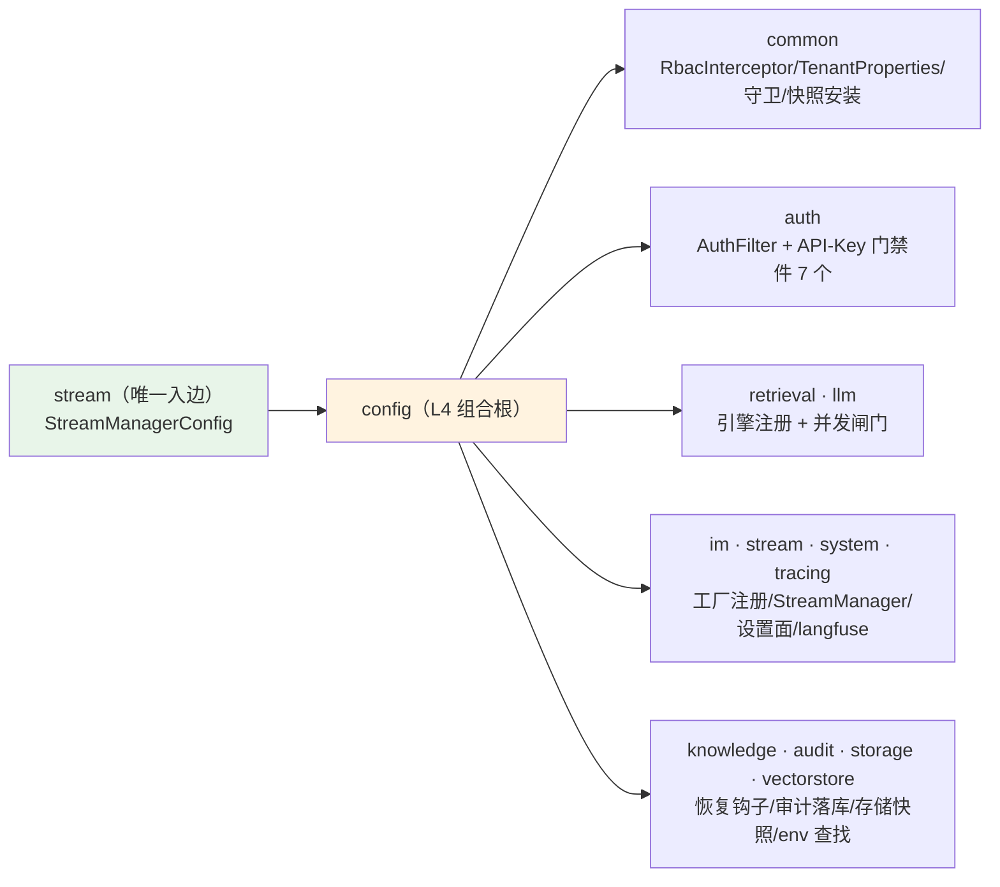
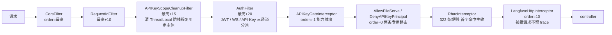
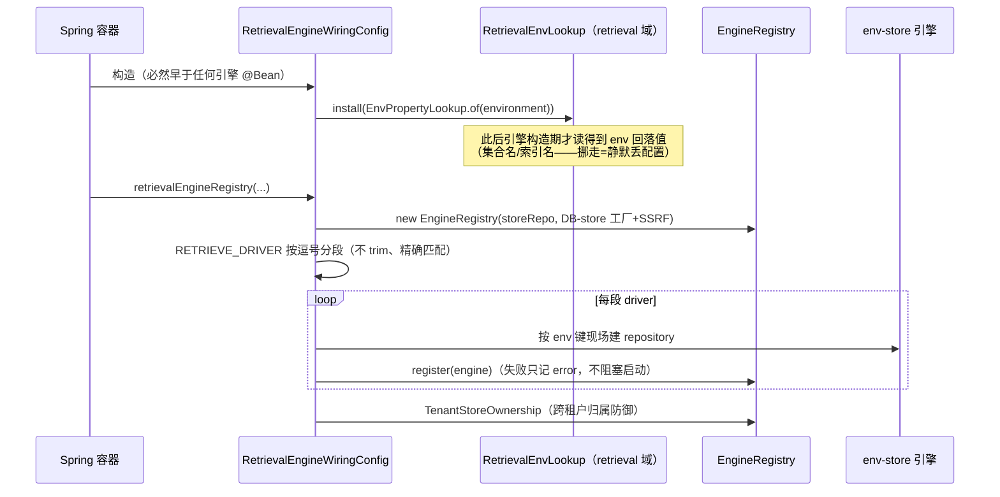
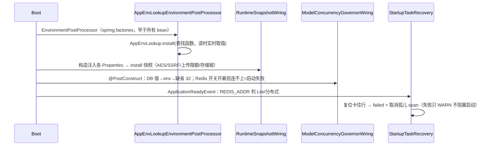

# config 模块手册

> **面向读者**：第一次接手 `com.ragagent.config` 的架构师 / 高级开发者。
> **目标**：30 分钟建立全局观 → 能定位改动点 → 能安全迭代（本包 35 个装配单测兜底，跨域行为由各域契约测试兜底，改错会立刻红）。
> **数据口径**：2026-10-08 实测（`wc -l` 口径）：**13 个 java 文件 / 约 1.7 千行（1,689 行）/ 0 个子包（扁平）**。
> **本文档的地位**：模块级导览；仓库级作业规范见仓库根 `HANDOFF.md`（§12 结构地图、§13 踩坑清单、§14 逐包重构范式）。

---

## 0. 一分钟速览

**它是什么**：L4 **组合根**——Spring 装配层，"把零件接起来"的地方：过滤链/拦截器（含全仓 RBAC 规则表）、检索引擎注册表、IM 适配器工厂、MyBatis 插件链、并发闸门、启动期快照与启动恢复。`package-info` 原文：*不含业务逻辑；业务规则请放到对应域，这里只做"把零件接起来"。*

**它不是什么**（别在这里改）：

| 不负责 | 归属 |
|---|---|
| 业务配置值 / 运行时设置（`model.max_concurrency` 的值、租户 KV） | `system` 域（`SystemSettingService`）与各域 `@ConfigurationProperties`（本包只做**装配与安装**） |
| RBAC 判定逻辑本体（谁能过、怎么判） | `common/web/RbacInterceptor`（本包只**登记规则**） |
| 检索引擎协议、九家店适配 | `retrieval/engine/`（本包只注册 env-store 与 DB-store 工厂） |
| IM 渠道收发实现 | `im/` 九个渠道子包（本包只 `registerAdapterFactory` 一行一家） |
| 可复用工具 / 查找面（曾被误放这里） | `common`（见 §7 坑 3：`AppEnvLookup` 已下沉 `common/deployment`） |
| HTTP 端点 | 无 `@RestController`（实测 0 个）——装配层没有业务 HTTP 面 |

### 图 1：模块全景（12 个类型，各装各的）

```mermaid
graph TB
    subgraph config_L4组合根
        WEB["WebConfig · 657 行<br/>过滤链 4 + 拦截器 5<br/>RBAC 规则 322 条 + 能力快照 bean"]
        RET["RetrievalEngineWiringConfig · 394 行<br/>EngineRegistry + 九家 env-store<br/>+ RetrievalEnvLookup.install"]
        REC["StartupTaskRecovery · 202 行<br/>启动恢复：卡住行复位 failed"]
        GOV["ModelConcurrencyGovernorWiring · 99 行<br/>模型并发闸门 Local/Redis"]
        OSS["OpenSearchAuditSinkAdapter · 71 行<br/>驱动审计事件 → audit 域"]
        IM["ImAdapterWiringConfig · 55 行<br/>10 个 IM 平台工厂注册"]
        SNAP["RuntimeSnapshotWiring · 55 行<br/>启动期快照：AES/SSRF/上传限额/存储"]
        EPP["AppEnvLookupEnvironmentPostProcessor · 33 行<br/>最早点安装 env 查找（spring.factories）"]
        LKP["EnvPropertyLookup · 33 行<br/>env 键→属性键回落查找函数"]
        MP["MybatisPlusConfig · 32 行<br/>分页 + 全表写防护 + 租户探测"]
        PROPS["StreamProperties · 30 行<br/>weknora.stream.* 绑定（唯一入边）"]
        ENVW["EnvLookupWiring · 23 行<br/>向量库 env 查找 bean"]
    end

    WEB --> A["全部 HTTP 域<br/>auth/mcp/audit/embed/evaluation…<br/>手册都指向它的规则表"]
    RET --> B["retrieval 域<br/>registry 的消费方是<br/>chatpipeline/knowledge/session"]
    IM --> C["im 域<br/>包外唯一消费方（im 手册原文）"]
    PROPS --> D["stream 域<br/>全仓唯一 import config 的包"]
    REC --> E["前端列表<br/>重启后不再永远转圈"]
```



**三个必须知道的数字**：最大类 657 行（`WebConfig`，占本包 39%，登记 **322 条 RBAC 规则** = 303 `addRule` + 19 `addSystemAdminRule`）；**出边 12 个顶层包、入边仅 1 个包**（`stream`——守卫基线 `scripts/package-cycles.baseline.json` 的 `depend_on_config=["stream"]`，"只出不进"由此钉死）；子包 **0 个**（backend-package-map §P1 判定"保持扁平，不拆"——装配层无天然族）。

---

## 1. 目录结构与职责

### 1.1 配置类清单（12 类型 + package-info）

| 类 | 行数 | 装配什么 | 被谁需要 |
|---|---|---|---|
| `WebConfig` | 657 | Servlet 过滤链（CORS→RequestID→APIKey 清理→Auth，order 最高/最高+10/+15/+20）+ 5 个拦截器（APIKey 门禁 -1、两条专用路由 0、RBAC、langfuse 10）+ **322 条 RBAC 规则** + `DeploymentCapabilitiesHolder` bean | 所有 HTTP 域；auth/mcp/audit/embed/evaluation 等 5+ 份模块手册的鉴权答案都指向它 |
| `RetrievalEngineWiringConfig` | 394 | 检索生产装配三件：`EngineRegistry`（挂 DB-store 工厂 + SSRF 策略）、按 `RETRIEVE_DRIVER` 逐段注册 env-store（postgres/es_v7/es_v8/opensearch/doris/qdrant/weaviate/milvus/tencent_vectordb/sqlite）、`TenantStoreOwnership`；**构造器里 `RetrievalEnvLookup.install`** | retrieval 域（§7 坑 1：install 点不能挪） |
| `StartupTaskRecovery` | 202 | `@EventListener(ApplicationReadyEvent)`：Lite 模式把卡住的 knowledge 解析/摘要行复位 failed + 取消孤儿 span；两种模式都复位 `sync_logs`（分布式加 30 分钟陈旧窗） | 用户（重启后不再永远转圈）；`KnowledgeService` 的重启文案映射消费它写下的文案 |
| `ModelConcurrencyGovernorWiring` | 99 | 后台模型并发闸门：limit = DB `model.max_concurrency` → env `WEKNORA_MODEL_MAX_CONCURRENCY` → 缺省 32；Local/Redis 二选一 | llm 域 `ConcurrencyGovernor` 的所有消费方 |
| `OpenSearchAuditSinkAdapter` | 71 | `@Component`：实现 retrieval 驱动的 `AuditSink` SPI——OpenSearch 建索引/重建索引事件 → audit 域（无租户上下文则跳过，防污染审计线） | retrieval 驱动（依赖箭头单向：驱动只调接口） |
| `ImAdapterWiringConfig` | 55 | 构造器里向 `ImService` 注册 **10 个平台工厂**（telegram/slack/qqbot/wecom/feishu/lark/dingtalk/wechat/mattermost/yunzhijia）+ 延迟注入 `StreamManager` | im 域的**包外唯一消费方**（im 手册原文） |
| `RuntimeSnapshotWiring` | 55 | 启动期快照安装：`WikiLanguageSupport` / `UploadLimits` / `CryptoService` AES key / `SsrfGuard` 白名单 / `StorageRuntimeEnv`（存储根 + STORAGE_TYPE）+ `StorageEnvLookup.install` | common 静态工具族与 storage 域查找面（值整进程只读） |
| `AppEnvLookupEnvironmentPostProcessor` | 33 | `EnvironmentPostProcessor`（经 `META-INF/spring.factories` 装载，**不是 bean**）：在所有 bean 实例化之前安装 `AppEnvLookup` 查找函数 | `common/deployment.AppEnvLookup` 的全部读点（启动 runner、`StartupTaskRecovery.distributed()` 等） |
| `EnvPropertyLookup` | 33 | 纯静态工具：造"**键名原样优先 → 属性风格回落**"的查找函数（`MINIO_ENDPOINT` → `minio.endpoint`） | 检索域与存储域查找面共用（语义一致的唯一来源） |
| `MybatisPlusConfig` | 32 | MyBatis-Plus 插件链：分页（maxLimit 1000）→ `FullTableWriteGuard`（禁无条件全表改删）→ `TenantFilterGuard`（SELECT 缺租户谓词探测，env `weknora.persistence.tenant-filter-guard`，**现默认 enforce**） | 全部落库域（`ListKnowledge` 真分页靠它） |
| `StreamProperties` | 30 | `@ConfigurationProperties("weknora.stream")` record：stream 后端选择（**精确匹配** `"redis"`）/ 键前缀（原样拼接）/ TTL | `stream/StreamManagerConfig`——**全仓唯一 import config 的文件** |
| `EnvLookupWiring` | 23 | 一行 bean：`EnvVectorStores.EnvLookup` 由 Spring `Environment` 支撑（可被测试属性/命令行覆盖） | vectorstore 域 env 族的查找面 |

> `package-info.java`（5 行）：包职责声明——"Spring 装配层…不含业务逻辑"。

### 1.2 依赖方向（L4 顶端，只出不进）



- **出边 12 个顶层包**（实测 grep 含全限定引用：common、auth、retrieval、llm、im、stream、system、tracing、knowledge、audit、storage、vectorstore）——装配一切是它的职责；
- **入边 1 个包**：`stream`（`StreamManagerConfig` → `StreamProperties`）。任何域不得依赖它——`python3 scripts/check-package-cycles.py` 守卫（基线棘轮，只许减不许增）；
- 判定记录：backend-package-map §P1 将本包判为"**保持扁平，不拆**"（判据：无天然族就不拆；判定时 9 文件，现 13，判定不变）。

---

## 2. 数据模型

**不适用**——本包是装配层：无 `@TableName` 实体、无 mapper、无表、无 jsonb 值类型，也不该有。

唯一接近"数据"的是 `StartupTaskRecovery` 里的三段 `JdbcTemplate` SQL（读写 `knowledges` / `sync_logs` / `task_pending_ops`，列名硬编码）：这是刻意的启动钩子直写（见 §7 坑 8）——它**不经 MyBatis 拦截器链**，`FullTableWriteGuard` / `TenantFilterGuard` 两道防护对这条通道不生效，改动时按裸 SQL 评审。

---

## 3. 被依赖面：谁在用我

### 3.1 依赖统计（基线证据）

| 方向 | 实测（2026-10-08） | 证据 |
|---|---|---|
| 谁依赖我（入边） | **仅 1 个包**：`stream`（1 个文件 `StreamManagerConfig.java:8` import `StreamProperties`） | `scripts/package-cycles.baseline.json` → `"depend_on_config": ["stream"]`；HANDOFF §7 同口径（"依赖 config 仅 1 包"） |
| 我依赖谁（出边） | **12 个顶层包**（见 §1.2） | grep 含全限定引用 |
| 历史峰值 | 一度 **11 个包**依赖 config（B6 批 10 把 `AppEnvLookup` 放错层）→ B33（2026-10-02）下沉后回基线 | HANDOFF §15 B33 行：守卫红灯"环 5 组 / 依赖 config 11 包"回绿 |
| HTTP 面 | `@RestController` **0 个** | grep 实测 |

**"只出不进"是本包的存在方式**：它 new 各域的零件（`AuthFilter`、`RbacInterceptor`、九家引擎 repository、10 个 IM 工厂都是装配点手 new，不是 bean），各域对它零感知。反向 import 一律视为架构红灯。

### 3.2 装配约定（什么该进 config、什么不该）

| 该进 | 不该进 |
|---|---|
| Bean 定义与跨域接线（`@Configuration`） | 业务规则 / 用例编排（→ 各域 `service/`） |
| 启动期快照安装（**`install*` 只许装配层调用**——ArchUnit A4 红条） | 运行期可变的值（那是状态，另行设计——`RuntimeSnapshotWiring` javadoc 原文） |
| 横切属性绑定类（如 `StreamProperties`） | 域内业务属性类（放各域；**必须**被 `RagAgentApplication` 的 `@ConfigurationPropertiesScan` 名单覆盖——A2，漏 = 静默取默认值） |
| 生命周期钩子（`ApplicationReadyEvent` 启动恢复） | 可复用工具 / 查找面（→ `common`；B33 教训，见 §7 坑 3） |
| 领域零件的注册（引擎 / IM 工厂 / MyBatis 插件） | HTTP 端点、实体、mapper（装配层没有这些） |

---

## 4. 核心链路

### 4.1 HTTP 请求链（一次请求经过的层，order 即顺序）



三个装配要点（都写在 `WebConfig` 注册处注释）：APIKey 门禁**必须先于** RBAC（能力判定先于角色判定，且 RBAC 对 API-Key 主体短路）；静态段规则**先于** `/{id}` 通配登记（AntPathMatcher 取首个命中）；RBAC 拦截器的 pattern 覆盖清单要与规则成对维护（曾有"规则在、pattern 不覆盖 → 空转"的 W5a 漂移，见 §7 坑 4）。

### 4.2 检索引擎 wiring（构造期安装 → 注册表 → env-store）



### 4.3 启动时序（四个安装点，谁先谁后是正确性的一部分）



---

## 5. 改哪里（场景 → 文件）

| 我想… | 主要改这里 | 别忘了 |
|---|---|---|
| 给新端点加角色门 | `WebConfig.addInterceptors` 里 `rbac.addRule`（域规则）或 `addSystemAdminRule`（平台级） | 静态段先于通配登记；拦截器 pattern 清单要覆盖该前缀；API-Key 需可达时去 `auth/apikey/filter/APIKeyRoutePolicies` 同批登记（不登记 = default deny） |
| 新增一个 IM 渠道 | `im/` 落 adapter + `ImAdapterWiringConfig` 构造器 `registerAdapterFactory` 一行 | 未注册平台 `startChannel` 只打 WARN、渠道不启动——绝不静默假装成功（javadoc 原文） |
| 接一家新检索引擎店（env-path） | `RetrievalEngineWiringConfig`：`envXxx` 私有方法 + `registerEnvStores` switch 分支 | 与 retrieval 域五处同批（retrieval 手册 §5"接一家新引擎店"行）；地址构造期过 SSRF 校验；失败只记 error 不炸装配 |
| 加一个 `@ConfigurationProperties` 属性类 | record + `@ConfigurationProperties`（横切断面放本包，域内放各域） | **核对 `RagAgentApplication` 的 `@ConfigurationPropertiesScan` 名单**（漏扫描 = 静默取默认值，ArchUnit A2） |
| 改模型并发上限/后端 | `ModelConcurrencyGovernorWiring`（缺省 32）+ system 设置键 `model.max_concurrency` + `llm.limiter.redis-enabled` | 两种失败语义相反：Redis 连不上=**启动失败**；设置面不可用=**不装配放行**+WARN。别"顺手统一" |
| 改 MyBatis 插件 / 租户探测档位 | `MybatisPlusConfig` | 插件链顺序按 MP 官方建议：改写 SQL 的（分页）在前、防护殿后；档位 env `weknora.persistence.tenant-filter-guard` 现默认 **enforce**（B71 已切档，别按旧文档写 alert） |
| 加启动期快照值 | 对应 `*Properties` + `RuntimeSnapshotWiring` 构造器加一行 install | 只限部署期确定值；要运行期改的那是状态，别在这加写入口（javadoc 原文） |
| 改启动恢复语义 | `StartupTaskRecovery`（Lite/分布式分支 + 30 分钟陈旧窗） | 分布式模式**刻意不复位**知识/摘要行（队列持久化、另一副本可能在跑）——那是 `HousekeepingService` 的职责，别合并 |
| 改 CORS / 请求头白名单 | `WebConfig.corsConfigurationSource` | 显式头清单里新增自定义头（如 `X-Embed-Session`）要同步检查对应域的认证通道 |
| 改 stream 后端选择/键前缀 | `StreamProperties` | `"redis"` 是**精确匹配**（勿改 equalsIgnoreCase）；前缀**原样拼接**（`.env` 里 `stream:` 拼出双冒号，行为有测试钉住） |

---

## 6. 常见迭代 SOP

> 铁律：装配层改动影响**所有域**，一次只动一个装配点；每步结束全绿再走下一步。

```bash
# 每次改动后必跑（约 3 分钟）
cd ~/ragagent && JAVA_HOME=/opt/homebrew/opt/openjdk@21/libexec/openjdk.jdk/Contents/Home \
  ./gradlew :server:test :server:spotlessCheck
# 本包单测 + 架构规则（装配层专属两道闸，秒级）
./gradlew :server:test --tests "com.ragagent.config.*" --tests "com.ragagent.arch.ArchitectureRulesTest"
python3 scripts/check-package-cycles.py   # 依赖 config 的包必须保持 =1（stream）
```

**A. 加 RBAC 规则**：`WebConfig.addRule`（对照 §7 坑 4 的顺序三连）→ 若 API-Key 需可达，`APIKeyRoutePolicies` 同批 → 跑对应域的契约测试（403 场景 fixture）→ 全绿 → 提交。本包自身没有 `WebConfig` 测试，域 golden 就是它的测试。

**B. 加装配类 / wiring**：新 `@Configuration`（A3：不得再挂 `@Component/@Service` 双注解）→ `install*` 调用只许写在这里（A4 红条）→ 需要测试就用 `registerEnvStores` 的先例：**抽 static 包内可见方法、传参不读进程环境** → `com.ragagent.config.*` 单测绿 → 提交。

**C. 加属性类**：record + `@ConfigurationProperties` → `@ConfigurationPropertiesScan` 名单确认（A2）→ `application.yml` 里登记键与缺省值 → 属性语义测试（`AppEnvLookupWiringTest` 是范本：原样键命中 + 属性风格回落 + 未配置为 null）→ 全绿 → 提交。

**D. 改启动时序相关**：先画清楚"我的安装点必须在谁之前"（§4.3）——早了拿不到配置数据、晚了静默读不到值（两种错都不报错）→ 对应单测（`StartupTaskRecoveryTest` 直传 `distributed` 绕开进程环境的写法可照抄）→ 全绿 → 提交。

---

## 7. 模块约定与坑（必读）

1. **`RetrievalEnvLookup.install` 的安装点不能挪**：必须在 `RetrievalEngineWiringConfig` 构造器（早于任何引擎 `@Bean`）。挪进通用快照装配类会因 bean 实例化顺序不保证而**静默丢掉 env 里配的集合/索引名**（不报错、检索照跑、就是配置没生效）——出处：该类构造器 javadoc + retrieval 手册 §7 第 5 条。
2. **`AppEnvLookupEnvironmentPostProcessor` 必须走 `META-INF/spring.factories`**：Spring Boot 3.3 的 EPP 仍由它装载；写进 `.imports` 会被**静默忽略**（不报错、不执行、读点回落"未配置"）——出处：`server/src/main/resources/META-INF/spring.factories` 注释（实测结论原文）。
3. **历史教训：什么不该留在这里**——① `AppEnvLookup` 曾放本包、被 11 个包引用，守卫红灯（环 5 组），B33（2026-10-02）下沉 `common/deployment` 回基线；② `TenantProperties` 曾造成 `common ⇄ config` 包环，归位 `common/tenant` 后消解（backend-package-map §P0）。结论：本包只留**装配**，可复用值/工具一律下沉 common。
4. **RBAC 顺序三连**（`WebConfig` 注册处注释 + auth 手册 §7 第 7 条）：① `APIKeyGateInterceptor`（order=-1）必须先于 `RbacInterceptor`——能力判定先于角色判定，且 RBAC 对 API-Key 主体短路；② 静态段规则先于 `/{id}` 通配登记（AntPathMatcher 取**首个**命中，顺序错 = 规则被通配遮蔽）；③ 拦截器 pattern 清单与规则成对维护——W5a 漂移实录：chunks/faq 等 6 个前缀的 addRule 早已存在，但拦截器 pattern 没覆盖 → 规则空转。
5. **ArchUnit 四条代码级红线**（B10，`com.ragagent.arch.ArchitectureRulesTest`）：A1 禁裸 `System.getenv`；A2 属性类必须被扫描名单覆盖；A3 配置类不得双注解（双装配）；A4 `install*` 只许 `*.config` 装配层调用。本包是 A4 唯一合法调用地。
6. **`ImAdapterWiringConfig` 在构造器注册工厂、不是 `@Bean` 方法**：工厂是 `@Component`，若由本类定义 `@Bean` 会触发"配置类构造器依赖自己 bean"的 `BeanCurrentlyInCreation`——出处：该类 javadoc 原文。
7. **`ModelConcurrencyGovernorWiring` 的两种失败语义相反**：`llm.limiter.redis-enabled=true` 但 Redis 连不上 → **启动失败**（不静默退化，与 im/wiki 开关同口径）；设置面不可用 → **闸门不装配（全部放行）** + WARN（不阻断启动）——出处：该类 javadoc。改错误处理前先读懂这组对照。
8. **`StartupTaskRecovery` 是直写 SQL 的启动钩子**：`JdbcTemplate` 不经 MyBatis 拦截器链（全表写防护/租户探测对它不生效），列名硬编码（`knowledges`/`sync_logs`/`task_pending_ops`）；分布式模式**刻意**不复位知识/摘要行（持久化队列里分不清孤儿与积压）。出处：类 javadoc 全文。knowledge 域改列名/状态枚举时 grep 这里。
9. **本包测试直传布尔、不读进程环境**：`StartupTaskRecoveryTest.resetPendingTasks(boolean)`、`RetrievalEngineWiringConfigTest.registerEnvStores(定参)` 都是"把环境判定留在薄壳、逻辑抽成可传参静态/包内方法"的写法——新装配逻辑照此写，别在测试里 mock 环境变量。

---

## 8. 测试与验证

- **规模**：**6 个测试类 / 35 个 `@Test`**（`server/src/test/java/com/ragagent/config/`，共 767 行）。本包无契约 fixture——它没有 HTTP 面；跨域行为由各域契约/golden 测试兜底。

| 测试类 | 用例 | 钉住什么 |
|---|---|---|
| `RetrievalEngineWiringConfigTest` | 11 | 逐 driver 的 env-store 注册（10 段分支）、重复注册只记日志不抛、DB-store 工厂可覆盖注册的 env-store |
| `FullTableWriteGuardTest` | 9 | 无 WHERE 改删被拦、具名豁免放行、方言 SQL fail-open、插件链装配顺序 |
| `TenantFilterGuardTest` | 6 | alert/enforce/off 三档、谓词在/缺、v1 边界（JOIN/UNION 不查）、装配顺序 |
| `ModelConcurrencyGovernorWiringTest` | 4 | Local/Redis 切换、Redis 不可达启动失败、设置面失败不装配 |
| `StartupTaskRecoveryTest` | 4 | Lite 复位知识+摘要、分布式跳过、sync_logs 按模式复位 |
| `AppEnvLookupWiringTest` | 1 | EPP 真的装载：原样键命中 + 属性风格回落 + 未配置为 null |

- **已知偶发 2 例**（全仓口径，遇到先单独重跑，别误判回归）：
  - `WebToolsRecordingTest.searchWithContentFetchesLeadingPagesViaSharedFetchTool`（全量并发下偶发）
  - `EvaluationContractTest.getTerminalRunsExecution`（全量并发下偶发；单独 `--tests "*EvaluationContractTest"` 通过）
- **环境顺手查一条**（HANDOFF §13.9）：若全量里出现孤零零 1 个 `DataSourceJsonTest` 失败，先 `env | grep SYSTEM_AES_KEY`——source 过 `.env` 的 shell 会把它泄漏给 Gradle 测试，属环境污染不是回归。

---

## 9. 已知待办与风险

| 项 | 性质 | 建议 |
|---|---|---|
| `WebConfig` 是全仓 RBAC 事实注册表（322 条规则 / 657 行），但**本包自身没有一条 `WebConfig` 测试**——规则正确性完全由各域契约测试间接兜住 | 结构债 | 加端点时严格对照 §7 坑 4 三连；长期可议规则表数据化 + "规则 ↔ 路由存在性"一致性守卫 |
| `StartupTaskRecovery` 三段 SQL 硬编码列名且绕过 MyBatis 防护链 | 耦合 | knowledge 域动 `parse_status` 族列或 `sync_logs` 时 grep 这里；评审按裸 SQL 标准看 |
| 整功能裁撤必碰本包（B62 实录：`WebConfig` 删 2 条 RBAC + pathPatterns、`APIKeyRoutePolicies` 删 2 条） | 流程 | 裁撤域时本包登记面与域代码**同批**清，别留空转规则 |
| "保持扁平"判定已登记（backend-package-map §P1；判定时 9 文件 → 现 13） | 已决策 | 别为扁平而扁平；新装配件继续放根，出现天然族再议 |
| 本包裸 `System.getenv` = 0（B6 十批收口后的状态） | 防回流 | 新读点走 `@ConfigurationProperties` / 查找面（A1 红条在）；别把裸 getenv 写回来 |

---

## 10. 速查：本模块的"地标"

| 想知道 | 看这里 |
|---|---|
| 某个路由的角色门 | `WebConfig.addInterceptors` 规则表（按域注释分段；首个命中生效） |
| 一次请求的过滤/拦截顺序 | §4.1（filter 4 + interceptor 5，order 即顺序） |
| 检索引擎怎么被装配、env 键去哪读 | `RetrievalEngineWiringConfig`（§4.2）+ `EnvPropertyLookup`（键名原样 → 属性风格回落） |
| 重启后卡住的任务为什么最终会变 failed | `StartupTaskRecovery`（Lite/分布式两分支，§4.3） |
| IM 渠道工厂在哪注册 | `ImAdapterWiringConfig` 构造器（10 家，im 域包外唯一消费方） |
| 模型并发闸门的值从哪来 | `ModelConcurrencyGovernorWiring`（DB → env → 32；§7 坑 7 的两种失败语义） |
| MyBatis 防护链怎么排 | `MybatisPlusConfig`（分页 → 全表写防护 → 租户探测末位） |
| 启动期快照（AES/SSRF/上传限额/存储） | `RuntimeSnapshotWiring` 构造器（§4.3 时序） |
| 谁 import 了我 | 只有 `stream/StreamManagerConfig` → `StreamProperties`；守卫 `python3 scripts/check-package-cycles.py` |
| 本包的行为被谁钉住 | `server/src/test/java/com/ragagent/config/`（6 类 35 用例）+ `com.ragagent.arch.ArchitectureRulesTest`（A1–A4） |
