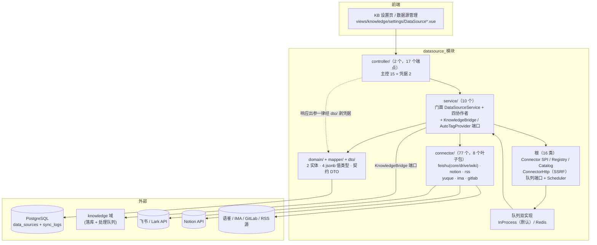
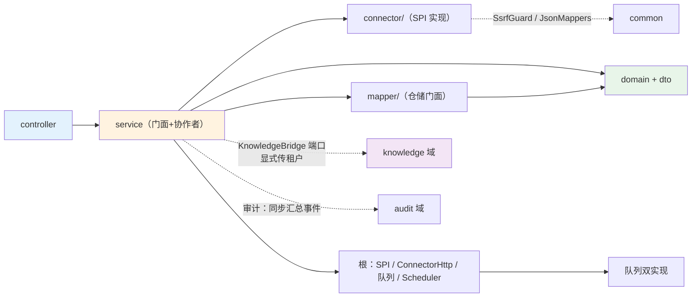
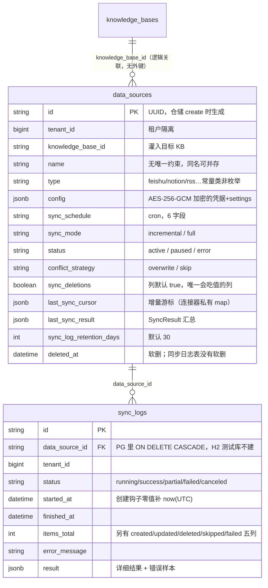
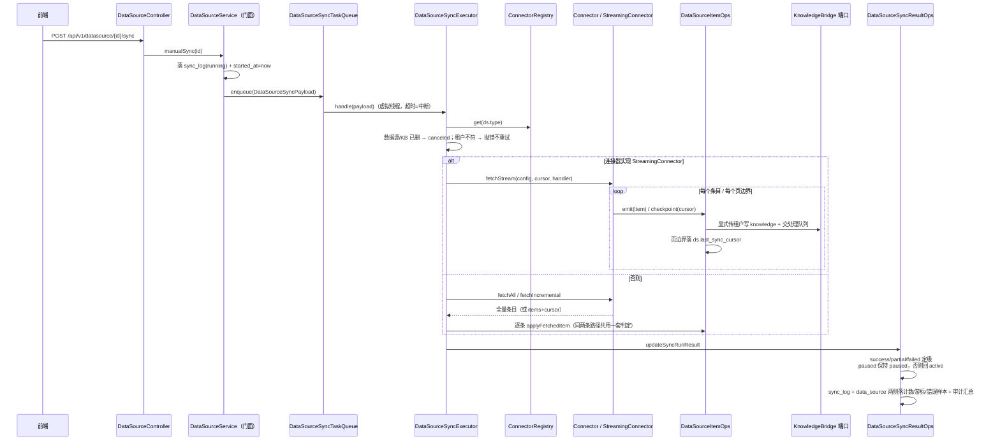
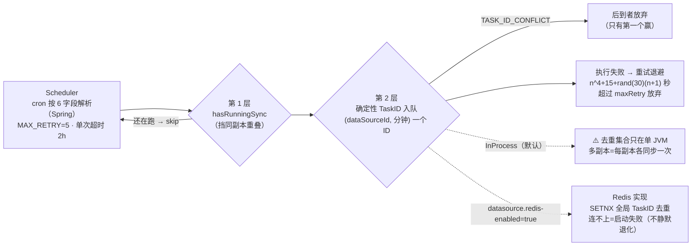
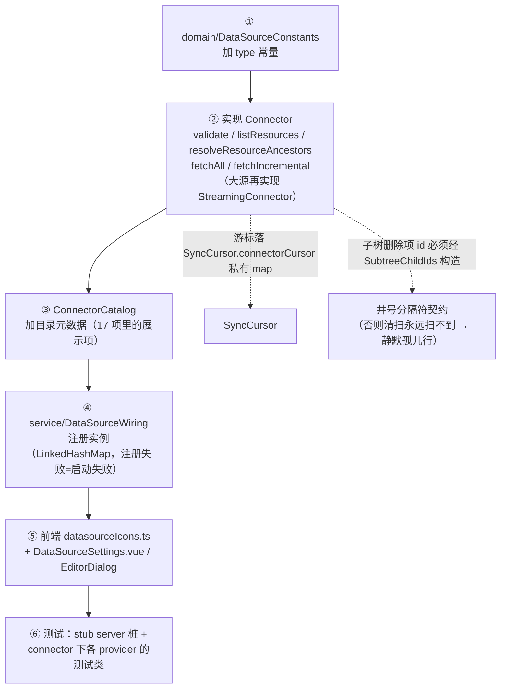

# datasource 模块手册

> **面向读者**：第一次接手 `com.ragagent.datasource` 的架构师 / 高级开发者。
> **目标**：30 分钟建立全局观 → 能定位改动点 → 能安全迭代（本模块自带 802 个后端用例兜底，改错会立刻红）。
> **数据口径**：2026-10-08 实测（`wc -l` 口径）：**129 个 java 文件 / 约 2.77 万行 / 6 个顶层子包**（connector 下再分 8 个有码叶子包，飞书一族再分 core/drive/wiki 三层）。
> **本文档的地位**：模块级导览；仓库级作业规范见仓库根 `HANDOFF.md`（§12 结构地图、§13 踩坑清单、§14 逐包重构范式）。本域的批次执行记录在 `docs/handoff/plans/`（§14.7.15/§14.7.16 神类拆分、§14.9q 契约换锚 D1~D3）。

---

## 0. 一分钟速览

**它是什么**：外部知识源连接器域——**把外部系统（飞书 / Lark / Notion / 语雀 / RSS / IMA / GitLab）的文档抓回来**，转成仓内文档**灌进指定的知识库**，并按 cron 周期做增量同步。

- 管理面：数据源 CRUD、凭据子资源（整张原子替换）、连接校验、资源树惰性加载、手动/暂停/恢复同步、同步日志（17 个端点，2 个 controller）
- 连接器面：9 个可用连接器实例（feishu、lark 是同一 wiki 连接器的国内外云、feishu_drive、lark_drive 同理、notion、yuque、ima、rss、gitlab），统一实现 `Connector` SPI
- 同步面：`Scheduler`（cron 两层去重）→ 任务队列（进程内 / Redis 双实现）→ worker（抓取 → 灌入 → 检查点 → 落结果）→ `KnowledgeBridge` 端口写知识库

**它不是什么**（别在这里改）：

| 不负责 | 归属 |
|---|---|
| 文档进库后的解析 / 分块 / 向量化 / 摘要 | `knowledge`（本模块经 `KnowledgeBridge` 端口只落"一行可被下次同步找回的 knowledge + 交处理队列"，`domain/package-info` 口径：连接器只负责"取回并转成仓内文档"） |
| 会话与 SSE 流 | `session` |
| IM 九渠道 | `im`（同属"外部世界"但是另一个域；2026-09-30 用户已裁定 im/datasource **两域都保留**，见 HANDOFF §4"别动"） |
| SSRF 防护本体 | `common/security/SsrfGuard`（本模块是它最大的消费方之一：连接器所有出站请求经 `ConnectorHttp` 过它） |
| 通用出站 HTTP 底座 | `ConnectorHttp` 只服务本域连接器（限次重定向 + 整体超时预算），别的域别拿它当公共库 |

### 图 1：模块全景



**三个必须知道的数字**：最大类 730 行（`connector/feishu/core/DocxBlocks`，飞书 docx 块解析，域内 ≥800 行已于 2026-10-01 三批清零）；`connector/` 占 19,098 行 ≈ 全域的 69%（管理面只占 31%）；17 个端点**两套错误形态并存**（见 §3.2，本模块最著名的坑）。

---

## 1. 目录结构与职责

### 1.1 子包清单（放什么 / 不放什么）

| 子包 | 文件/行数 | 放什么 | **不放什么** |
|---|---|---|---|
| 根（框架） | 16+1 / 2,121 | 连接器 SPI（`Connector` / `StreamingConnector` / `StreamHandler`）、`ConnectorRegistry` / `ConnectorCatalog` / `ConnectorMetadata`、`ConnectorHttp`（SSRF + 重定向 + 超时）、同步任务端口 `DataSourceSyncTaskQueue` + 双实现 + `Scheduler` | 具体协议（→ `connector/`）、业务编排（→ `service/`） |
| `connector/`（8 叶子包） | 77 / 19,098 | 六家 provider：`feishu/{core,drive,wiki}` 23 个、`notion` 23、`rss` 18、`yuque` 7、`ima` 7、`gitlab` 5 | 我方 HTTP/落库契约（第三方线格式 350 处**冻结**，见 §7） |
| `controller/` | 2 / 800 | 2 个 `@RestController`（15+2 端点）+ `KnowledgeBaseOwnerGuard`（KB 归属/白名单守卫，内嵌于 `DataSourceController`） | 业务语义（→ `service/`） |
| `service/` | 10 / 2,664 | 门面 `DataSourceService`（管理面 + 同步 handler）+ 四协作者（`SyncExecutor` / `ItemOps` / `SyncResultOps` / `Support`）+ 两个端口（`KnowledgeBridge` / `AutoTagProvider`）及生产实现 + 装配 `DataSourceWiring` | 协议细节（→ `connector/`） |
| `domain/` | 14 / 1,789 | 2 实体（`DataSource` / `SyncLog`）+ jsonb 值类型（`DataSourceConfig` / `SyncCursor` / `SyncResult` / `FetchedItem`…）+ `DataSourceConstants` + 异常 | 请求/响应形状（→ `dto/`） |
| `dto/` | 4 / 331 | 响应 DTO：`DataSourceResponse` / `DataSourceConfigDto`（**按构造剥离 credentials**）/ `CredentialsResponse` / `CredentialFieldMetadata` | 落库注解、加密后的 config 透传 |
| `mapper/` | 5 / 884 | MyBatis-Plus 接口（`DataSourceMapper` / `SyncLogMapper`）+ **仓储门面同包**（`DataSourceRepository` / `SyncLogRepository`）+ `DataSourceTxTemplate` | 业务判断 |

> 两个历史约定（HANDOFF 已登记，跟随既有惯例，别单独"顺手"改）：① 本域**没有 `repository/` 子包**，仓储门面与 mapper 同在 `mapper/`；② `DataSourceTxTemplate` 是独立事务 bean——Spring 自调用不走代理，`create`（插入 + 回写 `sync_deletions`）这类两步写必须穿过代理才原子。

### 1.2 依赖方向（只允许向下；出向窄、入向近零）



**出向**（grep 实测）：`common` 60 处 / `knowledge` 23 处 / `audit` 7 处 / `auth` 3 处。knowledge 依赖全部收在 `MapperKnowledgeBridge` + `KnowledgeTagAutoTagProvider` 两个类里（为什么不直接用 `KnowledgeService`，见 §4.1 的端口说明）；audit 只在同步汇总点记事件（一次同步几千条，单条变更不进审计——`DataSourceItemOps.applyFetchedItem` 的 `suppressed` 参数即此意）。

**入向几乎为零**（这正是 HANDOFF §6.2 写"28.3k 行零耦合"的实测含义）：全仓只有 2 个文件引用本域——`agent/support/AgentMarkdown` 复用 `connector/rss/JdkHtmlToMarkdown`（纯函数，当工具类用）、`common/mybatis/TenantFilterGuard` 白名单点名 `DataSourceMapper.selectActive` 与 `SyncLogMapper.countByStatus` 两个方法。**改这两个方法名/语义时记得看 TenantFilterGuard**，其余改动无跨域涟漪。

---

## 2. 数据模型

### 2.1 ER 图（2 张表）



> 实体的两个非表字段 `totalItemsSynced` / `latestSyncLog`（`@TableField(exist = false)`）不落库，由 service 查询时逐条补齐。`DataSource` 软删走**显式 `deleted_at IS NULL` 条件**、不用 `@TableLogic`（实体 javadoc：datetime 逻辑删除值在 MP 各版本行为敏感）；`sync_logs` **没有** deleted_at，只有按 `sync_log_retention_days` 的物理清理（`CleanupOldLogs`）。

### 2.2 jsonb 列与值类型对照

| 列 | 值类型（`domain/`） | 说明 |
|---|---|---|
| `data_sources.config` | `DataSourceConfig`（经 `JsonNode` 原样透传存取） | **加密列**：`DataSourceConfig.toJSON()` 走 AES-256-GCM。外层键（`type`/`credentials`/`resourceIds`/`settings`）是我方 schema（已换 camelCase，D1）；**内层 `settings`/`credentials` 的键是各 connector 的字段名（如飞书 `app_id`）——是数据不是键，冻结** |
| `data_sources.last_sync_cursor` | `SyncCursor`（`lastSyncTime` + `connectorCursor` 私有 map + `lastSchemaHash`） | 连接器私有游标全塞 map，结构可随连接器演进；已有存量迁移 SQL（D2） |
| `data_sources.last_sync_result` | `SyncResult`（六计数 + `deletionFailed` + `errors` + `nextCursor`） | 九键全部恒输出（零值照写、null 显式写） |
| `sync_logs.result` | `SyncResult`（同形状） | 老日志里 error 曾是裸字符串——反序列化有兼容分支，老日志仍可读 |

**硬约定（都踩过坑，出处见类注释）**：

1. 两个实体都是 `@TableName(autoResultMap = true)` + jsonb 字段逐个 `@TableField(typeHandler = PgJsonTypeHandler.class)`。但**显式 SQL 里实体注解不生效**：`SyncLogMapper` / `DataSourceRepository` 里每条涉及 jsonb 的 SQL 都要在 `#{...}` / `set()` 上**再挂一次 typeHandler**——漏挂会退化成 Java 序列化，落库成字符串（mapper 注释原文警告）。
2. wrapper 的 `set()` 更新 jsonb 必须三参写法 `set("col", v, "typeHandler=...")`（`DataSourceRepository` 常量 `PG_JSON` 即此；跨域同款坑见 knowledge 手册 §2.2）。
3. 这三列在 DDL 里**都没有 DEFAULT**——MyBatis-Plus 对 null 字段省略该列恰好落 SQL NULL，**不需要** `FieldStrategy.ALWAYS`（那条规则针对的是带 DEFAULT 的 jsonb 列，如 wiki 的 `page_metadata`；`DataSource` javadoc 第 9 条）。
4. **`sync_deletions` 三步舞**：非指针 bool 的 `false` 会被列默认值 `true` 吃掉——Go 期原实现是 `create` 后在同事务里 `UpdateColumn` 写回原值；Java 侧直接插原值，语义等价，事务模板保证两步原子（实体 javadoc 第 8 条 + `DataSourceTxTemplate`）。
5. 读 config 走 `DataSource.parseConfig()` 的**宽容解密**：解密失败不炸加载，字段置空、行保持可见、UI 显示"凭据未配置"（`SYSTEM_AES_KEY` 缺失/轮换时用户能重录而不丢配置）。

### 2.3 状态枚举（全部是字符串常量，不是 Java 枚举）

`DataSourceConstants` 的 javadoc 写明理由：这些值直接落库且列是裸 string，**未知取值（历史行、新连接器）必须能原样读写**；枚举会逼出 `UNKNOWN` 分支并悄悄改写数据。`TaskInitiator.role` 同理不用 `TenantRole` 枚举。

| 常量组 | 取值 | 用在哪 |
|---|---|---|
| 连接器类型 `type` | 目录 17 项、**注册表只有 9 个实现**（feishu / lark / feishu_drive / lark_drive / notion / yuque / ima / rss / gitlab），其余（confluence / github / google_drive…）是"即将支持"的占位 | `data_sources.type`、`ConnectorCatalog`（`GET /types` 的响应就是这张静态目录，裸数组、稳定排序，**比对按 type 建索引别按下标**） |
| 同步模式 | `incremental`（默认）/ `full` | `data_sources.sync_mode` |
| 数据源状态 | `active` / `paused` / `error`（+ `deleted` 软删语义） | `data_sources.status`；同步 failed 且原本非 paused → `error`，paused 手动跑完**保持 paused** |
| 同步日志状态 | `running` / `success` / `partial` / `failed` / `canceled` | `sync_logs.status`；**`pending` 刻意无常量**——它只出现在"作废在途同步"的判断里，是个从未被写入的半终态 |
| 冲突策略 | `overwrite`（默认）/ `skip` | `data_sources.conflict_strategy` |

---

## 3. HTTP 接口面

### 3.1 端点分组（2 个 controller / 17 个端点，前缀 `/api/v1/datasource`）

**主控**（`DataSourceController`，15 个）

| 方法 | 路径 | 用途 / 形态 |
|---|---|---|
| GET | `/types` | 连接器目录，**裸数组**（`ConnectorMetadata`，按 priority 稳定排序） |
| POST | `/datasource` | 创建，**201**；请求体经 `KnowledgeBaseOwnerGuard` 校验 KB 归属 |
| GET | `/datasource` | 列表（`knowledgeBaseId` 必填；分页 `limit` 上限 100） |
| GET | `/datasource/{id}` | 详情（`DataSourceResponse`，凭据只露 `configured` 布尔） |
| PUT | `/datasource/{id}` | 更新（201 之外的成功都是 200；凭据不走这里，走子资源） |
| DELETE | `/datasource/{id}` | **204**；软删（`deleted_at`） |
| POST | `/datasource/{id}/validate` | 真连一次外部 API 验配置 → `{"status":"connected"}` |
| POST | `/datasource/validate-credentials` | 不落库、只验凭据 → 同上 |
| GET | `/datasource/{id}/resources` | 资源树**惰性加载**（`parentId` 空 = 顶层，非空 = 直接子项），裸数组 `Resource` |
| POST | `/datasource/{id}/resource-ancestors` | 为选中资源解析祖先链（树形选择器回根用，见 `Connector.resolveResourceAncestors`） |
| POST | `/datasource/{id}/sync` | 手动同步：建 `sync_log(running)` + 入队，返回**裸 SyncLog 实体** |
| POST | `/datasource/{id}/pause` · `/resume` | `{"status":"paused"}` 等 |
| GET | `/datasource/{id}/logs` | 同步日志分页；`limit` 非法 → 400，`offset` 非法**静默归 0**（容错分支，有夹具钉住） |
| GET | `/datasource/logs/{log_id}` | 单条日志（裸 SyncLog） |

**凭据子资源**（`DataSourceCredentialsController`，2 个）

| 方法 | 路径 | 用途 |
|---|---|---|
| PUT | `/datasource/{id}/credentials` | 整张原子替换凭据 map → 裸 `{"fields":{"credentials":{"configured":true}}}` |
| DELETE | `/datasource/{id}/credentials/{field}` | 整张清空 → 204 |

> 为什么凭据只有一个逻辑字段：数据源凭据是**按连接器而异的原子 map**（OAuth token 对、GitLab 的 token…），拆成具名字段会造出"配了一半、根本认证不了"的中间态（凭据 controller javadoc；与 mcp/model/websearch 的逐字段凭据是刻意不同的形状）。

### 3.2 契约约定（改接口前必读）

| 约定 | 说明 |
|---|---|
| 错误形态（⚠️ 本模块最著名约定） | **两套并存、刻意不统一**：主控 15 个端点直写单键体 `{"error":"..."}`；凭据 2 个端点走全局 `AppError` 信封 `{"error":{code,message,details},"success":false}`。两边类注释都写明"别统一" |
| 鉴权 | 三层：角色（读端 Viewer+、其余 Admin+，WebConfig）→ `ownDataSource` 租户归属（数据源持有外部凭据，只有属主租户能碰）→ `KnowledgeBaseOwnerGuard` 的 API-Key KB 白名单（主控所有端点共用一处） |
| 401 文案两组 | create/list 是 `unauthorized: workspace context missing`，其余是 `unauthorized`——所以每个端点自己取租户，**别抽成切面**（controller javadoc 明示） |
| 凭据 controller 的刻意差异 | 租户缺失是 **400** `Workspace ID cannot be empty`（主控是 401）；"KB 不存在"与"不属于本租户"都折叠成 **404** `data source not found`（主控是 404/403 两种） |
| 键名 | JSON 名 = Java 字段名（camelCase，D1/D2/D3 换锚后已收官）；可空/零值**显式输出**（`forceFull:false`、`maxItems:0`、`trigger:""` 照写） |
| 实体序列化 | `DataSource`/`SyncLog` 是"半线上"对象：`config`/`last_sync_cursor`/`last_sync_result` 原样透传进 DTO，`latestSyncLog` 裸实体直接进响应——**动实体字段序列化＝动线上契约**（实体 javadoc 醒目位置） |
| 响应出参 | 管理端点一律经 `DataSourceResponse`/`DataSourceConfigDto` **按构造剥离凭据**（DTO 上压根没有 credentials 字段，密文不可能漏出去） |

---

## 4. 核心链路

### 4.1 同步主链路（手动同步 → 队列 → worker → 灌入 → 落结果）



**为什么要 `KnowledgeBridge` 端口而不是直接注入 `KnowledgeService`**（端口 javadoc 三条理由）：① 租户显式——同步跑在后台虚拟线程上**没有** `TenantContext`，而 `KnowledgeService` 一律从 ThreadLocal 取租户；② 能力缺口——`KnowledgeService` 的创建入口不收 `metadata`/`tagIDs`，而增量同步靠 `metadata->>'external_id'` 找旧行，缺了就退化成"每次全量新建"；③ 可测——假实现即可驱动整条同步状态机。代价是生产实现 `MapperKnowledgeBridge` 复刻了"最小可用闭环"（含 **H2/PG 方言分叉**：`->>' 运算符 H2 没有，退化成取回后 Java 解析匹配），"写入知识库的内容本身是最小集"是有意为之。

**失败语义速记**：worker 抛异常 = 本次尝试失败 → 队列按 `maxRetry` 重试；中断 = 超时/取消（`Connector.sleep` 把中断翻译成 `ConnectorException`）；流式中途灌入失败**不清 cursor**——进度已在检查点上，重试从断点续跑。

### 4.2 调度与两层去重（多实例部署的关键）



- 确定性 TaskID 的存在理由：cron 按**绝对墙钟**触发（`"0 0 * * * *"` 永远整点），多实例会在同一分钟一起触发（`Scheduler` / 端口 javadoc）。
- Spring 的 `CronExpression` 只认 5 个宏（`@hourly` 等）、**不认 `@every`**；前端给的全是 6 字段表达式所以线上无感，手写 `@every` 会解析报错（Scheduler javadoc）。
- 入队失败调度器会把 sync_log 置 failed 并写 `enqueue failed: <原因>`——所以端口约定**抛异常而不是静默丢弃**。

### 4.3 连接器契约（`Connector` SPI）与新增一个 provider 的扩展点



- `Connector` 的取消模型：方法不带 context 参数，取消 = **线程中断**（`sleep` 抛 `ConnectorException`）；请求超时在各客户端自己的 `HttpRequest.timeout`，任务超时由队列的线程池兜底。
- `listResources` 的 `parentId` 惰性加载 + `resolveResourceAncestors` 回祖先链，是树形选择器能展开深节点又不全树遍历的配对设计（接口 javadoc）。
- `fetchIncremental` 是**三返回值形态**：items/cursor 进 record，错误走异常，且**异常与结果可同时有效**（`PartialFetch` 抛出时 items/cursor 已填好）——调用方先取结果再按异常定级。
- 飞书一族共用 `SyncEngine`（泛型流式引擎，各连接器差异隔离在 `NodeOps` 适配器后），它有三条刻意行为：**续跑快路径**（编辑时间没变 → 跳过但保留游标条目）、**抓取失败不推进游标**（保留旧编辑时间，下次重试而不是被"已同步"永久跳过，Tencent/WeKnora#2136）、**删除检测只在完整列举时做**（部分列举会误报）。
- 所有连接器的出站 HTTP 走 `ConnectorHttp`：SSRF 三层防护（发送前校验 / 重定向 ≤10 跳每跳重校验 / 整体超时预算）；测试打本机桩必须先注入放行 `127.0.0.1` 的 `SsrfGuard` 实例（类 javadoc）。

---

## 5. 改哪里（场景 → 文件）

| 我想… | 主要改这里 | 别忘了 |
|---|---|---|
| 加一个连接器（新 provider） | §4.3 六步：`DataSourceConstants` → `connector/{provider}/` 实现 `Connector` → `ConnectorCatalog` → `DataSourceWiring` 注册 → 前端图标/设置页 → 桩测试 | 第三方字段名用 `@JsonProperty` 映射是**合法**的（线格式冻结面之外的新增同口径）；游标塞 `SyncCursor.connectorCursor` |
| 改同步灌入/删除判定、冲突消解 | `service/DataSourceItemOps.applyFetchedItem`（批量与流式两条路径**共用**这一处） | 改完两条路径语义必然一致是设计目标，别在 executor 里另写一份 |
| 改同步结果定级/落库/审计 | `service/DataSourceSyncResultOps.updateSyncRunResult` | 状态机三分支：failed→error（paused 除外）、paused 保持、其余 active；审计只在汇总点 |
| 改抓取/续跑/取消语义 | `service/DataSourceSyncExecutor`（流式在 `handleStream`） | 中途失败**不清 cursor**；租户不符是确定性失败要**上抛不重试** |
| 改调度节奏/去重/重试 | 根 `Scheduler`（`MAX_RETRY` / `TASK_TIMEOUT` / TaskID 粒度）+ 队列实现 | 端口四条语义（TaskID 去重、重试预算、超时中断、失败可报）一条都不能丢（端口 javadoc） |
| 换队列实现（MQ） | 实现 `DataSourceSyncTaskQueue`（现成先例：`RedisDataSourceSyncTaskQueue` + `DataSourceTaskQueueWiring` 的 `@Primary` 开关模式） | Redis 版踩过的坑：跨进程 + TTL 场景要**兼容读**（对比 D3 载荷的"零兼容负担"判定） |
| 改凭据加密/解密 | `domain/DataSourceConfig.toJSON`（加密）+ `domain/DataSource.parseConfig`（宽容解密） | 解密失败置空不炸是**特性**（行保持可见）；测试孤例失败先查 `SYSTEM_AES_KEY` 环境泄漏（§8） |
| 加端点 | `controller/DataSourceController` + `service` 门面方法 + 响应走 `dto/` | 主控错误形态是单键 `{"error":"..."}`；每个端点自己取租户、401 文案选对组（§3.2） |
| 给两张表加字段 | `domain/` 实体 + `mapper/`（显式 SQL 的列清单）+ baseline SQL + `TestSchema` | H2 里 `sync_logs` 不建外键/级联（TestSchema 既有约定）；jsonb 新列想清楚要不要 DEFAULT（§2.2 第 3 条） |
| 改 jsonb 值形状 | `domain/SyncCursor` / `SyncResult` / `DataSourceConfig` | 键名=Java 字段名恒输出；落库面改键要**同批带迁移 SQL**（D2 有现成范式）；`config` 内层 connector 键不动 |
| 改飞书连接器 | `connector/feishu/core/`（`FeishuClient` 门面 + Transport/WikiTreeOps/DriveOps 协作者） | `FeishuApiTypes`/`DocxBlocks` 是第三方线格式+LLM 输出面，键名冻结；公开 DTO（`DriveFilePage`）留在原类 |
| 改 RSS 解析 / HTML→Markdown | `connector/rss/JdkXmlFeedParser` / `JdkHtmlToMarkdown` | 后者被 `agent/support/AgentMarkdown` 跨域复用——改行为等于改 agent 工具输出 |
| 改资源树/祖先解析 | `Connector.listResources` / `resolveResourceAncestors` 各实现 + `GET /resources` 端点 | `SubtreeChildIds` 的 `#` 前缀契约若动，清扫侧必须同步改（§7 第 10 条） |

---

## 6. 常见迭代 SOP

> 铁律：**一次只动一个轴**；每步结束**全绿**再走下一步（哪怕只是移动文件）。本域神类切片与契约换锚均已收官（§9），新改动沿用"门面 + 协作者（回引 `service.<field>`）"的既有结构。

```bash
# 每次改动后必跑（全量约 3 分钟；单域先行可用 --tests "com.ragagent.datasource.*"）
cd ~/ragagent && JAVA_HOME=/opt/homebrew/opt/openjdk@21/libexec/openjdk.jdk/Contents/Home \
  ./gradlew :server:test :server:spotlessCheck
# 若动了前端可见契约（键名/形态/状态码），同批带前端：
cd frontend && npx vue-tsc --build --force && npm test
# 契约夹具重录（键改名一律重录，别手改结构；重录后必须结构化复核差异，§13.12）
JAVA_HOME=/opt/homebrew/opt/openjdk@21/libexec/openjdk.jdk/Contents/Home \
  ./gradlew :server:test --tests "com.ragagent.datasource.DataSourceHttpContractTest" -Dcontract.refresh=true
```

**A. 加连接器**：§4.3 六步 → 单域全绿 → 全量三绿 → 提交。注册表在装配期校验（null / 空 type 抛异常聚合），配错**启动就炸**，别在运行期吞。

**B. 加字段**：`domain`（若落库）→ 显式 SQL 列清单 → baseline SQL + `TestSchema` → `dto` 响应（凭据类字段永远不经 DTO 出去）→ `ds-*` 夹具重录+复核 → 三绿。前端可见则同批改前端类型。

**C. 改 jsonb 形状**：值类型改键 → 逐字节样例注释同步（`DataSourceJsonTest` 钉形状）→ 落库列要迁移 SQL（真 PG 用合成行验证表达式，dev 库当前 0 行）→ 三绿。

**D. 改队列/调度语义**：先对照端口 javadoc 四条语义清单 → 改实现 → `InProcessDataSourceSyncTaskQueueTest` + `RedisDataSourceSyncTaskQueueTest` + `SchedulerTest` 三件套全绿 → 全量。

**E. 重构（拆类/移动）**：按 `HANDOFF §13` 固定套路（侦察 → 依赖判据 → harness 脚本 → 落刀 → 忠实性逐字比对 → 回填文档）；本域两批先例的可复用手法：**委托换零改动**（搬走的公开方法留同名薄委托）、**接口方法搬体不搬签名**、**递归遍历的 `this` 传参要换回引**（§14.7.15/16）。

---

## 7. 模块约定与坑（必读）

1. **两套错误形态刻意并存**：主控 `{"error":"..."}` 单键体 vs 凭据 `AppError` 信封——两个 controller 的类注释都写明"别统一"。顺手"修复"它会破坏 39 个 `ds-*` 夹具里的错误金片。
2. **`connector/` 第三方线格式 350 处永久冻结**（**2026-10-09 B152 补注**：其中「键=字段名」的**冗余注解 12 处已清** ✓ —— 线格式（键名与字段序）**仍永久冻结** ✓；带蛇形键/混用改名注解的那部分本就必要，连同 49 个混用类型一并保留 ✓）（`FeishuApiTypes`/`YuqueApiTypes`/`ImaApiTypes`/`GitLabClient`/`NotionClient` 等）：字段名由对方 API 决定，与 mcp 的 RFC 面同类——**别把它们"改回 camelCase"**（HANDOFF §14.6 / §14.9q）。要动只有一种情况：对接对方 API 版本升级。
3. **`lf_*` 五键冻结**：`DataSourceSyncPayload` 里 `lf_trace_id` 等是 `TracingContext` **平铺载具的命名空间前缀**（四个域共用同一形状）；去前缀会与载荷自有字段撞名（`userId`/`sessionId`）。要清理应改成嵌套 `tracing` 键——那是形状变更，另批（HANDOFF §14.9q D3 / §14.6）。
4. **`config` 内层键是数据不是键**：外层包装（`type`/`credentials`/`resourceIds`/`settings`）是我方 schema；内层 `settings`/`credentials` 的键是各 connector 的配置字段名（如 `app_id`），由 `ConnectorMetadata` 描述符与前端表单按同名提交——改了同时打断表单与既有行（§14.9q 入场判定）。
5. **显式 SQL 里的 jsonb 必须逐条挂 typeHandler**：实体上的 `@TableField(typeHandler)` 在 `@Select`/wrapper `set()` 路径**不生效**，漏挂退化成 Java 序列化落库成字符串（`SyncLogMapper` / `DataSourceRepository` 注释原文警告）。
6. **`sync_deletions` 三步舞与带 DEFAULT 列的回写**（§2.2 第 4 条）：改 `create`/`update` 路径前先读 `DataSource` javadoc 第 8 条——"用户选了 false 会丢"这类问题在这里是真实发生过的。
7. **SYSTEM_AES_KEY 泄漏进测试进程 → 孤例红**：`source .env` 的 shell 里跑全量，`DataSourceJsonTest` 的加密分支断言会失败（1/全量，极易误判回归）。判据与修法见 HANDOFF §13.9（`env -u SYSTEM_AES_KEY` 重跑）。
8. **InProcess 队列的多实例缺陷是已知且接受的**：去重集合只在单 JVM，多副本=每副本各同步一次；要跨实例语义切 `datasource.redis-enabled=true`（Redis 连不上=启动失败，不静默退化）。别在 InProcess 实现里"顺手"加跨实例锁。
9. **流式路径的两条纪律**：`StreamHandler.checkpoint` 收到的 cursor **只在调用期有效**，实现必须同步序列化（连接器随后还会改它背后的 map）；`emit` 返回/抛异常即中止整条流——灌入失败意味着同步在失败，继续抓外部 API 只是浪费配额（接口 javadoc）。
10. **`SubtreeChildIds` 的 `#` 前缀是跨模块契约**：子项 id 构造与清扫前缀必须同步演进，少一个 `#` 前缀的旧子项**永远不会被清到**——静默孤儿行（类 javadoc 原文）。
11. **`SyncEngine` 的"抓取失败不推进游标"不是 bug**：保留旧编辑时间让下次重试该节点，是被 Tencent/WeKnora#2136 钉死的行为；顺手"优化"成推进游标会永久跳过失败节点。
12. **契约夹具掩码按键名锚定**：掩码正则 `[a-z_]+` 在键改 camelCase 后静默失效，夹具会混进真实 UUID/时间戳（下次跑就红，看着像业务回归）。D1 实录：放宽成 `[A-Za-z_]+` 一次影响 12 个夹具（HANDOFF §13.13）。
13. **`TaskInitiator` 放本域是登记过的权宜**：它是跨模块公用类型，第二个消费方出现时应提升到 `common/context`，而不是各自复制（类 javadoc）。
14. **别给 `DataSourceConstants` "升级"成 Java 枚举**：裸 string 落库 + 未知取值原样读写是刻意设计（§2.3）。

---

## 8. 测试与验证

- **规模**（2026-10-08 实测，`server/src/test/java/com/ragagent/datasource/`）：**38 个测试类** / 46 个 java 文件（另 8 个是支撑件：`FeishuTestServer`、`FeishuTestSupport`、`WikiFixtures`、`GitLabServerStub`、`NotionStubServer`、`NotionTestSupport`、`FakeIma`、`FakeYuque`）；**788 个 `@Test` + 14 个 `@ParameterizedTest`**。
- **契约夹具**：`server/src/test/resources/contracts/` 下 **39 个 `ds-*`** 金片（`DataSourceHttpContractTest` 消费）；比较器是**语义比较**（键序/转义归一化后比，B2 统一 GoldenContract 后字节级对比清零）。连接器协议面不走金片，走**进程内 stub server**（真实 HTTP 走一遍 `ConnectorHttp` 的 SSRF/重定向/超时栈）。
- **单域验证**：`./gradlew :server:test --tests "com.ragagent.datasource.*"`；闸门仍以全量 `:server:test :server:spotlessCheck` 为准（§13.4：读 `TEST-*.xml` 的 `failures+errors==0` 且用例数达标，compileTestJava 绿 ≠ 测试绿）。
- **已知偶发 2 例**（全量并发下偶发，先单独重跑再判回归，出处 knowledge 手册 §8 同源）：`WebToolsRecordingTest.searchWithContentFetchesLeadingPagesViaSharedFetchTool`、`EvaluationContractTest.getTerminalRunsExecution`。
- **改前端可见契约时**：后端与前端**同批**改完再提交（本域前端消费面：`api/datasource/index.ts` + `views/knowledge/settings/DataSource*.vue`）。

---

## 9. 已知待办与风险（接手后优先看）

| 项 | 性质 | 建议 |
|---|---|---|
| ~~域内 3 个 ≥800 神类（`DataSourceService` 1,828 / `FeishuClient` 1,155 / `NotionConnector` 1,093）~~ | **已解决（2026-10-01，三批）** | d1~d3 → 四协作者（666）、f1~f3 + n1 → Transport/WikiTreeOps/DriveOps/FetchOps（709/625）；域内 ≥800 清零且无登记例外（HANDOFF §14.3 / §14.7.15/16） |
| ~~`@JsonProperty` 换锚 493 处~~ | **已解决（2026-10-01~10-02，D1~D3）** | 493→417→366→355；余 355 全是冻结面（350 connector 线格式 + 5 `lf_*`），**可换锚面 = 0**；落库迁移 SQL 已跑（dev 库 0 行、真 PG 合成行验证）；`DataSourceJsonTest` 的 Go 逐字节 golden 已按"内部载荷非对外契约"改写为本方形状（HANDOFF §14.9q） |
| InProcess 队列多实例重复同步 | 部署风险 | 多副本上线前切 Redis 实现（`datasource.redis-enabled=true`）；开关打开但连不上=启动失败，属预期（§7 第 8 条） |
| `MapperKnowledgeBridge` 是"最小可用闭环" | 技术债 | `KnowledgeService` 补齐 metadata/tagIDs 入参后可收敛回正道；在那之前新同步字段要**显式评估**是否进了这条最小闭环，否则落库后找回不了 |
| 350 处 connector 线格式（**其中冗余注解 12 处于 B152 已清，余 312 处按此清单守**）+ `lf_*` 5 键 | **永久冻结（非待办）** | 列在此处只为防"误报为债"；改动条件见 §7 第 2/3 条 |
| `sync_logs` 物理删 + retention 清理 | 已知设计 | 日志会被 `CleanupOldLogs` 按 `sync_log_retention_days`（默认 30）删掉——别把 sync_log 当永久审计源，审计汇总另有 audit 域 |

---

## 10. 速查：本模块的"地标"

| 想知道 | 看这里 |
|---|---|
| 某个端点怎么走 | `controller/DataSourceController` → `DataSourceService` 同名方法 → `mapper/*Repository` |
| 一次同步的完整流程 | §4.1 图 + `service/DataSourceSyncExecutor` |
| 同步怎么续跑/为什么能续跑 | 流式检查点（`StreamingConnector`/`StreamHandler`）+ `ds.last_sync_cursor` + 队列重试 |
| 多实例去重为什么是两层 | `Scheduler` javadoc + §4.2 图 |
| 加连接器要做哪几件事 | §4.3 六步图 |
| 连接器 SPI 长什么样 | 根 `Connector` / `StreamingConnector` / `StreamHandler`（javadoc 即规格） |
| 出站 HTTP 的安全栈 | 根 `ConnectorHttp`（SSRF 三层 + 重定向 + 超时预算）→ `common/security/SsrfGuard` |
| 同步结果怎么定级 | `service/DataSourceSyncResultOps.updateSyncRunResult`（三分支状态机） |
| 凭据怎么加密、怎么"宽容解密" | `domain/DataSourceConfig.toJSON` + `domain/DataSource.parseConfig` |
| 数据写进知识库走哪条路 | `service/KnowledgeBridge`（端口）+ `MapperKnowledgeBridge`（显式租户 + 方言分叉） |
| jsonb 的形状契约 | `domain/DataSourceConfig` / `SyncCursor` / `SyncResult`（javadoc 内嵌逐字节样例）+ §2.2 |
| 域里的历史批次记录 | `docs/handoff/plans/14.7-域神类拆分执行记录.md`（§14.7.15/16）、`14.9c-session-embed-mcp-datasource-wiki.md`（§14.9q D1~D3） |
| 目录为什么这样分 | 本文 §1 + 根 `package-info.java`（本域唯一一份 package-info：连接器只负责"取回并转成仓内文档"） |
