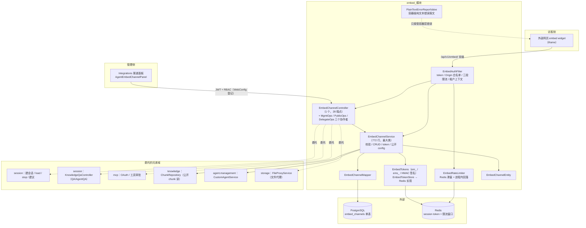
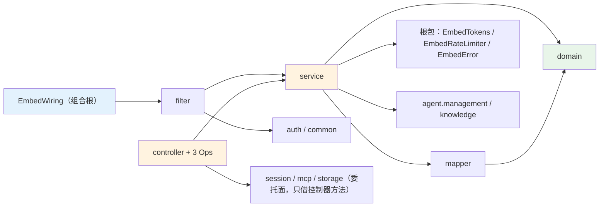
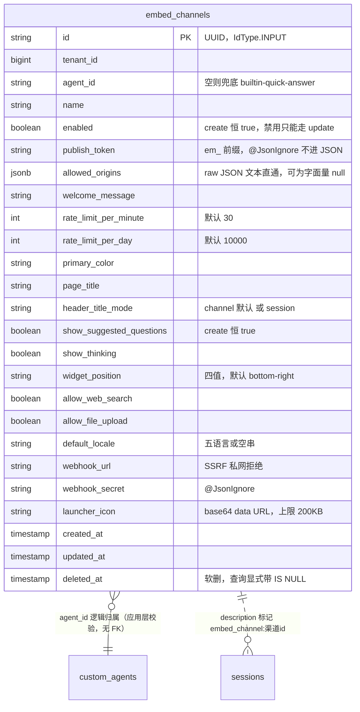
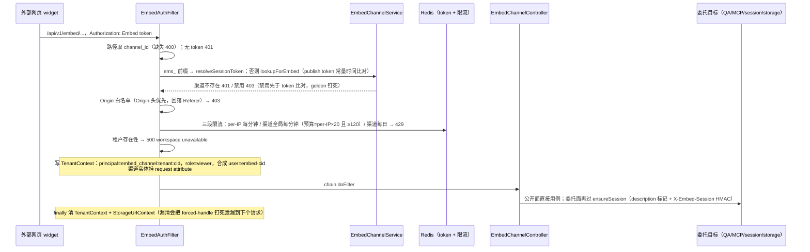
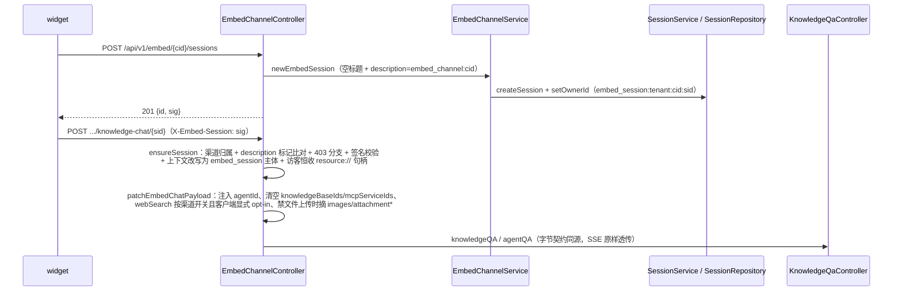

# embedchannel 模块手册

> **面向读者**：第一次接手 `com.ragagent.embedchannel` 的架构师 / 高级开发者。
> **目标**：30 分钟建立全局观 → 能定位改动点 → 能安全迭代（本域有 61 个 golden 契约夹具兜底，改错会立刻红；全量后端用例按 HANDOFF 批次验收口径 4,700+）。
> **数据口径**：2026-10-08 实测（`wc -l` 口径）：**16 个 java 文件 / 约 2,900 行 / 5 个子包 + 根包**。
> **包名沿革**：B124 由 `com.ragagent.embed` 改名为 `com.ragagent.embedchannel`——域内 14 类有 11 类本就叫 `EmbedChannel*`，且与 L2 能力层的 `com.ragagent.embedding`仅差三个字母，是仓库里最容易引错的一对包名。
> **本文档的地位**：模块级导览；仓库级作业规范见仓库根 `HANDOFF.md`（§12 结构地图、§13 踩坑清单、§14 逐包重构范式）。

---

## 0. 一分钟速览

**它是什么**：把本仓的能力**以"网页嵌入渠道"形态对外发布**的全套后端——外部网站贴一段 embed JS（iframe widget），访客不登录即可在宿主页面上跟某个 agent 聊天。本域负责：渠道的创建/配置/发布密钥管理（管理面）、访客侧的 token 兑换与门禁（公开面）、以及把访客的问答请求**委托给既有控制器**（session / QA / MCP / 文件代理），保证访客链路与登录链路**字节契约同源**。

### ⚠️ 先过辨析关：embed ≠ embedding（本仓最容易混的两个名字）

| | `embed`（本包） | `embedding`（别去那） |
|---|---|---|
| 语义 | **业务渠道域**：HTTP 渠道管理 + 访客门禁 + 委托路由 | **provider 客户端族**：10 家向量模型适配、`BaseEmbedder` 骨架 |
| 形态 | HTTP 叶子域，1 个 controller / 28 端点 / 1 张表 | 能力层，被 knowledge / chatpipeline 调用 |
| 关系 | 本域**不产生任何向量**，全程不 import embedding | 与本域零依赖（仅名字像） |

**改名意向**：`backend-package-map.md` §3.5 P3 待办点名拟改名 **`embedchannel`**（"与 `embedding` 名字太近，语义不同——业务渠道 vs provider 客户端"，改名后议，未执行）。**改前**：看到 `embed` 请一律脑读成"嵌入渠道"。

**它不是什么**（别在这里改）：

| 不负责 | 归属 |
|---|---|
| 向量化 / embedding 模型调用 | `embedding`（provider 客户端族，见上） |
| 向量库读写、检索引擎 | `vectorstore` / `retrieval` |
| 会话、消息、SSE 的**实现** | `session`（本域只做门禁 `ensureSession` 与委托透传） |
| 渠道绑定的 agent 配置、推荐问题的**产出** | `agent.management`（本域只读其 config：`kbSelectionMode` / `knowledgeBases` / `webSearchEnabled` 等） |
| 企业微信等九渠道 | `im`（兄弟渠道域，与本域互不复用；RBAC 里两域清单面相邻登记） |
| 登录态认证 | `auth`（管理面走全局 `AuthFilter` + RBAC；公开面**刻意**绕开两者，由本域 `EmbedAuthFilter` 自行鉴权） |

### 图 1：模块全景



**三个必须知道的数字**：全仓 **0 个包 import 本域**（main 与 test 都实测为 0——纯 HTTP 叶子域，改它只影响 HTTP 面）；**1 个 controller 装下全部 28 个端点**（9 管理 + 19 公开/委托，拆成了"门面 + 三个 Ops 协作者"形态）；`EmbedChannelService` **772 行**是本域最大类（HANDOFF §14.3 记载"本就 <800"，未上榜）。

---

## 1. 目录结构与职责

### 1.1 子包清单（放什么 / 不放什么）

| 子包 | 文件/行数 | 放什么 | **不放什么** |
|---|---|---|---|
| 根包 | 6 / 457（5 类 + `package-info`） | `EmbedTokens`（token/签名，纯静态）、`EmbedError`（错误枚举）、`EmbedRateLimiter`（限流）、`EmbedWiring`（组合根：过滤器注册 + Tomcat 阀）、`PlainTextErrorReportValve` | 业务逻辑（→ `service/`） |
| `controller/` | 4 / 1,157 | `EmbedChannelController`（门面：路由 + `ensureSession` + 响应组构件 `row()/rows()`）+ 三个**包私有**协作者：`MgmtOps`（管理面 9 端点）/ `PublicOps`（公开面 5 端点）/ `DelegateOps`（委托面 14 端点） | SQL、落库判断 |
| `service/` | 3 / 825 | `EmbedChannelService`（唯一业务服务：规范化/校验/CRUD/token/公开 config/chunk 可见性）+ `EmbedTokenStore` 接口 + `RedisEmbedTokenStore` | HTTP 形态（→ `controller/`） |
| `filter/` | 1 / 249 | `EmbedAuthFilter`：公开面唯一认证层（token → 渠道 → Origin → 限流 → 租户 → 上下文注入） | 业务校验（图标/webhook 等在 service） |
| `domain/` | 1 / 140 | `EmbedChannelEntity`（`@TableName("embed_channels")`，落库行为清单写全在 javadoc） | 响应形状（响应是手工组 Map，见 §3.2） |
| `mapper/` | 1 / 80 | `EmbedChannelMapper`：显式 SQL（全列 INSERT/UPDATE、软删 `deleted_at IS NULL`，不用 `@TableLogic`） | 业务判断 |

> 没有独立 `dto/`：请求体是 controller 内的 record（`EmbedChannelRequest` 19 字段），响应是手工组 `Map`（键＝实体字段名、字母序插入）——这是 golden 钉死的既有形态，不是待改债务。

### 1.2 依赖方向（只向下 + 对兄弟域"只借控制器"）



**委托面是本域的枢纽特征**：`DelegateOps` 不重复实现任何 QA/建议/MCP 逻辑，而是**直接调用** `KnowledgeQaController.knowledgeQA/agentQA`、`MessageController.loadMessages`、`SessionController.stopSession`、`MessageSuggestionController`、`McpOAuthController`、`AgentToolApprovalController`、`FileProxyService.serveTenantFiles`——注释原话"确保字节契约同源"。代价是本域对 4 个兄弟域**只借控制器**：session 域手册记载的"embed 3 文件消费 session"经核实（import 口径 3 文件：`EmbedChannelController` / `EmbedChannelService` / `EmbedChannelPublicOps`；`EmbedChannelDelegateOps` 另以全限定名内联引用 `session.domain.Message` 与 `session.dto.StopSessionRequest`，凑足 4 个文件触碰 session 类型）。

---

## 2. 数据模型

### 2.1 ER 图（1 张表）



> schema 两处同改：`migrations/versioned/V1__baseline.sql`（`embed_channels` 建表在 V1 基线内）+ `domains/src/test/java/com/ragagent/TestSchema.java`（H2 版本，约 825 行起）。与 knowledge 域的规矩一致：漏改 `TestSchema` 会在 H2 测试上报 `Column not found`。

### 2.2 jsonb 列与值类型对照

| 列 | 值类型 | 说明 |
|---|---|---|
| `embed_channels.allowed_origins` | **无值类型，raw JSON 文本直通**（`JsonbRawStringTypeHandler`，来自 `agent.management.mapper`） | 本域唯一 jsonb 列。列值可以是**字面量 `"null"`**（update 缺键时整列覆写，见 §7 第 4 条）；读侧 `allowedOriginsList()` 容错：空/坏 JSON/非数组 → 空列表（管理面行视图据此输出 `null`） |

硬约定（与全仓一致）：jsonb 字段逐字段写 `@TableField(typeHandler=...)` 且实体带 `@TableName(autoResultMap = true)`——本域两者齐备；mapper 的 INSERT/UPDATE 里该列**单独内联 typeHandler**（`#{e.allowedOrigins,typeHandler=...JsonbRawStringTypeHandler}`）。

### 2.3 状态枚举

本域**没有状态机列**（没有 pending/processing 一类的流转），枚举面如下：

| 枚举/取值 | 值域 | 用在哪 |
|---|---|---|
| `EmbedError.Kind`（本域唯一 enum） | `CHANNEL_NOT_FOUND`→404 · `BAD_REQUEST_TEXT`→400 · `OPERATION_FAILED`→500 · `CHANNEL_DISABLED`→403 · `TOKEN_INVALID`→401 · `SESSION_UNAVAILABLE`→503 | service 抛、controller `writeMgmtError` 分派成纯字符串错误 |
| `enabled` | create **恒归一 true**（请求 false 无效，golden 钉死）；update 可 false | 渠道开关；false 时公开面 403 |
| `header_title_mode` | `session` / `channel`（默认；不在值域静默归一默认） | 公开 config 输出 |
| `widget_position` | `bottom-right`（默认）/ `bottom-left` / `top-right` / `top-left` | 公开 config 输出 |
| `default_locale` | `zh-CN` / `en-US` / `ko-KR` / `ja-JP` / `ru-RU`（不在清单 → 空串） | 前端 widget 语言跟随（B63/B64 修过"派生语言落盘"坑） |
| Origin 白名单模式 | 精确（大小写不敏感）/ `*`（全放，**生产拒绝**）/ `*.后缀` / 空清单（**全拒**） | `EmbedAuthFilter.originAllowed` |
| token 形态 | `em_`（publish，32B base64url）/ `ems_`（session，Redis 键 `embed:session:<token>`，TTL 30 分钟）/ 会话签名 HMAC-SHA256(publish_token, "cid\|sid") | `EmbedTokens`（前缀即形态判定） |

---

## 3. HTTP 接口面

### 3.1 端点分组（1 个 controller / 28 个端点）

**管理面**（`EmbedChannelMgmtOps`，JWT + RBAC，9 个）

| 方法 | 路径 | RBAC | 用途 |
|---|---|---|---|
| POST | `/api/v1/agents/{id}/embed-channels` | ADMIN | 创建（201 + 裸对象含 `publishToken`） |
| GET | `/api/v1/agents/{id}/embed-channels` | VIEWER | 按 agent 列表（裸数组，**不带 token**） |
| GET | `/api/v1/embed-channels` | VIEWER | 全租户列表（跨 agent，仍不带 token） |
| GET / PUT / DELETE | `/api/v1/embed-channels/{channel_id}` | GET=VIEWER，PUT/DELETE=ADMIN | 详情（**含 token**）/ 更新（响应**不含** token）/ 软删（204） |
| POST | `.../rotate-token` | ADMIN | 轮换发布令牌（响应含新 token） |
| POST | `.../preview-session` | VIEWER | 预览会话签发；禁用渠道 403 专用分支 |
| GET | `.../stats` | VIEWER | `{sessionCount:N}`（数 `source=embed:渠道id` 的会话） |

> RBAC 规则登记在 `config/WebConfig.java`（"embed 管理面"段）；**`/api/v1/embed/**` 公开面刻意不登记**——它不经过 `AuthFilter` 与 RBAC（`AuthFilter` 对该前缀整体让路），`EmbedAuthFilter` 是唯一认证层。

**公开面**（`EmbedChannelPublicOps`，`EmbedAuthFilter` 已完成鉴权，5 个）

| 方法 | 路径 | 用途 |
|---|---|---|
| POST | `/api/v1/embed/{channel_id}/exchange` | publish token 换 session token（只认 `Authorization: Embed <token>`，且必须是 `em_` 形态；Bearer/`ems_` 一律 403） |
| GET | `.../config` | 公开配置（20 键**恒输出**：空集合写 `[]`、空串照写） |
| GET | `.../suggested-questions` | 推荐问题（渠道开关关 → 空 `{questions:[]}`；limit 上限 12） |
| GET | `.../chunks/{chunk_id}` | 公开分块读（404 优先；跨租户/不在 agent 的 KB 白名单 → 403） |
| POST | `.../sessions` | 建访客会话：201 `{id, sig}`（sig = HMAC 句柄签名） |

**委托面**（`EmbedChannelDelegateOps`，先 `ensureSession` 再透传，14 个）

| 方法 | 路径 | 委托到 |
|---|---|---|
| POST | `.../knowledge-chat/{session_id}` | `KnowledgeQaController.knowledgeQA`（patch 后） |
| POST | `.../agent-chat/{session_id}` | 渠道 agent 是 `builtin-quick-answer` 时仍走 knowledgeQA，否则 `agentQA` |
| GET | `.../files` | `FileProxyService.serveTenantFiles`（与登录面 `/files` 同 handler 体） |
| GET | `.../messages/{session_id}/load` | `MessageController.loadMessages`（返回裸 `[Message]`） |
| POST | `.../sessions/{session_id}/stop` | `SessionController.stopSession`（⚠️ 请求体键是 `messageId`，本域其余键仍下划线） |
| GET / POST | `.../sessions/{sid}/messages/{mid}/suggestions` | `MessageSuggestionController`（渠道关建议 → suppressed 裸对象分支优先） |
| POST | `.../sessions/{sid}/suggestion-events` | 建议事件上报（成功 204） |
| POST | `.../sessions/{sid}/events` | webhook 事件转发：只收 `message_sent`/`message_received`，受理恒 204（下发 best-effort） |
| POST / GET | `.../sessions/{sid}/mcp-services/{svc}/oauth/authorize-url` · `.../oauth/status` | `McpOAuthController` |
| POST | `.../sessions/{sid}/mcp-oauth-resolutions/{pending_id}`（+ `/cancel`） | MCP OAuth 解析/取消 |
| POST | `.../sessions/{sid}/tool-approvals/{pending_id}` | `AgentToolApprovalController` |

### 3.2 契约约定（改接口前必读；与 knowledge 域并非一套）

| 约定 | 本域实际 |
|---|---|
| 信封 | **双面都已去信封**（E1 批，2026-10-01）：管理面裸对象/裸数组；公开面 config 裸 20 键、exchange `{sessionToken,expiresIn}`、建会话 201 `{id,sig}`、事件 204。**例外**：委托面的 MCP 三族端点沿用 `McpOAuthController` 自身的 `{data,success}` 信封（E2 未做，登记随 mcp 域批收） |
| 响应键名 | **键字母序**插入（`row()` 用 `LinkedHashMap` 按字母序逐个 put；类头 javadoc 写的"TreeMap 构建"已过期）；键名＝实体字段名 camelCase |
| 条件键 | **唯一条件键是 `publishToken`**：详情/创建/轮换带、列表与 PUT 不带——这是**授权边界**不是数据条件键（javadoc 原话：列表里泄漏 publish token 等于把渠道会话签发权发给任何读列表的人） |
| create / delete | create **201**；delete **204**（无响应体，golden 断言 `body == ""`） |
| 错误 | 管理面/公开面错误是**纯字符串** `{"error":"..."}`（`PlainErrorException` / filter 的 `writePlain`）；校验文案固定英文（`"at least one allowed origin is required"` 等），与 knowledge 的 AppError 结构化信封**不同** |
| 时间戳 | golden 里 `createdAt/updatedAt` 以 `<ts>` 掩码锚定，ISO 带时区 |
| 请求体 | `@RequestBody(required=false) String rawBody` 手动绑定：空 body → 400（Jackson 原文措辞）、坏 JSON → 解析器原文措辞；委托面坏 JSON → 400 `"invalid json"` |
| 容器层错误 | `PlainTextErrorReportValve`：应用没写过响应体的容器错误（畸形请求头等）输出纯文本 `"400 Bad Request"`（golden `emb-pub-load-badvisitor` 只经 A/B 验证、MockMvc 不重放） |

---

## 4. 核心链路

### 4.1 公开面门禁链（每个访客请求都走）



**token 三件套**（`EmbedTokens`，全静态）：`em_` publish token 存在 `embed_channels.publish_token` 列（`@JsonIgnore`，永不进 JSON）；`ems_` session token 只存 Redis（30 分钟 TTL，服务重启即全失效——这是设计不是 bug）；会话签名 = HMAC-SHA256(key=publish_token, msg="cid|sid")，请求经 `X-Embed-Session` 头回传，`ensureSession` 常量时间校验。

### 4.2 访客会话与聊天委托链



`patchEmbedChatPayload` 写回的键名必须与 `QaRequests.CreateKnowledgeQARequest` 字段名一致——**写错不报错，只会静默丢失渠道约束**（KB 约束失效 = 访客拿到越权检索面），由 `EmbedChatPayloadPatchTest` 用"改写结果直接反序列化成 DTO"钉住。

### 4.3 失败与降级语义（golden 逐条钉过）

| 场景 | 行为 | 出处 |
|---|---|---|
| 未知/跨租户 agent（含 ghost id、空 id） | **归一 500 "operation failed"**（不区分 404/400） | `ensureAgentOwned` javadoc + golden `emb-mgmt-create-bad-agent` |
| Redis 不可用（session token） | exchange/preview → 503 `"session tokens unavailable"` | `EmbedError.SESSION_UNAVAILABLE` |
| 限流 Redis 故障 | **回落进程内滑窗**（多副本预算暂时退化为单实例，warn 日志） | `EmbedRateLimiter.allowRedis` 返回 null 分支 |
| `embed.redis-enabled=true` 但启动时连不上 | **拒绝启动**（不静默退化，同 im/wiki 开关口径） | `EmbedRateLimiter` 构造器 |
| webhook URL 指向私网/本机 | 400（SSRF 防护：localhost/10./192.168./172.16-31/169.254. 等） | `validateWebhookUrl` + `isPrivateHost` |
| 生产部署（`WEKNORA_DEPLOYMENT_MODE`）配 `*` 白名单 | 400 `"wildcard origin '*' is not allowed in production"` | `validateAllowedOrigins` |

---

## 5. 改哪里（场景 → 文件）

| 我想… | 主要改这里 | 别忘了 |
|---|---|---|
| 加**管理面**端点 | `EmbedChannelController` 加路由 + `EmbedChannelMgmtOps` 加方法 | `WebConfig` 登记 RBAC；错误走 `writeMgmtError`；补 `emb-mgmt-*` golden |
| 加**公开面**端点 | `EmbedChannelController` 加路由 + `EmbedChannelPublicOps` 加方法 | 鉴权已由 filter 完成（`EmbedChannelController.channel(request0())` 取渠道实体）；补 `emb-pub-*` golden |
| 加**委托面**端点 | `EmbedChannelController` 加路由 + `EmbedChannelDelegateOps` 加方法 | 第一行 `ctrl.ensureSession(...)`；响应形态以被委托控制器为准（别随手包信封） |
| 改渠道字段/外观默认值 | `EmbedChannelService`（`create` 兜底 + `normalize*` 三件套）+ `UpdateCommand` | 响应键在 `EmbedChannelController.row()` 同步加（字母序位置）；公开 config 20 键恒输出 |
| 改访客 QA 约束合并 | `DelegateOps.patchEmbedChatPayload` | 键名必须对齐 `QaRequests` 字段（§4.2）；跑 `EmbedChatPayloadPatchTest` |
| 改限流 | `EmbedRateLimiter`（窗口/预算）+ `EmbedAuthFilter`（三段调用）+ `application.yml` 的 `embed.redis-enabled` | 预算改了要同步 `globalPerMinute()` 的 ×20/下限 120 口径 |
| 改 token / 签名 | `EmbedTokens` + `EmbedTokenStore`/`RedisEmbedTokenStore` | Redis 键空间 `embed:session:` 是契约；外部脚本按同式实现 HMAC（javadoc 原话"与外部脚本实现同式"） |
| 改 Origin 白名单语义 | `EmbedChannelService.validateAllowedOrigins`（写侧）+ `EmbedAuthFilter.originAllowed`（读侧） | 两端语义必须成对改；空清单全拒、生产禁 `*` |
| 加落库字段 | `EmbedChannelEntity` + `EmbedChannelMapper`（INSERT/UPDATE 都是**显式全列 SQL**，两处同改）+ V1 baseline 之外的新迁移 + `TestSchema` | jsonb 列要内联 typeHandler；布尔列注意 DB default 与 create 归一（§7 第 3 条） |
| 改错误码/文案 | `EmbedError.Kind` + `EmbedChannelController.writeMgmtError` + `EmbedAuthFilter.writePlain` | 文案被 golden 逐字钉死（`emb-mgmt-get-404` 等）；filter 与 controller 的同义文案要一致 |
| 改容器错误报文 | `PlainTextErrorReportValve` | 只接管"应用未写响应体"的错误；别动 Spring JSON 错误契约 |

---

## 6. 常见迭代 SOP

> 铁律与全仓一致：**一次只动一个轴**；每步结束全绿再走下一步。

```bash
# 每次改动后必跑（闸门口径见 HANDOFF §13.4：读 test-results XML 判 0 失败，别看控制台）
cd ~/ragagent && JAVA_HOME=/opt/homebrew/opt/openjdk@21/libexec/openjdk.jdk/Contents/Home \
  ./gradlew :domains:test :domains:spotlessCheck

# 只跑本域（快路径）
./gradlew :domains:test --tests "com.ragagent.embedchannel.*"

# 契约夹具批量重录（HANDOFF §13.12；本域是全仓第一个接入该开关的测试）
./gradlew :domains:test --tests "com.ragagent.embedchannel.EmbedContractTest" -Dcontract.refresh=true
```

**A. 加端点**：按 §5 选 Ops 面 → 路由 + 方法 → golden（录或手写，掩码沿用 `EmbedContractTest` 的 `em_<token>`/`ems_<token>`/`<uuid>`/`<ts>` 四件套）→ 三绿 → 提交。

**B. 改渠道配置字段**：实体 + mapper 全列 SQL + `TestSchema` + `row()` 响应键（+ `publicConfig` 若公开可见）→ golden 重录 → **结构化复核差异**（只允许"新增该键"这一类差异）→ 前端若可见同批改 `api/embed/index.ts` 与 `AgentEmbedChannelPanel` → 三绿 → 提交。

**C. 动鉴权/门禁**：`EmbedAuthFilter` 判定顺序别乱（禁用先于 token 比对、Origin 在限流前）；每改一条分支补一条 `emb-pub-*` 否定用例（401/403/429 各有 golden）→ 三绿。

**D. 换契约形态（去信封/改键名）**：走 HANDOFF §14.9 的换锚批流程——`-Dcontract.refresh=true` 重录后**必须结构化复核**（§13.12：否则就是"测试适应实现"）；掩码正则是按键名锚定的，**键改名必须同步放宽正则**（§13.13，三次实录教训）；前端与接入示例**同批**改（E1 批连 Node/Go 接入代码片段里的 `body.data.session_token` 都改了，否则等于发布错文档）。

---

## 7. 模块约定与坑（必读）

1. **`embed` 与 `embedding` 是两个域**（本包 `package-info.java` 原话："注意与 embedding 区分：本域是业务渠道，那个是外部服务调用"）；`backend-package-map.md` §3.5 拟改名 `embedchannel`（后议）。在改名落地前，任何"找 embedding 代码找到了 embed"或反向的走错门都是这个原因。
2. **`publishToken` 是授权边界，不是普通字段**：只出现在详情/创建/轮换响应；列表行与 PUT 响应一律不带（`EmbedChannelController.row()` javadoc）。前端曾踩坑 B65（2026-10-04）：保存渠道时用列表行**整体重建**数组把 token 冲掉 → 嵌入代码退化成"加载密钥失败"；修法是前端 token registry，**刻意不改后端**（PUT 返 token 会扩大暴露面）。
3. **create 的两个布尔是"假 zero-value"**：请求 `enabled:false` / `show_suggested_questions:false` 落库仍为 true（service 层显式归一，golden 钉死；实体 javadoc 记载这是 Go 时代 "default:true 零值布尔落库被省略" 行为的 Java 等价复刻）。**禁用渠道只能走 update**。
4. **`allowed_origins` 缺键 = 整列清空**：update 不带该键 → 列值覆写为字面量 `"null"` → 读回 `allowed_origins: null`（allowlist 清空）；显式 `[]` 会被写侧校验拒成 400。`MgmtOps.update` 与 `EmbedChannelService.update` 两处注释都以"golden 钉死"标出。
5. **委托面 patch 的键名失配是静默的**：`patchEmbedChatPayload` 写错键不报错，只丢渠道约束（§4.2）——这是本域唯一"错误直接变安全漏洞形态"的点。
6. **`EmbedAuthFilter` 是公开面唯一认证层**：`AuthFilter` 对 `/api/v1/embed/` 前缀整体让路（`AuthFilter.java` 103-105 行 + `EmbedWiring` javadoc）；过滤器顺序 HIGHEST+30（在 AuthFilter 的 HIGHEST+20 之后）。**往公开面加端点不需要也不能登记 RBAC**。
7. **请求结束必须清上下文**：`EmbedAuthFilter.finally` 清 `TenantContext` + `StorageUrlContext`（javadoc 原话：漏清会把 forced-handle 钉死泄漏到线程的下个请求）。新加公开面异步逻辑时同注意。
8. **类头 javadoc 有一处过期**：`EmbedChannelController` 类注释写"公开面 envelope `{data,success}`"——E1（2026-10-01）已全面去信封，golden 是权威（本手册 §3.2 以 fixture 实测为准）。遇到注释与 golden 冲突时，**信 golden**。
9. **限流键带窗口维度**：Redis/本地桶键都是 `embed:ratelimit:{windowMs}:{key}`（1 分钟窗与 24 小时窗互不污染）；ZSET 成员是 `nowMs-序号`（防同毫秒连击少计）。改键格式要同时改测试。
10. **本域错误文案是契约**：管理面错误分派走 `writeMgmtError` 固定映射，公开面 filter 直接 `writePlain`。改文案必挂 golden；两个"500 operation failed"（agent 归属失败）是刻意归一，不是漏了细分。

---

## 8. 测试与验证

- **规模**（2026-10-08 实测）：**3 个测试类 / 10 个 `@Test` / 61 个 `emb-*` golden 夹具**（`emb-mgmt-*` 26 + `emb-pub-*` 35）/ `EmbedContractTest` 内 **56 处 `assertGolden`** 语义比对（键序/转义归一后比，同 knowledge 口径）。
  - `EmbedContractTest`（591 行）：1 个 `@Test` 主方法贯穿"创建 → 全管理面 → rotate 换 token → 全公开面 → 删除 204 → 删后 404"的完整生命周期；`@Primary` 内存 `EmbedTokenStore` 替换 Redis（测试 yml 不依赖外部 redis；"无可用 store" 由容器无实现承载 → 503 分支）。
  - `EmbedChatPayloadPatchTest`（4 用例）：patch 结果**直接反序列化成 `QaRequests` DTO**——键名失配当场红，这是 §7 第 5 条的守卫。
  - `EmbedRateLimiterTest`（5 用例）：本地滑窗 + Redis 路径 + 同毫秒成员唯一性。
- **golden 录制**：`scripts/record-emb-golden.sh`；掩码四件套 `em_<token>` / `ems_<token>` / `<uuid>` / `<ts>`；`emb-pub-load-badvisitor`（容器层畸形头 400）**刻意不重放**（MockMvc 不经过 Tomcat 协议层），由 A/B 真机验证。
- **重录开关**：`-Dcontract.refresh=true`（本域打样，HANDOFF §13.12）；重录后必须结构化复核差异。
- **已知偶发 2 例**（全仓口径，遇到先单独重跑，别误判本域回归）：
  - `WebToolsRecordingTest.searchWithContentFetchesLeadingPagesViaSharedFetchTool`（全量并发下偶发）
  - `EvaluationContractTest.getTerminalRunsExecution`（全量并发下偶发；单独 `--tests "*EvaluationContractTest"` 通过）
- **改前端可见契约时**：本域契约面广（widget + 管理面板 + 接入示例文档），后端与前端/文档**同批**改完再提交（E1 批先例）。

---

## 9. 已知待办与风险（接手后优先看）

| 项 | 性质 | 建议 |
|---|---|---|
| **零引用域的处置**（`backend-package-map.md` P3） | 命名债 + 定位待办 | 三个选项已摆上桌面：① **改名 `embedchannel`**（§3.5 已列，与 `embedding` 辨析是一贯痛点；改动 = 包路径 + import 面，因 0 包引用、连带成本极低，但 HTTP 路径 `/api/v1/embed/*` 是对外契约**不在改名范围**）；② 保留现状（靠 `package-info` + 两本手册辨析）；③ 退役评估——**基本不在桌面**：HANDOFF §2 第 5 条用户定稿"保留：mcp、memory、embed、wiki、知识库/检索/会话主链路"。倾向 ①，待用户拍板 |
| **E2 未做**：mcp 委托三族端点的 `{data,success}` 信封 | 契约尾巴（登记在 14.9m） | 随 mcp 域批收；动它等于改访客 MCP 面，需同批带 widget |
| **前端历史分页拿不到数据**：`useEmbedChatSession.getmsgList` 读 `res?.data` 解包，而 embed `load` 响应是裸数组 | 既有缺陷（14.9c S2 批登记"归 embed 域的批次处理"） | 接手后优先核实是否仍存在；修前端侧（后端裸数组是 E1 后的正确形态） |
| `stop` 端点请求体键 `messageId` 与本域其余下划线键并存 | 键名不一致（S4 批已知，登记） | 若统一，需与 widget `postMessage` 协议一起评估；否则别单独动 |
| widget↔host `postMessage` 协议用下划线键（`channel_id`/`session_id`/`type`） | 非 HTTP 契约，登记为 **SDK 边界** | 不动（14.9m 刻意不改项）；改它 = SDK 版本化 |
| `/embed/.../load` 的查询参数仍是 `before_time`（登录面已改 `beforeTime`） | embed 域自有键（S4 登记遗留） | 属同一"访客面键名换锚"候选批，与上一条同批考虑 |
| `backend-package-map.md` 记 `embed`(12 文件) | 计数过期 | 实测 16（14.7.12 拆出 3 个 Ops + package-info 在其后）；以本手册 2026-10-08 口径为准 |

---

## 10. 速查：本模块的"地标"

| 想知道 | 看这里 |
|---|---|
| 某个端点怎么走 | `EmbedChannelController` 路由 → 对应 `MgmtOps`/`PublicOps`/`DelegateOps` → `EmbedChannelService` |
| 公开面鉴权与门禁 | `filter/EmbedAuthFilter`（判定顺序全在类 javadoc，§4.1） |
| 渠道行/公开 config 长什么样 | `EmbedChannelController.row()`（24 键）+ `EmbedChannelService.publicConfig()`（20 键恒输出）；golden `emb-mgmt-create.json` / `emb-pub-config.json` |
| token 体系 | 根包 `EmbedTokens`（`em_`/`ems_`/HMAC）+ `service/EmbedTokenStore` + `RedisEmbedTokenStore` |
| 限流怎么算 | `EmbedRateLimiter`（Redis 滑窗 + 本地回落）+ `EmbedAuthFilter` 三段调用 + `application.yml` `embed.redis-enabled` |
| 访客 QA 的渠道约束怎么注入 | `EmbedChannelDelegateOps.patchEmbedChatPayload`（守卫：`EmbedChatPayloadPatchTest`） |
| 会话归属怎么判定 | `EmbedChannelController.ensureSession`（description 标记 `embed_channel:<cid>` + `X-Embed-Session` HMAC） |
| 落库行为为什么怪（create 恒 true / "null" 覆写） | `EmbedChannelEntity` javadoc「落库行为清单」+ 本文 §7 第 3/4 条 |
| 错误码怎么分派 | `EmbedError.Kind` → `EmbedChannelController.writeMgmtError`（管理面）/ `EmbedAuthFilter.writePlain`（公开面） |
| 容器层错误为什么是纯文本 | `PlainTextErrorReportValve` + `EmbedWiring`（本域产物，全仓生效） |
| 契约的权威依据 | `domains/src/test/resources/contracts/emb-*.json`（61 个）+ `scripts/record-emb-golden.sh`；注释与 golden 冲突时信 golden |
| 目录为什么这样分 | 本文 §1 + 根 `package-info.java`（一句话职责地图） |
