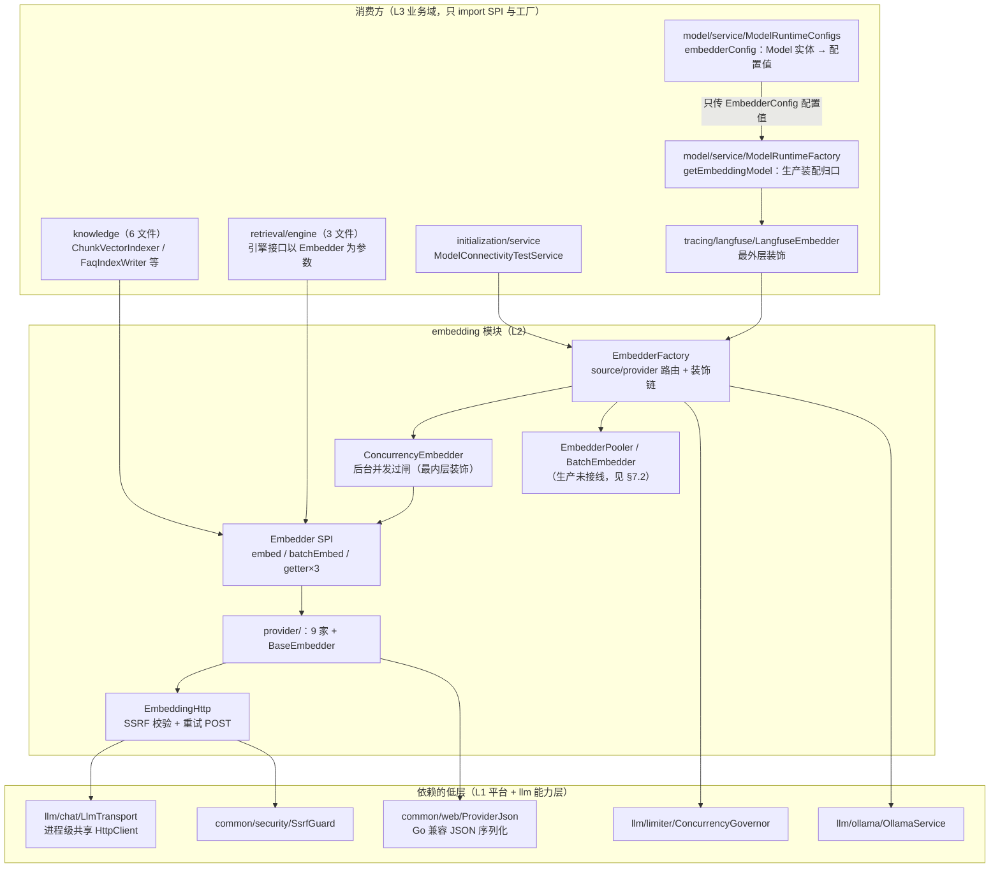
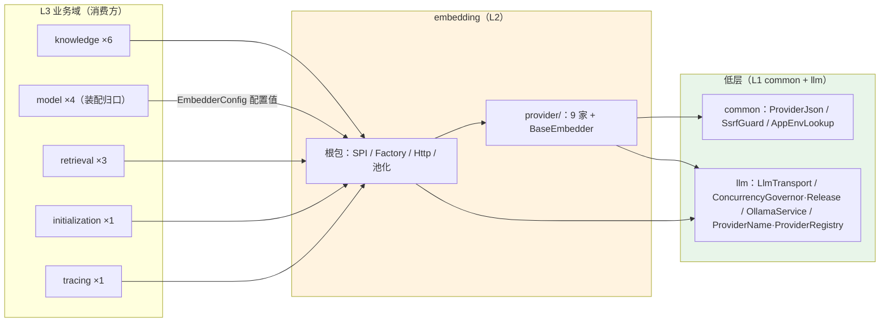
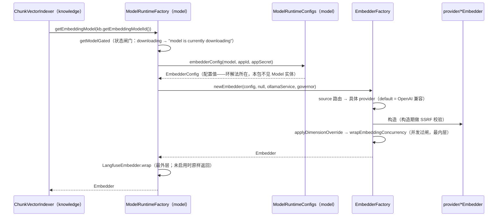
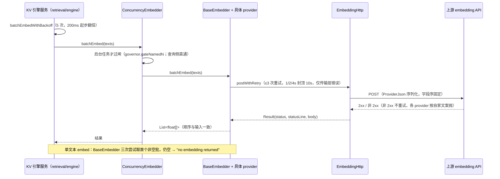
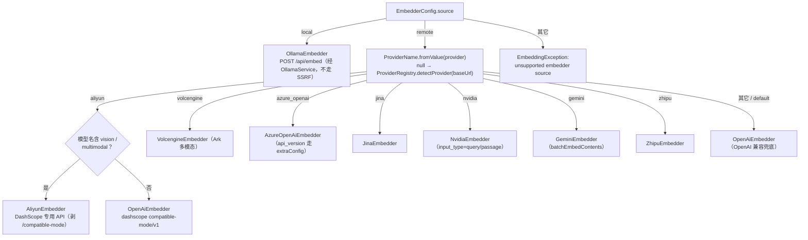

# embedding 模块手册

> **面向读者**：第一次接手 `com.ragagent.embedding` 的架构师 / 高级开发者。
> **目标**：30 分钟建立全局观 → 能定位改动点 → 能安全迭代（模块自身 20 个 wire 用例钉死线格式，全仓 4,704 个后端用例兜底——HANDOFF B62 批口径，改错会立刻红）。
> **数据口径**：2026-10-08 实测（`wc -l` 口径）：**20 个 java 文件 / 约 1.6 千行 / 2 个子包**。
> **本文档的地位**：模块级导览；仓库级作业规范见仓库根 `HANDOFF.md`（§12 结构地图、§13 踩坑清单、§14 逐包重构范式）。

---

## 0. 一分钟速览

**它是什么**：把**文本变成向量**的 provider 客户端族——一个纯库式包（L2 能力层），**没有 HTTP 面、没有数据库、不进 Spring 容器**（全包 0 个 `@RestController` / `@Component`，grep 实测）。根包是框架（SPI 接口、静态工厂、SSRF+重试的 HTTP 骨架、并发治理与池化装饰器），`provider/` 是 9 家上游 embedding API 的具体客户端加公共骨架 `BaseEmbedder`。调用不携带租户语义（租户由调用侧 `TenantContext` 决定，接口不传——`Embedder` javadoc）。

**⚠️ 四个近邻易混包辨析**（新人第一坑，名字太像了）：

| 包 | 是什么 | 与本包的关系 |
|---|---|---|
| `embed` | **业务渠道域**（L3，HTTP 叶子域，embedding 渠道配置/契约；`backend-package-map.md` 已建议改名 `embedchannel`） | 名字最近、语义最远：它是业务域，不是 provider 客户端。改"渠道业务"去那里，改"怎么调 embedding API"来这里 |
| `embedding`（本包） | **provider 客户端族**（L2）："文本 → 向量" | — |
| `vectorstore` | 向量库适配（L2） | 消费本包产出的 `float[]` 落索引；不产向量 |
| `rerank` | 重排 provider 客户端族（L2） | **姊妹包，结构同构**（根框架 + `provider/`），本包的坑它基本都有对应版（见 §7） |

**它不是什么**（别在这里改）：

| 不负责 | 归属 |
|---|---|
| 模型行存取、凭据解密、`Model` 实体 → 配置的映射 | `model`（`ModelRuntimeFactory` / `ModelRuntimeConfigs`——本包**只收 `EmbedderConfig` 配置值**，L2 层红线，见 §7.8） |
| chunk 文本怎么攒批、向量往哪个索引写 | `knowledge/service/ChunkVectorIndexer` + `retrieval/engine`（分批 40/10 与退避在引擎侧） |
| 查询侧的向量检索嵌入 | `knowledge/client/EmbedderClient`（最小 OpenAI 兼容客户端，实现 `common/embedding` 的 `EmbeddingGateway` 端口）——**不走本包**，见 §3.1 注 |
| 用量观测（langfuse generation） | `tracing/langfuse/LangfuseEmbedder`（在 model 域装配时套在最外层） |

### 图 1：模块全景



**三个必须知道的数字**：最大类只有 **174 行**（`EmbedderFactory`，工厂+路由，全包 Top10 类都 ≤174 行，是全仓少见的"小而关键"包）；`provider/` 占 **933 行（58%）** 但全是同构模板（构造兜底 → `batchEmbed` → 解析）；生产装配归口**只有 1 个**（`ModelRuntimeFactory.getEmbeddingModel`，外加连通性测试 1 处）——池化参数在这两处**恒传 null**（见 §7.2）。

---

## 1. 目录结构与职责

### 1.1 子包清单（放什么 / 不放什么）

| 子包 | 文件/行数 | 放什么 | **不放什么** |
|---|---|---|---|
| 根（框架） | 9 / 682（8 类 + package-info） | `Embedder` SPI、`EmbedderFactory` 路由与装饰链装配、`EmbeddingHttp` 传输骨架、`EmbedderConfig` 配置值、`ConcurrencyEmbedder`、`EmbedderPooler`/`BatchEmbedder` 池化、`EmbedQueryContext` | 任何一家上游 API 的具体协议（→ `provider/`）、业务语义 |
| `provider/` | 11 / 933（10 类 + package-info） | 9 家 provider 客户端 + 公共骨架 `BaseEmbedder`（重试取首个非空批、维度覆盖双条件、自定义头、包内小工具） | 框架面的改动（SPI/工厂/HTTP 留根——拆分时**故意不放宽可见性**，`BaseEmbedder` 只被 provider 用才随行） |

**根包 8 个类逐个**（行数实测）：

| 文件 | 行 | 一句话 |
|---|---|---|
| `EmbedderFactory` | 174 | 静态工厂：`source`（local/remote）→ provider 路由；装配顺序 = 维度覆盖 → 并发过闸 |
| `EmbeddingHttp` | 166 | 共享传输设施：构造期 SSRF 校验、`postWithRetry`（3 次重试指数退避）、状态行补短语、`Result`/`EmbeddingException` |
| `BatchEmbedder` | 117 | 池化实现：虚拟线程 + 容量信号量，`BATCH_EMBED_SIZE`（缺省 5）切子批，首错短路 |
| `ConcurrencyEmbedder` | 78 | 并发治理装饰器：**只节流后台任务**（`BackgroundTaskContext`），交互式查询永不过闸 |
| `EmbedderConfig` | 65 | 可变配置值类（14 字段，非 record——工厂链要就地 `setSupportsDimensionOverride`） |
| `EmbedQueryContext` | 38 | ThreadLocal 查询侧标记（NVIDIA 切 `input_type`=query/passage） |
| `EmbedderPooler` | 14 | 池化口（接口，一个方法） |
| `Embedder` | 23 | SPI：`embed` / `batchEmbed`（返回顺序与输入一致，由各 provider 保证）/ `getModelName` / `getDimensions` / `getModelID` |

**`provider/` 10 个类逐个**（行数实测；差异点速览）：

| 类 | 行 | 差异点 |
|---|---|---|
| `BaseEmbedder` | 105 | 骨架：`embed` 三次尝试取首个非空批；`supportsDimensionsParam` =「显式覆盖 + 维度为正」双条件 |
| `AliyunEmbedder` | 121 | 多模态模型走 DashScope 专用 API（工厂已剥 `/compatible-mode`） |
| `VolcengineEmbedder` | 106 | Volcengine Ark 多模态 embedding API |
| `GeminiEmbedder` | 106 | 原生 `batchEmbedContents` 端点；`x-goog-api-key` 头；数量不等显式报错 |
| `AzureOpenAiEmbedder` | 87 | deployment URL + `api-key` 头（非 Bearer）；`api_version` 走 extraConfig |
| `ZhipuEmbedder` | 82 | 智谱 |
| `OllamaEmbedder` | 82 | 本地服务：先 `ensureModelAvailable` 探活，经 `OllamaService` 走 `/api/embed`，**不走 SSRF 设施** |
| `OpenAiEmbedder` | 81 | OpenAI 兼容（**default 分支兜底**：未知 provider 一律落它）；`encoding_format` 恒 float |
| `NvidiaEmbedder` | 78 | `input_type` = query/passage（读 `EmbedQueryContext`） |
| `JinaEmbedder` | 76 | `truncate` 布尔 + dimensions |

### 1.2 依赖方向（L2 能力层，只收配置值）



- 本包 import 的外部类型**实测只有 9 个**（common 3 + llm 6，见上图）；**不 import `model`**——`embedding ⇄ model` 的包间环已由「配置值去实体化」解掉（`fromModel(Model)` 映射收回 `model/service/ModelRuntimeConfigs`，`backend-package-map.md` 批 4-b），方向是 model → embedding 单向。
- 这是全仓分层守卫（`scripts/check-package-cycles.py`）盯着的 L2 红线：**不得依赖 L3 业务域、只接受配置值而非业务实体**。守卫基线（2026-10-02 B33 后）：环 0 组 / L2→L3 直连 6 条（合法方向）。

---

## 2. 数据模型

**不适用**：本包没有实体、没有表、没有 jsonb——它是无状态客户端族，不落库、不持有领域数据。

唯一接近"数据"的是**配置值类型** `EmbedderConfig`（65 行可变类，14 字段），它只存在于内存、由 model 域从 `Model` 实体映射而来：

| 字段 | 用途 | 消费点 |
|---|---|---|
| `source` | `local` / `remote`（其它值 → 工厂直接抛） | `EmbedderFactory` 路由 |
| `provider` / `baseUrl` | remote 分支选 provider；provider 为空时 `ProviderRegistry.detectProvider(baseUrl)` 兜底 | 同上 |
| `modelName` / `apiKey` / `modelId` | 请求体模型名、鉴权、观测标识 | 各 provider 构造器 |
| `dimensions` + `supportsDimensionOverride` | 维度覆盖**双条件**（见 §7.6） | `BaseEmbedder` |
| `truncatePromptTokens` | 0 → 各 provider 构造器兜底 511 | 各 provider |
| `maxConcurrency` | 0 = 回退进程级默认（`limiter.GateN`） | `ConcurrencyEmbedder` |
| `extraConfig` | 如 azure 的 `api_version`（缺省 `2024-10-21`） | `EmbedderFactory` |
| `customHeaders` | 自定义请求头（保留头 Content-Type/Authorization 被跳过） | 各 provider |
| `appId` / `appSecret` | 历史字段（云唯一消费者已随 B62 裁撤，2026-10-04） | 当前无 provider 消费 |

---

## 3. 消费面：谁在调用我

### 3.1 消费方清单（main 源码实测：15 个文件 / 17 处 import / 5 个顶层包）

| 消费方 | 文件数 | 怎么用 |
|---|---|---|
| `model` | 4 | **装配归口**：`ModelRuntimeFactory.getEmbeddingModel`（状态闸门取模型行 → `ModelRuntimeConfigs.embedderConfig` → `EmbedderFactory.newEmbedder` → 外套 `LangfuseEmbedder.wrap`）；`ModelDebugController` 拿实例调 `embed` 做 debug |
| `knowledge` | 6 | `ChunkVectorIndexer`（**引擎路径**：`getEmbeddingModel` → 交给引擎 `batchIndex`；注意它的 **pg 直连路径**走的是 `EmbedderClient` 不是本包）、`FaqIndexWriter`、`ChunkQuestionService`、`KnowledgeCloneService`、`KnowledgeMoveService`、`task/KnowledgeProcessWorker` |
| `retrieval` | 3 | 引擎接口以 `Embedder` 为参数：`KeywordsVectorHybridRetrieveEngineService`（向量路 `embed`/`batchEmbed` + 自带 5 次退避重试）、`CompositeRetrieveEngine`、`RetrieveEngineService` |
| `initialization` | 1 | `ModelConnectivityTestService`：连通性测试，`newEmbedder` 后 `embed("hello")` 验维度 |
| `tracing` | 1 | `LangfuseEmbedder` 装饰器（实现本包 SPI；用量按「码点数/4 + 1」估算，因 provider 不返回 usage） |

> ⚠️ **双 embedding 客户端栈并存**（实测确认，别"顺手统一"）：`knowledge/client/EmbedderClient` 是一个**独立的最小 OpenAI 兼容客户端**（自己持 `HttpClient`，无重试/SSRF/多 provider），它实现 `common/embedding` 的 `EmbeddingGateway` 端口，服务 `HybridSearchService` 查询嵌入、`ChunkVectorIndexer` 的 pg 直连路径、wiki 与 memory 的 `*ModelResolver`。本包服务的是"多 provider 完整能力栈"。两者各有地盘，合并是架构决策不是清理。

### 3.2 对外契约约定（改前必读）

**`Embedder` SPI 契约**（`Embedder.java` javadoc + `BaseEmbedder` 行为）：

1. `embed(text)`：空结果时实现**应报 `no embedding returned`**（`BaseEmbedder` 三次尝试取首个非空批，仍空才抛）。
2. `batchEmbed(texts)`：**返回顺序与输入一致**（由各 provider 保证；数量不等的**显式校验**只在 Gemini 与 `BatchEmbedder`；Aliyun/Volcengine 按输入逐条构造、数量天然一致；OpenAI 兼容族按响应 `data` 长度返回、依赖上游行为——见 §9）。
3. getter 三件套（`getModelName`/`getDimensions`/`getModelID`）供过闸（按 modelId/modelName 命名闸门）、引擎删索引（`getDimensions`）与观测使用。
4. 调用**不携带租户语义**——租户由调用侧 `TenantContext` 决定。

**接一家新 provider 的固定 5 步**：

1. `provider/` 新建 `XxxEmbedder extends BaseEmbedder`：构造器兜底（baseUrl 默认、`truncatePromptTokens` 0→511）、构造尾部 `validateEmbeddingBaseUrl`、`batchEmbed` 用 `ProviderJson` 序列化（**字段序固定**）+ `EmbeddingHttp.postWithRetry` 发送 + 非 200 按自家文案抛。
2. `EmbedderFactory.newEmbedderInner` 的 remote `switch` 加一个 `case "xxx"`（记得 `setCustomHeaders`）。
3. `EmbeddingWireTest` 加用例：stub server 起在 127.0.0.1，请求体/路径/头部与 `domains/src/test/resources/wire/xxx.json` **逐字节比对**，错误分支（401/429/5xx/SSRF）核对判定。
4. 跑 `:domains:test`（本包单类：`--tests "com.ragagent.embedding.EmbeddingWireTest"`）+ spotless。
5. 若 provider 名需要识别：同步 `llm/provider/ProviderName` / `ProviderRegistry`（不在本包）。

---

## 4. 核心链路

### 4.1 装配链（模型行 → 可用 Embedder，生产唯一归口）



记住装饰顺序：**Langfuse 最外层（model 域套）、Concurrency 最内层（工厂套）**——工厂自己的 javadoc 说"langfuse 装饰器未实现"指的是工厂内部不加，外层装配在 model 域，读注释时对准主体。

### 4.2 一次批量向量化（KB 引擎路径）与三层重试洋葱



分批策略在**引擎侧**不在本包：`KeywordsVectorHybridRetrieveEngineService.batchIndex` 向量路切 40、非向量路切 10、批数 ≤5 全并发（该文件 javadoc）；本包的 `BatchEmbedder`（`BATCH_EMBED_SIZE` 缺省 5 切子批 + 虚拟线程池化）**生产未接线**（§7.2）。

### 4.3 provider 选择路由（`EmbedderFactory.newEmbedderInner`）



---

## 5. 改哪里（场景 → 文件）

| 我想… | 主要改这里 | 别忘了 |
|---|---|---|
| **接一家新 embedding provider** | `provider/XxxEmbedder`（extends `BaseEmbedder`）+ `EmbedderFactory` switch 加分支 | §3.2 的 5 步；wire fixture + `EmbeddingWireTest` 用例同批 |
| 改某家 provider 的请求/响应解析 | 对应 `provider/*Embedder` | **线格式冻结面**：字段序/错误文案逐字固定，wire 用例逐字节比对（§7.1）；同批改 fixture |
| 改超时 / 重试 | `EmbeddingHttp`（`DEFAULT_TIMEOUT`=60s / `MAX_RETRIES`=3） | 影响**全部 8 家 HTTP provider**（Ollama 不走它）；三层重试会叠乘（§7.5） |
| 改错误文案 | 对应 provider 类内文案 | 文案是契约（前端/日志有人按字样消费），同批改 wire 断言 |
| 改维度覆盖逻辑 | `BaseEmbedder.supportsDimensionsParam` + `EmbedderConfig` | 开关的**源头映射**在 `model/service/ModelRuntimeConfigs.embedderConfig`（不在本包） |
| 改并发治理 | `ConcurrencyEmbedder` + `llm/limiter` | per-model 上限来自 `EmbedderConfig.maxConcurrency`（0=进程默认）；只节流后台是**有意设计**（§7.4） |
| 接通/下线池化 | `EmbedderPooler`/`BatchEmbedder` + 两个传 null 的装配点（`ModelRuntimeFactory` / `ModelConnectivityTestService`） | 当前生产没人用（§7.2）；`BATCH_EMBED_SIZE` 环境变量因此不生效 |
| 启用 query/passage 区分 | 调用侧 `EmbedQueryContext.markQuery()` + `NvidiaEmbedder` | markQuery 目前**只有测试调用**（§7.3）；`EmbeddingWireTest.nvidiaPassageAndQueryInputTypes` 钉死两种形态 |
| 改"模型行 → 配置"映射 | **不在本包**：`model/service/ModelRuntimeConfigs.embedderConfig` | 本包只认配置值（L2 红线，§7.8）；别把 `Model` import 进来 |
| 给 `EmbedderConfig` 加字段 | `EmbedderConfig` + `ModelRuntimeConfigs.embedderConfig` + 工厂/provider 消费点 | 三处同改；字段加完看 wire 测试是否需要新 fixture |

---

## 6. 常见迭代 SOP

> 铁律：**一次只动一个 provider/一个轴**；每步全绿再走下一步。本包改动的快速内环是 wire 单类，提交前必须全量。

```bash
# 快速内环（改本包后先跑这个，秒级~分钟级）
cd ~/ragagent && JAVA_HOME=/opt/homebrew/opt/openjdk@21/libexec/openjdk.jdk/Contents/Home \
  ./gradlew :domains:test --tests "com.ragagent.embedding.EmbeddingWireTest"

# 每次改动后必跑的提交闸门
cd ~/ragagent && JAVA_HOME=/opt/homebrew/opt/openjdk@21/libexec/openjdk.jdk/Contents/Home \
  ./gradlew :domains:test :domains:spotlessCheck
```

**A. 接新 provider**：`provider/` 新类（骨架抄 `OpenAiEmbedder`，差异照 §1.1 表）→ 工厂 case 分支 → wire fixture（stub 录制）→ `EmbeddingWireTest` 用例 → 快速内环 → 全量闸门 → 提交。

**B. 改线格式（最危险，冻结面）**：先想清楚是否真的要动（§7.1）→ 改 provider → **同批**更新 wire fixture 与断言 → 快速内环 → 全量 → 提交里写明"动了兼容面"。

**C. 改共享传输设施（`EmbeddingHttp`）**：改完跑全量（8 家 provider + SSRF 分支共用）；动了 `SsrfGuard` 相关逻辑要确认白名单快照/恢复纪律（§7.7）。

**D. 加配置字段**：`EmbedderConfig` → `ModelRuntimeConfigs.embedderConfig`（model 域）→ 消费点（工厂或 provider）→ `configFromModelMapsAllFields` 用例同步 → 全量。

---

## 7. 模块约定与坑（必读，全部有出处）

1. **线格式冻结面**：各 provider 请求体**字段序固定**、错误文案**逐字固定**（含 body 1000 字节截断、`send request:` / `unmarshal response:` 前缀——`OpenAiEmbedder` javadoc 原文"错误文案逐字固定"）。`EmbeddingWireTest` 用 stub server 与 `wire/*.json` **逐字节比对**钉死。历史：B37（2026-10-03）退役了 provider 请求面的 Go HTML 转义复刻、B41（2026-10-03）把四份 GoJson 副本收敛到 `common/web/ProviderJson`（embedding 版为超集）——**字节兼容约束仍在**，别以为"Go 退役了就可以随意改键序"。
2. **池化（`EmbedderPooler`/`BatchEmbedder`）生产未接线**：两个生产装配点都传 null pooler（`ModelRuntimeFactory` 第 87 行注释"pooler 只服务批量向量化；debug 只走单文本 embed，传 null"；`ModelConnectivityTestService` 同）；全仓 `new BatchEmbedder` 只出现在 `EmbeddingWireTest`。**因此 `BATCH_EMBED_SIZE` 环境变量当前不生效**。真正的批量分批在 `retrieval/engine`（40/10）与调用方手里。
3. **`EmbedQueryContext.markQuery()` 无生产调用点**（grep 实测：唯一调用在 `EmbeddingWireTest:275`）：`NvidiaEmbedder` 的 `input_type` 生产上**恒为 `passage`**。查询/文档侧区分机制已备好但没接线——排障时别惊讶 NVIDIA 侧行为"和文档说的不一样"。
4. **只节流后台调用**：`ConcurrencyEmbedder` 坐在最内层，让批处理扇出的**每个子批 provider 往返单独过闸**（约束真实并发，不是粗粒度每文档单元）；`BackgroundTaskContext.isBackgroundTask()` 为假（交互式查询向量化）**永不被节流**——`EmbeddingWireTest.concurrencyGovernorGatesBackgroundCallsOnly` 钉死。governor 未装配时直通（fail open）。
5. **三层重试会叠乘**：KV 引擎 `batchEmbedWithBackoff` 5 次（200ms 起步翻倍，`KeywordsVectorHybridRetrieveEngineService:163`）× `EmbeddingHttp.postWithRetry` 3 次传输层重试（1/2/4s 指数退避封顶 10s；**HTTP 非 2xx 由调用方直接报错不重试**）× `BaseEmbedder.embed` 空批 3 次。最坏情况一次失败调用能拖很久（`BatchEmbedder` 的 future get 上限 10 分钟/子批），改重试参数前先算叠乘。
6. **维度覆盖是双条件**：`supportsDimensionsParam()` = 「配置显式覆盖 `supportsDimensionOverride` **且** `dimensions > 0`」才在请求体发 `dimensions`，否则**整键省略**——`EmbeddingWireTest` 的 `openAiDefaultOmitsDimensions` / `openAiOverrideSendsDimensions` 两用例钉死。
7. **SSRF 与 static 白名单**：HTTP provider 构造期做 `validateEmbeddingBaseUrl`（**空 URL 放行**，调用方会套 provider 默认地址；失败前缀 `base URL SSRF check failed: `），走 `LlmTransport` 进程级共享 HttpClient 与同一份白名单；`EmbeddingWireTest` 用 `@BeforeAll` 快照/恢复白名单（类注释："SsrfGuard 白名单是 static，改后不还原会踩同 JVM 的后续测试"）。**Ollama 是例外**：本地服务，不走 SSRF 设施（`OllamaEmbedder` javadoc）。
8. **L2 红线：只收配置值，不收实体**：`embedding ⇄ model` 环已解（`fromModel(Model)` 收回 `model/service/ModelRuntimeConfigs`，`backend-package-map.md` 批 4-b）；provider 里 import `model` 实体会被 `check-package-cycles.py` 守卫红灯。同理别从本包反向依赖任何业务域。
9. **双客户端栈并存**（§3.1 注）：本包（多 provider 完整栈）与 `knowledge/client/EmbedderClient`（最小 OpenAI 兼容，`EmbeddingGateway` 端口实现，服务查询嵌入/pg 直连/wiki/memory）各管一摊。**给 EmbedderClient 加重试或给本包"瘦身统一"之前，先弄清两边消费方**。
10. **构造兜底分散在各 provider**：`truncatePromptTokens` 0→511、OpenAI 默认 `https://api.openai.com/v1`、Ollama 默认模型名 `nomic-embed-text`、Gemini 剥 `models/` 前缀与 `/openai` 后缀、空输入恒返回 `[]`（Gemini）。接新 provider 时照抄这套兜底，别发明新默认。
11. **provider 数量是 9 家不是 10 家**：2026-09-30 拆 `provider/` 时是 10 家，B62（2026-10-04）整功能裁撤 WeKnora Cloud 时删了 `WeKnoraEmbedder`。旧文档写 10 家的地方以本手册为准。

---

## 8. 测试与验证

- **本模块**：**1 个测试类 `EmbeddingWireTest`（20 个 `@Test`）**，stub server 起在 `127.0.0.1`（测试禁真实网络）；请求体/路径/头部与 `domains/src/test/resources/wire/*.json` **逐字节比对**，错误分支（401/429/5xx/SSRF）核对判定。embedding 相关 wire fixture **10 个**：`aliyun` / `azure_openai` / `gemini` / `jina` / `nvidia_passage` / `nvidia_query` / `openai_default` / `openai_override` / `volcengine` / `zhipu`（同目录的 `rerank_*` / `ws_*` 属 rerank 与 websearch）。
- **覆盖面**：9 家 provider 的请求形态与错误文案、SSRF 拒绝/放行、`ModelRuntimeConfigs` 全字段映射（`configFromModelMapsAllFields`——测试范围串起 model 域，正是"配置值去实体化"后的真实驱动链）、并发过闸的后台/交互区分、`BatchEmbedder` 的结果归位/首错短路/数量不等文案。
- **仓级口径**：全量 4,704 个后端用例 0 失败 + spotlessCheck 绿（HANDOFF B62 批，2026-10-04 记录；本包改动跑全量闸门即可覆盖）。
- **已知偶发 2 例**（遇到先单独重跑，别误判回归；均与本包无关，全仓共有）：
  - `WebToolsRecordingTest.searchWithContentFetchesLeadingPagesViaSharedFetchTool`（全量并发下偶发）
  - `EvaluationContractTest.getTerminalRunsExecution`（全量并发下偶发；单独 `--tests "*EvaluationContractTest"` 通过）
- 本包测试自身要小心 **SSRF 白名单 static 污染**（§7.7）——新增用例别绕过 `@BeforeAll` 快照/恢复。

---

## 9. 已知待办与风险（接手后优先看）

| 项 | 性质 | 建议 |
|---|---|---|
| `EmbedderPooler`/`BatchEmbedder` 生产未接线（装配点恒传 null，`BATCH_EMBED_SIZE` 不生效） | 能力悬置 | 拍板二选一：把批量路径接到池化上，或整组删除；别长期悬置（本手册 §7.2 的混乱就是悬置的代价） |
| `EmbedQueryContext.markQuery()` 无生产调用点（NVIDIA 恒 `passage`） | 能力悬置 | 若检索质量需要 query/passage 区分（NVIDIA 官方建议区分），在查询入口 `markQuery`；否则连机制一起收掉 |
| Go 字节兼容层退役进行中（B37 完成第一刀：provider 请求面；stream 面待决） | 技术债（仓级，HANDOFF B37） | stream 面涉"与 Go 版共用 Redis 的 CAS"需确认 Go 版是否在跑；`GoTimeSerializer`/`GoMapSerializer` 需单独方案。本包直接相关的转义复刻已退役，但**线格式冻结约束未解除**（§7.1） |
| aliyun 多模态 embedding 两处口径不一致：工厂支持（DashScope 专用 API + 剥 compatible-mode），连通性测试**早期短路"暂不支持"**（`ModelConnectivityTestService`） | 功能缺口 | 若要开放多模态，先对齐连通性测试的短路分支；`EmbeddingWireTest.aliyunMultimodalRequestAndIndexReorder` 钉死了工厂侧行为 |
| batchEmbed 返回数量校验不统一：仅 Gemini 与 `BatchEmbedder` 显式报错（"X embeddings for Y inputs"）；Aliyun/Volcengine 按输入逐条构造（天然一致）；OpenAI 兼容族按响应 `data` 长度返回、无校验，而 `BatchEmbedder` 未接线 | 观察项 | 新接 provider 时确认其 count-mismatch 行为；若池化接通则 `BatchEmbedder` 的校验会兜底，若删除则考虑把校验上提 `BaseEmbedder` |

---

## 10. 速查：本模块的"地标"

| 想知道 | 看这里 |
|---|---|
| 文本怎么变成向量（最典型线格式样本） | `provider/OpenAiEmbedder.batchEmbed` |
| 我的模型会走哪家 provider | `EmbedderFactory.newEmbedderInner` 的 switch（§4.3；default = OpenAI 兼容） |
| 模型行怎么变成配置 | `model/service/ModelRuntimeConfigs.embedderConfig`（**不在本包**） |
| 生产上谁装配 Embedder | `model/service/ModelRuntimeFactory.getEmbeddingModel`（唯一归口）+ `initialization/ModelConnectivityTestService` |
| 超时/重试在哪调 | `EmbeddingHttp.DEFAULT_TIMEOUT`（60s）/ `MAX_RETRIES`（3）；叠乘效应见 §7.5 |
| 为什么后台向量化被限流而查询没有 | `ConcurrencyEmbedder.gate()`（`BackgroundTaskContext` 判断，§7.4） |
| 维度覆盖什么时候生效 | `BaseEmbedder.supportsDimensionsParam`（显式覆盖 + 维度为正，§7.6） |
| NVIDIA query/passage 怎么切 | `EmbedQueryContext`（⚠️ markQuery 生产无调用点，§7.3） |
| 线格式契约在哪钉死 | `EmbeddingWireTest` + `domains/src/test/resources/wire/*.json`（embedding 相关 10 个） |
| 查询侧向量化和本包什么关系 | `HybridSearchService` → `common/embedding` `EmbeddingGateway` → `knowledge/client/EmbedderClient`（**不走本包**，§3.1 注） |
| 目录为什么这样分 | 两份 `package-info.java` + `docs/backend-package-map.md`（P1 provider 族拆分：根 9 框架 + `provider/` 11） |
