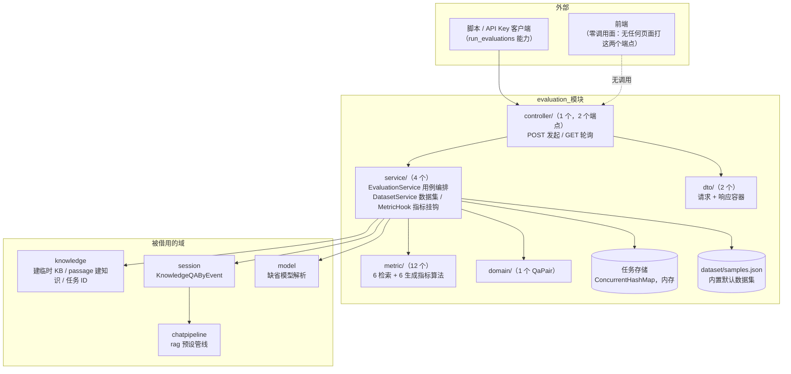
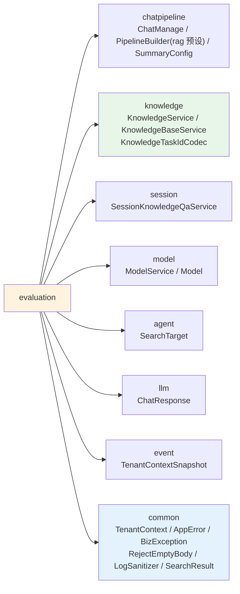
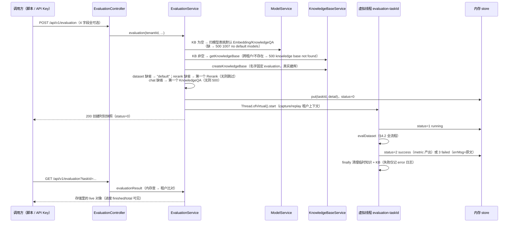
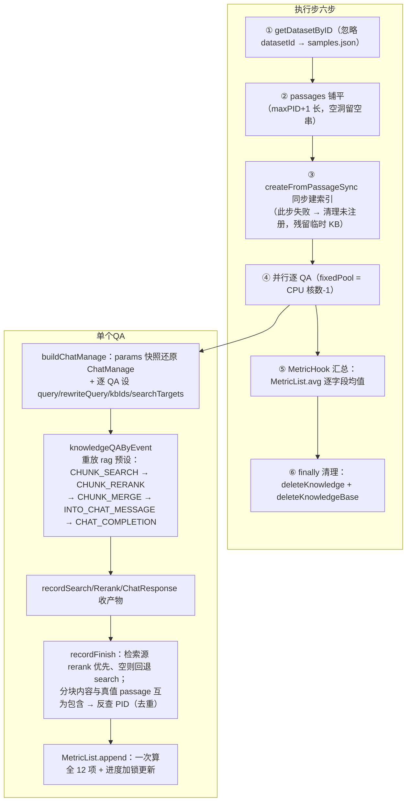
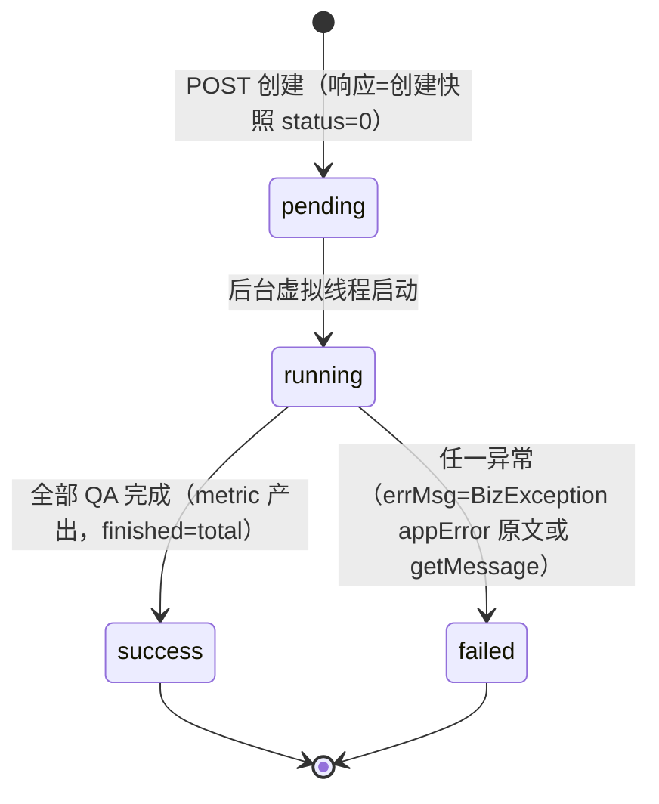

# evaluation 模块手册

> **面向读者**：第一次接手 `com.ragagent.evaluation` 的架构师 / 高级开发者。
> **目标**：30 分钟建立全局观 → 能定位改动点 → 能安全迭代（本模块有 26 个后端用例兜底，改错契约会立刻红）。
> **数据口径**：2026-10-08 实测（`wc -l` 口径）：**21 个 java 文件 / 约 2,090 行 / 5 个子包**（外加根 `package-info.java` 1 文件 5 行）。
> **本文档的地位**：模块级导览；仓库级作业规范见仓库根 `HANDOFF.md`（§12 结构地图、§13 踩坑清单、§14 逐包重构范式）。

---

## 0. 一分钟速览

**它是什么**：评测域的全部后端能力——**对 RAG 效果打分**。发起一次评测 run：拿一个问答数据集，把 passage 灌进临时知识库、逐条 QA 重放 `rag` 预设管线，然后算 12 项指标（6 检索 + 6 生成）并给出任务详情。

- 入口只有两个端点：`POST /api/v1/evaluation`（发起，Admin 门）、`GET /api/v1/evaluation?taskId=…`（轮询，Viewer 门）
- 任务态是**进程内存**（`ConcurrentHashMap`），不落库；数据集是**classpath 内置**的 `dataset/samples.json`
- 指标算法纯函数、零依赖（`metric/` 12 个类，`Metrics.compute(MetricInput)` 单一入口）

**它不是什么**（别在这里改）：

| 不负责 | 归属 |
|---|---|
| 会话编排、SSE 流、多轮对话 | `session`（本模块借 `SessionKnowledgeQaService.knowledgeQAByEvent` 跑单轮 QA） |
| KB / chunk / 向量索引的常规管理 | `knowledge`（每次 run 借它建临时 KB、同步建索引，跑完即删） |
| 流水线各阶段的实现 | `chatpipeline`（本模块只**重放** `rag` 预设，不定义阶段） |
| 模型注册与凭据 | `model`（只按模型表挑默认 `Embedding`/`KnowledgeQA`/`Rerank`） |
| 异步任务队列 / 进度框架 / 任务 ID 生成 | `knowledge/task`（只借 `KnowledgeTaskIdCodec` 编号；任务态是本模块自己的内存 Map） |

### 图 1：模块全景



**三个必须知道的数字**：最大类 484 行（`EvaluationService`，全部用例编排都装在它一个类里）；`metric/` 950 行 ≈ 全包 45%（算法才是本模块的主体，服务层只是编排壳）；**0 张表 / 2 个端点 / 26 个用例**（无持久化实体，任务态纯内存）。

---

## 1. 目录结构与职责

### 1.1 子包清单（放什么 / 不放什么）

| 子包 | 文件/行数 | 放什么 | **不放什么** |
|---|---|---|---|
| （根） | 1 / 5（package-info） | 域定位声明（含「改动前先与用户确认」） | —— |
| `controller/` | 1 / 84 | `@RestController`：空体校验、租户获取、入参净化（`LogSanitizer`）、`IllegalStateException` → 500 信封 | 业务逻辑、手搓 `ObjectNode` |
| `service/` | 4 / 898 | `EvaluationService`（编排 + 内存任务存储 + 缺省解析链）、`DatasetService`（内置数据集加载）、`MetricHook`（逐 QA 产物收集 → 指标汇总）、`EvaluationPromptDefaults`（prompt 常量） | 指标算法（→ `metric/`）、HTTP 形状（→ `dto/`） |
| `metric/` | 12 / 950 | 纯函数指标算法：`Metrics` 接口 + 6 检索（Precision/Recall/NDCG@3/NDCG@10/MRR/MAP）+ 6 生成（BLEU-1/2/4、ROUGE-1/2/L）+ 切句/分词/log2 辅助 | 注入 Bean、访问数据库、Spring 注解 |
| `domain/` | 1 / 17 | `QaPair` record（数据集一行：问题 + pids + passages + 答案）——**不是表实体** | `@TableName` 实体（本模块没有表） |
| `dto/` | 2 / 136 | `EvaluationRequest`（4 字段全可选）、`EvaluationDtos`（task + params + metric 三层响应容器，**打包 6 个嵌套类**） | 持久化注解 |

没有 `repository/`、`mapper/`、`task/` 子包——本模块零 SQL、零 MyBatis 接口、零队列。

### 1.2 依赖方向（只出不进）



**枢纽说明**：`EvaluationService`（484 行）是唯一枢纽，5 个注入点（`ModelService`/`KnowledgeBaseService`/`DatasetService`/`KnowledgeService`/`SessionKnowledgeQaService`）。**入边为零**：全仓没有任何包 import 本模块（2026-10-08 grep 实测，与 `HANDOFF.md` §6.2「`evaluation` 零外部引用，随时可纯删」一致）。这意味着本模块改动**不会波及任何其他域**；反过来，它对 `knowledge`/`session`/`chatpipeline` 的公开 API 变化敏感（借的接口改名会在这里编译红）。

---

## 2. 数据模型

### 2.1 ER 图 —— **不适用**

**不适用原因**：本模块**零张表**（全包 grep `@TableName` / `typeHandler` 为 0，无 mapper/repository）。任务的持久化载体不存在：

| 数据 | 载体 | 生命周期 |
|---|---|---|
| 评测任务（task + params + metric） | `EvaluationService.store`（`ConcurrentHashMap<String, EvaluationDetail>`，进程内存） | 随进程存亡；**重启即丢**，之后 GET 同 taskId → 500 `task not found` |
| 评测数据集 | classpath `server/src/main/resources/dataset/samples.json`（5 张逻辑"表"：`queries`/`corpus`/`answers`/`qrels`/`qas`；当前 1 QA 对 / 4 passage / 1 答案） | 随仓库固化；`DatasetService` 双重检查锁缓存一次 |
| 临时知识库 | 借 `knowledge` 域真实建库（名字固定 `evaluation`） | run 结束 `deleteKnowledge` + `deleteKnowledgeBase` 删除；失败路径会残留（见 §7） |

### 2.2 jsonb 列与值类型对照 —— **不适用**

**不适用原因**：本模块不拥有任何 jsonb 列（无实体、无 typeHandler）。响应里的 `params` 是 `PipelineParams`/`SummaryConfigParams` 纯 DTO 快照，不落库。

### 2.3 状态枚举

| 枚举 | 取值 | 用在哪 |
|---|---|---|
| 任务状态（**int 常量，非 enum 类**） | `STATUS_PENDING=0` → `STATUS_RUNNING=1` → `STATUS_SUCCESS=2` / `STATUS_FAILED=3` | `EvaluationDtos` 顶部常量；`task.status` 字段，JSON 输出为数字 |
| 失败消息 | `ERR_NO_DEFAULT_MODELS` / `ERR_NO_DEFAULT_CHAT_MODEL` / `ERR_TASK_NOT_FOUND` / `ERR_TENANT_MISMATCH`（`EvaluationService` 公共常量） | `errMsg` 与错误信封 `message` 的**契约原文**，改文案 = 改契约 |

注意：状态机**没有取消/重跑**——终态不可逆，也没有任何端点能把 run 拉回 pending。

---

## 3. HTTP 接口面

### 3.1 端点分组（1 个 controller / 共 2 个端点）

**评测**（`EvaluationController`，前缀 `/api/v1/evaluation`）

| 方法 | 路径 | 用途 | 门 |
|---|---|---|---|
| POST | `/api/v1/evaluation` | 发起评测 run。请求体 4 字段全可选：`datasetId` / `knowledgeBaseId` / `chatId` / `rerankId`；0 字节空体 → 400；字面量 `null` → 按全空处理 | Admin（RBAC + API Key `run_evaluations` 能力） |
| GET | `/api/v1/evaluation?taskId=…` | 轮询任务详情（进度计数 / 终态 / 指标）。`taskId` 缺失或空白 → 400（手写校验，`taskId: 不能为空`） | Viewer（同租户可读） |

RBAC 规则登记在 `config/WebConfig.java:322-323`（POST=ADMIN、GET=VIEWER，**不在本包**）；API Key 路由策略在 `auth/apikey/filter/APIKeyRoutePolicies.java:212-213`。viewer 打 POST → 403 `{"error":"Forbidden: insufficient workspace role"}`。

### 3.2 契约约定（2026-10-01 §14.9b 打样换锚后形态）

| 约定 | 本域实际 |
|---|---|
| 字段名 | **JSON 名 = Java 字段名**（camelCase，全包 0 个 `@JsonProperty` / `@JsonInclude`，打样前 66/12 处已清零） |
| 信封 | **无** `{data,success}` 信封：`EvaluationDetail` 直出 200 |
| 错误 | `{error:{code,message,details}}`；本域两档：**1000** 校验类（`请求参数不合法` + 字段级中文 details）、**1007** 执行类（service 抛 `IllegalStateException` → `AppError.internal`，message=原文） |
| 空体 | 0 字节 → 400 `请求体不能为空`（`@RejectEmptyBody`）；**字面量 `null` 请求体合法**（按全空请求，`EvaluationRequest.empty()`） |
| 可空字段 | **显式输出 `null`**（`metric` 未产出为 null 且键恒在；`summaryConfig.thinking`、`params.knowledgeBaseIds` 同理） |
| 时间 | ISO-8601 带时区（`startTime`，`OffsetDateTime.now(ZoneOffset.UTC)`） |
| 删除 204 / 乐观锁 409 | 不适用（本域无删除、无编辑端点） |
| 快照语义 | POST 响应是**创建时刻快照**（status 恒 0）；running/failed 只能 GET 到（§7 第 9 条） |

---

## 4. 核心链路

### 4.1 一次评测 run 的生命周期



要点：POST 返回**快照**、GET 返回 **live 对象**——这是刻意设计（类 javadoc「任务状态竞争的确定性化」：响应序列化与后台启动不再互相竞争）。任务 ID 形如 `evaluation_10002_1789790692379_7ce63bdd_default`（`KnowledgeTaskIdCodec.generateTaskId("evaluation", tenantId, datasetId)`：`类型_租户_毫秒_8hex_业务截断12位`）。

### 4.2 执行步（evalDataset）与单 QA 的 rag 重放



指标输入的对接口径（`MetricHook.HookMetric.recordFinish`）：`RetrievalGT = [qaPair.pids]`、`GeneratedGT = qaPair.answer`、生成文本取 `chatResponse.getContent()`。**命中 PID 不是索引 ID**——靠「分块内容与真值 passage 互为包含」反查，这是评估分数与检索实现解耦的关键（也意味着分块被改写到与原文不再互相包含时，检索类指标会失真）。

### 4.3 任务状态机



无取消、无重跑、无持久化：终态不可逆，进程重启后整个状态机连同历史一起消失。

---

## 5. 改哪里（场景 → 文件）

| 我想… | 主要改这里 | 别忘了 |
|---|---|---|
| 加/改请求字段 | `dto/EvaluationRequest` + `controller/EvaluationController` + `service/EvaluationService` 缺省解析链 | 空体语义（null vs 空串）；重录 `ev-post` fixture |
| 改响应形状 / 加字段 | `dto/EvaluationDtos`（嵌套类 + 字段声明序 = JSON 键序） | 无命名注解、可空显式 null；同批重录 `ev-post.json` / 相关 fixture |
| 改缺省模型解析（如改成按配置挑） | `service/EvaluationService.evaluation` 前半段 | `ERR_*` 常量文案是契约原文；`ev-post-empty` fixture 钉着它 |
| 改某个指标算法 | `metric/` 对应类（如 `NdcgMetric`） | `RetrievalMetricsTest` 钉的是 Go 对数（`*MatchesGoCases`）；`MetricCommon.log2` 的 frexp 语义别顺手"简化" |
| 加一项指标 | `metric/` 新实现 `Metrics` + `MetricHook.CALCULATORS` 注册 + `EvaluationDtos` 的 `RetrievalMetrics`/`GenerationMetrics` 加字段 | 12 项顺序固定在 `CALCULATORS`；均值口径在 `MetricList.avg` |
| 换生成类指标的分词 | `metric/MetricSegmenter.setSegmenter` 接缝（默认二字滑窗） | 只影响 BLEU/ROUGE；纪律同 chatpipeline：**不在 searchutil 上加出口**，注入即恢复 |
| 换/加数据集 | `service/DatasetService.load` + `server/src/main/resources/dataset/samples.json` | 数据集更新需用转换脚本重新生成（javadoc）；`DatasetServiceTest` 两用例要同步 |
| 改管线参数默认值 | `EvaluationService.buildParams`（@Value `conversation.*`）+ `service/EvaluationPromptDefaults` | prompt 常量是**响应体的一部分**，golden 随部署配置漂移（§7 第 6 条） |
| 改进度/终态写法 | `EvaluationService.evalDataset` / `runQaPair` | 别破坏「POST=创建快照、GET=live 对象」语义（契约测试在钉） |
| 改清理行为 | `evalDataset` 的 finally 块 | 失败仅 error 日志；"残留临时 KB"是已备案现状 |
| 改鉴权门 | `config/WebConfig.java:322-323` + `APIKeyRoutePolicies`（都在本包外） | POST=Admin / GET=Viewer；改门 = 改 `ev-post-viewer` / `ev-get-viewer` 覆盖的场景 |
| 改任务 ID 形态 | `knowledge/task/KnowledgeTaskIdCodec`（**不在本域**） | 掩码正则同步放宽（HANDOFF §13.13 的三次实录坑） |

---

## 6. 常见迭代 SOP

> 铁律同全仓：**一次只动一个轴**；每步结束全绿再走下一步。

```bash
# 每次改动后必跑
cd ~/ragagent && JAVA_HOME=/opt/homebrew/opt/openjdk@21/libexec/openjdk.jdk/Contents/Home \
  ./gradlew :server:test :server:spotlessCheck
# 只跑本域（快路，约秒级~分钟级）
cd ~/ragagent && JAVA_HOME=/opt/homebrew/opt/openjdk@21/libexec/openjdk.jdk/Contents/Home \
  ./gradlew :server:test --tests "com.ragagent.evaluation.*"
# 偶发用例单独重跑（见 §8）
cd ~/ragagent && JAVA_HOME=/opt/homebrew/opt/openjdk@21/libexec/openjdk.jdk/Contents/Home \
  ./gradlew :server:test --tests "*EvaluationContractTest"
```

**A. 加请求/响应字段**：`dto` → `controller`（`@Valid`/`@RejectEmptyBody`）→ `service` 缺省链 → 重录/补 `ev-*` fixture → 全绿 → 提交。前端零调用面，无需带前端改动。

**B. 改指标**：`metric/` 算法 → `MetricHook` 注册 → `EvaluationDtos` 字段（若对外可见）→ 单测（Go 对数用例优先）→ 全绿。

**C. 换数据集**：转换脚本产出新 `samples.json` → `DatasetService`（结构不变则零改动）→ `DatasetServiceTest` → 全绿。

**D. 改契约文案**：先确认它是不是 `ERR_*` / `EvaluationPromptDefaults` 里的**契约原文** → 是则同批重录 fixture（`-Dcontract.refresh=true` 只在已接入的测试类生效，本域未接入，手改 + 结构化复核）→ 全绿。

---

## 7. 模块约定与坑（必读）

1. **域定位是「待排期可选项」，改动前先与用户确认**——出处：根 `package-info.java` 原文；`HANDOFF.md` §2 第 5 条（功能裁剪第一批不含本域，勿主动动手）；`docs/backend-package-map.md` §4「别动」清单。它零外部引用、随时可纯删，**先问方向再动刀**。
2. **任务态是内存 Map，重启即丢**；GET 不存在的 taskId 返回 **500（不是 404）**，code 1007 `task not found`（`EvaluationService.evaluationResult` + `ev-get-unknown.json`）。多实例部署下任务也不共享——这直接限制了本模块的生产可用形态。
3. **指标是「降级语义备案」**（`EvaluationService` javadoc「已知差异」）：分词走 `MetricSegmenter` 二字滑窗近似（只影响 BLEU/ROUGE；`MetricSegmenter` javadoc）；NDCG 的 log2 以 frexp 同式仿真，libm 差异可致末位分叉（`MetricCommon.log2` 注释）。**不要**把它们当 bug 修，也不要顺手替换成"标准实现"而不同批改测试。
4. **临时 KB 会残留**：每次 run 真实创建名为 `evaluation` 的 KB；`createFromPassageSync`（第 ③ 步）失败时清理尚未注册 → 残留该 KB；且清理用 `deleteKnowledge + deleteKnowledgeBase`，**不做引用检查/副本保留**（`EvaluationService` javadoc「其他固定语义」）。
5. **`BizException.getMessage()` 是 `error code: N, …` 前缀形态**——要原文必须取 `appError().message()`（`EvaluationService.kbNotFoundMessage` 的 ⚠️ 注释）。跨租户源 KB 落 404 同文案再包 500，也是备案差异。
6. **`EvaluationPromptDefaults` 的 prompt 常量是响应体的一部分**，来源是部署的 config.yaml / prompt_templates 生效值——golden（`ev-post.json`/`ev-get.json`）钉的是 dev 部署的值，**随配置漂移而漂移**（该类 javadoc 原话：A/B 时按部署各自断言）。
7. **`DatasetService.getDatasetByID` 忽略 datasetId**，恒返回内置默认数据集（1 QA 对 / 4 passage / 1 答案；javadoc 即契约，`DatasetServiceTest.datasetIdIgnored` 钉住）。传任何 datasetId 都不会真的换数据集。
8. **租户上下文在虚拟线程/线程池里无隐式继承**——提交线程 capture、工作线程 replay、finally clear，本包两处照此写（`EvaluationService` 主线程与 QA 线程池；`TenantContextSnapshot`）。新增并发代码必须沿用，否则评测跑到一半租户上下文为 null。
9. **POST 响应永远看不到 running**：返回的是创建时刻快照（status=0），后台只改存储里的对象（类 javadoc「任务状态竞争的确定性化」）。破坏这个语义 = 破坏契约测试 `postSuccess` 的前提。
10. **已知偶发 1 例在本域**：`EvaluationContractTest.getTerminalRunsExecution` 全量并发下偶发，单独 `--tests "*EvaluationContractTest"` 通过（`docs/knowledge-module-guide.md` §8 与全仓已知偶发清单同源）。遇到先重跑，别误判回归。
11. **闸门命令的环境卫生**（HANDOFF §13.9，evaluation 打样批实录）：`source .env` 的 shell 会把 `SYSTEM_AES_KEY` 泄漏给 Gradle 测试，造成"孤零零 1 个环境相关失败"——先 `env | grep SYSTEM_AES`，或 `env -u SYSTEM_AES_KEY ./gradlew …`。

---

## 8. 测试与验证

- **规模**：**4 个测试类 / 26 个 `@Test`**（2026-10-08 grep 实测）：

| 测试类 | 用例 | 钉什么 |
|---|---|---|
| `evaluation/EvaluationContractTest`（273 行） | 8 | POST/GET 端到端契约：badjson/nobody/empty(无模型)/kb-missing/viewer-403/get 校验/创建快照/真实执行到终态 |
| `metric/RetrievalMetricsTest`（133 行） | 9 | 检索 6 指标，Precision/Recall/MRR/MAP 是 **Go 对数用例**（`*MatchesGoCases`）+ NDCG 边界 + 公共分词 |
| `metric/GenerationMetricsTest`（71 行） | 7 | BLEU/ROUGE 边界（全同/空/smoothing 无重叠/部分重叠） |
| `service/DatasetServiceTest`（41 行） | 2 | samples.json 与 Go 数据集逐字一致 + datasetId 被忽略 |

- **fixture**：`server/src/test/resources/contracts/` 下 **`ev-` 前缀 10 个**（`ev-post` / `ev-post-badjson` / `ev-post-nobody` / `ev-post-empty` / `ev-post-kb-missing` / `ev-get` / `ev-get-missing` / `ev-get-unknown` / `ev-get-viewer` / `ev-post-viewer`）。其中 **7 个被 `golden()` 直接比对**；`ev-get.json` / `ev-get-viewer.json` / `ev-post-viewer.json` 是存档形态（现用例改为内联断言/轮询，见下）。
- **比较口径**：`ContractJson.semantic` 语义比较（键序/HTML 转义归一）；`ev-post` 两侧同掩码（taskId → `<taskid>`、startTime → `<ts>`）。
- **契约测试会真跑流水线**：测试部署无 embedding 模型 → `getTerminalRunsExecution` 里段落同步建索引在 `ChunkVectorIndexer` 失败 `model ID cannot be empty` → 终态 failed（**确定性**）；metric 显式 null（键恒在）。部署有模型时才会跑到指标产出（fixture `ev-get.json` 记录的终态形态）。
- **已知偶发**：`EvaluationContractTest.getTerminalRunsExecution` 全量并发下偶发，单独重跑通过：

```bash
cd ~/ragagent && JAVA_HOME=/opt/homebrew/opt/openjdk@21/libexec/openjdk.jdk/Contents/Home \
  ./gradlew :server:test --tests "*EvaluationContractTest"
```

- **改前端可见契约时**：本域目前**前端零调用面**（2026-10-08 grep `api/v1/evaluation` 于 `frontend/src` 为 0，与 HANDOFF §14.9b 打样记录一致），无需同批带前端；但一旦前端开始调用，按仓库纪律同批改。

---

## 9. 已知待办与风险（接手后优先看）

| 项 | 性质 | 建议 |
|---|---|---|
| `EvaluationDtos` 容器待拆分（6 个嵌套类一文件，违反"一类型一文件"） | 结构债（已登记） | HANDOFF §7.1 已注明「另立批次」；拆时按 §14.2 七步走 |
| 任务态纯内存（重启丢 / 多实例不共享 / 无清理上限） | 设计备案 → 生产化风险 | 若评测要真用，先与用户确认方向（落库 or 接受现状）；不要擅自加表 |
| 临时 KB 残留（建索引失败路径） | 已备案缺陷 | 修复属行为变更，单独一批 + 全绿验证 |
| 指标降级备案（二字滑窗分词 / log2 frexp 仿真） | 语义备案 | 真要对齐词典分词，从 `MetricSegmenter.setSegmenter` 接缝注入，别改 `searchutil` |
| 域可能整体裁剪（零外部引用，「随时可纯删」） | 产品待决 | 动任何刀之前先问用户：留、裁、还是重构（HANDOFF §2 第 5 条） |
| 3 个存档 fixture 未挂 golden（`ev-get`/`ev-get-viewer`/`ev-post-viewer`） | 低风险卫生项 | 要么恢复 golden 断言（viewer 403/200 路径现无夹具锚定），要么注明存档用途 |

---

## 10. 速查：本模块的"地标"

| 想知道 | 看这里 |
|---|---|
| 一次评测怎么跑起来的 | §4.1 + `service/EvaluationService.evaluation` → `evalDataset` |
| rag 管线在哪重放 | `EvaluationService.runQaPair` → `SessionKnowledgeQaService.knowledgeQAByEvent(chatManage, presets["rag"])` |
| 12 项指标怎么注册与求均值 | `service/MetricHook.CALCULATORS`（12 个 Slot）+ `MetricList.avg` |
| 某个指标的算法 | `metric/` 同名类；切句/分词/log2 在 `MetricCommon` / `MetricSegmenter` |
| 数据集长什么样 | `server/src/main/resources/dataset/samples.json` + `DatasetService` 内部 `Dataset` record（5 张逻辑表） |
| 响应 JSON 的形状 | `dto/EvaluationDtos`（字段声明序 = 键序；javadoc 即契约） |
| 错误文案为什么这么写 | `EvaluationService.ERR_*` 常量 + `kbNotFoundMessage`（§7 第 5 条） |
| prompt 常量哪来的 | `service/EvaluationPromptDefaults`（部署 config.yaml 生效值，随配置漂移） |
| 权限门在哪配 | `config/WebConfig.java:322-323`（本包外）+ `APIKeyRoutePolicies` |
| 任务 ID 怎么编的 | `knowledge/task/KnowledgeTaskIdCodec.generateTaskId`（本包外） |
| 为什么偶发红 | §8 已知偶发 + §7 第 10/11 条 |
| 这个域还做不做 | `package-info.java` + HANDOFF §2 第 5 条——**先问用户** |
