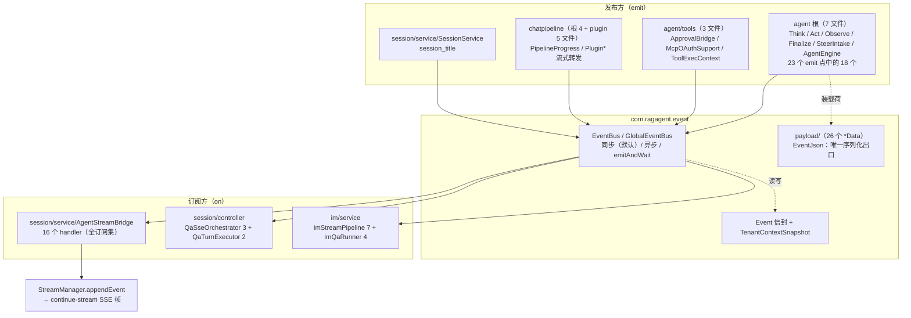
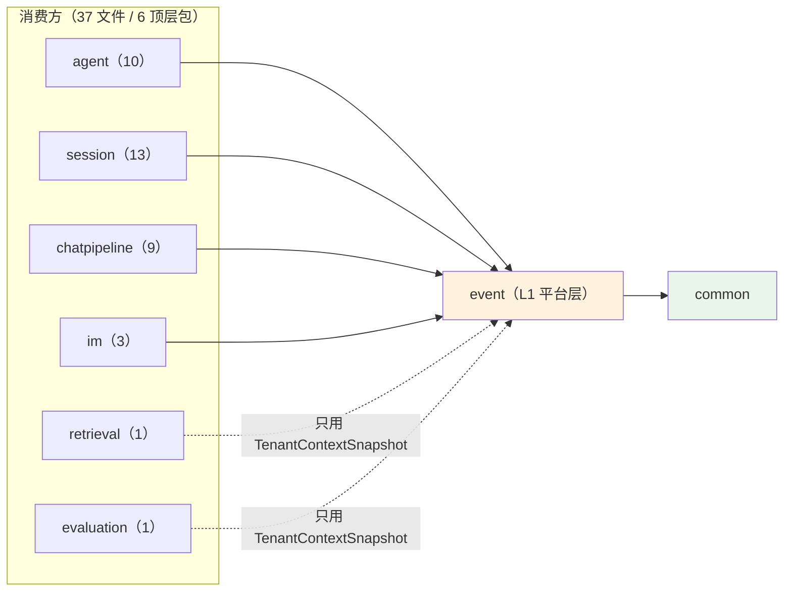
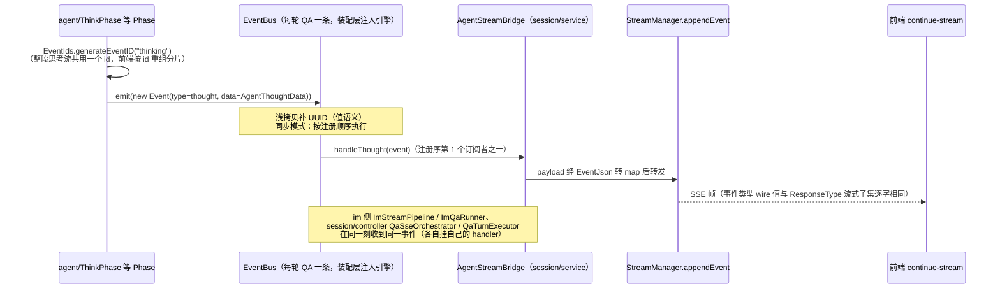
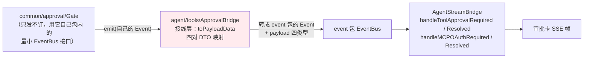

# event 模块手册

> **面向读者**：第一次接手 `com.ragagent.event` 的架构师 / 高级开发者。
> **目标**：30 分钟建立全局观 → 能定位改动点 → 能安全迭代（本模块有 98 个后端用例兜底，改错会立刻红）。
> **数据口径**：2026-10-08 实测（`wc -l` 口径）：**40 个 java 文件 / 约 0.36 万行 / 2 个子包**。
> **本文档的地位**：模块级导览；仓库级作业规范见仓库根 `HANDOFF.md`（§12 结构地图、§13 踩坑清单、§14 逐包重构范式）。

---

## 0. 一分钟速览

**它是什么**：进程内事件总线 + 事件契约族——**agent 引擎、审批、检索管线把过程事件发出来，流式转发层订阅后推进 SSE**。

- 总线机制（根 13 类）：同步 / 异步 / emitAndWait 三种发射语义、中间件链、全局单例、租户上下文快照
- 事件载荷（`payload/` 26 个 `*Data`）：每个 payload 的键名 / 键序 / 字段省略边界都是**线上契约**（经 SSE 帧到达前端）
- 事件 ID 生成：`generateEventID`（uuid 前 8 位 + 类型后缀）供流式分片重组
- 23 个 emit 点表固化在本包 `package-info.java`（agent 根 18 + `agent/tools/McpOAuthSupport` 1 + `common/approval/Gate` 4）

**它不是什么**（别在这里改）：

| 不负责 | 归属 |
|---|---|
| 跨进程投递 / 持久化事件（MQ、Redis 流） | 无——本包是**纯 InProcess**；Redis 流事件属 `stream/`，SSE 帧属 `stream` + `session` |
| 业务语义（这条事件"意味着什么"） | 载荷归属域：agent 引擎语义在 `agent`，审批语义在 `common/approval`，会话语义在 `session` |
| SSE 帧格式与流存储 | `stream`（`StreamEvent` / `StreamJson`）+ `session/service/AgentStreamBridge`（本包的**订阅方**） |
| 审批的领域逻辑（Gate / 决策 / 超时） | `common/approval`（它只发不订，经接线层适配到本包总线） |
| Spring 事件（`@EventListener`） | 无关——本包与 Spring `ApplicationEvent` 是两套机制（如 knowledge 域的 `KnowledgeProcessedEvent` 走 Spring 面不入本包） |

### 图 1：模块全景



**三个必须知道的数字**：最大类 246 行（`EventBus`，三种发射语义全在一个类，行为由 `EventBusTest` 16 用例钉住）；`payload/` 26 文件 2,536 行（约占全包 71%，全是"一 payload 一文件"的契约记录）；订阅注册全仓仅 **32 处 `.on(`、集中 5 个文件**（最大的 `AgentStreamBridge` 一处 16 个）。

---

## 1. 目录结构与职责

### 1.1 子包清单（放什么 / 不放什么）

| 子包 | 文件/行数 | 放什么 | **不放什么** |
|---|---|---|---|
| 根（机制） | 14 / 1,039（13 个机制类 + package-info） | `Event` 信封、`EventBus` / `GlobalEventBus`、`EventHandler` / `EventMiddleware`、`EventBusInterface` + `EventBusAdapter`、`EventType`（38 常量）、`EventIds`、`EventJson`、`EventBusException` / `PanicError`、租户信封 `TenantContextSnapshot` | 业务判断、任何 payload 类 |
| `payload/` | 26 / 2,536（一 payload 一文件） | 26 个 `*Data` 事件载荷，只描述"线上 JSON 形状" | 发射逻辑、订阅逻辑、持久化注解 |

机制类速览（13 个，均在根）：

| 类 | 行数 | 一句话 |
|---|---|---|
| `EventBus` | 246 | 总线本体：`on` / `off` / `emit` / `emitAndWait` / `hasHandlers`；同步（默认）与异步（`new EventBus(true)`）两模式 |
| `Event` | 154 | 信封：id / type / sessionId / data / metadata / requestId；`shallowCopy` 值语义 |
| `EventType` | 117 | 38 个事件类型字符串常量，**订阅键的唯一权威**（与 `common/llm/ResponseType` 的流式子集 wire 值逐字相同） |
| `EventMiddleware` | 98 | `withLogging` / `withTiming`（耗时写 metadata）/ `withRecovery`（panic→`PanicError`）/ `chain`（先列者在外层） |
| `EventJson` | 87 | payload 进出 JSON 的**唯一合法 ObjectMapper**：map 键字母序 + 零值时间哨兵 + 容忍未知属性 |
| `GlobalEventBus` | 61 | 静态门面：单例 + 可替换（⚠️ 次序怪癖见 §7.4） |
| `TenantContextSnapshot` | 50 | 租户上下文显式值快照：异步派发跨虚拟线程 `capture()` / `replay()` |
| `PanicError` | 33 | 中间件恢复出来的 panic 载体 |
| `EventBusAdapter` | 30 | `EventBus` → `EventBusInterface` 恒等适配 |
| `EventIds` | 27 | `generateEventID(suffix)`：uuid 前 8 位 + `-` + 后缀 |
| `EventHandler` | 23 | `void handle(Event) throws Exception`——异常即处理失败信号 |
| `EventBusException` | 23 | 失败信号，message 固定 `event handler failed for <type>: <原因>` |
| `EventBusInterface` | 18 | 最小面（on + emit），消费方以接口持有总线 |

### 1.2 依赖方向（L1 平台层：只被依赖，几乎不依赖别人）



**出向依赖只有 2 条**（实测）：`common.web.ZeroTimeSerializer`（EventJson 的零值时间哨兵）与 `common.context.TenantContext`（TenantContextSnapshot 读写）。除此之外零 import——这是全仓依赖最干净的包之一，**保持住**：任何新需求先问"能不能让调用方传进来"。

---

## 2. 数据模型

**不适用**：本包无实体、无表、无 mapper/repository——它不是持久化层。2026-10-08 实测：全包 0 个 `@TableName`、0 个 MyBatis 注解、0 条 SQL。

两点辨析（新人常混）：

1. **事件是内存态、发完即弃**：`Event` 信封与 `*Data` 载荷活在一次 emit 调用链里，不落库。事件要"留下痕迹"是订阅方的事（如 `AgentStreamBridge` 把它转成 SSE 帧、langfuse/tracing 侧另记）。
2. **payload JSON 是线上契约，不是持久化模型**：它的"schema"由 `EventPayloadJsonTest` 的录制真值钉住（§8），而非数据库约束。改形状 = 改 SSE 契约 = 前端同批。

---

## 3. 被依赖面：谁在用我

### 3.1 发布方 / 订阅方统计（2026-10-08 grep 实测）

被 6 个顶层包、37 个文件 import。按角色分：

| 角色 | 包 / 文件数 | 明细 |
|---|---|---|
| **发布方**（构造 Event → emit） | agent 根 7 | ThinkPhase / ActPhase / ObservePhase / FinalizePhase / AgentEngine / SteerIntake / AgentConsts（注释级引用）——package-info emit 表 #1–#9/#14–#21/#23 |
| 〃 | agent/tools 3 | ApprovalBridge（审批桥接，§4.2）、McpOAuthSupport（emit #22）、ToolExecContext |
| 〃 | chatpipeline 4 + plugin 5 | PipelineProgress / PipelineEventType / ChatManage（以 `EventBusInterface` 持有总线）/ PipelineCommon；plugin 侧发 thought / final_answer / tool_call / tool_result / error / memory_recalled |
| 〃 | session/service 1 处发射 | SessionService：标题生成完发 `session_title`（`EventIds.generateEventID("session_title")`） |
| **订阅方**（`eventBus.on(...)`） | 全仓 32 处 / 5 文件 | `AgentStreamBridge` 16（**全订阅集**，一事件不漏）；ImStreamPipeline 7；ImQaRunner 4；QaSseOrchestrator 3（stop / tool_call / tool_result）；QaTurnExecutor 2（thought / final_answer） |
| **只借租户信封**（不订不发） | retrieval 1 / evaluation 1 | HybridSearchService、EvaluationService 只用 `TenantContextSnapshot.capture()/replay()` 做跨线程上下文传递 |
| **间接发布**（不 import 本包） | common/approval/Gate | 经它自己包内的最小 `@FunctionalInterface EventBus`（只发不订）发 4 类审批事件，由 ApprovalBridge 适配进来（§4.2） |

其他实测口径：`emitAndWait` 生产代码 **0 调用**（仅测试覆盖）；`EventBusInterface` 被 chatpipeline（ChatManage / PipelineCommon）与 session 装配层以接口持有。

### 3.2 使用约定（想动 IO 面先读这节）

1. **加一个事件**：载荷放 `payload/`（一类型一文件）→ 类型常量进 `EventType`（**禁止散写字面量**——字符串即订阅键，写错 = 无订阅者静默丢弃）→ 发射点在 `package-info.java` 的 emit 表补一行。
2. **payload 的序列化只准走 `EventJson`**：`write` / `read` / `readToMap`。别拿 Spring 全局 ObjectMapper 序列化 payload——map 键序、零值时间、浮点格式三处行为只有这里有保证（`package-info.java`「JSON 是契约」节）。
3. **租户信封要求**：异步 handler / `emitAndWait` 的虚拟线程里需要租户上下文时，由 EventBus 自动 `capture` / `replay`；你自己另开线程时必须显式用 `TenantContextSnapshot`，**禁共享 ThreadLocal**（`TenantContextSnapshot` javadoc）。
4. **handler 抛异常的三种后果取决于发射模式**（§4.3 表）——写 handler 前先确认你挂在同步总线还是异步总线上：同步模式下你抛的 `Exception` 会**中断整个 handler 链并打回发射方**。

---

## 4. 核心链路

### 4.1 一条事件从发布到 SSE（主链路）



要点：

- **总线实例不是全局单例**：QA 轮次装配（`AgentEngineAssembler` "custom EventBus"）把一条同步总线注入引擎与桥接层，随轮次生命周期注册 / 清理；`GlobalEventBus` 主要供轻量场景与测试。
- **同一事件多个订阅者**：session 主链（16 handler 全订阅）与 IM 渠道（精选 11 类）、controller 侧补充订阅并存——加新订阅者不会影响别人，但**同步模式下你抛异常会断别人的链**（见 §7.6）。
- **事件 ID 两种形态**（§7.5）：流式分片共用 `generateEventID` 前缀重组；emit 时留空的 id 被总线补完整 UUID。

### 4.2 审批事件的桥接链（B52 事故现场）



> ⚠️ **这里踩过真事故**（HANDOFF B52，2026-10-04）：ApprovalBridge 曾**原样转投** common/approval 的事件对象，导致三类审批事件在本包侧 instanceof 失配、**聊天流审批卡静默消失**（审批面板路径幸存，冒烟没抓到）。修复 = 补 `toPayloadData` 四对 DTO 映射 + `ApprovalBridgeTest` 4 用例。结论：**跨信封转发必须做显式映射，禁止原样转投**。

### 4.3 三种发射语义（行为均有测试钉住，见 `EventBusTest`）

| 模式 | handler 执行 | 处理失败（Exception） | panic（Error 等） | 适用 |
|---|---|---|---|---|
| 同步 `emit`（默认） | 调用线程，按注册顺序 | **中断链**，包 `EventBusException` 抛回发射方 | 原样冒出发射方 | QA 轮次主链（需要顺序与失败感知） |
| 异步 `emit`（`new EventBus(true)`） | 每 handler 一个虚拟线程，立即返回 | **静默丢弃** | 记日志不外泄 | 发完不等的旁路 |
| `emitAndWait` | 两模式下都每 handler 一个虚拟线程并发，等齐 | 收集后包 `EventBusException` 抛出 | 包 `event handler panic (type=...)` 再包一层 | 生产 0 调用（测试钉住，备用面） |

中间件链：`chain(a, b)` 中 **a 在外层**，执行序 `[a-in b-in core b-out a-out]`；`withTiming` 把 `duration_ms` 写进 **metadata 共享 map**——发射方持有的原 Event 能看到（浅拷贝不复制 map）。

---

## 5. 改哪里（场景 → 文件）

| 我想… | 主要改这里 | 别忘了 |
|---|---|---|
| 加一个事件类型 | `EventType` 加常量 + `payload/` 加 `*Data` + 发射点 | `package-info.java` emit 表补一行；`EventPayloadJsonTest` 补该 payload 的录制用例；类型字符串与前端解析端对齐 |
| 改某个载荷的形状 | `payload/XxxData` | 64 个 JSON 契约用例会红（§8）；这是 SSE 契约，**前端同批**；payload 字段"恒输出 / 缺省省略"语义看该类 javadoc（如 `AgentPlanData.plan` 恒输出、null 也输出） |
| 加一个 emit 点 | 对应 Phase / 插件里 `new Event(...)` + `EventIds.generateEventID(后缀)` | id 形态是前端重组分片的依据，新流式流要与既有后缀约定一致 |
| 加一个订阅 | 订阅方持总线处 `eventBus.on(EventType.X, handler)` | 轮次结束记得 `off` / `clear` 防泄漏；同步总线里 handler 别抛业务异常（会断链打回发射方） |
| 改序列化行为 | `EventJson` | **先看 §7.2**：Go 实录硬边界，不是普通工具类 |
| 改总线语义 | `EventBus` | `EventBusTest` 16 用例钉住浅拷贝值语义 / 断链 / panic 路径；别把两种 ID 生成合并（§7.5） |
| 异步 handler 里取租户 | `TenantContextSnapshot.capture()` / `replay()` | 自己开线程时才需要手动配对；finally 里恢复原上下文（虚拟线程复用） |
| 换全局总线实例 | `GlobalEventBus.setGlobalEventBus` | ⚠️ 首次 `getGlobalEventBus()` 会**无条件覆盖**之前 set 的实例（§7.4） |
| 给审批加一类事件 | `common/approval/Gate` + `ApprovalBridge.toPayloadData` + `payload/` 加体 | 必须做 DTO 显式映射（B52 事故，§4.2）；`ApprovalBridgeTest` 补用例 |
| 排查"事件没出现在流上" | ① `EventType` 常量 vs 发射处字面量 ② 订阅是否注册（`hasHandlers`）③ handler 是否抛异常被静默丢（异步模式） | 事件类型字符串写错 = 无订阅者**静默成功**，不报错 |

---

## 6. 常见迭代 SOP

> 铁律：**一次只动一个轴**；每步结束**全绿**再走下一步。本包是 L1 平台层，你动的是 6 个包的公共底座——测试红了先怀疑自己，别急着改订阅方。

```bash
# 每次改动后必跑（约 3 分钟）
cd ~/ragagent && JAVA_HOME=/opt/homebrew/opt/openjdk@21/libexec/openjdk.jdk/Contents/Home \
  ./gradlew :server:test :server:spotlessCheck
# 只跑本包测试（秒级，迭代期用）
cd ~/ragagent && JAVA_HOME=/opt/homebrew/opt/openjdk@21/libexec/openjdk.jdk/Contents/Home \
  ./gradlew :server:test --tests "com.ragagent.event.*"
# 若动了 SSE 可见契约（payload 键名/键序/省略边界），同批带前端：
cd ~/ragagent/frontend && npx vue-tsc --build --force && npm test
```

**A. 加事件类型**：`payload/` 记录类（javadoc 写明零值输出边界）→ `EventPayloadJsonTest` 补零值 / 全量 / 缺省三态录制 → `EventType` 常量 → 发射点 + emit 表 → 单类绿 → 全量绿 → 提交。

**B. 改载荷形状**：先确认这是不是契约变更（是 → 独立切片 + 前端同批）→ 改 `*Data` → 更新 `EventPayloadJsonTest` 期望值（**结构化复核差异**，见 HANDOFF §13.12：只许有本次改动该有的那几类差异）→ 全量绿。

**C. 加订阅 / 加发射点**：订阅方 `on` → 生命周期清理路径补 `off` → 若新 handler 挂同步总线，确认异常策略 → 全量绿。

**D. 结构调整（拆类 / 移动）**：本包 2026-09-30 已按 P1 拆成根 13 + `payload/` 26（HANDOFF §11 P1 行），再动请沿 HANDOFF §13.1 五步 + §14 范式；机制类与 payload 的分界线是"**契约形状 vs 派发机制**"，别混。

---

## 7. 模块约定与坑（必读）

1. **payload JSON 是线上契约，`EventJson` 是唯一合法序列化出口**（`package-info.java`「JSON 是契约」节）：payload 经 `AgentStreamBridge`（`toolApprovalDataToMap` = write → readToMap）转发进 `StreamManager.appendEvent`，最终出现在 continue-stream SSE 帧里。HTML 转义、map 键字母序、浮点格式（整数也输出 `2.0`）、时间格式四件事只有 EventJson 保证。
2. **`EventJson` 处于 Go 形态实录覆盖面，动它有前置条件**（HANDOFF B39，2026-10-03）：`GoRecording*` 实录由录制脚本生成、**录制源（Go 服务）已下线无法重录**——退役 / 修改 EventJson 必须先立"基线重建机制"，档 3 ④（event/实录覆盖面）目前**待解锁**。别把它当遗产顺手清。
3. **跨信封转发禁止原样转投**（HANDOFF B52，2026-10-04）：ApprovalBridge 事故（§4.2）——原样转投使三类审批事件 instanceof 失配、聊天流审批卡静默消失。任何"把 A 侧事件对象投进 B 侧总线"的接线都要做显式 DTO 映射 + 配对测试。
4. **`GlobalEventBus` 次序怪癖**（类注释 + `docs/known-issues/05-wave-4.md`"Go 单例 Set→Get→被 once 覆盖"）：首次 `getGlobalEventBus()` **无条件创建并覆盖**之前 `setGlobalEventBus` 的实例。装配代码要么"先 set 后 get"，要么别用全局门面、直接传 `EventBus` 实例（现网主链路就是这么做的）。
5. **两种事件 ID 别合并**（`EventIds` javadoc）：`Event.newUuid()` = emit 空 ID 兜底，完整 36 位；`EventIds.generateEventID(suffix)` = uuid **前 8 位** + `-` + 后缀（如 `286fbbe5-thinking`），是流式分片重组键。两者共存是设计不是冗余。
6. **同步总线里 handler 的异常会打回发射方**（`EventBus` 类注释 / §4.3 表）：默认模式下任一 handler 抛 `Exception` 即断链 + `EventBusException`；但**异步模式静默丢弃**——排障时"异步模式下事件没生效且无报错"是常态，先查日志里 `event handler panic recovered`。
7. **emit 是值语义 + metadata 是共享引用**（`Event` javadoc）：emit 在浅拷贝上补 UUID，调用方对象不被写回；但 metadata map 跨拷贝同一引用，中间件写 `duration_ms` 调用方可见。别"优化"成深拷贝——`withTiming` 依赖这个共享。
8. **本包是冻结面，别当 Go 债清**（HANDOFF §14.6 / §15.3 / B3 行）：SSE 事件载荷被登记为 §11 边界面（"动它 = 改事件契约，须独立切片"）；`@JsonInclude` 恒输出化批次明确豁免 event 面；payload 里的显式"恒输出（含 null）"字段（如 `"plan":null`）是照录 Go 形态的正确行为，不是漏删。
9. **租户上下文跨线程只有一条正道**：`TenantContextSnapshot` 显式传值，禁共享 ThreadLocal；虚拟线程复用场景 finally 里要 `replay()` 回原上下文（`EventBus.emit` 异步分支的写法就是范本）。

---

## 8. 测试与验证

- **规模**：4 个测试类 / **98** 个 `@Test` / 1,283 行（`server/src/test/java/com/ragagent/event/`，2026-10-08 实测）：

| 测试类 | @Test | 钉什么 |
|---|---|---|
| `EventPayloadJsonTest` | 64 | payload 的 JSON 字节形状：零值（恒输出含 `"plan":null`）/ 全量（键序 = 声明序、HTML 转义、map 键字母序、浮点格式）/ 缺省边界。**期望值全部是固定录制真值，不是照直觉写的**（类注释原话） |
| `EventBusTest` | 16 | 三种发射语义：同步断链 / 异步隔离 / emitAndWait panic 包装、浅拷贝值语义；异步行为全部用 latch/barrier 做确定性断言 |
| `EventMiddlewareTest` | 9 | 中间件执行序（先列者在外层）与文案 |
| `GlobalEventBusAndAdapterTest` | 9 | 全局门面（含覆盖怪癖）、适配器、ID 生成 |

- **已知偶发 2 例**（全仓级，遇到先单独重跑，别误判回归）：
  - `WebToolsRecordingTest.searchWithContentFetchesLeadingPagesViaSharedFetchTool`（全量并发下偶发）
  - `EvaluationContractTest.getTerminalRunsExecution`（全量并发下偶发；单独 `--tests "*EvaluationContractTest"` 通过）
- **改 SSE 可见契约时**：后端与前端**同批**改完再提交（本包 98 用例只护后端形状，护不住前端解析端）。

---

## 9. 已知待办与风险（接手后优先看）

| 项 | 性质 | 建议 |
|---|---|---|
| **8 个 payload 生产代码零引用**（实测：`QueryData` / `RetrievalData` / `RerankData` / `MergeData` / `ChatData` / `AgentStepData` / `AgentQueryData` / `AgentPlanData`，仅包内互引 + 测试引用） | 契约保留（旧 chat_pipeline 的 emit 形态，`package-info` 注明"其余 emit 形态不在此表"） | **别删**——`EventPayloadJsonTest` 钉着它们的线上形状；接手旧管线 / 补齐 emit 需求时是现成契约。真要清理须连测试与契约评估一起立项 |
| `EventJson` 所在的"档 3 ④"未解锁（§7.2） | 硬边界 | 动之前先立"基线重建机制"（HANDOFF B39 原话），否则不碰 |
| `EventType.java` 有一处孤儿 javadoc（"有界命令输出（累计尾量）"悬在 `EVENT_AGENT_TOOL_CALL` 上方，实际描述的是已不存在的命令输出事件） | 文档瑕疵 | 顺手清，无行为影响（2026-10-08 实读确认） |
| `emitAndWait` 生产 0 调用 | 备用面 | 保留（测试钉住）；新需求默认用同步 `emit`，确需并发等齐再启用 |
| `GlobalEventBus` 覆盖怪癖（§7.4） | 行为陷阱（照抄 Go 的 quirk，登记保留） | 新代码优先构造注入 `EventBus` 实例；用全局门面时注意 set/get 次序 |
| 订阅者手动 `on` / `off`，无框架托管 | 轻量设计的代价 | 加订阅时同步写好生命周期清理；轮次级总线随轮次清理，长生命周期的（IM）注意重启 / 会话结束路径 |

---

## 10. 速查：本模块的"地标"

| 想知道 | 看这里 |
|---|---|
| 事件类型有哪些、订阅键是什么 | `EventType`（38 常量，唯一权威；流式子集与 `common/llm/ResponseType` wire 值逐字相同） |
| 每个事件从哪发出 | 根 `package-info.java` 的 23 个 emit 点表（含 payload 类型与 event id 形态） |
| 事件怎么变成 SSE 帧 | §4.1 + `session/service/AgentStreamBridge`（16 handler 全订阅集）+ `stream/StreamManager` |
| 审批事件怎么进总线 | §4.2 + `common/approval/Gate`（发）→ `agent/tools/ApprovalBridge.toPayloadData`（映射，B52 事故现场） |
| payload 的 JSON 长什么样 | `payload/XxxData` 的 javadoc（恒输出 / 缺省省略逐字段写明）+ `EventPayloadJsonTest` 的录制真值 |
| 序列化为什么长这样 | `EventJson`（map 键序 / 零值时间哨兵 / 浮点格式）+ §7.1–§7.2 |
| 三种发射语义差异 | §4.3 表 + `EventBus` 类注释 + `EventBusTest` |
| 异步 handler 里租户怎么传 | `TenantContextSnapshot`（capture/replay）+ §7.9 |
| 全局总线为什么"set 了又被换" | `GlobalEventBus` 类注释 + §7.4 + `docs/known-issues/05-wave-4.md` |
| 哪些 payload 现在没人发 | §9 第 1 行（8 个零引用契约保留载荷） |
| 这个包在仓库分层里的位置 | `docs/backend-package-map.md` §3.5（L1 平台层：common / event / stream / tracing） |
