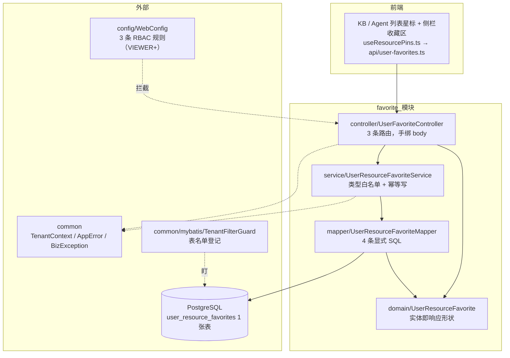
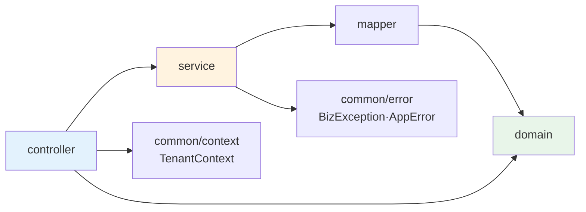
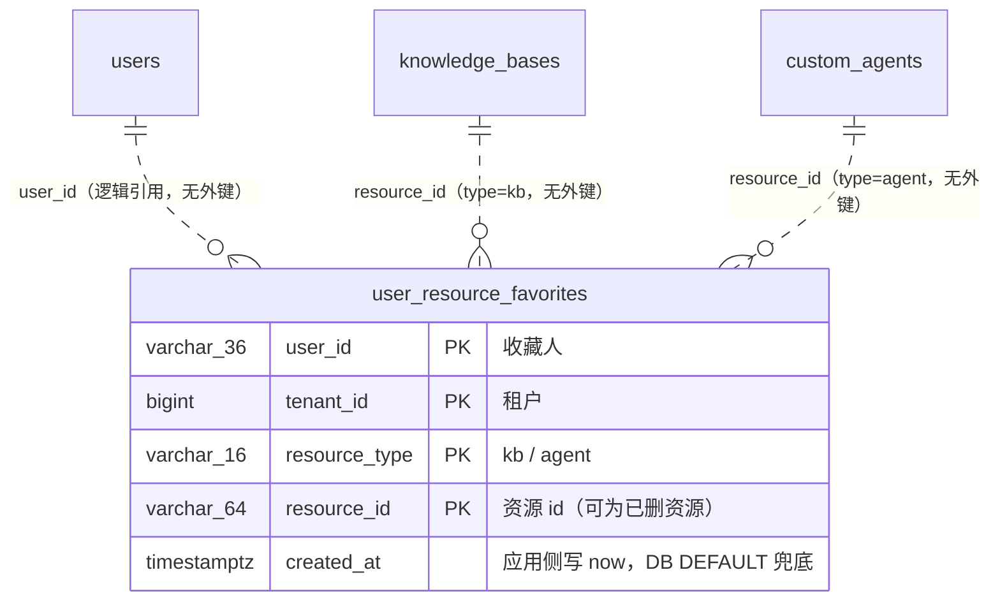
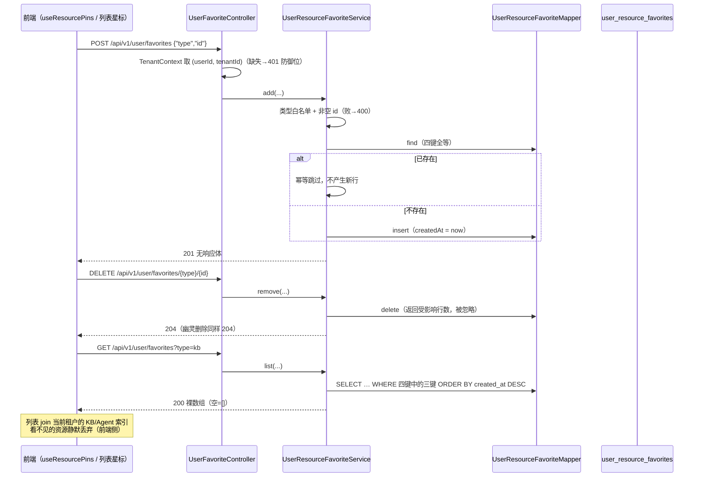

# favorite 模块手册

> **面向读者**：第一次接手 `com.ragagent.favorite` 的架构师 / 高级开发者。
> **目标**：15 分钟建立全局观 → 能定位改动点 → 能安全迭代（本模块有 5 个后端用例 + 15 个 golden 契约钉底，改错会立刻红）。
> **数据口径**：2026-10-08 实测（`wc -l` 口径）：**5 个 java 文件 / 319 行 / 4 个二级子包（每包恰好 1 个文件）——全仓最小业务域**。
> **本文档的地位**：模块级导览；仓库级作业规范见仓库根 `HANDOFF.md`（§12 结构地图、§13 踩坑清单、§14 逐包重构范式）。

---

## 0. 一分钟速览

**它是什么**：用户对资源的**收藏闭环**——收藏 / 取消收藏 / 列表回读，覆盖两类资源（KB、Agent）。整个域就是 1 个 controller + 1 个 service + 1 张表 + 1 个 mapper，无异步任务、无状态机、无审计、无跨聚合副作用（service javadoc 原话："收藏是非业务动作，刻意保持薄"）。

**它不是什么**（别在这里改）：

| 不负责 | 归属 |
|---|---|
| KB 列表**置顶**（排序语义） | `knowledge` 域的 `user_kb_pins` 表 + `PUT /api/v1/knowledge-bases/{id}/pin`——收藏≠置顶，两个独立面 |
| 资源本体、可见性与权限 | `knowledge` / `agent` 域；收藏表**无外键**，读侧对看不见的资源静默丢弃 |
| 操作审计 | 刻意不进审计（service javadoc：非业务动作） |
| API key 调用 | 默认拒绝——`config/WebConfig` 的 RBAC 规则未对 API key 声明（controller javadoc） |

### 图 1：模块全景



**三个必须知道的数字**：最大类 117 行（`UserFavoriteController`，一半行数是 javadoc 与绑定/401 防御样板）；全包只有 **3 个 HTTP 端点**；整张表**复合主键、无外键、无 jsonb**——因此没有 dto 层、没有 BaseMapper、没有 typeHandler。

---

## 1. 目录结构与职责

### 1.1 类型清单（扁平小包，逐文件列）

| 文件 | 行数 | 职责 |
|---|---|---|
| `favorite/package-info.java` | 4 | 域说明："收藏闭环，最小完整域" |
| `controller/UserFavoriteController.java` | 117 | 3 条路由；`@RequestBody String` 手绑 body；401 防御位；错误形态 javadoc |
| `service/UserResourceFavoriteService.java` | 75 | 输入校验（类型白名单 + 非空 id）+ 先查后插的幂等写入 |
| `domain/UserResourceFavorite.java` | 76 | 实体；可收藏类型白名单常量与判定；javadoc 记录"无外键是刻意的" |
| `mapper/UserResourceFavoriteMapper.java` | 47 | 4 条注解 SQL：`list` / `find` / `insert` / `delete` |

**为什么是扁平结构、没有 dto/repository 子包**：每层恰好 1 个文件、无天然族（`backend-package-map.md` P1 判据："无天然族就不拆，别为扁平而扁平"）；响应直接用域实体（无独立响应形状），请求体是 controller 内的**私有 record**（单字段对 `type`/`id`），仓储仅 4 条 SQL 无需门面层。这是全仓刻意保留的"最小完整域"样例。

### 1.2 依赖方向（只允许向下）



- **被谁消费：零**。全仓没有任何其他 java 包 import 本域（实测 grep；`HANDOFF.md` §6.2 原话："`favorite`：**零外部引用**，随时可纯删"）。唯一消费方是前端：`frontend/src/api/user-favorites.ts`（32 行）→ `useResourcePins.ts`（259 行）→ KB / Agent 列表页与 `ListSpaceSidebar.vue`。
- **本域 import 谁**：仅 `common`（`TenantContext` / `AppError` / `BizException`）。安全接线在域外：`config/WebConfig` 注册 3 条 RBAC 规则，`common/mybatis/TenantFilterGuard` 的 `TENANT_TABLES` 名单含 `user_resource_favorites`。
- 测试侧依赖：`auth`（种子数据：Tenant / User / TenantMember）、`TestSchema`、`support.ContractJson`（语义比较器）。

---

## 2. 数据模型

### 2.1 ER 图（1 张表）



DDL 在 `migrations/versioned/V1__baseline.sql`（第 1395 行起），主键约束 `user_resource_favorites_pkey` 为四列复合。

**两条硬语义（都写在 domain javadoc，接手必读）**：

1. **复合主键、无外键是刻意的**：收藏在分享撤销、软删→硬删窗口内依然保留；主键 `(user_id, tenant_id, resource_type, resource_id)` 天然幂等。别"顺手"加外键——会破坏该语义。
2. **读侧静默丢弃**：行指向的资源若当前看不见（已删/无权限），前端列表 join 时静默丢弃，后端不做清理也不报错。

### 2.3 状态枚举

**不适用**——本域没有状态列、没有状态机、没有 jsonb。唯一的"枚举"是资源类型白名单：

| 白名单 | 取值 | 定义处 |
|---|---|---|
| 可收藏类型 | `kb` / `agent` | `UserResourceFavorite.RESOURCE_TYPE_*` 常量 + `isValidResourceType()`；三个端点共用，未命中 → 400 `"invalid favorite resource type"` |

---

## 3. HTTP 接口面

### 3.1 端点分组（1 个 controller / 3 个端点）

`UserFavoriteController`（无类级 `@RequestMapping`，路径全字面写在方法上）：

| 方法 | 路径 | 用途 | 成功形态 |
|---|---|---|---|
| GET | `/api/v1/user/favorites?type=kb\|agent` | 某类收藏列表，`created_at DESC` | 200 **裸数组**（空 = `[]` 非 null） |
| POST | `/api/v1/user/favorites` | 添加收藏，body `{"type":"kb","id":"…"}` | **201 无响应体**（重复 add 幂等，同样 201） |
| DELETE | `/api/v1/user/favorites/{type}/{id}` | 取消收藏 | **204**（**幽灵删除也是 204**） |

**授权模型**（WebConfig 第 509–511 行）：三条规则均 `TenantRole.VIEWER`、`orSystemAdmin=false`；收藏属于"**做收藏动作的人**"而非资源创建者，不走 OwnedXOrAdmin；API key 未声明 → 默认拒绝。handler 内从 `TenantContext` 推导 `(user_id, tenant_id)`，没有"看别人收藏"的路径；两个 401 分支（"user ID not found" / "workspace ID not found"）是防御位，中间件完备时**不可达**。

### 3.2 契约约定（改接口前必读，本域实际核实）

| 约定 | 本域实际 |
|---|---|
| 信封 | **无** `{data,success}` 信封：列表裸数组、写操作无体（`ed83cac4` 换锚定稿；旧 Go 信封形态已被 B48 清洗） |
| 错误 | `AppError` 形状 `{error:{code,message,details}}`；三文案钉死：`invalid request body`（解码措辞进 details）/ `invalid favorite resource type` / `favorite resource id is required` |
| 请求体绑定 | **特例**：`@RequestBody String rawBody` + controller 自持 `ObjectMapper`（`FAIL_ON_UNKNOWN_PROPERTIES` 关闭）——为钉住 Go 时代 binding 文案（EOF / invalid character…进 details）。全仓新代码规范是 `@Valid` DTO，本域是登记过的历史兼容面，**别推广** |
| 字段名 | 响应 = Java 字段名 camelCase（`userId/tenantId/resourceType/resourceId/createdAt`，时间 ISO-8601 带时区）；请求键为小写单词 `type`/`id`（无 camel/snake 之分） |
| 空值 | 实体无 `@JsonInclude`，字段恒输出 |

---

## 4. 核心链路（收藏 / 取消收藏 / 回读）



- **幂等语义被 golden 钉死**：重复 add 不产生新行（仍 201）、删不存在的行不报错（仍 204）——别"顺手"改成 409/404。
- **所有 SQL 都带 `tenant_id` 谓词**：`user_resource_favorites` 在 `TenantFilterGuard.TENANT_TABLES` 名单内，本域 4 条语句**不在**执行期白名单——新增查询必须带 `tenant_id`，否则 enforce 档（`WEKNORA_TENANT_FILTER_GUARD`）下执行期即红（HANDOFF B71）。
- **切换租户自动换面**：收藏按 `(user, tenant)` 隔离，前端 `useResourcePins` 有租户变更 watcher（composable 头注释）。

---

## 5. 改哪里（场景 → 文件）

| 我想… | 主要改这里 | 别忘了 |
|---|---|---|
| 加可收藏类型（如 `wiki`） | `domain/UserResourceFavorite` 加常量 + `isValidResourceType` | 前端 `FavoriteResourceType` 同批；400 文案不变则 golden 不用动，但建议补一条该类型的 add/list 用例 |
| 改列表排序 / 过滤 | `mapper` 的 `list` SQL | `created_at DESC` 是前端"新建在前"的依赖 |
| 改错误文案 / 状态码 | `service` 两个 `require*` + `controller.invalidBody` | 文案与状态码被 `fav-*.json` **逐字节**钉住——改动 = 同批重录 golden + 前端错误处理同步 |
| 改响应形状 | `domain/UserResourceFavorite`（实体即响应，无 dto 层） | 前端 `api/user-favorites.ts` + golden 同批；created_at 掩码靠 `TS_PATTERN`，键改名要同步放宽正则（HANDOFF §13.13） |
| 加端点 | `controller` 加方法 + `service` 加用例 + `WebConfig` 加 `addRule` | 拦截器 pattern `/api/v1/user/favorites/**` 已覆盖前缀，但**无规则 = 放行**（WebConfig W5a 注释），新路由必须显式 addRule |
| 加列 / 动表结构 | `V1__baseline.sql` + `TestSchema.createTables`（两处同改） | domain 实体 + mapper SQL；本域无 jsonb，不需要 typeHandler / `autoResultMap` |
| 改幂等语义 | `service.add/remove` | 先想清楚前端 `useResourcePins` 的乐观更新是否依赖"永不失败" |
| 整域裁剪 | 删 `favorite/` 主+测 + `contracts/fav-*.json` ×15 + 录制脚本 + 前端 `api/user-favorites.ts` / `useResourcePins.ts` / 两列表页星标 / 侧栏 | **零外部 java 引用**（HANDOFF §6.2），可纯删；但它目前是"待排期可选项"，先确认决策再动手 |

---

## 6. 常见迭代 SOP

> 铁律：**一次只动一个轴**；每步结束**全绿**再走下一步（哪怕只是移动文件）。

```bash
# 每次改动后必跑（全量约 3 分钟；本域也可先单独跑：--tests "com.ragagent.favorite.*"）
cd ~/ragagent && JAVA_HOME=/opt/homebrew/opt/openjdk@21/libexec/openjdk.jdk/Contents/Home \
  ./gradlew :server:test :server:spotlessCheck
# 若动了前端可见契约（字段名/状态码/信封），同批带前端：
cd frontend && npx vue-tsc --build --force && npm test
```

**A. 改契约（响应形状 / 状态码 / 文案）**：先改代码 → 手工同步 `contracts/fav-*.json`（本测试**未接** §13.12 的 `-Dcontract.refresh=true` 开关，那目前只在 `EmbedContractTest`）→ 全量绿 → 前端 `user-favorites.ts` 同批 → 提交。需要真机重录时用 `scripts/record-fav-cprev-golden.sh`（要起服，且**场景顺序敏感**，见 §8）。

**B. 加可收藏类型**：`domain` 白名单 → 前端类型联合 → 全量绿。不改 400 文案则 golden 零改动。

**C. 动表结构**：baseline SQL + `TestSchema` → `domain` / `mapper` → 全量绿。禁用 wrapper 更新本表（mapper 是纯 SQL，没有 BaseMapper 可用）。

---

## 7. 模块约定与坑（必读）

1. **幂等语义是契约，不是偷懒**：重复 add → 201、幽灵删除 → 204，都被 golden 钉死（`fav-add-dup` 场景 / `fav-remove-ghost`）。改成 404/409 属破坏性变更，要带前端同批。
2. **错误文案逐字节进 golden**：`invalid favorite resource type` / `favorite resource id is required` / `invalid request body`（解码措辞进 details）。改文案 = 重录 golden；HANDOFF §14.9s 全局错误体批（去 `success:false`）已把本域金片重录过一轮。
3. **无外键是刻意的**（domain javadoc）：收藏在分享撤销、软删→硬删窗口内保留。加外键/加清理任务都会破坏该语义。
4. **复合主键 → 纯 SQL mapper**：MyBatis-Plus `@TableId` 只支持单列，四条查询全部显式 `@Select/@Insert/@Delete`（mapper javadoc）。别"升级"成 BaseMapper。
5. **手绑 rawBody 是登记过的历史特例**：controller 自持 ObjectMapper 钉 Go 时代 binding 文案。新端点不要模仿；若未来全仓统一到 `@Valid`，本域 golden 的 `fav-add-bad-body/empty-body` 两条要同批重录。
6. **测试类 javadoc 的计数漂了**：类注释写"21 条 fav-*.json"，换锚批 `ed83cac4` 删掉 5 个无体金片后，盘上实测 **15 个**——以实测为准（顺手修注释即可）。
7. **本域无登记的独有架构坑**；改动遵循仓库通用规约：HANDOFF §3 两条红线、§13 落刀方法论（正向证据 / 忠实性 / 卫生闸门）、契约口径见 `docs/knowledge-module-guide.md` §3.2（全仓统一：无信封、204 删除、错误 `{error:{code,message,details}}`）。
8. **租户谓词红线**：`user_resource_favorites` 在 `TenantFilterGuard.TENANT_TABLES`（B71 enforce 档），本域 SQL 全带 `tenant_id`、不在语句白名单——新增查询漏谓词会在执行期直接红。

---

## 8. 测试与验证

- **规模**：1 个测试类 `FavoriteContractTest`（251 行）/ **5 个 `@Test`**（`emptyListThenNoType` / `addThenList` / `removeRealAndGhost` / `badRequestFamily` / `authFamily`）；golden 前缀 **`fav-`**，盘上 **15 个**（`server/src/test/resources/contracts/fav-*.json`）。录制脚本 `scripts/record-fav-cprev-golden.sh` 共 20 条请求，其中 5 条（add/remove 成功）无响应体，测试里只钉状态码 + 空体、不落盘。
- **场景顺序有状态依赖**：空列表 → add ×2 + 重复 add → 列表回读 → remove 真实行 + 幽灵行 → 列表回读 → 400 家族 → 401 家族。改用例时**严格保持该序**，别拆成乱序独立用例。
- **种子与对齐**：H2（`TestSchema`）镜像录制身份——租户 `10002` + owner `11111111-…-5501`（`java-phase1@weknora.test` / `Passw0rd!`）；表无外键，`resource_id` 用固定假 id（`fav-kb-fixed-0001` 等），两侧行集可逐字节对齐。唯一动态值 `created_at` 用 `TS_PATTERN` 两侧同掩码。
- **比较口径**：`ContractJson.semantic` 语义比较（键序/转义归一），fixture 锚定**本仓自己的行为**，与 Go 无关。
- **已知偶发 2 例**（全仓性，与本域代码无关，遇到先单独重跑，别误判回归）：
  - `WebToolsRecordingTest.searchWithContentFetchesLeadingPagesViaSharedFetchTool`（全量并发下偶发）
  - `EvaluationContractTest.getTerminalRunsExecution`（全量并发下偶发；单独 `--tests "*EvaluationContractTest"` 通过）
- **改前端可见契约时**：后端与前端**同批**改完再提交（前端面 = `api/user-favorites.ts` + `useResourcePins.ts` + 两个列表页）。

---

## 9. 已知待办与风险

| 项 | 性质 | 建议 |
|---|---|---|
| 整域在裁剪候选清单上（HANDOFF §2 第 5 条 / §6.2："零外部引用，随时可纯删"，待排期可选项） | 产品决策 | 接手后**先确认域存废再投入重构**；裁剪时按 §5 末行清单整体带走 |
| 手绑 rawBody + Go 措辞 binding 文案 | 历史兼容面 | 保持冻结；若全仓统一 `@Valid` 绑定，需同批重录 2 条 binding golden + 前端错误处理 |
| 实体即响应（无 dto 层） | 结构现状 | 域足够小，**维持现状**；若未来响应要与写入形状分叉，再按 knowledge 范式补 dto |
| `created_at` 双写入口（应用侧 now + DB DEFAULT 兜底） | 一致性 | 现状两处语义一致；改时区/时钟策略时两处一起看 |
| 测试 javadoc "21 条" 与盘上 15 个不符 | 文档债 | 顺手修正（§7 第 6 条） |

---

## 10. 速查：本模块的"地标"

| 想知道 | 看这里 |
|---|---|
| 请求怎么走 | `UserFavoriteController` → `UserResourceFavoriteService` → `UserResourceFavoriteMapper`（各 1 个，无分支） |
| 表长什么样 / 为什么无外键 | `domain/UserResourceFavorite` javadoc + `V1__baseline.sql`（复合主键四列） |
| 幂等与幽灵删除语义 | `service.add/remove` + `fav-remove-ghost` 场景（§4） |
| 错误文案在哪定义 | `service` 两个 `require*` + `controller.invalidBody`（golden 逐字节钉住） |
| 权限规则在哪 | `config/WebConfig` 第 509–511 行（VIEWER+，API key 默认拒绝） |
| 租户谓词守卫 | `common/mybatis/TenantFilterGuard.TENANT_TABLES`（§7 第 8 条） |
| golden 怎么来的 | `scripts/record-fav-cprev-golden.sh`（场景顺序 = 用例顺序） |
| 前端谁在用 | `frontend/src/api/user-favorites.ts` → `composables/useResourcePins.ts` → KB/Agent 列表页 + `ListSpaceSidebar.vue` |
| 为什么这么小还值得一份手册 | 它是全仓"最小完整域"样例——六件套的最小闭合形态；也是裁剪候选，动它之前先读 §9 第一行 |
