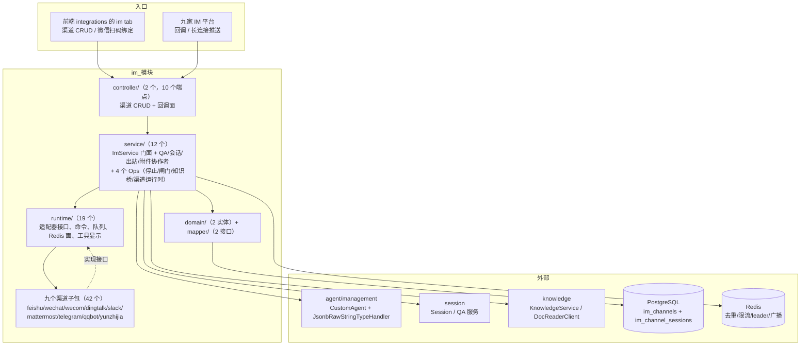
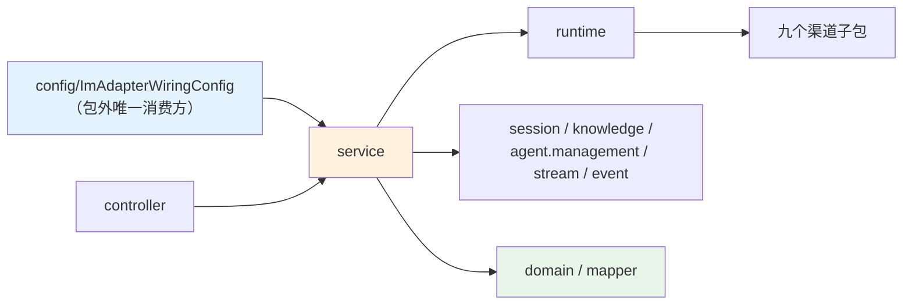
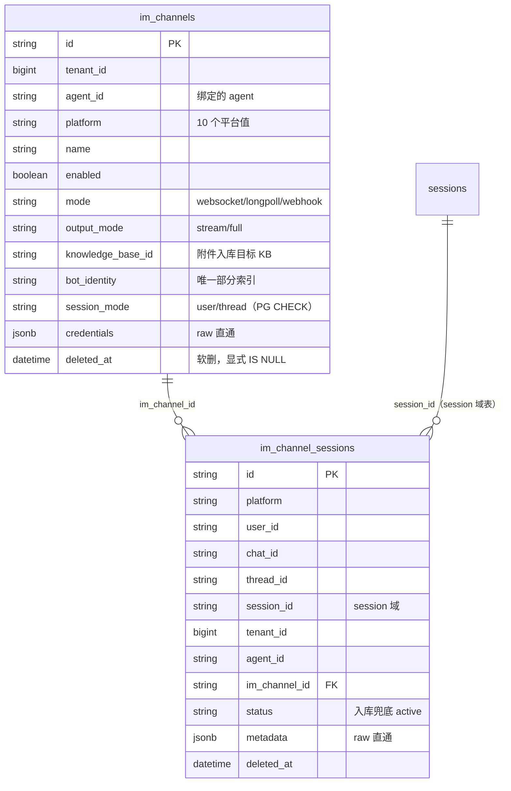
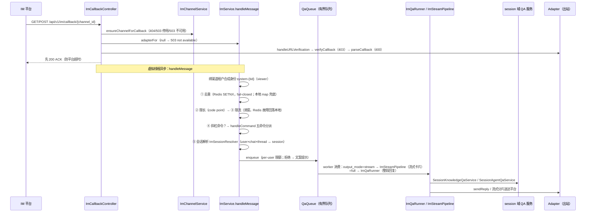
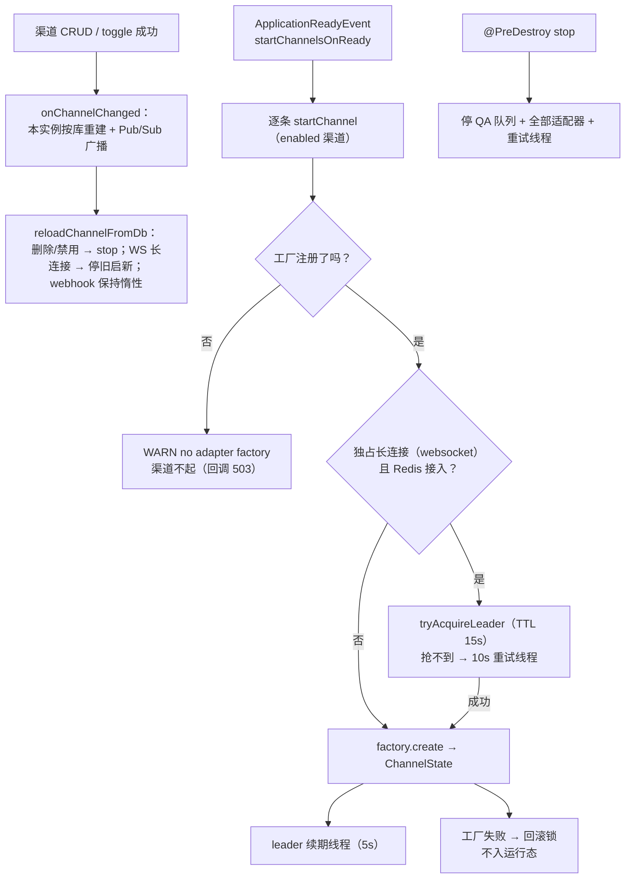
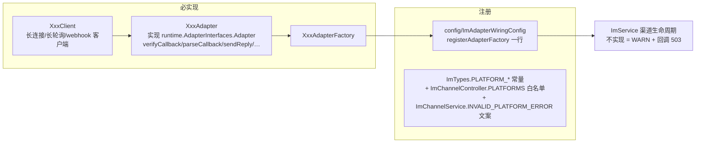

# im 模块手册

> **面向读者**：第一次接手 `com.ragagent.im` 的架构师 / 高级开发者。
> **目标**：30 分钟建立全局观 → 能定位改动点 → 能安全迭代（本模块有 145 个后端用例 + 30 个契约 fixture 兜底，改错会立刻红）。
> **数据口径**：2026-10-08 实测（`wc -l` 口径）：**76 个 java 文件 / 约 1.74 万行（17,352）/ 14 个子包**（+ 根 1 个 package-info）。
> **本文档的地位**：模块级导览；仓库级作业规范见仓库根 `HANDOFF.md`（§12 结构地图、§13 踩坑清单、§14 逐包重构范式）。

---

## 0. 一分钟速览

**它是什么**：即时通讯渠道域——把九家 IM 平台接进 WeKnora，让外部用户在飞书 / 企业微信 / 钉钉 / Slack / Telegram……里直接和 agent 对话。

- 渠道管理面：渠道 CRUD（绑 agent、绑知识库、凭据 jsonb）+ 微信扫码绑定状态面，喂前端 integrations 设置的 `im` tab
- 九渠道适配：入站（HTTP 回调 / WS 长连接 / 长轮询 / webhook）统一解析成 `IncomingMessage`，出站按平台协议回文本或流式卡片；**一渠道一子包**，飞书与 Lark 是同一实现的两朵云（`FeishuRegion`）
- 运行时底座（`runtime/`）：会话映射（`im_channel_sessions`）、五个斜杠命令、去重与限流、有界 QA 队列、跨实例 /stop、附件下载入库
- 回调面：`GET|POST /api/v1/im/callback/{channel_id}`——**注册在 Auth 之前、无 JWT**，鉴权靠各平台自己的验签

**它不是什么**（别在这里改）：

| 不负责 | 归属 |
|---|---|
| 会话 / 消息存储与 QA 编排本体 | `session`（本模块只做渠道↔会话映射，问答调 `SessionKnowledgeQaService` / `SessionAgentQaService`） |
| agent 定义与配置 | `agent/management`（渠道绑定的 `CustomAgent` 由 `CustomAgentService` 提供；jsonb typeHandler 也借住在那边，见 §2.2） |
| 知识库与检索 | `knowledge`（附件异步入库经 `KnowledgeService`，附件解析经 `DocReaderClient`） |
| 适配器工厂装配 | `config/ImAdapterWiringConfig`（**本模块唯一的包外消费方**，1 个文件） |
| SSE 流基础设施 | `stream`（跨实例 /stop 把取消事件写进 `StreamManager`） |

### 图 1：模块全景



**三个必须知道的数字**：最大类 `ImService` **554 行**（B123~B127 四刀 **1,091→554 已出榜**：停止链路 / 入口闸门 / 知识桥 / 渠道运行时四个 Ops 外提；"10-06/07 回涨到 1,086、全仓最大"的记录与 §6-E 的复切建议均已由这四刀结清）；`runtime/` 19 文件 3,645 行（占本模块 21%，九渠道共享的底座）；包外消费方**只有 1 个文件**（`config/ImAdapterWiringConfig`，注册 10 个平台工厂）。

---

## 1. 目录结构与职责

### 1.1 子包清单（一渠道一子包）

| 子包 | 文件/行数 | 放什么 | **不放什么** |
|---|---|---|---|
| `controller/` | 2 / 643 | `ImChannelController`（CRUD + 微信扫码）、`ImCallbackController`（回调面） | 业务逻辑、平台协议细节（→ 各渠道子包） |
| `service/` | 12 / 2,961 | 门面 `ImService` + 6 个协作者（QA 请求底座 / 会话解析 / 出站整形 / 流式管线 / QA 执行 / 附件）+ **4 个 Ops**（`ImStopOps` 停止链路 / `ImInboundGuardOps` 入口闸门 / `ImKnowledgeBridgeOps` 知识桥 / `ImChannelRuntimeOps` 渠道运行时；B123~B127 逐刀外提）+ `ImChannelService`（CRUD 钩子） | 平台协议、队列与 Redis 实现（→ `runtime/`） |
| `runtime/` | 19 / 3,645 | 渠道无关底座：`AdapterInterfaces`（Adapter/StreamSender/FileDownloader）、`IncomingMessage`/`ReplyMessage`、`Commands`+`ImCommandSet`（斜杠命令）、`QaQueue`+`ImRedisStore`+`ImRedisKeys`、`ImSupervisor`（长连接守护）、`ToolDisplay`/`ThinkDisplay`/`StreamSection`（工具显示，字节契约见 §8）、`FeishuWecomCrypt`/`ImAdapterVerify`（验签）、`CallbackExchange`（servlet 窄抽象） | 某渠道专有逻辑（→ 该渠道子包） |
| `feishu/` | 10 / 2,210 | 门面 `FeishuAdapter` 331 + 4 协作者（Callback/Send/CardStream/Media Ops）+ `FeishuLongConnClient` + `FeishuRegion`（feishu/lark 两朵云）+ `LarkEventConverter`/`LarkFrame` | — |
| `wecom/` | 5 / 1,615 | **两个适配器**（`WecomWSAdapter` 长连接 + `WecomWebhookAdapter` 回调）+ `WecomLongConnClient` + `WecomSupport` | — |
| `yunzhijia/` | 6 / 1,498 | 适配器 + 长连接客户端 + `YunzhijiaSign`/`YunzhijiaUrl` + `YunzhijiaTypes`（**第三方线格式冻结面**，见 §7） | — |
| `dingtalk/` | 3 / 1,303 | `DingtalkAdapter` 756 + `DingtalkStreamClient` | — |
| `wechat/` | 5 / 896 | `WechatAdapter`（iLink 长轮询）+ `WechatLongPollClient` + `WechatCrypto` + `WechatQRCodeService`（**接缝**，见 §3.2） | — |
| `qqbot/` | 4 / 748 | `QqBotAdapter` + `QqBotClient` + `QqBotGatewayClient` | — |
| `mattermost/` | 3 / 627 | `MattermostAdapter` + `MattermostClient` | — |
| `telegram/` | 3 / 587 | `TelegramAdapter` + `TelegramLongPollingClient` | — |
| `slack/` | 3 / 520 | `SlackAdapter` + `SlackSocketModeClient` | — |
| `domain/` | 2 / 181 | `ImChannelEntity`、`ChannelSessionEntity`（都带 `autoResultMap`） | 请求/响应形状（控制器内联 record） |
| `mapper/` | 2 / 173 | `ImChannelMapper`、`ChannelSessionMapper`（显式 SQL + jsonb typeHandler 三参写法） | 业务判断 |

九个渠道子包合计 **42 文件 / 10,004 行**（约 58%）；`service/` + `runtime/` 合计 6,346 行（约 37%）。

### 1.2 依赖方向（只允许向下）



**消费关系（实测 2026-10-08）**：

| 方向 | 数据 | 说明 |
|---|---|---|
| 谁消费 im | **1 个文件**：`config/ImAdapterWiringConfig` | 注册 10 个平台工厂（telegram/slack/qqbot/wecom/feishu/lark/dingtalk/wechat/mattermost/yunzhijia）+ 延迟注入 `StreamManager`；**未注册的平台 `startChannel` 只打 WARN，渠道保持未启动，绝不静默假装成功**（该类 javadoc 原文） |
| im 消费谁（import 条数） | common 29 / session 17 / agent 9 / event 5 / knowledge 4 / stream 3 | session 的消费集中在 `service/` 的 **6 个文件**（ImService、ImQaRunner、ImQaRequests、ImSessionResolver、ImStreamPipeline、ImAttachmentPreparer）；agent 的 9 条里有 2 条是 domain 实体借 `JsonbRawStringTypeHandler`（§2.2） |

**门面是本模块的枢纽**：`ImService` 保留消息入口、命令执行、附件入口与装配面，9 个协作者经包内可见字段回引门面（§14.7.4 拆分先例）。**B123~B127 四刀后的分工**：`ImStopOps` 跨实例 /stop 全链路、`ImInboundGuardOps` 去重与限流、`ImKnowledgeBridgeOps` 知识库接面（命令 KB/检索 + 附件入库）、`ImChannelRuntimeOps` 渠道生命周期 + 选主 + 配置广播。**注意**：`ImChannelRuntimeOps` 里的 `startChannelsOnReady`（重启后按库启动全部渠道）**全仓无调用者**——疑似未接线，登记在案（详见 HANDOFF B127）；`ImKnowledgeBridgeOps` 的 KB/检索两桩同理。

---

## 2. 数据模型

### 2.1 ER 图（2 张表）



- 会话映射的粒度由渠道的 `session_mode` 决定：`user`（默认）= user×chat 一条映射；`thread` = 再加 thread 维度。会话被删时 `runHandleMessage` 会软删陈旧映射并重解析。
- 软删都是**显式 `deleted_at IS NULL`**（不用 `@TableLogic`）；唯一索引 `idx_im_channels_bot_identity` 是部分索引（`deleted_at IS NULL AND bot_identity != ''`），应用层靠 `checkDuplicateBot` 先查落 409（两处口径都在 `ImChannelEntity` javadoc 备案）。

### 2.2 jsonb 列与值类型对照

| 列 | 值类型 | 说明 |
|---|---|---|
| `im_channels.credentials` | **无值类型，String raw 直通**（`JsonbRawStringTypeHandler`） | 落库保留请求原文键序；列表行永不出凭据，只出 `credentialsConfigured`（非空且非 `"{}"`） |
| `im_channel_sessions.metadata` | 同上 | raw 直通 |

**硬约定（本模块特有，和 knowledge 的"值类型 round-trip"不是一套）**：

1. 两个实体的 jsonb 字段都写 `@TableField(typeHandler = JsonbRawStringTypeHandler.class)` **且** `@TableName(autoResultMap = true)`——但这个 typeHandler **借住在 `agent/management/mapper/`**（domain 实体跨包 import 它，`mapper/` 里的显式 SQL 用全限定名引用）。它是"字符串原样进出 PG"的透传 handler，不是 knowledge 那种逐字段绑定值类型。
2. `ImChannelMapper` / `ChannelSessionMapper` 的 upsert SQL 里 jsonb 列用三参写法 `#{e.credentials,typeHandler=...}`——wrapper 的 `set()` 不会套 typeHandler（与全仓口径一致）。
3. credentials 列语义（`ImChannelController.credentialsColumn` javadoc）：显式 `null` 与缺键等价于"无值"——**create 落 `"{}"`，update 视为"不改动"**。改绑定语义前先读这段。

### 2.3 状态枚举（全是 `ImTypes` 字符串常量，**没有 Java enum**）

| 值域 | 取值 | 用在哪 |
|---|---|---|
| `platform` | `wecom` / `feishu` / `lark` / `slack` / `telegram` / `dingtalk` / `mattermost` / `wechat` / `qqbot` / `yunzhijia`（10 值） | `im_channels.platform`；**feishu 与 lark 是同一实现两朵云**（`FeishuRegion.FEISHU/LARK` 各注册一个工厂）；控制器还有一份同值白名单 `PLATFORMS` |
| `mode`（接入方式） | `websocket`（缺省）/ `longpoll`（wechat 缺省）/ `webhook`（mattermost、yunzhijia 缺省） | `im_channels.mode`；缺省值在控制器与 `ImChannelService.beforeCreate` **两处各写一遍**，改缺省要同改 |
| `output_mode` | `stream`（缺省）/ `full` | 回复走流式卡片（`ImStreamPipeline`）还是整段（`ImQaRunner`） |
| `session_mode` | `user`（缺省）/ `thread` | PG CHECK 约束兜底；非法值 → 创建失败 500 "failed to create channel" |
| `status`（渠道会话） | `active`（入库兜底） | `im_channel_sessions.status` |
| `message_type` | `text` / `file` / `image` | `IncomingMessage.messageType` |
| `chat_type` | `direct` / `group` | `IncomingMessage` |

---

## 3. HTTP 接口面

### 3.1 端点分组（2 个 controller / 10 个端点）

**渠道 CRUD + 扫码**（`ImChannelController`，8 个）

| 方法 | 路径 | 用途 |
|---|---|---|
| POST | `/api/v1/agents/{id}/im-channels` | 创建（201 + 裸资源行；platform 必填且须在白名单） |
| GET | `/api/v1/agents/{id}/im-channels` | per-agent 列表（裸数组；**凭据不出行**，出 `credentialsConfigured`） |
| GET | `/api/v1/im-channels` | 跨 agent 总览（裸数组；行带 `agentName`） |
| PUT | `/api/v1/im-channels/{id}` | 更新（不存在 → 404；换绑 agent 失败 → 400） |
| DELETE | `/api/v1/im-channels/{id}` | 删除（**任何失败都落 500** "failed to delete channel"，不存在的渠道也是 500；成功 204 无体） |
| POST | `/api/v1/im-channels/{id}/toggle` | 切换启用（不存在 → 404） |
| POST | `/api/v1/wechat/qrcode` | 微信扫码出站（**接缝**，见 §3.2） |
| POST | `/api/v1/wechat/qrcode/status` | 扫码轮询绑定（qrcode 必填 → 400；confirmed 时才返回 credentials + baseUrl） |

**平台回调**（`ImCallbackController`，2 个）

| 方法 | 路径 | 用途 |
|---|---|---|
| GET / POST | `/api/v1/im/callback/{channel_id}` | 全部九平台的统一回调入口（URL 验证、验签、解析、ACK 后虚拟线程异步处理） |

回调错误族（`ImCallbackController` javadoc 钉死）：渠道缺失 **404** "channel not found" → 停用 **503** "channel is disabled" → 适配器不可用 **503** "channel not available" → 验签失败 **403** "verification failed" → 解析失败 **400** "parse failed"；非消息事件与正常消息都先 **200 ACK**（`{"success":true}`，yunzhijia 特例多一层 `{"success":true,"data":{"type":2,"content":""}}`）。

### 3.2 契约约定（改接口前必读）

| 约定 | 说明 |
|---|---|
| 信封 | 成功 = **裸资源行 / 裸数组**（`imc-*` 金片为准）；错误 = **`{"error":"<固定文案>"}` 字符串形态**——**不是** knowledge 域的 `AppError {error:{code,message,details}}`，也不是标准 `{data,success}` 信封 |
| 响应行 | 控制器手搓 `LinkedHashMap`，**三套键序并存**（资源行 / per-agent 摘要行 / 总览行各自一份，`ImChannelController` javadoc 明示）；`deletedAt` 恒输出 `null` |
| ⚠️ 过时 javadoc | `ImChannelController` 类头注释仍写 "信封 `{"data":…}`、删除 `{"success":true}`"——**已过时**（§14.9s 七域批换锚后代码与金片都是裸行 + 204）。以 `imc-*` fixture 为准，别照着类头注释"恢复"信封 |
| 鉴权 | 回调路由**注册在 Auth 之前**：`AuthFilter` L112 对 `/api/v1/im/callback/` 前缀整体让路，`WebConfig` L628 注明"刻意不在 RBAC 清单"；鉴权 = 各平台自己的验签 |
| 微信接缝 | `POST /wechat/qrcode` 的 iLink 真出站**本仓不实现**：`WechatQRCodeService` 是 `@Autowired(required=false)` 可缺席 bean，缺席时 500 固定文案 "wechat iLink integration is not wired"；测试用包内 setter 注入 fake |
| 冻结面 | `yunzhijia/YunzhijiaTypes` 的 `@JsonInclude(NON_EMPTY)` 是**云之家对端 API 契约**（B3 恒输出批曾误列真面，`YunzhijiaAdapterTest` 抓回，HANDOFF §14.6 登记"IM 第三方口径"）——别"顺手"改恒输出 |

---

## 4. 核心链路

### 4.1 一条 IM 消息进来（回调 → ACK → QA → 回复）



要点（都在 `ImService` 消息入口段，注释原文口径）：

- **租户上下文**：回调线程无认证上下文 → 绑渠道租户 + `system-<tenantID>` 合成用户 + **viewer 最小权限**；`finally` 里恢复快照。
- **去重是 fail-closed**：Redis 出错宁可丢一条可重发的消息，也不重复跑一轮 LLM（`isDuplicate` javadoc）；未接 Redis 时回落进程内 map（>10,000 条按 TTL 清）。
- **命令与 QA 分叉**：`Commands.ParseResult` 命中 → 命令副作用；形似命令但不注册 → "未知指令" 提示。
- **会话失效自愈**：映射指向的 session 被删 → 软删陈旧映射重解析一次，再失败才抛。

### 4.2 渠道生命周期（启动 / 选主 / 广播 / 停机）



- **谁拉起适配器**：websocket 型启动时建立长连接（`ImSupervisor` 周期重建防"僵尸连接"，最坏中断限一个周期）；webhook 型惰性——回调到达时才在 `handleMessage` 里补 `startChannel`；wechat 长轮询同理由客户端拉起。
- **多实例面**（`runtime/QaQueue` + `ImRedisStore` + `ImService` 多实例段）：跨实例 leader 选举（websocket 渠道只许一个实例持连接）、消息去重 SETNX、滑窗限流 ZSET Lua、渠道配置 Pub/Sub 广播、跨实例 /stop（stop 事件写 `StreamManager` + inflight 映射 + 执行前 marker TTL 30s）。**Redis 键字面量是部署面契约，不随版本改名**（`ImRedisKeys` javadoc）。
- **agent 删除联动**：`deleteChannelsByAgent`（CustomAgentService 调用）——软删该 agent 全部渠道并停适配器，"概览列表与运行中的适配器不得比 agent 活得更久"。

### 4.3 渠道接入扩展点（接第 10 家平台时走这里）



---

## 5. 改哪里（场景 → 文件）

| 我想… | 主要改这里 | 别忘了 |
|---|---|---|
| 接一个新渠道（第 10 家） | 新子包 `<platform>/`（Adapter + Client + Factory）+ `config/ImAdapterWiringConfig` 注册 | `ImTypes.PLATFORM_*`、`ImChannelController.PLATFORMS` 白名单、`INVALID_PLATFORM_ERROR` 文案三处同改；§4.3 图 |
| 改某渠道**入站**消息映射 | 该渠道子包的 `parseCallback`（feishu 在 `FeishuCallbackOps` + `LarkEventConverter`） | 平台验签在 `verifyCallback`，字节契约 `w5g3-im-adapter-signatures.tsv` / `w5g3b-im-crypt.tsv` 会红 |
| 改某渠道**出站**发送 | 该渠道子包的 `sendReply`（feishu 在 `FeishuSendOps`） | 失败降级路径（sendWithFallback）同批看 |
| 改流式卡片 / 工具步骤显示 | `feishu/FeishuCardStreamOps` + `runtime/StreamSection` / `ToolDisplay` / `ThinkDisplay` | `ToolDisplay` 是**字节契约**（`w5g1-im-foundation.tsv`），文案与 Web 端 agentStream 对齐 |
| 改会话映射粒度 / 自愈 | `service/ImSessionResolver` + `domain/ChannelSessionEntity` | `session_mode` 校验在 `ImChannelService`，PG CHECK 在 baseline SQL 兜底 |
| 改斜杠命令 | `runtime/Commands`（意图声明）+ `runtime/ImCommandSet`（注册序 help→info→search→stop→clear）+ `ImService.handleCommand`（副作用） | 命令本身不碰 DB/服务（`Commands` javadoc 约定）；`isAgentMode` = `agent_mode == "smart-reasoning"` |
| 改去重 / 限流 / 队列限额 | `service/ImInboundGuardOps`（isDuplicate/rateLimitAllow）+ `runtime/QaQueue` + `ImRedisStore` + `ImRedisKeys` | 故障语义三分：去重 fail-closed、限流回落本地、Redis 异常不阻塞主流程；**键名不随版本改名** |
| 改 QA 编排 | full → `service/ImQaRunner`；stream → `service/ImStreamPipeline` | `output_mode` 在 `ImQaRunner` 判（`"full".equals(...)`）；两支共享 `ImQaRequests` 底座 |
| 改附件下载 / 异步入库 | `service/ImAttachmentPreparer` + `service/ImKnowledgeBridgeOps` 附件异步入库段 | 扩展名白名单 `SUPPORTED_KB_FILE_EXTS`（15 种）在 `ImKnowledgeBridgeOps` 常量区；入库走 `KnowledgeService` |
| 改渠道 CRUD / 校验钩子 | `controller/ImChannelController` + `service/ImChannelService`（beforeCreate/beforeSave/bot_identity） | mode/outputMode/sessionMode 缺省值在控制器与钩子**两处**各一份 |
| 给渠道表加字段 | `domain/` 实体 + `mapper/` 显式 SQL | **schema 两处同改**：`migrations/versioned/V1__baseline.sql` + `server/src/test/java/com/ragagent/TestSchema.java`（否则 H2 报 Column not found） |
| 改长连接守护策略 | `runtime/ImSupervisor` + 各渠道 Client | 周期重建决定"僵尸连接最坏中断时长"，动前看 `ImSupervisor` javadoc |

---

## 6. 常见迭代 SOP

> 铁律（HANDOFF §3 红线）：**一次只动一个轴**；每步结束**全绿**再走下一步。

```bash
# 每次改动后必跑（约 3 分钟）
cd ~/ragagent && JAVA_HOME=/opt/homebrew/opt/openjdk@21/libexec/openjdk.jdk/Contents/Home \
  ./gradlew :server:test :server:spotlessCheck
# 本模块快速回归（每刀内部闸门）
./gradlew :server:test --tests "com.ragagent.im.*"   # 阈值 ≥145
# 若动了前端可见契约（字段名/信封/状态码），同批带前端：
cd frontend && npx vue-tsc --build --force && npm test
```

**A. 接新渠道**：§4.3 图 → 适配器单测（照 `YunzhijiaAdapterTest` 形态）→ 工厂注册 → 平台常量/白名单/文案三处 → `--tests "com.ragagent.im.*"` ≥145 → 全绿 → 提交。

**B. 加渠道字段**：domain 实体 → baseline SQL + `TestSchema` → 控制器响应行（**三套键序**里对应那套）→ `imc-*` 金片重录 → 全绿。凭据类字段只进资源行，**列表行永远只出 `credentialsConfigured`**。

**C. 改消息管线（去重/限流/命令/会话）**：`ImInboundGuardOps`（去重/限流）+ `ImService`（消息入口与命令）→ 语义三分的故障路径各补一条用例（Redis 在/不在）→ `ImPipelineTest` 三场景绿 → 全绿。

**D. 动 Redis 面**：`ImRedisKeys` 键名**不改名**（部署面契约）；新增键先在 javadoc 登记用途；故障分支写"跳过全局检查"语义并配用例（`ImRedisStoreTest` 形态）。

**E. `ImService` 已切完（B123~B127 四刀，1,091→554，出榜）**：刀序与簇边界（可直接复用到别的大类）——①**停止链路**（`ImStopOps`；与门面共享 `inflight` 表 ⇒ 传引用 + 留薄转发）→ ②**入口闸门**（`ImInboundGuardOps`；两张回落表本簇独占 ⇒ **随迁**、无需转发）→ ③**知识桥**（`ImKnowledgeBridgeOps`；顺带删掉与 `ImFormat` 重复的 `imPlatformToChannel`）→ ④**渠道运行时**（`ImChannelRuntimeOps`；整块 313 行连续，唯一出向依赖是消息回调 ⇒ 注入 `BiConsumer`）。四刀共同纪律：字段尽量**随迁**（能搬就搬）、必须共享的**传引用**、外部调用方**留同名薄转发**、每刀脚本化**逐字保真核对**（§13.5）。

---

## 7. 模块约定与坑（必读）

1. **本模块 HTTP 契约不是 knowledge 标准**：成功裸行，错误是 `{"error":"<固定英文文案>"}` 字符串——没有 `AppError {code,message,details}` 结构（`ImCallbackController`/`ImChannelController` 实现 + `imc-*` 金片为准）。别按 §2-4 标准"顺手统一"，那是契约变更，要同 PR 带前端 + 金片重录。
2. **`ImChannelController` 类头 javadoc 已过时**（还写着 `{"data":…}` 信封与删除 `{"success":true}`；现行为：裸行 + 删除 204，`ImContractTest` L143-144 钉死）。**过时注释与代码冲突时以代码 + 金片为准**，顺手修注释。
3. **删除渠道的错误码是 500 不是 404**：任何失败（含渠道不存在）都落 500 "failed to delete channel"；金片名 `imc-delete-404.json` 是历史名，钉的状态码是 500。别"修"成 404——那是行为变更。
4. **回调路由无 JWT**：`AuthFilter` L112 对 `/api/v1/im/callback/` 让路、`WebConfig` L628 刻意不进 RBAC 清单；鉴权完全靠平台验签。给回调加"鉴权加固"前先确认这一点，否则平台回调全挂。
5. **yunzhijia 的 `@JsonInclude(NON_EMPTY)` 别动**：`YunzhijiaTypes` 是云之家第三方出站线格式，B3 恒输出批误列真面后被 `YunzhijiaAdapterTest` 抓回（HANDOFF §15.1.1 batch-records 回退记录、§14.6 IM 第三方口径）。
6. **未注册平台工厂 = 静默不启动**：`startChannel` 只打 WARN，回调 503 "channel not available"（`ImAdapterWiringConfig` javadoc）。排查"渠道配了但没反应"第一件事看启动日志有没有这行 WARN。
7. **jsonb 是 raw 直通，typeHandler 借住 `agent/management/mapper`**（§2.2）：credentials/metadata 没有 Java 值类型契约，改动读写方前先确认对端（前端渠道设置页）期望的键序与键名。
8. **Redis 故障语义三分**（`ImService`/`ImRedisStore`/`QaQueue` javadoc）：去重 fail-closed（丢消息）、限流回落本地滑窗、全局并发检查跳过。写测试时三分支都要覆盖，别只测"Redis 正常"。
9. **动 `ImService` 前先看它的协作者分区**：B123~B127 后门面只剩消息入口/命令/附件入口/装配面，四块运行时分居 4 个 Ops；改多实例面（去重/限流/选主/广播/跨实例 /stop）去对应 Ops，别往门面里加。

---

## 8. 测试与验证

- **规模**：`server/src/test/java/com/ragagent/im/` 下 **25 个测试类 / 145 个 `@Test`**（2026-10-08 实测；§14.7.11 拆分时为 121 条，之后 feat 批增长）。金片重录脚本 `scripts/record-emb-golden.sh` + `-Dcontract.refresh=true`（§13.12 机制）。
- **fixture 前缀**（`server/src/test/resources/contracts/`，共 30 个锚定本模块）：
  - `imc-*`（20 个 JSON）：渠道 CRUD 契约（`ImContractTest` 驱动，掩码 uuid/时间戳，语义比较——键序/转义归一化后比）
  - `w5a-im-*`（7 个）：回调四场景 + 渠道 create/toggle；**部分由 `auth/controller/W5aSundryRoutesContractTest` 跨域消费**（杂项路由契约）
  - `w5g1-im-foundation.tsv`：`ToolDisplay` 等运行时底座的**字节契约**；`w5g3-im-adapter-signatures.tsv`（7 行）：slack/dingtalk/telegram 验签字节契约；`w5g3b-im-crypt.tsv`：feishu/wecom 加解密
  - 端到端管线：`ImPipelineTest`（fake 工厂注入，回调 → ACK → 去重 → 会话 → QA → 回复送达三场景）
- **比较口径**：JSON 金片是**语义比较**；TSV 是**字节契约**（改验签/加解密/工具显示文案必红，红是对的）。
- **已知偶发 2 例**（遇到先单独重跑，别误判回归）：
  - `WebToolsRecordingTest.searchWithContentFetchesLeadingPagesViaSharedFetchTool`（全量并发下偶发）
  - `EvaluationContractTest.getTerminalRunsExecution`（全量并发下偶发；单独 `--tests "*EvaluationContractTest"` 通过）
- **闸门卫生**（§13.9）：source 过 `.env` 的 shell 会泄漏 `SYSTEM_AES_KEY` 给 Gradle 测试——全量里出现"孤零零 1 个环境相关失败"先 `env | grep SYSTEM_AES`，用 `env -u SYSTEM_AES_KEY ./gradlew ...` 复跑。

---

## 9. 已知待办与风险（接手后优先看）

| 项 | 性质 | 建议 |
|---|---|---|
| ~~**`ImService` 1,086 行——重新越过 800 阈值，且是全仓现存最大类**~~ **已解决（2026-10-08 B123~B127）**：四刀 1,091→554，随刀收紧体量棘轮，豁免登记已被守卫自动清理 ⇒ 出榜 | —（结清） | — |
| HTTP 契约仍是 Go 期形态（字符串 error、三套键序、无 AppError 结构） | 契约债 | 已按 §14.9s 换掉 17 处 `@JsonProperty`，剩余是**信封形态**问题；换锚按 §2-4 + 同 PR 带前端 + `imc-*` 重录，勿与结构批混（§3 红线） |
| wechat iLink 扫码出站是接缝（本仓不实现外呼） | 产品缺口 | 真接入时补 `WechatQRCodeService` bean 即接线（控制器已留绑定分支与错误形态，`@Autowired(required=false)`） |
| `wechat` 长轮询 / 独占长连接渠道在多实例下的 leader 行为依赖 Redis 接入 | 部署面 | 单实例恒 leader（进程内）；上多实例前核对 `im.redis-enabled` 开关与 `ImRedisKeys` 键面 |
| 删除渠道 500（含不存在）与金片名 `imc-delete-404` 不符 | 认知坑 | 现状是 Go 期行为翻译；若产品要 404 语义，按契约变更批处理（前端 + 金片同批），别顺手改 |

---

## 10. 速查：本模块的"地标"

| 想知道 | 看这里 |
|---|---|
| 一条消息怎么走完全程 | §4.1 + `ImService` 消息入口段 + `ImPipelineTest` |
| 渠道为什么没起来 | 启动日志 "no adapter factory" / `ImService.startChannel` + `config/ImAdapterWiringConfig` |
| 平台回调的错误码语义 | `ImCallbackController` javadoc（404/503/503/403/400 + ACK 形态） |
| 某平台的消息格式在哪解析 | 对应子包 `*Adapter.parseCallback`（feishu 分 `FeishuCallbackOps`/`LarkEventConverter`） |
| 流式卡片怎么生成 | `feishu/FeishuCardStreamOps` + `runtime/StreamSection`/`ToolDisplay`（字节契约 w5g1） |
| 会话映射规则 | `service/ImSessionResolver` + `domain/ChannelSessionEntity`（§2.1 ER） |
| 斜杠命令清单 | `runtime/ImCommandSet`（help→info→search→stop→clear，注册序固定） |
| 去重/限流/leader 的 Redis 键 | `runtime/ImRedisKeys`（键名是部署面契约） |
| 渠道凭据怎么存、什么时候可见 | §2.2（raw 直通）+ `ImChannelController` 三套响应行 |
| 附件怎么进知识库 | `service/ImAttachmentPreparer` + `ImService` 附件异步入库段（白名单 15 种扩展名） |
| 怎么切 `ImService` | §6-E + HANDOFF §14.7.4（注意簇边界已漂移，先重新侦察） |
| 本模块的测试锚点 | §8（`imc-*` 语义金片 + `w5g*` 字节契约 + `ImPipelineTest` 端到端） |
