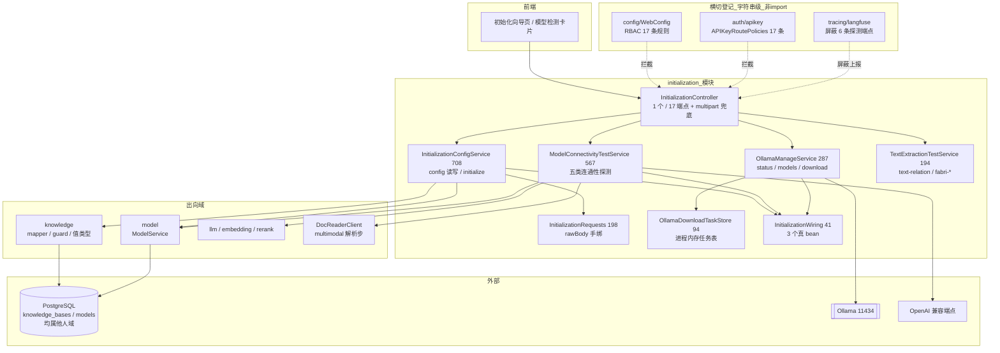
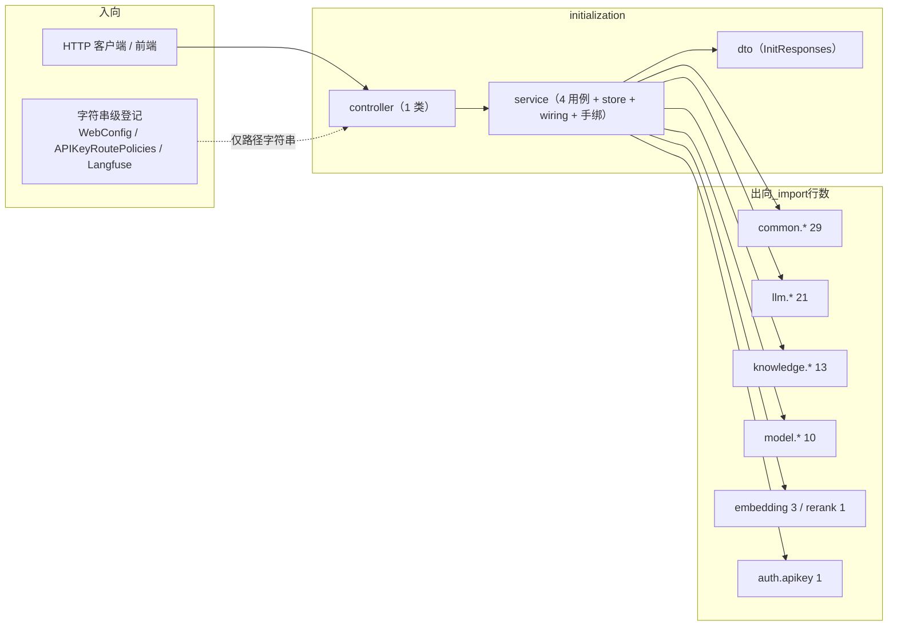
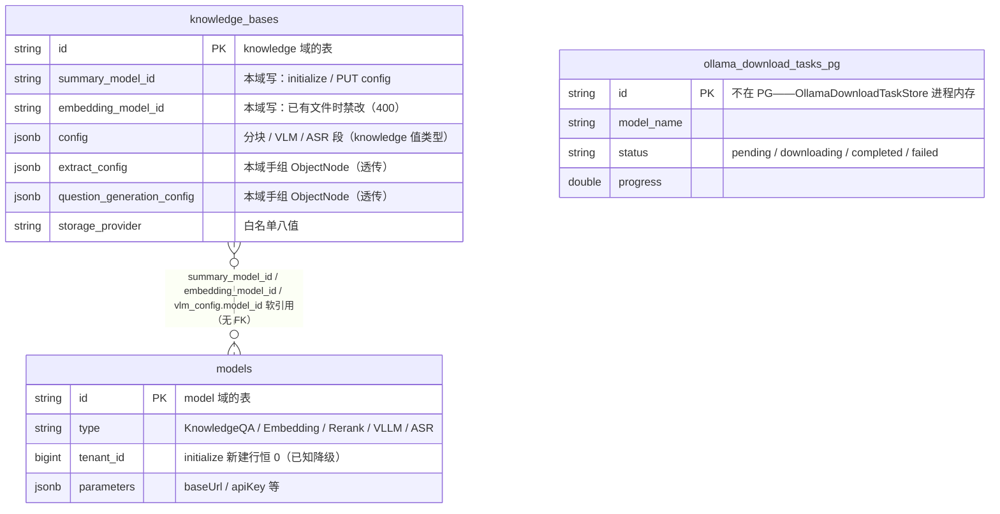
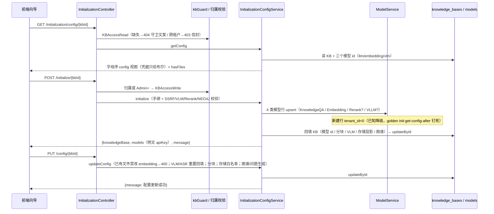
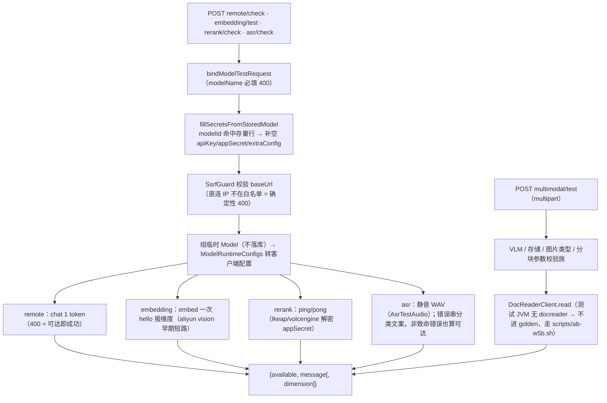
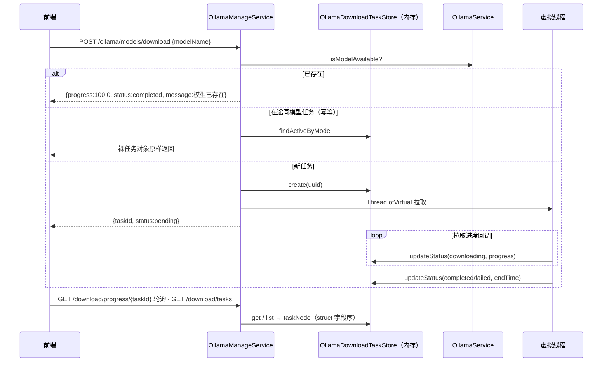

# initialization 模块手册

> **面向读者**：第一次接手 `com.ragagent.initialization` 的架构师 / 高级开发者。
> **目标**：30 分钟建立全局观 → 能定位改动点 → 能安全迭代（本域有 62 个契约 golden + 全仓 4,836 个后端用例兜底，改错会立刻红）。
> **数据口径**：2026-10-08 实测（`wc -l` 口径）：**14 个 java 文件 / 2,392 行 / 3 个子包（+根）**。
> **本文档的地位**：模块级导览；仓库级作业规范见仓库根 `HANDOFF.md`（§12 结构地图、§13 踩坑清单、§14 逐包重构范式）。

---

## 0. 一分钟速览

**它是什么**：`/api/v1/initialization/*` 下全部 **17 个端点**——**首次部署的初始化向导面 + 把"模型设备"跑起来的检测面**。

- KB 初始化配置（3 条）：GET / POST initialize / PUT config——初始化向导读写 KB 的模型与分块配置，首次装配时顺手建出 LLM / Embedding / Rerank / VLM 模型行
- Ollama 管理（6 条）：status / models / check / download（异步任务 + 进度轮询）/ tasks
- 模型连通性测试（5 条）：remote / embedding / rerank / asr / multimodal——拿用户在向导里填的参数**现场探测一次**，全部临时组 Model、不落库
- 文本抽取试验（3 条）：text-relation / fabri-tag / fabri-text——图谱抽取的试跑面板

**它不是什么**（别在这里改）：

| 不负责 | 归属 |
|---|---|
| 模型实体 CRUD、模型列表管理 | `model`（本域只经 `ModelService` 建/读单行；连通性测试的 Model 是临时对象） |
| KB 配置的另一条更新路（名称/描述/config 整列） | `knowledge` 的 `PUT /api/v1/knowledge-bases/{id}`（与本域 `PUT /initialization/config/{kbId}` **并存**，见 §3.2） |
| agent 管理面（智能体 CRUD） | `agent/management`（2026-09-30 与本域从 `agentm` 一分为二，2026-10-03 B36 并入 agent） |
| ASR 转写实现、抽取 prompt 本体 | `llm/asr` / `llm/extract`（批 4-l 迁走；本域只剩装配与 `/asr/check` 端点） |
| LLM / Embedder / Reranker 的 provider 客户端 | `llm` / `embedding` / `rerank`（本域经工厂现场创建） |

### 图 1：模块全景



**三个必须知道的数字**：17 个端点全部挤在 **1 个 controller** 里，且本域是**主代码零入向 Java 依赖**的纯 HTTP 叶子域（没有别的包 import 它，只有字符串级路由登记；同为零入向的还有 favorite / evaluation）；`service/` 2,123 行 ≈ **89%** 代码量（controller + dto 合计仅 262 行，典型薄壳域）；**62 个契约 golden**（17 `init-*` + 45 `w5b-*`）钉死 17 端点，但只有 **6 个 `@Test` 方法**——一个方法串十几条断言、顺序敏感。

---

## 1. 目录结构与职责

### 1.1 子包清单（放什么 / 不放什么）

| 子包 | 文件/行数 | 放什么 | **不放什么** |
|---|---|---|---|
| 根 | 1 / 7 | `package-info`：域职责 + `agentm` 一分为二的由来 | —— |
| `controller/` | 2 / 187 | `InitializationController`（17 端点注解与委托 + multipart 解析失败兜底）+ package-info | 业务逻辑（→ `service/` 四个协作者） |
| `service/` | 9 / 2,123 | 4 个用例服务（`InitializationConfigService` 708 / `ModelConnectivityTestService` 567 / `OllamaManageService` 287 / `TextExtractionTestService` 194）+ `InitializationRequests`（手绑）+ `OllamaDownloadTaskStore`（内存任务表）+ `InitializationWiring`（bean 装配）+ `AsrTestAudio` + package-info | —— |
| `dto/` | 2 / 75 | `InitResponses`（initialize 响应的 models 序列化，键 = camelCase）+ package-info | 请求形状（在 `service/InitializationRequests` 手绑） |

最大类 top3：`InitializationConfigService` 708 / `ModelConnectivityTestService` 567 / `OllamaManageService` 287。

### 1.2 依赖方向（纯叶子：零入向、单向下出）



**本域没有门面、也没有 Spring 注入链**：四个用例服务由 controller **构造器手 new**（`InitializationController` 构造体），真正的 Spring bean 只有 `InitializationWiring` 里的 3 个（`OllamaService` 单例、`AsrTranscriber` 缺省实现、`ExtractPrompts`）。入向唯一的两条线都是**字符串**：RBAC 与 API-Key 路由策略按路径登记 17 条，Langfuse 拦截器把 6 条探测/抽取端点排除在上报外（`LangfuseHttpInterceptor`）。

---

## 2. 数据模型

### 2.1 ER 图（**无自有表**——状态全借住在他域表与进程内存）

本包 **0 个 `@TableName`、0 个 mapper**。读写的数据落在这三处：



### 2.2 jsonb / 配置值类型对照（含 camel/snake 核实结论）

| 数据 | 值类型 / 形态 | 说明 |
|---|---|---|
| `knowledge_bases.config` 的分块 / VLM / ASR 段 | `knowledge.domain` 的 `KnowledgeBaseChunkingConfig` / `KnowledgeBaseVlmConfig` / `KnowledgeBaseAsrConfig` | 值类型归 knowledge 域，本域只 set/get |
| 同列的 `extract_config` / `question_generation_config` 段 | **本域手组 `ObjectNode`**（`enabled/text/tags/nodes/relations/customInstructions/questionCount`） | JsonNode 透传，无值类型；knowledge 的 `KnowledgeBaseConfigJsonContractTest` 不钉这两段，键集只由本域代码 + golden 钉 |
| GET config 响应 | 手组 `TreeMap`（**全 map 字母序**，`sortedBlock`） | 键序即契约（golden 逐键比） |
| 下载任务 | `OllamaDownloadTaskStore.DownloadTask`（内存，volatile 字段） | `taskNode` 按 struct 字段序输出 |

> ✅ **camel/snake 核实结论（2026-10-08 实测，推翻旧说法）**：knowledge 手册 §0 与本包 `package-info` 里「那套配置的 jsonb 内层键**仍是 snake**」的说法**已过时**。提交 `9cb74b49`（2026-09-30，「契约换锚——去信封/自有载荷 camelCase」，init-\*/w5b-\* golden 同批重录）已把本域请求/响应载荷与手组 jsonb 键全部 camel 化；B72（2026-10-05）前端契约键守卫把 `api/initialization` 移出整面白名单。实测：主代码 **0 个 snake 字面量**、62 个 golden **全 camel**。以代码与 fixture 为准，别按旧说法写兼容。

### 2.3 状态枚举 / 取值面

| 枚举 / 取值面 | 值 | 用在哪 |
|---|---|---|
| `DownloadTask.status` | `pending` → `downloading` → `completed` / `failed`（终态补 `endTime`） | Ollama 下载任务（内存） |
| `Model.status` | 恒写 `"active"` | initialize 建行 |
| `storageProvider` 白名单 | `local` / `minio` / `cos` / `tos` / `s3` / `oss` / `ks3` / `obs` | PUT config 校验（`List.of` 硬编码，文案提 STORAGE_ALLOW_LIST） |
| VLM `interfaceType` | `"ollama"`（拼 `OLLAMA_BASE_URL` + `/v1`）/ 其他走 OpenAI 兼容 | multimodal/test、initialize 校验 |
| 分块 `strategy`（透传） | `legacy` / `auto` / `heading` / `heuristic` | 原样写入 chunking（语义在 knowledge chunker） |

---

## 3. HTTP 接口面

### 3.1 端点分组（1 个 controller / 17 个端点 = 3 + 6 + 5 + 3）

**KB 初始化配置**（3 条；RBAC：GET=Viewer+，POST/PUT=CONTRIBUTOR+，与 `PUT /knowledge-bases/{id}` 同矩阵；API-Key=manageKnowledgeBases(fullAccess)）

| 方法 | 路径 | 用途 |
|---|---|---|
| GET | `/api/v1/initialization/config/{kbId}` | 配置视图：模型块（凭据只给布尔）+ documentSplitting + multimodal + nodeExtract + questionGeneration + hasFiles，全 map 字母序 |
| POST | `/api/v1/initialization/initialize/{kbId}` | 首次装配：SSRF/配置校验 → 4 类模型行 upsert → 回填 KB → saveKb |
| PUT | `/api/v1/initialization/config/{kbId}` | 配置更新：**前端 `updateKBConfig` 实际打的就是这条**（knowledge 手册 §3.1 点名的双路径之一） |

**Ollama 管理**（6 条；读=Viewer+，check/download=Admin+；API-Key 全部 manageModels(fullAccess)）：`GET /ollama/status`（不可用仍 200 + `available:false`）、`GET /ollama/models`、`POST /ollama/models/check`（逐模型可用性，map 按名字母序）、`POST /ollama/models/download`（异步任务）、`GET /ollama/download/progress/{taskId}`、`GET /ollama/download/tasks`。

**模型连通性测试**（5 条，全 POST / Admin+）：`/remote/check`、`/embedding/test`、`/rerank/check`、`/asr/check`、`/multimodal/test`（唯一 multipart + `@RequestParam` 面）。

**文本抽取试验**（3 条，全 POST / Admin+）：`/extract/text-relation`、`/extract/fabri-tag`（无 LLM，随机标签组）、`/extract/fabri-text`。

### 3.2 契约约定（改接口前必读）

| 约定 | 说明 |
|---|---|
| 字段名 | **JSON 名 = Java 字段名（camelCase）**；本域已无任何 snake（§2.2 核实结论） |
| 请求绑定 | **17 端点全部 rawBody 手绑**（`@RequestBody(required=false) String rawBody` / `@RequestParam`）——无 `@Valid` DTO；`InitializationRequests` javadoc 登记「契约换锚时一并 DTO 化」 |
| 响应形状 | **无信封直出**；响应是手组 `ObjectNode` / `TreeMap`，**键序即契约**（config 全 map 字母序、DownloadTask 按 struct 字段序、multimodal 注释点名按字母序插入） |
| 凭据回显 | GET config **只回显 `credentials.apiKey` 布尔**（前端注释「exposes credential presence, not values」，builtin/baseUrl 亦脱敏）；**唯一例外**：POST initialize 响应的 `models[].parameters.apiKey` 原样输出（`InitResponses` javadoc 的自有契约） |
| 错误 | `{error:{code,message,details}}`（`AppError`/`BizException`）；GET config 的 404 有**两种文案**——业务文案「知识库不存在」在同租户路径不可达（守卫先行 404「knowledge base not found」信封，golden 录的是后者），controller javadoc 原文注明 |
| 守卫顺序 | **golden 钉死、不能重排**（controller javadoc）：GET=KBAccessRead → `requireKbAccess`；POST/PUT=OwnedKBOrAdminFromKbIDParam（非创建者且非 Admin+ → 403）→ KBAccessWrite → handler |
| 删除 | 本域**无 DELETE 端点**（204 约定不适用） |
| 双路径 | ⚠️ KB 配置更新有两条路：本域 `PUT /initialization/config/{kbId}`（前端向导用，逐段回填语义）与 knowledge `PUT /api/v1/knowledge-bases/{id}`（名称/描述/config 整列）——改配置语义前先确认改的是哪条 |

---

## 4. 核心链路

### 4.1 初始化向导（GET config → POST initialize → PUT config）



### 4.2 模型连通性测试族（5 端点，一套骨架）



### 4.3 Ollama 下载任务（异步 + 进度轮询）



---

## 5. 改哪里（场景 → 文件）

| 我想… | 主要改这里 | 别忘了 |
|---|---|---|
| 改初始化配置读写语义 | `service/InitializationConfigService` | 先确认双路径（§3.2）；golden `init-*` 同批重录 |
| 改某类连通性探测 | `service/ModelConnectivityTestService` | `w5b-*` golden + SSRF 白名单探针用例 |
| 改 Ollama 管理 / 下载 | `service/OllamaManageService` + `OllamaDownloadTaskStore` | in-JVM stub 在测试侧 `W5bStubServers`（11434）；down/up 两家族 golden |
| 改抽取试验 | `service/TextExtractionTestService`（prompt 本体在 `llm/extract/ExtractPrompts`） | fabri-tag 随机输出 = 掩码 + 形状断言，`TAG_OPTIONS` 与测试内 options 集合同改 |
| 改请求键 / 校验文案 | `service/InitializationRequests`（手绑）+ 各 `bindXxx` | 400 文案走 `RequestFields`；golden 逐字比 |
| 加 / 改响应键 | `dto/InitResponses` 或对应 service 的手组 `ObjectNode` | 键序即契约；前端 `frontend/src/api/initialization/` 同批 |
| 改路由权限 | `config/WebConfig`（RBAC 17 条）+ `auth/apikey/.../APIKeyRoutePolicies` | 与 controller javadoc 守卫顺序一致，golden 钉死 |
| 换 ASR 测试音频 / 装配 | `service/AsrTestAudio` + `resources/initialization/asr_test.wav`；`InitializationWiring` | 转写实现在 `llm/asr`，别在这里改 |
| 加端点 | controller 加方法 + service 协作者 + WebConfig/APIKeyRoutePolicies 登记 + golden | 保持 rawBody 手绑风格 + multipart 兜底 |
| 改 Langfuse 上报面 | `tracing/langfuse/LangfuseHttpInterceptor`（屏蔽名单） | 新增探测类端点想清楚要不要跟进名单 |

---

## 6. 常见迭代 SOP

> 铁律：**一次只动一个轴**；每步结束**全绿**再走下一步（哪怕只是移动文件）。

```bash
# 每次改动后必跑（约 3 分钟）
cd ~/ragagent && JAVA_HOME=/opt/homebrew/opt/openjdk@21/libexec/openjdk.jdk/Contents/Home \
  ./gradlew :domains:test :domains:spotlessCheck
# 若动了前端可见契约（字段名/信封/状态码），同批带前端：
cd frontend && npx vue-tsc --build --force && npm test
```

**A. 加端点**：service 协作者加用例 → controller 加方法（rawBody 手绑）→ WebConfig + APIKeyRoutePolicies 登记 → 补 golden（重录用 `scripts/record-w5b-golden.sh` / `record-ag-golden.sh`，重录后**结构化复核差异**，HANDOFF §13.12）→ 三绿 → 提交。

**B. 改请求/响应键**：手绑或手组处改键 → 前端同批 → golden 重录 + 复核 → 检查掩码正则是否还命中（HANDOFF §13.13：键改名会让掩码静默失效，夹具混进真实 UUID/时间戳下次就红）→ 三绿。

**C. 改探测语义**：只动 `ModelConnectivityTestService` 一个探测方法 → 错误分类文案改动会打 `w5b-*-ok/missing` 两类 golden → 三绿。docreader 执行步不在 golden（测试 JVM 无 docreader），真机走 `scripts/ab-w5b.sh`。

**D. 动下载任务**：`OllamaDownloadTaskStore`（内存结构）与 `OllamaManageService` 的状态机一起想；down 家族 golden 依赖「stub 未启动」的确定性 500/404，别把错误文案改出掩码。

**E. 重构（拆类/移动）**：沿 HANDOFF §13.1 侦察 → 按调用点定边界 → 本域只有 3 个测试类，随类同包 `git mv` → 每包 `package-info` 保持准确 → 三绿 → 提交。归位测试树时参照 agent 手册 §9 已登记的建议（§9 第 1 行）。

---

## 7. 模块约定与坑（必读）

1. **POST /initialize 建的模型行 `tenant_id=0`**（`InitializationConfigService.toModel` 注释 + golden `init-get-config-after` 无 llm/embedding 键即此因）：「初始化后再 GET config 不回显模型块」**不是 bug**，是已 golden 钉死的已知降级；要回填租户属行为变更——先对齐前端/集成者再改 + 重录 `init-*`。
2. **PUT /config 的 `storageBackendId` 解析分支未实现**（controller javadoc「已知降级」）：现全走 provider 兼容投影；对象存储绑定校验那条路在 knowledge 域的创建/更新里，别在这里找。
3. **四个用例服务不是 Spring bean**：controller 构造器手 new，加依赖要同步构造签名；真 bean 只有 `InitializationWiring` 的 3 个，其中 **`OllamaService` 必须单例**（`isAvailable` 是跨请求共享状态，「已可用则跳过 StartService」依赖这一点，javadoc 原文）。
4. **下载任务表在进程内存**（`OllamaDownloadTaskStore` javadoc）：不落 DB、不落文件、**重启即空**；`list()` 顺序不可依赖（golden `w5b-tasks-one` 用单任务场景规避）。
5. **零值时间哨兵 `"0001-01-01T00:00:00Z"`**（HANDOFF §14.6 冻结边界「agentm/init 的 GO_ZERO_TIME 与 goTime 系」；实码 `timeAsIs` / `isoTimeText`）：null 时间照输出哨兵值，**别顺手改成 null**（涉冻结事件面与既有前端）。
6. **本域写的 `extract_config` / `question_generation_config` 是手组 ObjectNode 透传**（§2.2）：不受 knowledge 的 KB config 契约测试钉测，键集只由本域代码 + golden 钉——改键没有第二道网。
7. **golden 是「语义比较 + 掩码」**（`W5bInitializationContractTest.compareGolden`）：键序/转义归一后比，时间戳/UUID 掩掉，**ollama down 家族错误内文两侧不同**（dial 文案）→ 掩 `<ollama-err>`；fabri-tag 随机输出 → 掩 `tags` + 形状断言（1..9 个、不重复、全在 `TAG_OPTIONS`）——改 `TAG_OPTIONS` 必须同步测试里的 options 集合。
8. **注释漂移三处，改到即修**：① 本包 `package-info`「自带契约：内层 snake 键」已过时（§2.2）；② `InitializationWiring` javadoc 自称「agent.management 的进程级装配」（包名错位）；③ `llm/extract/ExtractPrompts` javadoc 资源路径写 `agent/management/extract_config.yaml` 而常量是 `initialization/extract_config.yaml`（属 HANDOFF §14.5「锚点准确」判据的存量）。
9. **GET config 的 404 双文案**（§3.1 controller javadoc）：守卫文案先于业务文案可达，golden 录的是守卫的「knowledge base not found」——改错误处理顺序会直接打红 golden。

---

## 8. 测试与验证

- **规模（2026-10-08 实测）**：直接覆盖本域的测试类 **3 个 / `@Test` 方法 6 个**；全仓基线约 **4,836** 用例（B84–B88 闸门口径）。
- **跨域挂载（本域最非常规的一点）**：本域自有测试树 `domains/src/test/java/com/ragagent/initialization/` 只有 **1 类 1 用例**（`OllamaBindJsonObjectTest`，bindJsonObject 的 400 文案钉子）；主力契约测试全挂在 **agent 测试树**——`agent/management/W5bInitializationContractTest`（4 用例：down/up/upstream 三家族 + fabri-tag 形状，45 个 `w5b-*` golden，in-JVM Ollama stub 11434 + OpenAI 兼容 stub）与 `agent/management/AgentContractTest`（3 用例中的 `agentAndInitializationFlow` 覆盖 17 个 `init-*` golden）。原因：`agentm` 时代同包，B36 并入 agent 时测试树未随域归属走（agent 手册 §8/§9 已登记）。
- **fixture**：`domains/src/test/resources/contracts/` 下 **62 个**——`init-*` 17（config 三端点）+ `w5b-*` 45（系统级 14 端点）。录制：`scripts/record-ag-golden.sh`（43 `ag-*` + 17 `init-*`）、`scripts/record-w5b-golden.sh`；docreader 执行步走 `scripts/ab-w5b.sh` 双端 A/B（不进 golden）。
- **比较口径**：语义比较（`ContractJson.semantic` 键序/转义归一）+ 掩码（`<ts>` / `<uuid>` / `<ollama-err>` / `<tags>`），fixture 锚定的是**本仓自己的行为**。
- **已知偶发 2 例**（全仓共通，遇到先单独重跑，别误判回归）：
  - `WebToolsRecordingTest.searchWithContentFetchesLeadingPagesViaSharedFetchTool`（全量并发下偶发）
  - `EvaluationContractTest.getTerminalRunsExecution`（全量并发下偶发；单独 `--tests "*EvaluationContractTest"` 通过）
- **改前端可见契约时**：后端与前端**同批**改完再提交（`frontend/src/api/initialization/` 的类型已与本域 camel 契约对齐）。

---

## 9. 已知待办与风险（接手后优先看）

| 项 | 性质 | 建议 |
|---|---|---|
| `W5bInitializationContractTest`（含 `W5bStubServers`）与 `AgentContractTest` 的 initialization 段挂在 `agent/management/` 测试树 | 归位债 | 它们测的是本域端点（B36 并入时测试树未随域归属走，agent 手册 §9 同一条）；建议随本域 `git mv`，单独一批 + 全绿 |
| `package-info`「内层 snake 键」等注释漂移三处（§7.8） | 文档债 | 改到即修，防新人被误导去「兼容 snake」 |
| 17 端点全 rawBody 手绑 + 手组 ObjectNode 响应（无 DTO） | 契约债 | `InitializationRequests` javadoc 已登记「契约换锚时一并 DTO 化」；DTO 化必须保持 400 文案逐字（golden 钉死） |
| POST initialize 的模型行 `tenant_id=0` | 已知降级（golden 钉死） | 回填租户 = 行为变更：先对齐消费方再改 + 重录 `init-*` |
| PUT /config 的 `storageBackendId` 分支未实现 | 功能降级 | 现走 provider 兼容投影；如需存储绑定校验，走 knowledge 域的路 |
| 下载任务 store 纯进程内存 | 结构限制 | javadoc 明示重启即空；若走向多实例部署需先评估（`list()` 顺序亦不可依赖） |

---

## 10. 速查：本模块的"地标"

| 想知道 | 看这里 |
|---|---|
| 17 个端点在哪 | `controller/InitializationController`（唯一 controller） |
| 配置读写 / initialize 语义 | `service/InitializationConfigService`（708 行，最大类）+ §4.1 |
| 请求怎么绑 | `service/InitializationRequests`（手绑）+ `OllamaManageService.bindJsonObject` |
| 五类连通性怎么测 | `service/ModelConnectivityTestService` + §4.2（临时 Model 不落库） |
| Ollama 下载任务状态在哪 | `service/OllamaDownloadTaskStore`（**进程内存**，§7.4） |
| 谁守卫这些路由 | `config/WebConfig` RBAC + `auth/apikey/.../APIKeyRoutePolicies` + controller javadoc 守卫顺序 |
| 契约金片与重录 | `contracts/init-*`（17）+ `contracts/w5b-*`（45）；`scripts/record-w5b-golden.sh` / `record-ag-golden.sh` / `ab-w5b.sh` |
| ASR 测试音频与装配 | `service/AsrTestAudio` + `resources/initialization/asr_test.wav`；`InitializationWiring`（转写实现在 `llm/asr`） |
| 抽取 prompt 本体 | `llm/extract/ExtractPrompts` + `resources/initialization/extract_config.yaml`（javadoc 路径已漂移，§7.8） |
| 前端为什么打这里改配置 | `frontend/src/api/initialization/index.ts` 的 `updateKBConfig` → `PUT /initialization/config/{kbId}`（双路径见 §3.2） |
| 哪些端点不上 Langfuse | `tracing/langfuse/LangfuseHttpInterceptor`（6 条探测/抽取端点屏蔽名单） |
| 目录为什么长这样 | 本文 §1 + 每个包的 `package-info.java`（共 4 份；根那份有一处过时说法见 §7.8） |
