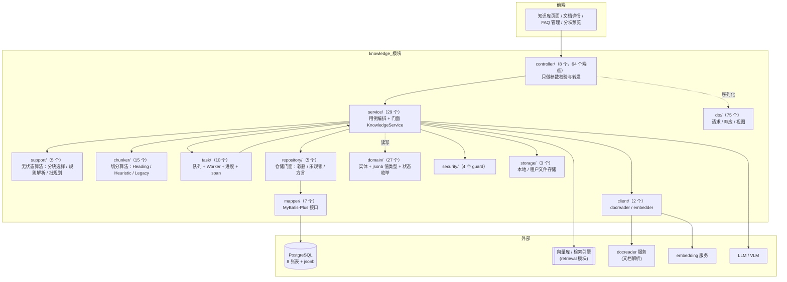
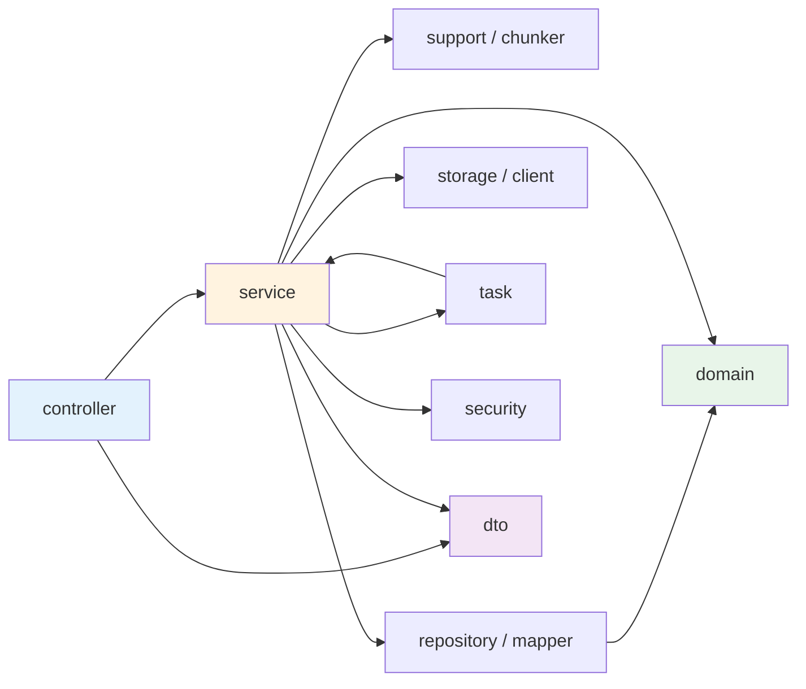
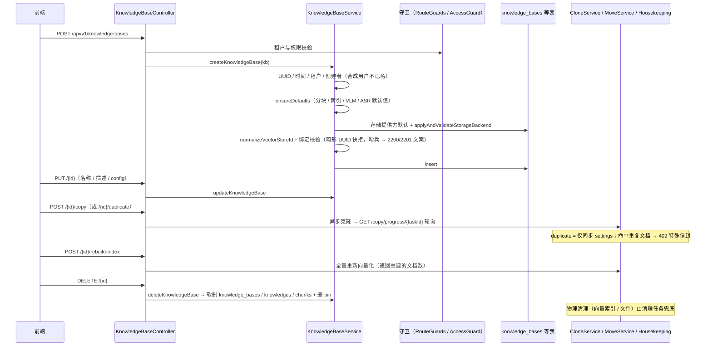
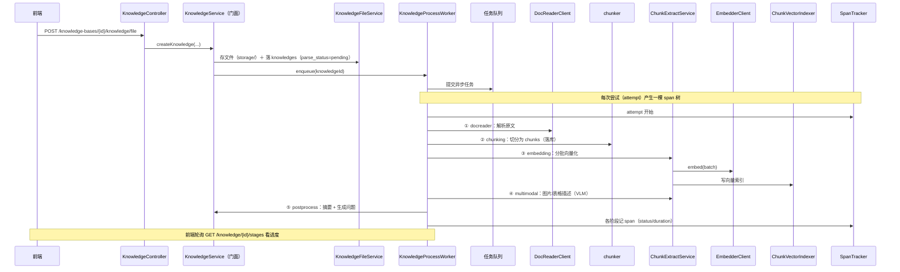
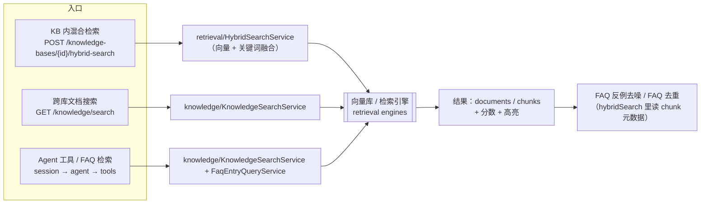
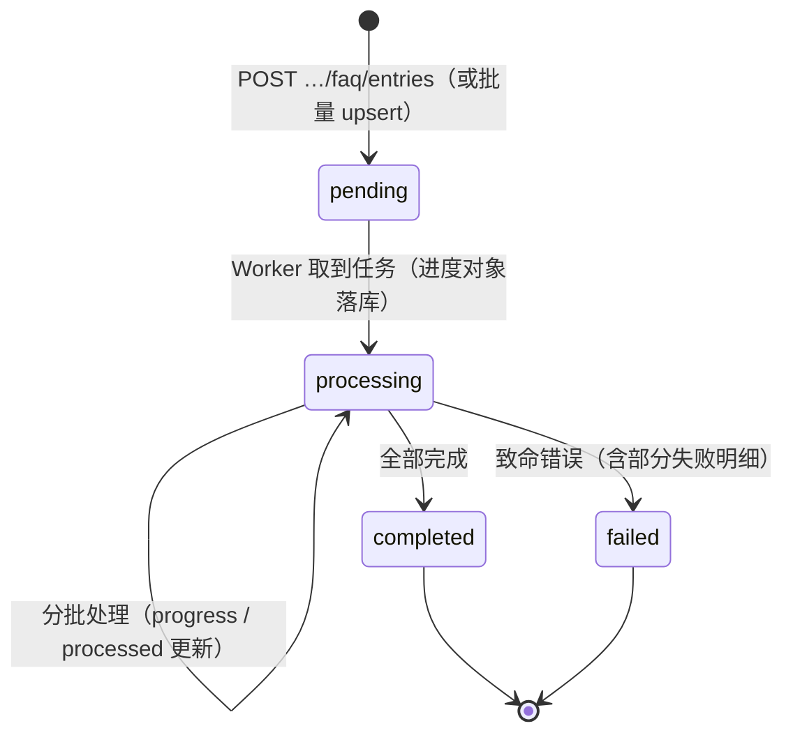
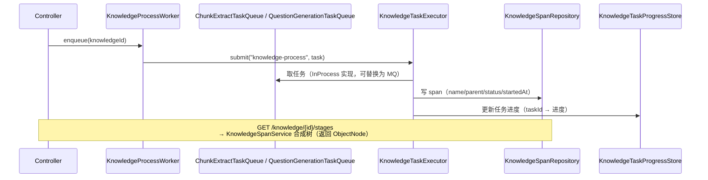
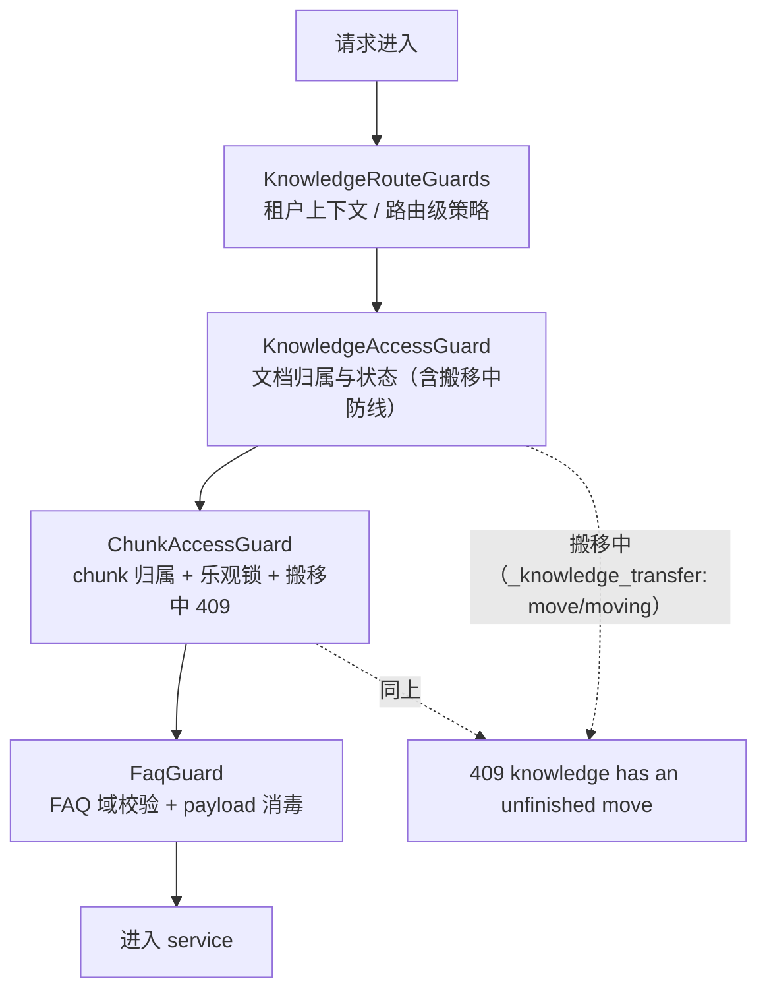

# knowledge 模块手册

> **面向读者**：第一次接手 `com.ragagent.knowledge` 的架构师 / 高级开发者。
> **目标**：30 分钟建立全局观 → 能定位改动点 → 能安全迭代（本模块有 4,681 个后端用例兜底，改错会立刻红）。
> **数据口径**：2026-09-30 实测（`wc -l` 口径）：**197 个 java 文件 / 约 2.48 万行 / 12 个子包**。
> **本文档的地位**：模块级导览；仓库级作业规范见仓库根 `HANDOFF.md`（§12 结构地图、§13 踩坑清单、§14 逐包重构范式）。

---

## 0. 一分钟速览

**它是什么**：知识库（KB）域的全部后端能力——**把文档变成可检索的知识**，再把它**喂给问答与智能体**。

- 文档入库：文件 / URL / 手工录入 → 解析 → 分块 → 图抽取 → 向量化 → 多模态描述 → 后处理（摘要、问题生成）
- 检索供给：KB 内混合检索（向量 + 关键词）、跨库文档搜索、FAQ 检索；被问答链路与 agent 工具复用
- FAQ 条目：一种"结构化特殊文档"（标准问 / 相似问 / 反例 / 答案），有独立的导入导出与批量编辑面
- 运维面：标签、文件夹、移动 / 复制 / 批量删除 / 重建索引、处理进度（span 树）、清理任务

**它不是什么**（别在这里改）：

| 不负责 | 归属 |
|---|---|
| 会话与 SSE 流、问答编排 | `session`（本模块只提供检索与工具能力） |
| 检索引擎协议、向量库适配 | `retrieval`（本模块通过 `ChunkVectorIndexer` / `VectorStoreService` 使用它） |
| 模型调用与凭据 | `model` / `llm`（本模块通过 `EmbedderClient` / `DocReaderClient` 之类的薄客户端调用） |
| 系统初始化、模型连通性测试、租户级解析规则 | `agentm`（注意：那套配置的 jsonb 内层键**仍是 snake**，与本模块的 camelCase 契约不同） |

### 图 1：模块全景



**三个必须知道的数字**：最大类 1,234 行（`FaqImportService`，导入状态机，例外已在 javadoc 注明）；`service/` 占 1.13 万行（约 46% 的代码量，是最大的子包）；`dto/` 75 个文件全是一类型一文件。

---

## 1. 目录结构与职责

### 1.1 子包清单（放什么 / 不放什么）

| 子包 | 文件/行数 | 放什么 | **不放什么** |
|---|---|---|---|
| `controller/` | 9 / 2,425（8 个 controller + package-info） | `@RestController`：参数校验（`@Valid` DTO）、调门面、拼响应 | 业务逻辑、SQL、`ObjectNode` 手搓 |
| `service/` | 29 / 11,342 | Spring 服务（用例编排）、切片服务、门面 `KnowledgeService` | 算法细节（→ `support/`）、SQL（→ `repository/`） |
| `support/` | 5 / 261 | 无状态零依赖的算法与规则 | 注入任何 Bean、访问数据库 |
| `chunker/` | 15 / 2,712 | 切分算法族：`HeadingSplitter` / `HeuristicSplitter` / `LegacySplitter`（Tier 3 算法分档，**不是**待删遗留）+ 规范化工具 | HTTP、持久化 |
| `task/` | 10 / 1,274 | 队列接口 + InProcess 实现、`KnowledgeProcessWorker`、任务执行器、进度与 span | 具体解析 / 分块逻辑（调 `service/`） |
| `repository/` | 6 / 1,336 | 仓储门面：软删三面孔、乐观锁、方言分支、事务模板 | 直接暴露 MyBatis 细节 |
| `mapper/` | 8 / 414 | MyBatis-Plus 接口 + 显式 SQL | 业务判断 |
| `domain/` | 27 / 1,802 | 实体（`@TableName`）+ **jsonb 值类型** + 状态枚举 | 请求/响应形状（→ `dto/`） |
| `dto/` | 75 / 1,439（全部一类型一文件） | 一类型一文件：请求（29）/ 响应（18）/ 视图（6）/ 其余 | 持久化注解 |
| `security/` | 5 / 992 | 4 个守卫：访问、chunk、FAQ、路由 | 业务逻辑 |
| `storage/` | 4 / 466 | 本地文件、租户文件读写与配额 | 文档解析（→ `client/DocReaderClient`） |
| `client/` | 3 / 336 | 出站薄封装：docreader、embedder | 重试策略散落（集中在封装内） |

### 1.2 依赖方向（只允许向下）



**门面模式是本模块的枢纽**：`KnowledgeService`（约 850 行）保留**全部公共方法**并委托给切片服务。它的价值在于——拆分神类时**18+ 个注入点与 Mockito 测试零改动**；缺点是新人容易以为逻辑在门面里，其实都在切片服务。

---

## 2. 数据模型

### 2.1 ER 图（8 张表）

```mermaid
erDiagram
    knowledge_bases ||--o{ knowledges : "kb_id"
    knowledges ||--o{ chunks : "knowledge_id"
    chunks ||--o{ chunk_revisions : "chunk_id"
    knowledge_bases ||--o{ knowledge_tags : "kb_id"
    knowledges }o--o{ knowledge_tags : "chunks.tag_id"
    knowledges ||--o{ knowledge_spans : "knowledge_id"
    user_kb_pins }o--|| knowledge_bases : "kb_id"
    knowledge_bases ||--o{ storage_backends : "storage_config"

    knowledge_bases {
        string id PK
        string tenant_id
        string name
        string type "document / faq"
        jsonb config "分块/索引/VLM/ASR 配置"
        jsonb storage_config "对象存储凭据与桶"
        string storage_provider
        datetime deleted_at
    }
    knowledges {
        string id PK
        string knowledge_base_id FK
        string tenant_id
        string title
        string source "file / url / manual"
        string parse_status "pending…completed/failed"
        string summary_status
        jsonb metadata "转移状态等"
        datetime deleted_at
    }
    chunks {
        string id PK
        string knowledge_id FK
        string knowledge_base_id
        int chunk_index
        string content
        jsonb metadata "FAQ 条目 / 生成问题"
        string tag_id
        boolean is_enabled
        int content_revision "乐观锁"
        string index_status
        datetime deleted_at
    }
    chunk_revisions {
        string id PK
        string chunk_id FK
        int revision
        string content
        boolean is_enabled
        string editor_id
    }
    knowledge_tags {
        string id PK
        string knowledge_base_id FK
        string name
        int sort_order
    }
    knowledge_spans {
        string knowledge_id FK
        int attempt
        string span_id
        string parent_span_id
        string name "阶段名"
        string status
        datetime started_at
    }
```



> `knowledge_spans` 没有实体类：它由 `KnowledgeSpanRepository` 用显式 SQL 读写（见 §4.5）。

### 2.2 jsonb 列与值类型对照

| 列 | 值类型（`domain/`） | 说明 |
|---|---|---|
| `knowledge_bases.config` | `KnowledgeBaseChunkingConfig`（含 `ParserEngineRule`） | 分块尺寸/分隔符/引擎规则/父子块/token 上限 |
| 同上（同列不同子域） | `KnowledgeBaseIndexingStrategy` / `KnowledgeBaseVlmConfig` / `KnowledgeBaseImageProcessingConfig` / `KnowledgeBaseAsrConfig` | 索引开关、图像描述、语音转写 |
| `knowledge_bases.storage_config` | `KnowledgeBaseStorageConfig` | 桶、区域、路径前缀、S3 兼容开关 |
| `chunks.metadata` | `DocumentChunkMetadata`（普通文档）/ `FaqChunkMetadata`（FAQ） | 生成问题列表 + 版本号；FAQ 条目字段 |
| `knowledges.metadata` | 透传 `JsonNode` | 搬移状态 `_knowledge_transfer` 等 |
| 任务队列 / LLM 载荷 | `ExtractChunkPayload` / `QuestionBatchPayload` | 队列内传递（含链路追踪键） |

**硬约定（踩过坑）**：

1. jsonb 字段**必须**逐字段写 `@TableField(typeHandler = PgJsonTypeHandler.class)`，**且实体类要带 `@TableName(autoResultMap = true)`** —— 漏了 `autoResultMap` 会"**写得进、查出来是 null**"（静默故障）。
2. 用 wrapper 的 `set()` 更新 jsonb **不会**套实体的 typeHandler，必须三参写法 `set("metadata", value, "typeHandler=...")`（见 `mapper/ChunkMapper` 的注释）。
3. 值类型**字段一律显式输出**（不再用 `@JsonInclude` 省略空值）——读方用 `path(x).asDefault()` 容错。

### 2.3 状态枚举

| 枚举 | 取值 | 用在哪 |
|---|---|---|
| `ParseStatus` | `pending` → `processing` → `completed` / `failed` | `knowledges.parse_status`（处理主状态） |
| `SummaryStatus` | `pending` / `processing` / `completed` / `failed` | 摘要生成子状态 |
| `EnableStatus` | 启用 / 停用 | 文档与 chunk 可用性 |
| `chunks.index_status` | `ready` / 其他 | 索引是否可用 |
| FAQ 导入进度 | `pending` → `processing` → `completed` / `failed` | 进度对象（非枚举，字符串，见 §4.4） |
| 处理阶段（span 名） | `docreader` / `chunking` / `embedding` / `multimodal` / `postprocess` | `KnowledgeService.ALL_STAGES` |

---

## 3. HTTP 接口面

### 3.1 端点分组（8 个 controller / 68 个端点）

**文档管理**（`KnowledgeController`，前缀 `/api/v1`，18 个）

| 方法 | 路径 | 用途 |
|---|---|---|
| POST | `/knowledge-bases/{id}/knowledge/file` | 上传文件（multipart） |
| POST | `/knowledge-bases/{id}/knowledge/url` | 从 URL 抓取入库 |
| POST | `/knowledge-bases/{id}/knowledge/manual` | 手工录入 |
| GET | `/knowledge-bases/{id}/knowledge` | 文档列表（分页 / 过滤） |
| GET | `/knowledge-bases/{id}/knowledge/folders` | 文件夹树 |
| GET | `/knowledge/{id}` | 文档详情 |
| GET | `/knowledge/batch` | 批量取详情 |
| GET | `/knowledge/{id}/stages`（别名 `/spans`） | **处理进度 span 树**（可选 `attempt`） |
| POST | `/knowledge/{id}/regenerate-summary` | 重生成摘要 |
| PUT | `/knowledge/manual/{id}` | 编辑手工文档 |
| POST | `/knowledge/{id}/reparse` | 重新解析 |
| POST | `/knowledge/{id}/cancel-parse` | 取消解析 |
| GET | `/knowledge/{id}/download` | 下载原文 |
| GET | `/knowledge/{id}/preview` | 内容预览 |
| PUT | `/knowledge/image/{id}/{chunkId}` | 编辑图片描述 |
| PUT / DELETE | `/knowledge/{id}` · `/knowledge-bases/{id}/knowledge` | 更新 / 单删 / 清空 |

**分块**（`ChunkController`，10 个）：`GET /chunks/{knowledgeId}`（列表）、`GET /chunks/by-id/{id}`、`GET /chunks/{knowledgeId}/{id}/revisions`、`PUT /chunks/{knowledgeId}/{id}`（编辑，带乐观锁）、`POST .../revert`（回滚）、`PUT|POST|DELETE /chunks/by-id/{id}/questions*`（生成问题 CRUD）、`DELETE /chunks/{knowledgeId}/{id}`、`DELETE /chunks/{knowledgeId}`。

**FAQ**（`FaqController`，13 个）：条目 CRUD（`/knowledge-bases/{id}/faq/entries`）、导出、`POST .../faq/entry`（单条新增）、相似问追加、字段批量更新（`/entries/fields`）、标签批量（`/entries/tags`）、检索（`POST .../faq/search`）、导入进度（`GET /faq/import/progress/{taskId}`）、上次导入结果展示状态（`PUT .../import/last-result/display`）。

**知识库本体**（`KnowledgeBaseController`，前缀 `/api/v1/knowledge-bases`，**13 个**）

| 方法 | 路径 | 用途 |
|---|---|---|
| POST | `/api/v1/knowledge-bases` | **创建**（裸映射，无子路径） |
| GET | `/api/v1/knowledge-bases` | **列表**（裸映射） |
| GET / PUT / DELETE | `/{id}` | 详情 / 更新（名称·描述·config）/ 软删 |
| PUT | `/{id}/pin` | 置顶切换（per-(user,kb) 幂等） |
| GET | `/{id}/move-targets` | 可搬移的目标库列表 |
| POST / GET | `/{id}/hybrid-search` | KB 内混合检索（写 / 读两种载荷） |
| POST | `/copy` + `GET /copy/progress/{taskId}` | 克隆 KB（异步任务 + 进度） |
| POST | `/{id}/duplicate` | 仅同步 settings（命中重复文档 → 409 特殊信封） |
| POST | `/{id}/rebuild-index` | 全量重建向量索引 |

> ⚠️ **配置更新的第二条路径**：前端 `updateKBConfig` 实际打的是 **agentm 域**的 `PUT /api/v1/initialization/config/{kbId}`（自有契约、**内层键仍是 snake**），与本表的 `PUT /{id}` 并存——改配置语义前先确认改的是哪条。

**运维**（`KnowledgeOperationsController`，8 个）：跨库搜索（`GET /knowledge/search`）、标签批量（`PUT /knowledge/tags`）、批量删除/重析、文件夹增删、跨库搬移（`POST /knowledge/move` + `GET /knowledge/move/progress/{taskId}`）。

**标签**（`KnowledgeTagController`，4 个）、**分块预览**（`ChunkerPreviewController`，`POST /api/v1/chunker/preview`）、**文件代理**（`KnowledgeBaseFileProxyController`，`GET|HEAD /api/v1/knowledge-bases/{id}/files`）。

### 3.2 契约约定（改接口前必读）

| 约定 | 说明 |
|---|---|
| 字段名 | **JSON 名 = Java 字段名**（camelCase），禁止逐字段 `@JsonProperty` / 类级 `@JsonNaming` |
| 信封 | **无** `{data, success}` 信封：资源直出、列表裸数组或 `{items,page,pageSize,total}` |
| 删除 | 返回 **204**（无 body） |
| 可空字段 | **显式输出 `null`**（不做空值省略） |
| 错误 | `{error: {code, message, details}}`；校验错误的 `details` 是**字段级中文**（`字段名: 原因`） |
| 乐观锁 | 编辑类接口带 `expectedRevision`，冲突返回 409 |
| 全限定名注解 | 不使用（除真同名冲突并在注释说明） |

---

## 4. 核心链路

### 4.1 知识库生命周期（创建 → 配置 → 克隆 → 软删）



| 动作 | 端点 | 关键实现 | 注意 |
|---|---|---|---|
| 创建 | `POST /api/v1/knowledge-bases` | `KnowledgeBaseService.createKnowledgeBase` | `ensureDefaults` 装配配置默认值；向量库绑定走 retriever 的绑定校验（归属 + 注册表哨兵，畸形 UUID 快拒） |
| 列表 / 详情 | `GET /api/v1/knowledge-bases` · `GET /{id}` | `listKnowledgeBases` / `getById` | 租户过滤 + 软删过滤 |
| 更新 | `PUT /{id}` | `updateKnowledgeBase` | ⚠️ 配置还有第二条路径（agentm 的 `PUT /initialization/config/{kbId}`），见 §3.1 注 |
| 置顶 / 目标库 | `PUT /{id}/pin` · `GET /{id}/move-targets` | `togglePin` / `listMoveTargets` | pin 是 per-(user,kb) 幂等切换 |
| 克隆 | `POST /copy` + `GET /copy/progress/{taskId}` | `KnowledgeCloneService` | 异步任务；`POST /{id}/duplicate` 是"仅 settings 同步" |
| 重建索引 | `POST /{id}/rebuild-index` | 全量重新向量化 | 返回重建文档数（`RebuildIndexResponse`） |
| 删除 | `DELETE /{id}` · `DELETE /knowledge-bases/{id}/knowledge` | `deleteKnowledgeBase` | **软删**（`deleted_at`）三张表 + 删 pin，不做物理删除 |
| 兜底 | 无端点（周期任务） | `HousekeepingService` | 扫描"卡在处理态"的行判 failed；用户可见失败的最坏时延 ≈ 1 个 stale 阈值 + 1 个清扫周期 |

`HousekeepingService` 的存在理由（**接手必读**）：worker 被杀、DocReader 超时、多模态计数收口失败——这三种情况没有任何端点会报错，只能靠它把永久 `processing` 的行推进到 `failed`，否则用户侧看到的是一个永远转的圈。

### 4.2 文档入库与处理（HTTP → 五阶段）



| 阶段 | 做什么 | 跳过条件 | span 名 |
|---|---|---|---|
| ① docreader | 调用解析服务拿纯文本/结构 | 手工录入 | `STAGE_DOC_READER` |
| ② chunking | 选策略切分（Heading / Heuristic / Legacy）并落库 | 无 | `STAGE_CHUNKING` |
| ③ embedding | 分批向量化 + 写向量索引（`saveIndexRows`） | 关闭向量索引时记 `skipped` | `STAGE_EMBEDDING` |
| ④ multimodal | 图片描述、表格元数据 | 无图片 / 未开 VLM | `STAGE_MULTIMODAL` |
| ⑤ postprocess | 摘要生成 + FAQ/文档的生成问题 | 关闭相应开关 | `STAGE_POST_PROCESS` |

**失败与重试**：阶段异常 → 该 span 记失败、`parse_status=failed`；`POST /knowledge/{id}/reparse` 触发新 attempt（**历史 attempt 的 span 保留**，进度接口可用 `attempt` 参数回看）。

### 4.3 检索链路（三条入口，一套引擎）



**分工**（新人最容易搞混的一对）：

| 服务 | 位置 | 职责 |
|---|---|---|
| `KnowledgeSearchService` | 本模块 `service/` | **知识面**检索与文档定位：跨库搜索、批量取数、给 agent 工具供数 |
| `HybridSearchService` | `retrieval/` | **KB 内混合检索**：向量召回 + 关键词召回融合、FAQ 反例去噪、重排 |

### 4.4 FAQ 链路（导入状态机 + 检索）



- **FAQ 是"特殊文档"**：一个 FAQ 知识库 = 一篇 `knowledges` 记录（`type=faq`），每条 FAQ = 一个 `chunk`，其 `metadata` 是 `FaqChunkMetadata`（标准问 / 相似问 / 反例 / 答案 / 策略 / 开关）。
- **写路径**：`FaqEntryCommandService`（单条增改删、字段批量、标签批量）→ `FaqChunkCodec`（编解码 metadata）→ `FaqIndexWriter`（写 chunks + 向量索引）。
- **读路径**：`FaqEntryQueryService`（列表 / 详情 / 检索）+ 导出面。
- **导入路径**：`FaqImportService`（状态机 + 进度 + 失败明细）→ 复用 `FaqIndexWriter`。
- **进度查询**：`GET /faq/import/progress/{taskId}`；跨任务态由 `FaqImportTaskStore` 持有。

### 4.5 任务、进度与 span 树



- **队列是接口 + 进程内实现**（`InProcess*TaskQueue`）：换 MQ 只需实现同一接口，worker 不动。
- **span 与 attempt**：每次处理尝试一个 `attempt` 号，span 记录父链；`KnowledgeSpanService` 把行合成树，控制器直接返回（**不经过 DTO**，历史原因见 §7）。
- **任务 ID**：`KnowledgeTaskIdCodec` 负责编解码（对外短 ID ↔ 内部）。

### 4.6 安全守卫（四道）



> ✅ **已于 2026-09-30 统一**（`9c01242`）：只保留 `ChunkAccessGuard` 的严格版实现（形态异常 → 500），
> `KnowledgeFolderService` / `KnowledgeBatchOpsService` 的调用点改指它；行为由 `ChunkAccessGuardMoveGuardTest`
> （6 用例）钉死。

---

## 5. 改哪里（场景 → 文件）

| 我想… | 主要改这里 | 别忘了 |
|---|---|---|
| 改 KB 创建默认值 / 校验 | `service/KnowledgeBaseService.createKnowledgeBase` + `ensureDefaults` | 向量库绑定校验走 retriever（哨兵文案 2200/2201）；补创建类 fixture |
| 改处理卡死的兜底策略 | `service/HousekeepingService`（周期扫描 + stale 阈值） | 它决定“用户多久看到失败”，改阈值要看前端轮询节奏 |
| 加一个端点 | `controller/` 加方法 + `dto/` 加请求记录（`@Valid`）+ `service/` 加用例 | 响应别手搓 `ObjectNode`；错误用 `AppError` / `BizException` |
| 给文档/chunk 加字段 | `domain/` 实体 + `dto/` 响应记录 | **schema 两处同改**：`migrations/versioned/V1__baseline.sql` + `domains/src/test/java/com/ragagent/TestSchema.java`（否则 H2 报 `Column not found`） |
| 加处理阶段 | `task/KnowledgeProcessWorker` + `KnowledgeService.ALL_STAGES` + `KnowledgeProcessingSpan.STAGE_*` | 前端进度条按阶段名渲染；补 fixture |
| 改 jsonb 形状 | `domain/` 里的值类型 | 值类型字段一律显式输出；读方要容错 |
| 改切分策略 | `chunker/`（`HeadingSplitter` / `HeuristicSplitter` / `LegacySplitter`）+ `support/ParserEngineRules` | `chunker/preview` 端点有契约 fixture（`cprev-*.json`） |
| 改检索行为 | `retrieval/HybridSearchService`（融合/去噪）+ `service/ChunkVectorIndexer`（写索引） | 检索面有跨模块契约测试 |
| 改 FAQ 编辑语义 | `service/FaqEntryCommandService` + `FaqChunkCodec`（metadata 编解码） | `FaqChunkMetadata` 的 javadoc 写明"落库 JSON 即契约" |
| 改 FAQ 导入 | `service/FaqImportService`（状态机）+ `FaqIndexWriter` | 进度/失败明细会被前端轮询消费 |
| 改存储位置 | `storage/`（`LocalStorageService` / `TenantFileStorage`） | `LOCAL_STORAGE_BASE_DIR` **必须放持久目录、严禁 /tmp**（旧环境踩过丢文件） |
| 改访问控制 | `security/` 四个 guard | 守卫改动要补 403/404/409 三类 fixture |

---

## 6. 常见迭代 SOP

> 铁律：**一次只动一个轴**；每步结束**全绿**再走下一步（哪怕只是移动文件）。

```bash
# 每次改动后必跑（约 3 分钟）
cd ~/ragagent && JAVA_HOME=/opt/homebrew/opt/openjdk@21/libexec/openjdk.jdk/Contents/Home \
  ./gradlew :domains:test :domains:spotlessCheck
# 若动了前端可见契约（字段名/信封/状态码），同批带前端：
cd frontend && npx vue-tsc --build --force && npm test
```

**A. 加端点**：`dto` 请求 → `controller`（`@Valid`）→ `service` 用例（装配在门面）→ 补契约 fixture（`domains/src/test/resources/contracts/`）→ 三绿 → 提交。

**B. 加字段**：`domain`（若落库）→ baseline SQL + `TestSchema` → `dto` 响应 → fixture → 三绿。若字段对**前端可见**，同批改前端类型与页面。

**C. 加阶段**：worker 阶段方法 → `ALL_STAGES` → span 常量 → 跳过条件与失败路径 → fixture（进度树）→ 三绿。

**D. 加表**：`domain` 实体（`@TableName(autoResultMap = true)` 若有 jsonb）→ `mapper` 接口 → `repository` 门面 → baseline SQL + `TestSchema` → 三绿。

**E. 重构（拆类/移动）**：沿注释里的 `// ── X 段 ──` 边界拆 → 门面保留公共委托 → **测试随类同包 `git mv`** → 每包补 `package-info` → 三绿 → 提交。

---

## 7. 模块约定与坑（必读）

1. **抽类时别整块继承原文件的"头部样板"**：本模块历史上因此留下 276 处多余 import、8 个未使用 logger、12 个"只注入不读取"的依赖。
2. **改 JSON 键之后必须 grep 全仓"按旧键读取"的代码**：曾揪出 4 处真实缺陷（含手写绑定器导致前端字段静默丢失）。
3. **jsonb 必须配 `autoResultMap`**（§2.2）；wrapper 更新要三参写法。
4. **别写全限定名注解**（`@jakarta.validation.constraints.NotBlank` 这种）；唯一例外是真同名冲突，且在注释说明。
5. **别写 `@JsonInclude`**（Go `omitempty` 直译，已全清）；`NON_DEFAULT` 会吞掉有意义的 0（如 `attempt=0`）。
6. **注释判据**：写"名字看不出来的"（三态语义、乐观锁、视图 vs 写入形状的差异、jsonb 列名）；不写名字即语义的 CRUD 请求体。**别在注释里写 git 历史/批次代号**。
7. **`KnowledgeSpanService` 返回 `ObjectNode` 而非 DTO**：属历史面（span 树形状由仓储行合成），改动它等于改前端进度树契约。
8. **`chunker/LegacySplitter` 的 "legacy" 是算法分档**（Tier 3），不是待删遗留。

---

## 8. 测试与验证

- **规模**：**4,681** 个后端用例（含 6 个 skip）/ 1,366 个契约 fixture；本模块的 fixture 在 `domains/src/test/resources/contracts/`（`chunk-*`、`cprev-*`、`faq-*`、`knowledge-*`、`kb-*`）。
- **比较口径**：契约比较器是**语义比较**（键序 / 转义归一化后比），fixture 锚定的是**本仓自己的行为**。
- **已知偶发 2 例**（遇到先单独重跑，别误判回归）：
  - `WebToolsRecordingTest.searchWithContentFetchesLeadingPagesViaSharedFetchTool`（全量并发下偶发）
  - `EvaluationContractTest.getTerminalRunsExecution`（全量并发下偶发；单独 `--tests "*EvaluationContractTest"` 通过）
- **改前端可见契约时**：后端与前端**同批**改完再提交。

---

## 9. 已知待办与风险（接手后优先看）

| 项 | 性质 | 建议 |
|---|---|---|
| ~~KB 配置 jsonb 无契约测试~~ | **已解决（2026-09-30）** | 新增 `knowledge/domain/KnowledgeBaseConfigJsonContractTest`（5 用例）钉死形状：键集合、空值/假值显式输出、7 个配置类型 round-trip、读取容错与「旧 snake 键不再映射」防回流 |
| ~~搬移中防线两份实现、严格度不一致~~ | **已解决（2026-09-30，`9c01242`）** | `ChunkAccessGuard.rejectMovingKnowledge`（严格：形态异常 → 500）与 `KnowledgeFolderService.rejectMovingKnowledge`（宽松：形态异常**静默放行**）→ 同一份异常 metadata，走文件夹路由被放行、走编辑路由报错。建议统一到严格版（会改变"异常态放行"现行为，需单独一批 + 全量 fixture 验证） |
| Go 兼容序列化层（`common/web`） | 技术债 | 全仓 400+ 引用，**必须一次性全仓删除**，不能按域分批 |
| 静态分析闸门缺失 | 工程债 | 死局部变量、静态方法误用实例调用等问题只有 IDE 能发现，建议上 Checkstyle / ErrorProne 进 CI |
| 死成员扫描器覆盖不全 | 工具债 | 现有扫描覆盖字段 / 私有方法 / 遮蔽 import，**不含未使用局部变量与顶层死类型** |

---

## 10. 速查：本模块的"地标"

| 想知道 | 看这里 |
|---|---|
| 某个接口怎么走 | `controller/` → 同名 `service/` 方法 → `repository/` |
| 文档处理全流程 | §4.2 + `task/KnowledgeProcessWorker` |
| 处理进度怎么算 | `service/SpanTracker` + `KnowledgeSpanService` + `repository/KnowledgeSpanRepository` |
| 切分策略怎么选 | `support/ParserEngineRules` + `chunker/Chunker` |
| FAQ 元数据长什么样 | `domain/FaqChunkMetadata`（javadoc 即契约）+ `service/FaqChunkCodec` |
| 向量索引怎么写 | `service/ChunkVectorIndexer` + `service/VectorStoreService` → `retrieval/` |
| 知识库怎么创建、默认配置怎么装配 | `service/KnowledgeBaseService`（`createKnowledgeBase` → `ensureDefaults`）+ 本文 §4.1 |
| 处理卡住为什么最终会失败 | `service/HousekeepingService`（兜底网，见 §4.1） |
| 谁在守卫权限 | `security/` 四个类（§4.6） |
| 目录为什么这样分 | 本文 §1 + 每个包的 `package-info.java`（共 13 份，都是职责地图） |
