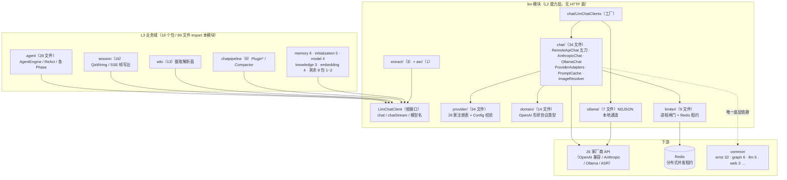
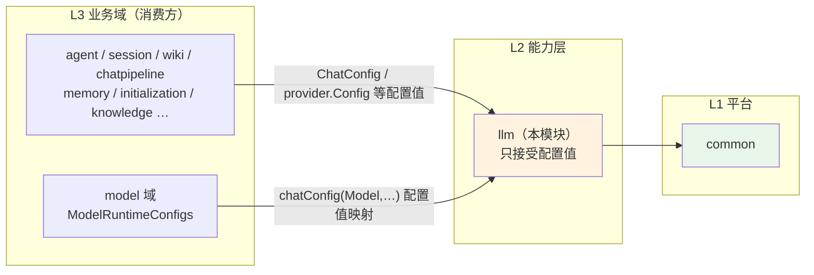
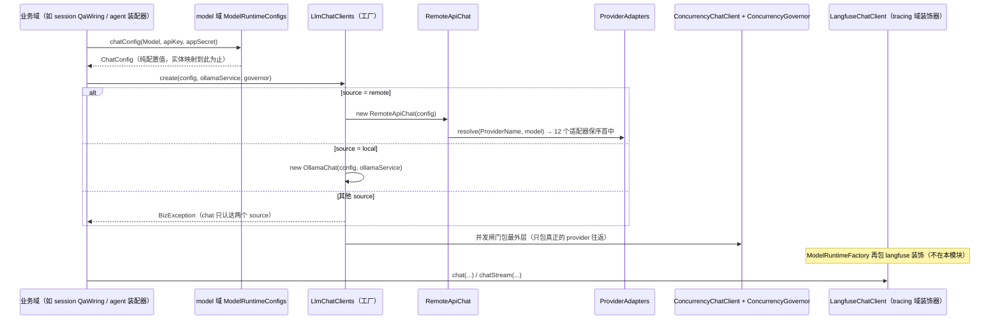
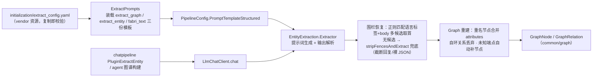
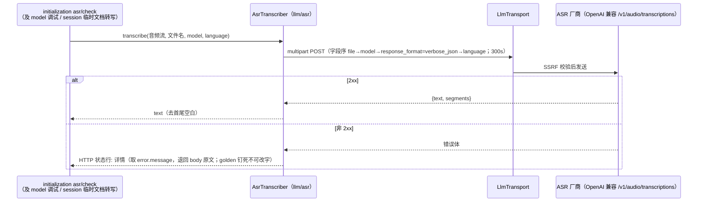

# llm 模块手册

> **面向读者**：第一次接手 `com.ragagent.llm` 的架构师 / 高级开发者。
> **目标**：30 分钟建立全局观 → 能定位改动点 → 能安全迭代（本模块有 176 个后端单测兜底，改错会立刻红）。
> **数据口径**：2026-10-08 实测（`wc -l` 口径）：**104 个 java 文件 / 约 1.16 万行 / 7 个子包**。
> **本文档的地位**：模块级导览；仓库级作业规范见仓库根 `HANDOFF.md`（§12 结构地图、§13 踩坑清单、§14 逐包重构范式）。

---

## 0. 一分钟速览

**它是什么**：全仓**对 LLM 厂商发请求的那一层**（L2 能力层，库式域）——把"一条聊天补全 / 一次实体抽取 / 一段语音转写"翻译成某家厂商的线上协议并收回来。

- **聊天客户端**：`LlmChatClient`（非流式 `chat` + 流式 `chatStream`）三条通道——26 家 OpenAI 兼容厂商统一走 `RemoteApiChat`，Anthropic 走独立 Messages 协议（`AnthropicChat`），本地 Ollama 走 NDJSON（`OllamaChat`）
- **provider 目录**：26 家厂商的运行时注册表（元数据 + 配置校验），厂商特有行为收敛在 12 个 `ProviderAdapter`
- **共享传输**：`LlmTransport`（进程级 `HttpClient` + SSRF 校验 + deadline 超时），chat / asr 复用同一条出站路径
- **横切能力**：prompt 缓存（`PromptCache`）、图片入模（`ImageResolver`）、thinking 编码、并发闸门（`limiter/`，chat/vlm/embedding 三类客户端共享）
- **两个小 子域**：`extract/`（实体抽取的提示词装载 + LLM 输出解析）、`asr/`（语音转写接缝）

**它不是什么**（别在这里改）：

| 不负责 | 归属 |
|---|---|
| 模型实体、凭据管理、HTTP 目录（golden 钉住的 `/providers` 响应） | `model` 域（`Model→ChatConfig` 的映射在其 `service/ModelRuntimeConfigs`，2026-09-30 从本域收回） |
| embedding / rerank 的厂商客户端 | 同名能力包 `embedding` / `rerank`（同属 L2，与 `llm` 平级；只有 limiter 手法同源） |
| 业务编排（什么时候调模型、消息怎么拼） | `chatpipeline` / `agent` / `session` |
| VLM 视觉调用 | `retrieval` 域的 `VlmClient`（复用本模块 `LlmTransport` 出站） |
| 跨域事件协议枚举 `ResponseType`、`ToolResult` | `common/llm`（本域只引用） |
| tracing 装饰（langfuse 包装） | `tracing/langfuse/LangfuseChatClient`（在 `model` 域 `ModelRuntimeFactory` 装饰层套上） |

### 图 1：模块全景



**三个必须知道的数字**：最大类 760 行（`AnthropicChat`，独立 Messages 协议整实现，<800 合规）；`chat/` 占 6,373 行（约 55% 的代码量，是绝对主体）；消费面 99 个文件分布 18 个包——它是全仓被依赖第二广的能力层（仅次于 `common`）。

---

## 1. 目录结构与职责

### 1.1 子包清单（放什么 / 不放什么）

| 子包 | 文件/行数 | 放什么 | **不放什么** |
|---|---|---|---|
| 根 | 2 / 42（接口 + package-info） | `LlmChatClient`——本模块唯一门面接口 | 任何实现（→ `chat/`） |
| `chat/` | 34 / 6,373 | 三条通道（`RemoteApiChat` 五刀 + `AnthropicChat` + `OllamaChat`）、工厂 `LlmChatClients`、适配器族 `ProviderAdapter(s)`、传输 `LlmTransport`、SSE 读帧 `SseReader`、`PromptCache` / `ImageResolver` / thinking 族 | 业务编排、HTTP 端点 |
| `provider/` | 34 / 1,689 | `ProviderRegistry`（26 家）+ 26 个 `*Provider`（元数据 + `validateConfig`）+ `Config`/`ProviderName`/`ModelType`/`ProviderInfo` 等目录类型 | 聊天协议实现（在 `chat/`） |
| `domain/` | 14 / 919 | OpenAI 形状协议类型：`ChatMessage`/`ChatOptions`/`ChatResponse`/`StreamResponse`/`ToolCall` 等 | 落库实体（本域无表）、SSE 之外的请求/响应 DTO |
| `limiter/` | 9 / 645 | 进程级 `ConcurrencyGovernor` + per-model 信号量（本地/Redis 租约 ZSET）+ `RuntimeStat` 观测 | 按业务的限流策略 |
| `ollama/` | 7 / 924 | `OllamaService`（`/api/chat`·`/api/tags`·`/api/pull`… 本地管理面）+ 强类型请求/响应 | 远程厂商逻辑 |
| `extract/` | 3 / 717 | `ExtractPrompts`（config.yaml `extract` 段装载）+ `PipelineConfig`（配置切片）+ `EntityExtraction`（提示词生成 + 输出解析/图重建） | 抽取编排（→ `chatpipeline` PluginExtractEntity） |
| `asr/` | 1 / 276 | `AsrTranscriber` 接缝 + OpenAI 兼容 `/v1/audio/transcriptions` 缺省实现 | ASR 业务校验（→ `initialization`） |

> 注：对照 §14.5 判据"每个子包有 package-info"，本域目前**只有根 1 份** package-info（各子包职责见本表）；补齐属低优先卫生项（§9）。

### 1.2 依赖方向（L2 能力层，只出不进）



**两条已经解开的环**（接手前发生过、别再绕回去）：

- `llm ⇄ retrieval`：`StreamResponse.knowledge_references` 的类型改用 `common/retrieval/SearchResult`（2026-09-30 批 ④-h，`SearchResult` 是零域依赖的 SSE 契约载荷）。
- `llm ⇄ model`：`fromModel(Model)` 五个静态工厂从能力层配置类收回 `model/service/ModelRuntimeConfigs`（批 ④-b）。**给 `ChatConfig` 加字段时，映射在 model 域改，不在本域**。

本域对 `ragagent` 的 import 只有 `common`（53 个文件：`error` 32 / `graph` 6 / `llm` 5 / `web` 3 / `security` 3 / `deployment` 2 / `storage` 1 / `retrieval` 1）+ 自身——零 L3 直连，守卫（`check-package-cycles.py`）钉着。

---

## 2. 数据模型

**本域没有数据库表**——它是纯客户端层，不落库、不建实体。它的"数据"全是**协议类型**（跨进程字节契约）与**配置值类型**（进程内传值）。

### 2.1 协议类型（`domain/`，OpenAI 形状）

| 族 | 类型 | 说明 |
|---|---|---|
| 请求侧 | `ChatMessage` / `MessageContentPart` / `ImageUrl` | 多内容消息（文本 + 图片）；role + content |
| 请求侧 | `ChatOptions` | 采样参数（temperature/topP/seed/maxTokens/惩罚项）+ `thinking` + `tools` + 完成预算 |
| 请求侧 | `ChatTool` / `FunctionDef` | 函数工具声明 |
| 配置值 | `ChatConfig` | source("local"/"remote") / baseUrl / apiKey / modelName / modelId / maxConcurrency / extraConfig / customHeaders |
| 响应侧 | `ChatResponse` / `TokenUsage` | 非流式补全 + token 账目 |
| 响应侧 | `StreamResponse` | **SSE 事件体核心结构**（见 2.3，线上契约） |
| 工具往返 | `ToolCall` / `FunctionCall` | `id`/`type`/`function`；`provider_metadata` 必须随 assistant 消息**原样往返**（厂商状态不漏给核心代码） |
| 缓存 | `PromptCacheStatus` / `CacheRetention` | prompt 缓存命中账目与保留档位 |

> ⚠️ `llm.domain.ToolCall` 与 `agent.domain.ToolCall` 是**两个不同类型**：前者是 LLM 线格式（模型吐的 tool_calls），后者是 agent 引擎的工具路由值对象。转换发生在 agent 域的装配层，别在本域 import agent。

### 2.2 配置值类型（L2 红线的落点）

| 类型 | 位置 | 说明 |
|---|---|---|
| `provider.Config` | `provider/` | 服务商校验配置：`provider/base_url/api_key/model_name/model_id/extra`，**JSON 键逐字段固定（snake）**——它是对外（model 域连通性测试）的线格式 |
| `ProviderName` | `provider/` | 26 个枚举值；未知值 → null（调用方处理） |
| `ModelType` | `provider/` | 声明序固定：Embedding, Rerank, KnowledgeQA, VLLM, ASR |
| `extract.PipelineConfig` | `extract/` | 管线配置切片（改写/意图系统提示词 + 抽取模板），装配期从 system setting / prompt template 构造 |

### 2.3 状态与枚举（SSE 契约面）

- **`ResponseType` 不在本域**：它在 `common/llm`（跨域事件契约枚举，批 ④-a 下沉），`StreamResponse.response_type` 引用它。
- `StreamResponse` 键形态：`id/response_type/content/done` **恒输出**；`knowledge_references/session_id/assistant_message_id/tool_calls/data/usage` 为空整键省略（NON_EMPTY）。`data` 的嵌套 map 由 `SortedMapSerializer` 按字母序归一。
- `knowledge_references` 类型是 `common/retrieval.SearchResult`；**chat 包自己从不设置该字段，只有 `session.sse` 契约层填**。

### 2.4 厂商线格式（登记冻结面）

本域 `@JsonProperty` 共 **172 处 / 27 文件**——全部属 HANDOFF §14.9 存量表 ②「已登记边界面」：**OpenAI 兼容请求体（snake，由对方 API 决定）、Anthropic Messages 请求体、provider.Config 校验面**。这些"仍是 snake"是**对的**，动它 = 改对第三方协议的映射，属 §11 边界，须独立切片。

---

## 3. 消费面：谁在调用我

> 本域是**库式域**：无 controller、无 HTTP 面（实测 `@RestController` 0 个）——**没有 §HTTP 接口面是对的**。它的"接口面"就是被谁 import、以什么形状调用。

### 3.1 消费方清单（99 文件 / 18 包，2026-10-08 grep 实测）

| 消费方包 | 文件数 | 代表调用点 | 用途 |
|---|---|---|---|
| `agent` | 28 | `AgentEngine`、`ReActIteration`、各 `*Phase`、`AgentStreamBridge` | agent 循环的补全与流式、工具调用往返 |
| `session` | 16 | `QaWiring`、`SessionAgentQaService`、`SessionKnowledgeQaService`、`StreamResponseBuilder`、`SseFrameWriter` | 问答链路拉起实例 + SSE 帧写出（`knowledge_references` 在这里填） |
| `wiki` | 13 | `DefaultWikiModelResolver`、`Fetcher`、`FileOps`、`TemporaryDocumentService` | wiki 摄取 / LLM 解析面 / 临时文档 |
| `chatpipeline` | 9 | `PipelinePorts`、`PluginChatCompletion(Stream)`、`PluginExtractEntity`、`PluginQueryUnderstand`、`Compactor` 族 | 管线各插件的模型调用 |
| `memory` | 6 | `DefaultMemoryModelResolver`、`MemoryExtractionLlm`、`MemoryConsolidationService` | 记忆抽取与合并 |
| `initialization` | 5 | `InitializationController`、`ModelConnectivityTestService`、`OllamaManageService`、`TextExtractionTestService` | 初始化连通性测试、asr/check、调试端点 |
| `model` | 4 | `ModelRuntimeFactory`、`ModelRuntimeConfigs`、`ModelDebugController` | 实例装配（装饰器层）与调试面 |
| `embedding` | 4 | `EmbedderFactory`、`EmbeddingHttp`、`ConcurrencyEmbedder`、`OllamaEmbedder` | 只借 limiter / HTTP 手法（embedding 是独立能力包，不走本模块通道） |
| `knowledge` | 3 | `ChunkExtractService`、`ChunkQuestionService`、`KnowledgeSummaryService` | 摘要、chunk 生成问题 |
| `rerank` | 2 | `RerankerFactory`、`RerankHttp` | 同 embedding，借手法 |
| `mcp` | 2 | `McpServiceController`、`McpUsageInstructionsOps` | 使用说明生成 |
| 其余 7 包各 1 | 7 | `websearch/SearchHttp`、`tracing/langfuse/LangfuseChatClient`、`stream/StreamEvent`、`storage/ChatLocalImageResolverWiring`、`retrieval/VlmHttpTransport`、`evaluation/MetricHook`、`config/ModelConcurrencyGovernorWiring` | 零散接缝 |

### 3.2 对外契约约定（改任何一处前必读）

| 约定 | 说明 |
|---|---|
| 传输接口 | `LlmChatClient.chat(List<ChatMessage>, ChatOptions)` / `chatStream(...)` / `getModelName()` / `getModelId()`——四方法即门面；实现可换，接口别动 |
| 流式语义 | `chatStream` **先同步建立连接、返回 `BlockingQueue<StreamResponse>`**：建立阶段错误立即抛；进入流后的错误经流内 ERROR 型 `StreamResponse` 传递（`finishReason="incomplete"`）；消费到 `done=true` 即结束（类 javadoc 原文钉死） |
| 工厂入口 | `LlmChatClients.create(ChatConfig, OllamaService, ConcurrencyGovernor)` 是生产唯一入口；`RemoteApiChat` 的构造签名被 `RemoteApiChatTest` **直 `new` 冻结**（§14.7.8），改签名先改测试床 |
| 配置值入参 | 本域只收**配置值**（`ChatConfig` / `provider.Config`），不收业务实体——`Model→ChatConfig` 映射在 `model/service/ModelRuntimeConfigs`（L2 红线，见 §1.2） |
| 协议冻结面 | `domain/StreamResponse`（SSE 事件体）、`domain/ToolCall.provider_metadata` 往返、`provider/Config` 的 snake 键、Anthropic / Ollama 线格式——全是登记边界面（§2.4），动它 = 动线上契约 |
| 目录一致性 | `provider/ProviderRegistry`（运行时）与 `model/service/ProviderRegistry`（HTTP 目录，golden 钉住）**同名不同物**，由 `ProviderCatalogParityTest` 逐字段比对——改任何一侧另一侧必须同批 |

---

## 4. 核心链路

### 4.1 生产装配链路（一个业务域怎么拿到一个可用的聊天客户端）



要点：装饰次序固定为**内层实现 → 并发闸门（最外）**；debug 包装器受 `LLMDebugEnabled` 控制、未启用等价直通；langfuse 包装发生在 `model` 域装配层。

### 4.2 一次流式补全的传输链路（RemoteApiChat 出站流水线）

```mermaid
sequenceDiagram
    participant C as 调用方
    participant R as RemoteApiChat（门面，492 行）
    participant Q as RemoteApiRequestOps
    participant H as RemoteHttpOps
    participant S as RemoteApiStreamOps
    participant P as RemoteApiResponseOps
    participant T as LlmTransport

    C->>R: chat / chatStream
    R->>Q: convertMessages → adapter.transformMessages
    R->>Q: buildChatCompletionRequest（OpenAI 标准体 + 采样参数 + 完成预算）
    R->>Q: shapedRequest（adapter.shapeRequest 厂商整形）
    R->>R: thinking 编码（extra_config.thinking_control 优先，其次 adapter.thinking()）
    R->>R: PromptCache.applyPromptCacheToJSONBody 注入缓存字段
    R->>H: adapter.endpoint 覆写 URL + adapter.auth 鉴权头 + 自定义头
    H->>T: POST（发送前 + 每次重定向前 SSRF 校验；deadline 施加在请求上）
    alt 非流式
        T-->>P: 200 body
        P-->>C: ChatResponse（usage / tool_calls 元数据回填）
    else 流式
        T-->>S: SSE 字节流
        S->>S: SseReader 逐帧 → OpenAiStreamState 聚合
        S-->>C: BlockingQueue&lt;StreamResponse&gt;（EOF / [DONE] → done=true 收尾）
    end
```

`RemoteApiChat` 是 2026-10-01 神类拆分的产物（1,366 → 492，§14.7.8 五刀：`RequestOps`/`BodyCodec`/`HttpOps`/`StreamOps`/`ResponseOps`；`BodyCodec` 里的 `goMarshal/goSorted` 是 **Go 字节形态**，provider 请求体仍依赖，属 §11 边界**别当遗产删**）。超时兜底：chat 300s / stream 600s（`WEKNORA_LLM_CHAT/STREAM_TIMEOUT_SECONDS` 可覆盖）；连接 10s、重定向 ≤10 次、跨域重定向剥凭据头。

### 4.3 结构化抽取（extract 子域）



### 4.4 ASR 转写（asr 子域）



> 它为什么在本域：原落 `initialization` 时被 model 调试 / session / retrieval 三个域反向依赖成环（批 ④-l 归位），复用 `LlmTransport` 出站与"按模型配置调 provider"的接缝。

---

## 5. 改哪里（场景 → 文件）

| 我想… | 主要改这里 | 别忘了 |
|---|---|---|
| 接一家新 provider（OpenAI 兼容） | `provider/` 新增 `*Provider` + `ProviderName` 加枚举 + `ProviderRegistry` **静态块与 `allProviders()` 两处同加**（顺序即对外目录序） | 补 `ProviderRegistryTest`/`ProviderValidationTest` 用例；`ProviderCatalogParityTest` 会逼你同批改 model 域 HTTP 目录 golden |
| 改某厂商的请求整形 / thinking / endpoint / 鉴权 | `chat/ProviderAdapters`（继承 `BaseProvider` 覆写一两个方法；**12 个适配器保序，首中即停，别重排**） | 新增适配器默认不命中——注册进 `REGISTRY` 才生效 |
| 改 OpenAI 协议组装 / 响应解析 | `chat/RemoteApiRequestOps`（出站）/ `RemoteApiResponseOps`（入站）/ `RemoteApiBodyCodec`（字节序） | 断言落在 `ObjectNode` 请求体 JSON 上（`RemoteApiChatTest` 的口径）；`goSorted` 是 Go 字节面，别顺手"清洗" |
| 改流式解析 | `chat/SseReader`（读帧）+ `OpenAiStreamState`（聚合）+ `RemoteApiStreamOps`（流式段） | 流错误走 ERROR 型 `StreamResponse`（finishReason=incomplete），不是抛异常 |
| 改 thinking 编码 | `chat/ThinkingStrategies` / `ThinkingEmitter` / `AnthropicChat` | `extra_config.thinking_control` 覆盖优先于适配器默认 |
| 改 prompt 缓存 | `chat/PromptCache` + `AnthropicCacheControl` | 指纹只覆盖稳定前缀（system + 确定性工具 schema）；原始 prompt 绝不做 metric label |
| 改超时 / 代理 / SSRF | `chat/LlmTransport`（`WEKNORA_LLM_CHAT/STREAM_TIMEOUT_SECONDS`） | 超时一律 deadline 施加在请求上，**别加客户端级 timeout**（会掐断流式） |
| 改图片入模形态 | `chat/ImageResolver`（`data:` / `http(s)://` / `resource://` / `local://` / `storage://` 五类） | 它已脱开 storage 域（B33），经 `common/storage/StorageRuntimeEnv` 取环境 |
| 加 / 改抽取模板 | `extract/ExtractPrompts`（改 `initialization/extract_config.yaml` 的解析）+ `extract/PipelineConfig` | YAML 未知键丢弃；模板与解析键配对改，别只改一侧 |
| 改实体抽取解析 / 图重建 | `extract/EntityExtraction`（围栏恢复、合并、自环、补节点） | 消费方是 chatpipeline 与 agent，输出形状是 `common/graph` |
| 改 ASR 行为 | `asr/AsrTranscriber` | 错误文案被 golden 钉死（`md-asr-*`、`w5b-asr-*` fixture），**不可改字** |
| 改并发闸门 | `limiter/ConcurrencyGovernor`（进程级，chat/vlm/embedding 共享）+ `ModelConcurrencyLimiter` / `RedisLimiter` | Redis 版是自愈租约 ZSET（心跳 ttl/3）；任何后端错误 fail open，绝不抛 |
| 改 Ollama 本地面 | `ollama/OllamaService` + `chat/OllamaChat` | 流式是 **NDJSON 不是 SSE**；Embeddings/Generate 强类型体属 embedding/rerank，这里只供原始 JSON |
| 改"模型行→运行时配置"映射 | **不在本域**：`model/service/ModelRuntimeConfigs` | 本域只认 `ChatConfig` 配置值（L2 红线） |
| 改 SSE 事件体形状 | `domain/StreamResponse` + `common/llm/ResponseType` | 动它 = 动 SSE 契约（前端同批 + session 域 fixture），须独立切片 |

---

## 6. 常见迭代 SOP

> 铁律：**一次只动一个轴**（拆类期不改协议、改协议期不拆类）；每步结束**全绿**再走下一步。

```bash
# 迭代中（秒级~1 分钟）：先跑本模块
cd ~/ragagent && JAVA_HOME=/opt/homebrew/opt/openjdk@21/libexec/openjdk.jdk/Contents/Home \
  ./gradlew :domains:test --tests "com.ragagent.llm.*" :domains:spotlessCheck
# 收口（结构搬迁批，约 3 分钟）：全量
cd ~/ragagent && JAVA_HOME=/opt/homebrew/opt/openjdk@21/libexec/openjdk.jdk/Contents/Home \
  ./gradlew :domains:test :domains:spotlessCheck
```

**A. 接新厂商**：`ProviderName` 枚举 → `*Provider`（元数据 + validateConfig）→ `ProviderRegistry` 两处注册 → `ProviderAdapters` 按需加适配器 → `ProviderCatalogParityTest` 逼出 model 域 golden 同批 → 补三件测试（Registry/Validation/Parity）→ 三绿 → 提交。

**B. 改协议映射**：先看 `RemoteApiChatTest` 现有断言（ObjectNode 口径）→ 改 `RequestOps`/`ResponseOps`/`BodyCodec` → 测试红绿驱动 → 若涉及 Go 字节序（`goSorted`），确认是否 §11 边界 → 三绿。

**C. 加配置字段**：`ChatConfig`/`provider.Config` 加字段 → **映射同步改 `model/service/ModelRuntimeConfigs`**（不在本域）→ `ModelRuntimeConfigs` 相关消费方（session/wiki/memory/mcp 解析器）过一遍 → 三绿。

**D. 加抽取能力**：`extract_config.yaml` 加模板 → `ExtractPrompts` 装载 → `PipelineConfig` 加切片 → `EntityExtraction` 解析 → chatpipeline 插件接线（归 chatpipeline 域批次）→ 三绿。

**E. 重构（拆类/移动）**：按 §14 七步；本模块先例是 `RemoteApiChat` 五刀（§14.7.8）——**门面全量薄委托、协作者每处经 `service.adapter` 取当前值（mutable 适配器不得构造期缓存，测试 setAdapter 会换）**、测试床直 new 冻结构造签名 → 每刀 `--rerun-tasks` 重编 + `--tests "com.ragagent.llm.*"` + spotless + 忠实性逐字比对 → 收官 clean 全量 + 环守卫。

---

## 7. 模块约定与坑（必读）

1. **流式的两段错误语义别混**：建连错误同步抛、流中错误走 ERROR 型 `StreamResponse`（`finishReason="incomplete"`）。消费方（session SSE / agent）都按这个写的（`LlmChatClient` javadoc 原文）。
2. **provider 请求体是 Go 字节形态面**：`RemoteApiBodyCodec` 的 `goMarshal/goSorted` 与 Go 工具面 5 类（`GoDoubleSerializer` 等）服务于 provider 出站；llm 的 172 处 `@JsonProperty` 全是 §14.9 登记冻结面——**别当 Go 遗产清**（HANDOFF §11 / §14.6）。
3. **两个 ProviderRegistry 同名不同物**：本域 `llm/provider/ProviderRegistry`（运行时路由与校验）vs `model/service/ProviderRegistry`（HTTP 目录，golden + 前端映射）。两层同源由 `ProviderCatalogParityTest` 钉死，**新增厂商必须两层同批**（类 javadoc 原文警告）。
4. **新增厂商两处注册**：`ProviderRegistry` 静态块 + `allProviders()`；注册顺序 = `List/ListByModelType` 的输出顺序（javadoc 钉死）。
5. **超时是 deadline 不是 client timeout**：客户端级超时会把流式提前掐断；deadline 经 `LlmTransport.withLlmTimeout` 施加在请求上（类 javadoc 写明理由）。兜底 chat 300s / stream 600s，环境变量可覆盖。
6. **SSRF 守卫是共享单例**：`LlmTransportWiring` 把 Spring 管的 `SsrfGuard` 注入 `LlmTransport`——白名单可被系统设置运行时调谐，**传输层自己 new 一个就会看不见调谐**（类 javadoc 原文）。
7. **Ollama 流式是 NDJSON 不是 SSE**（`Accept: application/x-ndjson`）；且基址指向 ollama.com 的鉴权分支刻意不实现（只服务私部署）。
8. **ASR 错误文案被 golden 钉死**（`md-asr-*` / `w5b-asr-*` fixture）——`HTTP <状态行>: <详情>` 的格式与 `error.message` 回退链不可改字。
9. **`knowledge_references` 不是 chat 填的**：`StreamResponse` 该字段只有 `session.sse` 契约层设置；类型 `common/retrieval.SearchResult` 是解 `llm ⇄ retrieval` 环的产物，别"顺手"改回 retrieval 域类型。
10. **`ToolCall.provider_metadata` 必须随 assistant 消息原样往返**（如 Gemini `extra_content`），否则厂商字段教不回核心 agent 代码（字段 javadoc 钉死）。
11. **闸门纪律**（HANDOFF §13.4/§13.9 对全模块适用）：绿要"正向证据"（`BUILD SUCCESSFUL` + 测试 XML `failures+errors==0`），编译绿 ≠ 测试绿；全量出现孤零零 1 个失败先 `env | grep SYSTEM_AES`（shell 泄漏环境变量的假回归）。
12. **两处陈旧 javadoc**（2026-10-08 实测，见 §9）：`ChatConfig` 仍提 `fromModel`（已收回 model 域）；`LlmChatClients` 写"其余 27 个 OpenAI 兼容厂商"（B62 裁撤云后实测 `ProviderName` 26 值）。

---

## 8. 测试与验证

- **规模**：**176** 个 `@Test`（20 个测试类；其中 1 个 `@Disabled`——`RemoteApiChatTest` 的实商密钥用例，需 `DEEPSEEK_API_KEY`/`ALIYUN_API_KEY`，对照 Go 的 t.Skip 分支）。分布：`chat/` 14 类 138 用例、`provider/` 4 类 23 用例、`limiter/` 2 类 15 用例。
- **无自有契约 fixture**：本模块测试**不起 Spring、不读 `contracts/` 目录**——`RemoteApiChatTest` / `LlmTransportTest` 用 `com.sun.net.httpserver.HttpServer` 起进程内真实 HTTP stub，断言落在 **`ObjectNode` 请求体的 JSON 上**（"那才是线上契约"，测试类 javadoc 原文）。跨模块 golden 面在消费侧：model 域目录 golden（`model-providers*.json`）、ASR 文案（`md-asr-*` / `w5b-asr-*`）、初始化（`init-put-config-*`）。
- **哨兵测试**：`ProviderCatalogParityTest`（1 用例）钉本域注册表与 model 域 HTTP 目录逐字段一致；`LlmTransportTest` 不改环境变量（跨环境不可靠），改测等价纯函数 `parseDurationSeconds`。
- **语义比较口径**：不适用（本模块无 golden 对比）；对第三方协议形状的钉法是"构造请求 → 断言序列化后的 JSON 键值"。
- **已知偶发 2 例**（全仓口径，遇到先单独重跑，别误判回归；均不在本模块）：
  - `WebToolsRecordingTest.searchWithContentFetchesLeadingPagesViaSharedFetchTool`（全量并发下偶发）
  - `EvaluationContractTest.getTerminalRunsExecution`（全量并发下偶发；单独 `--tests "*EvaluationContractTest"` 通过）

---

## 9. 已知待办与风险（接手后优先看）

| 项 | 性质 | 建议 |
|---|---|---|
| 子包无 package-info（仅根 1 份） | 卫生债 | 对照 §14.5"每个子包有 package-info"是欠账；§1.1 表可作底稿，随该子包下一批顺手补 |
| `ChatConfig` javadoc 仍指 `fromModel`（映射已收回 `model/service/ModelRuntimeConfigs`） | 陈旧注释 | 随触碰清洗（§13 惯例：先摘不变量再删），不搞专项 |
| `LlmChatClients` javadoc "其余 27 个 OpenAI 兼容厂商" | 数字陈旧 | B62（2026-10-04）裁撤 WeKnora Cloud 后实测 `ProviderName` 26 值；随触碰改为 26（含 Anthropic 独立通道）或直接写"其余全部" |
| provider 请求面的 Go 字节兼容退役 | 进行中（B37 档 3） | 第一刀已退役三份 provider GoJson 副本（embedding/rerank/websearch → `common/web/ProviderJson`）；本模块 `RemoteApiBodyCodec` 的 `goMarshal/goSorted` 待后续批次，**在那之前别动**（§11 边界） |
| `AnthropicChat` 760 行，本域最大类 | 观察项 | <800 合规（整协议实现单一关注点）；若继续长，按 §13.1 侦察后沿 Anthropic 请求/流式/工具三段拆 |
| `provider/Config.validateConfig` 尚无生产调用点（仅测试） | 接缝预留 | 接口 javadoc 已注明"供运行时客户端接入时复用"——接之前别删 |

---

## 10. 速查：本模块的"地标"

| 想知道 | 看这里 |
|---|---|
| 业务方怎么拿到一个聊天客户端 | §4.1 + `chat/LlmChatClients`（工厂）+ `model/service/ModelRuntimeConfigs`（配置映射） |
| 一条消息怎么变成厂商请求 | §4.2 出站流水线 + `chat/RemoteApiChat`（门面）→ 五个 `RemoteApi*Ops` |
| 某厂商的特殊行为在哪 | `chat/ProviderAdapters`（12 个适配器，保序首中）+ `chat/BaseProvider`（默认实现） |
| 流式一帧怎么变成 `StreamResponse` | `chat/SseReader` → `chat/OpenAiStreamState` → `chat/RemoteApiStreamOps` |
| SSE 事件体长什么样 | `domain/StreamResponse`（javadoc 即契约）+ `common/llm/ResponseType` |
| 工具调用怎么往返 | `domain/ToolCall` / `FunctionCall` + `RemoteApiStreamOps` / `RemoteApiResponseOps` 的元数据回填 |
| 超时 / SSRF / 重定向在哪管 | `chat/LlmTransport`（常量与 javadoc 写尽）+ `chat/LlmTransportWiring` |
| 有哪 26 家厂商、目录顺序谁定 | `provider/ProviderRegistry`（静态块序 = 对外序）+ `provider/ProviderName` |
| thinking / prompt 缓存 / 图片怎么进请求 | `chat/ThinkingStrategies` / `chat/PromptCache` + `AnthropicCacheControl` / `chat/ImageResolver` |
| 实体抽取的提示词与解析 | `extract/ExtractPrompts`（yaml 装载）+ `extract/EntityExtraction`（围栏恢复 + 图重建） |
| 语音转写走哪 | `asr/AsrTranscriber`（OpenAI 兼容 transcriptions，复用 `LlmTransport`） |
| 并发怎么限 | `limiter/ConcurrencyGovernor`（进程级）+ `ModelConcurrencyLimiter` / `RedisLimiter`（租约 ZSET） |
| 本地 Ollama 管理面 | `ollama/OllamaService`（NDJSON 心跳/拉模型/删模型） |
| 目录为什么这样分 | 根 `package-info.java`（本域唯一一份）+ 本文 §1 |
