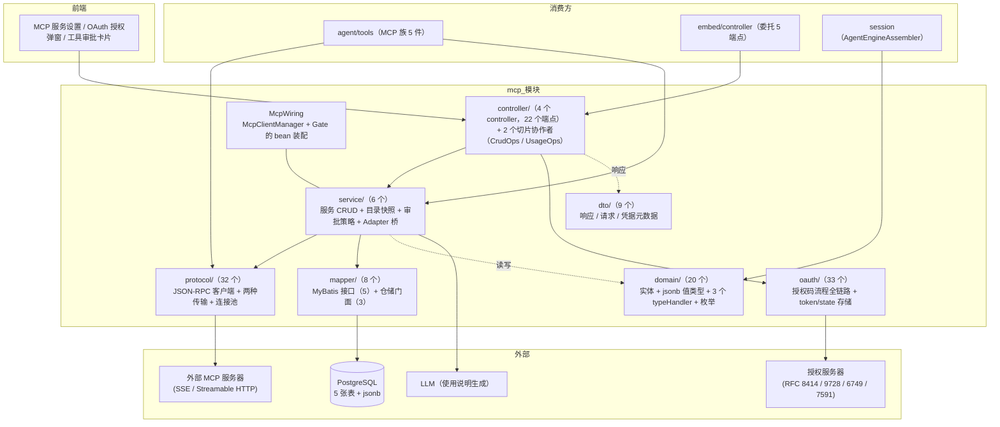
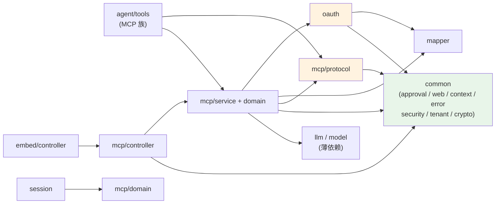
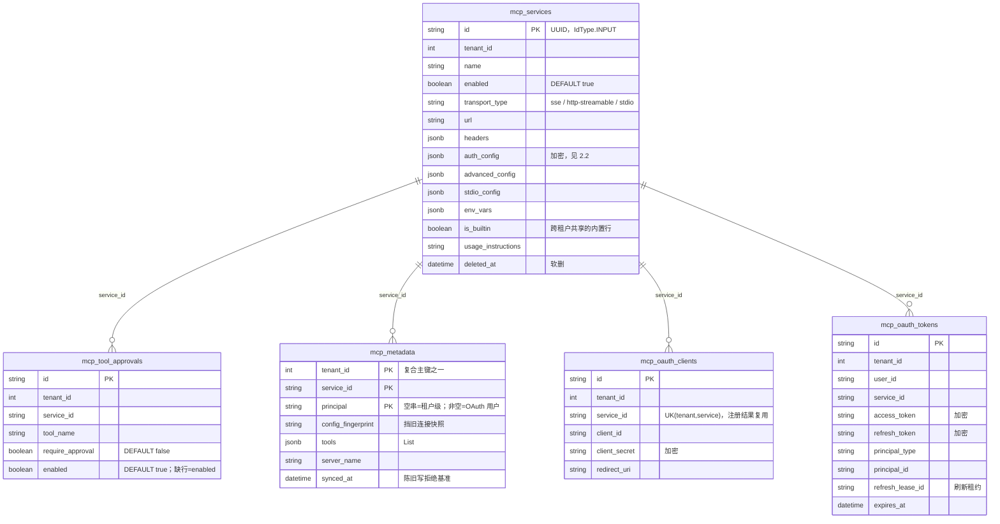
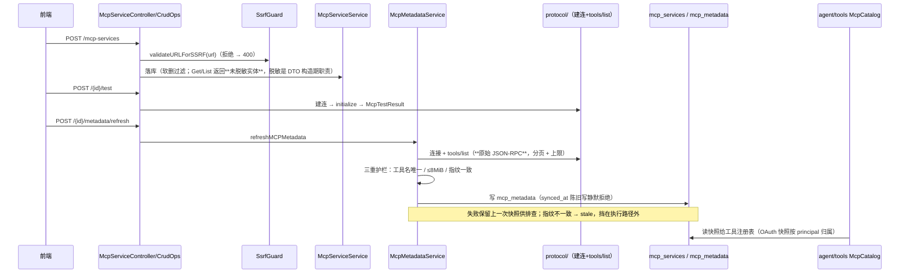
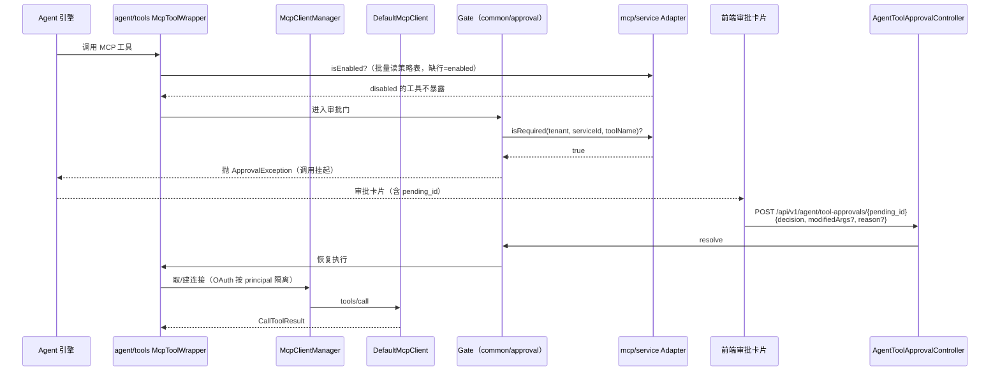
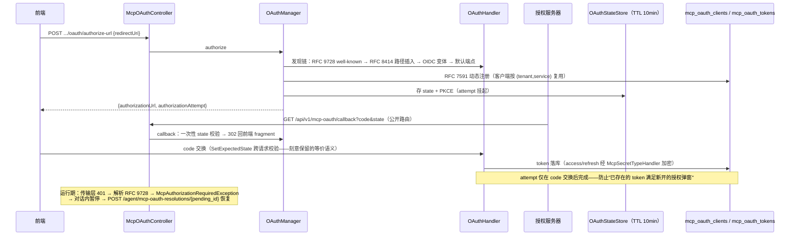
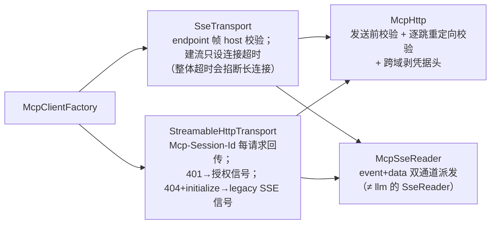

# mcp 模块手册

> **面向读者**：第一次接手 `com.ragagent.mcp` 的架构师 / 高级开发者。
> **目标**：30 分钟建立全局观 → 能定位改动点 → 能安全迭代（本模块有 245 个后端用例兜底，改错会立刻红）。
> **数据口径**：2026-10-08 实测（`wc -l` 口径）：**116 个 java 文件 / 约 1.28 万行 / 7 个子包**。
> **本文档的地位**：模块级导览；仓库级作业规范见仓库根 `HANDOFF.md`（§12 结构地图、§13 踩坑清单、§14 逐包重构范式）。

---

## 0. 一分钟速览

**它是什么**：Model Context Protocol 的**仓内全自研实现**（无第三方 SDK）——把外部 MCP 服务器接进来，把它的工具喂给 Agent，并管好这条路上的三件事：**协议客户端**（JSON-RPC 2.0 over HTTP/SSE）、**OAuth2 授权**（发现 / 动态注册 / PKCE / 回调 / 刷新，含每用户 token）、**服务注册与逐工具审批策略**。

- 服务注册面：`/api/v1/mcp-services` 的 CRUD + 连接测试 + 目录快照 + 使用说明 LLM 生成
- 工具治理面：逐工具的审批（requireApproval）/ 暴露（enabled）策略，经 `Adapter` 桥进 `common/approval` 的 Gate
- 协议面：SSE 与 HTTP Streamable 两种传输、连接池、工具目录分页与上限
- OAuth 面：授权码流程全链路 + 对话内授权恢复（`/agent/mcp-oauth-resolutions/*`）

**它不是什么**（别在这里改）：

| 不负责 | 归属 |
|---|---|
| 工具注册表 / Agent 执行循环 / MCP 工具包装（`McpToolWrapper` / `McpCatalog` / `McpExposure` 等约 5 件） | `agent/tools`（MCP 族因与 `ToolRegistry` 同包紧耦合留 agent 根，见 backend-package-map §P2） |
| 审批门机制本体（`Gate` / `Checker` / `Decision` / 挂起-恢复协议） | `common/approval`（本模块只提供 `Adapter` 桥与策略数据） |
| 会话编排与聊天 SSE 帧 | `session` / `stream` |
| LLM 调用与凭据（使用说明生成） | `llm` / `model`（经 `LlmChatClient` / `ModelService` 薄依赖） |
| 嵌入渠道公开面的 MCP 委托端点（5 个） | `embed`（`EmbedChannelDelegateOps` 直接调本模块 controller） |

### 图 1：模块全景



**三个必须知道的数字**：`oauth/` + `protocol/` 两个子包 **7,051 行，占全模块 55%**——本模块的大头是"连别人"，不是 CRUD；端点只有 **22 个**，背后是 **5 张表**（管理面薄、协议面厚）；最大类 **605 行**（`McpServiceService`），≥800 行神类已于 2026-10-01 清零（`McpServiceController` 937→372、`OAuthHandler` 825→220，HANDOFF §14.7.10）。

---

## 1. 目录结构与职责

### 1.1 子包清单（放什么 / 不放什么）

| 子包 | 文件/行数 | 放什么 | **不放什么** |
|---|---|---|---|
| `controller/` | 6 / 1,776（4 controller + `McpServiceCrudOps`/`McpUsageInstructionsOps` 两个切片协作者） | `@RestController`：RBAC 依赖、调服务层、拼响应 | 协议细节（→ `protocol/`）、SQL |
| `service/` | 6 / 1,289 | `McpServiceService`（服务 CRUD + 凭据）、`McpMetadataService`（目录快照）、`McpToolApprovalService`（逐工具策略）、`Adapter`/`McpToolPolicySource`（审批桥，自 `agent/approval` 下沉） | 传输与握手（→ `protocol/`） |
| `oauth/` | 33 / 3,619 | 授权码流程全链路：发现（`OAuthDiscovery`）、动态注册、`OAuthHandler`（协议客户端）、`OAuthManager`（编排）、token/state 存储、RFC 文档类型 | 非 OAuth 的协议报文（→ `protocol/`） |
| `protocol/` | 32 / 3,432 | JSON-RPC 2.0 客户端（`DefaultMcpClient`）、连接池（`McpClientManager`）、两种传输（`SseTransport` / `StreamableHttpTransport`）、出站安全底座（`McpHttp`）、哨兵错误（`McpErrorCode`） | OAuth 编排（→ `oauth/`）、落库 |
| `domain/` | 20 / 1,410 | 实体（4 个 `@TableName` + 1 个复合主键实体）+ jsonb 值类型 + **3 个自定义 typeHandler** + 传输/鉴权枚举 | 请求/响应形状（→ `dto/`） |
| `mapper/` | 8 / 806 | 5 个 MyBatis 接口 + **3 个仓储门面**（`McpMetadataRepository` / `McpOAuthRepository` / `McpToolApprovalRepository`）——本模块没有独立 `repository/` 子包，仓储门面放这里 | 业务判断（→ `service/`） |
| `dto/` | 9 / 389 | `McpServiceResponse`（**无秘密字段的编译期不变式**）、凭据元数据、请求记录、`RoleVisibility`（角色投影） | 持久化注解 |
| （根） | 2 / 71 | `package-info.java` + `McpWiring`（`McpClientManager` 与 `Gate` 的 bean 装配，消费方此前 `Optional` 注入的缺省兜底由此消除） | — |

> ⚠️ 与 knowledge 等范本域不同：**7 个子包都没有 `package-info.java`**（全模块只有根 1 份，已登记 §9）。接手时包职责以本表 + 各类 javadoc 为准。

### 1.2 依赖方向（只允许向下；全仓零包间环）



**枢纽说明**：`agent ⇄ mcp` 环已于 2026-09-30 解掉（backend-package-map §P0 批 4-a）——共享事件枚举 `ResponseType` → `common/llm`、审批机制 `agent/approval` → `common/approval`，MCP 专用的 `Adapter`/`McpToolPolicySource` 下沉到 `mcp/service`。**别把它们再搬回 agent**。另一处刻意设计：`OAuthManager` 依赖 `McpServiceMapper` 而非 `McpServiceService`，避免 `McpServiceService → Optional<McpOAuthSupport> → OAuthManager → McpServiceService` 的 Spring 循环（两处 javadoc 均有注明，同查询语义走 `getByIdForTenant`）。

---

## 2. 数据模型

### 2.1 ER 图（5 张表，见 `migrations/versioned/V1__baseline.sql` 571–668 行）



> `mcp_metadata` 复合主键 (tenant_id, service_id, principal)：MyBatis-Plus 不支持复合主键的 BaseMapper 方法，`McpMetadataMapper` **刻意不继承 BaseMapper**、全部语句显式书写；陈旧写入用 `UPDATE … AND synced_at <= #{syncedAt}` 静默拒绝（慢刷新不得覆盖新快照）。OAuth 快照按授权 principal 归属，**绝不可**变成租户级共享。

### 2.2 jsonb 列与值类型对照

| 列 | 值类型 / typeHandler（`domain/`） | 说明 |
|---|---|---|
| `mcp_services.headers` / `env_vars` | `Map<String,String>`（`PgJsonTypeHandler`） | **用户自定义键**，原样映射；键序按字节序稳定输出 |
| `mcp_services.auth_config` | `McpAuthConfig`（`McpAuthConfigTypeHandler`） | 7 键 camel；**apiKey/token 落库加密、读回宽容解密**都在 handler 里 |
| `mcp_services.advanced_config` | `McpAdvancedConfig`（`PgJsonTypeHandler`） | 3 键（timeout 等） |
| `mcp_services.stdio_config` | `McpStdioConfig`（`PgJsonTypeHandler`） | stdio 保留类型但传输硬禁用（§7.5） |
| `mcp_metadata.tools` | `List<McpTool>`（`McpToolListTypeHandler`） | 提交护栏：序列化 ≤ 8 MiB、工具名非空且不重复 |
| `mcp_oauth_tokens.access_token` / `refresh_token` | `McpSecretTypeHandler`（加密） | 密钥列；mapper 侧 `@Result`/`#{}` 均显式带 handler |
| `mcp_oauth_clients.client_secret` | `McpSecretTypeHandler`（加密） | 动态注册的客户端密钥 |

**硬约定（本模块特有）**：
1. 只有 `McpService` 带 `@TableName(autoResultMap = true)`；`mcp_oauth_tokens` / `mcp_oauth_clients` 的密钥列**不走 autoResultMap**，靠 mapper 显式 `@Result(typeHandler=…)` + 写 SQL 时 `#{…, typeHandler=…}` 三参写法——改这两张表的查询时**别漏了显式声明**（`@Select` 的自定义投影不会自动套实体注解，见 known-issues/01 §5）。
2. `McpToolListTypeHandler` 曾用 `@JsonProperty("require_approval")` 的 mixin 做键名别名——M1 换锚时**同时**退役 mixin 并迁移存量行，否则旧行读出来 `requireApproval` 会被宽容读静默重置为 false。改任何落库键名前先想"旧行读回来会怎样"。

### 2.3 状态与枚举

| 枚举 / 状态 | 取值 | 用在哪 / 注意 |
|---|---|---|
| `McpTransportType` | `sse` / `http-streamable` / `stdio` | `stdio` **保留类型但传输层硬禁用**（命令注入），双重拒绝，别"修好" |
| `McpAuthType` | `""`(=NONE，历史行兼容，别改成 "none") / `api_key` / `bearer` / `oauth` | **读宽松**（`fromValue` 未知非空值→null）、**写严格**（`parseStrict` 未知值抛异常转 400），见 §7.6 |
| `McpErrorCode`（protocol 哨兵） | 10 个取值，每个带固定对外文案 `wireMessage()`（如 `authorization required`） | 改文案 = 改对外可见错误，语料钉住 |
| `McpMetadataException.Kind` | 8 个：`SERVICE_NOT_FOUND` / `PRINCIPAL_REQUIRED` / `OAUTH_REQUIRED` / `STORAGE_UNAVAILABLE` / `CONNECTION_CHANGED` / `TOO_LARGE` / `INVALID_TOOLS` / `OTHER` | 控制器按 Kind 映射 HTTP 状态码（§7.11） |
| `OAuthAuthorizationStatus` | `authorized` / `refreshable` / `reauth_required`（字符串常量，非枚举） | 过期行不算已授权；`expiresAt=null` 表示"不过期"，4 键恒输出 |
| `McpToolApproval` 缺行语义 | 缺行 = `enabled=true`（向后兼容） | Java boolean 零值是 false 而 DB 列默认 true，仓储必须显式写入 |

---

## 3. HTTP 接口面

### 3.1 端点分组（4 个 controller / 22 个端点；RBAC 规则集中在 `config/WebConfig` 231–252 行）

**服务资源面**（`McpServiceController`，前缀 `/api/v1/mcp-services`，13 个）

| 方法 | 路径 | 用途 | RBAC |
|---|---|---|---|
| POST | `/` | 创建（201 裸对象；URL 过 `SsrfGuard` 校验） | Admin+ |
| GET | `/` | 列表（裸数组） | Viewer+ |
| GET | `/{id}` | 详情（裸对象；`usageInstructions` 恒为第一字段） | Viewer+ |
| PUT | `/{id}` | 更新（存在性映射；**正文永不携带秘密**） | Admin+ |
| DELETE | `/{id}` | 软删（204） | Admin+ |
| POST | `/{id}/test` | 连接测试（裸 `McpTestResult`） | Admin+ |
| GET | `/{id}/tools` · `/{id}/resources` | 工具 / 资源目录（裸数组；本行 2 个端点） | Viewer+ |
| GET | `/{id}/metadata` | 目录快照；**从未同步 = 裸 JSON null**（显式 `NullNode`） | Viewer+ |
| POST | `/{id}/metadata/refresh` | 刷新快照（静态鉴权写租户共享快照时 handler 内升 Admin+） | Viewer+ |
| POST | `/{id}/usage-instructions/generate` | LLM 生成使用说明 | Admin+ |
| GET | `/{id}/tool-approvals` | 工具策略列表（裸数组） | Viewer+ |
| PUT | `/{id}/tool-approvals/{tool_name}` | 写策略（204；`requireApproval`/`enabled` 至少一个） | Admin+ |

**凭据子资源**（`McpCredentialsController`，2 个，均 Admin+）：`PUT /api/v1/mcp-services/{id}/credentials`（写 apiKey/token，成功后**回收活动连接**使新凭据立即生效）、`DELETE .../credentials/{field}`（204 幂等；`field` 取 `apiKey`/`token`，镜像响应里 credentials 映射的键名）。拆出这个子资源的理由：从契约层面消灭"掩码值回传覆盖已存密钥"。

**OAuth 用户面**（`McpOAuthController`，前缀 `/api/v1`，6 个）

| 方法 | 路径 | 用途 | RBAC |
|---|---|---|---|
| POST | `/mcp-services/{id}/oauth/authorize-url` | 发起授权 → 裸 `{authorizationUrl, authorizationAttempt}` | Viewer+ |
| GET | `/mcp-oauth/callback` | 授权服务器回跳；**公开路由**（`AuthFilter.NO_AUTH_API` 放行，一次性 state 自证），**不得**加 RBAC 规则 | 公开 |
| GET | `/mcp-services/{id}/oauth/status` | 授权状态（裸 4 键恒输出；可带 `authorization_attempt` 只认本次流程） | Viewer+ |
| DELETE | `/mcp-services/{id}/oauth/token` | 撤销当前用户 token（204） | Viewer+ |
| POST | `/agent/mcp-oauth-resolutions/{pending_id}` | 对话内授权完成 → 恢复被暂停的 Agent 工具调用（204） | Viewer+ |
| POST | `/agent/mcp-oauth-resolutions/{pending_id}/cancel` | 用户跳过授权 → 解除 Agent 阻塞（204） | Viewer+ |

**人工审批**（`AgentToolApprovalController`，1 个）：`POST /api/v1/agent/tool-approvals/{pending_id}`（Viewer+，**刻意不收 Admin+**——审批卡片出现在调用者自己的会话里，真正的越权防线是 gate 内的 tenant/user 校验）。

> ⚠️ **RBAC 规则有顺序**：`WebConfig` 里"更具体的路径必须排在 `/mcp-services/*` 之前（首个命中生效）"——加子路径端点时新规则要插对位置。

### 3.2 契约约定（改接口前必读）

| 约定 | 说明 |
|---|---|
| 信封 | 服务资源面 / 审批面 / OAuth 用户面**全部裸对象或裸数组**（M1/M4 换锚收掉）；创建 201、删除与策略写入 204 |
| 键名 | 全 camelCase；`is_builtin` → **`builtin`**（布尔不带 is 前缀，否则 Jackson 同时吐 `builtin` 与 `isBuiltin`） |
| 永久冻结 | `inputSchema` / `mimeType` 是 **MCP 协议规范字段名**（本来就是 camel），别按项目惯例改 snake；`McpAuthType` 的**枚举取值**（`api_key`/`bearer`/`oauth`）是取值不是键名，一律不动 |
| 永久冻结（RFC） | `OAuthToken`(RFC 6749 §5.1)、`AuthServerMetadata`(RFC 8414)、`OAuthProtectedResource`(RFC 9728)、`OAuthError`(RFC 6749 §5.2)——本域余 22 处 `@JsonProperty` **全部**在这里，别换锚（HANDOFF §14.9p） |
| 可空字段 | 显式输出 `null`（`metadata` 从未同步 = 裸 `NullNode`；`expiresAt=null` = 不过期）——Spring 对 null body 发空正文会炸掉前端 `JSON.parse` |
| 秘密 | 响应**永不**携带密钥值；"是否已配置"经 `credentials.apiKey.configured` 布尔暴露；回调 query 参数（`state`/`code`）与 URL fragment（`#mcp_oauth_result=...`）是弹窗↔前端的非 JSON 协议 |
| 校验文案 | 旧 snake 键名照抄 Go 原文（如 `redirect_uri is required`），属已登记的文案-键名不一致（cosmetic），别顺手改 |

---

## 4. 核心链路

### 4.1 服务接入与目录发现（创建 → 测试 → 快照 → 供数）



`McpClientManager`（连接池）的五条语义：按 cacheKey 复用（**OAuth 服务按 principal 隔离**，其余按 serviceId 共享）、并发建连去重、`updatedAt` 版本失效（配置变了旧连接退役）、等待者可独立取消、CloseClient 能退役 pending。凭据写入后必须关闭活动连接（`McpServiceService` 两条硬契约之一），否则下一次上游调用仍带旧凭据。

### 4.2 工具调用与审批桥接



`Adapter`（`mcp/service`）实现 `Checker + BulkEnabledChecker`，让 Gate 不必 import 服务层包；`McpToolPolicySource` 是本包定义的窄接口（`listByService`），`instanceof` 探测批量能力——**这就是 `agent ⇄ mcp` 解环后留下的缝合点，改审批语义先看这三个类**。策略仓储是**部分列**更新：`SetEnabled` 必须保留 approval、`SetRequireApproval` 必须保留 disabled（`McpToolApprovalService` javadoc 三条"不能被优化掉的语义"）。

### 4.3 OAuth2 授权码流程（每用户维度）



state 存储默认**内存 map**（单实例语义）；`weknora.mcp-oauth.redis-state-store=true` 才落 Redis——**多副本生产部署必须打开**，否则回调落到别的副本找不到 state（§7.3）。刷新决策留在自己的生命周期里：运行期传输拿到的是 `ManagedTokenStore` 包装（刷新租约 `refresh_lease_id` 在 token 行上）。

### 4.4 传输层（两种，一条安全底座）



`McpSseReader` 与 `llm/chat/SseReader` **不是同一个东西**：MCP 的 SSE 是 JSON-RPC 消息流，必须识别 `event:`（`endpoint` 帧给出 POST 地址）；同一条消息多个 `data:` 行是**覆盖**而非拼接；没有 `[DONE]` 终止帧。

---

## 5. 改哪里（场景 → 文件）

| 我想… | 主要改这里 | 别忘了 |
|---|---|---|
| 改服务 CRUD / 请求绑定 | `controller/McpServiceCrudOps`（+ `McpServiceController` 薄委托） | 存在性映射键名 camel；秘密只在凭据面 |
| 改凭据写入语义 | `controller/McpCredentialsController` + `service/McpServiceService` | 写完必须回收活动连接，否则新凭据不生效 |
| 改响应脱敏规则 | `dto/McpServiceResponse.from`（`includeDetail` 分支 + 内置服务额外剥离） | 响应类**没有**秘密字段是编译期不变式，别加回去 |
| 改目录快照 / 同步护栏 | `service/McpMetadataService` + `mapper/McpMetadataMapper` | 三重护栏 + 陈旧写拒绝；OAuth 快照按 principal |
| 改协议握手 / 工具目录 | `protocol/DefaultMcpClient` + `McpClientManager` | tools/list 走原始 JSON-RPC（保 oneOf/definitions）；连接池五条语义 |
| 改传输行为 | `protocol/SseTransport` / `StreamableHttpTransport` / `McpSseReader` | SSE 长连接不能套整体超时；`McpHttp` 的重定向校验别绕开 |
| 改 OAuth 流程 | `oauth/OAuthHandler`（协议客户端）+ `OAuthManager`（编排）+ `controller/McpOAuthController` | 发现链顺序、RFC 7591 注册、GitHub 兼容（200 也可能带 error） |
| 改 token / state 存储 | `oauth/DbTokenStore` / `ManagedTokenStore` / `OAuthStateStore` + `McpOAuthWiring` | state 改键名必须带部署窗口兼容读（`migrateLegacyKeys` 模式） |
| 改工具审批策略 | `service/McpToolApprovalService` + `mapper/McpToolApprovalRepository` | 部分列更新；缺行=enabled；空补丁拒绝 |
| 改审批桥 | `service/Adapter` + `McpToolPolicySource` + `McpWiring`（Gate 装配） | 这是 agent⇄mcp 的缝合点，动它要连 `common/approval` 一起看 |
| 加端点 | `controller/` 加方法 + `config/WebConfig` 加 RBAC 规则 | 具体路径规则排在 `/mcp-services/*` 之前；补 `mcp-*` fixture |
| 加 jsonb 字段 | `domain/` 值类型 + handler | **schema 两处同改**：`migrations/versioned/V1__baseline.sql` + `domains/src/test/java/com/ragagent/TestSchema.java`（191–237 行已有 5 张表）；存量行要迁移 SQL |
| 改密钥加密方式 | `domain/McpSecretTypeHandler` / `McpAuthConfigTypeHandler` + `common/crypto/CryptoService` | 读回宽容解密（历史明文行）；wrapper 更新要三参 typeHandler 写法 |
| 改使用说明生成 | `controller/McpUsageInstructionsOps`（LLM 输入拼装/摘录） | 门面留 static 薄委托（`McpUsageInputTest` static 直调） |

---

## 6. 常见迭代 SOP

> 铁律：**一次只动一个轴**；每步结束**全绿**再走下一步。本模块的契约面（裸对象 / 键名 / 204）已全部换锚完成，**别在重构批里顺手改契约**。

```bash
# 每次改动后必跑（约 3 分钟）
cd ~/ragagent && JAVA_HOME=/opt/homebrew/opt/openjdk@21/libexec/openjdk.jdk/Contents/Home \
  ./gradlew :domains:test :domains:spotlessCheck
# 迭代中先跑本域（秒级）
./gradlew :domains:test --tests "com.ragagent.mcp.*"
# 若动了前端可见契约（字段名/信封/状态码），同批带前端：
cd frontend && npx vue-tsc --build --force && npm test
```

**A. 改端点/契约**：`controller` → `dto`（显式输出 null）→ `WebConfig` RBAC 规则（注意顺序）→ 补 `mcp-*` fixture → 三绿。契约 fixture 支持重录开关 `-Dcontract.refresh=true`（`McpContractTest`，同 `EmbedContractTest`），**重录后必须结构化复核差异**（HANDOFF §13.12）。

**B. 改落库形状**：`domain`（值类型 + handler）→ `V1__baseline.sql` + `TestSchema` 两处同改 → `grep` 全仓"按旧键读取"的代码 → 存量行迁移 SQL → 三绿。落库键名改动必须想清楚旧行读回语义（mixin 退役教训，§2.2）。

**C. 改协议/传输**：`protocol/` 改动 → `McpClientProtocolTest` / `McpToolListingTest` / `McpSseTransportTest`（都跑 `McpServerStub` 假服务器）→ 三绿。哨兵文案（`McpErrorCode.wireMessage`）别改。

**D. 改 OAuth**：`oauth/` 改动 → `OAuthHandlerTest` / `OAuthLifecycleTest` / `OAuthStateStoreTest`（跑 `OAuthServerStub`）→ 三绿。涉及 Redis blob 键名时必须带 `migrateLegacyKeys` 式兼容读（部署窗口 = 一个 STATE_TTL=10min）。

**E. 重构（拆类/移动）**：按 HANDOFF §13 的 harness 流水线（侦察 → 边界 → 脚本 → 落刀 → 忠实性核验）；门面留薄委托（`McpServiceController.buildMCPUsageInput` 就是样板）；测试随类同包 `git mv`；三绿 → 提交。

---

## 7. 模块约定与坑（必读，全部有出处）

1. **密钥剥离是编译期不变式，不是运行时脱敏**：`dto/McpServiceResponse` 类里**根本没有**秘密字段；`McpServiceService` 的 Get/List 返回**未脱敏实体**（含明文 AuthConfig）仅供内部（客户端构造、凭据元数据推导）——别把未脱敏实体直接塞给控制器。（`McpServiceService`/`McpServiceResponse` javadoc；known-issues/01）
2. **审批策略"缺行 = enabled=true"**：工具清单来自上游 ListTools，`mcp_tool_approvals` 只存覆盖值。Java boolean 零值是 false 而 DB 列默认 true——仓储必须显式写，不能依赖实体默认值；补丁是部分列更新。（`McpToolApproval` / `McpToolApprovalService` javadoc；known-issues/01）
3. **OAuth state 默认内存存储**：`weknora.mcp-oauth.redis-state-store` 默认关（Java 的 `StringRedisTemplate` 只要依赖在 classpath 就存在，无法表达"没配 Redis"）。**多副本生产必须打开**，否则回调落到别的副本找不到 state。（known-issues/01 已知差异 4；`McpOAuthWiring` javadoc）
4. **RFC 协议面永久冻结**：`OAuthToken` / `AuthServerMetadata`(RFC 8414) / `OAuthProtectedResource`(RFC 9728) / `OAuthError`(RFC 6749 §5.2) 的字段名由规范/对方决定——本域余 22 处 `@JsonProperty` **全部**在这些类上，别"顺手 camel 化"。（HANDOFF §14.9p 收官判定）
5. **stdio 保留类型但传输硬禁用**（命令注入）：DTO 字段、`stdio_config` 列、枚举值都在，传输层双重拒绝——这是与 Go 对齐的刻意行为，别"修好"。（known-issues/01；`McpTransportType` javadoc）
6. **`McpAuthType` 读宽松 / 写严格**：2026-10-03 点检实锤——前端发 `"apiKey"`、枚举取值是 `"api_key"`，宽松读把整条鉴权策略静默写成 null，凭据被当成 X-API-Key 发出、用户"配了不生效"。**写侧必须走 `parseStrict`**（未知值 → 400），别在新的写路径上用 `fromValue`。（`McpAuthType` javadoc）
7. **契约掩码按键名匹配**：`McpContractTest.UUID_KEY_PATTERN` 键改名必须同步放宽（M4 曾因漏 `serviceId` 让夹具混进随机 UUID，跑第二遍就红，像业务回归）。（HANDOFF §13.13；M4 执行记录）
8. **tools/list 走原始 JSON-RPC**：强类型 ToolInputSchema 会丢 `oneOf` 这类根级关键字、把 `definitions` 改写成 `$defs` 却不改引用——别"顺手"换成强类型。（`DefaultMcpClient` javadoc）
9. **回调路由的两条规矩**：注册在 `/mcp-services` 组**之外**（避开静态段与 `/{id}` 动态段歧义）；它是公开路由（授权服务器回跳不带本系统 bearer，靠一次性 state 自证），**不得**加 RBAC 规则。（`McpOAuthController` javadoc；known-issues/01）
10. **快照刷新的门禁顺序**：服务存在性校验与 Admin 门禁必须在重映射 try **之外**——放进 try 会让自家抛的 403 被异常映射的 default 分支改写成 400。（`McpServiceController.mcpMetadata` 内注释）
11. **异常 Kind → 状态码的映射别走样**：`OAUTH_REQUIRED` 必须直传（文案可操作），落进 `OTHER` 的通用文案正是 2026-10-03 点检修掉的问题。（`McpServiceController.mcpMetadataAppError` 注释）
12. **`OAuthManager` 刻意不依赖 `McpServiceService`**（Spring 循环依赖）；同查询语义走 `McpServiceMapper.getByIdForTenant`。往 OAuth 链上加服务层依赖前先想装配图。（`OAuthManager` / `McpOAuthWiring` javadoc）

---

## 8. 测试与验证

- **规模**（2026-10-08 实测）：`domains/src/test/java/com/ragagent/mcp/` 下 **31 个 java 文件**，其中 **27 个测试类 / 245 个 `@Test`**（另 4 个是测试基建：`McpServerStub`、`OAuthServerStub`、`FakeOAuthRepository`、`FakeOAuthStateRedis`）。分包：`controller/` 69、`protocol/` 58、`oauth/` 47、`service/` 39、`repository/` 12、`dto/` 11、`domain/` 5、根 `McpContractTest` 4（合计 245）。
- **fixture 前缀**：`domains/src/test/resources/contracts/` 下 **`mcp-*` 16 个**（create / list / get / update / delete / create-auth / create-forbidden-viewer / create-ssrf-rejected / not-found / test / tools / metadata / credentials-put / credentials-delete / credentials-bad-field / tool-approvals）。`McpContractTest` 掩码 UUID 与时间戳；支持 `-Dcontract.refresh=true` 重录。
- **比较口径**：金片对比走统一基建（**语义归一** + strip + 重录开关）；fixture 锚定的是本仓自己的行为。
- **协议测试有真替身**：`McpServerStub`（假 MCP 服务器）与 `OAuthServerStub`（假授权服务器）是功能替身，不是 mock——改传输/OAuth 行为时优先扩展替身而不是绕过它。
- **已知偶发 2 例**（全量并发下偶发，遇到先单独重跑，别误判回归；与本模块无关但会污染闸门）：
  - `WebToolsRecordingTest.searchWithContentFetchesLeadingPagesViaSharedFetchTool`
  - `EvaluationContractTest.getTerminalRunsExecution`（单独 `--tests "*EvaluationContractTest"` 通过）

---

## 9. 已知待办与风险（接手后优先看）

| 项 | 性质 | 建议 |
|---|---|---|
| 7 个子包无 `package-info.java`（全模块仅根 1 份） | 结构债 | 对齐 HANDOFF §14.5"每个子包有 package-info"目标；纯文档批，本文 §1.1 可直接作底稿 |
| `McpServiceController` 类 javadoc 的"响应形态"段落后于 M4（仍写"仅工具审批面带信封"，实际工具审批面已裸数组） | 文档债 | 顺手摘除或改写；以方法级注释与 fixture 为准 |
| create 可写入 `id` 与 `is_builtin` | 行为债 | Go 侧既有问题照抄（客户端可钉死主键、建跨租户可见的 builtin 行）；建议单独一批收紧（known-issues/01 已知差异 1） |
| create 时 `enabled` 恒为 true（GORM `default:true` 语义复刻） | 行为债 | Go 的 POST 实际无法创建 disabled 服务；收紧需连前端一起（known-issues/01 已知差异 2） |
| 使用说明生成的 WeKnoraCloud 凭据回落缺失（TenantService 无该读取口） | 未接线 | known-issues/01 已知差异 5；动 usage-instructions 前先确认 |
| LLM 客户端的 langfuse 追踪未实现 → MCP/LLM 观测数据不落 Langfuse | 观测债 | known-issues/01 已知差异 6 |
| `RoleVisibility.canViewIntegrationSecrets` 的 API key 分支待收口（javadoc 注明与 `ModelController` 同判定、待 API key 主体落地后统一） | 一致性 | 改脱敏判定时两处必须同批 |
| 22 处 `@JsonProperty` 第三方协议面 | 永久冻结 | **别动**（§7.4）；新改动别往这些类上加字段 |

---

## 10. 速查：本模块的"地标"

| 想知道 | 看这里 |
|---|---|
| 某个接口怎么走 | `controller/` → `service/` → `mapper/`（注意 `mapper/` 里还有 3 个仓储门面） |
| 响应为什么没有秘密字段 | `dto/McpServiceResponse` 类 javadoc（编译期不变式）+ §7.1 |
| 目录快照 / stale 怎么算 | `service/McpMetadataService`（三重护栏）+ `domain/McpConfigFingerprint` |
| 连接什么时候复用/重建 | `protocol/McpClientManager`（五条语义，§4.1） |
| 工具审批怎么挂起/恢复 | `service/Adapter` + `common/approval` 的 Gate + §4.2 |
| OAuth 发现链顺序 | `oauth/OAuthHandler`（javadoc 五条）+ §4.3 |
| token 存哪、怎么刷新 | `oauth/DbTokenStore` + `ManagedTokenStore` + `mcp_oauth_tokens.refresh_lease_id` |
| state 存储怎么切换 Redis | `oauth/McpOAuthWiring`（`weknora.mcp-oauth.redis-state-store`）+ §7.3 |
| SSE 和 Streamable 差什么 | `protocol/SseTransport` vs `StreamableHttpTransport`（javadoc 各自的"线上行为逐条对照"） |
| 哪些键名永远不能改 | §3.2 永久冻结两行 + HANDOFF §14.6 边界清单 |
| 这么多子包的职责地图 | 本文 §1.1（子包 package-info 尚缺，见 §9 第一行） |
