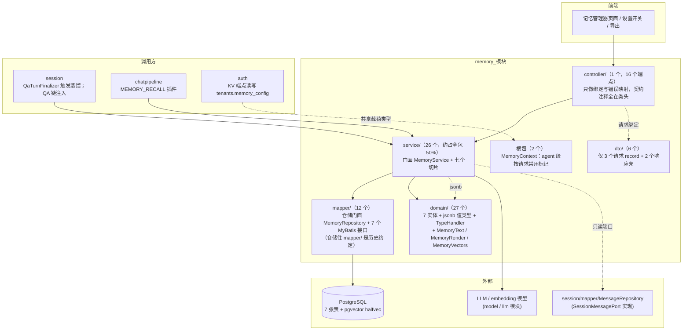
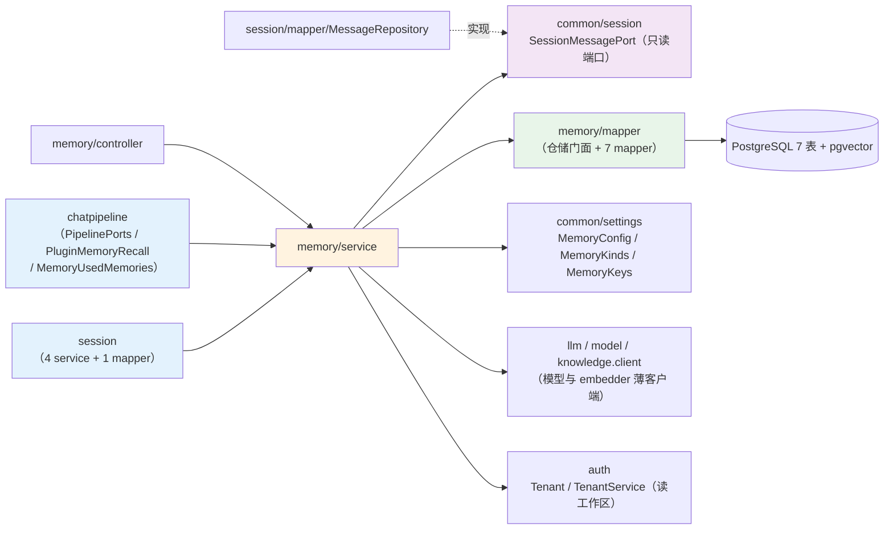
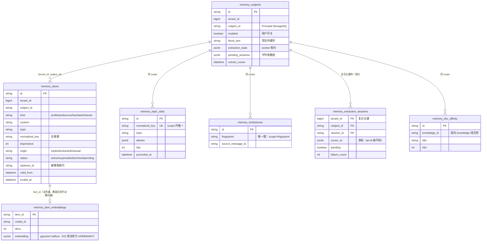
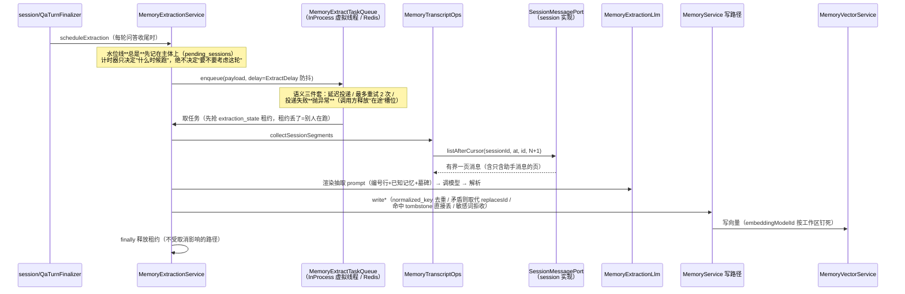
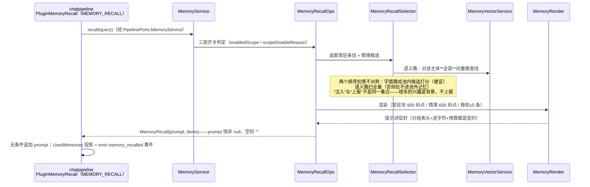
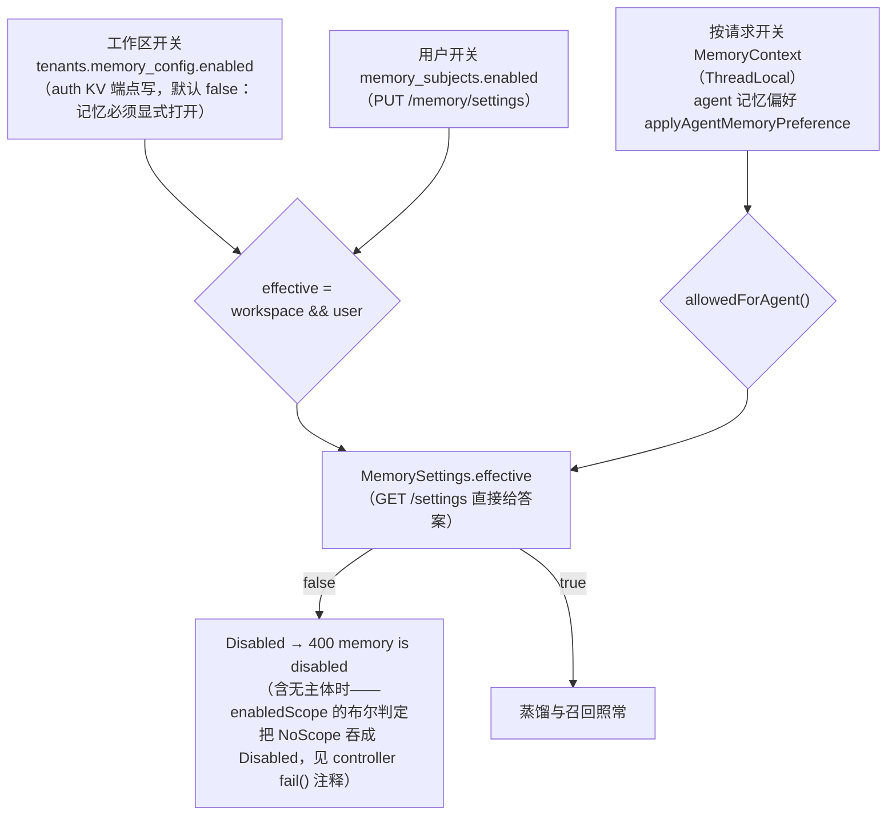
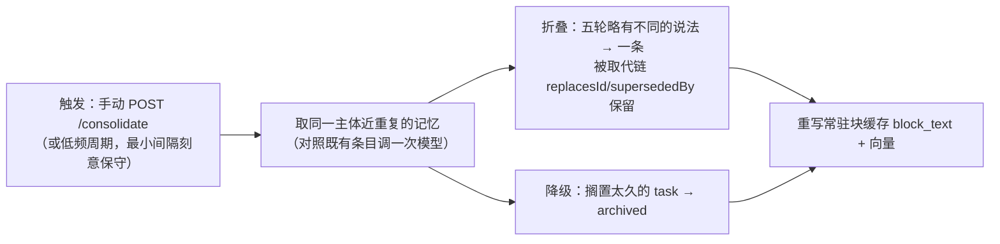

# memory 模块手册

> **面向读者**：第一次接手 `com.ragagent.memory` 的架构师 / 高级开发者。
> **目标**：30 分钟建立全局观 → 能定位改动点 → 能安全迭代（全仓 4,800+ 个后端用例兜底，本模块自身 347 个，改错会立刻红）。
> **数据口径**：2026-10-08 实测（`wc -l` 口径）：**74 个 java 文件 / 约 1.28 万行 / 5 个子包（+ 根包 2 文件）**。
> **本文档的地位**：模块级导览；仓库级作业规范见仓库根 `HANDOFF.md`（§12 结构地图、§13 踩坑清单、§14 逐包重构范式）。

---

## 0. 一分钟速览

**它是什么**：跨会话长期记忆的全部后端能力——**把对话蒸馏成可注入的陈述**，再把它们**喂回每一轮问答**。

- 后台蒸馏：每轮问答结束后投递任务 → 按水位线取会话转录 → LLM 抽取候选陈述 → 去重（normalized_key）/ 取代（replaces_id）/ 墓碑（tombstone）→ 向量化
- 检索供给：常驻块（profile / preference / interest，每轮必注入）+ 情境条目（按查询匹配，字面 + 语义双路）→ 渲染成提示词信封
- 记忆管理器：条目 CRUD 与 confirm / reject、话题晋升、文档亲和度、清空、导出、手动整理
- 开关模型：工作区开关 × 用户开关 × agent 按请求开关，三层合一定生死

**它不是什么**（别在这里改）：

| 不负责 | 归属 |
|---|---|
| 会话消息的存取 | `session`（本模块经只读端口 `common/session/SessionMessagePort` 取转录，方向不可反——`memory ⇄ session` 环已解） |
| 记忆在管线里的注入时机 | `chatpipeline`（`MEMORY_RECALL` 插件决定**何时**调 `recall`；`MemoryUsedMemories` 已归位 chatpipeline） |
| 工作区记忆配置的 HTTP 面 | `auth`（`tenants.memory_config` 由 auth 的 KV 端点读写；memory 只提供 `common/settings/MemoryConfig` 载荷类型——`auth ⇄ memory` 环已解） |
| embedding / 抽取模型的接入 | `model` / `llm`（经 `DefaultMemoryModelResolver` + `LlmChatClient` 薄客户端调用） |

### 图 1：模块全景



**三个必须知道的数字**：最大类 919 行（`mapper/MemoryIndexStore`，全仓仅剩的 4 个 ≥800 行**登记例外**之一，用户 2026-10-01 定调"不硬切"）；`service/` 6,355 行（约占 50%，门面 + 切片全在这）；**仓储（3,240 行 / 12 文件）不住 `repository/` 而住 `mapper/`**——历史约定，见 §9。

---

## 1. 目录结构与职责

### 1.1 子包清单（放什么 / 不放什么）

| 子包 | 文件/行数 | 放什么 | **不放什么** |
|---|---|---|---|
| 根包 | 2 / 64 | `package-info` + `MemoryContext`（agent 级"本请求禁用记忆"的 ThreadLocal 标记） | 任何业务类型 |
| `controller/` | 1 / 527 | 唯一 `MemoryController`：`@Valid` 绑定、容错分页、异常→HTTP 映射（16 个端点的契约注释全在类头/方法头） | 业务逻辑、SQL、DTO 手搓 |
| `service/` | 26 / 6,355 | 门面 `MemoryService` + 切片：`MemoryCatalogOps`（管理面）/ `MemoryInsightOps`（检索面）/ `MemoryRecallOps`（召回装配）/ `MemoryExtractionService` + `MemoryTranscriptOps` + `MemoryExtractionLlm`（蒸馏）/ `MemoryConsolidationService`（整仓回顾）/ `MemoryVectorService` / `MemoryRecallSelector` / `MemoryTopicResolver`；队列接口 + InProcess/Redis 两实现 | SQL（→ `mapper/`）、HTTP 关注点 |
| `domain/` | 27 / 2,496 | 7 个实体（`@TableName`）+ jsonb 值类型（`MemoryExtractionState` 等）+ 2 个 TypeHandler + 纯工具（`MemoryText` / `MemoryRender` / `MemoryVectors`）+ 领域类型 `MemoryPage` + 4 个领域异常 | 线格式请求体（→ `dto/`；响应实体直接用 domain，见 §3.2） |
| `dto/` | 6 / 79（5 类型 + package-info） | 3 个带体端点的请求 record + `MemoryListResponse` / `MemoryExportResponse` 两个响应壳 | 域形状（响应体=domain 实体，直出） |
| `mapper/` | 12 / 3,240 | 仓储门面 `MemoryRepository`（454 行）+ `MemoryItemStore`（458）+ `MemoryIndexStore`（919）+ 7 个 MyBatis-Plus 接口 + `MemoryTxTemplate` + `VectorHitRow` | ⚠️ 这里**不是** MyBatis-Plus 纯接口层——仓储门面因历史约定住在此包（HANDOFF §12 注） |

### 1.2 依赖方向（谁消费我、我消费谁）



- **入**（实测 import 计数）：`session/service` 4 处 + `session/mapper` 1 处（`MessageRepository` 实现端口并 import `MemoryMessageCursor`）、`chatpipeline` 3 处。**只有这三个包能碰 memory**，且都走 `MemoryService` / `MemoryRecall` / `MemoryItem` 这几个窄类型。
- **出**：`common.settings` 38 处（配置与常量的家，解环产物）、`common.web` 25 处（`JsonMappers` / `ZeroTimeSerializer`）、`llm.domain` 13 处、`model` 5 处、`common.session` 2 处、`auth` 2 处、`knowledge.client` 1 处（`EmbedderClient`）、`common.jdbc` 1 处（`DatabaseDialects` 方言判定）。
- **切片之间靠包级可见性互相调用写路径**（`write*` / `rebuildBlock` / `enforceCapacity`），不开 public——边界由"同一个包"保住，见 `MemoryService` 类注释。

---

## 2. 数据模型

### 2.1 ER 图（7 张表，全部无外键）



> `tenants.memory_config`（工作区配置）也是 jsonb，但它的**表归 auth 域**、HTTP 面是 auth 的 KV 端点；memory 只提供 `common/settings/MemoryConfig` 载荷类型。三处与 PG 有意的 DDL 差异（H2 测试库）登记在 `TestSchema.createMemoryTables` 的 javadoc：`JSONB→VARCHAR`、`uuid_generate_v4()` 默认值去掉（id 由应用层生成）、`halfvec→VARBINARY`。
> `memory_extraction_sessions` 是**复合主键**（无 id 列）；游标是 `(cursor_at, cursor_id)` 二元组，用消息主键打破时间戳平局。

### 2.2 jsonb 列与值类型对照

| 列 | 值类型 | 说明 |
|---|---|---|
| `memory_subjects.extraction_state` | `MemoryExtractionState`（经 `MemoryExtractionStateTypeHandler`） | 只装 worker 租约 `{leaseId, leaseUntil}`；读路径宽松（`ignoreUnknown`），**旧 snake 键被静默丢弃** |
| `memory_subjects.pending_sessions` | `List<String>`（经 `MemoryStringListTypeHandler`） | 排队中的会话；**空列表写 `[]` 不写 SQL NULL**（与 wiki 的处置相反） |
| `memory_topic_stats.aliases` | `List<String>`（同一个 TypeHandler） | 话题别名，读写语义与上条逐字相同，刻意共用一个类 |
| `memory_extraction_sessions.cursor` | `MemoryMessageCursor`（嵌套 JSON，不落独立列） | `{at, id}`，另以 `failed_from_`/`failed_to_` 前缀平铺展开 |
| `tenants.memory_config`（auth 域表） | `common/settings/MemoryConfig` | 工作区配置载荷；改键后的存量行必须跑迁移 SQL，旧键读进来**静默忽略**＝"配置看起来被重置" |

**硬约定（踩过坑）**：

1. jsonb 列读写**必须**在 `@TableField` 与 `@Update` 注解 SQL 两处都写 `typeHandler`——MyBatis-Plus 的 `UpdateWrapper.set()` 不套实体上的 typeHandler（见 `MemorySubjectMapper` 类注释）。
2. jsonb 读路径统一走 `JsonMappers.lenient()`（带 `JavaTimeModule`、容忍未知属性）；零值时间是字面量 `0001-01-01T00:00:00Z`，靠字段默认值持有 `ZeroTimeSerializer.ZERO_DATE_TIME`（null 不会走自定义序列化器）。
3. 值类型字段**恒输出**（契约"禁止条件键"）：空串写 `""`、零值时间写字面量；`MemoryItem.replacesId` 未取代时也恒输出空串。

### 2.3 状态与取值枚举（常量在 `common/settings/MemoryKinds`）

| 维度 | 取值 | 用在哪 / 语义 |
|---|---|---|
| 记忆种类 `kind` | `profile` / `preference` / `fact` / `task` / `interest` | 前两种 + interest 是**常驻**（每轮注入）；fact / task 情境性（匹配才拉入）；`ALL` 列表顺序即常驻块渲染顺序 |
| 条目状态 `status` | `active` / `superseded` / `archived` / `pending` | `pending`=系统推断、**永不注入提示词**、等用户 confirm；`superseded`=被矛盾陈述取代（取代而非删除，管理器才能解释"改了什么"）；`archived`=容量归档 |
| 来源 `origin` | `explicit` / `extracted` / `manual` | 用户明确要求 / 后台蒸馏 / 管理器手工 |
| 写入模式 `writeMode` | `WRITE_MODE_EXPLICIT_ONLY` / `WRITE_MODE_AUTO`（常量在 `MemoryConfig`，刻意不在 `MemoryKinds`） | explicit_only=只在用户明确要求时记；auto=后台蒸馏 |
| HTTP `status` 查询参数白名单 | 空串 + 上述四个状态 | 其余一律 400 `unsupported status`（`MemoryController.isSupportedStatus`） |

---

## 3. HTTP 接口面

### 3.1 端点分组（1 个 controller / 16 个端点，无 `@RequestMapping` 前缀，全路径写在方法上）

**设置**（2 个）

| 方法 | 路径 | 用途 |
|---|---|---|
| GET | `/api/v1/memory/settings` | 已合并生效的记忆状态（工作区×用户×容量，裸 `MemorySettings`） |
| PUT | `/api/v1/memory/settings` | 更新调用者自己的开关（`enabled` 带 `@NotNull`） |

**条目**（7 个）

| 方法 | 路径 | 用途 |
|---|---|---|
| GET | `/api/v1/memory/items` | 分页列表，`status` 白名单校验**在分页解析之前** |
| POST | `/api/v1/memory/items` | 手工创建，**201** + 裸条目 |
| PUT | `/api/v1/memory/items/{id}` | 编辑内容与重要度 |
| DELETE | `/api/v1/memory/items/{id}` | 永久删除（物理删，无软删），**204** |
| POST | `/api/v1/memory/items/{id}/confirm` | 接受一条 `pending` 推断条目 |
| POST | `/api/v1/memory/items/{id}/reject` | 拒绝＝删除＋写墓碑，**204** |
| DELETE | `/api/v1/memory/items` | **清空集合**（与按 id 删是两条路由），同步完成，**204** |

**主题**（3 个）：`GET /api/v1/memory/topics`（分页）、`POST /topics/{id}/promote`（动作端点：动主题、产出新条目，按单资源形态返 200 而非 201）、`DELETE /topics/{id}`（停止跟踪，**204**）。

**文档亲和度**（2 个）：`GET /api/v1/memory/documents`（分页）、`DELETE /documents/{id}`（删检索信号，**204**）。

**导出 / 整理**（2 个）：`GET /api/v1/memory/export`（快照导出：按 500/页翻到尽头，硬上限 20,000，`{items,total,truncated}` + `Content-Disposition` 附件头）、`POST /api/v1/memory/consolidate`（立即整理一次，200 + 裸 `MemoryConsolidationResult`）。

### 3.2 契约约定（2026-10-01 换锚定稿；改接口前必读）

| 约定 | 说明 |
|---|---|
| 信封 | **无** `{data,success}` 信封：单资源裸对象、列表 `{items,page,pageSize,total}` |
| 字段名 | JSON 名＝Java 字段名（camelCase）；域实体直接作响应体（`MemoryItem` 是"真正的响应体"）；除 LLM 载荷外禁逐字段 `@JsonProperty`（全域已从 137 处清到 22 处，余者为 LLM 载荷**登记保留**） |
| 状态码 | 创建 **201**、删除/拒绝/清空 **204**；`promote` 是动作端点返 200 |
| 分页 | 请求侧只有 `limit/offset`（**容错**：limit 非法、≤0 或 >200 归 50，offset<0 归 0——实测 `?limit=abc&offset=-5` 返 200 不是 400）；响应换算出 `page/pageSize` |
| 错误 | `AppError` 信封：NoScope→401、ItemNotFound→404、MemoryConflict→409、SensitiveContent/Disabled→400、其余（含 EmptyContent/PreviouslyForgotten，**刻意**不列）→500+details；"不存在"与"别人的"**同形 404** 防存在性探测 |
| 请求绑定 | 3 个带体端点用 `dto/` record + `@Valid`，错误由全局处理器统一（空体→"请求体不能为空"、畸形→"请求体格式不正确"、类型错→"<字段>: 类型不正确"、缺 enabled→"enabled: 不能为空"）；未知字段**忽略** |
| 空值形态 | 列表空仓输出 `"items":[]`；**导出空仓 `items:null`**——两者刻意不同，别统一（`MemoryController` 类/方法注释） |
| 无 subject 参数 | 全部 16 个端点都**不接受** subject id——操作空间一律从 `TenantContext`/principal 推导，把"改 id 读别人记忆"这类缺陷从根上消掉 |

---

## 4. 核心链路

### 4.1 后台蒸馏（写路径：一轮对话 → 记忆）



- **"一轮都不会丢"是这个服务的头号性质**（`MemoryExtractionService` 类注释）：旧实现拿当前时间与上次运行比较、间隔内直接返回，窗口里的每一轮被悄悄丢掉——现在水位线先行，间隔只影响节奏。
- 被拒绝的消息有 1 小时冷却窗（`REJECTED_MESSAGE_WINDOW`）：用户删掉某条记忆后，debounce 的重跑不会立刻把它再蒸回来。
- 失败进度记在 `memory_extraction_sessions`（`failure_count` + `failed_from_`/`failed_to_` 区间），不丢位点。

### 4.2 召回（读路径：每一轮问答注入什么）



- **`recall` 永不调用模型、永不返回错误**（`MemoryRecallOps` 类注释）：记忆是增强，任何失败必须退化成一个普通回答，而不是一次失败的请求。
- `MemoryService` 的写路径对切片是**包级可见**的——召回切片能回写用量（`touchAsync`）但绕不过写入口。

### 4.3 三层开关（谁能让记忆闭嘴）



> `MemoryContext` 是 ThreadLocal，设置方必须在请求结束的 finally 里 `clear()`，漏清会污染同线程的下一个请求；缺席＝允许（agent 没表态就继承工作区设置）。

### 4.4 整仓回顾（`MemoryConsolidationService`，离线维护）



- 它**从不跑在请求路径上**（手动 consolidate 是唯一例外，那也是用户自己在等）——蒸馏只看得到最新一段对话，"三周里五轮把同一个偏好记成五种说法"只有这一趟离线回顾看得见。
- 容量归档也在这条链上：超过 `maxItems` 后按 `importance DESC, COALESCE(last_used_at, valid_from) DESC` 排名归档最低者。

---

## 5. 改哪里（场景 → 文件）

| 我想… | 主要改这里 | 别忘了 |
|---|---|---|
| 加 / 改一个端点 | `controller/MemoryController` + `dto/` 请求 record + `service/` 用例 | 照 `fail()` 的映射表补错误形态；`MemoryHttpContractTest` 补 golden；响应别手搓 `ObjectNode` |
| 改条目写语义（去重 / 取代 / 敏感词 / 墓碑） | `service/MemoryService` 写路径 + `domain/MemoryText`（清洗、指纹、normalized_key） | "取代而非删除"是管理器解释历史的前提；reject 要同时写墓碑 |
| 改抽取提示词 / 模型输出解析 | `service/MemoryExtractionLlm` | 这里是全域仅存的 22 处 `@JsonProperty` 所在——**LLM 载荷登记保留**，别顺手清 |
| 改蒸馏节奏 / 防抖 / 租约 | `service/MemoryExtractionService` + `MemoryRunBudget` + `InProcessMemoryExtractTaskQueue` / `RedisMemoryExtractTaskQueue` | 水位线先行语义不许破；投递失败必须抛异常让调用方释放槽位 |
| 改召回注入内容 / 预算 | `service/MemoryRecallOps` + `MemoryRecallSelector` + `domain/MemoryRender` | "永不失败"原则；注入≠上报两个集合；码点预算连换行都算 |
| 改语义召回 / 向量编解码 | `service/MemoryVectorService` + `domain/MemoryVectors` + `mapper/MemoryIndexStore` | `embeddingModelId` 留空＝关语义召回只用字面；pgvector 列缺失要走回退（H2 是 VARBINARY） |
| 改整仓回顾 | `service/MemoryConsolidationService` | 不许上请求路径；结果对象 `MemoryConsolidationResult` 直接是响应体 |
| 改工作区配置语义 | `common/settings/MemoryConfig` + `MemoryKeys`（不在本包！） | HTTP 面在 **auth** 的 KV 端点；改键名必须同批跑存量迁移 SQL，且**先改 auth 侧 `TenantCatalogContractTest` 的 `ct-kv-mem-*` 夹具** |
| 改话题 / 文档亲和度 | `service/MemoryTopicResolver` + `MemoryCatalogOps` / `MemoryInsightOps` | `promote` 是动作端点（200）；aliases 与 pending_sessions 共用 TypeHandler |
| 加字段 / 加表 | `domain/` 实体 + `migrations/versioned/V1__baseline.sql` + `server/src/test/java/com/ragagent/TestSchema.java` 的 `createMemoryTables` | **schema 两处同改**（否则 H2 报 `Column not found`）；jsonb 列记得 `autoResultMap = true` + 双处 typeHandler |
| 改分页 / 错误形态 | `controller/MemoryController`（`listPaging` / `fail`） | 容错分页与 404 同形是实测钉住的契约，改动先改契约文档再动代码 |
| 改脱敏 / 文本口径 | `domain/MemoryText` | 码点计数、Unicode White_Space、`Locale.ROOT`、CJK 正则不写 `\b`——四处都是刻意口径 |

---

## 6. 常见迭代 SOP

> 铁律：**一次只动一个轴**；每步结束**全绿**再走下一步（哪怕只是移动文件）。

```bash
# 每次改动后必跑（约 3 分钟）
cd ~/ragagent && JAVA_HOME=/opt/homebrew/opt/openjdk@21/libexec/openjdk.jdk/Contents/Home \
  ./gradlew :server:test :server:spotlessCheck
# 若动了前端可见契约（字段名/信封/状态码），同批带前端：
cd frontend && npx vue-tsc --build --force && npm test
```

**A. 加端点**：`dto/` 请求 record（`@Valid`，错误文案显式写 `message`，参照 §13.10 防 locale 漂移）→ `MemoryController` 加方法（复用 `fail()` 映射）→ `service/` 用例 → `MemoryHttpContractTest` 补 golden（对运行中服务录制，掩码动态 id）→ 三绿 → 提交。

**B. 加字段**：`domain/` 实体 → `V1__baseline.sql` + `TestSchema.createMemoryTables` 两处同改 → `MemoryEntityJsonTest` 逐字节期望（**禁止条件键**：新字段恒输出）→ 若前端可见同批前端 → 三绿。

**C. 改蒸馏语义**：先读 `MemoryExtractionService` 类注释的"三处形状差异"→ 动 `MemoryExtractionLlm`（提示词/解析）或切片 → `MemoryExtractionServiceTest` + `MemoryExtractionHelpersTest` + `MemoryExtractionRepositoryTest` 三层各补用例 → 验证"一轮都不会丢"语义不破 → 三绿。

**D. 改召回**：`MemoryRecallOps` / `MemoryRecallSelector` → `MemoryRender` 预算 → `MemoryRecallSelectorTest` + `MemoryServiceOrchestrationTest` → 确认任何异常路径都退化成空 prompt 而非抛出 → 三绿。

**E. 重构（切片 / 搬迁）**：按 HANDOFF §13.1 套路（侦察→边界按调用点定→harness→忠实性逐字核验→回填文档）；对外保法是**全量薄委托**（§13.3）；`MemoryService` 的切片全是包级可见 + 持门面回引的形态（"本类不得独立实例化"），新切片照此样式，别开 public。

---

## 7. 模块约定与坑（必读）

1. **每条 SQL 都必须自带 `tenant_id = ? AND subject_id = ?` 双列谓词**（`MemoryRepository` 类注释）：本包没有中心化的 `scoped()` 帮助方法（那会要求每个查询都拼 wrapper），新增 mapper 方法漏了就是**跨主体泄漏**。`TenantFilterGuard`（B70，alert 档）是兜底网不是替代品。
2. **jsonb 存量迁移是换锚批的一半工作量**：`memory_subjects.extraction_state` 旧 snake 键被宽松读路径静默丢弃 → "别人正持有租约"变成"没人持有"；`tenants.memory_config` 旧键静默忽略 → 工作区配置"看起来被重置"。两处都在 2026-10-01 M2 跑过迁移 SQL（HANDOFF §14.9k）——再改这两个键，同批必须再带迁移。
3. **`recall` 永不失败**（`MemoryRecallOps` 类注释）：记忆是增强，任何失败必须退化成普通回答。往召回链上加"会抛异常"的步骤前先想清楚退化路径。
4. **喂给模型的文本不是给人看的，别"顺手优化"**：`MemoryRender` 的分组顺序 / 英文表头 / 连字符 / 码点预算算法（换行也算码点）都是已钉住的输出契约；`MemoryText` 的四处口径（码点计数、Unicode White_Space 而非 `isWhitespace`、`Locale.ROOT`、CJK 正则不写 `\b`）同理。
5. **仓储住在 `mapper/` 包**（含 `MemoryRepository` / `MemoryItemStore` / `MemoryIndexStore` / `MemoryTxTemplate`）：HANDOFF §12 注明"历史约定，其批次跟随 `repository/` 分层"。别按 knowledge 的骨架想当然去找 `repository/`，也别在功能批里顺手搬家（结构搬迁批闸门 ≈3m25s，要单独立批）。
6. **`MemoryIndexStore` 919 行是登记例外**（HANDOFF §14.3；六段同属"索引侧读写"一个关注点，用户 2026-10-01 定调不硬切；B70 后 A7 白名单理由收窄为"列存在性探测"）。复核它先读类注释，别按"神类"惯性开刀。
7. **空列表写 `[]` 不写 SQL NULL**（`MemoryStringListTypeHandler` 类注释）：与 wiki 那套"空列表写 NULL"**刻意相反**，别跨域套用。
8. **`UpdateWrapper.set()` 不套实体 typeHandler**（`MemorySubjectMapper` 类注释）：jsonb 列的 `@Update` 注解 SQL 必须手写 `typeHandler=...`，漏了"写得进、读出来是零值"。
9. **导出与列表的空值形态刻意不同**（`MemoryController` 注释）：`GET /items` 空仓是 `"items":[]`，`GET /export` 空仓是 `"items":null`——契约未要求统一，别"修"它。同理 `Content-Type` 必须手写字符串 `application/json; charset=utf-8`（带空格；`MediaType.toString()` 会把空格吃掉，而本项目验收是 diff 字节）。
10. **`DELETE /memory/items` 与 `DELETE /memory/items/{id}` 是两条路由**；清空是同步删除返 204，`{"removed":N}` 计数已随信封退役，前端不再展示条数（要恢复先改契约标准）。
11. **无主体时 create / promote / consolidate 抛 `Disabled`（400）而不是 `NoScope`（401）**（`fail()` 方法注释）：service 侧 `enabledScope()` 是布尔判定，把 NoScope 吞成了"不许用记忆"——排查 401/400 归属时先看这条。
12. **删条目不级联向量**（`MemoryItem` javadoc）：`memory_items` 与 `memory_item_embeddings` 之间无外键，删条目必须手动删向量，漏删就是幽灵命中。
13. **`MemoryContext` 必须 finally clear**（类注释）：ThreadLocal 不随作用域失效，漏清污染同线程下一个请求——与 `TenantContext`/`StorageUrlContext` 同一条坑。
14. **LLM 载荷的 22 处 `@JsonProperty` 登记保留**（HANDOFF M3）：模型输出形状（snake_case）与线格式契约是两回事，全仓卫生扫描对它们是白名单放行，别当欠债清掉。

---

## 8. 测试与验证

- **规模**：本模块 **17** 个测试类 / **347** 个 `@Test`（2026-10-08 实测 `grep -c '@Test'`）；全仓后端用例 4,836（B85 记录）兜底。
- **分层**：`controller/MemoryHttpContractTest`（37 用例，16 端点全覆盖）；`MemoryEntityJsonTest`（22，实体 JSON 逐字节）；仓储三件套 `MemoryRepositoryTest`（52）/ `MemoryExtractionRepositoryTest`（23）/ `MemoryVectorRepositoryTest`（17）；`service/` 8 个类（Orchestration 34、ExtractionService 33、ExtractionHelpers 19、Lexical 12、TopicResolver 10、RecallSelector 6、RedisQueue 5、VectorLogic 4）；域工具 `MemoryTextTest`（40）/ `MemoryLifecycleTest`（15）/ `MemoryVectorsTest`（10）/ `MemoryContractTest`（8）。
- **fixture**：`server/src/test/resources/contracts/memory-*.json` 共 **21 个**；比较口径是**逐字节 diff**（动态 id 用 `goldenMasked` 掩码），成功面 golden 于 2026-10-01 契约换锚后重录、录制顺序在测试类注释里（顺序会影响列表内容）。`tenants.memory_config` 的 KV 契约夹具（`ct-kv-mem-*` 7 个）在 **auth 侧** `TenantCatalogContractTest`——改 MemoryConfig 键名要跨包改它。
- **已知偶发 2 例**（全仓共有，遇到先单独重跑，别误判回归）：
  - `WebToolsRecordingTest.searchWithContentFetchesLeadingPagesViaSharedFetchTool`（全量并发下偶发）
  - `EvaluationContractTest.getTerminalRunsExecution`（全量并发下偶发；单独 `--tests "*EvaluationContractTest"` 通过）
- **换锚批省力工具**：golden 批量重录用 `-Dcontract.refresh=true`（HANDOFF §13.12），重录后必须结构化复核差异；键改名时同步放宽掩码正则（§13.13）。

---

## 9. 已知待办与风险（接手后优先看）

| 项 | 性质 | 建议 |
|---|---|---|
| 仓储门面（`MemoryRepository` / `MemoryItemStore` / `MemoryIndexStore` / `MemoryTxTemplate`）仍在 `mapper/`，无 `repository/` 子包 | 结构欠账（已登记） | HANDOFF §12 注明"批次跟随 `repository/` 分层"；属结构搬迁批（全仓闸门 ≈3m25s），**别混进功能批**；`session`/`datasource` 同款欠账，届时同批对齐 |
| `MemoryIndexStore` 919 行 | 登记例外（非待办） | 六段同属索引侧读写，用户定调不硬切；复核判据与 A7 白名单理由见类注释 + HANDOFF §14.3 |
| 抽取的语言上下文未接入 | 功能缺口 | `MemoryExtractionService` 类注释"三处形状差异"第 1 条：租户/语言不再从上下文重建（约束是"后台不许读 ThreadLocal"）；做多语言蒸馏时从 `MemoryExtractPayload` 补，别在 worker 里读上下文 |
| `EmptyContent` / `PreviouslyForgotten` 落 500 而非 400 | 契约瑕疵（刻意保留） | `MemoryController` 类注释"刻意不在 switch"，已实测钉住（2026-09-18）；要改先改契约标准（§1.13）再动代码，否则契约测试全红 |
| `vectorRecall` / `retrievalConditioning` 三态 `Boolean` | 兼容风险 | `null`=走默认 ≠ `false`=显式关；压平成 `boolean` 等于替工作区管理员做决定（`MemoryConfig` 类注释）。任何"简化配置类型"的提议都死在这 |
| 同一工作区配置两条读路径 | 观察项 | auth KV 端点（写）与 memory 侧 `MemoryConfig` 宽容读（容忍未知属性）共享载荷类型；改键名时两处契约夹具（`ct-kv-mem-*` 与本域）要同批 |

---

## 10. 速查：本模块的"地标"

| 想知道 | 看这里 |
|---|---|
| 某个接口怎么走 | `controller/MemoryController`（16 个端点契约注释全在类头/方法头）→ `service/MemoryService` → `mapper/MemoryRepository` |
| 一轮对话怎么变成记忆 | §4.1 + `MemoryExtractionService`（"一轮都不会丢"）+ `MemoryTranscriptOps` / `MemoryExtractionLlm` |
| 每轮注入什么、预算多少 | §4.2 + `MemoryRecallOps` / `MemoryRecallSelector` / `domain/MemoryRender`（900/600 码点、每轮 ≤5 条） |
| 记忆为什么没生效 | 三层开关 §4.3：`common/settings/MemoryConfig`（工作区）→ `memory_subjects.enabled`（用户）→ `MemoryContext`（按请求） |
| 记忆的种类 / 状态 / 预算常量 | `common/settings/MemoryKinds`（ kinds、RESIDENT、状态、全部码点预算） |
| 去重 / 取代 / 遗忘怎么实现 | `domain/MemoryText`（normalized_key、fingerprint）+ `memory_tombstones` + `MemoryItem.replacesId` |
| 向量怎么存、pgvector 缺列怎么办 | `domain/MemoryVectors`（编解码/余弦）+ `mapper/MemoryIndexStore`（halfvec 就绪探测与回退） |
| 租约 / 防抖 / 重试语义 | `MemoryExtractionState`（jsonb 租约）+ `MemoryExtractTaskQueue` 接口注释（三条必须保留的语义） |
| 工作区配置长什么样 | `common/settings/MemoryConfig`（javadoc 含完整 JSON 形态；HTTP 面在 auth KV 端点） |
| 表结构 / 索引 / H2 差异 | `TestSchema.createMemoryTables`（javadoc 列全三处 DDL 差异）+ `migrations/versioned/V1__baseline.sql` |
| 仓储为什么长这样 | `mapper/MemoryRepository` 类注释（"一个门面 + 七个 Mapper"、事务横跨多表的理由） |
| 目录为什么这样分 | 本文 §1 + 根 `package-info.java` + `dto/package-info.java`（本包仅有的两份 package-info） |
