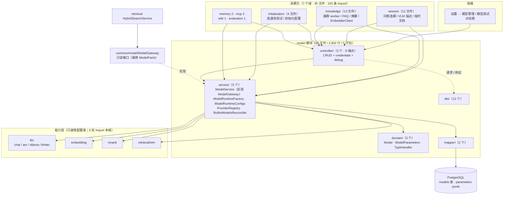
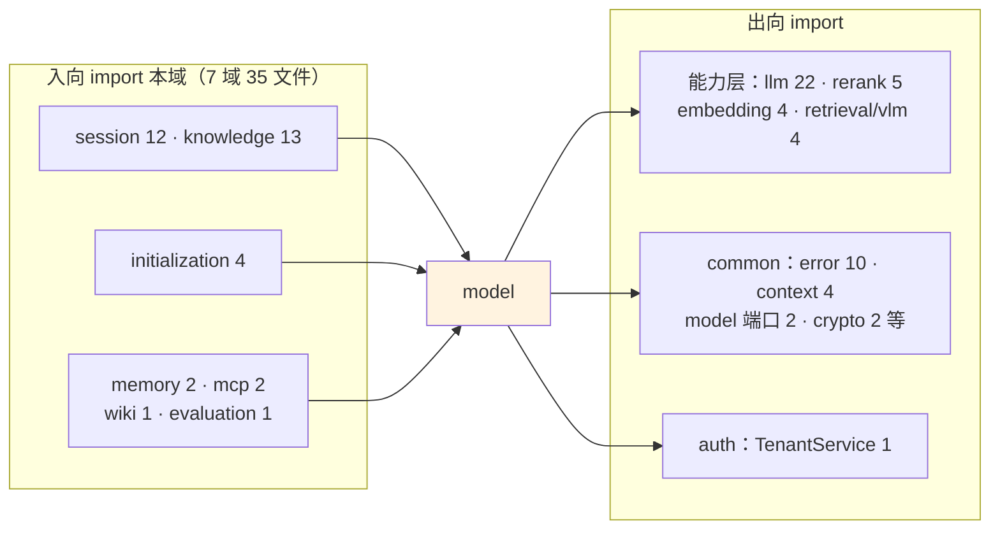
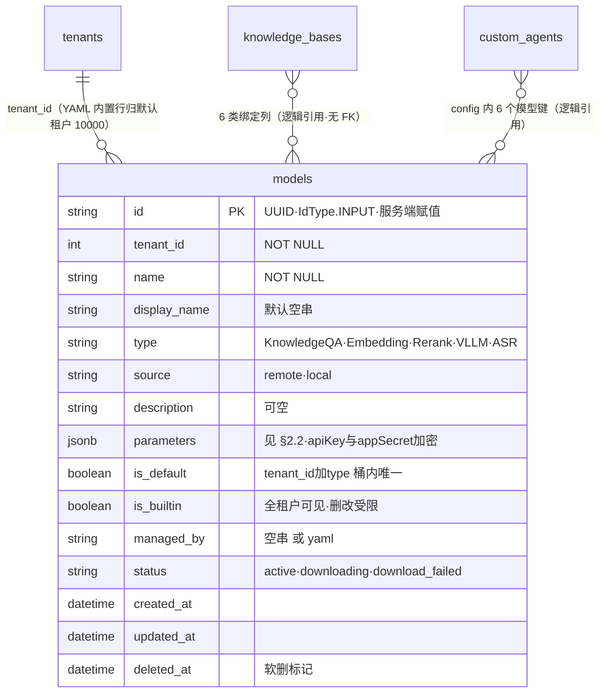
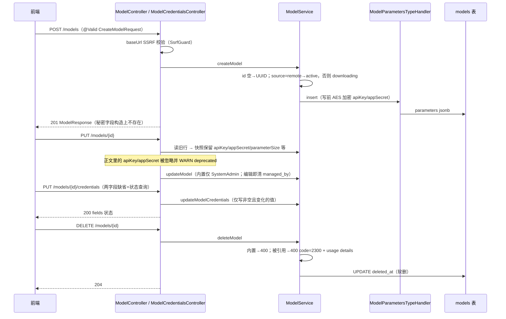
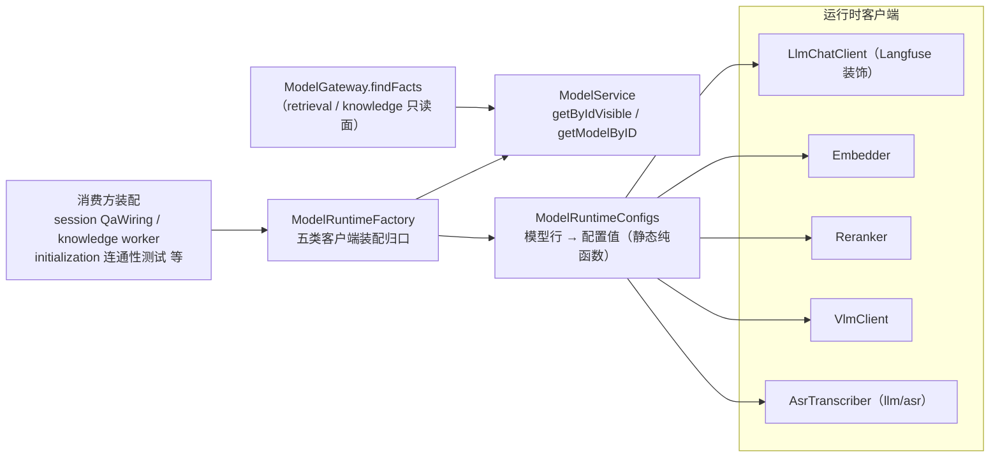
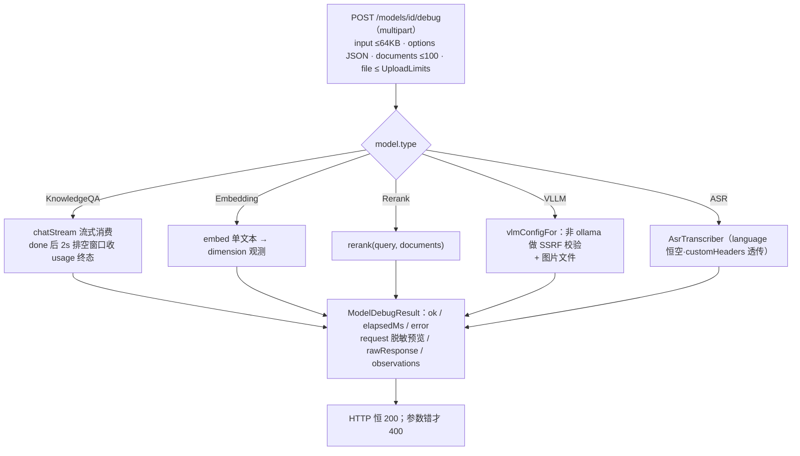
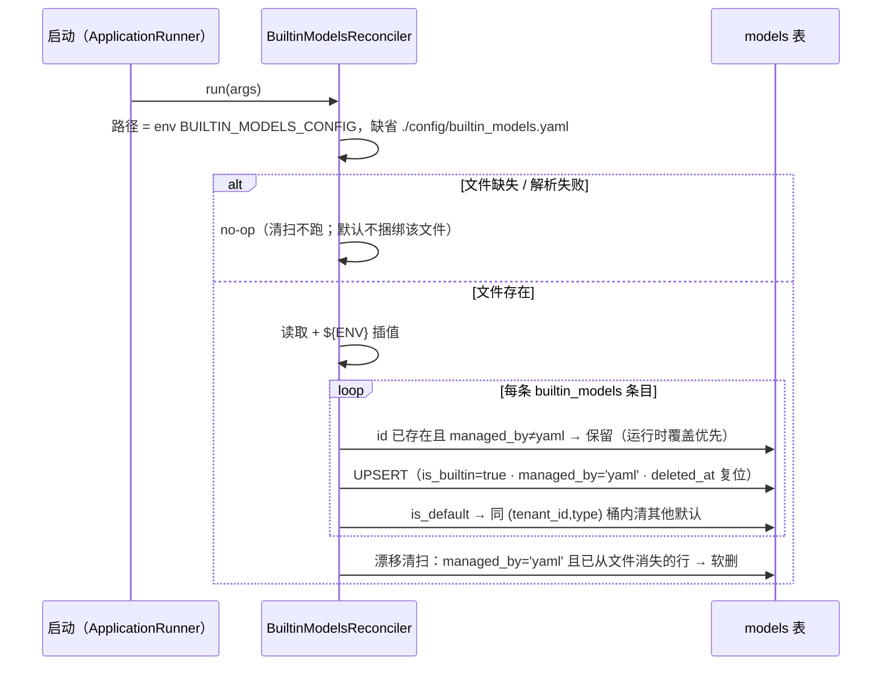

# model 模块手册

> **面向读者**：第一次接手 `com.ragagent.model` 的架构师 / 高级开发者。
> **目标**：30 分钟建立全局观 → 能定位改动点 → 能安全迭代（本模块 32 个契约用例 + 37 份 golden 兜底，改错会立刻红）。
> **数据口径**：2026-10-08 实测（`wc -l` 口径）：**26 个 java 文件 / 2,802 行 / 5 个子包**。
> **本文档的地位**：模块级导览；仓库级作业规范见仓库根 `HANDOFF.md`（§12 结构地图、§13 踩坑清单、§14 逐包重构范式）。

---

## 0. 一分钟速览

**它是什么**：模型配置域——**"有哪些模型、怎么连上它们"的唯一名册**，以及一个把模型跑起来看看好不好的调试面。

- 模型条目 CRUD：`models` 表一行 = 一个模型（chat / embedding / rerank / VLM / ASR 五类），带凭据快照、软删、内置模型对账
- 凭证子资源：apiKey/appSecret **只**能经 `/credentials` 按字段写入/清除（AES-256-GCM 加密落库），永不经主资源 PUT 正文
- 运行时装配出口：把"模型行"翻译成五个能力层的**配置值**（`ModelRuntimeConfigs`），再装配成客户端（`ModelRuntimeFactory`）——全仓其他 7 个域都从这里拿模型
- 提供方注册表：26 家厂商的静态数据（默认 URL / 支持的类型），顺序即对外顺序
- 调试面：`POST /models/{id}/debug` 一个端点吃五类模型，HTTP 恒 200

**⚠️ 先说一个必混点**：`model` **既是顶层域名又是层名**——`model/domain` 是模型域的实体包，`auth/domain` 里的 `domain` 是"数据层"这个层名。搜代码、读包名时先分清说的是"模型域"还是"某域的数据层"（backend-package-map §3 P3 待办已点名：至少在文档里点名，改名后议；本文 §7-1、§9 各有一条）。

**它不是什么**（别在这里改）：

| 不负责 | 归属 |
|---|---|
| 26 家 provider 的协议实现（HTTP 客户端、鉴权、流式解码） | `llm` / `embedding` / `rerank` 三族客户端（本域只产配置值；能力层 0 处 import 本域，守卫绿） |
| ASR 转写协议 | `llm/asr`（`AsrTranscriber`，消 `initialization ⇄ model` 环的产物） |
| VLM 调用 | `retrieval/vlm`（`VlmClient`） |
| 模型连通性测试、初始化向导、初始化配置写入 | `initialization`（其 golden `init-put-config-*`、`w5b-*` 在消费侧测试里，见 §8） |
| 问答链路里"用哪个模型"的编排 | `session`（`QaModelSelection` 等） |
| 检索引擎、向量库 | `retrieval`（它经 `common/model/ModelGateway` 只读端口拿模型事实，不 import 本域） |

### 图 1：模块全景



**三个必须知道的数字**：最大类 610 行（`ModelDebugController`，五分支调试器，"HTTP 恒 200"契约的所在）；`service/` 1,201 行占全包 43%（五个类就是本域全部业务）；9 个端点全在 `/api/v1/models` 前缀下（3 个 controller 共用类级 `@RequestMapping`）。

---

## 1. 目录结构与职责

### 1.1 子包清单（放什么 / 不放什么）

| 子包 | 文件/行数 | 放什么 | **不放什么** |
|---|---|---|---|
| `controller/` | 3 / 945 | `ModelController`（6 端点）、`ModelCredentialsController`（2）、`ModelDebugController`（1）；参数校验、SSRF 校验、权限投影 | provider 静态数据（→ `service/ProviderRegistry`）、SQL |
| `service/` | 5 / 1,201 | CRUD + 删除守卫（`ModelService`）、运行时工厂、配置值映射、provider 注册表、内置模型对账 | 请求/响应形状（→ `dto/`） |
| `domain/` | 3 / 257 | `Model` 实体 + `ModelParameters`（jsonb 值类型）+ 专属 `TypeHandler`（含 AES 加解密） | 通用 jsonb 工具（→ `common/web`） |
| `dto/` | 12 / 356 | 一类型一文件：请求 3 / 响应 7 / provider 1 / debug 3 | 持久化注解 |
| `mapper/` | 2 / 37 | `ModelMapper`（BaseMapper 空接口）+ `ModelUsageMapper`（2 条显式 SQL，拉列回 JVM 匹配） | 业务判断（usage 匹配逻辑在 `ModelService`） |
| 根 | 1 / 6 | `package-info`（职责地图：点名连通性测试/初始化在别处） | 任何代码 |

> 本域**没有 `repository/` 层**：两份 mapper 直用、语义集中在 `ModelService`，是"小域现状"而非范式——别照搬到大域。

### 1.2 依赖方向（出向全在能力层与 common）



**两个枢纽，方向相反**：

- **入向枢纽 `ModelGateway`**（`common/model`）：只读端口，载荷 `ModelFacts(modelId, name, baseUrl, apiKey)`，由 `ModelService` 实现。retrieval 的查询嵌入、knowledge 的 `EmbedderClient` 走它——它们不再 import 本域实体（`model ⇄ retrieval` 环的解法，2026-09-30 批 ④-c）。要给消费方更多字段，**先改 `ModelFacts`**。
- **出向枢纽 `ModelRuntimeConfigs`**：纯静态函数，把 `Model` 行映射成 `EmbedderConfig` / `RerankerConfig` / `Config`(llm) / `ChatConfig` / `VlmConfig` 五种配置值。原先 5 个 `fromModel` 工厂散在能力层配置类上，把映射收回本域后消掉 `embedding`/`rerank`/`llm ⇄ model` 三组环（批 ④-b）。**能力层从此只见配置值，不见实体**。

---

## 2. 数据模型

### 2.1 ER 图（1 张表 + 两处逻辑引用）



> `knowledge_bases` / `custom_agents` 与本表**没有外键**：引用关系由 `ModelUsageMapper` 拉列、`ModelService.kbBindings/agentBindings` 在 JVM 内解析（§4.1 删除守卫）。可见性统一 `WHERE (tenant_id = ? OR is_builtin = true) AND deleted_at IS NULL`——内置模型全租户可见。

### 2.2 jsonb 列与值类型对照

| 列 | 值类型（`domain/`） | 说明 |
|---|---|---|
| `models.parameters` | `ModelParameters`（嵌套 `EmbeddingParameters`） | baseUrl / apiKey / interfaceType / 向量参数 / parameterSize / provider / extraConfig / customHeaders / supportsVision / contextWindow / maxOutputTokens / maxConcurrency / appId / appSecret |

**硬约定（本域特有 + 踩过的坑）**：

1. 读写走**专属** `ModelParametersTypeHandler`（不是通用 `PgJsonTypeHandler`）：**写前拷贝 → apiKey/appSecret AES-256-GCM 加密**（key 缺失时明文落库）；**读后宽容解密**（密钥缺失/轮换 → 置空，行照常加载）。实体带 `@TableName(autoResultMap = true)`。
2. 键名 = Java 字段名（camelCase），2026-10-01 换锚批定型；dev 库存量旧行已用一次性 SQL 改写（见 `docs/handoff/plans/14.9a-换锚总纲与小域打样.md` §14.9e；versioned migrations 不含它）。
3. `extraConfig`/`customHeaders` 为 map，序列化按键字母序（输出稳定字节，golden 依赖）。
4. YAML 对账（`BuiltinModelsReconciler.parseParameters`）与请求 DTO（`ModelParametersRequest.toDomain`）是**另外两条**构造 `ModelParameters` 的路径——加字段三处同改。

### 2.3 状态与取值（字符串常量，本域无 Java 枚举）

| 字段 | 取值 | 用在哪 / 语义 |
|---|---|---|
| `type` | `KnowledgeQA` / `Embedding` / `Rerank` / `VLLM` / `ASR` | 五类模型；对外串 `chat/embedding/rerank/vllm/asr`，`ProviderRegistry.toFrontend/queryToBackend` 双向映射 |
| `status` | `active` / `downloading` / `download_failed` | `ModelService` 常量；创建时 `source=remote → active`，否则 `downloading`（本地 ollama 拉取不轮转，golden 已登记为已知差异）；非 active 读取 → 500 code=1007 |
| `source` | `remote` / `local` | 决定初始 status；VLM 的 interfaceType 空时回落 `local → ollama`，否则 `openai` |
| `managed_by` | `''` / `yaml` | 内置模型托管标记；UI 编辑 = 运行时覆盖，清空防启动对账静默改回 |
| credentials 字段标识符 | `apiKey` / `appSecret` | `PUT/DELETE /credentials` 的取值域（两处 javadoc 仍写旧值 `api_key`/`app_secret`，见 §7-6） |
| RBAC | 写 Admin+ / 读 Viewer+ / 内置模型 SystemAdmin | `ModelController` javadoc + `TenantRole` 判定 |

---

## 3. HTTP 接口面

### 3.1 端点分组（3 个 controller / 9 个端点，前缀均为 `/api/v1/models`）

| # | 方法 | 路径 | 用途（权限） |
|---|---|---|---|
| 1 | POST | `/api/v1/models` | 创建（Admin+）→ **201** 裸 `ModelResponse`；baseUrl SSRF 校验 |
| 2 | GET | `/api/v1/models` | 列表（Viewer+），裸数组 |
| 3 | GET | `/api/v1/models/{id}` | 详情（Viewer+）；`downloading`/`download_failed` → **500/1007** |
| 4 | PUT | `/api/v1/models/{id}` | 更新（Admin+；内置仅 SystemAdmin）→ 200；凭证快照保留 |
| 5 | DELETE | `/api/v1/models/{id}` | 软删（Admin+）→ **204**；内置 400、被引用 **400 code=2300** + usage details |
| 6 | GET | `/api/v1/models/providers` | 26 家提供方（Viewer+）；`?modelType=chat` 等过滤（camel；**旧 `model_type` 被忽略**） |
| 7 | PUT | `/api/v1/models/{id}/credentials` | 写/清凭据（Admin+）；**两字段均缺省 = 查询已配置状态** |
| 8 | DELETE | `/api/v1/models/{id}/credentials/{field}` | 清单字段（Admin+）→ **204**；`{field}` ∈ `apiKey`/`appSecret` |
| 9 | POST | `/api/v1/models/{id}/debug` | 调试（multipart：input/options/documents/file）；五类模型分支；**HTTP 恒 200** |

### 3.2 契约约定（2026-10-01 换锚收官后的本域实际）

| 约定 | 本域落实 |
|---|---|
| 字段名 | JSON 名 = Java 字段名（camelCase）；`@JsonProperty` **87 → 0**（主资源 54 + debug 14 + 落库 19），无 `@JsonNaming` |
| 信封 | **无**：单资源直出、列表裸数组；创建 201、删除 204 无 body |
| 可空字段 | 显式输出 `null`；参数投影里 **0/空串 = 未设置 → null**（"用后端默认值"的显式语义，`ModelResponse.from`） |
| 错误 | `{error:{code,message,details}}`；2300 的 `details` 是 ObjectNode **字段序固定**直出（usage 明细） |
| 校验文案 | `@Valid` **显式** `message = "字段名: 不能为空"`——防 locale / Accept-Language 漂移（§13.10，本域示范） |
| **debug 例外** | 运行时错误不是 HTTP 错误：体内 `ok=false` + `error` 原文，HTTP 恒 200；参数校验错才是 400 信封 |
| 请求预览脱敏 | debug 的 `request` 只含非密字段：`extraConfig` 过敏感词 → `[REDACTED]`，`customHeaders` 只露头名，顶层键字母序（确定性） |

---

## 4. 核心链路

### 4.1 配置 CRUD 与凭证子资源（含删除守卫）



**删除守卫（2300）怎么数引用**：`ModelUsageMapper` 拉本租户 `knowledge_bases`（6 类绑定列：embedding/summary/image_processing/vlm/asr/wiki_synthesis）与 `custom_agents`（config 内 camel 键：modelId/rerankModelId/vlmModelId/asrModelId/queryUnderstandModelId/followUps.modelId）+ 租户 `memory_config` 的两个记忆模型钉 → JVM 内匹配 → 明细封进 400 的 `details`（列表各截前 50 条）。**改这两张表的绑定列/键名必须同批改 `kbBindings`/`agentBindings`**。

### 4.2 运行时配置值分发（消费方怎么拿到一个能用的模型）



**两种取数口径是契约，别统一**（`ModelRuntimeFactory` javadoc 原话）：

| 口径 | 用于 | 行为 |
|---|---|---|
| `getModelGated`（带状态闸门） | embedding / rerank | `downloading`/`download_failed` → 500（1007），文案进错误体 |
| `getModelDirect`（直取） | chat / vlm / asr | 只查租户可见性，不看状态 |

错误形态：工厂抛 `RuntimeException`，其 `getMessage()` 就是 debug 端点对外文案（**错误文案是契约**）；底层 `BizException` 在此**拆包**取 `appError().message()`（它的 `getMessage()` 带 `error code: ...` 前缀，不能直接用）。

### 4.3 调试端点五分支



### 4.4 内置模型 YAML 对账（启动期，默认 no-op）



> UPSERT 陷阱：MyBatis-Plus 无原生 upsert，实现是"先 update、0 行再 insert、撞 PK 再退回 update"；**update 列集刻意不含 `created_at`**，否则已存在行的时间戳每次启动被改写（类注释明说）。

---

## 5. 改哪里（场景 → 文件）

| 我想… | 主要改这里 | 别忘了 |
|---|---|---|
| 改 CRUD 语义 / 状态机 | `service/ModelService`（create/getModelByID/update/delete） | golden：`model-create/get/update/not-found.json`；`downloading→500` 是契约 |
| 改凭证子资源 | `ModelCredentialsController` + `ModelService.updateModelCredentials/clearModelCredential` | 字段标识符 `apiKey`/`appSecret`；两字段缺省 = 状态查询 |
| 给参数加字段 | `domain/ModelParameters` + `dto/ModelParametersRequest` + `dto/ModelParametersDTO` + `BuiltinModelsReconciler.parseParameters` | 四条构造路径同改（§2.2-4）；jsonb 内加字段**不需要**动 schema |
| 加 provider | `service/ProviderRegistry` 的 `ENTRIES` | 声明序即对外顺序；重录 `model-providers*.json`（B62 裁撤云厂商的教训：注册表是"最后一项删掉"级操作） |
| 加第六类模型类型 | `ProviderRegistry` 双向映射 + `BuiltinModelsReconciler` 白名单 + `ModelDebugController` 的 switch + 前端 | 五处开关，漏一处就是"能建不能调" |
| 改调试行为 | `controller/ModelDebugController`（五分支）+ `service/ModelRuntimeFactory` | 错误文案是契约；`md-*` golden 24 份；stub 响应对齐 `scripts/stub-llm-server.py` |
| 改运行时装配 / 配置值映射 | `service/ModelRuntimeConfigs` + `ModelRuntimeFactory` | 能力层禁 import 本域（守卫 `check-package-cycles`）；映射体历史上是逐字搬移，改行为要过 golden |
| 改内置模型对账 | `service/BuiltinModelsReconciler` + `config/builtin_models.yaml` | 只动 `managed_by='yaml'` 行；`created_at` 陷阱（§4.4）；文件缺失 no-op |
| 改删除守卫 / usage | `ModelService.deleteModel` + `kbBindings/agentBindings` + `mapper/ModelUsageMapper` | 2300 `details` 字段序是契约；绑定键清单见 §4.1 |
| 改 providers 端点 | `ModelController.listModelProviders` + `ProviderRegistry` | query 是 `modelType`（camel），旧 `model_type` 被忽略 |
| 改对外契约（字段/形态） | `dto/` + **同批前端** | 本域是"前后端同 PR"首例（2026-10-01，15 前端文件）；改完跑 golden 复核（§8） |

---

## 6. 常见迭代 SOP

> 铁律：**一次只动一个轴**；每步结束**全绿**再走下一步（哪怕只是移动文件）。

```bash
# 每次改动后必跑（约 3 分钟）
cd ~/ragagent && JAVA_HOME=/opt/homebrew/opt/openjdk@21/libexec/openjdk.jdk/Contents/Home \
  ./gradlew :domains:test :domains:spotlessCheck
# 若动了前端可见契约（字段名/信封/状态码），同批带前端：
cd frontend && npx vue-tsc --build --force && npm test
```

**A. 加端点**：`dto` 请求（`@Valid` + 显式 message）→ `controller` → `service` 用例 → 补/重录 golden（`domains/src/test/resources/contracts/`）→ 三绿 → 提交。

**B. 加参数字段**：`ModelParameters` → 两条 DTO + reconciler 解析 → golden 复核（`model-get.json` 等键集合会变）→ 三绿；对前端可见则同批改前端类型。

**C. 加 provider**：`ENTRIES` 加条目 → 跑 `ModelContractTest`（providers 两条 golden 会红）→ 结构化复核差异后重录 → 三绿。

**D. 加模型类型**：§5 "加第六类模型类型"五行清单逐一过 → debug golden 补分支用例 → 三绿。

**E. 重构（拆类/端口化）**：先例是 `ModelGateway`/`ModelRuntimeConfigs` 两刀（backend-package-map 批 ④-b/④-c）——**配置值不传实体、跨域走 common 端口**；薄委托保调用点（HANDOFF §13.3）；每包补 `package-info` → 三绿 → 提交。

---

## 7. 模块约定与坑（必读）

1. **`model` 既是顶层域又是层名**（`model/domain` vs `auth/domain`）：backend-package-map §3 P3 待办点名"至少在文档里点名，改名后议"。grep `domain/` 相关结论时先分清"模型域"与"数据层"两个语境。
2. **debug 端点运行时错误不是 HTTP 错误**（HTTP 恒 200 + `ok=false` + `error` 原文）；工厂抛的 `RuntimeException.getMessage()` 即对外文案、`BizException` 必须拆包（`ModelRuntimeFactory` javadoc）。**改这些文案 = 改契约 = 动 `md-*` golden**。
3. **凭证永不经 `PUT /models/{id}` 正文**：controller 读旧行做快照保留，正文带的 apiKey/appSecret 被忽略并 WARN deprecated（`ModelController.java` 167–180 行注释）。只能走 `/credentials` 子资源。
4. **jsonb 读写自带 AES**：写前加密、读宽容解密（失败置空、行可加载）；`SYSTEM_AES_KEY` 缺失时**明文落库**（`ModelParametersTypeHandler`）。同型坑：source 过 `.env` 的 shell 会把该变量泄漏给 Gradle 测试，造成"孤零零 1 个"假红（HANDOFF §13.9）。
5. **两种取数口径是契约不是疏漏**（embedding/rerank 带状态闸门，chat/vlm/asr 直取，§4.2 表）；统一它们会改变 500 语义，golden 会红。
6. **credentials 字段标识符以代码与 golden 为准**：`apiKey`/`appSecret`（B30，2026-10-02 统一 camel）；`ModelCredentialsController` 与 `CredentialsResponse` 的 javadoc 仍写旧值 `api_key`/`app_secret`，是换锚期遗留陈话——改到即顺手修。
7. **`@Valid` 必须显式 `message = "字段名: 不能为空"`**：默认 message 随请求头/进程 locale 漂移，同一个二进制两种文案（HANDOFF §13.10，本域 2026-10-01 示范）。
8. **内置模型三层防线**：全租户可见（`tenant OR is_builtin`）→ 非 SystemAdmin 改/删/配凭证一律 403 → 响应投影剥离敏感面（非 Admin 剥 baseUrl/extraConfig/customHeaders；内置对非 SystemAdmin 再剥 appId）。**UI 编辑内置模型会清 `managed_by`**——这是特性（运行时覆盖优先于 YAML 对账），不是 bug。
9. **删除守卫 2300 的 `details` 是字段序固定的 ObjectNode 直出**（golden 锁定）；绑定匹配键与 `knowledge_bases`/`custom_agents` 的列名、jsonb 内键名强耦合（§4.1）——那边改名必须同批改这边。
10. **`ModelUsageMapper` 刻意不走 DB jsonb 方言**：拉列回 JVM 匹配，H2 测试库零方言依赖（接口 javadoc）。给 usage 加新绑定别"顺手"改成 SQL jsonb 表达式。
11. **`ProviderRegistry` 静态数据由 golden 生成**（javadoc：顺序 = 声明序、输出形态与 `model-providers.json` 字节一致）——改注册表必重录；`defaultUrls` 走 TreeMap 保字母序。

---

## 8. 测试与验证

- **规模**：本模块 **2 个测试类 / 32 个用例**（`ModelContractTest` 8 + `ModelDebugContractTest` 24，均在 `domains/src/test/java/com/ragagent/model/`）；兜底的契约 golden **37 份**：`model-*` 12 + `models-list-empty.json` 1 + `md-*` 24。
- **fixture 归属（实测核实，纠正讹传）**：`model-providers*.json`、`models-list-empty.json` 属**本域** `ModelContractTest`（不在消费侧）；`init-put-config-*.json` 属 `agent/management/AgentContractTest`（initialization 配置面）；`w5b-*.json` 属 `agent/management/W5bInitializationContractTest`（连通性/初始化向导，消费模型但 golden 归 initialization 面）。
- **比较口径**：`support/GoldenContract` 统一比较器 + `ContractJson.semantic` 归一（键序/转义不敏感）；动态字段掩码后语义比对（模型 UUID / 时间戳 / `elapsedMs`），静态断言字节一致。fixture 锚定**本仓自己的行为**。
- **debug 契约测试的 stub**：in-JVM `HttpServer` 重放 `scripts/stub-llm-server.py` 的响应（录制脚本 `scripts/record-modeldebug-golden.sh`）；种子数据与录制同构（租户 10009、模型 `b0000000-…-01..09`）；唯一掩码 `elapsedMs`。
- **已知偶发 2 例**（HANDOFF §9，遇到先单独重跑，别误判回归）：
  - `WebToolsRecordingTest.searchWithContentFetchesLeadingPagesViaSharedFetchTool`（全量并发下偶发）；
  - `EvaluationContractTest.getTerminalRunsExecution`（全量并发下偶发；期望 `model ID cannot be empty`、实际空串；单独 `--tests "*EvaluationContractTest"` 通过）。
- **孤儿观察**：`contracts/model-cred-del.json` 是 0 字节且无测试引用（204 无体的历史产物）——清理候选，见 §9。

---

## 9. 已知待办与风险（接手后优先看）

| 项 | 性质 | 建议 |
|---|---|---|
| `model` 既是顶层域又是层名 | 命名（backend-package-map §3 P3 待办，**未决**） | 已按待办要求在文档点名（本文 §0/§7-1）；改名是全仓动作，改名后议 |
| 35 文件 / 100 条 import 直连本域，其中 **28 处拿实体 `Model`** | 架构（阶段 4 模块化的存量） | 端口化先例已打样（`ModelGateway`/`ModelFacts` 为 retrieval/knowledge 解环）；后续按消费面逐域收敛到端口/配置值 |
| credentials 字段标识符 javadoc 陈旧（`api_key`/`app_secret` vs 代码 `apiKey`/`appSecret`） | 文档债 | `ModelCredentialsController` / `CredentialsResponse` javadoc，改到即顺手修（§7-6） |
| `model-cred-del.json` 0 字节孤儿 fixture | 测试卫生 | 删除，或给 DELETE 用例接线 |
| B80 未完成段：ASR/VLM 错误文本 ~7 金片（w5b/modeldebug 脚本）仍钉旧文案 | 契约债 | 需起本地服务重录（不支持 `-Dcontract.refresh`），等拍板再动（HANDOFF §15 B80 行） |
| `ModelDebugController` 610 行、单端点五分支 | 可读性观察项 | 尚无批次立项；动它 = 动 24 份 `md-*` golden，收益/扰动比要先算 |

---

## 10. 速查：本模块的"地标"

| 想知道 | 看这里 |
|---|---|
| 某个端点怎么走 | `controller/` 同名方法 → `service/ModelService` / `ModelRuntimeFactory` |
| 模型行怎么变成可用客户端 | §4.2 + `ModelRuntimeConfigs`（配置值映射）+ `ModelRuntimeFactory`（装配归口） |
| 凭据怎么存 | `ModelParametersTypeHandler`（AES 加解密）+ `/credentials` 子资源（§4.1） |
| 删除为什么被拒 | `ModelService.deleteModel` + 2300 details（`kbBindings`/`agentBindings`，§4.1） |
| 内置模型从哪来 | `BuiltinModelsReconciler` + `config/builtin_models.yaml`（§4.4；默认 no-op） |
| 26 家 provider 清单 | `service/ProviderRegistry`（`ENTRIES`，顺序即对外顺序） |
| 调试端点语义 | `ModelDebugController` 类 javadoc + 本文 §4.3（HTTP 恒 200） |
| 全租户共享的模型怎么判 | `getByIdVisible` 的 `tenant OR is_builtin` + 权限投影（`ModelResponse.from`） |
| 谁在消费本域 | §1.2：7 域 35 文件；跨域只读走 `common/model/ModelGateway` |
| 目录为什么这样分 | 本文 §1 + 根 `package-info.java`（1 份，职责地图） |
