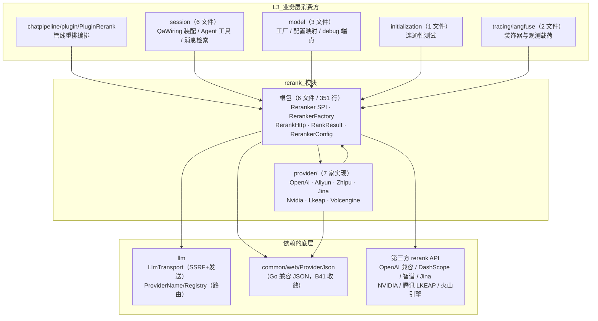
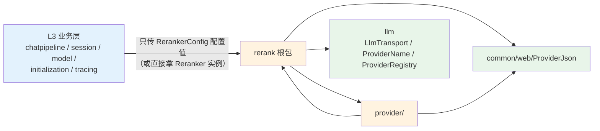
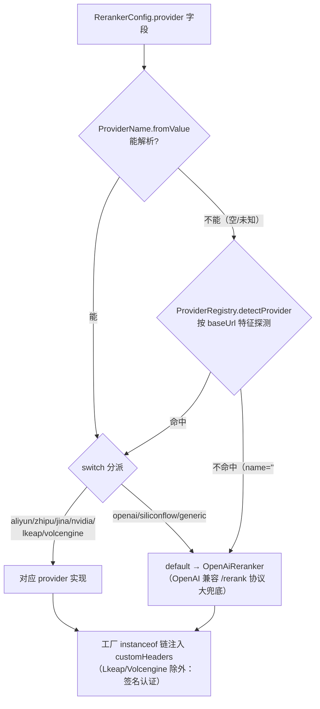

# rerank 模块手册

> **面向读者**：第一次接手 `com.ragagent.rerank` 的架构师 / 高级开发者。
> **目标**：30 分钟建立全局观 → 能定位改动点 → 能安全迭代（本模块有 22 个后端用例兜底，改错线格式会立刻红）。
> **数据口径**：2026-10-08 实测（`wc -l` 口径）：**14 个 java 文件 / 约 1.4 千行（1,417 行）/ 2 个子包**。
> **本文档的地位**：模块级导览；仓库级作业规范见仓库根 `HANDOFF.md`（§12 结构地图、§13 踩坑清单、§14 逐包重构范式）。

---

## 0. 一分钟速览

**它是什么**：第三方 rerank（重排）API 的 **provider 客户端族**——分层定位是 **L2 能力层、库式包**（`docs/backend-package-map.md` §3.5）。全部职责一句话：**把"query + 候选文档列表"变成"按相关性打分的结果列表"**。2026-09-30 已拆成 **根 6（框架：Reranker SPI / 工厂 / HTTP 骨架 / RankResult）+ `provider/`（各家实现）**；全包**零 Spring Bean、零 HTTP 端点、零持久化**，实例由调用方按需构造。

### ⚠️ 四个近邻易混包辨析（接手第一件事）

| 包 | 一句话 | 与本包的关系 |
|---|---|---|
| `embed`（12 文件） | **业务域**：embedding 渠道的 HTTP 管理面（0 包引用的叶子域） | 只是名字像；与 rerank 无依赖 |
| `embedding`（21 文件） | **L2 provider 客户端**：向量化 API 客户端族（与 rerank 同构的姊妹包，连 `EmbeddingStatusLine` 都有包内副本互通） | 平行能力层，互不依赖 |
| `vectorstore`（12 文件） | 向量库适配（写入 / 相似度检索） | 检索链路的下游；与 rerank 无依赖 |
| `rerank`（本包） | **重排 API 客户端族**：召回之后、给 LLM 之前的精排 | — |

一句话记忆：`embed` 是业务渠道管理，`embedding` 管"进向量库之前"，`vectorstore` 管"存在哪、怎么查"，`rerank` 管"查出来之后精排"。

**它不是什么**（别在这里改）：

| 不负责 | 归属 |
|---|---|
| 模型行管理、凭据解密、连通性测试 | `model`（经 `ModelRuntimeConfigs.rerankerConfig` 映射成配置值后才进本包） |
| 重排的**编排语义**（阈值、top-k、top1 兜底、二次重试） | `chatpipeline/plugin/PluginRerank` |
| 会话侧装配（哪个租户用哪个 rerank 模型） | `session/service/QaWiring` 等装配点 |
| SSRF 校验、HTTP 发送的底层实现 | `llm/chat/LlmTransport`（本包只是调用方） |
| langfuse 观测 | `tracing/langfuse/LangfuseReranker`（装饰器，包在实例外层） |

### 图 1：模块全景



**三个必须知道的数字**：最大类 303 行（`VolcengineReranker`，含 V4 签名器与虚拟线程切批并发）；`provider/` 占 1,066 行（75% 的代码量，框架根只有 351 行）；全包仅 **4 处 `@JsonProperty`、全在 `RankResult`**（登记冻结面，见 §7）。

---

## 1. 目录结构与职责

### 1.1 子包清单（根 = 框架 / provider/ = 实现）

| 位置 | 文件/行数 | 放什么 | **不放什么** |
|---|---|---|---|
| 根包（框架） | 6 / 351 | `Reranker`(16，SPI 三方法)、`RerankerConfig`(50，配置值包)、`RerankerFactory`(58，路由 + customHeaders 注入)、`RerankHttp`(116，SSRF 校验 + POST + `RerankException`)、`RankResult`(104，契约类型)、package-info | 各家 HTTP 细节（→ `provider/`）、编排语义（→ 调用方） |
| `provider/` | 8 / 1,066（7 家实现 1,058 + package-info 8） | 7 个 `*Reranker` 类：每家一个文件，构造时校验 baseUrl、`rerank()` 内手搓请求体并解析响应 | 共享骨架上提（各家差异大到不值得抽象：路径、认证、响应形状全不同） |

**7 家 provider 逐个点名**（2026-10-04 B62 裁撤 WeKnora Cloud 后；此前是 8 家）：

| 实现类（行数） | 路由名 | 端点形态 | 认证 | 各家独有的坑 |
|---|---|---|---|---|
| `OpenAiReranker`（110） | **default**（openai/siliconflow/generic 等全部落这） | `{base}/rerank` | Bearer | `truncate_prompt_tokens` 是 **opt-in**（§7.4）；`additional_data` 恒省略 |
| `AliyunReranker`（94） | `aliyun` | POST 到 base URL **本身**（无 /rerank 后缀） | Bearer | 恒带 `parameters:{return_documents:true, top_n:N}`；响应在 `output.results[]` |
| `ZhipuReranker`（92） | `zhipu` | POST 到 base URL 本身 | Bearer | 响应 `results[].document` 是**字符串**（非对象）；`top_n`/`return_raw_scores` 零值省略 |
| `JinaReranker`（83） | `jina` | `{base}/rerank` | Bearer | 恒发 `return_documents:true`；响应直接是 `results[]` |
| `NvidiaReranker`（104） | `nvidia` | POST 到 base URL 本身 | Bearer | 请求体是 `query:{text}` / `passages:[{text}]`；响应 `rankings[].logit` 要过 **sigmoid 归一**（按符号分两分支防溢出） |
| `LkeapReranker`（272） | `lkeap` | 固定域名 `lkeap.tencentcloudapi.com` | **TC3-HMAC-SHA256 签名**（裸 HTTP，本仓禁增 SDK） | 批式：60 条/请求、Query+Docs 合计 2,000 **码点**；超批分片串行、index 平移合并；凭据走 `apiKey`(SecretId)+`appSecret`(SecretKey) 双槽位 |
| `VolcengineReranker`（303） | `volcengine` | `{base}/api/knowledge/service/rerank` | **V4 HMAC-SHA256 签名** | 批式：50 条/请求，超批**虚拟线程并发 4**重排后按原 index 合并；`code != 0` 报错、score 数不符报 `score count mismatch` |

### 1.2 依赖方向（L2 能力层，只收配置值）



- **入边 5 个包**（全部 L3）：`chatpipeline`、`session`、`model`、`initialization`、`tracing`——L2 收 L3 的调用是合法方向。
- **出边只有 2 个包**，全在底层：`llm`（HTTP 传输 + provider 注册表）、`common`（ProviderJson）；加 Jackson databinding。**零 L3 依赖**——这是 2026-09-30 批 4-b"配置值去实体化"换来的（§7.3）。
- `provider/` 对外**零曝光**：main 源码里 import `rerank.provider.*` 的外部文件为 0，`RerankerFactory` 是唯一构造入口（测试除外）。

---

## 2. 数据模型

**不适用**：本包无任何数据库实体、无表、无 mapper/repository——它是纯出站客户端（库式包），唯一持久化相关动作是消费方（model 域）把模型配置落库。

**契约类型只有两个**：

| 类型 | 形状 | 说明 |
|---|---|---|
| `RerankerConfig` | 10 个普通字段：`apiKey/baseUrl/modelName/source/modelId/provider/extraConfig/customHeaders/appId/appSecret` | **配置值包**（纯 getter/setter，null 归一为 `""`）。`appSecret` 是**加密值，调用方传入前已解密**（LKEAP/Volcengine 的 SecretKey 槽位）；`extraConfig` 里藏着各家私有键：`truncate_prompt_tokens`（OpenAI 兼容）、`secret_key`/`region`（LKEAP/Volcengine）、`instruction`（Volcengine） |
| `RankResult` | `{"index":N,"document":{"text":"..."},"relevance_score":X}` | **snake 键是登记冻结面**（HANDOFF §14.6/§15.3：第三方 rerank API 响应面，Jina/Aliyun/LKEAP 同形）。**宽容解析**：`document` 可为字符串或 `{"text":...}` 对象；分数先看 `relevance_score`、缺失回落 `score`、都没有为 0（8 行用例表钉在 `RerankWireTest.rankResultUnmarshalTable`）。`@JsonProperty` ×4 仅为 `models/{id}/debug` 的 raw_response 序列化而加（javadoc 注明，不改变 `marshal()` 行为） |

---

## 3. 消费面：谁在调用我

> 本包无 HTTP 接口面（**0 个 `@RestController`/`@Controller`/`@RequestMapping`，0 个 `@Component`/`@Service`**，实测 grep 为空）——它被别的包当库调用，所以"接口面"就是谁 import 它。

### 3.1 消费方清单（main 13 文件 / 5 个包；测试侧另有 3 文件）

| 消费包 | 文件 | 用的类型 | 用途 |
|---|---|---|---|
| `chatpipeline/plugin` | `PluginRerank` | `Reranker`、`RankResult` | 管线重排编排：经 `PipelinePorts.ModelService` 端口取实例，阈值过滤、top1 兜底（分数低于阈值全空时兜回 top1）、失败降级 |
| `session/service` | `QaWiring` | `RerankerConfig`、`RerankerFactory`、`Reranker` | 会话侧装配：租户模型行 → 配置映射 → 工厂构造（端口回调） |
| `session/service` | `AgentEngineAssembler` / `AgentToolBackends` / `AgentToolKbBackends` / `MessageSearch` / `SessionAgentQaService` | `Reranker`（部分加 `RankResult`） | agent 工具与消息检索消费重排结果 |
| `model/service` | `ModelRuntimeFactory` | `RerankerFactory`、`Reranker` | `getRerankModel(modelId)`：状态闸门取模型行 → 凭据解密 → 配置映射 → 工厂构造 → `LangfuseReranker.wrap` 装饰 |
| `model/service` | `ModelRuntimeConfigs` | `RerankerConfig` | **配置值去实体化的映射点**：`rerankerConfig(Model, appId, appSecret)`，`Model → RerankerConfig` 逐字段搬值（§7.3） |
| `model/controller` | `ModelDebugController` | `Reranker`、`RankResult` | `models/{id}/debug` 端点：把重排原始响应序列化进 raw_response（`RankResult` 的 `@JsonProperty` 因此存在） |
| `initialization/service` | `ModelConnectivityTestService` | `RerankerFactory` | 初始化向导的 rerank 连通性测试 |
| `tracing/langfuse` | `LangfuseReranker` / `LangfusePayloads` | `Reranker`、`RankResult` | 装饰器：发一条 generation，用量按"码点数/4+1"估算（成本面板比例信号） |

测试侧引用（3 文件，不占上表口径）：`chatpipeline/Rec46cSupport`、`session/service/MessageServiceVectorSearchTest`、`tracing/langfuse/LangfuseModelDecoratorsTest`。

### 3.2 对外契约约定（改前必读）

- **SPI 三方法**（`Reranker`）：`rerank(query, documents) → List<RankResult>`、`getModelName()`、`getModelID()`。失败统一抛 `RerankHttp.RerankException extends RuntimeException`，调用方按 RuntimeException 接。
- **唯一构造入口**是 `RerankerFactory.newReranker(RerankerConfig)`（static、无状态、无缓存——每次调用 new 裸实例）。
- **新增一家 provider 的固定步骤**：
  1. `provider/` 新建 `XxxReranker implements Reranker`：构造里做 baseUrl 缺省兜底 + `RerankHttp.validateRerankBaseUrl`；请求体用 `ProviderJson` 手搓、响应解析成 `RankResult`；错误抛 `RerankException`。
  2. 若对方是 **OpenAI 兼容 `/rerank` 协议则无需新类**——落工厂 default 分支即可（SiliconFlow/generic 就是这么白嫖的）。
  3. `RerankerFactory.newRerankerInner` 的 switch 加 case；路由名先过 `llm/provider` 的 `ProviderName.fromValue` / `ProviderRegistry.detectProvider`（加名字/URL 特征要在**那边**改）。
  4. 若是 Bearer 之外的签名认证：`appSecret` 槽位 + 自建 signer 内部类（照 `Tc3Signer`/`VolcengineSigner` 抄）；注意 `customHeaders` 只注入 5 家 Bearer 型，签名家不收。
  5. `RerankWireTest` 加 stub A/B 用例 + `server/src/test/resources/wire/rerank_xxx.json` 录制；`provider/package-info.java` 名单同步。

---

## 4. 核心链路

### 4.1 一次重排调用（从管线编排到第三方 API）

```mermaid
sequenceDiagram
    participant P as PluginRerank<br/>（chatpipeline）
    participant PORT as PipelinePorts.ModelService<br/>（端口）
    participant F as ModelRuntimeFactory<br/>（model 域）
    participant M as ModelRuntimeConfigs<br/>（配置映射）
    participant RF as RerankerFactory<br/>（本包）
    participant R as provider/XxxReranker
    participant H as RerankHttp → LlmTransport
    participant API as 第三方 rerank API
    participant LF as LangfuseReranker<br/>（装饰器）

    P->>PORT: getRerankModel(modelId)
    PORT->>F: 状态闸门取模型行 + 凭据解密
    F->>M: rerankerConfig(model, appId, appSecret)
    M-->>F: RerankerConfig（配置值，无实体）
    F->>RF: newReranker(config)
    RF->>RF: ProviderName.fromValue → 空则 detectProvider(baseUrl) → switch
    RF-->>F: 裸 Reranker 实例
    F-->>LF: LangfuseReranker.wrap(实例)
    F-->>P: 可用实例
    P->>LF: rerank(query, documents)
    LF->>R: 透传（先发 generation 计量）
    R->>H: validateRerankBaseUrl → post(...)
    H->>API: 一次 POST（无重试循环）
    API-->>R: 响应
    R-->>LF: List&lt;RankResult&gt;
    LF-->>P: List&lt;RankResult&gt;
    Note over P: 之后是编排语义：阈值过滤 / top1 兜底 / 失败降级（不在本包）
```

要点：**编排语义全在调用方**（PluginRerank 686 行，是 HANDOFF §7 里 chatpipeline 域的最大类）；本包只保证"一次调用 → 一份带 index 的分数"。

### 4.2 provider 选择路由



### 4.3 批式语义（两家签名型 provider 独有，有测试钉住）

| | `LkeapReranker` | `VolcengineReranker` |
|---|---|---|
| 单请求上限 | 60 条文档；Query+Docs 合计 2,000 码点（`codePointCount` 计） | 50 条文档 |
| 超限处理 | 单条超限**直接报错**；超批**串行**分片，各片结果按批起点平移 index 合并 | 超批**虚拟线程并发 4**（`Semaphore` 门闸）分片，按原 index 写回合并；任一片失败抛第一个异常 |
| 空入参 | 直接返回空列表 | 直接返回空列表 |
| 防呆 | score 数 ≠ 文档数报 `score count mismatch` | 同左；`code != 0` 报 `Volcengine rerank API error %d` |

---

## 5. 改哪里（场景 → 文件）

| 我想… | 主要改这里 | 别忘了 |
|---|---|---|
| 接一家新 rerank provider | `provider/XxxReranker`（新文件）+ `RerankerFactory.newRerankerInner` 加 case | OpenAI 兼容协议**不用新类**（default 分支）；路由名要去 `llm/provider` 的 `ProviderName`/`ProviderRegistry` 登记；补 wire 用例（§3.2 步骤 5） |
| 改某家的请求体 / 响应解析 | 对应 `provider/*Reranker.rerank()` | 线格式字段序按官方 SDK，`RerankWireTest` **逐字节**比对会红（§7.2）；字段序注释就是契约 |
| 改重排分数的消费语义（阈值/top-k/兜底） | `chatpipeline/plugin/PluginRerank`（**不在本包**） | 本包只交付"带 index 的分数"，别把编排塞进来 |
| 改 `RankResult` 形状 | `RankResult`（含 `parse` 宽容解析表） | snake 键是**登记冻结面**（§7.1）；`@JsonProperty` 服务于 debug 端点 raw_response；`ModelDebugController` 同批看 |
| 改模型行 → 配置的映射 | `model/service/ModelRuntimeConfigs.rerankerConfig`（**不在本包**） | 这是解 `rerank ⇄ model` 环的收口点；别在本包加 `fromModel(Model)` |
| 改 HTTP 超时 / 加重试 | `RerankHttp.post` | 现状**没有重试循环**（javadoc 明示）；加重试=改所有家行为，注意签名请求的时间戳时效 |
| 改 SSRF 策略 | `RerankHttp.validateRerankBaseUrl`（底层在 `llm/chat/LlmTransport`） | 重定向也拦（有 302→169.254.169.254 用例钉着）；LKEAP 域名固定公网直连 |
| 给签名家加自定义请求头 | 现状不支持（工厂只给 5 家 Bearer 型注入） | 要加就得改工厂 instanceof 链 + 两家 signer 的 signed headers（V4/TC3 头参与签名，乱加会 401） |
| 换一家家的默认 baseUrl / 模型名 | 对应 `provider/*Reranker` 构造器里的常量 | LKEAP：`DEFAULT_REGION=ap-guangzhou`/`DEFAULT_RERANK_MODEL=lke-reranker-base`；Volcengine：`RERANK_BASE_URL=ark.cn-beijing.volces.com`/`doubao-seed-rerank` |
| 排查"重排全 0 分" | 先查 `OpenAiReranker` 的 `truncate_prompt_tokens`（extraConfig） | SiliconFlow 等取模板 prompt 的**末** N token 会把 query 截掉（§7.4）；再看 provider 是否落错 default 分支 |

---

## 6. 常见迭代 SOP

> 铁律：**一次只动一个轴**；每步结束**全绿**再走下一步（哪怕只是移动文件）。

```bash
# 每次改动后必跑（全量 + spotless）
cd ~/ragagent && JAVA_HOME=/opt/homebrew/opt/openjdk@21/libexec/openjdk.jdk/Contents/Home \
  ./gradlew :server:test :server:spotlessCheck
# 迭代中只动本包时可先单类（秒级）
cd ~/ragagent && JAVA_HOME=/opt/homebrew/opt/openjdk@21/libexec/openjdk.jdk/Contents/Home \
  ./gradlew :server:test --tests "com.ragagent.rerank.RerankWireTest"
```

**A. 接新 provider**：`provider/` 加类（构造校验 + 手搓请求体 + 解析）→ 工厂加 case → wire 录制 + stub 用例 → 单类绿 → 全量绿 + spotless → 提交。

**B. 改线格式 / 解析**：先跑单类确认现状红绿 → 改实现（字段序注释即契约）→ wire 录制如需变化走"结构化复核差异"（HANDOFF §13.12 纪律：重录后必须解析比对，确认差异只是本次该有的那几类）→ 全量绿。

**C. 动 `RankResult` 契约**：先确认不动 snake 键（§7.1）→ 改宽容解析/序列化 → `rankResultUnmarshalTable` + `rankResultAndDocumentInfoMarshal` 两用例必须仍绿 → grep `ModelDebugController` 与 langfuse 载荷确认下游形状 → 全量绿。

**D. 加 extraConfig 私有键**：`RerankerConfig.extraConfig` 取键 → 构造期校验（非法值即抛，参照 truncate 的三连负例用例）→ 用例覆盖 opt-in 与非法值 → 全量绿。

---

## 7. 模块约定与坑（必读）

1. **`RankResult` 的 snake 键是登记冻结面**：`index/document/relevance_score` 是第三方 rerank API 的响应面（HANDOFF §14.6 边界清单、§15.3 冻结面清单点名）。别"顺手 camel 化"——这不是阶段 3 存量，是**对的**。
2. **provider 线格式字段序按官方 SDK，不是字母序**：LKEAP 请求体 `Query→Docs→Model`、Volcengine `datas→rerank_model→rerank_instruction`，注释原话"A/B 钉住，不是字母序"；`RerankWireTest` 对请求体做**逐字节**比对。改字段序 = 改行为。
3. **`rerank ⇄ model` 环已解，别再回头**：解法是"配置值去实体化"——`fromModel(Model)` 映射收回 `model/service/ModelRuntimeConfigs`（`docs/backend-package-map.md` 批 4-b；该类 javadoc 写明这是四条环的成因）。本包 main 源码**严禁 import `model.domain`**（测试 `RerankWireTest.configFromModelMapsFields` 除外——它测的就是那个映射）。
4. **`truncate_prompt_tokens` 是 opt-in（issue #2143）**：仅当 extraConfig 显式配正数才发送——SiliconFlow 等 provider 会取模板 prompt 的**末** N token，把 query 截掉导致所有相关性分塌缩近 0；非法值（非数字/负数/0）**构造即报** `invalid truncate_prompt_tokens`。排查"分数全 0"先看它。
5. **文档漂移：8 家 → 7 家**：`docs/backend-package-map.md` 写的 `provider/(8)` 是 2026-09-30 口径；B62（2026-10-04，`75caaeae`）整功能裁撤 WeKnora Cloud，删了 `WeknoraCloudReranker`（141 行）+ 工厂 2 行 + wire fixture。现 **7 家**（本文 §1.1 表）。
6. **`RerankerFactory` javadoc 已过时**："debug/langfuse 装饰器未实现"——langfuse 装饰器**已存在**于 `tracing/langfuse/LangfuseReranker`，由 `ModelRuntimeFactory.getRerankModel` 装配（不在本包工厂里）；debug 侧是 `ModelDebugController` 直接裸调。读 javadoc 时以装配点为准。
7. **`RerankHttp.post` 没有重试循环**——发一次即返回（javadoc 明示）；所有失败统一 `RerankException extends RuntimeException`。要加重试是全 provider 行为变更，且签名请求带时间戳，重试要考虑时效。
8. **SSRF 双闸 + 测试卫生**：baseUrl 全过 `LlmTransport.validateUrlForSsrf`（空 URL 放行），**302 重定向到内网也拦**（有专项用例）；LKEAP/Volcengine 签名走自建 `HttpClient` 直连（域名固定公网）。`RerankWireTest` 改 `SsrfGuard` 静态白名单前先**快照、afterAll 还原**——它是进程级 static，漏还原会污染其他测试。
9. **`customHeaders` 只覆盖 5 家 Bearer 型**：工厂 instanceof 链逐家注入；`LkeapReranker`/`VolcengineReranker` 不收（认证头参与签名）。给签名家"补"自定义头会把签名弄坏。
10. **零 Spring、零缓存**：全包无 Bean 注解，工厂是 static、每次 new 裸实例；签名类 provider 每次 post 新建 `HttpClient`（与 `RerankHttp` 经 `LlmTransport` 共享连接池不同）。高频调用路径的实例重建成本由调用方承担。

---

## 8. 测试与验证

- **规模**：`server/src/test/java/com/ragagent/rerank/` 下 **1 个测试类 `RerankWireTest` / 22 个 `@Test`**；wire 录制 **8 份**（`server/src/test/resources/wire/rerank_*.json`：openai、openai_truncate、aliyun、zhipu、jina、nvidia、volcengine、lkeap）。
- **手法**：本地 `com.sun.net.httpserver.HttpServer` 起 stub → 请求体与 wire 录制**逐字节** A/B 比对 + 确定性语义表（`RankResult` 宽容解析 8 行全表、NVIDIA logit sigmoid 三点、truncate opt-in 与非法值三连、SSRF 直连与重定向、工厂路由、配置映射含 null→null）。
- **注意**：测试直接 `new` 具体 provider（不经工厂），且是全仓唯一允许 import `model.domain` 的地方（测映射本身，见 §7.3）。
- **已知偶发 2 例**（全量并发下偶发，遇到先单独重跑，别误判回归；与本包无关，是仓库级已知项）：
  - `WebToolsRecordingTest.searchWithContentFetchesLeadingPagesViaSharedFetchTool`
  - `EvaluationContractTest.getTerminalRunsExecution`（单独 `--tests "*EvaluationContractTest"` 通过）
- 本包自身用例确定性高（stub 本地回环、无时钟依赖；签名时间戳不参与断言），无已知偶发。

---

## 9. 已知待办与风险（接手后优先看）

| 项 | 性质 | 建议 |
|---|---|---|
| `RerankerFactory` javadoc 过期（"装饰器未实现"） | 文档债 | 一行修正；顺带在 javadoc 指向 `ModelRuntimeFactory.getRerankModel` 装配点 |
| `EmbeddingStatusLine` 是与 embedding 包共用状态短语表的"包内小副本"（注释自述） | 技术债 | 历史去重批（B37/B41）刻意留的包内副本；若再收敛应随仓库级 Go 债务批次，别单独动 |
| 签名类 provider 每次 post 新建 `HttpClient` | 一致性 | 与 `RerankHttp`/`LlmTransport` 共享池不一致；高频路径有开销，统一前先量化 |
| `VolcengineReranker.rerank` 手写虚拟线程 + `Semaphore(4)` + null 占位列表 | 复杂度 | 行为有 `volcengineBatchesOverLimitAndMergesIndexes` 等用例钉住；动并发语义前先读测试 |
| `RankResult` 的 4 处 `@JsonProperty` | 冻结面 | 为 `models/{id}/debug` raw_response 序列化而加（javadoc 注明）；随 HANDOFF §14.6 边界清单，勿清 |
| 仓库级：Go 兼容序列化层（`common/web`） | 技术债 | 本包经 B41 已收敛到 `ProviderJson`；删除序列化层必须**一次性全仓**（HANDOFF §14.6），不许按域分批 |

---

## 10. 速查：本模块的"地标"

| 想知道 | 看这里 |
|---|---|
| 重排入口怎么调 | `Reranker.rerank(query, documents)`；实例唯一来自 `RerankerFactory.newReranker(RerankerConfig)` |
| 一家 provider 的线格式 | `provider/*Reranker` 类 javadoc + `rerank()` 内注释（字段序即契约）+ `wire/rerank_*.json` 录制 |
| 分数怎么解析、哪些形状能吃 | `RankResult.parse`（宽容解析表）+ `RerankWireTest.rankResultUnmarshalTable` |
| 谁决定用哪家 provider | `RerankerFactory.newRerankerInner`（provider 字段 → `ProviderName` → `detectProvider` → switch，图 §4.2） |
| 模型行怎么变成配置值 | `model/service/ModelRuntimeConfigs.rerankerConfig`（§7.3，环的收口点） |
| 重排的阈值 / top-k / 兜底在哪 | `chatpipeline/plugin/PluginRerank`（不在本包） |
| 观测在哪包的 | `tracing/langfuse/LangfuseReranker`（装饰器）+ `LangfusePayloads` |
| LKEAP / Volcengine 的批式规则 | 本文 §4.3 表 + `LkeapReranker.lkeapRerankBatches`（纯函数，直接可测） |
| SSRF 拦在哪 | `RerankHttp.validateRerankBaseUrl` → `llm/chat/LlmTransport`（重定向也拦，§7.8） |
| 测试怎么跑、录制在哪 | §8；单类 `--tests "com.ragagent.rerank.RerankWireTest"`，录制 `server/src/test/resources/wire/` |
| 目录为什么这样分 | 本文 §1 + 两份 `package-info.java`（根与 provider/ 各一份，都是职责地图） |
