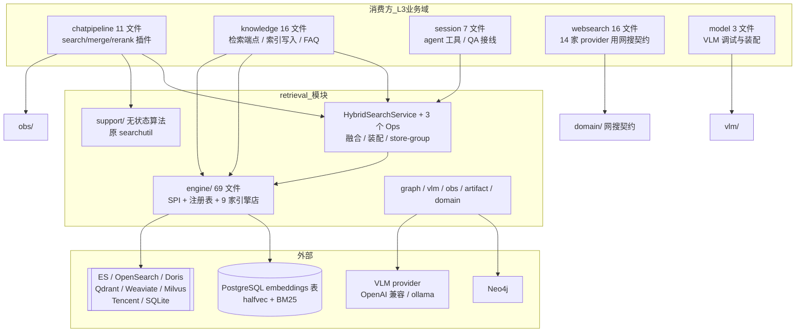
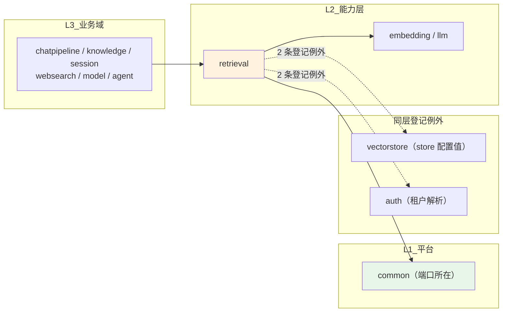
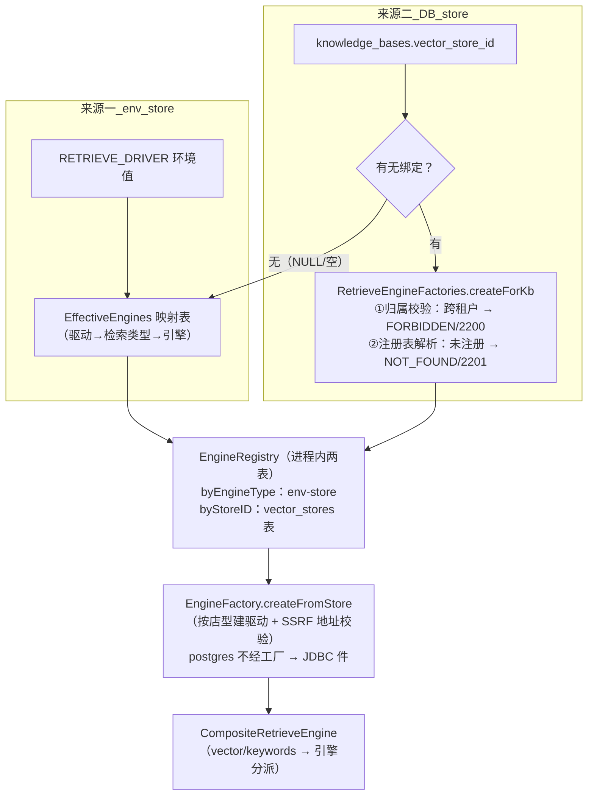
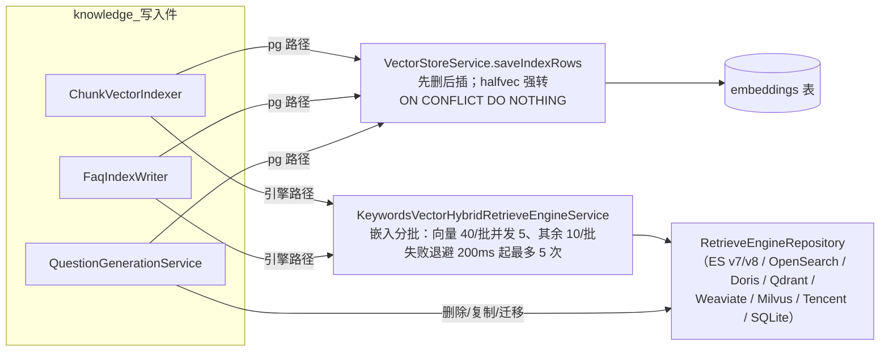

# retrieval 模块手册

> **面向读者**：第一次接手 `com.ragagent.retrieval` 的架构师 / 高级开发者。
> **目标**：30 分钟建立全局观 → 能定位改动点 → 能安全迭代（本模块有 328 个后端用例兜底，改错会立刻红）。
> **数据口径**：2026-10-08 实测（`wc -l` 口径）：**92 个 java 文件 / 约 2.16 万行 / 9 个子包**（`engine/` 内含 8 个引擎店子包）。
> **本文档的地位**：模块级导览；仓库级作业规范见仓库根 `HANDOFF.md`（§12 结构地图、§13 落刀方法论、§14 逐包重构范式）。

---

## 0. 一分钟速览

**它是什么**：检索引擎域——**库式域，无 HTTP 面**（这是对的，不是缺失）。全仓的"把查询变成命中"都从这里走：

- **混合检索**：多 KB 查询 → store-group 路由 → 多引擎扇出 → RRF 融合 → FAQ 去噪 → SearchResult 装配（`HybridSearchService`）
- **多引擎仓储**：9 家店一套 SPI——postgres(pgvector+BM25) / sqlite / elasticsearch v7+v8 / opensearch / doris / qdrant / weaviate / milvus / tencent_vectordb
- **写索引**：`embeddings` 表（pg）与各引擎索引的写/删/复制面（`VectorStoreService` / 引擎仓）
- **辅助能力**：图谱检索（Neo4j）、VLM Predict 客户端、网络搜索结果契约类型、检索观测纯函数、检索文本工具（原 `searchutil`）

**它不是什么**（别在这里改）：

| 不负责 | 归属 |
|---|---|
| 问答编排、检索插件（search/merge/rerank）、SSE 流 | `chatpipeline`（它消费本域） |
| KB / 文档 / chunk 的落库、FAQ 语义、索引写编排 | `knowledge`（它持有 `ChunkVectorIndexer` / `FaqIndexWriter` 等写入件，调本域落索引） |
| 会话与 agent 工具的编排 | `session`（`AgentToolBackends` / `QaWiring` 只是接线） |
| 模型调用与凭据 | `model` / `llm` / `embedding` / `rerank`（本域只经 `ModelGateway` / `EmbeddingGateway` 端口拿事实与向量） |
| 引擎店的配置 UI 与 CRUD | `vectorstore`（本域只读它的 `VectorStore` 配置值） |

### 图 1：模块全景



**三个必须知道的数字**：`engine/` 占 17,738 行（**约 82%** 的代码量，9 家店一家一个子包）；最大类 765 行（`HybridSearchService`，已按 §14.7.6 从 1,260 行三刀拆出，<800 出榜）；对外只有**一个检索门面**（`HybridSearchService`）+ 一组端口适配的 SPI。

---

## 1. 目录结构与职责

### 1.1 子包清单（放什么 / 不放什么）

| 子包 | 文件/行数 | 放什么 | **不放什么** |
|---|---|---|---|
| 根 | 5 / 1,406 | 门面 `HybridSearchService` + 三个同包协作簇 `HybridFusionOps`（融合/FAQ 后处理）、`HybridResultOps`（结果装配）、`HybridStoreGroupOps`（store 分组/引擎解析） | HTTP、SQL |
| `engine/` | 69 / 17,738 | 引擎 SPI（`RetrieveEngineService` / `RetrieveEngineRepository`）、注册表 `EngineRegistry`、工厂族、pg 读写两侧 + 8 个店子包（doris 10/2,446、tencentvectordb 6/2,105、elasticsearch 6/2,017、opensearch 5/1,895、weaviate 6/1,718、milvus 7/1,649、qdrant 5/1,328、sqlite 4/1,240） | 业务判断、KB 语义 |
| `support/` | 6 / 1,012 | 无状态算法（原顶层包 `searchutil`，2026-09-30 并入）：`SearchTextUtil`（分词/签名）、`ChunkSearchUtil`（图片链接扫描/拼接）、`KeywordScoreNormalizer`、`ImageInfoMatchUtil`、`WebResultConverter` | 注入 Bean、访问数据库 |
| `graph/` | 4 / 395 | 图检索端口 `RetrieveGraphRepository` + Neo4j 实现（`NEO4J_ENABLE=true` 才建驱动，否则三操作告警+静默） | 图抽取逻辑（在 knowledge） |
| `vlm/` | 2 / 340 | VLM Predict 客户端（OpenAI 兼容 chat.completions + ollama 双通道，max_tokens=5000、temperature 缺省 0.1） | 模型配置管理（在 model） |
| `obs/` | 1 / 217 | `RetrievalObs` 观测纯函数族（码点截断/命中预览/分数汇总），只进 langfuse span | 任何 IO |
| `domain/` | 3 / 160 | 网搜契约 `WebSearchResult` / `WebSearchFilters` + `ImageInfo`（落 `chunks.image_info` jsonb） | `@TableName` 实体（本域没有） |
| `artifact/` | 1 / 300 | `ArtifactReferenceRewriter`：模型答案里的沙箱产物链接归一（`resource://` / `sandbox:`）——**当前无生产调用方**，见 §9 | — |
| `config/` | 1 / 38 | `RetrievalEnvLookup`：本域 env 查找唯一入口（B6 批 9 收敛产物） | 业务配置 |

本域只有 2 份 `package-info.java`（根 + support）；**没有 controller / mapper / repository 六件套**——库式域的标准形态（`docs/backend-package-map.md` §1）。

### 1.2 依赖方向（L2 能力层：不许依赖 L3 业务域、只收配置值）



- **向下只经 `common` 端口**（`package-info.java` 写明"本域不依赖任何业务域"）：KB/chunk 读取走 `common.knowledge` 的 `KnowledgeBaseSearchGateway` / `KnowledgeDocumentGateway` / `ChunkSearchGateway`；查询向量走 `common.embedding.EmbeddingGateway`；模型事实走 `common.model.ModelGateway`；对外载荷 `SearchResult` 在 `common.retrieval`。
- **两条 L2→L3 登记例外**（`scripts/package-cycles.baseline.json`，环只许减不许增）：`retrieval→auth`（`HybridSearchService` 用 `TenantService` 解析租户 RRF 配置）、`retrieval→vectorstore`（读 `VectorStore`/`ConnectionConfig`/`IndexConfig` 配置值）。新增 L2→L3 直连会红灯。
- **配置值从装配层进**：`config/RetrievalEngineWiringConfig`（在 `config` 域）构造 `EngineRegistry` 并按 `RETRIEVE_DRIVER` 注册 env-store；本域自己只经 `RetrievalEnvLookup` 拿已安装的查找函数。

---

## 2. 数据模型

### 2.1 本域没有实体表——它落的是"索引介质"

- **无 `@TableName` 实体、无 mapper**（grep 实测 0 处）。对 pg 的 `embeddings` 表用 `JdbcTemplate` 直读写，不经 MyBatis。
- **`embeddings` 表**（`migrations/versioned/V1__baseline.sql` L325）：`source_id varchar(64)` + `source_type` 唯一、`chunk_id` / `knowledge_id` / `knowledge_base_id` / `tag_id`、`content text`、`dimension int`、`embedding halfvec`、`is_enabled boolean`。读侧走 halfvec 距离 + ParadeDB pg_search BM25；写侧 `INSERT … ON CONFLICT (source_id, source_type) DO NOTHING`（H2 测试库退化为 VARCHAR + MERGE 近似）。
- 其余 8 家店的索引文档（ES index / qdrant collection / milvus collection…）是**外部介质**，形状由各引擎仓定义——属 HANDOFF §14.6 冻结面"检索引擎索引文档"，别顺手改键名。

**source_id 契约**（`VectorStoreService` javadoc，踩过坑）：chunk 行 = `chunkID`（无前缀）；生成问题行 = `chunkID-qID`，超 64 字节折叠为 `chunkID-q<sha256 前 12 字节 hex>`。

### 2.2 引擎契约类型（改任何一处 = 改 SPI 面）

| 类型 | 位置 | 说明 |
|---|---|---|
| `EngineTypes`（IndexInfo / RetrieveParams / IndexWithScore / RetrieveResult + 常量族） | `engine/` | 新引擎共用的共享类型；pg 的 `IndexHit` / `RetrieveResult` **嵌套在 `PgVectorRetrieveRepository` 里独立落地**（契约已被 golden 锁定，别合并） |
| `RetrieveEngineService`（引擎服务端口） | `engine/` | `index`/`batchIndex` 自算向量（收 `Embedder`），其余纯转发；唯一骨架实现 `KeywordsVectorHybridRetrieveEngineService`；迁移能力探测用 `instanceof KnowledgeIndexMover` |
| `RetrieveEngineRepository`（引擎仓库端口） | `engine/` | 各向量店实现之（现状 9 家）；postgres 由既有 JDBC 件承担，**不经此口** |
| `CompositeRetrieveEngine` | `engine/` | 检索类型→引擎分派：`retrieve` 逐参数挑第一个支持者；其余方法对全部引擎扇出（顺序确定、去重按 SourceID 保首次序） |
| `RetrieveEngineException.Kind` | `engine/` | 哨兵族：`VECTOR_STORE_NOT_FOUND` / `VECTOR_STORE_FORBIDDEN` = **永久失败**；`VECTOR_STORE_UNAVAILABLE` = **可重试**；取消/超时沿 cause 链识别 |
| `SearchResult` | `common/retrieval` | 对外载荷（SSE/引用都在用）；本域装配、不定义 |
| `WebSearchResult` / `WebSearchFilters` / `ImageInfo` | `domain/` | 网搜条目（14 家 websearch provider + agent 工具消费）、国家/时效过滤、图片富化（jsonb 透传，snake 键，见 §7.8） |

### 2.3 状态与常量族（无状态机枚举）

| 常量 | 取值 | 用在哪 |
|---|---|---|
| 引擎类型 | `postgres` / `sqlite` / `elasticsearch` / `opensearch` / `doris` / `qdrant` / `weaviate` / `milvus` / `tencent_vectordb` | `EngineTypes.ENGINE_*`、注册表、归一化表 |
| 检索类型 | `vector` / `keywords` | `EngineTypes.RETRIEVER_*`（每店声明支持哪些） |
| 命中类型 MatchType | 0 embedding / 1 keywords / 2 near_by_chunk / 3 history / 4 parent_chunk / 5 relation_chunk | 命中标记（0 起连续编号，`HybridSearchService` 与 `EngineTypes` 各有一份常量） |
| 内容来源 | 0 file / 1 faq | `EngineTypes.SOURCE_TYPE_*`；`VectorStoreService.IndexRow` 的 source_type 恒 0 |
| RRF 配置 | `rrf_k` 缺省 60、`rrf_vector_weight` 0.7、`rrf_keyword_weight` 0.3 | 租户 `retrieval_config` jsonb（`HybridSearchService.RetrievalConfigView` 读，0/负值回落缺省） |

---

## 3. 消费面：谁在调用我

> 本章对应范本的"HTTP 接口面"。**本域无 controller、无端点**（`@RestController` grep = 0）——库式域的正确形态，HTTP 面由消费域承担（如 KB 内混合检索的端点在 `knowledge/controller/KnowledgeBaseController`）。

### 3.1 消费方清单（2026-10-08 实测：56 个外部文件 / 7 个包）

| 消费包 | 文件数 | 代表调用点 | 用的什么 |
|---|---|---|---|
| `knowledge` | 16 | `KnowledgeBaseController`（`POST /knowledge-bases/{id}/hybrid-search`）、`FaqEntryQueryService`（FAQ 检索直调 `hybridSearch`）、`ChunkVectorIndexer` / `FaqIndexWriter` / `KnowledgeProcessWorker`（写索引）、`ChunkExtractService`（`addGraph`） | `HybridSearchService` + `engine/`（`VectorStoreService` / 引擎口）+ `graph/` + `support/` |
| `websearch` | 16 | 14 家 provider（Bing/Google/Tavily/Brave/DuckDuckGo/SearXNG/Exa/Bocha/Zhipu/Metaso/Baidu/Ollama/Keenable/Searxng）+ `WebSearchService` + controller | `domain/WebSearchResult`（统一产出形状）、`WebSearchFilters`、`support/WebResultConverter` |
| `chatpipeline` | 11 | `PipelinePorts`（`hybridSearch` 端口方法）、`PluginSearchOps` / `PluginSearchParallel` / `PluginMerge` / `PluginRerank` / `PluginMemoryRecall` / `PluginSearchEntity`（`searchNode`）、`SearchSupport` | `HybridSearchService`、`obs/RetrievalObs`、`support/`、`domain/` |
| `session` | 7 | `QaWiring`（端口实现→`hybridSearch`/`getQueryEmbedding`/`resolveEmbeddingModelKeys`）、`AgentToolBackends` / `AgentToolKbBackends`（agent KB 工具后端）、`MessageSearch`、`MessageService`、`VlmDescriberWiring` | `HybridSearchService`、`vlm/`、`graph/` |
| `model` | 3 | `ModelRuntimeFactory` / `ModelRuntimeConfigs` / `ModelDebugController` | `vlm/VlmClient`（VLM 连通性调试） |
| `config` | 2 | `RetrievalEngineWiringConfig`（装配三件：注册表/env-store/归属口）、`OpenSearchAuditSinkAdapter` | `engine/` + `config/RetrievalEnvLookup.install` |
| `agent` | 1 | `tools/web/WebSearchTool` | `domain/WebSearchResult` |

> ⚠️ 根 `package-info.java` 里"消费方 chatpipeline 19 / knowledge 10 / session 7"是 2026-09-30 快照；当日实测为 **chatpipeline 11 / knowledge 16 / websearch 16 / session 7**——websearch 把网搜结果契约定在本域后消费量大涨。改消费面前先 grep，别信 javadoc。

**多 KB 入口的收敛**：chatpipeline 与 agent 工具都经会话侧接线（`QaWiring` 实现 `PipelinePorts.hybridSearch`，先查 KB 存在性保 1003 错误语义，再浅拷贝 `SearchParams` 下行）；`knowledge` 侧 FAQ 检索直调门面。**新增检索入口请挂到这三条既有路径之一，别绕过 `HybridSearchService`。**

### 3.2 对外契约约定（改签名前必读）

| 约定 | 说明 |
|---|---|
| 入参 | `hybridSearch(String kbId, SearchParams params)`；`params.matchCount<=0` 归一为 50（`DEFAULT_RETRIEVAL_TOP_K`）；`queryEmbedding` 空时本域现算 |
| 出参 | `List<SearchResult>`；**无可检索管道时返回 `null` 而非空表**（wiki-only / graph-only 优雅降级）——调用方必须判 null |
| 错误 | 多 KB 跨嵌入模型 → 400（`BizException`）；绑定店跨租户 → 2200、店未注册/不可用 → 2201（`VECTOR_STORE_BINDING_INVALID` / `VECTOR_STORE_UNAVAILABLE`，均 HTTP 400）；**文案一律不含 store UUID**（防枚举），只进结构化日志 |
| 兜底语义 | 多组扇出 all-or-nothing：任一组失败/超时整条检索塌成 2201 |
| 引擎 SPI | 新店实现 `RetrieveEngineRepository` + 在 `EffectiveEngines` 映射表登记 + 工厂加 SSRF 地址策略 + `EngineAwareNormalizer` 加归一条目，四处同批 |
| 端口依赖 | 本域不 import 知识域——消费方对 KB/chunk 的读取是 `common.knowledge` 端口（由知识域实现）；别让引擎直接查业务 mapper |

---

## 4. 核心链路

### 4.1 混合检索主链路（`HybridSearchService.hybridSearch`）

```mermaid
sequenceDiagram
    participant CALLER as 消费方<br/>(chatpipeline / session / knowledge)
    participant H as HybridSearchService
    participant SGO as HybridStoreGroupOps
    participant ENG as CompositeRetrieveEngine / 引擎仓
    participant FUS as HybridFusionOps
    participant RES as HybridResultOps

    CALLER->>H: hybridSearch(kbId, params)
    H->>H: matchCount 归一（缺省 50）+ KB facts 经 kbGateway
    H->>H: 多 KB 嵌入模型一致性闸门（跨模型 400）
    H->>H: over-retrieval 池＝5x matchCount（下限 50、上限 500）
    H->>H: 查询向量现算（EmbeddingGateway，一次沿 params 下行）
    H->>SGO: KB 按 (vectorStoreId, 属主租户) 分桶
    SGO->>ENG: 逐组 createForKb 解析复合引擎（哨兵 2200/2201）
    H->>ENG: 单组直取 / 多组虚拟线程扇出（上限 4、组超时缺省 30s）
    Note over ENG: 跨引擎类型先过 EngineAwareNormalizer 归一<br/>（只归向量分，BM25 透传）
    ENG-->>H: 命中 → toPgShape（IndexHit）
    H->>FUS: 向量/关键词分流 → RRF 融合（rrf_k=60，0.7/0.3）或按分去重
    FUS->>FUS: FAQ 后处理（迭代只涨 TopK，负向问题过滤）
    H->>H: 截断到 matchCount
    H->>RES: 命中 → SearchResult（chunk 元数据补全 + FAQ 问题回填）
    RES-->>CALLER: List&lt;SearchResult&gt;（null = 无可检索管道）
```

要点：组序 = KB 首见序（LinkedHashMap，结果可复现）；组超时到点即判失败（线程自然跑完、结果丢弃）；`authorizeKBAccess` 在控制器层落地，服务层不重复查授予。

### 4.2 引擎解析与注册（两条来源、一张注册表）



注册表**是进程内的**：别的实例注册的引擎本实例就是缺的、启动期建失败的引擎重启后仍缺——靠**按需重建**自愈，四道闸：冷却 30s / 代数复核 / singleflight（按 `tenantID:storeID` 分键）/ panic 兜底（`EngineRegistry` javadoc）。`RETRIEVE_DRIVER` 未配置 → 空集 → 检索全关（"No retrievable indexing pipelines"）。

### 4.3 写索引链路（消费方编排，本域承接）



### 4.4 辅助链路（图 / VLM / 网搜 / 观测）

| 链路 | 写入方 | 本域角色 | 读取方 |
|---|---|---|---|
| 图谱 | `ChunkExtractService.addGraph`、`KnowledgeMoveService.delGraph` | `graph/Neo4jGraphRepository`（未启用时静默） | `PluginSearchEntity.searchNode`（一跳子图） |
| VLM | model 域装配 | `vlm/VlmClient`（reasoning 模型整形 max_tokens→max_completion_tokens） | `session/VlmDescriberWiring`（图片描述）、`model` 调试 |
| 网搜 | 14 家 provider 产出 `WebSearchResult` | `support/WebResultConverter` 转 `SearchResult` | agent `WebSearchTool`、chatpipeline |
| 观测 | — | `obs/RetrievalObs` 四个纯函数（rerank/memory_recall/search 的 span 输入） | chatpipeline 5 文件 + `ChunkExtractService` |

---

## 5. 改哪里（场景 → 文件）

| 我想… | 主要改这里 | 别忘了 |
|---|---|---|
| 改融合权重 / RRF 语义 | `HybridSearchService.RetrievalConfigView`（缺省 60/0.7/0.3）+ `HybridFusionOps.fuseOrDeduplicate` | 配置来自租户 `retrieval_config` jsonb，0/负值回落缺省 |
| 改 FAQ 去噪 / 迭代取回 | `HybridFusionOps.applyFaqPostProcessing` | 迭代只涨 TopK 且对全部绑定店统一生长 |
| 改 store 分组 / 绑定校验 | `HybridStoreGroupOps` + `engine/RetrieveEngineFactories` | 哨兵 2200/2201 的分类语义（永久 vs 可重试）不能混 |
| 改扇出并发 / 超时 | `HybridSearchService.MULTI_STORE_FANOUT_LIMIT` / `multiStoreRetrieveTimeout`（env `MULTI_STORE_RETRIEVE_TIMEOUT_SEC`） | all-or-nothing 语义是契约，别改成败组返回 |
| 接一家新引擎店 | `engine/<店>/` 新仓实现 `RetrieveEngineRepository` → `EffectiveEngines` 映射表 + `EngineFactory` SSRF 策略 + `EngineAwareNormalizer` 归一条目 + `config/RetrievalEngineWiringConfig` env 键 | 五处同批；对照 HANDOFF §14.7.5 范式（9 仓 20 刀已收官） |
| 改 pg 写入 / source_id | `engine/VectorStoreService` | source_id 契约（§2.1）；调用方负责先删后插 |
| 改 pg 检索 / BM25 | `engine/PgVectorRetrieveRepository` | `SET LOCAL` 必须在事务内（构造器已包 `TransactionTemplate`），拆掉即静默失效 |
| 改分数归一 | `engine/EngineAwareNormalizer` | Milvus 是唯一 [-1,1] 带符号余弦 → `(score+1)/2`；BM25 恒透传 |
| 改关键词分数归一 | `support/KeywordScoreNormalizer` | ≥10 条才用 p5/p95；无方差全置 1 |
| 改分词 / 去重 / 签名 | `support/SearchTextUtil` | 中文分词是降级接缝（§7.6），别"顺手修正"滑窗行为 |
| 改图检索 | `graph/Neo4jGraphRepository` + 端口 `RetrieveGraphRepository` | 未启用 Neo4j 时三操作告警+静默是设计行为 |
| 改 VLM 请求形状 | `vlm/VlmClient` | reasoning 模型的 max_tokens/采样参数整形别删 |
| 改网搜结果契约 | `domain/WebSearchResult` + `support/WebResultConverter` | 下游 16 个 websearch 文件 + agent 工具同批 |
| 改观测 span 载荷 | `obs/RetrievalObs` | 产出只进 span，行为契约由 rerank 的 span 输入测试钉住 |
| 加 env 回落键 | 读点用 `config/RetrievalEnvLookup.get` | install 在 `config/RetrievalEngineWiringConfig` 构造器——挪走会静默丢 env 配置（§7.5） |
| 改产物链接归一 | `artifact/ArtifactReferenceRewriter` | 字节契约 `contracts/w5g3c-artifacts.tsv`；先确认 §9 的接线状态 |

---

## 6. 常见迭代 SOP

> 铁律：**一次只动一个轴**；每步结束**全绿**再走下一步（哪怕只是移动文件）。

```bash
# 每次改动后必跑（约 3 分钟）
cd ~/ragagent && JAVA_HOME=/opt/homebrew/opt/openjdk@21/libexec/openjdk.jdk/Contents/Home \
  ./gradlew :server:test :server:spotlessCheck
# 引擎仓动了外部形状时，可单跑本域（快）：
#   ./gradlew :server:test --tests "com.ragagent.retrieval.*"
```

**A. 调检索行为（融合 / FAQ / 截断）**：改 `HybridFusionOps` → 跑 `HybridSearchServiceStoreGroupTest` + `CompositeRetrieveEngineTest` → 若影响 SSE/引用可见形状，同批改 chatpipeline 消费方与前端 → 三绿 → 提交。

**B. 接新引擎店**：`engine/<店>/` 端口实现 + 单测（镜像目录）→ `EffectiveEngines` / `EngineFactory` / `EngineAwareNormalizer` / wiring 四处登记 → `EffectiveEnginesTest` / `EngineFactoryTest` / `EngineRegistryTest` → 三绿。别忘 `isKnownEngineType`（未知类型会刷 WARN + clamp01）。

**C. 改索引写入**：`VectorStoreService`（pg）或对应引擎仓 → `PgVectorEngineRepositoryTest` / 引擎仓测试 → 知识域写入件（`ChunkVectorIndexer` / `FaqIndexWriter`）的调用点行为复核 → 三绿。

**D. 改对外载荷（`SearchResult` / `WebSearchResult`）**：类型虽在 `common` / 本域 `domain/`，字段被 SSE、agent 工具、前端消费——后端与前端**同批**改完再提交，补金片。

**E. 重构（拆类 / 移动）**：门面留**全量薄委托**（HANDOFF §13.3）→ 测试随类同包 `git mv` → `HybridSearchService` 与三个 Ops 是**同包协作**（包内可见字段互访），拆去别的包要先收窄这批可见性 → 每包补 `package-info` → 三绿。

---

## 7. 模块约定与坑（必读）

1. **"永久失败"与"可重试"不能混报**：`VECTOR_STORE_NOT_FOUND` / `VECTOR_STORE_FORBIDDEN` 是永久失败（异步 worker 据此 SkipRetry 丢单），`VECTOR_STORE_UNAVAILABLE` 才可重试——把取消/超时报成 not-found 等于把一次性抖动变成永久丢单（`RetrieveEngineFactories` / `RetrieveEngineException` javadoc，原文警示）。
2. **用户可见文案不含 store UUID**（防枚举泄漏）；租户/store 只进结构化日志；日志里店只报 `env` / `bound`（`HybridSearchService.storeKindLabel`）。
3. **多 KB 检索必须同嵌入模型**：跨嵌入模型身份键 → 400（不同嵌入空间的分数不可比）；身份键 = `model.name + "|" + baseUrl` 按 (modelID, 属主租户) 解析（`validateSameEmbeddingModel`）。wiki-only / graph-only KB 空键豁免。
4. **pg 引擎不经 `EngineFactory`**：读写由 `PgVectorRetrieveRepository` / `VectorStoreService` 两个 JDBC 件承担，走到工厂即抛"明确指引"式异常；`EngineTypes` 是给**新增引擎**的，别把 pg 件往里搬（两处 javadoc 明示）。
5. **`RetrievalEnvLookup.install` 的安装点是刻意的**：必须在 `RetrievalEngineWiringConfig` 构造器（早于任何引擎 `@Bean`）——挪进通用快照装配类会因 bean 实例化顺序不保证而**静默丢掉 env 配置的集合/索引名**（`RetrievalEnvLookup` javadoc）。
6. **中文分词是登记的实质降级**：`support/SearchTextUtil` 无 jieba 等价依赖，退化为"空白切 + CJK 二字滑窗"，**与标准 jieba 不逐词一致**（去重/Jaccard 相对语义保留）；这是接缝（`Segmenter`），不是 bug，别在别的调用点重复造分词。
7. **注册表是进程内的 + 四道闸**：跨实例不可见、按需重建自愈；冷却 30s 内不再花一次完整构建超时；singleflight 按 `tenantID:storeID` 分键防蹭别租户的航班（`EngineRegistry` javadoc）。改重建逻辑必须保这四道。
8. **`domain/ImageInfo` 是 docreader Go 容器的入站契约**：`chunks.image_info` 列 + `PUT /knowledge/image/{id}/{chunkId}` 体内层 JSON，键 `original_url/ocr_text/start_pos…` 由对方服务决定——**不得"顺手 camel 化"**（HANDOFF §14.6 image_info 冻结面）。同理检索引擎索引文档本身也是冻结面。
9. **`WebSearchResult.age/published_at` 空时省略整键**，其余字段恒输出——序列化形状按契约保留，14 家 provider 靠它对齐（`domain/WebSearchResult` javadoc；这批 `@JsonProperty` 形状是登记保留，不是待换锚存量）。
10. **改动跨包必须过守卫**：`python3 scripts/check-package-cycles.py`——环只许减不许增；`retrieval→auth` / `retrieval→vectorstore` 是基线里仅有的两条本域 L2→L3，新增第三条红灯（`scripts/package-cycles.baseline.json`）。

---

## 8. 测试与验证

- **规模**：`server/src/test/java/com/ragagent/retrieval/` 下 **34 个 java 文件（33 个测试类 + 1 个假件支撑类 `RetrievalEngineTestSupport`）**，**328 个 `@Test`**，约 9,958 行测试代码。分布：`engine/` 27 个（9 个根级——含假件支撑类——+ 8 店镜像目录 18 个）、`support/` 2、`vlm/` 2、`graph/` 1、`artifact/` 1、根 1（`HybridSearchServiceStoreGroupTest`，11 用例钉 store-group 路由/扇出/归一）。
- **fixture**：本域**无 HTTP 契约 fixture**（无端点，全靠单测 + 假件/假 JDBC）。两个数据契约：`server/src/test/resources/contracts/w5g3c-artifacts.tsv`（20 行，`ArtifactReferenceRewriter` 的字节契约）与 `server/src/test/resources/jieba/jieba_baseline.json`（`JiebaTokenizerDiffTest` 分词基线）。
- **真服务端 IT（默认跳过）**：`MilvusDriverLocalIT` / `WeaviateDriverLocalIT` 各 2 用例，env 门控（`WEKNORA_MILVUS_IT=true` / `WEKNORA_WEAVIATE_IT=true`），起 compose 口径的 standalone 对真实服务端验证——引擎线格式改动时手动跑。
- **已知偶发 2 例**（全仓级，遇到先单独重跑，别误判回归）：
  - `WebToolsRecordingTest.searchWithContentFetchesLeadingPagesViaSharedFetchTool`（全量并发下偶发）
  - `EvaluationContractTest.getTerminalRunsExecution`（全量并发下偶发；单独 `--tests "*EvaluationContractTest"` 通过）
- 另注意 HANDOFF §13.9：source 过 `.env` 的 shell 会泄漏 `SYSTEM_AES_KEY` 给 Gradle 测试，全量里"孤零零 1 个环境相关失败"先 `env | grep SYSTEM_AES`。

---

## 9. 已知待办与风险（接手后优先看）

| 项 | 性质 | 建议 |
|---|---|---|
| `artifact/ArtifactReferenceRewriter`（300 行）**无生产调用方**（2026-10-08 全仓 grep：仅自测引用；javadoc 定义了 `session.domain.MessageArtifact` 消费面与 w5g3c 字节契约） | 待确认 | 确认接线意图：要么把沙箱产物链路接到它，要么明确归属/删除；别放任"有契约测试但零调用"的代码漂着 |
| L2→L3 两条登记例外（`→auth` 租户解析、`→vectorstore` store 配置值） | 结构债（低） | 基线只许减不许增；后续可按"端口化/传值"手法收（backend-package-map §3 手法 C/D），与检索行为改动不要混批 |
| 中文分词降级与标准 jieba 不逐词一致（§7.6） | 行为差异（登记） | 要对齐需给 `Segmenter` 接一个真分词实现——本仓"不许新增依赖"，须先做决策，别悄悄引库 |
| `EngineRegistry` 按需重建前的窗口 | 运维感知 | 启动建失败的引擎在重建成功前持续 2201；冷却 30s 内不重试构建——排障先看结构化日志的 `store_kind` 与重建 WARN |
| 9 家店各自 REST 自持客户端，升级依赖真服务端 IT | 维护成本 | 线格式改动必须跑对应 `*DriverLocalIT`（env 门控）；新店接入照 §14.7.5 范式，别发明第五种落法 |
| 本域 `package-info` 仅 2/9 子包 | 文档债（低） | 补齐成本低；至少给 `engine/` 补一份（SPI 族的职责地图） |
| 神类/适配器债 | **已清零** | HANDOFF §14.3：9 引擎仓 + `HybridSearchService`（1,260→775）均已出榜；本域无在办重构债，别为数字再动刀 |

---

## 10. 速查：本模块的"地标"

| 想知道 | 看这里 |
|---|---|
| 一次检索怎么走 | `HybridSearchService.hybridSearch` + 本文 §4.1 |
| 融合/FAQ 去噪在哪 | `HybridFusionOps`（RRF、按分去重、FAQ 迭代） |
| 结果怎么变成 SearchResult | `HybridResultOps`（chunk 元数据补全 + FAQ 问题回填） |
| KB 绑定哪个引擎、为什么报 2200/2201 | `HybridStoreGroupOps` + `engine/RetrieveEngineFactories`（哨兵分类） |
| 引擎怎么注册、坏了怎么自愈 | `engine/EngineRegistry`（两表 + 四道闸，§4.2） |
| `RETRIEVE_DRIVER` 支持哪些值 | `engine/EffectiveEngines` 映射表（未配置 = 检索全关） |
| pg 索引怎么写/读 | `engine/VectorStoreService`（写）+ `engine/PgVectorRetrieveRepository`（读）+ §2.1 |
| 加新引擎要动几处 | 五处同批：新仓 + `EffectiveEngines` + `EngineFactory` + `EngineAwareNormalizer` + wiring（§5-B） |
| 分数为什么有的要归一有的不用 | `engine/EngineAwareNormalizer`（只归向量分；Milvus 特例） |
| 图/VLM/网搜/观测在哪 | `graph/`、`vlm/`、`domain/`+`support/WebResultConverter`、`obs/`（§4.4） |
| env 键去哪读 | `config/RetrievalEnvLookup`（唯一入口，§7.5） |
| 谁在消费我、经什么端口 | 本文 §3 + `package-info.java`（注意其数字是旧快照） |
