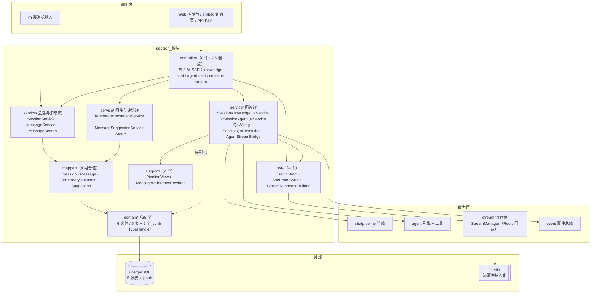
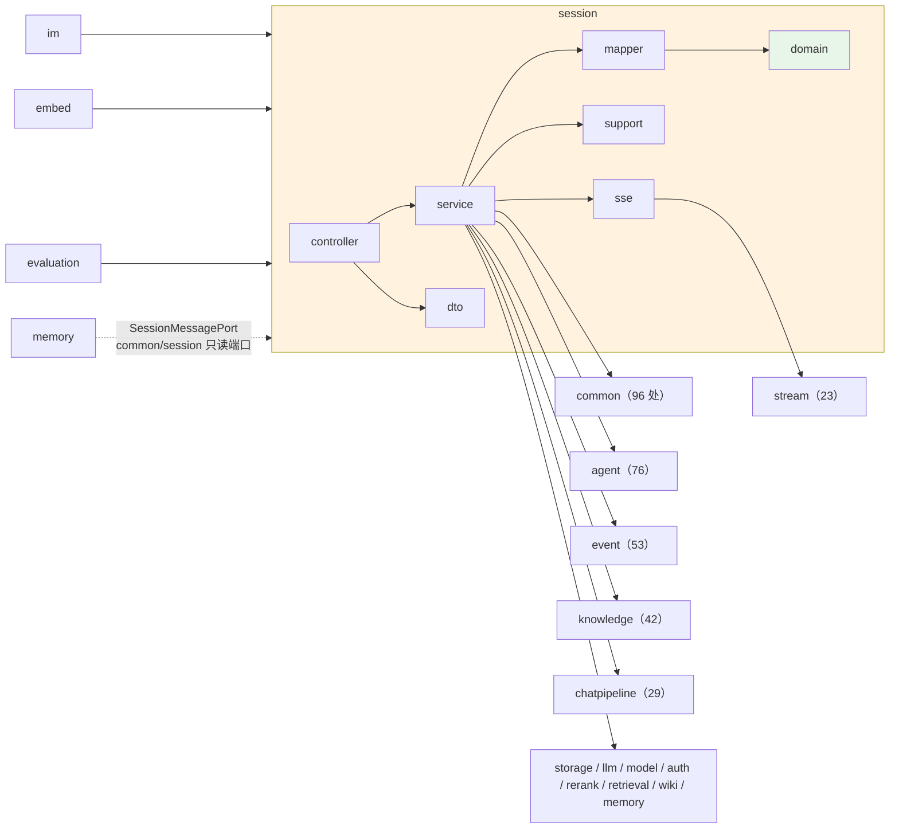
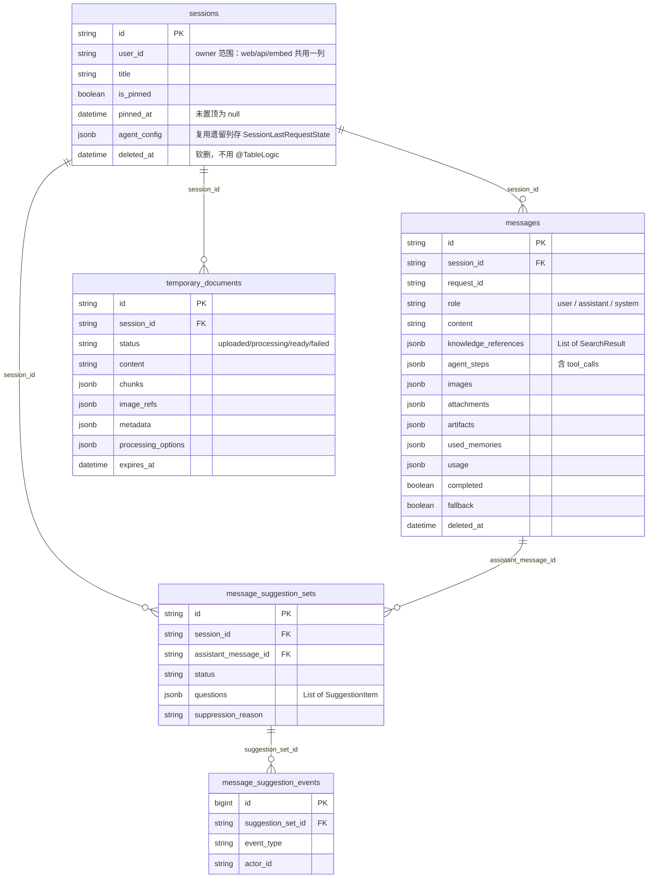
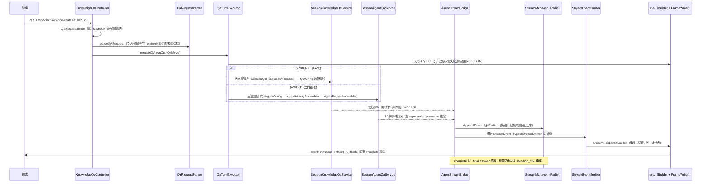
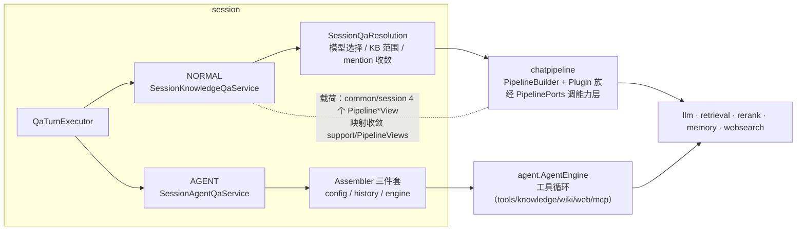
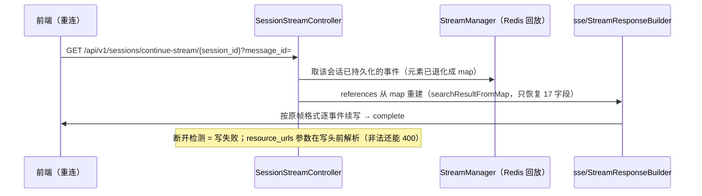
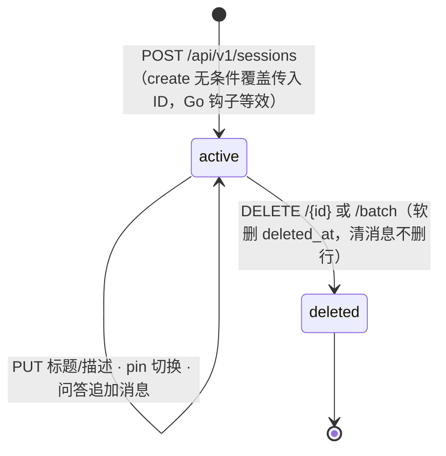

# session 模块手册

> **面向读者**：第一次接手 `com.ragagent.session` 的架构师 / 高级开发者。
> **目标**：30 分钟建立全局观 → 能定位改动点 → 能安全迭代（本模块有 394 个后端用例兜底，改错会立刻红）。
> **数据口径**：2026-10-08 实测（`wc -l` 口径）：**111 个 java 文件 / 约 2.20 万行 / 7 个子包**。
> **本文档的地位**：模块级导览；仓库级作业规范见仓库根 `HANDOFF.md`（§12 结构地图、§13 踩坑清单、§14 逐包重构范式）。

---

## 0. 一分钟速览

**它是什么**：会话域的全部后端能力——**会话与消息的持久化读写**，加**两条问答入口的编排与 SSE 流式输出**。

- 会话 CRUD：创建 / 列表（置顶优先 + 来源过滤）/ 更新 / 软删 / 批量删 / 置顶 / 清空消息 / 标题生成 / 停止生成
- 问答入口：`POST /knowledge-chat/{id}`（RAG 管线）与 `POST /agent-chat/{id}`（agent 工具循环），SSE 流式返回，消息与用量落库
- 流基础设施：SSE 帧契约（4 个响应头 + `event: message` 帧）、断线续播（`continue-stream` 从 Redis 回放）、steer 插话队列
- 消息面：历史加载、跨会话搜索（关键词 + 向量）、附件（临时文档状态机）、产物（artifact 版本）、追问建议（suggestion set + 事件）

**它不是什么**（别在这里改）：

| 不负责 | 归属 |
|---|---|
| 检索→重排→LLM 管线的**执行** | `chatpipeline`（本域通过 `QaWiring` 装配插件、经 `PipelinePorts` 调用；L3→L2 合法方向） |
| agent 引擎循环与**工具执行** | `agent`（`AgentEngine` + `agent/tools`；本域只做三段装配与事件桥接） |
| 检索算法与引擎协议 | `retrieval`（经 chatpipeline 管线间接使用） |
| 模型调用与凭据 | `model` / `llm` |
| 文件存取与字节代理 | `storage`（`MessageFileProxyController` 只做会话可见性判定，字节由 `FileProxyService` 出） |
| IM 渠道、embed 访客的**入口逻辑** | `im` / `embed`（它们调本域 service——本域被这 10 个文件消费） |
| 事件总线机制 | `event`（本域是它最大的生产方之一） |

### 图 1：模块全景



**三个必须知道的数字**：最大类 `SessionKnowledgeQaService` **756 行**（B129 例外复核后两刀出榜：兜底流渲染外提 `SessionQaFallback`（+223 行）+ WebSearch 参数解析新建叶子 `QaWebSearchParams`；其后 `AgentStreamBridge` 667 / `SessionService` 640）；`service/` 11,814 行 ≈ **54%** 的代码量，且 2026-09-30~10-01 一批刚从 8 个神类切出 15 个同包协作者；36 个端点里 **3 条是 SSE 流**，字节契约集中在 `sse/` 两个类手里。

---

## 1. 目录结构与职责

### 1.1 子包清单（放什么 / 不放什么）

| 子包 | 文件/行数 | 放什么 | **不放什么** |
|---|---|---|---|
| `controller/` | 14 / 4,254（8 个 `@RestController` + 6 个 QA 协作者） | 端点、参数绑定（`QaRequestBinder`）、请求解析（`QaRequestParser`）、SSE 编排（`QaSseOrchestrator`）、执行/收尾（`QaTurnExecutor` / `QaTurnFinalizer`）、附件解析（`QaAttachmentResolver`） | 管线与工具的执行细节（→ `service/` 之外的域） |
| `service/` | 36 / 11,814 | 会话/消息 CRUD、两条问答入口、管线装配（`QaWiring`）、agent 装配三件套、事件桥（`AgentStreamBridge`）、工具供给（`AgentToolBackends` 族）、临时文档、建议、steer | HTTP、SSE 帧格式（→ `sse/`） |
| `domain/` | 35 / 3,168 | 6 个实体（5 张表）+ **9 个 jsonb TypeHandler**（8 具体 + 1 公共基类）+ 3 个 NotFound 异常 + 查询/分页值类型 | 请求/响应形状（→ `dto/`） |
| `mapper/` | 8 / 1,681 | 4 个 MyBatis-Plus mapper + 4 个仓储门面（显式 SQL、软删、方言） | 业务判断 |
| `sse/` | 4 / 509 | SSE 帧契约：`SseContract`（4 个响应头）、`SseFrameWriter`（帧写出）、`StreamResponseBuilder`（事件→载荷的**唯一转换点**） | 业务编排 |
| `dto/` | 11 / 312 | 请求/响应记录 + `QaRequests`（三条问答入口共用的入参容器，javadoc 写明为何收一处） | 持久化注解 |
| `support/` | 2 / 257 | `PipelineViews`（实体↔`common/session` 载荷映射）、`MessageReferenceRewriter`（存储引用重写） | 有状态逻辑 |
| 根 | 1 / 11 | `package-info.java`（域职责 + 依赖方向声明） | — |

### 1.2 依赖方向



**入向只有 10 个文件**：`im/service` 6 个（IM 渠道直接调 `SessionAgentQaService` / `QaSupport` 跑问答）、`embed/controller|service` 3 个（访客会话托管）、`evaluation/service` 1 个（复用 `SessionKnowledgeQaService`）。`memory` 不直连——走 `common/session.SessionMessagePort`（`MessageRepository` 实现，2 个查询方法）。

**两个枢纽**：

1. **`QaWiring`（service/，`@Configuration`）**：chat 管线的装配中枢——管线插件（`Plugin*` 族）的组装、`PipelinePorts` 端口实现（检索/记忆/模型/重排）、11 个 seam 全在这一个类收口（`docs/known-issues/05-wave-4.md` 的 seam 清单）。改"问答用哪些能力"只动它。
2. **`common/session` + `support/PipelineViews`**：`chatpipeline ⇄ session` 成环的解法（backend-package-map 批 4n）——管线只认 `PipelineMessageView` 等 4 个载荷记录与 `SessionMessagePort`，实体↔载荷的映射收敛在 `PipelineViews` 一处。**改消息字段要同步这条链**。

---

## 2. 数据模型

### 2.1 ER 图（5 张表）



> `sessions` 表被 `Session`（写面 + 详情响应）与 `SessionListItem`（列表行）**双实体共用**（S1 换锚产物）；迁移 000001 遗留的策略列（`knowledge_base_id`/`max_rounds` 等）实体**刻意不映射**，别顺手补。

### 2.2 jsonb 列与值类型对照

| 列 | TypeHandler → 值类型 | 说明 |
|---|---|---|
| `messages.knowledge_references` | `SearchResultListTypeHandler` → `List<SearchResult>` | 引用（类型在 `common/retrieval`） |
| `messages.agent_steps` | `AgentStepListTypeHandler` → `List<AgentStep>` | agent 步骤（含 `tool_calls[].result`） |
| `messages.mentioned_items` / `.images` / `.attachments` / `.artifacts` / `.used_memories` | 同名 `*ListTypeHandler` | 全部继承 `AbstractJsonListTypeHandler` |
| `messages.usage` / `.execution_context` | `PgJsonTypeHandler` → `TokenUsage` / `MessageExecutionContext` | 用量与执行上下文 |
| `sessions.agent_config` | `PgJsonTypeHandler` → `SessionLastRequestState` | 上次发问的输入栏状态（**复用遗留列**，纯 UI 记忆，读宽容 `ignoreUnknown`） |
| `message_suggestion_sets.questions` | `SuggestionItemListTypeHandler` → `List<SuggestionItem>` | 建议项 |
| `temporary_documents.chunks` / `.image_refs` / `.metadata` / `.processing_options` | `PgJsonTypeHandler` | 解析产物 |
| `temporary_documents` 5 个时间列 | `NaiveOffsetDateTimeTypeHandler` | Go 期时间戳兼容 |

**硬约定（踩过坑，mapper 注释为证）**：

1. 实体 jsonb 列必须 `@TableField(typeHandler=…)` 且实体带 `@TableName(autoResultMap = true)`。
2. **自定义 `@Select` 不套实体的 `@TableField(typeHandler=…)`**——`MessageMapper` 的批量查询逐列写了显式 `@Results`（该文件 L112 注释），新增列两处都要加。
3. wrapper 的 `set()` 不带实体 typeHandler，必须三参写法 `set(column, value, "typeHandler=…")`（`MessageRepository` L185、`MessageSuggestionRepository` L27 同款注释）。

### 2.3 状态枚举

| 枚举 / 常量 | 取值 | 用在哪 |
|---|---|---|
| `QaSupport.QaMode` | `NORMAL`（RAG 管线）/ `AGENT`（工具循环） | 问答执行路径选择 |
| `TemporaryDocument.STATUS_*` | `uploaded` → `processing` → `ready` / `failed` | 临时附件处理状态机 |
| `Message.ROLE_*` | `user` / `assistant` / `system` | 消息角色（字符串常量）；另有 `completed` / `fallback` 两个布尔 |
| `MessageSuggestionSet.status` / `suppressionReason` | 字符串 | 建议集生命周期与抑制原因 |
| steer 状态（响应 `status` 键） | `queued` / `new_run` / `already_injected` / `gone` / `deleted` | `SteerController` 插话队列 |
| 会话来源 | `web` / `api` 常量 + `embed_channel:` / `skill_maintenance:` 标记前缀 | 列表过滤与管理台可见性判定 |

---

## 3. HTTP 接口面

### 3.1 端点分组（8 个 controller / 36 个端点）

**会话本体**（`SessionController`，14 个，前缀 `/api/v1/sessions`）

| 方法 | 路径 | 用途 |
|---|---|---|
| POST | `/api/v1/sessions` | 创建（201 + 裸对象） |
| GET | `/api/v1/sessions` | 列表（`{items, page, pageSize, total}`；keyword/source/agentId 过滤，置顶优先） |
| GET / PUT / DELETE | `/{id}` | 详情 / 更新（标题·描述）/ 软删 |
| DELETE | `/batch` | 批量删（`deleteAll=true` 走全量），同步 204 |
| DELETE | `/{id}/messages` | 清空会话消息 |
| POST / DELETE | `/{sessionId}/pin` · `/{id}/pin` | 置顶 / 取消 |
| GET | `/{id}/artifacts` · `/{id}/messages/{messageId}/artifacts` · `.../artifacts/{index}/download` | 会话产物 / 消息产物 / 产物下载 |
| POST | `/{sessionId}/generate_title` | 同步生成标题（另有流内 `session_title` 事件异步路径） |
| POST | `/{sessionId}/stop` | 停止当前生成 |

**问答入口**（`KnowledgeQaController`，3 个）——⚠️ 前两条是 **SSE 流式**：`POST /api/v1/knowledge-chat/{session_id}`、`POST /api/v1/agent-chat/{session_id}`；`POST /api/v1/knowledge-search` 是普通 JSON（`List<SearchResult>`）。

**消息**（`MessageController`，4 个）：`GET /api/v1/messages/{sessionId}/load`（历史分页）、`DELETE /api/v1/messages/{sessionId}/{id}`、`POST /api/v1/messages/search`（关键词 + 向量分组搜索）、`GET /api/v1/messages/chat-history-stats`。

**追问建议**（`MessageSuggestionController`，3 个）：`POST|GET .../messages/{message_id}/suggestions`（生成 / 取回）、`POST .../suggestion-events`（展示/点击事件落库）。

**Steer 插话**（`SteerController`，4 个）：`POST /{session_id}/steer`（无活跃运行 → `new_run`；有 → `queued`，队深有上限）、`POST .../steer/{steer_id}/inject`（注入运行中轮，重复注入 → `already_injected`）、`GET /{id}/steer`（待注入队列）、`DELETE .../steer/{steer_id}`（→ `deleted`）。

**临时附件**（`TemporaryDocumentController`，5 个）：`POST /{session_id}/attachments`（上传，multipart）、列表 / 详情 / `GET .../preview` / `DELETE`。

**流续播**（`SessionStreamController`，1 个）：`GET /api/v1/sessions/continue-stream/{session_id}`——**SSE**，断线后从 Redis 回放事件（见 §4.3）。

**消息文件代理**（`MessageFileProxyController`，2 个）：`GET|HEAD /api/v1/sessions/{id}/messages/{message_id}/files`——先证明调用者拥有会话且消息**逐字引用**该文件（5 处持久化字段整 token 匹配），再交给 storage 的 `FileProxyService`；HEAD 刻意落 NoRoute 响应。

### 3.2 契约约定（改接口前必读）

| 约定 | 说明 |
|---|---|
| REST JSON 字段名 | **JSON 名 = Java 字段名**（camelCase）。S1~S5 换锚已完成：`@JsonProperty` 188 → 0（HANDOFF §14.9l），别再加回 |
| SSE 载荷字段名 | **snake_case**（`response_type` / `session_id` / `assistant_message_id` / `knowledge_references`）——这是 Go 期 LLM 流契约，与 REST 面不同，**别统一** |
| 信封 | **无** `{data, success}` 信封：会话裸对象（201/200），列表 `{items, page, pageSize, total}` |
| 可空字段 | **恒输出**（`pinnedAt:null`、`imPlatform:""`），禁条件键（`Session` 类注释 §1.6） |
| 删除 | **204** 无 body |
| 错误 | `{error: {code, message, details}}`；`BizException`/`AppError`；分页错误为字段级中文（`page: 必须是整数`，`SessionController.bindPagination`） |
| URL 路径变量 | 保留 Go 期 snake（`{session_id}`/`{message_id}`），**部分端点双别名**（`{id}` 与 `{session_id}` 同路径数组）——别名是兼容面，别删 |
| QA 入参 | `@JsonIgnoreProperties(ignoreUnknown)`：**未登记的键静默忽略**——旧 snake 键不报错只失效，改键必须客户端同批 |
| SSE 响应头 | 4 个头逐字保持：`text/event-stream` / `no-cache` / `keep-alive` / `X-Accel-Buffering: no`（`sse/SseContract`）；最终 Content-Type 被渲染器覆盖为 `text/event-stream;charset=utf-8` |
| SSE 帧 | `event: message` + `data: StreamResponse JSON`（HTML 转义 `\u003c` 等，走全局 mapper）；**流结束判据 = `complete` 事件**（`sendCompletionEvent` 是刻意的空实现，别"修复"它） |
| SSE 时机 | 4 个头必须在**任何**正文之前写出——写了头就再也退不回 400 JSON（§7-2） |

---

## 4. 核心链路

### 4.1 一次问答的 SSE 全链路（knowledge-chat / agent-chat 共用骨架）



**失败语义**：写失败（`IOException`）即视为客户端断开——阻塞式 Servlet 拿不到即时断连通知，延迟有界、方向安全（`SessionStreamController` 类注释）。agent 轮中途决定调工具时，它自己已流出的前导段被标 `superseded`、不进持久化 `Message.content`（`AgentStreamBridge` javadoc，"最高危"一节）。

### 4.2 两条执行路径与 chatpipeline 的边界



- **方向合法**：session(L3) → chatpipeline/agent 是能力层调用；曾经的 `chatpipeline ⇄ session` 成环已用"载荷端口"解开（backend-package-map 批 4n，2026-09-30 起全仓零环）。
- **谁装配谁**：`QaWiring` 只负责 chat 管线（NORMAL）；AGENT 的装配在 `AgentConfigAssembler` / `AgentHistoryAssembler` / `AgentEngineAssembler` 三件套（§11.3 神类切片产物）。
- **改问答行为先分清路径**：检索范围/重写/摘要 → `SessionQaResolution` + `QaKbScope`/`QaMentionTagScope`/`QaSearchTargets`；管线插件开关 → `QaWiring`；工具供给 → `AgentToolBackends` 族。

### 4.3 断线续播（continue-stream）



> `searchResultFromMap` 只恢复 17 个字段、`match_type` 等键消失是**既定行为**——补"全"了字节就变，前端与 golden 全跟着红（`StreamResponseBuilder` javadoc）。

### 4.4 会话生命周期与来源可见性



- **来源标记**：`user_id`/`description` 前缀识别 embed 访客（`embed_channel:`）与 skill 维护会话；API/IM/embed 流量算"渠道托管"，Web 控制台可见性由 `Session.requiresAdminConsoleRead` 四条判定兜住（纵深防御：列表不显示，id 泄漏也打不开）。
- **软删**：不用 `@TableLogic`，每条查询显式 `deleted_at IS NULL`（MP 各版本行为敏感，显式条件语义确定）。

---

## 5. 改哪里（场景 → 文件）

| 我想… | 主要改这里 | 别忘了 |
|---|---|---|
| 加/改会话列表行为（过滤、排序） | `service/SessionService` + `mapper/SessionRepository.queryPaged` + `domain/SessionListQuery` | 置顶优先排序串在仓储；Admin 可见性判定 `Session.requiresAdminConsoleRead` |
| 给 QA 请求加参数 | `dto/QaRequests` + `controller/QaRequestParser` + `service/QaSupport.QaRequest` | 未知键静默忽略；前端与 embed 访客页**同批**改 |
| 改 NORMAL 问答的管线能力 | `service/QaWiring`（插件清单 + `PipelinePorts` 适配） | 插件装配、seam 全在此；动前读 `docs/known-issues/05-wave-4.md` |
| 改 KB 范围 / mention / 搜索目标收敛 | `service/SessionQaResolution` + `QaKbScope` / `QaMentionTagScope` / `QaSearchTargets` | 有切片测试钉着（`SessionQaResolution*Test`） |
| 改 agent 工具供给 | `service/AgentToolBackends` / `AgentToolKbBackends` / `AgentToolWikiBackends` / `AgentWebPages` | 工具定义在 `agent/tools`；本域只做后端桥 |
| 改 agent 事件→流的语义 | `service/AgentStreamBridge`（16 种事件订阅 + superseded 剔除 + duration 记账） | 最高危类；改前先补 `AgentStreamBridgeTest` 契约用例 |
| 改 SSE 字节 / 载荷字段 | `sse/StreamResponseBuilder`（唯一转换点）+ `sse/SseFrameWriter` + `llm/domain/StreamResponse`（snake 键） | golden 是掩码后逐字节比对；改键必须同步放宽掩码正则（§7-5） |
| 改断线续播 | `controller/SessionStreamController` + `stream/StreamManager` | `searchResultFromMap` 17 字段是既定行为，别补全 |
| 给消息加 jsonb 列 | `domain/Message`（`@TableField` + TypeHandler）+ `mapper/MessageMapper` 显式 `@Results` + `MessageMapper` 写 SQL | 自定义 `@Select` 不套实体 typeHandler；wrapper set 要三参写法（§2.2） |
| 改附件上传/解析 | `service/TemporaryDocumentService` / `TemporaryDocumentProcessor` / `TemporaryDocumentPromptResolver` | 状态机 `uploaded→processing→ready/failed`；prompt 注入看 `ResolveForPrompt` |
| 改 steer 插话 | `controller/SteerController` + `service/SteerRunCoordinator` / `SteerSinkBridge` | 状态键（queued/new_run/…）前端在消费；队深上限别放开 |
| 改追问建议 | `service/MessageSuggestionService` + `MessageSuggestionPipeline`（无状态管道） | 展示/点击事件走 `MessageSuggestionEvent` 落库 |
| 改跨域消息载荷 | `common/session` 载荷 + `support/PipelineViews`（两端同批） | 管线与 memory 蒸馏都认载荷不认实体 |
| 改标题生成 | `service/QaTurnFinalizer`（异步 `session_title`）+ `SessionController.generate_title`（同步端点） | 两条路径并存；标题截断 100 码点（known-issues 06-wave-5） |

---

## 6. 常见迭代 SOP

> 铁律：**一次只动一个轴**；每步结束**全绿**再走下一步（哪怕只是移动文件）。

```bash
# 每次改动后必跑（全量闸门）
cd ~/ragagent && JAVA_HOME=/opt/homebrew/opt/openjdk@21/libexec/openjdk.jdk/Contents/Home \
  ./gradlew :domains:test :domains:spotlessCheck
# 迭代中单域快跑（秒级）：
./gradlew :domains:test --tests "com.ragagent.session.*"
# 若动了前端可见契约（字段名/信封/状态码/SSE 事件），同批带前端：
cd frontend && npx vue-tsc --build --force && npm test
```

**A. 加端点**：`dto/` 请求记录 → `controller/`（`@Valid`、错误走 `BizException`/`AppError`）→ `service/` 用例 → 补契约 fixture（`domains/src/test/resources/contracts/`，掩码正则键名字符集用 `[A-Za-z_]+`）→ 三绿 → 提交。

**B. 加 jsonb 字段**：`domain/` 实体（TypeHandler + `autoResultMap`）→ `MessageMapper` 显式 `@Results` 补列 → 写路径 wrapper 三参 `set` → 契约 golden 重录并**结构化复核差异**（HANDOFF §13.12）→ 三绿。

**C. 加 SSE 事件类型**：`ResponseType`（`common/llm`）→ `StreamResponseBuilder` 映射表 → `AgentStreamBridge` 订阅 → `AgentStreamBridgeTest` 先行 → golden 重录（`-Dcontract.refresh=true` 仅限已接入的契约测试）→ 三绿。

**D. 加表**：`domain/` 实体 → `mapper/` 接口 + 仓储门面 → schema 两处同改（`migrations/versioned/V1__baseline.sql` + `domains/src/test/java/com/ragagent/TestSchema.java`，否则 H2 报 `Column not found`）→ 三绿。

**E. 重构（切片/搬迁）**：按 HANDOFF §13.1 套路（侦察三类依赖 → 按调用点定边界 → harness 干跑 → 逐字忠实性核验）；`@Autowired` 字段改 `ObjectProvider` 构造注入；`record` 跨类搬运把 `r.x` 改 `r.x()`。本域 §11.3 八神类批次的实测结论：**受阻刀的解法是"先落被依赖方"**。

---

## 7. 模块约定与坑（必读）

1. **行数榜单先看空白率**（HANDOFF §13.8）：session 是排版 artifact 重灾区之一（wiki/session 两批共 14 文件，空白行占比 55%~78%；`SessionQaResolution` 表面 707 实际 184）。`wc -l` 失真时用 `scripts/normalize-blank-lines.py` 折叠；落刀写盘一律单空行。
2. **SSE 头一旦写出退不回 400**（`sse/SseContract` 类注释）：参数校验、`resource_urls` 解析必须前置到写头之前；`sendCompletionEvent` 是刻意的空实现，流结束判据是 `complete` 事件。
3. **SseFrameWriter 禁挂私有 mapper**（类注释）：HTML 转义规则由 `config.JacksonConfig` 全局统一，"同一段文本在不同路径给出不同字节"就是从私有 mapper 开始的。
4. **布尔字段名不带 `is` 前缀**（`domain/Session.pinned` javadoc）：字段名与 getter 名必须一致，否则 Jackson 冒出 `isPinned`/`pinned` 两个键（真实踩过），MyBatis-Plus lambda 也对不上列映射。
5. **契约夹具掩码按键名匹配**（HANDOFF §13.13）：掩码正则形如 `"([a-z_]+)":"<uuid>"`，键换 camelCase 后静默失效、真实 id/时间戳混进夹具——本域有实录（S3 `att-get` 的 sessionId）。改键名同步把字符集放宽为 `[A-Za-z_]+`，重录后跑第二遍确认确定性。
6. **闸门环境卫生**（HANDOFF §13.9）：`source .env` 的 shell 会把 `SYSTEM_AES_KEY` 泄漏给 Gradle 测试，出现"孤零零 1 个环境相关失败"先 `env | grep SYSTEM_AES`，别误判回归。
7. **jsonb 三条铁律**（§2.2）：`autoResultMap = true`；自定义 `@Select` 显式 `@Results`；wrapper 三参 `set`。漏了就是"写得进、查出来是 null"这类静默故障。
8. **`sessions.agent_config` 是复用的遗留列**（`domain/Session` javadoc）：存 `SessionLastRequestState`，`SessionRepository.update` **不写它**、只有 `updateLastRequestState` 单独写；存量行是旧 snake 键，读宽容但会静默吞值——动这条链要带迁移 SQL（S1 批有 5 处 jsonb 迁移先例）。
9. **软删不用 `@TableLogic`**（同上）：每条查询显式 `deleted_at IS NULL`，新查询照抄，别"统一"成注解。
10. **QA 入参未知键静默忽略**（`dto/QaRequests` javadoc）：改键不报错只失效；服务端、前端、embed 访客页、集成文档必须同批。
11. **`@Valid` 默认 message 随 locale 漂移**（HANDOFF §13.10）：本域旧注解仍是默认 message（`knowledge` 域已示范显式 `message = "字段名: 不能为空"`），属"错误形态统一批"存量，顺手改。
12. **神类切片别整块继承"头部样板"**：本域 2026-09-30 切片曾带出多余 import / 只注入不读取的依赖（§13 判据）；抽完必查。

---

## 8. 测试与验证

- **规模**：**38** 个测试类 / **394** 个 `@Test`（2026-10-08 实测；HANDOFF 2026-10-01 口径为 388）。单域命令：`./gradlew :domains:test --tests "com.ragagent.session.*"`。
- **fixture 前缀**（`domains/src/test/resources/contracts/`，共 **160** 个）：
  `session-` 45（`SessionHttpContractTest`）、`msg-` 22（`MessageHttpContractTest`）、`sug-` 20（`MessageSuggestionContractTest`）、`g6-` 20（`SessionG6ContractTest`）、`att-` 15（`AttachmentContractTest`）、`w5d-` 14（`W5dTerminalEmbedContractTest`）、`qa46d-` 14（`KnowledgeQaContractTest` + `TemporaryDocumentUploadContractTest`；内含 `kch-*`/`ach-*` SSE golden——stub LLM 录制，掩码后逐字节比对）、`st-` 10（`SteerContractTest`）。
- **比较口径**：契约比较器是**语义比较**（键序 / 转义归一化后比），fixture 锚定的是**本仓自己的行为**；SSE golden 按掩码后**逐字节**比对（更严）。
- **已知偶发 2 例**（全仓，遇到先单独重跑，别误判回归）：
  - `WebToolsRecordingTest.searchWithContentFetchesLeadingPagesViaSharedFetchTool`（全量并发下偶发）
  - `EvaluationContractTest.getTerminalRunsExecution`（全量并发下偶发；单独 `--tests "*EvaluationContractTest"` 通过）
- **改前端可见契约时**：后端与前端**同批**改完再提交（S2~S4 批次即此做法）。

---

## 9. 已知待办与风险（接手后优先看）

| 项 | 性质 | 建议 |
|---|---|---|
| ~~`SessionKnowledgeQaService` 1,029 行~~ | **已出榜（2026-10-08 B129）**：1,041→**756**，两刀——① 兜底流渲染簇（207 行）**并入既有** `SessionQaFallback`（那些方法的唯一调用方本来就是它，原先是它回调门面 ✗）；② WebSearch 参数解析簇（69 行）新建叶子 `QaWebSearchParams`。教训见 HANDOFF B129（"同名注入"优于"加前缀"）|
| `MessageFileProxyController` 跨租户两条授予路径未实现 | 已知收紧（偏保守） | shared-agent / org-shared KB 下 owner ≠ caller 恒 403（类注释）；要放开走 `FileAccessResolver` 端口补，需单独一批 + fixture |
| `SessionKnowledgeQaService` 的 hybridSearch adapter 空实现 | 备案差异 | javadoc"已知差异（备案）"；检索执行面收口归检索面专项，别在本域顺手补 |
| `@Valid` 默认 message locale 漂移 | 存量 | 本域旧注解未显式 message（§7-11）；错误形态统一批路过时顺手改 |
| `agent_config` 遗留列复用 | 技术债 | `SessionLastRequestState` 落在遗留列；加字段先确认旧 snake 键迁移面（§7-8） |
| 迁移 000001 遗留列未映射 | 刻意为之 | NOT NULL 由 DB 默认值兜住；**别顺手补映射**（`domain/Session` javadoc） |

---

## 10. 速查：本模块的"地标"

| 想知道 | 看这里 |
|---|---|
| 一次问答怎么跑 | §4.1 + `controller/QaTurnExecutor` → `SessionKnowledgeQaService`（NORMAL）/ `SessionAgentQaService`（AGENT） |
| SSE 字节长什么样 | `sse/StreamResponseBuilder`（唯一转换点）→ `sse/SseFrameWriter` → `sse/SseContract`（4 个响应头） |
| 断线为什么能续播 | `controller/SessionStreamController` + `stream/StreamManager`（Redis 回放，§4.3） |
| agent 事件怎么进流 | `service/AgentStreamBridge`（16 种事件 + superseded preamble 剔除） |
| 管线用什么插件、端口怎么接 | `service/QaWiring` + `chatpipeline/PipelinePorts` |
| KB 范围 / mention 怎么收敛 | `service/SessionQaResolution` + `QaKbScope` / `QaMentionTagScope` / `QaSearchTargets` |
| 消息 jsonb 怎么读写 | `domain/Message` + `domain/*TypeHandler` + `mapper/MessageMapper`（显式 `@Results`，§2.2） |
| 会话谁能看见 | `domain/Session`（`requiresAdminConsoleRead`）+ `service/SessionLookupScope` |
| steer 插话语义 | `controller/SteerController` + `service/SteerRunCoordinator` / `SteerSinkBridge`（§3.1 状态键） |
| 跨域载荷（管线/memory） | `common/session` 4 个 `Pipeline*View` + `SessionMessagePort` + `support/PipelineViews` |
| 临时附件状态机 | `service/TemporaryDocumentService` → `Processor` / `PromptResolver`（§2.3 状态枚举） |
| 目录为什么这样分 | 本文 §1 + 根 `package-info.java`（域职责与依赖方向声明） |
