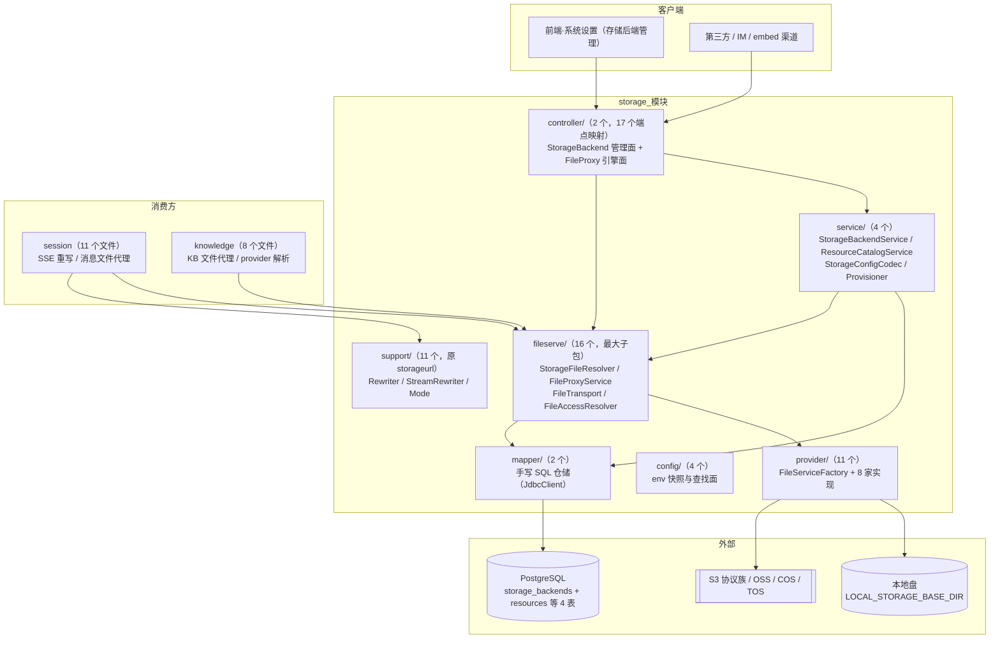
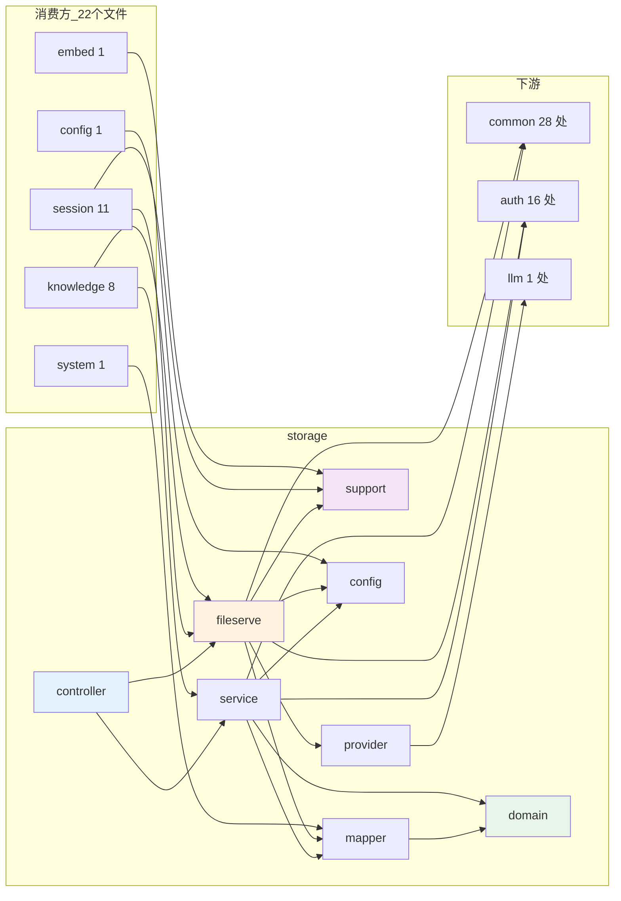
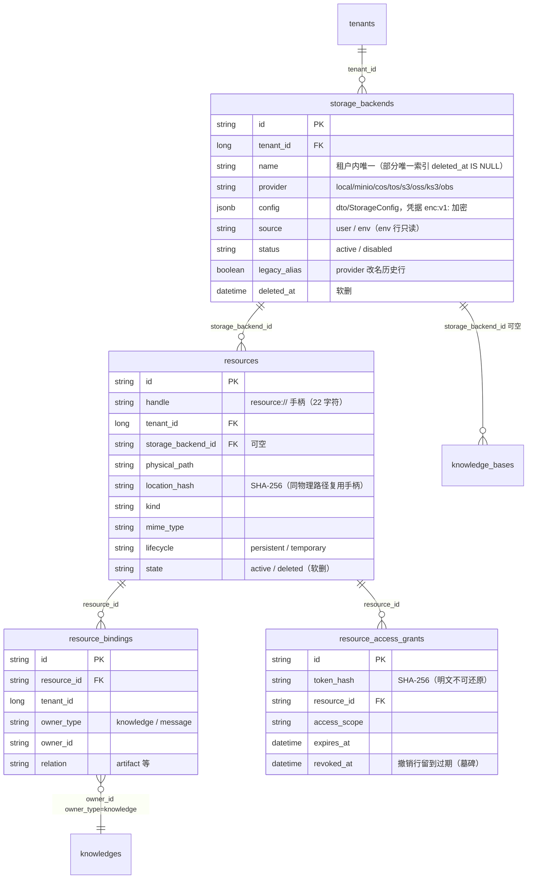
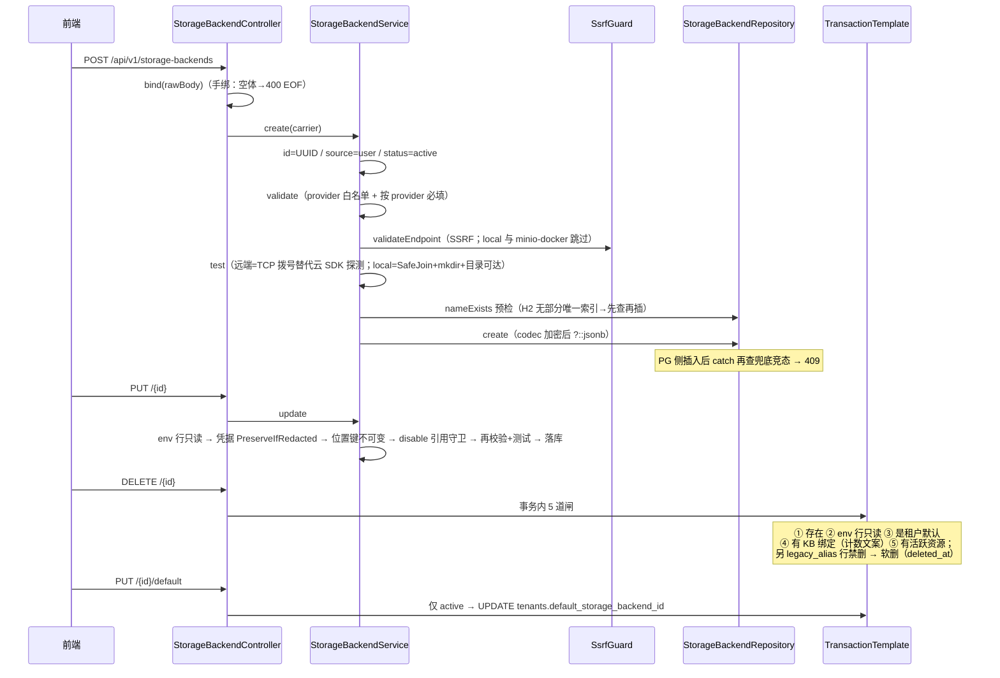
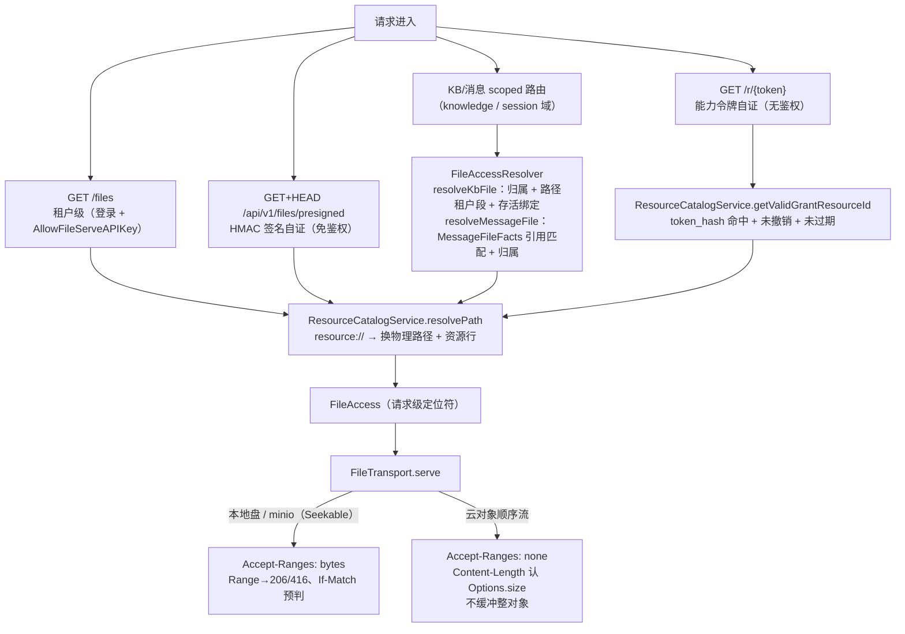
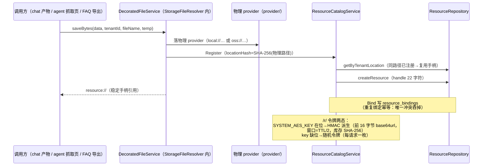
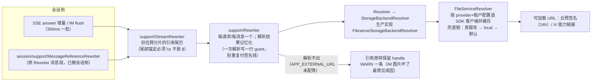

# storage 模块手册

> **面向读者**：第一次接手 `com.ragagent.storage` 的架构师 / 高级开发者。
> **目标**：30 分钟建立全局观 → 能定位改动点 → 能安全迭代（本模块有 140 个后端用例 + 124 份契约 fixture 兜底，改错会立刻红）。
> **数据口径**：2026-10-08 实测（`wc -l` 口径）：**55 个 java 文件 / 约 0.9 万行 / 9 个子包**。
> **本文档的地位**：模块级导览；仓库级作业规范见仓库根 `HANDOFF.md`（§12 结构地图、§13 踩坑清单、§14 逐包重构范式）。

---

## 0. 一分钟速览

**它是什么**：存储域的全部后端能力——**两副面孔**：

- **存储后端管理面**：`storage_backends` 表的 CRUD、连通性测试、租户默认后端；env 快照自动装配（建租户时按 `STORAGE_TYPE`/`MINIO_*` 等环境族落一行 env 后端）；provider 白名单与校验（含 SSRF）
- **文件服务面**：8 家 provider（local + S3 协议族 s3/minio/obs/ks3 + 原生 SDK oss/cos/tos）的真实读写实现；`resource://` 资源注册表与 `/r/<token>` 能力链接；`/files` 租户级文件代理与 presigned URL；存储引用 → 可加载 HTTP URL 的**重写器**（SSE 流式扣留版）

**它不是什么**（别在这里改）：

| 不负责 | 归属 |
|---|---|
| knowledge 域内的本地/租户文件读写（`TenantFileStorage` / `LocalStorageService`） | `knowledge/storage` 子包（它调本域的 provider 解析，两者共享 `StoragePathGuard` 内核与 `LOCAL_STORAGE_BASE_DIR`） |
| 对象存储凭据落在 KB 行内的那份配置（`knowledge_bases.storage_config` jsonb） | knowledge 域（与 `knowledge_bases.storage_backend_id` 绑定是两条路） |
| 消息文件的 HTTP 路由（`/api/v1/sessions/{id}/messages/{mid}/files`） | `session/MessageFileProxyController`（**路由在消费方域，授权与传输引擎在本域**） |
| 租户行回写 `default_storage_backend_id` 的建租户编排 | `auth/TenantService`（本域只经 `common/storage.StorageBackendProvisioner` 命令端口被调） |

### 图 1：模块全景



**三个必须知道的数字**：最大类 785 行（`fileserve/StorageFileResolver`——backend 优先 / legacy alias / 环境回落 / resource 装饰**四段解析语义的单点**）；`fileserve/` 一个子包 3,361 行（占全模块 37%）；`mapper/` 里两个类都叫 `*Repository` 且是**手写 SQL**（JdbcClient），不是 MyBatis-Plus 接口——名字会骗人。

---

## 1. 目录结构与职责

### 1.1 子包清单（放什么 / 不放什么）

| 子包 | 文件/行数 | 放什么 | **不放什么** |
|---|---|---|---|
| `config/` | 4 / 326 | env 快照装配：`StorageProviderEnv`（env 族 → 落库 camel 键）、`StorageEnvLookup`（provider 键查找**唯一入口**）、两个 `@ConfigurationProperties` record | 业务逻辑、`System.getenv`（B6 后归零） |
| `controller/` | 2 / 383 | `StorageBackendController`（管理面 9 端点）、`FileProxyController`（文件面 4 路径 8 映射 + HEAD 形态工具） | 业务判断（连通性测试的实现细节在 service，但**响应形态**的特例在控制器 javadoc） |
| `service/` | 4 / 1,117 | `StorageBackendService`（CRUD/校验/SSRF/拨号探测）、`ResourceCatalogService`（`resource://` 手柄与 `/r/` 令牌）、`StorageConfigCodec`（config jsonb **唯一读写口**）、`DefaultStorageBackendProvisioner` | SQL（→ `mapper/`） |
| `fileserve/` | 16 / 3,361 | 运行时解析器 `StorageFileResolver`、代理 handler `FileProxyService`、流式出口 `FileTransport`、授权 `FileAccessResolver`、路径工具 `StoragePaths`、local 实现、A3-3 接线件 | provider SDK 细节（→ `provider/`） |
| `provider/` | 11 / 2,112 | `FileService` 接口 + `FileServiceFactory` + 8 家实现（local / S3 协议族×4 / oss / cos / tos）+ seek 能力 + `StorageObjects`（安全文件名 / XSS 降级） | HTTP、Spring 事务 |
| `support/` | 11 / 1,088 | 原顶层包 `storageurl`（2026-09-30 并入）：`Rewriter` / `StreamRewriter`、`Mode`（handle/public）、三个窄端口（`FileService` / `Resolver` / `StorageBackendResolver`） | 真实文件 IO（它只调端口，实现由 `fileserve/` 接线） |
| `mapper/` | 2 / 398 | `StorageBackendRepository`（方言分支 `?::jsonb`）、`ResourceRepository`（resources / bindings / grants 三表）——`@Repository` + JdbcClient **手写 SQL** | MyBatis-Plus 接口（本域一个都没有）；业务判断 |
| `domain/` | 2 / 129 | `StorageBackend`（`@TableName storage_backends`）、`StoredResource`（`resources` 表载体，无 MyBatis 注解） | 请求/响应形状（→ `dto/`） |
| `dto/` | 2 / 68 | `StorageConfig`（config jsonb 载荷，13 字段 camel）、`StorageBackendResponse`（config 掩码后输出） | 持久化注解 |

> 全模块只有 **2 份 `package-info.java`**（根 + `support/`），远低于 knowledge 的 13 份——各子包职责说明目前靠类 javadoc，接手时先读各类头注释（质量很高，都是踩坑后写的）。**最大类 top3**：`fileserve/StorageFileResolver` 785 / `service/StorageBackendService` 573 / `fileserve/FileTransport` 565。

### 1.2 依赖方向（只允许向下；全仓零包间环）



**两组已解的包间环（接手前发生过，别改回去）**：

- `session ⇄ storage`：storage 曾 import 会话 `Message` 实体判"消息是否引用该文件"→ 已端口化为 `FileAccessResolver.MessageFileFacts` 载荷（会话侧 `factsOf` 映射）+ `Rewriter` 消息段搬回会话侧（`MessageReferenceRewriter`）。
- `auth ⇄ storage`：provider 白名单 `StorageAllowList` 下沉 `common/storage`（auth/storage/system 三方共用）；建租户时的默认后端落库改为 `common/storage.StorageBackendProvisioner` 命令端口（实现在本域 `DefaultStorageBackendProvisioner`）。

**storage 向上的 16 处 auth import 要知道**：`Tenant`/`TenantService`（按租户取实体，`fileserve` 解析链的入参）、`auth/domain/tenantconfig/StorageEngineConfig`（引擎面投影）、`APIKeyScopeContext`/`TenantAPIKeyScope`（public 模式的越权裁决）。`llm` 那 1 处是 `ChatLocalImageResolverWiring` 注册 `ImageResolver` 全局钩子。

---

## 2. 数据模型

### 2.1 ER 图（本域 4 张表 + 3 处被引用列）



- 迁移：`storage_backends` 为 000068；`resources` / `resource_bindings` / `resource_access_grants` 为 000069（均已并入 `migrations/versioned/V1__baseline.sql`，H2 侧同源于 `TestSchema`）。
- 被引用列：`tenants.default_storage_backend_id`（设默认守卫与列表响应读它）、`knowledge_bases.storage_backend_id`（KB 绑定计数）、删除守卫还要数 `resources` 活跃行——**删除一个后端要过 5 道闸**（见 §4.1）。
- `StoredResource` 类名 ≠ 表名直觉：表是 `resources`（类 javadoc 明说"勿按类名推断"）。

### 2.2 jsonb 列与值类型对照

| 列 | 值类型 | 说明 |
|---|---|---|
| `storage_backends.config` | `dto/StorageConfig`（mode/endpoint/region/accessKeyId/secretAccessKey/bucketName/pathPrefix/appId/useSsl/forcePathStyle/useTempBucket/tempBucketName/tempRegion） | **唯一读写口 `service/StorageConfigCodec`**：decode 严格解密（带 `enc:v1:` 前缀才解，失败抛异常拖垮行加载）；encode 凭据加密后落库（无 `SYSTEM_AES_KEY` 原样） |

**硬约定（踩过坑）**：

1. 读写**只准走 `StorageConfigCodec`**。这条链路出过三个同源缺陷（引擎面凭据键分族、落库面词汇不符、供给器绕过加密明文落库——B14/B15 修，出处 `StorageConfigCodec` javadoc）；只要存在第二条写路径，第三类问题就会换个门再出现。
2. 本域 jsonb **不走 MyBatis-Plus wrapper**：实体上的 `@TableField(typeHandler=PgJsonTypeHandler.class)` + `autoResultMap=true` 是跟随全仓约定；实际读走 `RowMapper` 里 `MAPPER.readTree`，写走 `?::jsonb` 强转（PG）/ 原样（H2）——见 `StorageBackendRepository` javadoc。
3. 引擎面（snake，各 provider 段命名不统一）与落库面（camel）是**两套词汇**：落库面由 `config/StorageProviderEnv` 直接产出；引擎面由 `StorageFileResolver.renameConfigKeys` **单点派生**——别在第三处再做一次键名翻译。

### 2.3 状态与受控取值

| 取值面 | 值 | 用在哪 |
|---|---|---|
| provider | `local` / `minio` / `cos` / `tos` / `s3` / `oss` / `ks3` / `obs`（8 家全实现） | `common/storage.StorageAllowList`（`STORAGE_ALLOW_LIST` 可收窄；`/types` 的输出顺序=展示序契约） |
| `storage_backends.source` | `user` / `env` | env 行**只读**（update/delete 直接 400） |
| `storage_backends.status` | `active` / `disabled` | disable 有引用守卫（默认/KB 绑定/活跃资源任一 >0 拒绝）；setDefault 仅 active |
| `resources.state` | `active` / `deleted` | 软删语义；三读方法都带 `state='active'` |
| `resources.lifecycle` | `persistent` / `temporary` | 临时文档 vs 持久产物 |
| `support/Mode` | `handle`（默认）/ `public` | `RESOURCE_URL_MODE` env + `?resource_urls=` 请求参数 |
| `FileAccessException.Kind` | `NOT_FOUND` / `UNAUTHORIZED` / `FORBIDDEN` | 文件代理三态 → 404/401/403 |
| `legacy_alias` | boolean | provider 改名的历史行；**删除被禁**直到旧路径引用清零 |

---

## 3. HTTP 接口面

### 3.1 端点分组（2 个 controller / 17 个端点映射）

**存储后端管理**（`StorageBackendController`，前缀 `/api/v1/storage-backends`，9 个）

| 方法 | 路径 | 用途 |
|---|---|---|
| GET | `/types` | provider 白名单（`StorageAllowList.allowedList`，展示序） |
| POST | `/test` | 用请求体裸测连通性（**200 + `{connected:false,error}`**，不抛 4xx/5xx） |
| POST | ``（裸路径） | 创建（**201 + 裸资源**；连通测试失败 → 400 信封） |
| GET | ``（裸路径） | 列表 = `{items, defaultStorageBackendId}` |
| GET | `/{id}` | 详情（config 掩码 `***`） |
| PUT | `/{id}` | 更新（**先绑 body 再进 service**：未知 id + 坏 body → 400，非 404） |
| DELETE | `/{id}` | 软删（**204**；5 道闸见 §4.1） |
| PUT | `/{id}/default` | 设租户默认（仅 active；**204**） |
| POST | `/{id}/test` | 按已存后端测连通性（同 `/test` 的 200 形态） |

**文件代理引擎面**（`FileProxyController`，4 条路径 / 8 个映射；**四组路由的鉴权分层各不相同**，关键在注册位置）

| 方法 | 路径 | 鉴权 | 用途 |
|---|---|---|---|
| GET | `/files` | 需登录；**在 /api/v1 组之外**（APIKeyGate 不跑，路由自带 AllowFileServeAPIKey） | 租户级存储代理（`?path=`） |
| HEAD | `/files` | — | 显式回 gin 404 形态（见 §3.2） |
| GET+HEAD | `/api/v1/files/presigned` | **免鉴权**（AuthFilter noAuthAPI 白名单；HMAC 签名自证；HEAD 是 IM 平台预检契约） | 签名 URL 取文件 |
| GET | `/api/v1/files/presigned-preview` | DenyAPIKeyPrincipal → RequireRole(Admin)（**Admin 诊断面**） | 预览"这个引用会解析成什么 URL" |
| HEAD | `/api/v1/files/presigned-preview` | — | 显式 gin 404 形态 |
| GET+HEAD | `/r/{token}` | **完全无鉴权**（AuthFilter 对 `/r/` 前缀让路；短时令牌自证） | capability URL（TTL 缺省 2h，窗口=TTL/2） |

> 另有 4 条 scoped 代理路由**在消费方域**：KB 文件 `GET|HEAD /api/v1/knowledge-bases/{id}/files`（knowledge）、消息文件 `GET|HEAD /api/v1/sessions/{id}/messages/{message_id}/files`（session）——它们复用本域的 `FileAccessResolver`（授权）/ `FileProxyService.serveAuthorizedFile`（落盘出口）/ `FileTransport`（流式），并共用 `FileProxyController` 的 HEAD 形态工具。文件代理面共 8 条路由由 `W5cFileProxyContractTest` 一并钉住。

### 3.2 契约约定（改接口前必读）

| 约定 | 说明 |
|---|---|
| 字段名 | JSON 名 = Java 字段名（camelCase）；`StorageConfig` 对未知键容忍（`@JsonIgnoreProperties`） |
| 错误信封 | 管理面**全 AppError 信封**（404 = code 1003；校验/SSRF = 1000/1010）——与文件面的纯字符串 404 **刻意不同** |
| 连通性测试 | **HTTP 恒 200**：失败体 `{connected:false, error:清洗后中文文案}`（`sanitizeConnectivity` 八类映射：DNS/拒连/超时/403/证书/404…） |
| 必填校验 | 手绑 rawBody（不用 `@Valid` DTO）：缺 name/provider → 400，字段级文案 `Name\nrequired` 固定序（golden 按单缺失字段钉住） |
| config 输出 | **掩码**：非空 `accessKeyId`/`secretAccessKey` → `"***"`；`deletedAt` 恒 null（可空字段显式输出）；时间 ISO-8601 带时区 |
| 文件面错误形态 | 无 body 状态用 `plainStatus`；错误信封 `{error: msg}` 单键；presigned-preview 的多键体按**字母序**插入 |
| HEAD 形态 | gin 兼容：只注册 GET 的路由对 HEAD 显式回 **404 + `text/plain` + `404 page not found`（无换行）**——Spring `@GetMapping` 会透明匹配 HEAD 吞体，故需显式 HEAD 映射 |
| 租户缺失 | storage handler **不校验租户缺失**（tenantId=0 时 list 为空、get 404），与其他域不同 |
| 更新语义 | 凭据**保留规则**：incoming 为空串或 `***` 占位都保留存量；`endpoint/region/bucket/pathPrefix` 是**位置键，不可变**（改了报"use storage migration instead"） |

---

## 4. 核心链路

### 4.1 存储后端管理（创建 → 更新 → 删除 → 默认）



**env 装配支线**（建租户时无 HTTP 参与）：`auth/TenantService` → `common/storage.StorageBackendProvisioner` 端口 → 本域 `DefaultStorageBackendProvisioner` → `config/StorageProviderEnv`（按 provider 取环境族，**变量名不变**，落库=行面 camel）→ `StorageConfigCodec` 加密 → 落一行 `source=env` 后端。

### 4.2 文件读取与授权（四组路由，一套出口）



- **授权错误三态**：`FileAccessException`（NOT_FOUND/UNAUTHORIZED/FORBIDDEN）→ 代理服务折 404/401/403。消息授权**只认本租户**（跨租户双授予链已随空间分享裁撤）。
- **消息引用判定只看持久化渲染字段**（content / artifacts[].url / knowledge_references / images / agent_steps[].tool_calls[].result）——工具参数与请求元数据不算证据。
- minio 可 seek 是 **SDK 类型差异不是产品语义**，别"顺手统一"到所有云 provider（那会迫使其余 provider 整对象缓冲）。

### 4.3 写入与 `resource://` 注册（写字节面）



- 写面端口是 `fileserve/WritableFileContentService`（SaveBytes/DeleteFile）；装饰器让"写字节"自动获得资源注册——**落库引用从此是稳定 `resource://` 手柄**，换存储后端不改引用。
- 临时桶语义：FAQ 导出等 `temp=true` 的写入走各家 provider 的临时桶分支（oss/tos/cos 各有对象名规则，见类 javadoc）。

### 4.4 存储引用 → HTTP URL 重写（SSE / IM 出站）



- **模式裁决**（`support/Mode.resolve`）：请求 `?resource_urls=public|handle` 合并部署默认 `RESOURCE_URL_MODE`；匿名 embed 流量被 `StorageUrlContext` 钉死 handle（静默降级）；**KB 受限 API Key 请求 public → 403**（`PublicModeForbiddenException`，是 `ResourceModeException` 的子类——catch 子类在前）。
- **日志纪律**：重写成功记源引用于 INFO；**签名后的 URL 只记 DEBUG**（免得日志聚合系统把匿名可读链接发出去）。

---

## 5. 改哪里（场景 → 文件）

| 我想… | 主要改这里 | 别忘了 |
|---|---|---|
| 加/改管理面端点 | `controller/StorageBackendController` + `service/StorageBackendService` | 响应形态是契约：200 连通测试体、`{items, defaultStorageBackendId}`、config 掩码；补 `sb-*` fixture |
| 加一家 provider | `provider/FileServiceFactory`（IMPLEMENTED 集 + 工厂分支）+ 新实现类 + `common/storage.StorageAllowList.SUPPORTED`（顺序=展示序契约）+ `StorageBackendService.validateForProvider`（必填族） | 未实现要**明确抛异常**，不许静默退化到本地盘 |
| 改 config jsonb 形状 | `dto/StorageConfig` + `StorageConfigCodec`（唯一读写口） | 引擎面键名翻译只在 `StorageFileResolver.renameConfigKeys`；补 round-trip 断言 |
| 改 env 自动装配 | `config/StorageProviderEnv`（env 族→camel）+ `DefaultStorageBackendProvisioner` | env **变量名不变**（松散绑定）；空串/假值整键省略 |
| 改连通性探测 | `StorageBackendService.test` / `dialEndpoint` + `sanitizeConnectivity`（中文文案映射） | 远端=TCP 拨号语义（不实现鉴权/桶检查）；COS 无 endpoint 按 region+bucket 构造域名 |
| 改文件授权逻辑 | `fileserve/FileAccessResolver` | 消息引用判定**别改成整条消息序列化**（匹配范围变宽=越权）；三态异常别加第四态 |
| 改流式响应行为 | `fileserve/FileTransport`（seek/流式两支 + 304/416 头形态） | 头部是逐行 golden（`w5c-*` 二进制+headers 双锚）；multipart/byteranges 边界随机 |
| 改路径解析/签名 | `fileserve/StoragePaths`（provider://、resource://、租户段校验、签名） | `parseStorageTarget` 组合语义；`containsStorageReference` 被会话侧重用 |
| 改 URL 重写 | `support/Rewriter`（记忆化/日志）+ `support/StreamRewriter`（扣留）+ `Mode` | 尾部锚定 `\z`；URL 只记 DEBUG；handle 降级是特性不是 bug |
| 改 local 双实现的共享内核 | `fileserve/StoragePathGuard`（单一份实现） | 两支调用方（knowledge.LocalStorageService / LocalFileContentService）**各自保留**引用形态与错误通道，不合并 |
| 加资源生命周期规则 | `service/ResourceCatalogService` + `mapper/ResourceRepository` | `/r/` 令牌窗口=TTL/2；撤销行留到过期（墓碑语义） |
| 动 storage_backends 表 | `domain/StorageBackend` + `mapper/StorageBackendRepository`（COLS 与两处方言分支） | schema 两处同改：`migrations/versioned/V1__baseline.sql` + `domains/src/test/java/com/ragagent/TestSchema.java`（否则 H2 `Column not found`） |

---

## 6. 常见迭代 SOP

> 铁律：**一次只动一个轴**；每步结束**全绿**再走下一步（哪怕只是移动文件）。

```bash
# 每次改动后必跑（约 3 分钟）
cd ~/ragagent && JAVA_HOME=/opt/homebrew/opt/openjdk@21/libexec/openjdk.jdk/Contents/Home \
  ./gradlew :domains:test :domains:spotlessCheck
# 若动了前端可见契约（字段名/信封/状态码），同批带前端：
cd frontend && npx vue-tsc --build --force && npm test
```

**A. 改管理面端点/校验**：`StorageBackendService`（validate/test 链）→ controller 响应形态 → 补 `sb-*` fixture（单缺失字段钉必填序）→ 三绿 → 提交。手绑 rawBody 的字段文案是固定序，别改成集合序。

**B. 加 provider**：`StorageAllowList.SUPPORTED`（common，**展示序即契约**）→ `FileServiceFactory` 分支 + 实现类（对象名/路径形态/预签名 24h/跨后端拒绝照各家 javadoc 对照表）→ `validateForProvider` 必填族 → provider 单测 → 三绿。

**C. 动 config 形状**：`StorageConfig` 字段 → `StorageConfigCodec` round-trip → `StorageProviderEnv` 输出键（若 env 面）→ 真机验证 `enc:v1:` 落库（B15 的 A/B 口径）→ 三绿。

**D. 加/改文件路由**：先确认放哪个域——**租户级/presigned//r/ 在本域 `FileProxyController`；KB/消息 scoped 在消费方域**（本域只加授权分支）→ `FileProxyService` handler → `FileAccessResolver` 三态 → 重录/复核 `w5c-*`（二进制 golden 用 `scripts/record-w5c-golden.sh`）→ 三绿。

**E. 重构（拆类/移动）**：沿类 javadoc 的 `// ── X 段 ──` 边界拆 → 端口（support/ 三窄口）保持窄 → **测试随类同包 `git mv`** → 每包补 `package-info`（本域仅 2 份，补齐是加分项）→ 三绿 → 提交。守卫：`python3 scripts/check-package-cycles.py`（环基线 0，**只许减不许增**）。

---

## 7. 模块约定与坑（必读）

1. **`LOCAL_STORAGE_BASE_DIR` 必须放持久目录、严禁 /tmp**（HANDOFF §8：旧环境实测 2026-09-28，macOS 清 /tmp 导致已入库原始文件丢失不可恢复）。本域 `FileServiceFactory` / `support/FileServiceResolver.localStorageBaseDir` / `StorageBackendService` 同读此 env（缺省 `/data/files`）；knowledge/storage 的 `LocalStorageService` 是主要受害者但 env 共享。
2. **config jsonb 只有一条读写路**：`StorageConfigCodec`（§2.2）。B15 之前供给器绕过加密直写 jsonb，私钥明文落库——别再造第二条路。
3. **`StreamRewriter` 尾部锚定必须 `\z` 不是 `$`**：Java 的 `$` 还匹配末尾换行符之前，以换行结尾的分片会被整段扣住（类注释原文）。
4. **HEAD 的 404 形态是契约**：只注册 GET 的路由要显式 HEAD 映射回 gin 形态（404 + `text/plain` + `404 page not found` 无换行）；Spring `@GetMapping` 透明匹配 HEAD 吞体（`FileProxyController` 类注释）。
5. **管理面与文件面的 404 形态刻意不同**：管理面全 AppError 信封（404=1003），文件面纯文本/gin 形态——对齐它们等于破坏 golden（`StorageBackendController` javadoc）。
6. **`findLegacyAlias` 不过滤 `deleted_at` 是刻意的**，别"顺手修好"（`StorageBackendRepository` javadoc：legacy 行要连软删行一起找到）。
7. **minio 的 seekable 是 SDK 类型差异**：`SeekableFileService` 只 minio 一族实现，"顺手统一"会让其余云 provider 被迫整对象缓冲。
8. **名称唯一性双轨**：PG 靠部分唯一索引（`deleted_at IS NULL`）抛错 → 409；H2 无该索引 → 先查再插 + 插入后 catch 兜底竞态（`StorageBackendService.create` 注释）。
9. **读环境只有一个入口**：provider 键走 `config/StorageEnvLookup`（装配期 `install`），部署配置走 `@ConfigurationProperties`（B6 后 storage 域裸 `System.getenv` 归零）；`AppEnvLookup`/`StorageRuntimeEnv` 在 `common/deployment`、`common/storage`（B33 归位）。
10. **`StorageObjects.safeFileName` 丢弃目录而非拒绝**（Go `filepath.Base(Clean(name))` 语义；skill 归档与 FAQ 导出依赖它）；SVG/HTML/JS/CSS 等主动内容**降级 `application/octet-stream`** 防存储型 XSS。
11. **SDK 坑史在 `docs/known-issues/08-storage-a3.md`**：COS `CopyObjectRequest` 参数序**源在前**；TOS SDK 版本与 V2 命名；`local://` 是 provider scheme 但归本地盘；OSS 409 按错误码判（无状态码）。
12. **`RESOURCE_URL_MODE` 笔误降级到 handle 而不是让请求失败**（一个笔误不该打挂所有请求）；坏值按值去重告警一次。
13. **`resource://` 一次解析写一行 access-grant**：所以 Rewriter 每请求/每消息一个、解析记忆化、跨线程串行——别在循环里各造一个 Rewriter。
14. **闸门环境卫生**：`source .env` 的 shell 会把 `SYSTEM_AES_KEY` 泄漏给同 shell 的 Gradle 测试 → `DataSourceJsonTest` 等出现"孤零零 1 个环境相关失败"（HANDOFF §13.9）；W5c 的 presigned 200 分支依赖该 key，测试 JVM 无它时验证的是 403 恒等形态。

---

## 8. 测试与验证

- **规模**：**19** 个测试类 / **140** 个 `@Test`（2026-10-08 实测）。分布：`support/` 4 类 51（Rewriter 26 / StreamRewriter 16 / Mode 7 / 接线 2）、`fileserve/` 7 类 47、`provider/` 4 类 22、根 3 类 19（`StorageBackendContractTest` 4 / `StorageWriteFaceContractTest` 6 / `W5cFileProxyContractTest` 9）、`service/` 1 类 1。
- **fixture**：管理面锚 `sb-*`（39 份）；文件代理面锚 `w5c-*`（85 份，`scripts/record-w5c-golden.sh` 录制；二进制 golden `*.bin + *.bin.headers` 双锚，头部比对归一化容器噪音）——`w5c` 族同时覆盖 knowledge/session 域的 scoped 代理路由。
- **比较口径**：契约比较器是**语义比较**（键序/转义归一化后比），fixture 锚定**本仓自己的行为**；HEAD 形态与二进制体是逐字节比。
- **写读回环**：`StorageWriteFaceContractTest` 钉 SaveBytes → 资源注册 → ResolvePath 回读 → 绑定落 `resource_bindings` → 软删后解析失败 → 同路径注册复用手柄。
- **已知偶发 2 例**（遇到先单独重跑，别误判回归）：
  - `WebToolsRecordingTest.searchWithContentFetchesLeadingPagesViaSharedFetchTool`（全量并发下偶发）
  - `EvaluationContractTest.getTerminalRunsExecution`（全量并发下偶发；单独 `--tests "*EvaluationContractTest"` 通过）
- **历史假红备案**（`docs/known-issues/08-storage-a3.md`）：Gradle 全量一次跑曾成片 `MockitoInitializationException → ByteBuddyAgent`（多 fork 自附着失败）；现在全量是常规闸门，但见到成片同型红先想到它，分模块复跑确认。

---

## 9. 已知待办与风险（接手后优先看）

| 项 | 性质 | 建议 |
|---|---|---|
| `system/service/SystemInfoService` 直连本域 `mapper/StorageBackendRepository` 与 `domain/StorageBackend` | 边界观察项 | L3 同级"禁直连对方 mapper/实体"（包地图 §3.5）；它只读 `list(tenantId)` 做信息页展示——建议照 `StorageBackendService` 的读面方法收口（`StorageBackendController` 当年同款修法，见包地图 P3） |
| 知识文件的 provider 解析策略分叉（Go 按 backend 三级 / 本仓 `TenantFileStorage` 按路径 scheme） | 决策项（备案） | 正常写入路径下等价；跨 scheme 遗留 `file_path` 会分叉（Go 500 / 本仓可读）。是否对齐先决策再动（`08-storage-a3.md` 备案节） |
| 云 provider 真连通与 env 供给分支无单测 | 测试盲区 | 桶探测/上传/预签名需凭据（部署态）；`storageBackendFromEnvironment` 的 env 分支 `System.getenv` 进程内不可注入——改动这两处只能真机 A/B |
| local 双实现（knowledge.LocalStorageService / fileserve.LocalFileContentService） | 已裁决：**不合并** | 职责不重叠、护栏重复——合并代价 ≥8 测试类 + ~125 golden 重录、行为零收益；共享内核已收敛到 `StoragePathGuard`（两支等价性有断言） |
| `package-info` 仅 2/9 子包 | 文档债 | 各子包补 `package-info`（照 knowledge 范本），SOP E 里顺手做 |

---

## 10. 速查：本模块的"地标"

| 想知道 | 看这里 |
|---|---|
| 某个存储后端接口怎么走 | `controller/StorageBackendController` → `service/StorageBackendService` → `mapper/StorageBackendRepository` |
| 凭据怎么加解密、谁能碰 config jsonb | `service/StorageConfigCodec`（唯一读写口，§2.2） |
| 一个引用（`storage://…`/`cos://…`/`resource://…`）怎么变字节 | `fileserve/StorageFileResolver`（四段解析）→ `provider/FileServiceFactory` → 8 家实现 |
| 一个引用怎么变可加载 URL | `support/Rewriter` + `support/FileServiceResolver` + `Mode`（§4.4） |
| 文件代理怎么授权 | `fileserve/FileAccessResolver`（KB/消息两族）+ `FileAccessException` 三态 |
| 消息里"是否引用了该文件"怎么判 | `FileAccessResolver.MessageFileFacts`（端口载荷）+ `StoragePaths.containsStorageReference` |
| `/r/` 令牌怎么生成与校验 | `service/ResourceCatalogService`（HMAC 派生/窗口/墓碑）+ `mapper/ResourceRepository.getValidGrantResourceId` |
| env 怎么自动变成一行后端 | `config/StorageProviderEnv` → `service/DefaultStorageBackendProvisioner`（端口在 `common/storage`） |
| provider 白名单谁说了算 | `common/storage.StorageAllowList`（`STORAGE_ALLOW_LIST`；`/types` 展示序=契约） |
| 路径穿越防在哪几层 | `service/StorageBackendService.safeJoinUnderBase` / `fileserve/StoragePathGuard`（单一份内核）/ `provider/StorageObjects.safeObjectKey` |
| SSE 流里引用为什么不会被截断 | `support/StreamRewriter`（扣留 + `\z` 锚，§7.3） |
| 目录为什么这样分 | 本文 §1 + 根与 `support/` 两份 `package-info` + 各类 javadoc（本域真正职责地图） |
