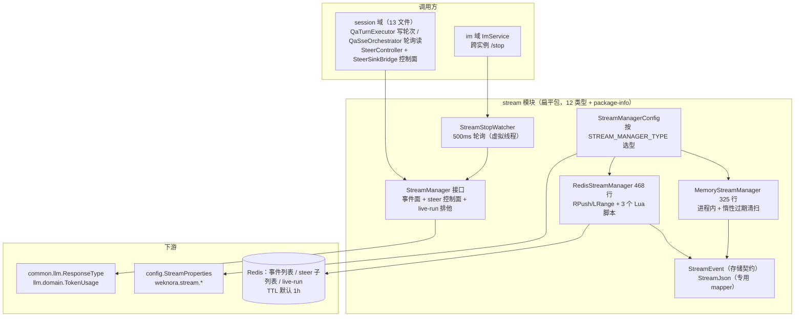
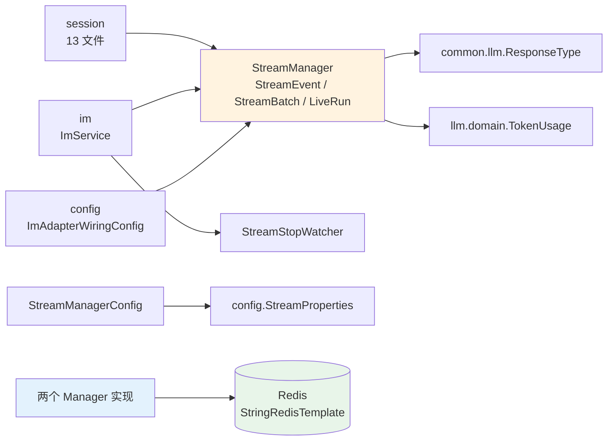
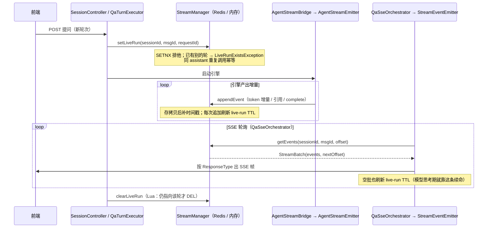
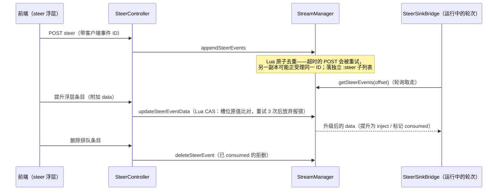
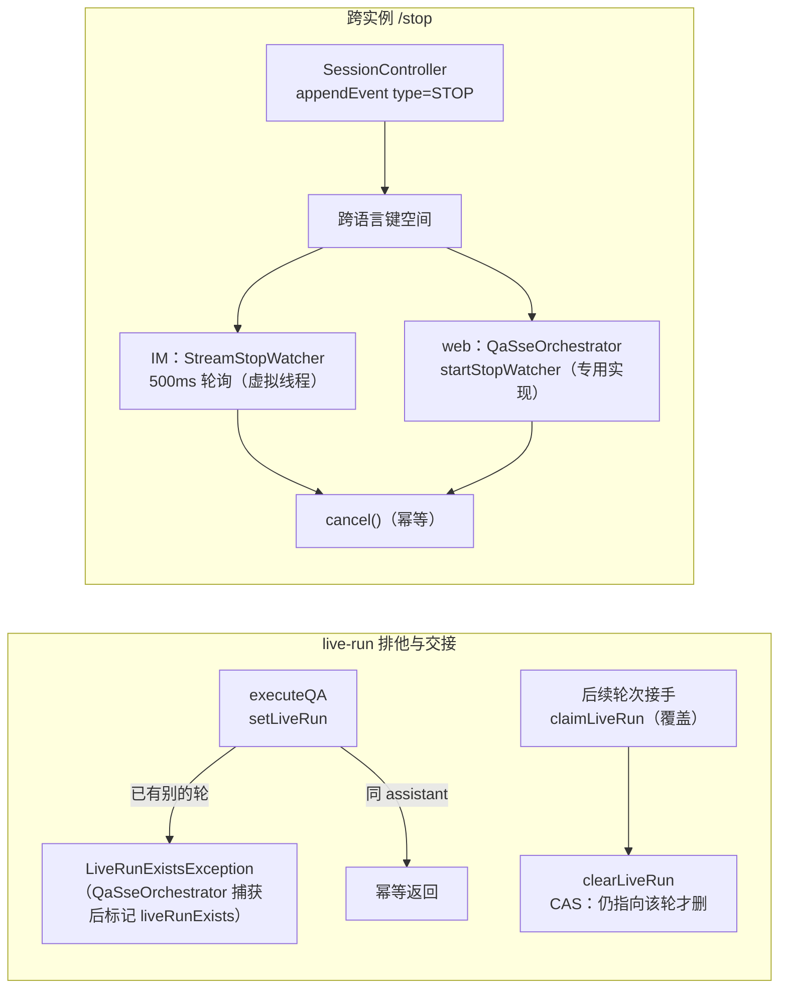

# stream 模块手册

> **面向读者**：第一次接手 `com.ragagent.stream` 的架构师 / 高级开发者。
> **目标**：30 分钟建立全局观 → 能定位改动点 → 能安全迭代（本模块有 39 个后端用例兜底，改错会立刻红；但注意 Redis 侧 15 个用例依赖环境里的 redis-server，没有则**静默跳过**，见 §8）。
> **数据口径**：2026-10-08 实测（`wc -l` 口径）：**13 个 java 文件 / 1,313 行 / 0 个子包（扁平包）**。
> **本文档的地位**：模块级导览；仓库级作业规范见仓库根 `HANDOFF.md`（§12 结构地图、§13 踩坑清单、§14 逐包重构范式）。

---

## 0. 一分钟速览

**它是什么**：SSE / 流基础设施——**流的存储与分发层**。聊天回答的增量 token、引用、complete 事件先落到这里，SSE 端点再按 offset 轮询拉走；另有两条独立的小面：steer 控制面（用户往运行中的轮次插话/递文件）与 live-run 排他标记（一个会话同时只允许一轮在生成）。

- 双实现单接口：`MemoryStreamManager`（进程内，单副本）与 `RedisStreamManager`（Redis List + 3 个 Lua 脚本，多副本共享），由 `STREAM_MANAGER_TYPE` 选型
- append-only 设计：**所有流状态都经事件承载**，没有单独的元数据存储（接口 javadoc 原话）
- 事件经 `StreamJson`（专用 ObjectMapper）序列化落 Redis，字节形态是跨实现 / 跨服务共享的存储契约
- `StreamStopWatcher`：跨实例 `/stop` 的轮询消费侧（IM 侧 500ms 虚拟线程）

**它不是什么**（别在这里改）：

| 不负责 | 归属 |
|---|---|
| SSE HTTP 端点（事件流 / steer / 会话面，session 域手册登记的 3 条 SSE 端点） | `session/controller/`（本包 grep 实测 **0 个** `@RestController`——它是 L1 平台层的流存储/分发，不是 HTTP 端点层） |
| 事件语义（`ResponseType` 取值、前端怎么渲染、EVENT_STOP 发帧） | `common.llm.ResponseType` + 消费方（`session` 编排层） |
| Redis 连接配置（地址/凭据/库） | `config`（`StreamProperties`）+ `spring.data.redis.*`；本包只拿现成的 `StringRedisTemplate` |
| 轮次编排（问答状态机、审批、知识问答） | `session/service/`（`AgentStreamBridge` 等是本包的生产方/消费方） |
| Go 字节兼容转义 | 已于 B38（2026-10-03）退役——见 §9，别再当遗产补回来 |

### 图 1：模块全景



**三个必须知道的数字**：最大类 468 行（`RedisStreamManager`），全包没有 800+ 神类；main 消费方 15 个文件全部集中在 **3 个包**（session 13 / im 1 / config 1），`StreamManager` 接口被其中 12 个文件注入；**39 个 @Test** 里 15 个跑在真 redis-server 上（没有则静默 skip）。

---

## 1. 目录结构与职责

### 1.1 类型清单（扁平包，无子包——逐类型列）

`docs/backend-package-map.md` §P1 判定：`stream`(12 文件) 与 `modelcontext`、`config` 一起**"保持扁平，不拆"**——判据是"无天然族就不拆"：SSE/流存储是单一契约，事件/实现/装配相互咬合（实现语义一半在 Lua 脚本里），没有可独立成族的子目录。

| 类型 | 行数 | 职责 | 关键点 |
|---|---|---|---|
| `RedisStreamManager` | 468 | Redis List 后端（多副本共享） | 3 个 Lua 脚本：steer 去重追加 / steer CAS 改写 / live-run 条件删；键布局见 §2.1 |
| `MemoryStreamManager` | 325 | 进程内后端（单副本） | 写入路径惰性全扫模拟 Redis TTL（节流 ttl/2、下限 100ms）；外层读写锁 + 每流一把读写锁，加锁恒先外后内 |
| `StreamEvent` | 154 | 流事件载体——**跨实现的存储契约** | `@JsonPropertyOrder` 固定 7 字段序；`data`/`usage` NON_EMPTY 省略，其余恒输出；map 键按字母序输出（CAS 依赖稳定字节） |
| `StreamJson` | 98 | 流数据专用 ObjectMapper（**不是** HTTP 那个） | 三个差异：map 键序稳定（CAS）、OffsetDateTime 本地时区 RFC3339Nano、容忍未知属性（旧版本写的行多了字段也能读） |
| `StreamStopWatcher` | 77 | 跨实例 /stop 轮询消费侧 | 500ms 虚拟线程；发现 `ResponseType.STOP` → 触发 cancel（幂等）；读错误跳过本轮 |
| `StreamManager` | 65 | 接口 | 三组方法族：事件面（append/get）、steer 控制面（append/get/update/delete）、live-run 排他（set/claim/get/clear） |
| `StreamManagerConfig` | 37 | `@Configuration` 选型 | 选 redis 时**启动即 ping**，连不上服务起不来；默认（其余一切值）走内存 |
| `StreamBatch` | 17 | record：一次增量读的结果 | `nextOffset` 按 Redis **原始条数**推进（解码失败的行也计入） |
| `LiveRunExistsException` | 17 | 会话已有另一轮在生成 | 刻意**不继承** `StreamStoreException`——调用方要按类型分开捕获 |
| `LiveRun` | 17 | record：当前生成中的一轮 | `NONE` 哨兵（两个空串 = 无 live run） |
| `LiveRunPayload` | 15 | live-run 标记的 Redis 存储形态 | snake 键（`assistant_message_id`/`request_id`），字段序固定 |
| `StreamStoreException` | 17 | 存储读写故障包装 | 非受检，全局异常处理器兜 500 |
| `package-info` | 6 | 职责声明 | 明示：流事件与旧版服务共享同一批 Redis 键，字节形态是 §11 登记边界，**勿按"历史残留"清理** |

### 1.2 依赖方向（只允许向下）



- **本包 import 的仓内类型只有 3 个**：`common.llm.ResponseType`（事件类型枚举）、`llm.domain.TokenUsage`（complete 事件的用量聚合）、`config.StreamProperties`—— L1 平台层不碰业务实体，符合分层约定（`docs/backend-package-map.md` §L1）。
- 反方向（谁 import 本包）见 §3。

---

## 2. 数据模型

**不适用**：本包没有任何实体 / 表 / mapper——append-only 设计下"所有流状态都通过事件承载……没有单独的元数据存储"（`StreamManager` javadoc）。流数据只活在 Redis（或进程内存）里，TTL 到期即逝，不落 PostgreSQL。

流内的数据形状有两层，都是**字节契约**：

### 2.1 Redis 键布局（`RedisStreamManager` javadoc）

| 键 | 结构 | 用途 |
|---|---|---|
| `{prefix}:{sessionId}:{messageId}` | List（RPush 追加 / LRange 按 offset 读） | 用户可见事件流 |
| `{prefix}:{sessionId}:{messageId}:steer` | 同上，独立键 | steer 控制面子列表——**永不上用户可见 SSE 流** |
| `{prefix}:{sessionId}:live-run` | String（`LiveRunPayload` JSON，SETNX 排他） | 该会话当前生成中的一轮 |

- `prefix` 默认 `stream:events`；来自 `REDIS_PREFIX` 且**原样拼接、不裁尾冒号**——dev 配 `REDIS_PREFIX=stream:` 会拼出 `stream::sess:msg`（双冒号），**原样保留**（键名要与既有部署一致，`RedisStreamManagerTest.keyLayoutMatchesGoIncludingTheDoubleColonFromEnvPrefix` 钉住）。
- TTL：`weknora.stream.ttl` 默认 1h（application.yml 硬编码 `1h`），三类键同源；两个后端的过期语义对齐（内存后端用惰性全扫模拟键 TTL）。

### 2.2 事件 JSON 契约（`StreamEvent`，键序固定）

`id` → `type` → `content` → `done` → `timestamp` → `data` → `usage`。前五个恒输出（string 零值 `""`、bool 零值 `false`）；`data`（引用/元信息）与 `usage`（TokenUsage）NON_EMPTY 整键省略；timestamp 为本地时区 ISO_OFFSET_DATE_TIME（RFC3339Nano）。已知差异：`type` 未设置时为 `null`（真实产出方恒赋值，javadoc 备案）。

**硬约定（踩过坑）**：

1. map 键**按字母序**输出（`ORDER_MAP_ENTRIES_BY_KEYS`）——`updateSteerEventData` 的 CAS 把读到的原文与 LSET 前的槽位比对，同一 data 必须序列化出**稳定字节**。
2. `clearLiveRun` 的 Lua 在原始 JSON 里做子串匹配，needle 必须由**同一个 mapper**（`StreamJson.writeString`）产出，不能手工拼引号。
3. 事件经 `StreamJson` 落 Redis、与旧版服务共享同一批键——键名逐字对齐存储契约，改动走 §6 SOP A（独立切片）。

---

## 3. 被依赖面：谁在用我

> 本包无 HTTP 面（0 个 `@RestController`，grep 实测），作为 L1 平台层它的"对外面"就是**被谁 import、按什么约定用**。

### 3.1 消费方清单（main 15 文件 / 3 包，2026-10-08 import grep 实测）

| 消费方 | 文件 | 用到什么 | 干什么 |
|---|---|---|---|
| `session/controller/`（6） | `SessionController` | `StreamManager` | 停止事件经流落存储（跨语言键空间）；live-run 注入 |
| | `SessionStreamController` | `StreamManager`/`StreamEvent`/`StreamBatch` | SSE 事件流端点（按 offset 增量拉） |
| | `KnowledgeQaController` | `StreamManager` | 知识问答推帧，complete 后补 completion 事件 |
| | `QaSseOrchestrator` | `StreamManager`/`StreamEvent`/`StreamBatch` | SSE 轮询循环；web 侧专用 stop 检测（`startStopWatcher`） |
| | `QaTurnExecutor` | `StreamManager` | 轮次启动 `setLiveRun` / 结束 `clearLiveRun`；`getLiveRun` 判定续写还是新起 |
| | `SteerController` | `StreamManager`/`StreamEvent`/`LiveRun` | steer 写入 / 提升 / 删除；查 live-run |
| `session/service/`（5） | `AgentStreamBridge` | `StreamManager`/`StreamEvent` | agent 引擎事件写流 |
| | `AgentStreamEmitter` | `StreamManager`/`StreamEvent` | 每轮一个发射器（追加增量） |
| | `SteerRunCoordinator` | `StreamManager`/`StreamEvent` | 后续轮次 `claimLiveRun` 接手会话 |
| | `SteerSinkBridge` | `StreamManager`/`StreamEvent`/`StreamBatch` | 读 steer 子列表，按运行请求 ID 落消息 |
| | `QaSupport` | `StreamEvent` | follow-up runs：事件进流但不写 SSE |
| `session/sse/`（2） | `StreamEventEmitter` / `StreamResponseBuilder` | `StreamEvent` | 事件 → SSE 帧转换 / SseEmitter 响应组装 |
| `im/service/`（1） | `ImService` | `StreamManager`/`StreamEvent`/`StreamStopWatcher` | 写跨实例 inflight 映射并启动 stop watcher（500ms 轮询） |
| `config/`（1） | `ImAdapterWiringConfig` | `StreamManager` | IM 适配器装配时注入 |

- **按类型看热度**：`StreamManager` ×12、`StreamEvent` ×11、`StreamBatch` ×3、`StreamStopWatcher` ×1（im）、`LiveRun` ×1（`SteerController`）。
- 两个实现类与 `StreamJson` **没有 main 消费方**——只能经 `StreamManagerConfig` 装配 / 包内使用，这是有意的封装。
- 测试侧消费：`session` 4 个测试（`SessionStreamControllerTest` / `SteerContractTest` / `AgentStreamBridgeTest` / `StreamResponseBuilderTest`）+ `common/JsonContractRoundTripTest`（把 `StreamEvent` 纳入 round-trip 盘点）。

### 3.2 使用约定（新消费方接入前必读）

| 约定 | 内容 |
|---|---|
| **只依赖接口** | 注入 `StreamManager`，别绕过接口直连 `StringRedisTemplate`；实现选择归 `StreamManagerConfig` |
| **读 = offset 增量** | `getEvents(sessionId, messageId, fromOffset)` 返回 `StreamBatch(events, nextOffset)`；断线恢复就是把上次存的 offset 传回来；空结果是空列表不是错误 |
| **流生命周期** | 无显式"建流/关流"：首条 append 即建，TTL（默认 1h）到期即逝；每次 append/get 都顺带刷新 live-run TTL |
| **控制面隔离** | steer 事件走独立方法族 + 独立子列表，**永远不会**出现在用户可见流里；消费它的是运行中的轮次自己（`SteerSinkBridge`） |
| **live-run 排他** | `setLiveRun` 排他（冲突抛 `LiveRunExistsException`，`instanceof` 精确识别）；同 assistant 重复调用幂等；接手用 `claimLiveRun`（覆盖）；`clearLiveRun` 只在标记仍指向该轮时生效 |
| **错误语义** | `StreamStoreException` = 存储故障（兜 500）；`LiveRunExistsException` = 业务排他（不是它的子类，分开捕获） |
| **多副本** | 内存实现只适合单副本；多副本必须 `STREAM_MANAGER_TYPE=redis`，否则 `/steer` 会被路由到没有这一轮的副本 |

---

## 4. 核心链路

### 4.1 一次 web SSE 会话（建立 → 写入 → 消费 → 收尾）



### 4.2 steer 控制面（用户往运行中的轮次插话 / 递附件）



> steer 去重与改写**必须原子**：整表重建（DEL + RPUSH）会静默丢掉别的副本期间追加的 steer 消息——所以每次修改要么单下标 CAS、要么精确值 LREM（`RedisStreamManager` javadoc）。

### 4.3 live-run 交接与跨实例 stop



- `getLiveRun` 读到**损坏标记必须报错**，不能折叠成"无 live run"——调用方会把空值当成 new_run，在仍在生成的轮次之上再起一个引擎（`RedisStreamManager` 内注释原话）。
- 两套 stop 检测并存是有意的：web 版还要发 EVENT_STOP 并收流，事件消费语义不同，暂未合并（`StreamStopWatcher` javadoc）。

---

## 5. 改哪里（场景 → 文件）

| 我想… | 主要改这里 | 别忘了 |
|---|---|---|
| 改事件 JSON 形状（键名 / 字段序 / 省略规则） | `StreamEvent` + `StreamJson` | §11 登记字节契约：动它 = 改事件契约，须独立切片；与旧版服务共享 Redis 键 |
| 换 Redis 键前缀 / TTL | `config/StreamProperties` + `application.yml`（`weknora.stream.*`） | `REDIS_PREFIX` 原样拼接（双冒号行为有测试钉住）；TTL 两后端同源生效 |
| 加一种后端实现 | 实现 `StreamManager` 接口 + `StreamManagerConfig` 加分支 | 三组语义（事件 / steer CAS / live-run CAS）都要保真；Redis 版语义一半在 Lua 与真实 TTL 里 |
| 改 steer 语义（去重 / 提升 / 删除） | `StreamManager` 接口 + 两个实现 + `SteerController` / `SteerSinkBridge` | 去重必须原子；改写禁整表重建；CAS 重试上限 3 次（`STEER_UPDATE_MAX_ATTEMPTS`） |
| 改 live-run 排他 / 交接 | `StreamManager` 三个方法 + 两实现 + `QaTurnExecutor` / `SteerRunCoordinator` | `clearLiveRun` 必须 CAS；损坏标记必须报错不能折叠成空 |
| 改跨实例 stop | `StreamStopWatcher`（IM）/ `QaSseOrchestrator.startStopWatcher`（web，不在本包） | 两套实现消费语义不同；动合并先读 `StreamStopWatcher` javadoc |
| 改内存后端过期策略 | `MemoryStreamManager`（`maybeSweep` / `sweepExpired`） | 节流 ttl/2、下限 100ms；live-run 是短命态不参与清扫 |
| 新包要接流 | 注入 `StreamManager` + 需要时 `StreamManagerConfig` 补装配 | 遵守 §3.2 约定（只依赖接口、控制面隔离、错误两分） |
| 改流数据的字节序列化 | `StreamJson`（专用 mapper，非 HTTP 那个） | `ORDER_MAP_ENTRIES_BY_KEYS` 支撑 CAS 稳定字节；容忍未知属性保旧版本行可读 |

---

## 6. 常见迭代 SOP

> 铁律（同全仓）：**一次只动一个轴**；每步结束**全绿**再走下一步。

```bash
# 每次改动后必跑（约 3 分钟）
cd ~/ragagent && JAVA_HOME=/opt/homebrew/opt/openjdk@21/libexec/openjdk.jdk/Contents/Home \
  ./gradlew :server:test :server:spotlessCheck
# 本包重点单类（改 stream 自身时先跑这四个，快）
#   --tests "com.ragagent.stream.*"
# 注意：RedisStreamManagerTest 需要环境有 redis-server（或 REDIS_TEST_ADDR），否则静默跳过——
# 全绿不代表 Redis 路径真跑过，见 §8。
```

**A. 改事件契约（最重的一类，独立切片）**：改 `StreamEvent`/`LiveRunPayload` → `StreamJsonTest`（8 用例钉字节形态）→ `RedisStreamManagerTest.eventsRoundTripThroughRedisWithStableBytes`（真 redis）→ grep 消费方按旧键读的代码（session/im）→ 三绿 → 单独提交。**先确认你不是想动 §11 边界面**。

**B. 改 Manager 行为**：接口 javadoc 先行（语义写清楚）→ `Memory` / `Redis` 两实现**同步改** → 两边测试对齐（`MemoryStreamManagerTest` 与 `RedisStreamManagerTest` 各有同名语义用例可互参照）→ 三绿。

**C. 新消费方接入**：构造注入 `StreamManager` → 补装配（本包零改动是常态）→ 测试可复用 `EmbeddedRedis`（跨包测试基建，见 §8）→ 三绿。

**D. 排查线上流问题**：按 §2.1 键布局 `redis-cli` 直查（事件列表 / `:steer` / `:live-run`）→ 对照 §7 排：TTL 过期（长轮次）、损坏行（跳过推进）、配置打错静默回内存、多副本误用内存后端。

---

## 7. 模块约定与坑（必读）

1. **`StreamEvent` / `LiveRunPayload` 是 §11 登记的字节契约边界**：`@JsonPropertyOrder` 固定字段序 + map 键字母序，支撑 Redis 侧 CAS 的稳定字节比对；B75（2026-10-05）把它们列为全仓 7 个"原地保留注解"的承重者之二。`package-info` 明示：流事件与旧版服务共享同一批 Redis 键，**勿按"历史残留"清理**（HANDOFF §0 决策 6：StreamManager（Redis Stream）是架构不是技术债）。
2. **`STREAM_MANAGER_TYPE` 是精确匹配**：只有字面 `redis` 走 Redis 后端，其余一切值（含空、大小写不符）一律内存后端——`StreamProperties` javadoc 明示勿改成 `equalsIgnoreCase`。配置打错的症状是"多副本下 steer 时灵时不灵"，不是启动报错。
3. **`REDIS_PREFIX` 原样拼接、不裁尾冒号**：dev 的 `stream:` 会拼出 `stream::sess:msg` 双冒号键——这是为兼容既有部署键名刻意保留的，别"修复"它（有测试钉住）。
4. **选 redis 时启动即 ping**：连不上服务起不来（`StreamManagerConfig`）——防止"配置成 redis 但连不上"静默退化成运行期才炸。反过来内存模式连配置了 Redis 也不碰它。
5. **live-run 的三件套别拆散**：`setLiveRun` 排他、`claimLiveRun` 覆盖交接、`clearLiveRun` CAS 条件删（否则会误删后续轮次抢到的标记）；`getLiveRun` 遇损坏标记必须抛错——折叠成空会在生成中的轮次上叠起第二个引擎（见 §4.3）。
6. **`nextOffset` 按原始条数推进，坏行静默跳过**：解码失败的事件计入 offset 但不进结果——否则每次轮询重拉同一条坏数据；代价是坏行无告警（§9）。
7. **两个 API 补时间戳语义不同**：`appendEvent` 存**拷贝**再补（调用方对象不变）；`appendSteerEvents` **就地**补到入参上（调用方看得见）——两个实现的 javadoc 都强调了这一点，改时保持。
8. **内存实现只适合单副本**：live-run 是本进程 map；多副本下 `/steer` 会被路由到没有这一轮的副本（`MemoryStreamManager` javadoc 开头第一句）。
9. **SSE 轮询的空读也要续命**：`getEvents` / `getSteerEvents` 空结果仍刷新 live-run TTL——模型思考期间轮询循环走的就是这条路径，长轮次可能活过 `setLiveRun` 那一次性的 TTL。

---

## 8. 测试与验证

- **规模**（2026-10-08 实测）：5 文件 / 928 行——**4 个测试类共 39 个 @Test** + `EmbeddedRedis`（170 行测试基建，0 用例）：
  - `RedisStreamManagerTest`（15）：跑**真 redis-server**——语义一半在 Lua 脚本与真实 TTL 里，内存假实现替不掉（类 javadoc 原话）；钉键布局双冒号、CAS、TTL 刷新、坏行跳过推进、稳定字节 round-trip
  - `MemoryStreamManagerTest`（14）：与 Redis 版同名语义用例对齐 + 过期清扫
  - `StreamJsonTest`（8）：键序稳定字节、NON_EMPTY 省略、标准转义、RFC3339Nano 本地时区、容忍未知键（旧版本/Go 时代写的行可读）、`writeString` 产出带引号字面量
  - `StreamStopWatcherTest`（2）：STOP 触发 cancel / 非 STOP 不触发且 alive=false 退出
- **测试基建是跨包公共品**：`EmbeddedRedis`（一次性 redis-server；`REDIS_TEST_ADDR` 指已有实例 → PATH 上的 `redis-server` → 都没有则 `Assumptions` 跳过）全仓 18 处引用（本包 2 处 + **包外 16 个测试文件**：im / wiki / knowledge / llm / memory / datasource / embed / config 各域的 Redis 面测试都靠它）。
- **⚠️ 全绿 ≠ Redis 路径真跑过**：环境里没有 redis-server 时那 15 个用例静默 skip（不红）。接手先 `which redis-server` 或设 `REDIS_TEST_ADDR` 确认覆盖是真的。
- **已知偶发 2 例**（全仓级，与本包改动无关，遇到先单独重跑、别误判回归；出处 HANDOFF §9）：
  - `WebToolsRecordingTest.searchWithContentFetchesLeadingPagesViaSharedFetchTool`（全量并发下偶发）
  - `EvaluationContractTest.getTerminalRunsExecution`（全量并发下偶发；单独 `--tests "*EvaluationContractTest"` 通过）

---

## 9. 已知待办与风险（接手后优先看）

| 项 | 性质 | 建议 |
|---|---|---|
| Redis 侧 15 个用例依赖环境 redis-server，没有则静默 skip | 测试覆盖债 | CI/本地先确认 `REDIS_TEST_ADDR` 或 `redis-server` 在 PATH；否则 Lua/TTL 路径可能从未被真正验证 |
| 坏行静默跳过无告警 | 可观测性 | `tryReadEvent` 失败返回 null 继续（防轮询卡死，设计如此）；建议补计数/日志面再谈删 |
| 双停止检测实现并存（`StreamStopWatcher` / `startStopWatcher`） | 技术债 | javadoc 已备案不合并的理由（web 版要发 EVENT_STOP 并收流）；动之前先评估语义差异 |
| 内存后端多副本误用 | 部署风险 | 选型是精确匹配，打错**静默回内存**；考虑启动日志显式打出"当前后端=memory/redis、副本数提示" |
| `StreamEvent.type` 未设置时为 `null` | 已知差异 | javadoc 备案：真实产出方（agent 引擎 / QA 主链路）恒赋值；新增产出方记得赋值 |
| ~~stream 面 Go 转义退役~~ | **已解决（B38，2026-10-03）** | `StreamJson` 已退役 Go 转义；**键序保留 = 内部 CAS 稳定性，不是 Go 兼容遗留**——别当遗产删（B75 备案；`GoJsonEscapes` 类仍被 event/MCP 等使用，但已不在本包） |

---

## 10. 速查：本模块的"地标"

| 想知道 | 看这里 |
|---|---|
| 流的接口语义（三组方法族） | `StreamManager`（javadoc 即契约，65 行先读它） |
| Redis 键怎么排、Lua 各干什么 | `RedisStreamManager` 类 javadoc + 本文 §2.1 |
| 事件落 Redis 的字节形态 | `StreamEvent` + `StreamJson`（类 javadoc 三差异）+ `StreamJsonTest` |
| 实现怎么选、启动怎么兜底 | `StreamManagerConfig` + `config/StreamProperties` |
| steer 插话怎么走 | §4.2 + `SteerController` / `SteerSinkBridge`（session 域） |
| 会话为什么起不了第二个引擎 | `LiveRunExistsException` javadoc + §4.3 |
| 跨实例 /stop 怎么生效 | `StreamStopWatcher`（IM）+ `QaSseOrchestrator.startStopWatcher`（web） |
| 内存后端怎么模拟 TTL | `MemoryStreamManager.maybeSweep` / `sweepExpired` |
| 测试为什么起真 Redis | `EmbeddedRedis` 类 javadoc（"假实现替不掉"）+ 本文 §8 |
| 为什么保持扁平不拆包 | `docs/backend-package-map.md` §P1（无天然族就不拆） |
| 键名兼容性铁律 | 本文 §2.1 / §7 条 3（双冒号）+ `package-info.java` |
