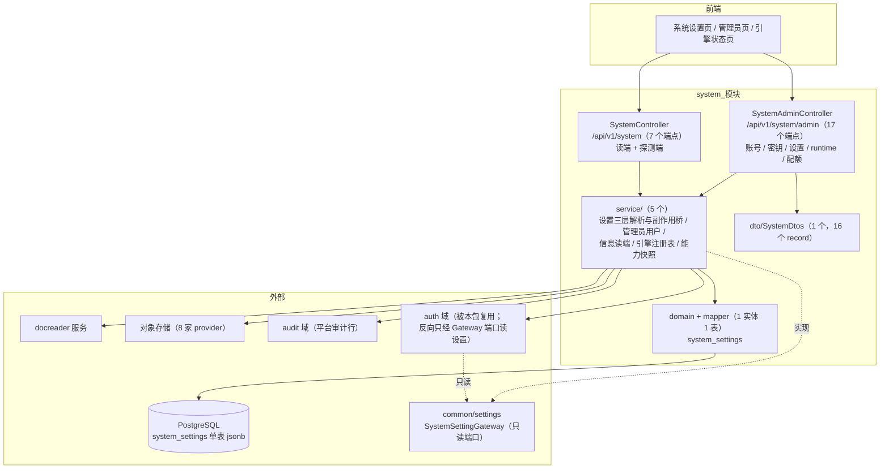
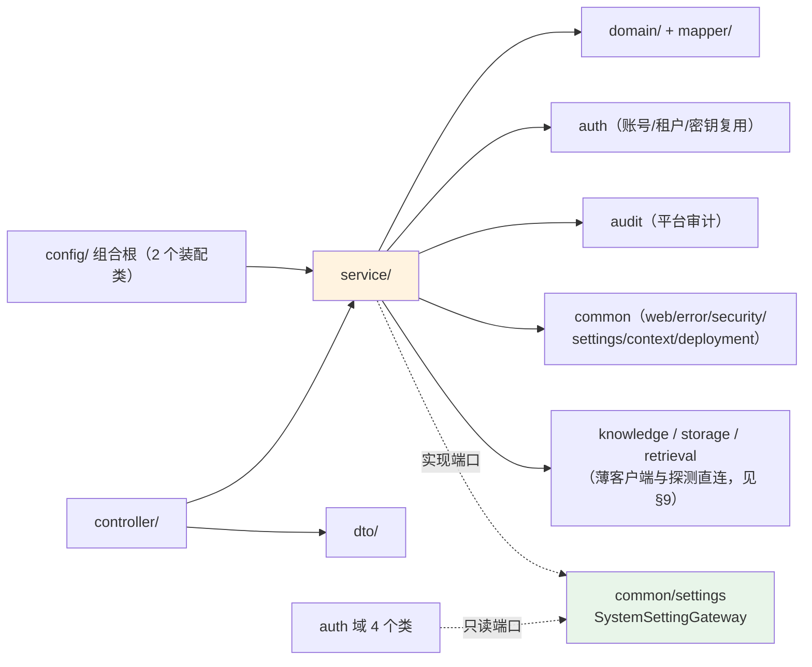
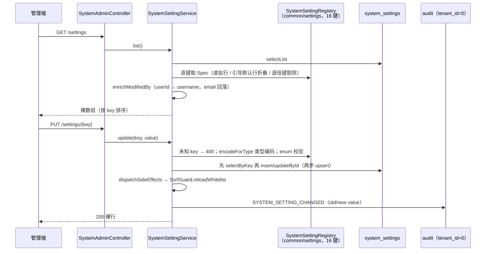
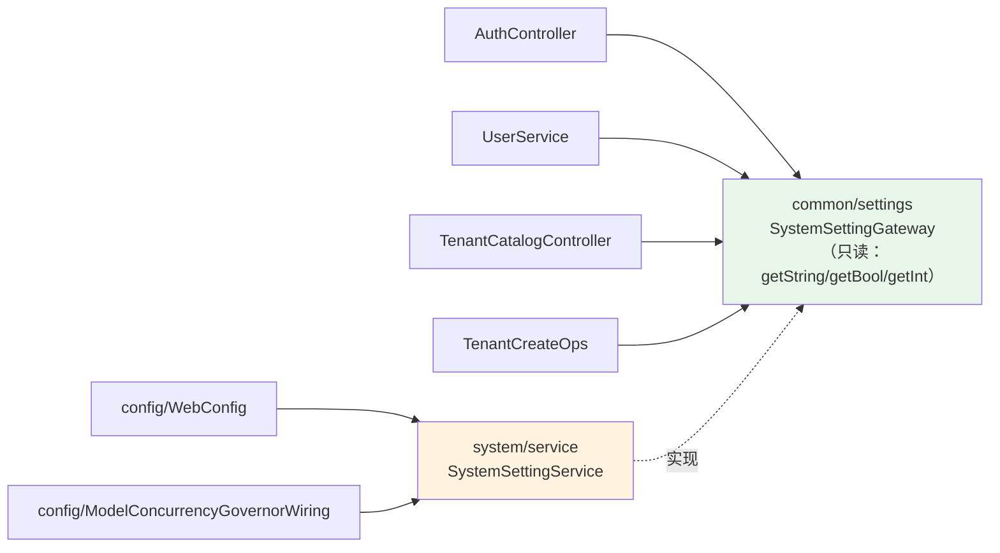
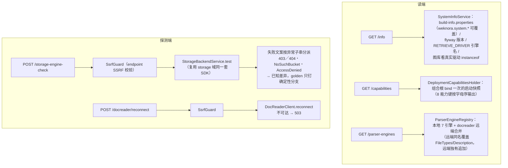

# system 模块手册

> **面向读者**：第一次接手 `com.ragagent.system` 的架构师 / 高级开发者。
> **目标**：30 分钟建立全局观 → 能定位改动点 → 能安全迭代（本模块有 19 条契约用例兜底，改错契约会立刻红）。
> **数据口径**：2026-10-08 实测（`wc -l` 口径）：**11 个 java 文件 / 约 2.9 千行 / 5 个子包**。
> **本文档的地位**：模块级导览；仓库级作业规范见仓库根 `HANDOFF.md`（§12 结构地图、§13 踩坑清单、§14 逐包重构范式）。

---

## 0. 一分钟速览

**它是什么**：平台级**系统管理面**——系统设置的唯一写入口 + 系统管理员与平台密钥的管理动作 + 部署能力 / 引擎状态的读端与连通性探测。

- 系统设置：`system_settings` 单表 + 16 键 in-code 注册表（哪些 key 合法、类型、ENV 回退、默认值的唯一权威），三层解析 DB → ENV → default
- 管理员面：升降系统管理员（promote/revoke）、重置密码、建用户、平台 API Key（tenant_id=0）、租户配额批量应用
- 读端与探测：部署能力快照（capabilities）、系统信息（info）、解析引擎清单（本地 7 引擎 + docreader 远端合并）、存储引擎状态与连通性检测（8 家 provider）
- 运行时队列：**Lite 形态**（available=false + 空队列；mutate/purge 一律 503）

**它不是什么**（别在这里改）：

| 不负责 | 归属 |
|---|---|
| 用户 / 租户 / 邀请 / 登录的业务语义 | `auth`（本包只做管理动作并复用其 mapper/service；**auth 读设置走 `common/settings` 的 `SystemSettingGateway` 端口，不反向依赖本包**） |
| 审计日志的存储与查询面 | `audit`（`GET /api/v1/system/admin/audit-log` 挂在本路径下，但由 audit 域 `AuditLogController` 承接；本包只是往里写 tenant_id=0 的平台行） |
| 对象存储的真实读写 | `storage`（本包只做"配置探测"，真连通检测复用 `StorageBackendService.test`） |
| 文档解析执行 | `knowledge`（`DocReaderClient` 薄客户端）+ docreader 服务 |
| 业务侧配置（KB 配置、租户 jsonb 等） | 各业务域；本包只管 `system_settings` 这 16 个平台级键 |
| 沙箱设置 | 已裁剪域（HANDOFF §6.1 清单；`POST /system/sandbox-check` 未实现 → Spring 404，见 §3） |

### 图 1：模块全景



**三个必须知道的数字**：**24 个端点**（`/system` 7 + `/system/admin` 17，全包只有 2 个 controller）；**16 个注册设置键**（`SystemSettingRegistry` 是唯一权威——其 javadoc 写"17 条"，实测 `spec(` 16 处，已漂移）；**19 条契约用例**（1 个测试类 `SystemContractTest`，fixture 前缀 `sys-*` / `adm-*`）。

---

## 1. 目录结构与职责

### 1.1 子包清单（放什么 / 不放什么）

| 子包 | 文件/行数 | 放什么 | **不放什么** |
|---|---|---|---|
| `controller/` | 2 / 1,219 | `SystemController`（读端+探测端，700 行）、`SystemAdminController`（管理面，519 行）：请求体解析、错误语义化、拼响应 | 探测算法外的业务规则（探测逻辑目前就在 controller 里，见 §7.7） |
| `service/` | 5 / 1,438 | `SystemSettingService`（551，设置 CRUD + 三层解析 + 端口实现 + 副作用桥）、`SystemInfoService`（254，/info 读端计算）、`SystemAdminUserService`（380，账号管理）、`ParserEngineRegistry`（184，引擎清单合并）、`DeploymentCapabilitiesHolder`（69，能力快照） | HTTP、事务性写放大 |
| `domain/` | 1 / 96 | `SystemSetting` 实体（`system_settings` 表，jsonb + H2 保留字处理） | 请求/响应形状（→ `dto/`） |
| `dto/` | 1 / 173 | `SystemDtos`：一类型一 record（16 个响应 record + controller 内嵌请求 record） | 持久化注解 |
| `mapper/` | 1 / 15 | `SystemSettingMapper`（纯 BaseMapper，无手写 SQL；upsert 两步在 service 层） | 业务判断 |
| 根 `package-info` | 1 / 5 | 域职责一句话：**设置项键名是前后端共享契约** | — |

### 1.2 依赖方向



**枢纽是 `SystemSettingService`，一身三职**：① 管理面 CRUD（list/get/update/reset）；② `common/settings.SystemSettingGateway` 只读端口的实现（auth 的注册/建租户/邀请流程经它读设置——`auth ⇄ system` 环已解，依赖方向变为"域 → 端口 ← 实现"，见 `SystemSettingGateway` javadoc）；③ 副作用桥 + 启动预载（`ssrf.whitelist` 变更推给 `SsrfGuard`）。改它之前先想清楚动的是哪一职。

**入向依赖极窄（实测）**：生产代码里 import 本包的只有 `config/WebConfig` 与 `config/ModelConcurrencyGovernorWiring` 两个装配类（能力快照 bind、并发闸门读 `model.max_concurrency`）。

---

## 2. 数据模型

### 2.1 ER（1 张表，无外键）

```mermaid
erDiagram
    system_settings {
        bigint id PK "自增"
        varchar key UK "H2 保留字 → 列名带引号"
        jsonb value "原样内联：int→42、string→foo、bool→true、string_list→a,b"
        varchar value_type "int / string / bool / string_list"
        varchar category "worker、auth、tenant、security；general 仅为防御性兜底"
        varchar description "文案是响应体的一部分（契约）"
        boolean is_secret
        boolean requires_restart
        varchar last_modified_by "操作者 userId；NULL→\"\""
        timestamptz created_at "虚拟行 = 0001-01-01T00:00:00Z"
        timestamptz updated_at "同上"
    }
```

> 平台级单表（迁移 000053；基线 SQL：`migrations/versioned/V1__baseline.sql`），无租户列、无外键。`users.is_system_admin` 列在 auth 域的 users 表上，本包不建表。
>
> **迁移（Flyway）**：B156（2026-10-09）起 `migrations/versioned/` **只有一个文件** `V1__baseline.sql` —— 原 V2~V6 已折叠进去（默认值折进建表、skills 折成终态 DDL；V2/V3 的一次性数据改写不折叠，V3 映射以存档块留在文末供 `AgentConfigKeyUsageTest` 解析）。⚠️ **已迁移过的开发库需重建**：Flyway 会因 V1 校验和变化 + V2~V6 文件消失而拒绝启动；测试侧不受影响（`spring.flyway.enabled: false` + H2）。

### 2.2 设置的四种存储形态（读路径合并规则）

| 形态 | 判定 | 读取行为 |
|---|---|---|
| 持久行 | DB 有、非引导默认 | 原样返回（`enumOptions` 由 registry 补） |
| 虚拟行 | registry 有、DB 无 | id=0、值 = ENV → cfg → default 三层回退、时间戳为实体默认零值（0001-01-01） |
| 引导默认行 | `last_modified_by` 为空且值 == registry 默认 | **读取时折叠回** ENV/default（`isBootstrapDefaultRow`） |
| 未知行 / 退役键 | DB 有但 registry 无 / `asynq.concurrency`（`RETIRED_KEY`） | 未知行按 key 排序缀尾；退役键在 `list()` 显式剔除 |

**硬约定（源码注释明示）**：jsonb 列 `value` 必须 `@TableField(typeHandler = PgJsonTypeHandler.class)` **且** `@TableName(autoResultMap = true)`；`key`/`value` 是 H2 保留字，列名带引号（实体 `@TableField` 与 `TestSchema` 建表同步带引号，漏一边就是 SQL 报错）。

### 2.3 "状态枚举"（无 Java 枚举，全是字符串分派）

| 取值集 | 值 | 用在哪 |
|---|---|---|
| `valueType` | `int` / `string` / `bool` / `string_list` | registry `encodeForType` 的分派键；写入按它做类型编码 |
| runtime task state | `pending` / `active` / `scheduled` / `retry` / `archived` / `completed` | `GET /runtime/queues/*/tasks` 的 400 校验集 |
| 存储 provider | `local` / `minio` / `cos` / `tos` / `s3` / `oss` / `ks3` / `obs` | storage-engine-status 的 8 项固定清单（allowed 由 `StorageAllowList` 决定） |
| 解析引擎名 | `builtin` / `simple` / `anydoc` / `mineru` / `mineru_cloud` / `paddleocr_vl` / `paddleocr_vl_cloud` | `ParserEngineRegistry` 常量（本地注册序 = 展示序） |

---

## 3. HTTP 接口面

### 3.1 端点分组（2 个 controller / 24 个端点）

**读端与探测**（`SystemController`，前缀 `/api/v1/system`，7 个）

| 方法 | 路径 | 用途 | 权限 |
|---|---|---|---|
| GET | `/capabilities` | 部署能力快照（启动期 bind 一次、运行期不重算，8 个能力键字母序输出；sandbox/docker 因 Java 进程无 docker 后端不可用——controller 与 holder 的 javadoc 口径略有出入，别当契约） | Viewer+ |
| GET | `/info` | 版本 / 引擎名 / db_version / started_at / uptime | Viewer+ |
| GET | `/parser-engines` | 本地 7 引擎 + docreader 远端合并清单 | Viewer+ |
| POST | `/parser-engines/check` | 未保存的表单值试算（请求键名 **snake**，与租户配置 jsonb 同形） | Admin+ |
| POST | `/docreader/reconnect` | 重连 docreader；不可达 → **503**；addr 过 SSRF 校验 | Admin+ |
| GET | `/storage-engine-status` | 8 家 provider 的 allowed/available | Viewer+ |
| POST | `/storage-engine-check` | 连通性检测（拿租户凭据主动探测）；禁用 provider → **403** | Admin+ |

> `POST /system/sandbox-check` **未实现**：Java 侧不映射、RBAC 不登记 → Spring 404（controller 与 `WebConfig` 双处注释注明，落地 handler 时随批恢复）。

**管理面**（`SystemAdminController`，前缀 `/api/v1/system/admin`，17 个，**整组仅系统管理员**）

| 组 | 端点 |
|---|---|
| 管理员升降（3） | `POST /promote`（userId/email 二选一，幂等 200）、`POST /revoke`（自撤/最后一名 → 400；非管理员 → 幂等 200）、`GET /list`（offset/limit，非法值回落默认不 400，上限 200） |
| 用户管理（2） | `POST /users/reset-password`（不能改自己；换 hash + 吊销全部会话 → 204）、`POST /users/create`（密码缺省服务端生成；完全重复 → 幂等 200，部分冲突 → 409，成功 → 201） |
| 平台 API Key（3） | `GET /api-keys`（脱敏：≤12 位 `***`，否则首7+...+尾4）、`POST /api-keys`（`expiresAtUnix` epoch 秒、必须未来；201 带一次性明文 token）、`DELETE /api-keys/{keyId}` → 204 |
| 系统设置（4） | `GET /settings`（持久行 + 虚拟行合并，按 key 排序）、`GET|PUT /settings/{key}`（未知 key → 400 `unknown setting key "x"`）、`DELETE /settings/{key}`（幂等 → 204） |
| 运行时队列 Lite（4） | `GET /runtime/queues`（available=false + pools 并发折叠）、`GET /runtime/queues/{queue}/tasks`（queue/state 白名单校验）、`POST .../tasks/{taskId}/actions/{action}` 与 `DELETE .../archived` → **恒 503** "Task queue is unavailable" |
| 配额（1） | `POST /tenants/apply-default-storage-quota`（具名 Mapper 全表写，`FullTableWriteGuard` 登记例外；返回 affected 租户数） |

### 3.2 契约约定（改接口前必读）

| 约定 | 说明 |
|---|---|
| 响应键名 | JSON 名 = Java 字段名（camelCase）；`@JsonProperty` 已 **99 → 0**（§14.9f/g） |
| 请求键名 | 管理面已 DTO 化（`@Valid` + 显式 message 如 `userId: 不能为空`）；**两个 check 端点 + docreader/reconnect 仍收 rawBody、键名 snake**——与租户配置 jsonb 同形，登记冻结面，待解冻再 DTO 化（controller javadoc + §14.9f） |
| 信封 | **无** `{data,success}` 信封：裸资源对象 / 裸数组 |
| 删除与动作 | reset 设置、reset-password、删 key → **204**（无 body） |
| 可空字段 | **显式输出 null**；虚拟行 id 输出 0（零值不是 null）；时间戳零值为 `0001-01-01T00:00:00Z` |
| 错误 | AppError 信封；**settings 的校验文案原文即响应体**（`invalid value for "x" (expected int): ...`）；runtime mutate/purge → 503 |
| 审计 details | `target_email` / `quota_gb` / `old_value` 等**有意保留 snake**（跨域事件载荷，独立批次，勿当漏网——§14.9g"有意保留"清单） |

---

## 4. 核心链路

### 4.1 系统设置读写链路



- **三层解析**（业务侧 `getInt/getString/getBool/getStringList`）：DB 行 → ENV → default；DB 读失败降级 ENV/default（记 WARN，不 500）；**每请求直读 DB，无缓存无 pubsub**（Lite 单实例语义，javadoc 即契约）。
- **副作用桥现状**：代码内只接线 `ssrf.whitelist`（合并 `SSRF_WHITELIST_EXTRA` 后推给 `SsrfGuard`）；`model.max_concurrency` 的消费在 `config/ModelConcurrencyGovernorWiring`（启动期读取装配并发闸门）。
- **启动预载**：`ApplicationReadyEvent` 后把 DB 的 ssrf 白名单推给 guard——否则 guard 静态初始化只读 env，重启后 UI 存的白名单**静默失效**（javadoc 实测案例：重启后 dashscope fake-IP 又被拦）。

### 4.2 Gateway 端口关系（auth ⇄ system 环的解法）



写侧与列表能力**留在 system 域不外露**；auth 侧只见端口。往端口加方法前先问：auth 真需要吗（接口注释明示"只列 auth 实际用到的读方法"）。

### 4.3 读端与探测链路（/system 组）



`/info` 的字段口径都是 best-effort：H2 测试库无 `flyway_schema_history` → `dbVersion` 空串（键省略）；纯 IDE 运行无 build-info → "unknown"；graph 引擎看**真实驱动**是否建连而非配置。

---

## 5. 改哪里（场景 → 文件）

| 我想… | 主要改这里 | 别忘了 |
|---|---|---|
| 加一个设置键 | `common/settings/SystemSettingRegistry.spec(...)`（类型/ENV/默认/分类/描述/requiresRestart/enumOptions） | **键名与描述文案是前后端共享契约**（package-info），前端设置页同批；补 `adm-settings-*` fixture |
| 给设置加写后副作用 | `SystemSettingService.dispatchSideEffects` | 现只接线 ssrf.whitelist；顺手核对 `applyWhitelistOnStartup` 是否也要预载 |
| 加 /system 端点 | `SystemController` + `SystemDtos` 加 record | RBAC 规则在 `config/WebConfig`（静态段先于通配段，AntPathMatcher 取首个命中）；补 `sys-*` fixture |
| 加 /system/admin 端点 | `SystemAdminController` + `SystemAdminUserService` | `addSystemAdminRule` + 审计埋点（tenant_id=0 平台行，`logBestEffort`）；补 `adm-*` fixture |
| 改设置校验/错误文案 | `SystemSettingRegistry.encodeForType` + `SystemSettingService.update` | 错误消息**原文即 400 响应体**，改动就是改契约 |
| 改解析引擎清单 | `ParserEngineRegistry`（常量 + listAllEngines） | 远端合并规则与 anydoc 分支有 golden 内联断言（测试 javadoc 注明禁真实网络） |
| 改存储引擎状态/检测 | `SystemController`（storage-engine-status/check 的 provider 清单与文案）+ `SystemInfoService.allowList` | 8 家 provider 文案逐字钉在 fixture；连通性失败文案是"已知差异"别乱钉 |
| 改 /info 字段 | `SystemInfoService` + `SystemDtos.SystemInfoResponse` | 覆盖项走 `weknora.system.*` 配置；`dbVersion` 在 H2 键省略（掩码比对） |
| 改运行时队列形态 | `SystemAdminController` 的 `KNOWN_QUEUES` + `positive()` 并发折叠 | Lite 形态（available=false、mutate 503）是登记取舍；接真队列时整组换 |
| 改管理员账号语义 | `SystemAdminUserService`（promote/revoke/create/reset） | 错误消息逐分支固定（javadoc 列表）；revoke 无事务（Lite，见 §9） |
| 给 system_settings 加列 | `domain/SystemSetting` + `V1__baseline.sql` + `TestSchema` | **schema 两处同改**（H2 报 `Column not found`）；jsonb 记得双保险（§2.2） |
| 改部署能力清单 | `DeploymentCapabilitiesHolder.bind` + `config/WebConfig` 组合根 | capabilities 是**部署状态**非代码契约，按部署各自断言、不做 golden 字节比对 |

---

## 6. 常见迭代 SOP

> 铁律：**一次只动一个轴**；每步结束**全绿**再走下一步（哪怕只是移动文件）。

```bash
# 每次改动后必跑
cd ~/ragagent && JAVA_HOME=/opt/homebrew/opt/openjdk@21/libexec/openjdk.jdk/Contents/Home \
  ./gradlew :domains:test :domains:spotlessCheck
# 若动了前端可见契约（键名/文案/状态码），同批带前端：
cd frontend && npx vue-tsc --build --force && npm test
```

**A. 加设置键**：registry `spec(...)` → （如需）副作用桥 + 启动预载清单 → 契约 fixture（`adm-settings-*`，重录用 `--tests "*SystemContractTest" -Dcontract.refresh=true`，见 HANDOFF §13.12）→ 前端设置页同批 → 三绿 → 提交。

**B. 加端点**：`dto` 请求 record（`@Valid` 显式 message）→ controller → RBAC 规则 → fixture（`sys-*`/`adm-*`）→ 前端同批 → 三绿。

**C. 改落库 schema**：`domain` 实体 → `V1__baseline.sql` + `TestSchema` 两处同改 → 三绿。

**D. 重构/移动**：本包小，无门面包袱；跨域移动前按 HANDOFF §13.2 依赖判据走，端口化先例是 `SystemSettingGateway` / `StorageAllowList`（→ common）。

---

## 7. 模块约定与坑（必读）

1. **jsonb 双保险 + H2 保留字**：`value` 列必须 typeHandler + `autoResultMap` 成对出现；`key`/`value` 列名带引号（实体 `@TableField` 与 `TestSchema` 两处）。出处：`SystemSetting` 源码注释、`TestSchema` 建表注释。
2. **ssrf.whitelist 的启动预载不能删**：guard 是进程级静态、初始化只读 env；删了预载，重启后 DB 白名单静默失效。出处：`SystemSettingService` javadoc（实测案例）。
3. **settings 的错误文案与 description 是契约**：`unknown setting key "x"`、`invalid value for ...`、registry 的 description 都会原样出现在响应里。出处：`SystemSettingRegistry` javadoc（"Description 文案是响应体的一部分，不是注释"）。
4. **check 类端点的请求侧 snake 是冻结面**：与租户配置 jsonb 同形，别"顺手"DTO 化——要与 knowledge 域租户配置解冻同批。出处：`SystemController` javadoc + HANDOFF §14.9f 边界。（2026-10-09 更新：§15.3「已解除」表下租户配置内容**已开始换锚**——B132 完成 `chat-history-config` / `retrieval-config`，B133 完成 `storage-engine-config`；`parser-engine-config` 判为**外部决定**（docreader `config_overrides`）保持 snake。本条的系统 check 端点自身仍未动，解冻已无前置依赖，可独立成批。）
5. **审计 details 键名**（2026-10-09 更新）：原先整族保留 snake，B135a 已把**守卫登记的那 8 键**换锚 camel（`rawPath`/`requiredRole`/`scopeType`/`quotaBytes`/`quotaGb`/`valueType`/`oldValue`/`newValue`——details 面其余键（`tenantId`/`newRole`/`sourceType`/`agentTotal`/`slug`…）本就是 camel）；**余 `task_id`（datasource 活动详情）与 `target_email`** 仍 snake，属跨域事件载荷，按原口径"要改就独立一批（RBAC/settings/队列产生方一起）"。出处：HANDOFF §14.9g + B135a 批记录。
6. **capabilities 的键序与部署漂移**：JSON 输出必须按键字母序（holder 用 LinkedHashMap 保序所以按字母序插入）；capabilities 表达**部署状态**而非代码契约，跨部署不做字节比对。出处：`DeploymentCapabilitiesHolder` 注释 + `SystemContractTest` javadoc。
7. **探测逻辑长在 controller 里**：`SystemController` 700 行，storage check 的 7 个 provider 分支、文案分派、`overridesFromRaw` 的 20+ 个 snake 键全在 controller。改 provider 语义只动这一处，但别把它当 service 层逻辑复用。
8. **换锚/改键名前统计要两种写法都 grep**（`@JsonProperty` 与全限定 `@com.fasterxml...`）：auth 域曾因短名 grep 漏算 98 处。出处：HANDOFF §14.9h"口径修正"。
9. **文档计数有两处已漂移，以实测为准**：`SystemSettingRegistry` javadoc 写"17 条"、实测 16 个键；`SystemContractTest` javadoc 写"/system/admin 组 16 条"、实测 17 个端点。出处：2026-10-08 实测（`grep -c "spec("` / `@Mapping` 注解计数）。

---

## 8. 测试与验证

- **规模**：本包 **1 个契约测试类** `SystemContractTest`（804 行 / **19 个 `@Test`**），MockMvc 全栈（真实 RBAC + 真实 seed）。种子：租户 10002 + 系统管理员 javasysadmin + 基线 owner/viewer。
- **fixture**：`domains/src/test/resources/contracts/` 下 `sys-*`（18 个）与 `adm-*`（55 个）；测试实际引用 59 个名字。注意 `adm-key-*`（11 个）锚的是 **auth 域 API-Key 响应元素**（该域未换锚时的跨域契约）；`adm-settings-*` 锚的是本包设置面。
- **掩码**：UUID/时间戳掩码正则的键名字符集是 `[a-zA-Z_]+`（§14.9f 换锚时从 `[a-z_]+` 放宽——键改名必须同步放宽正则，HANDOFF §13.13）；另掩 key 数字 id、token 明文、affected、started_at/uptime/db_version/timestamp。
- **不做字节比对的三处**（部署态差异，测试 javadoc 注明）：capabilities（键集比对 + 本部署断言）、parser-engines 及 check（禁真实网络 → 静态分支内联断言）、info 的 db_version（H2 无 flyway 表 → 键省略）。
- **已知偶发 2 例**（都不在本包，但跑全量闸门时会遇到；先单独重跑再判回归）：
  - `WebToolsRecordingTest.searchWithContentFetchesLeadingPagesViaSharedFetchTool`（全量并发下偶发）
  - `EvaluationContractTest.getTerminalRunsExecution`（全量并发下偶发；单独 `--tests "*EvaluationContractTest"` 通过）
- **改前端可见契约时**：后端与前端**同批**改完再提交（设置键名/管理面字段都被 `SystemSettings.vue` 等页面消费）。

---

## 9. 已知待办与风险（接手后优先看）

| 项 | 性质 | 现状与建议（2026-10-08 核实） |
|---|---|---|
| `SystemInfoService` / `SystemController` 直连 storage 域 | 登记观察项，**属实仍直连** | 实测：`SystemInfoService` import `storage/domain/StorageBackend` + `storage/mapper/StorageBackendRepository`；`SystemController` 直连 `storage/service/StorageBackendService`，且在 `connectivityFallback` 手搓 `StorageBackend` 实体调 `test()`。management 面低频、无写放大，不阻塞；若解环，参照 `StorageAllowList → common/storage` 端口先例。同类的 `retrieval`（图库引擎名 instanceof）与 `knowledge`（`DocReaderClient`）引用属薄客户端/只读探测，风险更低 |
| sandbox 残留 | 代码残留 | `applyWhitelistOnStartup` 仍迭代 `sandbox.docker_enabled`（registry 已无此键、`dispatchSideEffects` 对它无动作，纯空转）；HANDOFF §6.1 沙箱裁剪清单点名 `system_settings` 的该键。落沙箱裁剪批时一并清 |
| ssrf.whitelist 条目结构校验未完整落地 | 代码自述 | `validateRegistryEntry` 注释明示：`reloadWhitelist` 目前接受任意条目，仅 `string_list` 归一（trim+去空）做了部分对齐；非法 CIDR 不会被拒 |
| javadoc 计数漂移 2 处 | 文档债 | 见 §7.9；改到对应文件时顺手修正，别当成实现 bug |
| revoke 无 `SELECT ... FOR UPDATE` | 已登记取舍 | `SystemAdminUserService` javadoc：单实例语义顺序读-判-写。**多副本部署前**需补事务或分布式锁 |
| 运行时队列 Lite 形态 | 功能缺口（有意） | `available=false` + mutate/purge 恒 503；接真队列时整组换（`KNOWN_QUEUES` 与并发折叠逻辑要对着上游队列定义重写） |

---

## 10. 速查：本模块的"地标"

| 想知道 | 看这里 |
|---|---|
| 某个设置键合不合法、默认值是什么 | `common/settings/SystemSettingRegistry`（16 键唯一权威） |
| 设置怎么读（业务侧） | `SystemSettingService.getInt/getString/getBool/getStringList`（三层解析，§4.1） |
| auth 为什么不直接注入本包 | `common/settings/SystemSettingGateway` javadoc + 本文 §4.2 |
| 设置改了为什么不生效 | ①requiresRestart=true 的键要重启；②副作用桥只接线 ssrf.whitelist；③`model.max_concurrency` 在启动期装配（§4.1） |
| 白名单重启后失效的事 | `SystemSettingService.applyWhitelistOnStartup`（§7.2，不能删） |
| /info 的版本号从哪来 | `SystemInfoService`：build-info.properties → `weknora.system.*` 覆盖 → "unknown" |
| 解析引擎清单怎么合并 | `ParserEngineRegistry.listAllEngines`（远端覆盖/追加规则） |
| 存储连通性检测文案为什么难钉 | `SystemController.connectivityFallback` 的异常子串分派（"已知差异"，golden 只钉确定性分支） |
| 谁在守卫这些端点 | `config/WebConfig` RBAC 段：/system 读端 Viewer+、探测端 Admin+、/admin 全组 addSystemAdminRule（§3.1） |
| 契约怎么验证 | `SystemContractTest`（19 用例）+ `sys-*`/`adm-*` fixture（§8） |
| 目录为什么这样分 | 本文 §1 + 根 `package-info.java`（本包唯一一份 package-info） |
