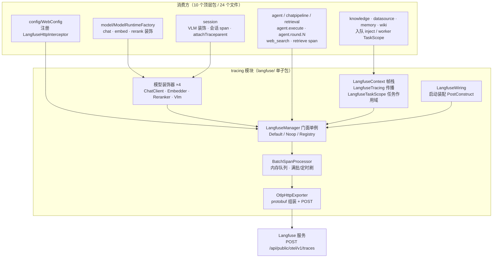
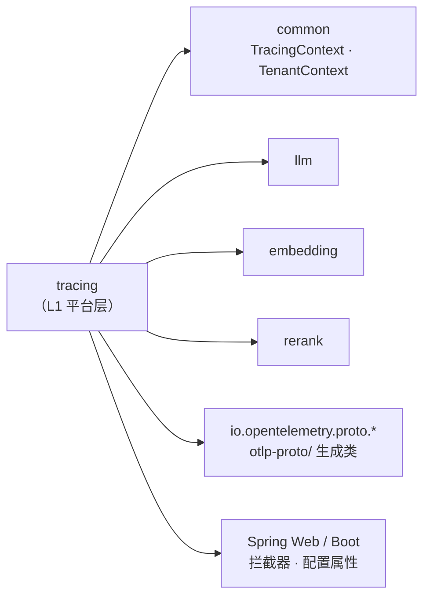
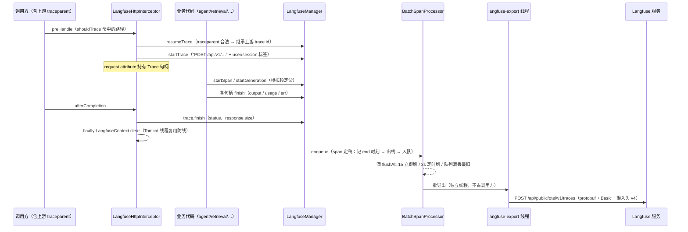
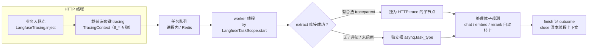

# tracing 模块手册

> **面向读者**：第一次接手 `com.ragagent.tracing` 的架构师 / 高级开发者。
> **目标**：30 分钟建立全局观 → 能定位改动点 → 能安全迭代（本模块有 38 个后端用例兜底，wire 契约钉在代码断言里，改错导出形状会立刻红）。
> **数据口径**：2026-10-08 实测（`wc -l` 口径）：**25 个 java 文件 / 2,864 行 / 1 个子包（langfuse/，24 类 + 根 package-info）**。
> **本文档的地位**：模块级导览；仓库级作业规范见仓库根 `HANDOFF.md`（§12 结构地图、§13 踩坑清单、§14 逐包重构范式）。

---

## 0. 一分钟速览

**它是什么**：Langfuse 链路追踪基础设施（`backend-package-map.md` 分层里的 **L1 平台层**，库式域、**无 HTTP controller**）。做三件事：

- **观测模型**：`Trace`（一次请求级根）/ `Span`（一段逻辑工作）/ `Generation`（一次模型调用）三种句柄，父-child 关系由线程内帧栈（`LangfuseContext`）表达
- **跨线程缝树**：HTTP 请求 → 队列 → worker，用 W3C traceparent 经 `TracingContext` 载体续接，让异步处理和发起请求落在 Langfuse 的同一棵树上
- **OTLP 导出**：手写最小 OTel 语义 + protobuf wire 格式（vendored 于仓库根 `otlp-proto/`），直写 Langfuse 的 `{host}/api/public/otel/v1/traces`，伪装成 langfuse-python v4 SDK

**它不是什么**（别在这里改）：

| 不负责 | 归属 |
|---|---|
| 处理进度 span 树（`knowledge_spans` 表、`GET /knowledge/{id}/stages`） | `knowledge` 域。**两套 span 完全不同**：那套落业务库给前端看进度，本套导 Langfuse 给人看链路。唯一缝合点：`KnowledgeProcessWorker` 用 `LangfuseTracing.currentTraceId()` 写入其 `langfuse_trace_id` 列 |
| 跨线程观测载体 `TracingContext`（`lf_*` 五键） | `common/context`（类型在 common；形状语义属本域，见 §2.4） |
| 记忆抽取的观测门面 `MemoryTrace` | `memory/service`（消费方：包了一层 `LangfuseManager`，不属本包） |
| 日志 / 指标 / 告警 | 不做。导出失败只记 debug/warn 日志，span 丢失不重试（§7.6） |
| 业务逻辑、HTTP 端点 | 各业务域。本模块只在调用点周边包观测 |

### 图 1：模块全景



**三个必须知道的数字**：最大类仅 320 行（`DefaultLangfuseManager`，真实现 + 三个内部句柄类，**无神类**）；全部 24 个类挤在 `langfuse/` 一个包里（`backend-package-map.md` 的二级子包阈值 50 文件远未触发）；24 个消费文件横跨 10 个顶层包，未配 `LANGFUSE_PUBLIC_KEY/SECRET_KEY` 时全链路 no-op、零成本。

---

## 1. 目录结构与职责

### 1.1 类型族清单（单子包，按职责分族）

本包只有 `tracing/package-info.java`（5 行，职责宣言："观测面失败不得影响主链路"）+ `tracing/langfuse/` 一个子包。按职责分 7 族：

| 族 | 文件/行数 | 放什么 | **不放什么** |
|---|---|---|---|
| 门面与单例 | 4 / 547：`LangfuseManager`(81) · `DefaultLangfuseManager`(320) · `NoopLangfuseManager`(86) · `LangfuseRegistry`(60) | 观测门面接口（静态 `get()/init()/shutdown()`）、真实现（含三个内部句柄类）、no-op 单例、单例持有 | 业务判断、HTTP |
| 句柄与载体 | 5 / 160：`Trace`(15) · `Span`(17) · `Generation`(17) · `RecordedSpan`(58) · `TokenUsage`(53) | 三种观测句柄接口、span 内存载体、Langfuse 规范化用量 schema | 请求/响应 DTO |
| 上下文与传播 | 3 / 324：`LangfuseContext`(76) · `LangfuseTracing`(127) · `LangfuseTaskScope`(121) | ThreadLocal 帧栈 + Snapshot、inject/extract 门面、异步任务作用域（AutoCloseable） | 队列实现、载荷类型 |
| 导出管线 | 4 / 731：`BatchSpanProcessor`(164) · `OtlpHttpExporter`(181) · `LangfuseAttributes`(182) · `LangfusePayloads`(204) | 批量队列、OTLP/HTTP 导出、属性键常量与 hex/JSON 工具、载荷截断与用量估算 | 重试逻辑（设计上不重试） |
| 配置与装配 | 3 / 299：`LangfuseConfig`(226) · `LangfuseEnvProperties`(30) · `LangfuseWiring`(43) | 环境变量解析 + 校验 + 时长解析器、`@ConfigurationProperties` 绑定、启动/停机装配 | 热更新（配置只读一次） |
| 模型装饰器 | 4 / 546：`LangfuseChatClient`(272) · `LangfuseEmbedder`(114) · `LangfuseReranker`(88) · `LangfuseVlm`(72) | chat/embed/rerank 实例装饰器 + VLM 函数装饰器，各发 generation | 装饰器接线（在 `model/`、`session/` 消费方） |
| HTTP 中间件 | 1 / 252：`LangfuseHttpInterceptor`(252) | 请求级 trace：traceparent 续接、`shouldTrace` 路径白名单、自动收尾 | 鉴权（在 Auth 门禁下游，`WebConfig` order=10） |

### 1.2 依赖方向



- **向下**：`common`（租户/追踪上下文）、protobuf 生成类、Spring。与 `common` 一样接受所有层调用，**自己不依赖任何业务域**。
- **向上的一处例外（备案）**：装饰器为实现 `llm`/`embedding`/`rerank` 的接口而依赖 L2 能力层——装饰器模式的必然，不算倒挂；代价是改这三个接口签名会波及本包 4 个装饰器（§9）。
- **OTel/OTLP 关系（新人最常问）**：**不依赖 OpenTelemetry SDK**。仓库根 `otlp-proto/` 是 vendored 自 open-telemetry/opentelemetry-proto 的 4 个 proto（trace/common/resource/collector.trace），由 `server/build.gradle.kts` 的 `com.google.protobuf` 插件（protoc 3.25.5）生成 `io.opentelemetry.proto.*` 类——本包只借它的 **wire 格式**，语义（句柄、帧栈、批量处理器）全是手写最小实现。

---

## 2. 数据模型

**不适用实体/表**：本模块无任何实体类、无任何数据库表——trace 数据是**内存中转、批量外导**的（不落业务库）。业务库里唯一的追踪痕迹是 `knowledge` 域 `knowledge_processing_spans.langfuse_trace_id`（该表归 knowledge，本模块只经 `LangfuseTracing.currentTraceId()` 供值）。

### 2.1 内存载体：`RecordedSpan`（包私有）

| 字段 | 说明 |
|---|---|
| `traceIdHex` / `spanIdHex` / `parentSpanIdHex` | 32/16/16 位十六进制 W3C id；根 span 的父为 null |
| `name` / `startNanos` / `endNanos` | 观测名 + OTLP unix 纳秒时刻（**壁钟**，`System.nanoTime` 是单调钟不能上 wire） |
| `attributes` | 键 → **JSON 字符串值**（`LinkedHashMap`，写入顺序稳定） |
| `statusMessage` / `exceptionType` / `exceptionMessage` | 非 null → 导出为 `Status{ERROR}` / `exception` 事件 |

### 2.2 导出形状：OTLP `ExportTraceServiceRequest`

- `resource`：`service.name=weknora` + `langfuse.public.key`（+ 可选 environment/release）
- `scope`：`langfuse-sdk`@`4.0.0` + 属性 `public_key`（伪装 langfuse-python v4）
- 每个 span：`SPAN_KIND_INTERNAL`、属性**全为 string**（结构化值先 JSON 序列化）、错误 → `exception` 事件 + `Status{ERROR}`
- HTTP 头：`Content-Type: application/x-protobuf` + Basic 认证 + **`x-langfuse-ingestion-version: 4`**（缺失时服务端 400，见 §7.5）+ `x-langfuse-sdk-name: python`

### 2.3 `TokenUsage`（Langfuse 规范化用量 schema）

`input/output/total/cache_read_input_tokens/cache_creation_input_tokens/cache_miss_input_tokens`（逐字段 `@JsonInclude(NON_DEFAULT)` 零值省略）+ `unit`（恒 `TOKENS`）。**注意**：这里的 `@JsonInclude` 是全仓"别写 @JsonInclude"约定（HANDOFF B3）的**冻结面豁免**——它对齐的是 Langfuse 服务端 schema，不是前端契约，别"顺手清理"。

### 2.4 跨线程载体：`TracingContext`（类型在 `common/context`，形状语义属本域）

| 键（JSON 名） | 含义 |
|---|---|
| `lf_trace_id` | 根 trace id（兼容旧负载；关联以 traceparent 为准） |
| `lf_parent_obs_id` | 仅向后兼容保留 |
| `lf_traceparent` | W3C `00-<trace_id>-<span_id>-<flags>`，**续接的权威依据** |
| `lf_user_id` / `lf_session_id` | 跨异步边界保留的租户/会话标签（独立根也归对租户） |

五个键**空值整键省略**；随队列载荷以嵌套键 `tracing` 携带（HANDOFF B5，2026-10-02 由平铺 `lf_*` 改嵌套）。**两种空值形状并存（备案）**：datasource/memory/wiki 三域空载体整键省略，knowledge 域（`ExtractChunkPayload`/`QuestionBatchPayload`）按模块约定恒输出 `"tracing":{}`。

---

## 3. 被依赖面：谁在用我

### 3.1 消费方清单（2026-10-08 grep `com.ragagent.tracing` 实测：24 文件 / 10 顶层包 + 启动类）

| 消费方 | 用什么 | 干什么 |
|---|---|---|
| `config/WebConfig` | `new LangfuseHttpInterceptor()` | 注册请求级 trace（order=10，Auth 之后 → 被拒请求无 trace） |
| `RagAgentApplication` | 扫描注册 `com.ragagent.tracing.langfuse` | 让 `LangfuseWiring` 与 `@ConfigurationProperties` 生效 |
| `model/ModelRuntimeFactory` | `LangfuseChatClient/Embedder/Reranker.wrap`（全限定） | 模型客户端装饰（管理器启用才包，否则原样返回） |
| `session/VlmDescriberWiring` | `LangfuseVlm.wrap`（import） | VLM 调用装饰 |
| `agent/AgentEngine` · `ActPhase` · `ReActIteration` | `LangfuseManager` + `Span`（import） | `agent.execute` / 工具 span（database_query 参数只报键）/ `agent.round.N` |
| `chatpipeline/PluginSearchOps` · `PluginRerank` | `LangfuseManager`（+`Span`）（import） | `web_search` / rerank 插件 span |
| `retrieval/HybridSearchService` | `LangfuseManager` + `Span`（全限定） | `retrieve` span |
| `session/SessionKnowledgeQaService` | `LangfuseManager` + `Span`（全限定） | setup / stage span |
| `session/MessageSuggestionService` | `LangfuseTracing.attachTraceparent`（全限定） | 本进程内续接早先请求派生的活 |
| `knowledge/KnowledgeProcessWorker` | `LangfuseTaskScope` + `LangfuseTracing`（import） | 任务作用域 + 入队注入 + `currentTraceId()` 落库 |
| `knowledge/ChunkExtractService` · `QuestionGenerationService` | `LangfuseTaskScope`（import） | 子任务作用域 |
| `datasource/DataSourceService`、`memory/MemoryExtractionService`、`wiki/WikiIngestEnqueueOps` | `LangfuseTracing.inject()`（全限定） | 入队侧注入（wiki 两处） |
| `datasource` / `memory` 各 2 个 TaskQueue、`wiki/WikiIngestTaskRunner` | `LangfuseTaskScope`（全限定，try-with-resources） | worker 侧作用域 |
| `memory/MemoryTrace` | `LangfuseManager.get().startSpan`（全限定） | memory 域自有观测门面 |

### 3.2 使用约定（改调用点前必读）

| 约定 | 说明 |
|---|---|
| 拿管理器 | 恒 `LangfuseManager.get()` 静态单例；未 init 恒 no-op，**句柄非 null，调用方无需判空** |
| 句柄必须 finish | 不 finish 的 span 永不导出；`finish` 期 metadata 与开启期**合并**（不是覆写）；失败路径传 `err`（非空 → ERROR 状态 + exception 事件） |
| 父子关系 | **无上下文参数**：父观测 = 线程帧栈栈顶（`start*` 入栈 / `finish` 出栈）；generation 是叶子，不入帧栈 |
| 无活跃 trace 时 `startSpan` | 自动开浅根（autoTrace），句柄 finish 时**连根一起收** |
| 跨线程 | 只走公共门面：入队侧 `LangfuseTracing.inject()` → 载荷随队列走 → worker 侧 `LangfuseTaskScope.start`（内部 extract）；本进程内续接用 `attachTraceparent`。帧栈与 `Snapshot` 是 `LangfuseContext` 的**包内实现细节**，外部不可达（实测包外零调用） |
| 导出开关 | 有 `LANGFUSE_PUBLIC_KEY`+`SECRET_KEY` 且未显式禁用 → 自动启用；`LANGFUSE_ENABLED` 显式覆盖；`LANGFUSE_SAMPLE_RATE=0` 视作整体关闭；**enabled 但缺 host/keys → 启动失败拒启**（`LangfuseWiring.init` 抛异常） |
| 铁律 | **观测面失败不得影响主链路**（package-info）：导出在独立 `langfuse-export` 线程，Langfuse 慢/不可达最多丢观测、不拖业务 |

---

## 4. 核心链路

### 4.1 一次 HTTP 请求的 trace 生命周期与导出



- **只跟踪会引发 LLM 工作的端点**（`shouldTrace` 白名单）：在线推理（knowledge-chat / agent-chat / knowledge-search / generate_title / initialization 各 check / evaluation）、摄取类 POST/PUT（知识入库 / reparse / move / FAQ / wiki auto-fix / chunks 编辑 / datasource sync）。只读列表与静态资源不产生 trace。
- **trace 名形态（备案差异）**：用 Spring 路由模式（`/api/v1/kb/{id}`），不是 Go 风格 `:id`；`response.size` 取 Content-Length 头，SSE/分块响应恒 -1。

### 4.2 异步任务缝树（HTTP → 队列 → worker 同一棵树）



- 覆盖四域：knowledge（`document:process` + 两个子任务）、datasource、memory、wiki；未启用时载荷字节不变（空载体整键省略或 `"tracing":{}`，见 §2.4）。
- 失败路径**显式 `finish("error", err)` 后再抛**，避免被 close 记成 success（`LangfuseTaskScope` javadoc）。

### 4.3 模型调用 → generation 装饰

`ModelRuntimeFactory.getChatModel/getEmbeddingModel/getRerankModel`（及 `VlmDescriberWiring`）在管理器启用时用 `Langfuse*.wrap(...)` 包住真客户端：每次调用发一条 generation（`chat.completion[.stream]` / `embedding.embed|batch_embed` / `rerank` / `vlm.predict`），记录消息输入、模型参数、输出、用量与 TTFT（`markCompletionStart`）。**用量估算备案**：embedding/rerank/VLM 的 provider 不返回 usage，按「码点数/4 + 1」估（`LangfusePayloads`），只作成本面板的比例信号。装饰器**不上传大负载**：embedding 只发前 5 条 120 码点预览、VLM 不传图片字节（metadata 只含 image_count/image_bytes_total）、chat 的 MCP 目录截 8000 码点。

---

## 5. 改哪里（场景 → 文件）

| 我想… | 主要改这里 | 别忘了 |
|---|---|---|
| 加一个业务 span 打点 | 调用点 `LangfuseManager.get().startSpan(...)`（参照 `HybridSearchService` 全限定样式或 agent 三类 import 样式） | 句柄必须 finish；输安静路径的 no-op 安全 |
| 给新异步域缝树 | 入队侧 `LangfuseTracing.inject()` + 载荷加 `tracing` 字段（参照 `DataSourceSyncPayload`）+ worker 侧 try-with-resources（参照 `WikiIngestTaskRunner`） | 空载体形状选一：三域省略 / knowledge 恒输出，别混出第三种 |
| 加模型装饰器 | 本包新 `LangfuseXxx` + 接线点（`ModelRuntimeFactory` / `VlmDescriberWiring`） | 用量估算走 `LangfusePayloads`；补 `LangfuseModelDecoratorsTest` |
| 新增 `LANGFUSE_*` 环境变量 | `LangfuseEnvProperties`（String 字段）+ `LangfuseConfig.fromEnv` 解析 | 字段保持 String（非法字面量静默回落，见 §7.8）；补 `LangfuseConfigTest` |
| 改导出端点 / 认证 / 头 | `OtlpHttpExporter`（`endpoint()` / `export()`） | 三个摄入头是服务端兼容关键（§7.5）；跑 `LangfuseEndToEndTest` |
| 改批量导出行为 | `BatchSpanProcessor`（阈值 / 丢弃 / 线程模型） | 导出不得拉回调用方线程（§7.1）；补 `LangfuseTracerTest` |
| 改哪些 HTTP 路径产生 trace | `LangfuseHttpInterceptor.shouldTrace` | 路径是 Spring 路由模式形态；补 `LangfuseHttpInterceptorTest` |
| 改 traceparent 解析 / 续接 | `LangfuseHttpInterceptor.parseTraceparent` + `LangfuseTracing` | W3C 严格解析（大写/全零/非法 → null）；`resumeTrace` 失败调用方回落 `startTrace` |
| 改 Langfuse 属性键 | `LangfuseAttributes` 常量 | 键名对齐 langfuse-python v4（`_client/attributes.py`），别自造键 |
| 改用量/载荷形状 | `LangfusePayloads` / 各装饰器的 `build*` 方法 | `TokenUsage` 的 `@JsonInclude` 是冻结豁免（§2.3） |

---

## 6. 常见迭代 SOP

> 铁律：**一次只动一个轴**；每步结束**全绿**再走下一步。本模块没有契约 fixture，**改 wire 形状必须连断言一起改并复核差异**（"测试适应实现"会让夹具失去契约价值，HANDOFF §13.12 纪律）。

```bash
# 每次改动后必跑（约 3 分钟）
cd ~/ragagent && JAVA_HOME=/opt/homebrew/opt/openjdk@21/libexec/openjdk.jdk/Contents/Home \
  ./gradlew :server:test :server:spotlessCheck
# 只跑本模块（快路径）
cd ~/ragagent && JAVA_HOME=/opt/homebrew/opt/openjdk@21/libexec/openjdk.jdk/Contents/Home \
  ./gradlew :server:test --tests "com.ragagent.tracing.*"
```

**A. 加打点**：调用点 `startSpan`/`startGeneration` → finish（成功/失败两路）→ `:server:test` 三绿 → 提交。

**B. 新异步域缝树**：载荷加 `tracing` 字段（含归一与结构视图）→ 入队点 inject → worker 侧 TaskScope（含失败路径显式 finish）→ 断言负载字节（启用/未启用两种）→ 三绿 → 提交。

**C. 加配置项**：`LangfuseEnvProperties` → `fromEnv` 解析（非法回落默认）→ `LangfuseConfigTest` → 三绿 → 提交。

**D. 改导出协议**：`OtlpHttpExporter` → `OtlpHttpExporterTest`（protobuf 形状）+ `LangfuseEndToEndTest`（本地 stub 收集器全缝）→ 三绿 → 对自建 Langfuse 冒烟一次再提交。

---

## 7. 模块约定与坑（必读）

1. **导出永远异步**：生产链路在独立 `langfuse-export` 线程 POST（默认超时 10s）——若改回调用方线程同步导出，Langfuse 慢时**用户请求被平白拖住最多 10s**（`BatchSpanProcessor` 55~59 行注释明确记录该理由）。仅测试注入出口走同步。
2. **ThreadLocal 纪律**：跨线程必须显式 `Snapshot.capture/replay` + `clear`，禁止隐式继承（`LangfuseContext` javadoc）；拦截器 `afterCompletion` 的 finally clear（Tomcat 线程复用）与 `LangfuseTaskScope.close` 的 clear 是**必须保留的防线**，删了就污染下一个请求/任务。
3. **两套 span 别混**：`knowledge_spans`（落库、前端进度）≠ 本模块的 Langfuse span（导出）。改动只打在本模块的观测不会出现在 `/knowledge/{id}/stages`，反之亦然；缝合点仅 `langfuse_trace_id` 一列。
4. **`lf_*` 五键是冻结面**（HANDOFF §14.6）：要清理应改为嵌套 `tracing` 键，**不是去前缀**（前缀是防撞名的命名空间）。B5（2026-10-02）已嵌套化；三域省略 / knowledge 恒输出两种空值形状并存是登记过的备案，别"统一"成第三种。
5. **三个 Langfuse 摄入头不能删**：`x-langfuse-ingestion-version: 4` 缺失 → 服务端 400 "requires Python SDK >= 4.0.0"；`x-langfuse-sdk-name: python` + scope `langfuse-sdk@4.0.0` 是伪装 v4 SDK 的标识（`OtlpHttpExporter` 类注释）。
6. **span 会丢，别把告警建立在完整性上**：队列满丢最旧（dropped 计数）、导出失败只记日志**不重试**（`BatchSpanProcessor` 类注释"span 丢失不重试"）。
7. **`resumeTrace` 只认 W3C 32-hex**：legacy UUID 等 → 返回 null，**调用方必须回落 `startTrace`**（`LangfuseManager.resumeTrace` javadoc）；`attachTraceparent` 则是静默忽略 + 已有活跃 trace 时不动。
8. **配置的两套失败语义**：`LangfuseEnvProperties` 字段全 String——非法字面量**静默回落默认值**是既定语义（绑成类型会把写错的 .env 变成启动失败，见其 javadoc）；但 enabled 且缺 host/keys → `LangfuseWiring` **拒启**。另注意 `SAMPLE_RATE=0` 曾被悄悄改写成 1.0 导致旋钮失效，现在 0 = 整体关闭（`LangfuseConfig` 99~104 行注释）。
9. **采样位恒 01（备案）**：traceparent 的采样 flag 不反映真实采样决策，(0,1) 区间概率采样未实现、恒采样（`LangfuseTracing` 类注释备案）。看板别拿 flag 当采样依据。
10. **同名陷阱三连**：`common/context.TracingContext`（载体，属 common）、`memory/service.MemoryTrace`（memory 域观测门面）、`knowledge` 域的处理 span——名字都像本模块的，都不是。
11. **别把本模块当"待删遗留"**：`asynq.` span 名前缀、Go 风格时长串（`1m30s`）解析是 Go 原版语义的延续（`LangfuseConfig` 与 `datasource.connector.yuque.GoDuration` 同形、各自维护是**有意为之**，收敛待办见 §9）。

---

## 8. 测试与验证

- **规模**：**8 个测试类 / 38 个 @Test**（`server/src/test/java/com/ragagent/tracing/langfuse/`，1,398 行）。**无契约 fixture**——wire 契约全部钉在代码断言里。
- **测试清单**：

| 测试类 | 用例 | 钉什么 |
|---|---|---|
| `LangfuseTracerTest` | 7 | 句柄语义（trace/span/generation finish、metadata 合并、autoTrace 连根收） |
| `LangfuseTracingTest` | 8 | inject/extract/attachTraceparent、user/session 标签、traceparent 拼接 |
| `LangfuseModelDecoratorsTest` | 6 | 四个装饰器的 generation 载荷与用量 |
| `LangfuseHttpInterceptorTest` | 5 | shouldTrace 白名单、traceparent 严格解析 |
| `LangfuseConfigTest` | 4 | 环境变量解析、时长串、自动启停 |
| `OtlpHttpExporterTest` | 4 | protobuf 组装（resource/scope/id/属性） |
| `LangfuseSeamTest` | 3 | 单例形状、no-op 非空、finish 三参形状钉死 |
| `LangfuseEndToEndTest` | 1 | 端到端：真 HTTP POST → 本地 stub OTLP 收集器解码 protobuf，断言跨线程父子真在同一棵树 |

- **已知偶发 2 例**（**全仓级**，非本模块特有；遇到先单独重跑，别误判回归）：
  - `WebToolsRecordingTest.searchWithContentFetchesLeadingPagesViaSharedFetchTool`（全量并发下偶发）
  - `EvaluationContractTest.getTerminalRunsExecution`（全量并发下偶发；单独 `--tests "*EvaluationContractTest"` 通过）
- 本模块测试自带 stub 收集器与同步导出注入，**不依赖网络与真实 Langfuse**，全量跑确定性强。

---

## 9. 已知待办与风险（接手后优先看）

| 项 | 性质 | 建议 |
|---|---|---|
| (0,1) 概率采样未实现（恒采样，flag 恒 01） | 功能缺口（已备案） | `LangfuseConfig` 99~104 行有登记；实现时须同步 traceparent flag 语义 + `LangfuseTracing` 备案改写 |
| `LangfuseChatClient` 的 `call_purpose` / `prompt_prefix_fingerprint` 恒空串 | 已备案差异 | 类注释写明"真实取值不产出"；如需补齐要连消费方元数据载体一起设计 |
| Go 风格时长解析器多份并存（本包 `parseGoDurationMs` / yuque `GoDuration` / HANDOFF B44 备注 Langfuse/TenantInvitation/env 面另有 2-3 份） | 重复代码 | 待下批收敛（HANDOFF B44 已登记）；动前先盘点全部副本 |
| `tracing`（L1）依赖 `llm`/`embedding`/`rerank`（L2）接口类型 | 结构备案 | 装饰器模式的必然；改这三个接口签名 = 同批改 4 个装饰器 + `ModelRuntimeFactory` 接线 |
| `memory/MemoryTrace` 的 span 无 try-finally 包裹（其 javadoc 自述"调用方必须 finish"） | 消费方风险 | 漏 finish 即漏导；排查 memory 链路观测缺失先看这里 |
| `response.size` 对 SSE 恒 -1、trace 名为 Spring 路由模式 | 已备案差异 | 看板/前端别当 bug 报；要修需在拦截器层改实现形态 |

---

## 10. 速查：本模块的"地标"

| 想知道 | 看这里 |
|---|---|
| 观测从哪进 | `LangfuseManager.get()`（静态门面）→ `DefaultLangfuseManager`（真实现 + 三句柄内部类） |
| 父子关系怎么定 | `LangfuseContext`（ThreadLocal 帧栈，§3.2 约定） |
| 跨线程怎么缝树 | `LangfuseTracing.inject/extract` + `LangfuseTaskScope`（§4.2）+ `common/context/TracingContext` 载体 |
| 哪些请求会产生 trace | `LangfuseHttpInterceptor.shouldTrace`（白名单）+ `WebConfig` 注册点（order=10） |
| 导出怎么发 | `BatchSpanProcessor`（攒批）→ `OtlpHttpExporter`（protobuf + POST） |
| 属性键 / id / JSON 工具 | `LangfuseAttributes`（langfuse-python v4 对齐） |
| 配置从哪来 | `LANGFUSE_*` → `LangfuseEnvProperties`（String 绑定）→ `LangfuseConfig.fromEnv`（解析+校验）→ `LangfuseWiring`（启动装配） |
| 模型调用怎么被记录 | `ModelRuntimeFactory` / `VlmDescriberWiring` 的 wrap → 四个装饰器（§4.3） |
| wire 契约钉在哪 | 没有夹具——`OtlpHttpExporterTest` + `LangfuseEndToEndTest`（stub 收集器）代码内断言（§8） |
| 目录为什么这样分 | 单子包是刻意的（24 类未触发二级子包阈值）；职责见 §1.1 七族 + 各类 javadoc（备案差异都写在注释里） |
