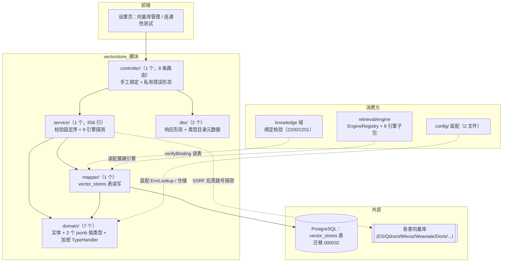
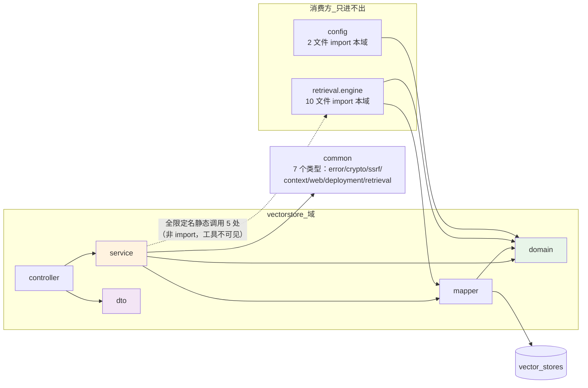
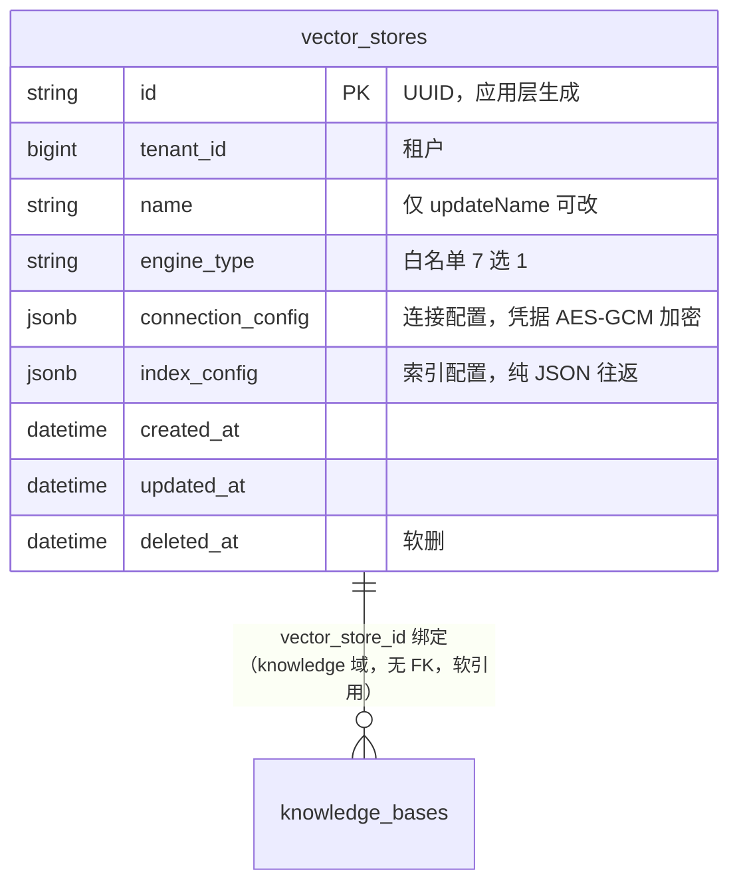
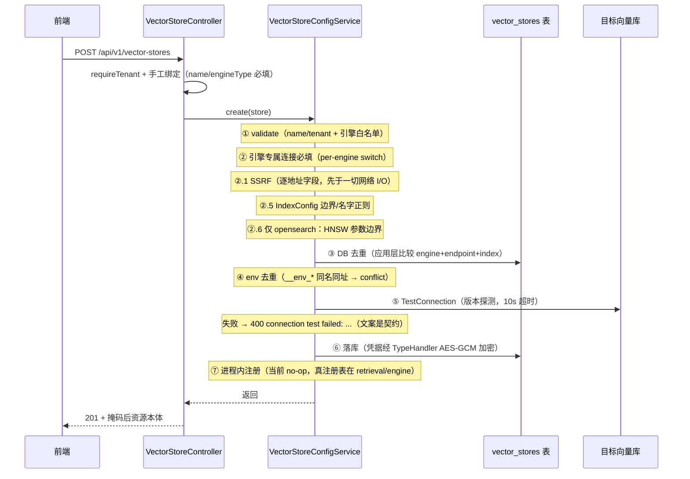
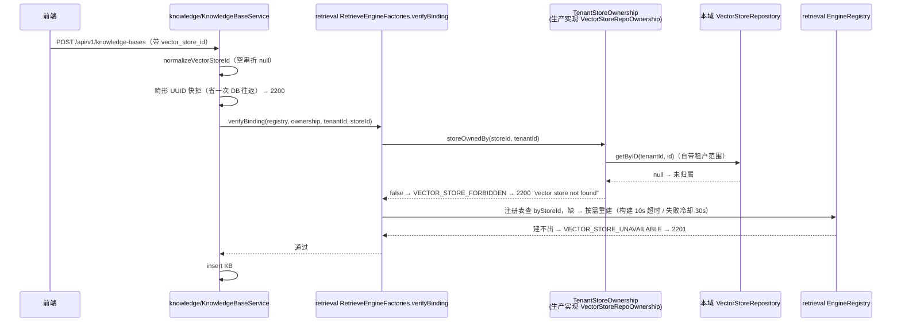
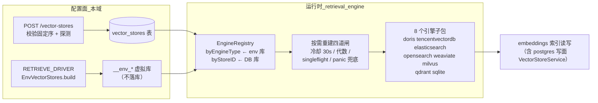

# vectorstore 模块手册

> **面向读者**：第一次接手 `com.ragagent.vectorstore` 的架构师 / 高级开发者。
> **目标**：30 分钟建立全局观 → 能定位改动点 → 能安全迭代（本模块有 28 个 golden 契约对比兜底，改错会立刻红）。
> **数据口径**：2026-10-08 实测（`wc -l` 口径）：**13 个 java 文件 / 约 1.8 千行 / 5 个子包**。
> **本文档的地位**：模块级导览；仓库级作业规范见仓库根 `HANDOFF.md`（§12 结构地图、§13 踩坑清单、§14 逐包重构范式）。

---

## 0. 一分钟速览

**它是什么**：向量库的**配置域**——回答"**有哪些向量库、怎么连上**"：类型目录（前端表单元数据）、
CRUD、连通性探测、凭据加密落库、env 虚拟库派生。**不含检索运行时**——检索时怎么用这些向量库归 `retrieval/engine`。

### ⚠️ 边界辨析（本手册的核心价值，先读这段再动代码）

| 包 | 一句话职责 | 与本域的关系 |
|---|---|---|
| **`vectorstore`（本域）** | `vector_stores` 表的**配置面**：类型目录 / CRUD / 连通性探测 / 凭据加密 / env 虚拟库 | — |
| **`retrieval/engine`** | **运行时**：`EngineRegistry` 进程内注册表（读本域的表和类型建引擎实例）+ 8 个引擎子包（doris/tencentvectordb/elasticsearch/opensearch/weaviate/milvus/qdrant/sqlite）的真正向量读写 | 消费本域的 4 个 domain 类型 + mapper；`retrieval → vectorstore` 是 L2→L3 直连，**登记例外**（`scripts/package-cycles.baseline.json` 的 `l2_to_l3` 含 `["retrieval","vectorstore"]`，环只许减不许增） |
| **`knowledge`** | 持有 `knowledge_bases.vector_store_id` 绑定字段：`normalizeVectorStoreId`（空串折 null）+ 创建/克隆时 `validateVectorStoreBinding`（畸形 UUID 快拒 + 哨兵文案 2200/2201） | 写绑定的属主；本域只管"被绑的对象" |
| **`embed`** | HTTP 叶子域（业务渠道配置），0 包引用 | 无依赖，仅名字像 |
| **`embedding`** | provider 客户端：文本 → 向量 | 无依赖，仅名字像 |
| **`rerank`** | provider 客户端：重排 | 无依赖，仅名字像 |

**它不是什么**（别在这里改）：

| 不负责 | 归属 |
|---|---|
| 检索时建引擎连接、embeddings 索引读写、混合检索 | `retrieval/engine` / `retrieval/HybridSearchService`（本域只供配置数据） |
| KB 与向量库的绑定字段与校验发起 | `knowledge`（绑定校验代码在 `KnowledgeBaseService.validateVectorStoreBinding`，不在本域） |
| 文本向量化、重排 | `embedding` / `rerank` |
| 嵌入渠道的业务配置面（HTTP 叶子域） | `embed` |

### 图 1：模块全景



**三个必须知道的数字**：最大类 556 行（`VectorStoreConfigService`，校验固定序 + 9 引擎探测器一肩挑）；
**1 个 controller / 8 条路由**是本域全部 HTTP 面；**28 个 `vs-*` golden**（`domains/src/test/resources/contracts/`）钉死响应与错误文案。

---

## 1. 目录结构与职责

### 1.1 子包清单（放什么 / 不放什么）

| 子包 | 文件/行数 | 放什么 | **不放什么** |
|---|---|---|---|
| `controller/` | 1 / 372 | `VectorStoreController`：手工参数绑定（裸 `String` body + Jackson）、租户检查、私有错误形态（4 个 `@ExceptionHandler`） | 业务校验（→ `service/`）、SQL |
| `service/` | 1 / 556 | `VectorStoreConfigService`：CRUD + **固定序校验**（Validate→引擎必填→SSRF→IndexConfig→HNSW→去重→探测）+ 9 引擎连通性探测 | 引擎的真实读写（→ `retrieval/engine`） |
| `domain/` | 7 / 570 | `VectorStore` 实体（迁移 000032）、`ConnectionConfig`/`IndexConfig` jsonb 值类型、两个 TypeHandler（connection 侧带 AES-GCM 加密）、`VectorStoreEngines` 白名单、`EnvVectorStores` env 虚拟库派生 | HTTP 形状（→ `dto/`） |
| `dto/` | 2 / 273 | `VectorStoreResponse`（掩码后组装）、`VectorStoreTypes`（`/types` 的静态元数据，条目与字段顺序即契约） | 持久化注解 |
| `mapper/` | 1 / 70 | `VectorStoreRepository`：注解 SQL（getByID/list/create/updateName/updateConnectionConfig/delete），list 按 `created_at DESC` | 业务判断 |
| 根 | 1 / 5 | `package-info.java`（职责地图一句话） | — |

### 1.2 依赖方向



**枢纽说明**：本域的真正"出口"不是 service，而是 **`domain/` 的 4 个类型 + `mapper/`**——`retrieval/engine`
的 10 个文件 import 的全是它们（`VectorStore`、`ConnectionConfig`、`IndexConfig`、`VectorStoreRepository`）：
`EngineRegistry` 用 `VectorStoreRepository` 读表建引擎，`VectorStoreRepoOwnership` 复用 `getByID` 的
"租户范围即归属"语义做绑定查表口。反过来，本域对检索侧只有一处反向依赖：`VectorStoreConfigService`
用**全限定名**调 5 个引擎仓库的静态 `testConnection` 探针（§7 第 10 条）。

---

## 2. 数据模型

### 2.1 ER 图（1 张表）



- 本域**只有这一张表**；两 jsonb 列在 PG 有 `DEFAULT '{}'`，实体恒持非 null 对象（`VectorStore` javadoc）。
- 测试侧 DDL 在 `TestSchema.createInfraConfigTables`（H2 用 `VARCHAR` 承载 jsonb；PG 侧列定义以迁移 000032 为准）。
- 删除是**硬软结合**：先事务内行锁数"还有几个 KB 绑着"（>0 → 400，文案带绑定数），再置 `deleted_at`（§4.1）。

### 2.2 配置 / 注册表类型

| 类型 | 形态 | 要点 |
|---|---|---|
| `domain/ConnectionConfig` | jsonb 值类型，字段全公开 + 显式默认值 | `password`/`apiKey` 落库 AES-GCM 加密；`getEndpoint()` 是**派生值**（去重判定用），必须 `@JsonIgnore`；响应经 `maskSensitiveFields()`（非空 → `"***"`） |
| `domain/IndexConfig` | jsonb 值类型 | 一个类装下 6 家引擎的索引键（shards/replicas/HNSW/...）；`getIndexNameOrDefault(engine)` 是派生值，`@JsonIgnore`；缺省名三族：`weknora`（ES/OpenSearch）/ `weknora_embeddings`（qdrant/milvus/tencent/doris）/ `Weknora_embeddings`（weaviate，大写 W） |
| `domain/ConnectionConfigTypeHandler` | MyBatis TypeHandler | 写：非空且有 key → AES-GCM（失败**保留明文**）；读：**严格解密**，失败抛 `SQLException` 拖垮行加载（与 wsp 参数列的宽容策略刻意不同，javadoc 注明） |
| `domain/IndexConfigTypeHandler` | MyBatis TypeHandler | 无加密，纯 JSON 往返；未知键容忍（历史行里可能有别家引擎的键） |
| `domain/VectorStoreEngines` | `Set` 白名单 | **7 个**可注册引擎：elasticsearch/qdrant/milvus/weaviate/doris/tencent_vectordb/opensearch；postgres/sqlite **不在列**（只能经 env store 出现） |
| `domain/EnvVectorStores` | 纯函数派生 | `RETRIEVE_DRIVER`（属性绑定 `RetrievalDriverProperties`，B6 批 3 后不读裸 env）→ 最多 10 个 `__env_*` 虚拟库（postgres/sqlite/elasticsearch_v7/v8/opensearch/qdrant/milvus/tencent_vectordb/weaviate/doris），env 值经 `EnvLookup` 函数口注入 |
| `dto/VectorStoreTypes` | 静态元数据 | `/types` 输出 7 条目；条目与字段顺序、每个 default 的有无都是既定契约（interface 持 false 也输出 `"default":false`）；tencent 的 `replica_number` 缺省读 `TENCENT_VECTORDB_REPLICA_NUMBER`（非法/负值回落 1） |

### 2.3 状态枚举

**不适用**：本域没有状态机（无 pending/processing 之类的枚举）——向量库是"配好即用"的静态资源。
仅有的两个"枚举位"：引擎白名单（`VectorStoreEngines.VALID_ENGINE_TYPES`，7 个）与软删标记
（`deleted_at` IS NULL 即存活）；env 库另有只读语义（`readOnly=true`），由 `VectorStoreResponse.source/readOnly` 表达，不是枚举。

---

## 3. HTTP 接口面

### 3.1 端点清单（`VectorStoreController`，前缀 `/api/v1/vector-stores`，8 条）

| 方法 | 路径 | 角色 | 用途 |
|---|---|---|---|
| GET | `/types` | VIEWER | 类型目录（前端表单元数据，静态） |
| POST | `/test` | ADMIN | 裸连接测试（不落库；白名单→必填→SSRF→探测） |
| POST | `/` | ADMIN | 创建（固定校验序，见 §4.1）→ **201** |
| GET | `/` | VIEWER | 列表：**env 库在前、DB 库在后（合并顺序固定）** |
| GET | `/{id}` | VIEWER | 详情（`__env_*` 先查 env 表 → 无则 404） |
| PUT | `/{id}` | ADMIN | **只改名**（engine/config 不可变）；env 库 → 400 readonly |
| DELETE | `/{id}` | ADMIN | 软删（有 KB 绑定 → 400）；env 库 → 400 readonly |
| POST | `/{id}/test` | ADMIN | 对存量库探测；探测到新版本回存 `connection_config.version`（失败仅 WARN 不影响响应） |

> 角色门不在本包：RBAC 规则注册在 `config/WebConfig.java:444-451`（GET → VIEWER，写与测试 → ADMIN）；
> API key 对应 scope `manage_vector_stores`（`auth/apikey/filter/APIKeyRoutePolicies`）。

### 3.2 契约约定（改接口前必读）

| 约定 | 说明 |
|---|---|
| 字段名 | JSON 名 = Java 字段名（camelCase），键**恒输出**（`deletedAt` 恒 null、数值恒写 0）；时间 ISO-8601 带时区 |
| 掩码 | 响应里 `password`/`apiKey` 非空一律 `"***"`（空保持空，前端区分"未配置"） |
| 错误形态（**三类并存，都是既定契约**） | ① 404/400-readonly/401 → 本控制器私有异常 + `@ExceptionHandler`，单键体 `{"error":"<message>"}`；② `/test` 两兄弟失败 → **HTTP 200** + `{"error":"error code: 1000, error message: failed to connect to ..."}`（AppError 双前缀形态，golden `vs-test-byid-connrefused` 钉住）；③ create/update/delete 里 service 抛的 `BizException` → 全局 handler 的 AppError 信封（code 随错误种类 1000/1005/1010） |
| env 判定 | **路径判定先于存在性**：PUT/DELETE 对任何 `__env_*` id 一律 400 readonly（即使 id 不存在）；GET / `/{id}/test` 先查 env 表 → 无则 404 |
| 信封 | 列表是裸数组（无 `{items,...}` 包装）；创建返回资源本体 |
| 参数绑定 | 控制器**手工绑定**（裸 `String` body + `ObjectMapper`），缺字段拼 `RequestFields.message(field,"required")` 多行文案——不用 `@Valid` |

---

## 4. 核心链路

### 4.1 创建向量库（校验顺序固定，golden 钉住）



**为什么顺序要钉死**：SSRF（②.1）必须先于 index 校验（②.5）——否则带非法 index 的请求会先拿到
index 报错而**不做 SSRF 检查**；golden `vs-create-badindex-ssrf-first.json` 专门钉这条顺序。
去重放在应用层而不是 DB 约束，因为"endpoint + index 名"的抽取语法因引擎而异（`ConnectionConfig.getEndpoint()`）。

### 4.2 KB 创建 / 克隆时的向量库绑定校验（跨域链路）



- **错误码定义**在 `common/error/ErrorCode.java:35-36`：`VECTOR_STORE_BINDING_INVALID(2200)` /
  `VECTOR_STORE_UNAVAILABLE(2201)`；文案**不含 store UUID**（UUID 只进结构化日志，经 sanitizer）。
- **两层防线分工**：快拒 + 文案在 knowledge 侧（`validateVectorStoreBinding`），归属判定与注册表哨兵在
  retrieval 侧（`verifyBinding` → `TenantStoreOwnership` → 复用本域仓储）——"哨兵层级单源"由 javadoc 注明。
- 调用点共 2 处：KB 创建（`KnowledgeBaseService:127`）与 KB 克隆（`KnowledgeCloneService:397`）。
- **运行时消费**绑定：`retrieval/HybridSearchService` → `HybridStoreGroupOps` 按 `vector_store_id`
  从 `EngineRegistry` 取引擎；未绑定（NULL）回落租户有效引擎（RETRIEVE_DRIVER）。

### 4.3 配置面 → 运行时：谁读这张表



> **别被注释骗了**：本域 `create/delete` 的第 ⑦ 步注释写"进程内注册表当前 no-op"——那说的是**本域不做注册**；
> 真正的注册表（含按需重建）在 `retrieval/engine/EngineRegistry`，它读的就是本域维护的这张表。

### 4.4 连通性探测的引擎覆盖（9 引擎，成功路径与版本语义各不相同）

| 引擎 | 探测方式 | version 返回 |
|---|---|---|
| elasticsearch | 裸 HTTP GET（basic auth、**不跟随重定向**） | 解析 `version.number`，解析失败给 `""` |
| postgres | JDBC `SHOW server_version`；`useDefaultConnection` 直接 `""` | 版本串 |
| qdrant | 驱动健康探针（gRPC HealthCheck → REST `GET /`），缺省端口 6334 | 版本串 |
| milvus | REST v2 `collections/list` 探针（比 TCP 拨号强） | **恒 `""`**（Milvus 无版本端点） |
| tencent_vectordb | `ListDatabase` 探针（客户端构造失败与调用失败两种文案） | 恒 `""` |
| weaviate | `/v1/.well-known/ready` + `/v1/meta` | 版本串（meta 不 200 则 `""`） |
| doris | MySQL 协议驱动 + `SELECT @@version`，剥 `"Doris-"` 前缀 | 版本串 |
| opensearch | 驱动探针（版本 + 每节点 k-NN 插件）；失败折叠通用文案（不泄集群细节） | **恒 `""`**（lazy index 首用再校验） |
| sqlite | 文件型引擎，无连接配置 | 恒 `""` |

**铁律**：`failed to connect to <engine>: ...` 这组失败文案**逐字是契约**（连接被拒的文案跨引擎逐字一致，
成功路径的 version 探测弱化为 `""`——差异记入 `VectorStoreConfigService` 类 javadoc），golden 钉住，
改一个词就是红。

---

## 5. 改哪里（场景 → 文件）

| 我想… | 主要改这里 | 别忘了 |
|---|---|---|
| 接一家新向量库 | `domain/VectorStoreEngines` 白名单 + `dto/VectorStoreTypes` 加条目 + `service/` 四处 per-engine 分支（必填/SSRF/去重/探测） | 真正的读写引擎在 `retrieval/engine` 落子包（不在本域）；`/types` 条目顺序与 default 有无即契约，重录 golden |
| 改某个引擎的探测行为 | `service/VectorStoreConfigService` 对应 `testXxx` | 失败文案逐字是契约；成功路径能否拿 version 要与 4.4 表对齐 |
| 改校验顺序 / 加校验步骤 | `service/VectorStoreConfigService.create`（注释标号的固定序） | 先确认哪条 golden 钉住了顺序（`vs-create-badindex-ssrf-first` 钉 SSRF→index） |
| 加 env 虚拟库驱动 | `domain/EnvVectorStores.forDriver` 的 switch | env 键名经 `EnvLookup` 注入（可测）；`/types` **不含** postgres/sqlite，别画蛇添足 |
| 改 `/types` 表单元数据 | `dto/VectorStoreTypes` | `"default":false` 也要输出（B3 批后 `@JsonInclude` 已退役）；重录 `vs-types.json` |
| 改响应形状 | `dto/VectorStoreResponse` + 掩码逻辑 | `password`/`apiKey` 掩码不能丢；键恒输出 |
| 改加密 / 解密策略 | `domain/ConnectionConfigTypeHandler` | 读写**不对称**是刻意的（写失败保留明文、读失败抛错拖垮行加载）；改前想清楚存量密文 |
| 改表结构 | 迁移 + `domain/VectorStore` + `mapper/VectorStoreRepository` 的 `COLS` | 测试侧同步 `TestSchema.createInfraConfigTables`，否则 H2 报 `Column not found` |
| 改绑定校验文案 / 码 | **不在本域**：`knowledge/KnowledgeBaseService.validateVectorStoreBinding` + `common/error/ErrorCode`（2200/2201） | 本域只保证 `getByID` 的租户范围语义 |
| 改角色门槛 | `config/WebConfig.java:444-451` 的 RBAC 规则 | 本包无注解式鉴权；viewer 403 由 golden 钉住 |
| 改列表排序 / 过滤 | `mapper/VectorStoreRepository.list` | `created_at DESC` 是既有行为（与 wsp 相反），javadoc 已注明 |

---

## 6. 常见迭代 SOP

> 铁律：**一次只动一个轴**；每步结束**全绿**再走下一步。本域小（13 文件），但契约面密度高——
> 28 个 golden + 逐字错误文案，"顺手统一一下"最容易翻车。

```bash
# 每次改动后必跑（约 3 分钟）
cd ~/ragagent && JAVA_HOME=/opt/homebrew/opt/openjdk@21/libexec/openjdk.jdk/Contents/Home \
  ./gradlew :domains:test :domains:spotlessCheck
# 只跑本域 + 消费方测试（更快）
cd ~/ragagent && JAVA_HOME=/opt/homebrew/opt/openjdk@21/libexec/openjdk.jdk/Contents/Home \
  ./gradlew :domains:test --tests "com.ragagent.vectorstore.*" --tests "com.ragagent.retrieval.engine.*"
```

**A. 接一家新向量库**：`VectorStoreEngines` 白名单 → `VectorStoreTypes` 条目（顺序对齐既有 7 条）→
`validateConnectionConfig` / `validateConnectionAddrSSRF` / `create` 去重 → `testConnection` switch 加探测器
（错误文案照 4.4 句式）→ **引擎读写实现落 `retrieval/engine/<新引擎>/` 子包并接 `EngineFactory`** →
golden 重录（-Dcontract.refresh=true）→ 结构化复核差异 → 三绿 → 提交。

**B. 改契约（键名/信封/文案）**：改代码 → `-Dcontract.refresh=true` 单跑
`VectorStoreContractTest` 重录 → **解析新旧 JSON 比键集与取值**，确认差异只是本次该有的那几类
（HANDOFF §13.12/13.13：掩码正则按键名匹配，键改名要同步放宽）→ 全量测试 → 提交。

**C. 改校验顺序**：先在 §4.1 固定序表里标出受影响的相邻步骤 → 查哪条 golden 钉住它 → 改 service →
重录受影响 golden 并复核顺序断言确实变了 → 三绿。

**D. 加 env 驱动**：`EnvVectorStores.forDriver` 加 case（env 键全走 `lookup(env, ...)`）→
`config/EnvLookupWiring` 无需动（`EnvLookup` 是通用函数口）→ 用例里用假 `EnvLookup` 断言派生结果 →
三绿。注意本部署 `RETRIEVE_DRIVER` 未配置 → env 列表恒空是**部署状态**，golden 钉住的就是空列表。

**E. 重构（切片/搬运）**：沿 HANDOFF §13 套路（侦察 → 按调用点定边界 → harness → 忠实性核验）；
消费方 12 个文件 import 的是 domain/mapper，动它们前先 `grep -rln "import com.ragagent.vectorstore"`。

---

## 7. 模块约定与坑（必读）

1. **派生值必须 `@JsonIgnore`**：`ConnectionConfig.getEndpoint()` / `IndexConfig.getIndexNameOrDefault()`
   是**派生值不是存储字段**——漏注解 Jackson 就把它当 `"endpoint"` 属性写进响应/jsonb（**实测 vs-get 抓回**，
   `ConnectionConfig.java:39-42` 注释原话）。
2. **TypeHandler 读写不对称是刻意的**：写侧加密失败**保留明文**、读侧**严格解密失败抛错拖垮行加载**
   （与 wsp 参数列的宽容策略刻意不同，`ConnectionConfigTypeHandler` javadoc）。改任何一侧前先想存量密文。
3. **PG jsonb 列必须 `ps.setObject(i, json, Types.OTHER)`**：`setString` 报
   "column ... is of type jsonb but expression is of type character varying"（两个 TypeHandler 注释都有）。
4. **校验顺序固定且被 golden 钉住**：SSRF（②.1）先于 index 校验（②.5），`vs-create-badindex-ssrf-first.json`
   专钉此序（`VectorStoreContractTest` 第 2 节注释）。
5. **错误文案逐字是契约**：含真实引号的 `knn_engine must be "lucene" or "faiss"`（`validateOpenSearchIndexConfig`
   注释："文案含真实引号（错误契约的一部分）"）；`failed to connect to <engine>: ...` 全族同理。
6. **env 库是"路径判定先于存在性"**：PUT/DELETE 对任何 `__env_*` id 一律 400 readonly（即使 id 不存在）；
   GET/test 先查 env → 404（controller javadoc + `vs-put-env-readonly`/`vs-delete-env-readonly` golden）。
7. **三类错误形态并存是既定契约，别"顺手统一"**：404 单键 `{"error":...}`、test 失败 HTTP 200、
   service 失败走全局 AppError 信封——各自有 golden 钉着（§3.2）。
8. **列表排序 `created_at DESC`**：与 wsp 的 ASC 相反，既有行为如此（`VectorStoreRepository` javadoc）。
9. **postgres/sqlite 不在 DB 白名单也不在 `/types`**：只能经 env store（`RETRIEVE_DRIVER`）出现
   （`VectorStoreEngines` / `VectorStoreTypes` javadoc）；但 `testConnection` 的 switch 支持 9 引擎
   （含 postgres/sqlite——raw test 与 env 库要用），别把白名单和探测面混为一谈。
10. **5 处全限定名静态调用，import 扫描不可见**：`VectorStoreConfigService` 调
    `retrieval.engine.{qdrant,milvus,tencentvectordb,doris,opensearch}` 仓库的静态 `testConnection`
    ——包依赖画像（含环守卫，按 import 计）看不见这条 L3→L2 边；引擎仓库改签名时编译会抓，但**别信"零依赖"的扫描结论**。
11. **测试种子两处易误读**：① 种子行 connection_config 指向**环回死端口 19214**，`/{id}/test` 对它真拨号
    ——本机恰有服务监听 19214 该用例假红（端口刻意生僻，测试 javadoc 注明）；② 种子 index_config 写的是
    **snake 键** `{"index_name":"vs-golden-idx"}`，而 `IndexConfig` 是 camelCase 字段 + 容忍未知键 → 读回即丢，
    golden 里 `indexName` 恒空串——别把空值当"种子没写"，更别照抄 snake 键写新 fixture。
12. **"注册"注释是 no-op**：本域 create/delete 第 ⑦ 步的"进程内注册表"注释指本域不做注册，
    真注册表在 `retrieval/engine/EngineRegistry`（按需重建 + 四道闸）——照注释去找"注册逻辑"会扑空。

---

## 8. 测试与验证

- **规模**：本域 **1** 个契约测试类（`domains/src/test/java/com/ragagent/vectorstore/VectorStoreContractTest`，
  `@SpringBootTest + MockMvc）/**3** 个 `@Test` 方法（三节：类型与 env 形态 + 404 面 / 创建失败序 / 种子行
  CRUD + 探测），共 **28** 个 golden 对比 → `domains/src/test/resources/contracts/` 下 **28 个 `vs-*` 文件**；
  录制脚本 `scripts/record-infra-config-golden.sh`。
- **掩码**：UUID（键值两种形态）与时间戳用正则掩码后做**精确字符串比较**；`-Dcontract.refresh=true`
  重录开关本测试已接入（`REFRESH_FIXTURES`，重录后必须结构化复核，HANDOFF §13.12）。
- **种子**：ES 向量库一行（固定 hex id `be000001-...-0001`，connection_config 指向环回死端口 19214）+
  owner/viewer 两用户；本部署 `RETRIEVE_DRIVER` 未配置 → env 列表恒空（golden 钉住该部署状态）。
- **消费方测试不在本包**：`retrieval/engine` 侧 `EngineRegistryTest` / `EngineFactoryTest` /
  `TencentVectorDbRetrieveRepositoryTest` 等覆盖注册表与引擎；绑定校验的行为锚在 knowledge 侧用例。
- **已知偶发 2 例**（全量并发下偶发，遇到先单独重跑，别误判回归）：
  - `WebToolsRecordingTest.searchWithContentFetchesLeadingPagesViaSharedFetchTool`
  - `EvaluationContractTest.getTerminalRunsExecution`（单独 `--tests "*EvaluationContractTest"` 通过）
- **近期批次的本域足迹**：B3（2026-10-02）`VectorStoreTypes` 的 `@JsonInclude` 退役（键恒输出化）；
  B86（2026-10-08）摘除 `VectorStoreController.validator`/`parseOrValidator` 的 `structName` 死形参
  （HANDOFF §15 B86，全量 4,836/0 绿）。

---

## 9. 已知待办与风险

| 项 | 性质 | 建议 |
|---|---|---|
| `retrieval → vectorstore` L2→L3 直连 | **登记例外**（`scripts/package-cycles.baseline.json` `l2_to_l3`） | 不许新增同类直连（守卫"环只许减不许增"）；引擎对配置类型的使用已是"只读值"形态，维持现状 |
| 5 处全限定名静态调用（本域 → retrieval.engine 探针） | 画像失真 | import 扫描/环守卫看不见这条边；若嫌失真可在引擎侧提供统一探针口（一次小批，配合 golden） |
| 三类错误形态并存（404 单键 / test-200 / AppError 信封） | Go 期兼容面 | 与 knowledge 手册 §9 的"Go 兼容序列化层"同性质：要统一必须**全仓一批** + 全量 golden 重录，不能只动本域 |
| 种子 index_config 的 snake 键读回即丢 | 测试小疵 | golden 已钉住空串形态；换锚批次若动 `IndexConfig` 键名策略，先修种子再重录 |
| 四个近邻包易混（embed/embedding/vectorstore/rerank） | 命名债（backend-package-map P3 登记） | `embed → embedchannel` 改名待议；本手册 §0 边界表即消解方案，新人先读它 |
| `create/delete` 的"注册 no-op"注释与 EngineRegistry 实际能力并存 | 文档性风险 | 已在 §7.12 澄清；后续若把注册职责收进本域，需连注释一起改 |

---

## 10. 速查：本模块的"地标"

| 想知道 | 看这里 |
|---|---|
| 全部 HTTP 行为与错误形态 | `controller/VectorStoreController`（8 路由 + 4 个私有异常 + `@ExceptionHandler`） |
| 校验为什么这个顺序 | `service/VectorStoreConfigService.create`（①–⑦ 注释即固定序）+ 本文 §4.1 |
| 某引擎怎么探测、version 给不给 | `service/VectorStoreConfigService.testXxx` + 本文 §4.4 表 |
| 前端表单字段哪来 | `dto/VectorStoreTypes`（条目/字段顺序与 default 有无即契约） |
| 凭据怎么加密落库 | `domain/ConnectionConfigTypeHandler`（AES-GCM，读写不对称） |
| env 虚拟库怎么来 | `domain/EnvVectorStores` + `config/EnvLookupWiring`（`RETRIEVE_DRIVER` 属性绑定） |
| 检索时怎么用到这些配置 | `retrieval/engine/EngineRegistry`（byStoreID/byEngineType + 按需重建四道闸）——**不在本域** |
| KB 绑定校验 / 2200、2201 文案 | `knowledge/KnowledgeBaseService.validateVectorStoreBinding` + `retrieval` `RetrieveEngineFactories.verifyBinding` + `common/error/ErrorCode:35-36` |
| 角色门槛在哪配 | `config/WebConfig.java:444-451`（RBAC）；API key scope `manage_vector_stores` |
| 契约怎么验 | `vectorstore/VectorStoreContractTest`（3 用例 / 28 golden `vs-*`）+ `scripts/record-infra-config-golden.sh` |
| 表结构以谁为准 | 迁移 000032；测试侧 `TestSchema.createInfraConfigTables` |
| 目录为什么这样分 | 本文 §1 + 根 `package-info.java` + 姊妹篇 `docs/knowledge-module-guide.md`（域级范本） |
