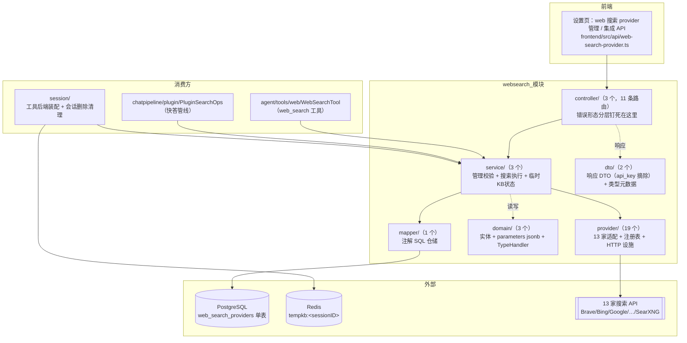
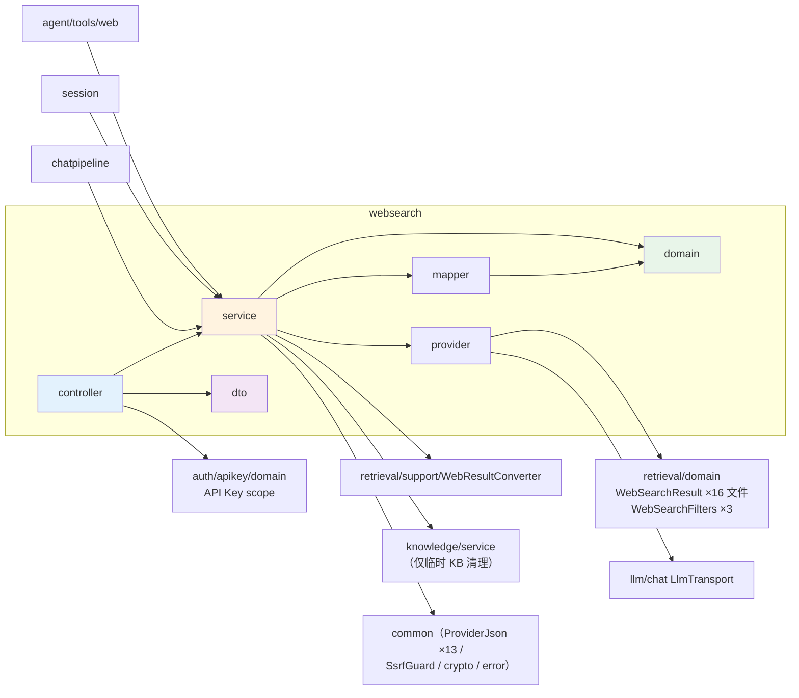
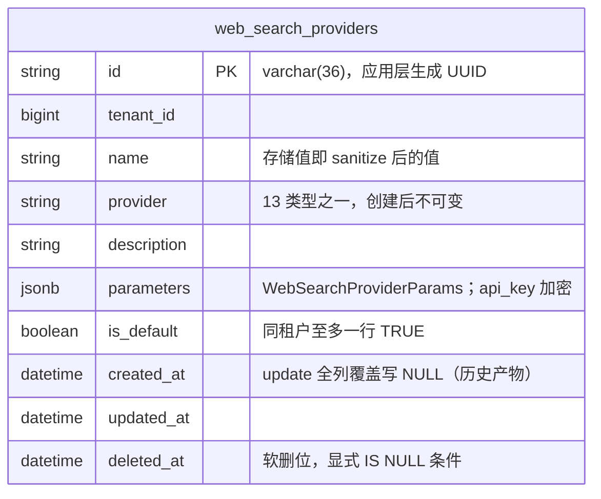
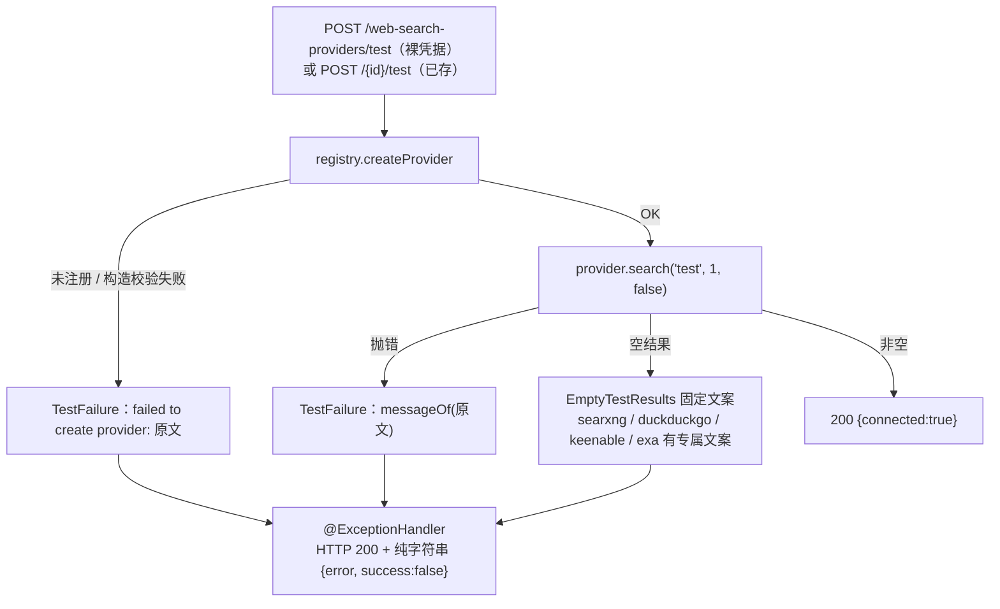
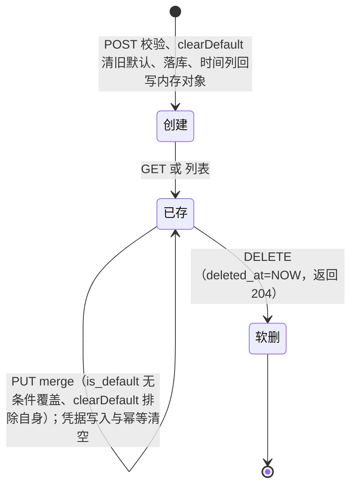

# websearch 模块手册

> **面向读者**：第一次接手 `com.ragagent.websearch` 的架构师 / 高级开发者。
> **目标**：30 分钟建立全局观 → 能定位改动点 → 能安全迭代（全量后端 4,836 用例兜底，改错会立刻红；本域自有 48 个用例 + 43 个契约 fixture + 11 个 wire 录制）。
> **数据口径**：2026-10-08 实测（`wc -l` 口径）：**32 个 java 文件 / 约 4.4 千行 / 6 个子包（+ 根 package-info）**。
> **本文档的地位**：模块级导览；仓库级作业规范见仓库根 `HANDOFF.md`（§12 结构地图、§13 踩坑清单、§14 逐包重构范式）。

---

## 0. 一分钟速览

**它是什么**：联网搜索域的全部后端能力——**管搜索 provider，再用它执行搜索**。

- provider 目录与凭据：13 家搜索 provider 的租户级 CRUD、默认切换、API key 写入 / 清除（落库加密）、连通性测试
- 搜索执行：`WebSearchService.search` → 注册表按类型创建适配器 → 出站调各家 API → 黑名单过滤 → 统一返回 `WebSearchResult`
- 临时 KB 状态：会话级"网页搜索临时知识库"的 Redis 状态与删除清理（真正在消费的只有会话删除三件套）
- 消费方：agent 的 `web_search` 工具、快答管线（chatpipeline）、会话删除清理

**它不是什么**（别在这里改）：

| 不负责 | 归属 |
|---|---|
| URL 抓取（网页正文抓取 / 页面快照） | `agent/support`（原 `webfetch` 已并入）与 `agent/tools/web/WebFetchTool`——`web_search` 工具 `content=true` 的并行抓取走的是它 |
| KB 内检索、向量 / 关键词融合 | `knowledge` / `retrieval` |
| 结果重排 | `rerank` |
| `WebSearchResult` / `WebSearchFilters` 契约本体 | `retrieval/domain`（本域 16 个文件消费它；检索 / agent 链路复用同一类型） |
| 租户 web 搜索配置的 jsonb 形状 | `auth` 域 `tenantconfig.WebSearchConfig`（本域 `WebSearchConfig` 只是执行所需字段子集） |

### 图 1：模块全景



**三个必须知道的数字**：最大类 433 行（`WebSearchProviderController`——三种私有异常类型 + 手写绑定 / 脱敏辅助，整个错误形态分层都在这一个类里）；`provider/` 占 2,382 行（约 54%，是绝对主体）；本域 48 个用例对 43 个 `wsp-*` 契约 fixture + 11 个 `ws_*` wire 录制。

---

## 1. 目录结构与职责

### 1.1 子包清单（放什么 / 不放什么）

| 子包 | 文件/行数 | 放什么 | **不放什么** |
|---|---|---|---|
| `controller/` | 3 / 585 | 3 个 `@RestController`、11 条路由；逐端点固定的错误形态、手写 JSON 绑定与日志脱敏辅助 | 校验规则（→ `service/`）、出站 HTTP（→ `provider/`） |
| `service/` | 3 / 851 | 管理校验（`WebSearchProviderService`）、搜索执行链（`WebSearchService`）、临时 KB 状态（`WebSearchTempKbStateService`） | 各家 API 的请求/响应细节（→ `provider/`） |
| `provider/` | 19 / 2,382 | `WebSearchProvider` 接口 + 13 家适配 + 注册表 + `SearchHttp`/`SearchDecode`/`EmptyTestResults`/`SearxngValidation` | Spring HTTP 面、落库 |
| `domain/` | 3 / 212 | `web_search_providers` 实体 + `parameters` jsonb 值类型 + `WebSearchParamsTypeHandler`（api_key 加解密） | 请求/响应形状（→ `dto/`） |
| `dto/` | 2 / 277 | 响应 DTO（api_key 按构造摘除）+ `WebSearchProviderTypes` 静态元数据 | 持久化注解 |
| `mapper/` | 1 / 75 | 注解 SQL 仓储（软删显式条件、`parameters` 列显式 typeHandler） | 业务判断 |
| 根 | 1 / 5 | `package-info`（域职责一句话） | |

### 1.2 依赖方向（被谁吃、吃谁）



**枢纽是"一个接口 + 一个注册表 + 一个跨域契约"**：

1. `provider/WebSearchProvider` 接口把 13 家适配收敛成 `search` / `searchWithFilters`（default 抛 `UnsupportedOperationException` = 未实现过滤能力）/ `emptyResultDiagnostics` 三个能力面——接新 provider 只动实现 + 注册。
2. `provider/WebSearchProviderRegistry`（`LinkedHashMap` 固定注册序）按类型 ID 即时创建实例，未注册类型报 `web search provider type %s not registered`（test 流程的确定性分支）。
3. `retrieval/domain/WebSearchResult` 是**跨域契约**（归属在 retrieval）：本域 16 个文件生产它，agent 工具与管线消费它——它的序列化形状是检索载荷冻结面（见 §7.11）。

本域**没有门面**（不到 knowledge 那种神类规模）：3 个 service 各管一摊，最大的类是 controller。

---

## 2. 数据模型

### 2.1 ER 图（1 张表）



单表域，无关联表。表由**迁移 000030** 引入：基线在 `migrations/versioned/V1__baseline.sql`（`web_search_providers`），测试侧同形建表在 `server/src/test/java/com/ragagent/TestSchema.java`（约 L538）。另有**非表状态**：Redis 键 `tempkb:<sessionID>`（§4.3）。

### 2.2 配置 / 契约类型

| 类型 | 位置 | 说明 |
|---|---|---|
| `WebSearchProviderParams` | 本域 `domain/` | `parameters` jsonb 值类型：`apiKey`（**落库 AES-GCM 加密**，`enc:v1:` 前缀，TypeHandler 读写时处理）/ `engineId`（Google CSE）/ `baseUrl`（SearXNG）/ `proxyUrl` / `extraConfig`（provider 特有非秘密扩展：zhipu `search_engine`+`content_size`、metaso `scope`、bocha `freshness`——**内层键保持 snake**，见 §3.2） |
| `WebSearchConfig` | 本域 `service/WebSearchService` 内部类 | 执行面字段子集（provider/apiKey/filters/maxResults/includeDate/blacklist/embeddingModelId/documentFragments/proxyUrl）；javadoc 明说"jsonb 形状以 session 配置为准，这里只承载执行所需" |
| `WebSearchResult` / `WebSearchFilters` | **`retrieval/domain/`** | 结果条目与 country/freshness 过滤契约。结果类 javadoc：字段按声明序序列化；`age`/`published_at` 为空时**省略整键**；不落库、不作响应体的内部承载类型 |
| `SearchResult` | `common/retrieval/` | SSE / 检索契约载荷；`WebResultConverter` 把 `WebSearchResult` 转成它 |
| `TempKbState` | 本域 `service/WebSearchTempKbStateService` | Redis 载荷 `{kbId, knowledgeIds, seenUrls}`（camel；旧键 `kbID/knowledgeIDs/seenURLs` 由 `migrateLegacyKeys` 部署窗口迁移） |
| `TypeInfo` | `dto/WebSearchProviderTypes` | `/types` 与 legacy 端点共用的静态元数据；13 条目**顺序固定 = 契约**（含 config_fields：`labelKey`/`descriptionKey` 已 B28 收口 camel） |

**硬约定（踩过坑）**：

1. jsonb 列写路径必须 `setObject(Types.OTHER)`（`setString` 会被 PG 拒："column ... is of type jsonb but expression is of type character varying"——TypeHandler 内注释）。
2. 注解 SQL **不套实体注解**：mapper 的 `parameters` 列必须逐条显式声明 typeHandler（`@Result` / `#{...,typeHandler=}`，mapper javadoc）。
3. `isDefault` 是"is 前缀布尔"坑：字段名保留 `isDefault` 但显式 `@TableField("is_default")` 钉列名（实体 javadoc）。

### 2.3 状态枚举

**不适用**——本域没有状态机与枚举类型。仅两个"状态位"：

| 状态位 | 语义 |
|---|---|
| `is_default` | 同租户至多一个默认 provider；由 `clearDefault(tenantId, excludeId)` 在同一条 UPDATE 里互斥保证（创建时排除 `""` = 清全部） |
| `deleted_at` | 软删；查询一律显式 `deleted_at IS NULL`（不用 `@TableLogic`，mapper javadoc） |

错误"形态的枚举"其实是 controller 的 HTTP 分层，见 §3.2。

---

## 3. HTTP 接口面

### 3.1 端点分组（3 个 controller / 11 条路由）

**provider 管理面**（`WebSearchProviderController`，前缀 `/api/v1/web-search-providers`，8 条；角色门：读 Viewer+ / 写 Admin+）

| 方法 | 路径 | 用途 |
|---|---|---|
| GET | `/types` | 13 类静态元数据（裸列表，条目顺序 = 契约） |
| POST | `/test` | 裸凭据连通性测试（Admin+） |
| POST | （裸） | 创建；`name`/`provider` required，多缺失字段按声明序 `\n` 拼接报 400 |
| GET | （裸） | 列表（`created_at ASC` 排序——vector/storage 是 DESC，此处刻意不同） |
| GET | `/{id}` | 详情 |
| PUT | `/{id}` | 更新；merge 规则：**api_key 恒保留存量**（不从本端点流动）、`extra_config` 缺省保留存量、provider 类型不可变 |
| DELETE | `/{id}` | 软删（204） |
| POST | `/{id}/test` | 已存 provider 连通性测试 |

**凭据面**（`WebSearchProviderCredentialsController`，同前缀，2 条，Admin+）

| 方法 | 路径 | 用途 |
|---|---|---|
| PUT | `/{id}/credentials` | body `apiKey` 为 **null = 查询状态语义**（回 `{fields:{apiKey:{configured}}}`）；有值 = 写入 |
| DELETE | `/{id}/credentials/{field}` | 仅 `field=apiKey` 合法（未知 field 400 且先于存在性判定）；幂等；204 |

**legacy**（`WebSearchController`，1 条）：`GET /api/v1/web-search/providers` —— 与 `/types` 同一份元数据包 `{data,success}` 信封；注册在**原始 group**（无 apiKeyGroup 包装）→ API Key default-deny（刻意不登记进 `APIKeyRoutePolicies`，类 javadoc）。前端已无调用方（B22 删了死模块 `api/web-search.ts`），现仅由 `wsp-legacy-providers.json` fixture 钉住。

> 注：主 controller javadoc 写"10 条路由"，口径 = 上表 8 条 + 同前缀凭据面 2 条；本类自身的 `@*Mapping` 实数是 8。

### 3.2 契约约定（改接口前必读——与 knowledge 域不同，本域是"混搭且刻意"）

| 约定 | 本域实际 |
|---|---|
| 请求键 | camelCase（`isDefault` 已 B17② 收口，**不留兼容别名**）；**`extraConfig` 内层键刻意保持 snake**（`search_engine`/`content_size`/`scope`/`freshness`——B30 判定"存量存储层与第三方载荷不动"） |
| 响应键 | camelCase；**api_key 按构造摘除**，只回 `credentials.apiKey.configured` 布尔（map 恒非空、键恒出现） |
| 信封 | **混搭是刻意的**：管理面裸对象 / 裸数组；legacy 端点 `{data,success}`；test 成功 `{connected:true}`；凭据面 `{fields:{apiKey:{configured}}}`；前端 api 层显式适配（B58 点名 web-search-provider 为"有意适配的 API 层"） |
| 删除 | 返回 **204**（provider 与凭据 field 一致） |
| 敏感字段可见性 | `proxyUrl`/`extraConfig` 仅 Admin+（或持全量 / `manage_tenant_settings` 能力的 API key）可见；不可见时置空串 / null |
| 校验错误 | 400 AppError code 1000；多字段按声明序 `\n` 连接；**校验文案逐字固定 = test 端点确定性契约** |

**错误形态分层（逐端点固定，不做统一映射——controller javadoc 原话）**：

| 场景 | HTTP | 形态 |
|---|---|---|
| 租户缺失（主 controller） | 401 | 纯字符串 `{"error":"unauthorized: workspace context missing","success":false}` |
| 租户缺失（凭据面） | **400** | AppError `"Workspace ID cannot be empty"`（**不是 401**！） |
| 绑定失败（EOF / 坏 JSON / validator 原文） | 400 | AppError code 1000 |
| 未知 id（主 controller `owned`） | 404 | **纯字符串** `{"error":"web search provider not found",...}`（凭据面同场景是 AppError code 1003） |
| service 业务失败（create/update/凭据写清） | **500** | AppError code 1007 + 原文 |
| test 端点测试失败 | **200** | 纯字符串 `{error, success:false}`（`TestFailure` @ExceptionHandler） |

> B26 教训（HANDOFF §11，2026-10-02）：凭据面曾三处键名错位 → **保存静默失效 / 删除 400 / 徽标恒"未配置"**。改这一面的铁律是"逐面看消费者链"，静态检查抓不到。

---

## 4. 核心链路

### 4.1 一次网页搜索（provider 解析 → 过滤分支 → 黑名单归一）

```mermaid
sequenceDiagram
    participant T as 调用方<br/>WebSearchTool / PluginSearchOps
    participant S as WebSearchService
    participant R as WebSearchProviderRegistry
    participant P as 13 选 1 的适配器

    T->>S: search(tenantId, providerId, config, query)
    Note over S: config == null 直接 IllegalStateException
    alt providerId 非空（主路径）
        S->>S: 仓储取实体（缺行=not found）<br/>mergeProxyFromWebSearchConfig 调用期覆盖 proxyUrl
        S->>R: createProvider(类型, params)
    else 仅 deprecated config.Provider（回落）
        S->>R: createProvider(cfg.provider, cfg.apiKey)<br/>（warn 日志，兼容路径）
    else 两者都空
        S-->>T: IllegalStateException "no web search provider configured"
    end
    alt country / freshness 非空
        S->>S: WebSearchFilters.validate()
        S->>P: searchWithFilters（仅 Brave 覆写）
        Note over P: UnsupportedOperationException →<br/>"provider %s does not support ...; omit them or select Brave"
    else 无过滤
        S->>P: search(query, maxResults, includeDate)
    end
    P-->>S: WebSearchResult 列表
    S->>S: filterBlacklist<br/>/…/ 正则非锚定 find；否则 *→.* 全串锚定
    S-->>T: WebSearchResult 列表
```

配套的纯辅助族（同在 `WebSearchService`）：`convertWebSearchResults`（转 `SearchResult`，seq=下标）、`selectReferencesRoundRobin`（按 source URL 公平轮选）、`consolidateReferencesByURL`（按 `[sourceUrl]: ` 首行标记合并引用）——消费由管线决定，本域只提供确定性纯函数。

### 4.2 连通性测试（test 端点的确定性分支）



三个失败支全部收敛为 **200 纯字符串**——这是测试端点的产品语义（前端展示"为什么连不上"），不是 bug。searxng 的 detail 由适配器 `emptyResultDiagnostics()` 补充。

### 4.3 provider 生命周期与临时 KB 清理



- **临时 KB 清理**（`WebSearchTempKbStateService.deleteTempKbState`）：读 `tempkb:<sessionID>` → JSON 损坏 / kbID 空白只删键 → 否则逐个删知识条目（失败逐条 warn 继续）→ 删临时 KB（失败 warn 继续）→ **只有最后删 Redis 键失败才上抛**，调用方（`session/SessionService` 会话删除三件套）吞掉并 warn。
- `get`/`save` 当前**无调用方**（压缩路径休眠，javadoc 明说）；`chatpipeline.PipelinePorts.WebSearchStateService` 是存而不读的占位端口。

---

## 5. 改哪里（场景 → 文件）

| 我想… | 主要改这里 | 别忘了 |
|---|---|---|
| 接一家新搜索 provider | `provider/` 新实现 `WebSearchProvider` → `WebSearchProviderRegistry` 注册 → `WebSearchProviderService`：`VALID_PROVIDER_TYPES` + `validateProviderParameters` + `constructProvider` 分支 | `WebSearchProviderTypes.all()` 加条目（**顺序 = 契约**）；空结果诊断文案进 `EmptyTestResults`；补 wire 录制 `ws_*.json` 与 `wsp-*` fixture |
| 改参数校验文案 | `service/WebSearchProviderService`（`failed(...)`） | 文案逐字固定 = test 端点确定性分支契约；`wsp-create-*` fixture 会红；searxng 校验有**两份实现**（§9），两处同改 |
| 改响应字段 / 信封 | `dto/WebSearchProviderResponse.from` | api_key 摘除不变式；前端 `frontend/src/api/web-search-provider.ts` **同批**；`wsp-*` fixture 重录 + 结构化复核 |
| 改搜索执行语义（黑名单 / 过滤 / 转换） | `service/WebSearchService` | 消费方两处：`agent/tools/web/WebSearchTool`（本地还有 URL 过滤 / 去重 / 截断）与 `chatpipeline/plugin/PluginSearchOps`；`WebSearchServiceExecTest` 钉行为 |
| 改凭据语义 | `controller/WebSearchProviderCredentialsController` + `service.updateCredentials` / `clearCredential` | PUT `apiKey=null` 是查询语义；清空幂等；`wsp-cred-*` fixture |
| 改 parameters jsonb 形状 | `domain/WebSearchProviderParams`（+ TypeHandler） | 读路径已 `FAIL_ON_UNKNOWN_PROPERTIES=false` 容错；键演进参考 `TempKbState.migrateLegacyKeys` 的部署窗口迁移模式；schema 不变（jsonb） |
| 改代理 / SSRF 行为 | `provider/SearchHttp` + `common/security/SsrfGuard` + `service.validateProxyUrl` | SsrfGuard 是**进程级静态**——测试改白名单必须快照还原（两个 ExecTest 的 BeforeAll/AfterAll 模式）；自托管 searxng 必须在白名单内 |
| 改临时 KB 清理 | `service/WebSearchTempKbStateService` | 只有 Redis 删除失败才上抛；`WebSearchTempKbStateServiceTest`（7 用例）钉语义 |
| 改 agent 的 web_search 工具 schema / 行为 | **`agent/tools/web/WebSearchTool`（不在本域）** | 后端接线在 `session/AgentToolBackends`；schema 键序是钉死契约（B88 已全量 camel 化） |
| 改默认 provider 选择 | `service/WebSearchService.resolveProvider` + `chatpipeline/plugin/PluginSearchOps.effectiveWebSearchConfig` | deprecated `config.Provider` 回落路径仍在（warn）；租户配置 jsonb 形状在 auth 域 `tenantconfig.WebSearchConfig` |

---

## 6. 常见迭代 SOP

> 铁律（继承仓库级）：**一次只动一个轴**；每步结束**全绿**再走下一步。

```bash
# 每次改动后必跑（约 3 分钟）
cd ~/ragagent && JAVA_HOME=/opt/homebrew/opt/openjdk@21/libexec/openjdk.jdk/Contents/Home \
  ./gradlew :server:test :server:spotlessCheck
# 单域快速迭代（秒级）
./gradlew :server:test --tests "com.ragagent.websearch.*"
# 契约夹具重录（改契约后；重录后必须结构化复核差异，HANDOFF §13.12）
JAVA_HOME=/opt/homebrew/opt/openjdk@21/libexec/openjdk.jdk/Contents/Home \
  ./gradlew :server:test --tests "com.ragagent.websearch.controller.WebSearchProviderContractTest" -Dcontract.refresh=true
```

**A. 接新 provider**：实现 `WebSearchProvider` → 注册表 + `VALID_PROVIDER_TYPES` → 两处参数校验分支 → `WebSearchProviderTypes` 条目 → `EmptyTestResults` 文案 → wire 录制 + `wsp-*` fixture → 三绿 → 提交。

**B. 改管理面契约（字段 / 文案 / 信封）**：`dto`/`controller` → fixture 重录（`-Dcontract.refresh=true`）+ 结构化复核 → 前端 `web-search-provider.ts` 同批 → 三绿 → 提交。凡动凭据面，先重读 §3.2 错误形态表（B26 的坑就在这）。

**C. 改执行链**：`service`/`provider` → `WebSearchProviderExecTest`（本地 stub server，请求体与 `wire/ws_*.json` 逐字节比对）/ `WebSearchServiceExecTest` 补用例 → 三绿 → 提交。

**D. 改 jsonb 形状**：`domain` 值类型 → TypeHandler 容错确认（`FAIL_ON_UNKNOWN_PROPERTIES=false` 已就位）→ 单测 round-trip → 三绿 → 提交。

---

## 7. 模块约定与坑（必读）

1. **错误形态是"逐端点固定"，别"顺手统一"**：主 controller 与凭据面对同一场景（租户缺失 / 404）形态**刻意不同**（§3.2 表）；统一 = 改前端可见契约（出处：`WebSearchProviderController` javadoc"错误形态分层（逐端点固定形态，不做统一映射）"）。
2. **api_key 三不**：不进 `PUT /{id}`（控制器强制保留存量，deprecated 告警仅日志）、不进响应（DTO 按构造摘除）、明文不落库（TypeHandler AES-GCM）。且**解密失败静默置空 + warn**（"SYSTEM_AES_KEY missing/rotated?"）——密钥轮换后症状是"所有 provider 徽标恒未配置"，不是报错（TypeHandler javadoc）。
3. **改凭据 / 键名必须逐面看消费者链**：B26 修掉的正是"键名错位三处 → 保存静默失效 / 删除 400 / 徽标恒未配置"（HANDOFF §11 B26）。
4. **请求键 camel、`extraConfig` 内层 snake 是有意分界**：`isDefault` 已收口不留别名（B17②）；`search_engine`/`scope` 等是 provider 第三方语义面，B30 判定不动（HANDOFF §11）。
5. **provider 校验文案逐字固定**：它们是 test 端点确定性分支的契约（`WebSearchProviderService` javadoc"错误文案逐字固定"），改文案 = 改契约，同批重录 fixture。
6. **`WebSearchProviderTypes` 条目顺序是契约**（dto javadoc"条目顺序固定（契约，勿排序/增删）"）——前端按序渲染。
7. **SSRF 约束在触网前**：`proxyUrl` 与 searxng `base_url` 先过进程级静态 `SsrfGuard`；重定向逐跳校验；**Brave 刻意不跟随重定向**（订阅令牌绝不转发给重定向目的地，`BraveProvider` javadoc）。
8. **mapper 注解 SQL 的 jsonb 列必须显式 typeHandler**；list 排序 `created_at ASC` 刻意不同于 vector/storage 的 DESC（mapper javadoc）。
9. **`update` 全列覆盖会把 `created_at` 写 SQL NULL**（早期全列覆盖写入的历史产物）；null 读出后在响应里呈现 `0001-01-01T00:00:00Z`；create 必须把时间回写内存对象否则响应输出零值时间（实体 javadoc + `create` 内注释）。
10. **`TempKbState` 的 `get`/`save` 存而不读**（压缩路径休眠）；delete 的错误只有 Redis 删除失败才上抛、调用方吞掉——在它里面加"必须成功"的逻辑之前先确认压缩路径是否回厂（service javadoc）。
11. **`WebSearchResult.age`/`published_at` 键名属检索载荷冻结面**（retrieval 域类型；"为空时省略整键"）；B88 工具面 camel 化时 `published_at` 一度被误伤（HANDOFF B88）——动这两个键 = 动实录与前端消费面，须独立批次。
12. **webfetch 不在本域**：URL 抓取已并入 `agent/support`（原 `webfetch` 包）；本域只有"搜索"，没有"抓正文"。

---

## 8. 测试与验证

- **规模（2026-10-08 实测）**：`server/src/test/java/com/ragagent/websearch/` 下 **5 个测试类 / 48 个 `@Test`**：
  - `controller/WebSearchProviderContractTest`（8）——MockMvc 契约面，43 个 `wsp-*` fixture（`server/src/test/resources/contracts/`）；每个 `@Test` 从同一播种出发按录制序串完自己段落的前置变更（类 javadoc）；已接入 `-Dcontract.refresh=true` 重录（HANDOFF §13.12）。
  - `provider/WebSearchProviderExecTest`（28）——本地 stub server（`com.sun.net.httpserver`），请求体 / URL 与 `resources/wire/ws_*.json`（11 个：brave/tavily/ollama/searxng/baidu/keenable×2/metaso/zhipu/exa/bocha）逐字节比对 + 各 provider 确定性分支。
  - `service/WebSearchServiceExecTest`（4）——mock 仓储 + stub provider，钉 resolveProvider / 过滤分支 / 黑名单。
  - `service/WebSearchTempKbStateServiceTest`（7）、`controller/WebSearchProviderRequestBindingTest`（1）。
- **比较口径**：契约比较器是语义比较（键序 / 转义归一化后比），fixture 锚定的是本仓自己的行为；wire 比对是逐字节的（provider 请求面刻意钉死）。
- **已知偶发 2 例**（HANDOFF §9；遇到先单独重跑，别误判回归）：
  - `WebToolsRecordingTest.searchWithContentFetchesLeadingPagesViaSharedFetchTool`——**已迁至 `agent/tools/web/`**（B34 分包时跟移），与本域是"消费关系"而非归属：它录的是 agent `web_search` 工具行为，工具后端注入本域 `WebSearchService`，但测试树不在本域。红了先确认不是本域 `search` 链路被改。
  - `EvaluationContractTest.getTerminalRunsExecution`——属 evaluation 域，与本域无关，仓库级已知偶发（单独 `--tests "*EvaluationContractTest"` 通过）。
- **改前端可见契约时**：后端与前端**同批**改完再提交（`frontend/src/api/web-search-provider.ts` + 设置页）。

---

## 9. 已知待办与风险（接手后优先看）

| 项 | 性质 | 建议 |
|---|---|---|
| searxng `base_url` 校验存在**两份实现**：`service/WebSearchProviderService.validateSearxngBaseUrl` 与 `provider/SearxngValidation`（后者 javadoc 自称"服务层与构造器共用"，实为平行副本） | 重复 / 漂移风险 | 文案目前逐字一致；建议收敛到 `SearxngValidation` 一处；收敛前改文案必须两处同改 |
| `TempKbState` 的 `get`/`save` 存而不读 + `migrateLegacyKeys` 是部署窗口临时代码 | 死代码 / 临时代码 | javadoc 已登记"窗口过后连同该方法删除"；确认压缩路径不回厂后一并清（`chatpipeline.PipelinePorts.WebSearchStateService` 占位端口同步处理） |
| legacy `GET /api/v1/web-search/providers` 前端已无调用方（B22 删 `api/web-search.ts`） | 退役候选 | 现仅 `wsp-legacy-providers.json` 钉住；退役须同批删 fixture，并确认"原始 group → API key default-deny"语义随端点一起消失是预期行为 |
| `ProviderJson`（`common/web`，本域 13 文件引用）仍是 Go 兼容序列化收尾面 | 技术债 | 跟随仓库级档 3 收尾（HANDOFF §11 B37–B47），**不单独动本域副本**（B41 已把四副本收敛为超集） |
| `WebSearchResult.age`/`published_at` 键名冻结面 + "为空省略整键" | 契约风险 | 动 `retrieval/domain` 这两个键影响检索载荷 / 实录 / 前端重建，须独立批次 + 全量验证（B88 误伤记录在案） |
| 主 controller javadoc"10 条路由"与类内实数 8 不一致（口径含凭据面 2 条） | 文档口径 | 无需改；读代码按 `@*Mapping` 实数，本文 §3.1 已对齐 |

---

## 10. 速查：本模块的"地标"

| 想知道 | 看这里 |
|---|---|
| 11 条路由怎么分 | §3.1：主 controller 8 + 凭据面 2 + legacy 1 |
| 错误为什么一会儿 401、一会儿 400、一会儿 200 | `WebSearchProviderController` javadoc 的错误形态分层 + 本文 §3.2 表 |
| api_key 去了哪 | `domain/WebSearchParamsTypeHandler`（落库加密）+ `dto/WebSearchProviderResponse.from`（响应摘除）+ `PUT /{id}`（恒保留存量），§7.2 |
| 13 家 provider 怎么注册 / 校验 | `provider/WebSearchProviderRegistry` + `service/WebSearchProviderService`（`VALID_PROVIDER_TYPES` 与两处校验 switch） |
| 一家 provider 的真实请求/响应长什么样 | `server/src/test/resources/wire/ws_*.json` 录制 + `provider/` 对应类 |
| 黑名单规则语法 | `service/WebSearchService.matchesBlacklistRule`：`/…/` 是正则（非锚定 `find()`）；否则 `*`→`.*` 全串锚定 |
| 搜索执行被谁调用 | `agent/tools/web/WebSearchTool`、`chatpipeline/plugin/PluginSearchOps`、`session/QaWiring`（`PipelinePorts.WebSearch` 端口接线） |
| 临时 KB 是什么、谁在清 | `service/WebSearchTempKbStateService`（Redis `tempkb:<sessionID>`）+ `session/SessionService` 会话删除三件套，§4.3 |
| `/types` 返回的元数据哪里来 | `dto/WebSearchProviderTypes.all()`（纯静态、13 条目、顺序 = 契约） |
| 目录为什么这样分 | 根 `package-info.java`（本域唯一一份 package-info）+ 本文 §1 |
