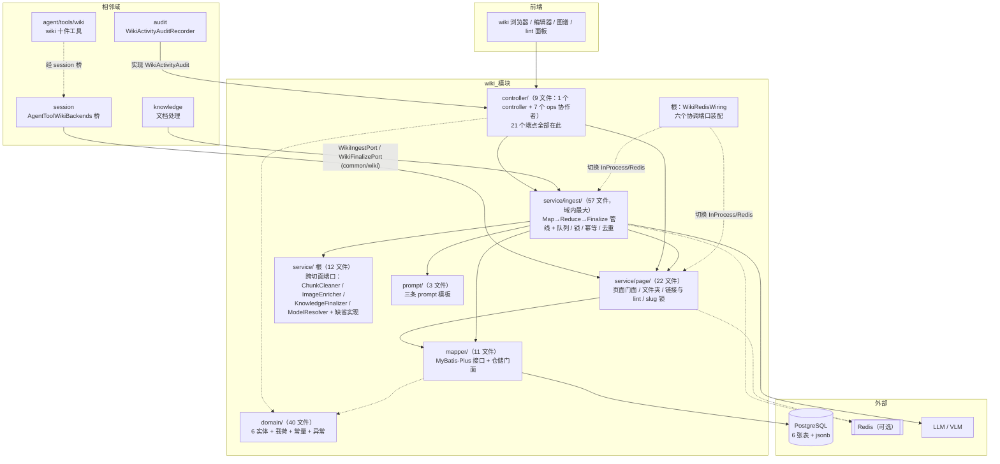
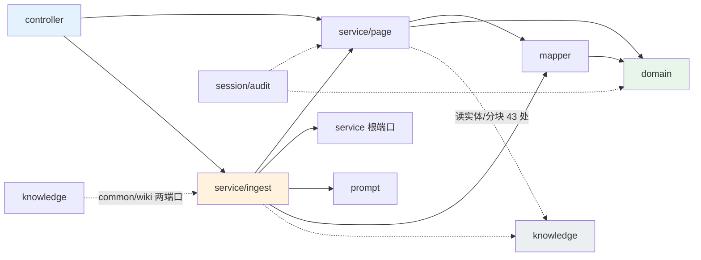
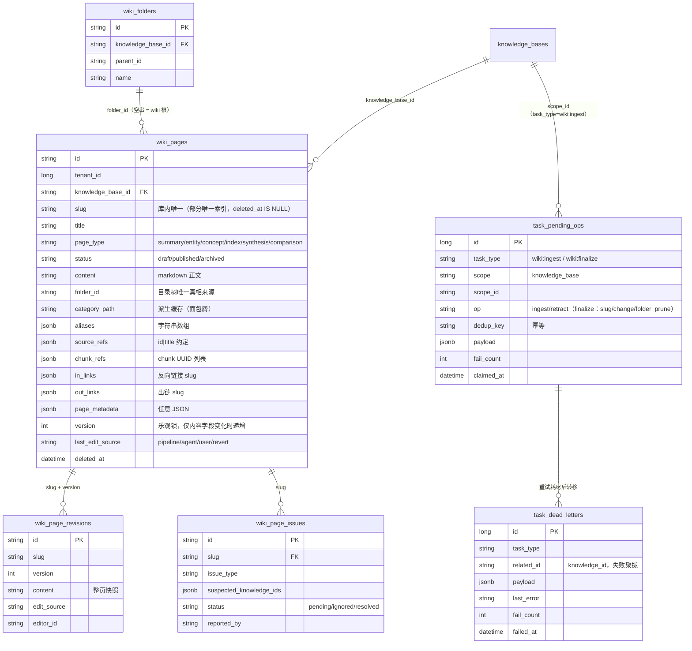
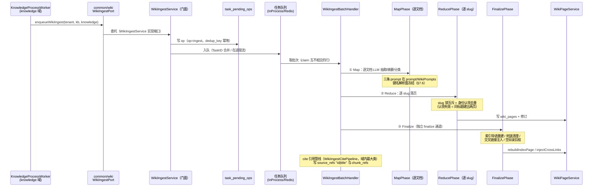
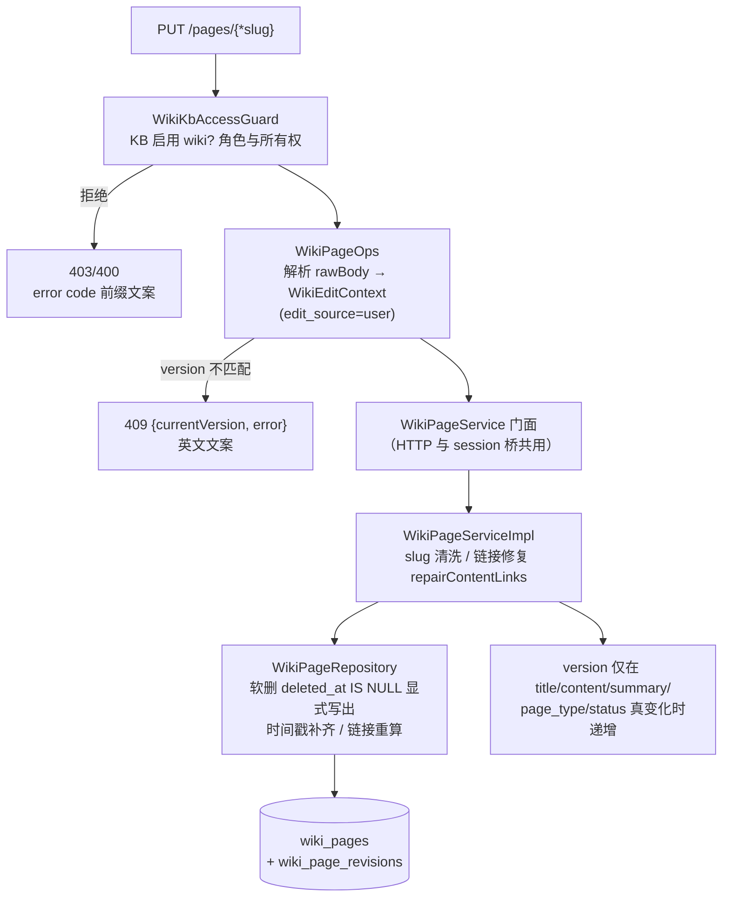

# wiki 模块手册

> **面向读者**：第一次接手 `com.ragagent.wiki` 的架构师 / 高级开发者。
> **目标**：30 分钟建立全局观 → 能定位改动点 → 能安全迭代（本模块有 481 个测试方法兜底，改错会立刻红）。
> **数据口径**：2026-10-08 实测（`wc -l` 口径）：**156 个 java 文件 / 约 2.39 万行 / 8 个子包**。
> **本文档的地位**：模块级导览；仓库级作业规范见仓库根 `HANDOFF.md`（§12 结构地图、§13 踩坑清单、§14 逐包重构范式）。

---

## 0. 一分钟速览

**它是什么**：知识库的**内联百科（wiki）域**——把 knowledge 域处理完的文档**再加工成一套人读的页面**，并提供完整的浏览与编辑面。

- 页面体系：页面 CRUD / 修订历史与回滚 / 文件夹树 / 索引页 / 关系图谱 / 统计 / 搜索
- 摄取管线：knowledge 文档处理完成 → 异步 **Map（逐文档抽取）→ Reduce（逐 slug 落页）→ Finalize（索引重建 / 死链清理 / 交叉链接）**，带任务队列、锁、幂等凭据、身份去重
- 撤回管线：文档删除 → 单来源页直接删、多来源页走 LLM 撤回、回收空目录
- 质量面：死链 lint / 自动修复 / 人工问题（issue）三态流转

**它不是什么**（别在这里改）：

| 不负责 | 归属 |
|---|---|
| 文档解析 / 分块 / 向量化 / 摘要（wiki 的"原料"来源） | `knowledge`（wiki 经 `common/wiki` 端口被它触发，读它的 `Knowledge`/`Chunk` 实体） |
| agent 的 wiki 十件工具（`WikiReadPageTool` 等）的参数解析与视图 | `agent/tools/wiki`（数据经 `session/AgentToolWikiBackends` 桥到本包 `WikiPageService`） |
| 审计落库 | `audit`（实现本域 `WikiActivityAudit` 接缝；缺 bean 时退化为 debug 日志） |
| LLM 调用与重试传输 | `llm`（本域经 `WikiModelResolver` 解析合成模型，`WikiLlmRetryPolicy` 只管策略） |
| wiki 功能开关 | `knowledge` 的 `IndexingStrategy.WikiEnabled`（本域只承载 `wiki_config` 调节项） |

### 图 1：模块全景



**三个必须知道的数字**：**21 个端点全部收在 1 个 controller 里**（knowledge 域是 8 个 controller 68 个端点——两域形态完全不同）；`service/` 三层（根 + ingest + page）合计 16,466 行 ≈ **69%** 的代码量，其中 ingest 一个子包 11,264 行；最大类 762 行（`WikiIngestCitePipeline`），域内 ≥800 行 = 0（2026-10-01 已清零）。

---

## 1. 目录结构与职责

### 1.1 子包清单（放什么 / 不放什么）

| 子包 | 文件/行数 | 放什么 | **不放什么** |
|---|---|---|---|
| 根 `wiki/` | 2 / 129（1 类 + package-info） | `WikiRedisWiring`：六个协调端口的 InProcess ↔ Redis 装配（`wiki.redis-enabled=true` 切换） | 业务逻辑 |
| `controller/` | 9 / 1,617（1 个 controller 264 行 + 7 个 ops 协作者 + package-info） | `WikiPageController` 只做转发；`WikiPageOps`/`WikiFolderOps`/`WikiStatsOps`/`WikiMaintenanceOps` 拼 raw JSON；`WikiKbAccessGuard` 守卫；`WikiRequestSupport` 解析/错误 | 业务规则（→ `service/page`）、SQL |
| `service/` | 12 / 652 | **跨切面端口与缺省实现**：`WikiChunkCleaner` / `WikiImageEnricher` / `WikiKnowledgeFinalizer` / `WikiModelResolver`（各带 Default 实现）+ LLM 重试策略与记账元数据 | 具体管线步骤（→ 两个子包） |
| `service/ingest/` | 57 / 11,264 | 摄取管线：门面 `WikiIngestService`、Map/Reduce/Finalize 三相、cite 引用管线、任务队列与锁（InProcess/Redis 双实现）、幂等凭据、身份去重、死信与孤儿 op 重放 | 页面读写语义（→ `service/page`） |
| `service/page/` | 22 / 4,550 | 页面服务（接口门面 `WikiPageService` + 732 行实现）、文件夹支撑、链接与 lint（`WikiLinkify`/`WikiCrossLinker`/`WikiDeadLinks`）、slug 锁与匹配、编辑上下文 | 摄取批次编排（→ `ingest`） |
| `mapper/` | 11 / 2,328 | MyBatis-Plus 接口（显式 SQL 为主）+ 仓储门面（`WikiPageRepository` 706 行：软删 / 时间戳 / 链接重算） | 业务判断 |
| `domain/` | 40 / 2,539 | 6 个 `@TableName` 实体 + 请求/响应形状 + `WikiConstants`（页面类型 / 状态 / 修订保留策略）+ 异常族 + `WikiConfig` 值类型 | 队列载荷（→ `ingest` 的 `WikiIngestPayload`） |
| `prompt/` | 3 / 834 | `WikiPrompts`（三条 prompt 正文）+ 模板渲染支撑 | 键名解析（解析类型在 `ingest`/`common/wiki`，键被 prompt 钉住，见 §7） |

### 1.2 依赖方向



**枢纽有两个**：`WikiPageService`（页面门面接口，HTTP 与 session 桥两侧都只认它）和 `WikiIngestService`（实现 `common/wiki` 的 `WikiIngestPort`，对 knowledge 只暴露一个 `enqueueWikiIngest` 方法）。**方向红线**：`knowledge → wiki` 的 import 必须保持为 **0**（环已于 2026-09-30 经 `common/wiki` 值类型 + 两端口解开，`scripts/check-package-cycles.py` 守卫基线为环 0 组）；wiki → knowledge 的 43 处 import 是合法方向，但新增时要掂量是否该走窄端口。

---

## 2. 数据模型

### 2.1 ER 图（6 张表）



> 两点结构说明：① `wiki_pages.category_path`/`wiki_path`/`depth` 是从 `folder_id` 派生的**反规范化缓存**，每次写入重算，换取 list/index/search 免 join（`WikiPage` javadoc）；② `task_pending_ops`/`task_dead_letters` 是 wiki 自有的任务持久化，取代了历史 Redis `wiki:pending:<kbID>` 列表（4 万文档规模下会被 TTL 驱逐，`WikiIngestService` javadoc）。

### 2.2 jsonb 列与值类型对照

| 列 | 类型 | 说明 |
|---|---|---|
| `wiki_pages.aliases` / `category_path` / `source_refs` / `chunk_refs` / `in_links` / `out_links` | `WikiStringListTypeHandler`（字符串数组） | 六列同一家族；空列表序列化为 `null`（`EmptyListAsNullSerializer`） |
| `wiki_pages.page_metadata` | `PgJsonTypeHandler` + `insertStrategy = ALWAYS` | 任意 JSON；**必须 ALWAYS 插入**——MyBatis-Plus 默认对 null 省列会落到 DB 默认 `'{}'`，而契约 golden 里该键是 `null`（字段处注释） |
| `wiki_page_issues.suspected_knowledge_ids` | `WikiStringListTypeHandler` | 列可空，读回空列表 |
| `task_pending_ops.payload` / `task_dead_letters.payload` | `PgJsonTypeHandler` | 队列 op 载荷 |
| `knowledge_bases.wiki_config`（knowledge 域的表） | `WikiConfig`（值类型在本域 `domain/`） | `synthesisModelId`/`maxPagesPerIngest`/`extractionGranularity`/`contentInstructions`；由 KB 更新请求的 `config.wiki_config` **原样落库**，知识域不重写内层键 |

**硬约定（踩过坑）**：六个 `@TableName` 全部带 `autoResultMap = true`；`WikiPage` 的派生访问器必须 `@JsonIgnore`（见 §7.5）；`WikiConfig` 读路径用 `FAIL_ON_UNKNOWN_PROPERTIES=false` 的 mapper（历史行里有 `enabled`/`auto_ingest` 等退役键）。

### 2.3 状态与枚举

| 枚举 / 常量 | 取值 | 用在哪 |
|---|---|---|
| `WikiConstants.PAGE_TYPES` | `summary` / `entity` / `concept` / `index` / `synthesis` / `comparison` | `wiki_pages.page_type`（synthesis/comparison 只能由 agent 工具创建，ingest 不自动生成） |
| `WikiConstants.STATUSES` | `draft` / `published` / `archived`（SQL 默认 `published`） | `wiki_pages.status` |
| `EDIT_SOURCE_*` | `pipeline` / `agent` / `user` / `revert`（历史空串回落 pipeline） | `last_edit_source`，"页面被谁写过"的信号 |
| `WikiExtractionGranularity` | `standard` / `exhaustive`（空值与未知值归一 standard） | `wiki_config.extraction_granularity`，控制抽取粒度 |
| `WikiPageIssue.status` | `pending` / `ignored` / `resolved`（SQL 默认 `pending`） | lint 问题三态（`WikiMaintenanceOps` 校验） |
| `WikiPendingOp.op` | `ingest` / `retract` | `task_pending_ops`（`task_type="wiki:ingest"`） |
| finalize op | `slug` / `change` / `folder_prune` | `task_pending_ops`（`task_type="wiki:finalize"`，独立通道） |
| 图谱模式 | `overview` / `ego` | `GET /graph?mode=` |
| 修订保留 | 软上限 50 / 页（可清理 `""` 与 `pipeline` 来源）/ 硬上限 200 / 页 | `WikiConstants` 修订清理策略 |

---

## 3. HTTP 接口面

### 3.1 端点分组（1 个 controller / 21 个端点）

唯一前缀：`/api/v1/knowledgebase/{kb_id}/wiki`（⚠️ 路径变量 `{kb_id}`/`{folder_id}`/`{issue_id}` 是 **snake**——历史路径，前端按此拼 URL，别"顺手"改 camel）。

**页面 CRUD**（`WikiPageOps`，5 个）

| 方法 | 路径 | 用途 |
|---|---|---|
| GET | `/pages` | 页面列表（分页/类型/文件夹/路径过滤），`{pages,total,page,pageSize,totalPages}` |
| POST | `/pages` | 创建页面 → **201** |
| GET | `/pages/{*slug}` | 页面详情（catch-all slug） |
| PUT | `/pages/{*slug}` | 编辑（乐观锁 `version`；冲突 **409** `{currentVersion,error}`） |
| DELETE | `/pages/{*slug}` | 删除（软删）→ **204** |

**修订历史**（2 个）：`GET /revisions/{*slug}`（列表）、`POST /revert`（回滚到历史版本）。

**文件夹树**（`WikiFolderOps`，5 个）：`GET /folders`（树）、`POST /folders`（**201**）、`PUT /folders/{folder_id}`（重命名/移动）、`DELETE /folders/{folder_id}`（空才能删，**204**）、`PUT /move-page`（页面换文件夹）。

**索引 / 图谱 / 统计 / 搜索**（`WikiStatsOps`，4 个）：`GET /index`（目录页）、`GET /graph`（关系图谱，overview/ego）、`GET /stats`、`GET /search`（`{pages:[...]}`）。

**维护 / 问题**（`WikiMaintenanceOps`，5 个）：`POST /rebuild-links`、`GET /lint`（体检报告）、`POST /auto-fix`（`{fixed,message}`）、`GET /issues`（**裸数组**）、`PUT /issues/{issue_id}/status`（三态流转）。

### 3.2 契约约定（改接口前必读，本域与 knowledge 域**不同**）

| 约定 | 说明 |
|---|---|
| 字段名 | **JSON 名 = Java 字段名（camelCase）**——W1 换锚（2026-10-02）后的现状；**包根 package-info 与 `WikiPage` javadoc 里"JSON 键为 snake"的陈述已过期**，以 fixture（`wiki-page-get.json`）为准 |
| 信封 | **无** `{data,success}` 信封：实体直出、裸数组（issues）、单键 map（search/rebuild） |
| 键序 / 空值 | 键序 = 领域字段声明序（B75 摘键序注解后天然跟随声明）；**键恒输出**（`deletedAt:null` 也在）；空列表 → `null`（`EmptyListAsNullSerializer`） |
| raw map | handler 直写的 map 按**键字母序**输出（`LinkedHashMap` 保证）：`{currentVersion,error}`、`{fixed,message}` 等 |
| 状态码 | 创建 **201**、删除 **204**、乐观锁冲突 **409** |
| 错误 | **双轨**：21 个端点里除"KB 访问被拒"外全部走 handler 直写 `{"error":"..."}`（**英文**文案）；KB 校验文案带 `error code: %d, error message: %s` 前缀（如 KB 未启用 wiki → 400 + 前缀文案）；仅 KB 访问拒绝走全局信封 `{success:false,error:{code,details,message}}`。controller javadoc 明写"**逐端点保持原样，不要统一它们**" |
| 守卫 | 读端点：Viewer+ 角色 + KB 读权限（跨租户经 org-share / shared-agent 只读授予）；写端点：创建者本人或 Admin+（否则 403）+ KB 写权限。角色下限在 `WebConfig` 注册，KB 访问判定由 `WikiKbAccessGuard` 承接 |

---

## 4. 核心链路

### 4.1 摄取管线（knowledge 处理完成 → 四阶段落页）



**失败与重试**：op 重试预算耗尽 → 落 `task_dead_letters`（`related_id=knowledge_id` 让失败聚拢到源文档）；孤儿 op 由 `WikiPendingOpReplayer` 启动重放（B12 修复）；`WikiCleanupScope` 保证批次异常退出时释放认领，不用干等 `CLAIM_STALE_AFTER`（90 分钟）。**并发模型**：Standard 模式同 KB 多批次并发、靠认领互不相交行；Lite 模式（无 Redis 单进程）每 KB 串行。

### 4.2 页面编辑链路（HTTP → 门面 → 仓储）



**要点**：`version` 是"页面被编辑过"的真实信号——链接维护、同内容重摄取、后台同步**不递增**它（`WikiPage.version` javadoc）；每次用户可见变更落一条整页快照进 `wiki_page_revisions`，`last_edit_source` 随快照进历史，`POST /revert` 产生 `edit_source=revert` 的版本。文件夹归组的唯一真相是 `folder_id`，`categoryPath` 等只是缓存。

### 4.3 与 knowledge 域的协作（端口接缝）

```mermaid
flowchart LR
    subgraph knowledge_域
        W["KnowledgeProcessWorker<br/>处理五阶段完成"]
        F2["finalizeWikiSubtask 调用点"]
    end

    subgraph common/wiki（值类型 + 端口）
        P1["WikiIngestPort<br/>enqueueWikiIngest 1 方法"]
        P2["WikiFinalizePort<br/>finalizeWikiSubtask 1 方法"]
        VT["ExtractedItem / SlugUpdate /<br/>WikiImageMarkup / LanguageProperties"]
    end

    subgraph wiki_域
        S["WikiIngestService<br/>实现 WikiIngestPort"]
        D["DefaultWikiKnowledgeFinalizer<br/>实现 WikiFinalizePort<br/>递减计数，归零晋升 completed"]
    end

    W --> P1 --> S
    F2 --> P2 --> D
    S & D -.->|"wiki→knowledge 43 处（合法方向）"| K2["knowledge 实体与 mapper<br/>Chunk / Knowledge / KnowledgeBase / SpanTracker"]
    S -.-> VT
```

**为什么这样**：`WikiIngestService`（拆分前 1,208 行、依赖整套 wiki 服务）不能进 common，knowledge 只用到它一个方法 → 抽最窄端口（`common/wiki/WikiIngestPort` javadoc）；`DefaultWikiKnowledgeFinalizer` 依赖知识域实体与 Mapper（wiki→knowledge 的另一半），同样端口化。**撤回**走同一队列的 `retract` op：`WikiRetractPayload` 携带文档写过的 pageSlugs 与 folderIds → 单来源页删、多来源页 LLM 撤回、回收空目录。

---

## 5. 改哪里（场景 → 文件）

| 我想… | 主要改这里 | 别忘了 |
|---|---|---|
| 改页面 CRUD / 编辑语义 | `service/page/WikiPageService`（门面）+ `WikiPageServiceImpl` | 409 冲突形态与英文文案在 `controller/WikiPageOps`；补 `wiki-*` fixture |
| 改 HTTP 形态 / 错误文案 | `controller/WikiPageOps` + `WikiRequestSupport` | 错误信封是**双轨**（§3.2），别"统一"；raw map 键字母序 |
| 改抽取 prompt / 文案风格 | `prompt/WikiPrompts` + `service/ingest/WikiIngestLlmSupport` | LLM 解析面键名（`source_chunks` 等 17 处）被 prompt 正文钉住，改键必须连 prompt 一起改（§7.6） |
| 改 Reduce 落页 / chunk 引用 | `service/ingest/WikiIngestReducePhase` + `WikiIngestCitePipeline` | `source_refs` 是 `id` 与 `title` 竖线拼接的约定，展示侧按竖线切分 |
| 改 Finalize（索引/死链/交叉链接） | `service/ingest/WikiIngestFinalizePhase` + `page/WikiDeadLinks` / `WikiCrossLinker` | finalize 是独立任务通道（`wiki:finalize`，op 三种） |
| 改去重 / 身份认领 | `service/ingest/WikiIdentityDedup` + `WikiIdentityClaimStore`（InProcess/Redis） | 认领失效直接表现为"同标题建出两个页面" |
| 改文件夹树 | `service/page/WikiPageFolderSupport` + `mapper/WikiFolderRepository` | `folder_id` 是唯一真相，`categoryPath` 是派生缓存，写入要重算 |
| 改 lint / 自动修复 | `service/page/WikiLintService` | issue 三态校验在 `controller/WikiMaintenanceOps` |
| 改 slug 规则 / 别名匹配 | `service/page/WikiSlugHandles` + `SlugFuzzy` + `ingest/NewSlugFromCitation` | 唯一索引是**部分唯一**（`WHERE deleted_at IS NULL`），已删 slug 可复用 |
| 改多副本协调 | 根 `WikiRedisWiring` + 各端口 Redis 实现 | `wiki.redis-enabled=true` 才切 Redis；@Primary 必须因 InProcess 是无条件 @Component |
| 加表 / 加字段 | `domain/` 实体 + `mapper/` | **schema 两处同改**：`migrations/versioned/V1__baseline.sql` + `domains/src/test/java/com/ragagent/TestSchema.java`；jsonb 记得 `autoResultMap` |
| 改图谱 / 统计 | `service/ingest/WikiGraphCalculator` + `controller/WikiStatsOps` | 图谱"熟悉知识"叠加层（FamiliarKnowledgeIDs）恒 null，是已知差异 |
| 改 agent 的 wiki 工具行为 | **不在本包**：`agent/tools/wiki/`，数据面在 `session/AgentToolWikiBackends` | 工具只认 `WikiPageService` 门面；实录测试在 `agent/tools/wiki/` |

---

## 6. 常见迭代 SOP

> 铁律：**一次只动一个轴**；每步结束**全绿**再走下一步（哪怕只是移动文件）。

```bash
# 每次改动后必跑（约 3 分钟）
cd ~/ragagent && JAVA_HOME=/opt/homebrew/opt/openjdk@21/libexec/openjdk.jdk/Contents/Home \
  ./gradlew :domains:test :domains:spotlessCheck
# 若动了前端可见契约（字段名/信封/状态码），同批带前端：
cd frontend && npx vue-tsc --build --force && npm test
```

**A. 改页面语义**：`WikiPageService` 接口 → `WikiPageServiceImpl` → 视情况动 `WikiPageRepository`（SQL 面）→ 补 `wiki-page-*.json` fixture → 三绿 → 提交。

**B. 改摄取行为**：先判断动的是哪一相（Map=prompt 面 / Reduce=落页面 / Finalize=收尾面）→ 对应 Phase 类 → prompt 改动要同步核对解析面键名 → `WikiIngest*Test` 全绿 → 提交。

**C. 加端点**：`controller/` 对应 Ops 协作者加方法 → 形态遵守 §3.2（先确认该端点该走哪条错误轨道）→ 补 fixture → 三绿；**别给 wiki 引入 DTO 化之外的"信封统一"**。

**D. 加字段**：`domain/` 实体（jsonb 列记得 typeHandler + `autoResultMap`）→ baseline SQL + `TestSchema` → fixture 重录（`-Dcontract.refresh=true` 可批量，§13.12）→ **重录后必须结构化复核差异** → 三绿；前端可见则同批改 `frontend/src/api/wiki/`。

**E. 重构（拆类/移动）**：沿 `// ════ 段 ════` 边界拆 → 门面留薄委托 → 测试随类同包 `git mv` → 每包补 `package-info` → 三绿 → 提交（§13 全套方法论适用；落刀写盘一律单空行，`wc -l` 榜单先看空白率）。

---

## 7. 模块约定与坑（必读）

1. **knowledge → wiki 的 import 必须保持 0**：环已解（2026-09-30，`common/wiki` 值类型 + 两端口），`scripts/check-package-cycles.py` 守卫基线为环 0 组——往 knowledge 塞 wiki 依赖会让守卫红灯。
2. **本域文档里的"snake 键"陈述已过期**：包根 package-info、`domain/package-info`、`WikiPage` javadoc 仍写"JSON 键为 snake（前端按此解析）"——W1 换锚（§14.9r，2026-10-02）后线格式是 **camelCase**（B55 还修了 6 处用户可见断链）。**以 fixture 和 `WikiConstants` 为准，别照这些注释写 snake 键**。
3. **错误信封双轨，别统一**：21 个端点除"KB 访问被拒"外全走 handler 直写 `{"error":"..."}`（英文、带 `error code: %d, error message: %s` 前缀的 KB 文案）；controller javadoc 明写"逐端点保持原样，不要统一它们"——这是对 Go 期契约的保真，改形态 = 改前端。
4. **catch-all slug 带前导 "/"**：`/pages/{*slug}` 捕获值带斜杠，取用前必须剥掉 + trim（`WikiPageController.getSlugParam`），否则查不到页。
5. **派生访问器必须 `@JsonIgnore`**：`WikiPage.sourceKnowledgeIDs()`/`builtFrom()` 不加注解会被 Jackson 当属性序列化，回读 jsonb 还会触发 `UnrecognizedPropertyException`——`WikiPage` javadoc 称之为"复发率最高的坑"。
6. **LLM 输出解析面冻结**：`CombinedExtraction` / `NewSlugFromCitation` / `CitationBatchResult` / `common/wiki/ExtractedItem` 约 17 处 `@JsonProperty` 的键名由 `WikiPrompts` 三条 prompt 正文钉住——改 Java 侧键名必须连 prompt 一起改，属行为面，另批处理（HANDOFF §15 边界清单）。
7. **`page_metadata` 必须 `insertStrategy = ALWAYS`**：MyBatis-Plus 默认对 null 字段省列会落到 DB 默认 `'{}'`，而契约 golden 里该键是 `null`（字段处注释）。
8. **KB 配置写侧键名**：`knowledge_bases.wiki_config` 由 KB 更新请求原样落库，**必须用 `WikiConfig` 的 camelCase 字段名**；历史 snake 键被静默忽略——表现为"界面选了合成模型但 ingest 报 `missing_synthesis_model`"（`WikiConfig` javadoc，B3b′ 类缺陷的同族）。
9. **多副本协调默认是单 JVM 语义**：六个协调端口（slug 锁 / finalize 锁 / 身份认领 / 在途限流 / 任务队列 / 删除墓碑）默认全 InProcess，多实例部署必须 `wiki.redis-enabled=true`；漏配的症状是跨实例互斥全部失效。
10. **死 logger 余 1 处在 `wiki/service`**（HANDOFF import 卫生段登记"余 5 处散在 model/auth/wiki"）——改到该文件时顺手清，Spotless 不删未使用 logger。

---

## 8. 测试与验证

- **规模**：`domains/src/test/java/com/ragagent/wiki/` 下 **32 个测试类 / 469 个 `@Test` + 12 个 `@ParameterizedTest`**；另有邻接测试：`agent/tools/wiki/` 2 个实录类（17 `@Test`）、`session/AgentToolBackendsWikiTest`（12 `@Test`）。
- **fixture**：`domains/src/test/resources/contracts/` 下前缀 **`wiki-*` 共 16 个**（`WikiHttpContractTest` 消费，覆盖 21 个端点的代表性形态：创建 403、空文件夹、图谱、索引、lint、404、乐观锁更新等）。
- **比较口径**：契约比较器是**语义比较**（键序 / 转义归一化后比），fixture 锚定的是**本仓自己的行为**；掩码正则按键名锚定，**键改名必须同步放宽 `[a-z_]+` → `[A-Za-z_]+`**（§13.13，否则掩码静默失效）。
- **已知偶发 2 例**（全量并发下偶发，遇到先单独重跑，别误判回归）：
  - `WebToolsRecordingTest.searchWithContentFetchesLeadingPagesViaSharedFetchTool`
  - `EvaluationContractTest.getTerminalRunsExecution`（单独 `--tests "*EvaluationContractTest"` 通过）
- **另防环境泄漏**（§13.9）：source 过 `.env` 的 shell 跑全量会带出 `SYSTEM_AES_KEY`，出现"孤零零 1 个环境相关失败"先 `env | grep SYSTEM_AES`。
- **改前端可见契约时**：后端与前端**同批**改完再提交（`frontend/src/api/wiki/` 是本域类型面）。

---

## 9. 已知待办与风险（接手后优先看）

| 项 | 性质 | 建议 |
|---|---|---|
| 包根 / `domain` package-info 与 `WikiPage` javadoc 的"snake 键"陈述过期 | **文档债** | W1 换锚后未回填；改到相关文件时顺手更正，防止下一个新人照注释写 snake 键（§7.2） |
| wiki 域"原 ORM / 原实现"措辞 19 文件（约 50 处） | 注释卫生债 | HANDOFF §15 已登记为独立卫生批，勿混入功能批 |
| `process_overrides` 移植缺口（逐文档摄取参数不生效且无提示） | **产品缺口（用户定调）** | 2026-10-02 拍板：保留现状、界面控件不动、未来补后端；**别"顺手修"** |
| LLM 解析面 17 处 + `lf_*` 5 处 `@JsonProperty` | 永久冻结 | 前者键名连 prompt，后者是平铺追踪载具；都不在本域换锚范围内 |
| 图谱"熟悉知识"叠加层恒 null | 已知差异 | 无对应模块（controller javadoc"已知差异"条）；前端要接时先立产品项 |
| 任务侧 langfuse tracing 未接入 | 观测缺口 | `WikiIngestBatchHandler` javadoc"已知取舍"明示；HTTP 入口侧已接，任务侧另批 |
| Standard 模式同 KB 并发批次依赖认领 + 90 分钟 stale 回收 | 设计取舍 | 崩溃释放已由 `WikiCleanupScope` 兜底（B12）；改并发语义前先读 `WikiIngestBatchHandler` javadoc |
| 域内 ≥800 行 = 0，最大 762（`WikiIngestCitePipeline`） | 已达标 | 无需再拆；新代码照 §1.1 的子包职责落位 |

---

## 10. 速查：本模块的"地标"

| 想知道 | 看这里 |
|---|---|
| 某个接口怎么走 | `controller/WikiPageController` → 对应 Ops 协作者 → `service/page/WikiPageService` |
| 摄取全流程 | §4.1 + `service/ingest/WikiIngestBatchHandler`（Map→Reduce→Finalize） |
| 页面为什么"没被后台写花" | `WikiPage.version` 的递增判据 + `last_edit_source`（§4.2） |
| 抽取 prompt 在哪 | `prompt/WikiPrompts`（三条 prompt；解析面键名被它钉住，§7.6） |
| 同标题为什么不会建两页 | `service/ingest/WikiIdentityClaimStore`（InProcess/Redis）+ slug 锁 |
| 文档删除后页面怎么撤 | `WikiRetractPayload` + `WikiIngestEnqueueOps.enqueueWikiRetract`（retract op） |
| 多副本怎么部署 | 根 `WikiRedisWiring`（`wiki.redis-enabled=true` 切六个 Redis 实现） |
| wiki 配置长什么样 | `domain/WikiConfig`（javadoc 即契约）+ `knowledge` 的 `IndexingStrategy.WikiEnabled`（开关） |
| 死链 / 问题怎么流转 | `service/page/WikiLintService` + `controller/WikiMaintenanceOps`（三态） |
| 目录为什么这样分 | 本文 §1 + 8 份 `package-info.java`（⚠️ 其"snake"陈述已过期，见 §7.2） |
| 结构决策的来龙去脉 | `docs/backend-package-map.md`（`wiki/service` 拆分 P2、`knowledge ⇄ wiki` 解环 ④-g）|
